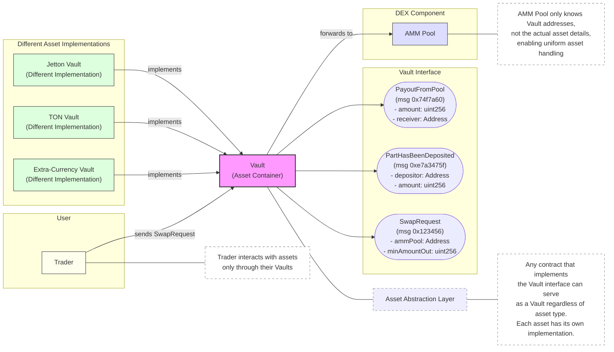
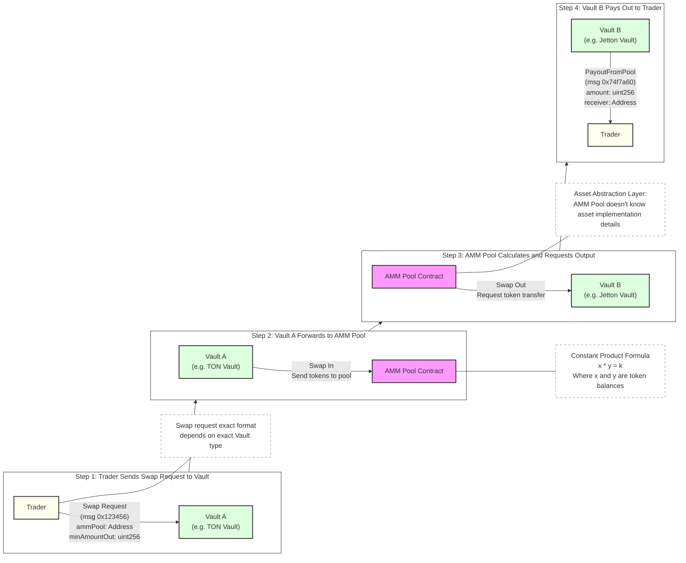
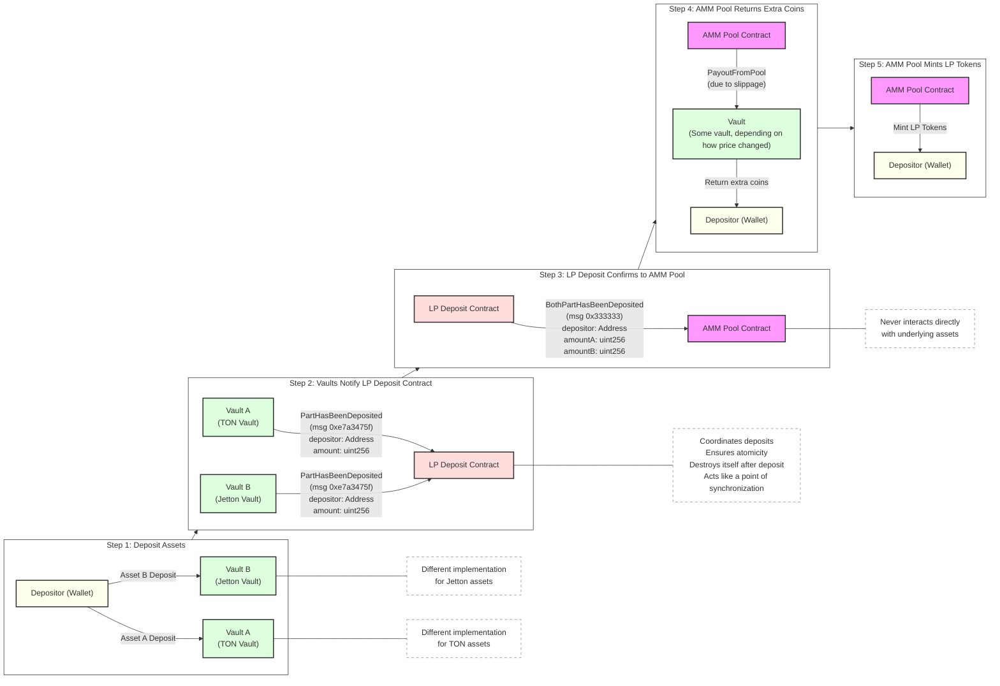

# GitHub Docs Parser - Part 18

        let val: Int = self.testMap38.get(index)!!;
        return val;
    }

    get fun getTest39(index: Int): Int? {
        let val: Int = self.testMap39.get(index)!!;
        return val;
    }

    get fun getTest40(index: Int): Int? {
        let val: Int = self.testMap40.get(index)!!;
        return val;
    }

    get fun getTest41(index: Int): Int? {
        let val: Int = self.testMap41.get(index)!!;
        return val;
    }

    get fun getTest42(index: Int): Int? {
        let val: Int = self.testMap42.get(index)!!;
        return val;
    }

    get fun getTest43(index: Int): Int? {
        let val: Int = self.testMap43.get(index)!!;
        return val;
    }

    get fun getTest44(index: Int): Int? {
        let val: Int = self.testMap44.get(index)!!;
        return val;
    }

    get fun getTest45(index: Int): Int? {
        let val: Int = self.testMap45.get(index)!!;
        return val;
    }

    get fun getTest46(index: Int): Int? {
        let val: Int = self.testMap46.get(index)!!;
        return val;
    }

    get fun getTest47(index: Int): Int? {
        let val: Int = self.testMap47.get(index)!!;
        return val;
    }

    get fun getTest48(index: Int): Int? {
        let val: Int = self.testMap48.get(index)!!;
        return val;
    }

    get fun getTest49(index: Int): Int? {
        let val: Int = self.testMap49.get(index)!!;
        return val;
    }

    get fun getTest50(index: Int): Int? {
        let val: Int = self.testMap50.get(index)!!;
        return val;
    }

    get fun getTest51(index: Int): Int? {
        let val: Int = self.testMap51.get(index)!!;
        return val;
    }

    get fun getTest52(index: Int): Int? {
        let val: Int = self.testMap52.get(index)!!;
        return val;
    }

    get fun getTest53(index: Int): Int? {
        let val: Int = self.testMap53.get(index)!!;
        return val;
    }

    get fun getTest54(index: Int): Int? {
        let val: Int = self.testMap54.get(index)!!;
        return val;
    }

    get fun getTest55(index: Int): Int? {
        let val: Int = self.testMap55.get(index)!!;
        return val;
    }

    get fun getTest56(index: Int): Int? {
        let val: Int = self.testMap56.get(index)!!;
        return val;
    }

    get fun getTest57(index: Int): Int? {
        let val: Int = self.testMap57.get(index)!!;
        return val;
    }

    get fun getTest58(index: Int): Int? {
        let val: Int = self.testMap58.get(index)!!;
        return val;
    }

    get fun getTest59(index: Int): Int? {
        let val: Int = self.testMap59.get(index)!!;
        return val;
    }

    get fun getTest60(index: Int): Int? {
        let val: Int = self.testMap0.get(index)!!;
        return val;
    }

    get fun getTest61(index: Int): Int? {
        let val: Int = self.testMap1.get(index)!!;
        return val;
    }

    get fun getTest62(index: Int): Int? {
        let val: Int = self.testMap2.get(index)!!;
        return val;
    }

    get fun getTest63(index: Int): Int? {
        let val: Int = self.testMap3.get(index)!!;
        return val;
    }

    get fun getTest64(index: Int): Int? {
        let val: Int = self.testMap4.get(index)!!;
        return val;
    }

    get fun getTest65(index: Int): Int? {
        let val: Int = self.testMap5.get(index)!!;
        return val;
    }

    get fun getTest66(index: Int): Int? {
        let val: Int = self.testMap6.get(index)!!;
        return val;
    }

    get fun getTest67(index: Int): Int? {
        let val: Int = self.testMap7.get(index)!!;
        return val;
    }

    get fun getTest68(index: Int): Int? {
        let val: Int = self.testMap8.get(index)!!;
        return val;
    }

    get fun getTest69(index: Int): Int? {
        let val: Int = self.testMap9.get(index)!!;
        return val;
    }

    get fun getTest70(index: Int): Int? {
        let val: Int = self.testMap0.get(index)!!;
        return val;
    }

    get fun getTest71(index: Int): Int? {
        let val: Int = self.testMap1.get(index)!!;
        return val;
    }

    get fun getTest72(index: Int): Int? {
        let val: Int = self.testMap2.get(index)!!;
        return val;
    }

    get fun getTest73(index: Int): Int? {
        let val: Int = self.testMap3.get(index)!!;
        return val;
    }

    get fun getTest74(index: Int): Int? {
        let val: Int = self.testMap4.get(index)!!;
        return val;
    }

    get fun getTest75(index: Int): Int? {
        let val: Int = self.testMap5.get(index)!!;
        return val;
    }
}


================================================
FILE: src/test/codegen/map-uint-bool-get.tact
URL: https://github.com/tact-lang/tact/blob/main/src/test/codegen/map-uint-bool-get.tact
================================================
contract MapUintBool {
    m: map<Int as uint64, Bool>;

    receive() {
        nativeThrowUnless(1024, self.m.get(0) == null);
        self.m.set(0, true);
        self.m.del(0);
    }
}


================================================
FILE: src/test/codegen/message-opcode-parsing.tact
URL: https://github.com/tact-lang/tact/blob/main/src/test/codegen/message-opcode-parsing.tact
================================================
message(0b101010) Binary {}
message(0o53) Octal {}
message(44) Decimal {}
message(0x2D) Hexadecimal {}

contract Example {
    receive(msg: Binary) { }
    receive(msg: Octal) { }
    receive(msg: Decimal) { }
    receive(msg: Hexadecimal) { }
}


================================================
FILE: src/test/codegen/mutating-method-on-non-lvalues.tact
URL: https://github.com/tact-lang/tact/blob/main/src/test/codegen/mutating-method-on-non-lvalues.tact
================================================
struct Foo { x : Int }

extends mutates fun inc(self: Int) { self += 1 }

const GlobalConst: Int = 42;

contract MutatingMethodOnNonLvalues {
    const ContractConst: Int = 43;

    receive("foo") {
        41.inc();
        GlobalConst.inc();
        self.ContractConst.inc();
        Foo {x: 44}.x.inc();
    }
}


================================================
FILE: src/test/codegen/struct-field-func-keywords-name-clash.tact
URL: https://github.com/tact-lang/tact/blob/main/src/test/codegen/struct-field-func-keywords-name-clash.tact
================================================
struct FunCKeywords {
    var: Int;
    ifnot: Int;
    then: Int;
    elseifnot: Int;
    int: Int;
    cell: Int;
    slice: Int;
    builder: Int;
    cont: Int;
    tuple: Int;
    type: Int;
    forall: Int;
    extern: Int;
    global: Int;
    asm: Int;
    impure: Int;
    inline_ref: Int;
    auto_apply: Int;
    method_id: Int;
    operator: Int;
    infix: Int;
    infixl: Int;
    infixr: Int;
}

contract Bar {
    f: FunCKeywords = FunCKeywords {
        var: 1,
        ifnot: 1,
        then: 1,
        elseifnot: 1,
        int: 1,
        cell: 1,
        slice: 1,
        builder: 1,
        cont: 1,
        tuple: 1,
        type: 1,
        forall: 1,
        extern: 1,
        global: 1,
        asm: 1,
        impure: 1,
        inline_ref: 1,
        auto_apply: 1,
        method_id: 1,
        operator: 1,
        infix: 1,
        infixl: 1,
        infixr: 1,
    };
}


================================================
FILE: src/test/codegen/struct-field-storage-annotation.tact
URL: https://github.com/tact-lang/tact/blob/main/src/test/codegen/struct-field-storage-annotation.tact
================================================
import "@stdlib/deploy";

struct TokenInfo {
    ticker: String;
    decimals: Int as uint8; // <------ ISSUE HERE, IF WE REMOVE "as uint8", THE CODE COMPILES WITHOUT PROBLEM
}

// messages can contain maps
message Replace {
    items: map<Int, Address>;
}

contract Maps with Deployable {

    // maps with Int as key
    mi1: map<Int, TokenInfo>;
    mi2: map<Int, Bool>;
    mi3: map<Int, Int>;
    mi4: map<Int, Address>;
    
    // maps with Address as key
    ma1: map<Address, TokenInfo>;
    ma2: map<Address, Bool>;
    ma3: map<Address, Int>;
    ma4: map<Address, Address>;

    init(arg: map<Int, Bool>) {
        // no need to initialize maps if they're empty
        self.mi2 = arg;
    }

    receive("set keys") {
        // keys are Int
        self.mi1.set(17, TokenInfo{ticker: "SHIB", decimals: 9});
        self.mi2.set(0x9377433ff21832, true);
        self.mi3.set(pow(2,240), pow(2,230));
        self.mi4.set(-900, address("EQCD39VS5jcptHL8vMjEXrzGaRcCVYto7HUn4bpAOg8xqB2N"));
        // keys are Address
        self.ma1.set(address("EQCD39VS5jcptHL8vMjEXrzGaRcCVYto7HUn4bpAOg8xqB2N"), TokenInfo{ticker: "DOGE", decimals: 18});
        self.ma2.set(address("UQCD39VS5jcptHL8vMjEXrzGaRcCVYto7HUn4bpAOg8xqEBI"), true);
        self.ma3.set(address("EQCD39VS5jcptHL8vMjEXrzGaRcCVYto7HUn4bpAOg8xqB2N"), ton("1.23"));
        self.ma4.set(address("UQCD39VS5jcptHL8vMjEXrzGaRcCVYto7HUn4bpAOg8xqEBI"), myAddress());
    }

    receive("delete keys") {
        // keys are Int
        self.mi1.set(17, null);
        self.mi2.set(0x9377433ff21832, null);
        self.mi3.set(pow(2,240), null);
        self.mi4.set(-900, null);
        // keys are Address
        self.ma1.set(address("EQCD39VS5jcptHL8vMjEXrzGaRcCVYto7HUn4bpAOg8xqB2N"), null);
        self.ma2.set(address("UQCD39VS5jcptHL8vMjEXrzGaRcCVYto7HUn4bpAOg8xqEBI"), null);
        self.ma3.set(address("EQCD39VS5jcptHL8vMjEXrzGaRcCVYto7HUn4bpAOg8xqB2N"), null);
        self.ma4.set(address("UQCD39VS5jcptHL8vMjEXrzGaRcCVYto7HUn4bpAOg8xqEBI"), null);
    }

    receive("clear") {
        self.mi1 = emptyMap();
        self.mi2 = emptyMap();
        self.mi3 = emptyMap();
        self.mi4 = emptyMap();
        self.ma1 = emptyMap();
        self.ma2 = emptyMap();
        self.ma3 = emptyMap();
        self.ma4 = emptyMap();
    }

    receive(msg: Replace) {
        // replace all items in the map with those coming in the message
        self.mi4 = msg.items;
    }

    // if the key is not found, the get() method returns null
    get fun oneItem(key: Int): Address? {
        return self.mi4.get(key);
    }

    get fun itemCheck(): String {
        if (self.mi1.get(17) == null) {
            return "not found";
        }
        let item: TokenInfo = self.mi1.get(17)!!; // the !! will tell the compiler it's not null
        return item.ticker;
    }

    // you can return maps from getters
    get fun allItems(): map<Address, TokenInfo> {
        return self.ma1;
    }
}


================================================
FILE: src/test/codegen/struct-field-to-cell-in-receiver.tact
URL: https://github.com/tact-lang/tact/blob/main/src/test/codegen/struct-field-to-cell-in-receiver.tact
================================================
struct MyStruct {
    x: Int;
    y: Int;
    z: Int;
}

contract MyContract {
    myField: MyStruct;

    init(x: Int, y: Int, z: Int) {
        self.myField = MyStruct { x: x, y: y, z: z };
    }

    receive() {
        self.reply(self.myField.toCell()); // this line is causing the error
    }
}


================================================
FILE: src/test/codegen/struct-with-default-and-optional-fields.tact
URL: https://github.com/tact-lang/tact/blob/main/src/test/codegen/struct-with-default-and-optional-fields.tact
================================================
struct Position {
    tokenId: Int as uint16 = 1;
    foo: Int?;
}

contract Test {
    receive ("test") {
         let p: Position = Position{ };
         dump(p.tokenId);
    }
}


================================================
FILE: src/test/codegen/ternary-with-struct-construction.tact
URL: https://github.com/tact-lang/tact/blob/main/src/test/codegen/ternary-with-struct-construction.tact
================================================
struct Info {
    owner: Address;
    minter: Address;
}

contract ExampleTernaryWithStructConstruction(
    owner: Address,
    minter: Address,
) {
    receive() {
        let foo = true ? Info{
                    owner: self.owner,
                    minter: self.minter } : null;
        if (foo != null) {
            dump(foo!!.owner);
            dump(foo!!.minter);
        }
    }
}


================================================
FILE: src/test/codegen/var-scope-global-fun-shadowing-allowed.tact
URL: https://github.com/tact-lang/tact/blob/main/src/test/codegen/var-scope-global-fun-shadowing-allowed.tact
================================================
contract TestGlobalFunctionShadowing {
    receive("foo") {
        let sender = sender();
    }
}


================================================
FILE: src/test/compilation-failed/contracts/const-eval-ascii-empty.tact
URL: https://github.com/tact-lang/tact/blob/main/src/test/compilation-failed/contracts/const-eval-ascii-empty.tact
================================================
contract AsciiOverflow {
    get fun getAscii_fail(): Int {
        return ascii("");
    }
}


================================================
FILE: src/test/compilation-failed/contracts/const-eval-ascii-overflow-2.tact
URL: https://github.com/tact-lang/tact/blob/main/src/test/compilation-failed/contracts/const-eval-ascii-overflow-2.tact
================================================
contract AsciiOverflow {
    get fun getAscii_fail(): Int {
        return ascii("⚡⚡⚡⚡⚡⚡⚡⚡⚡⚡⚡");
    }
}


================================================
FILE: src/test/compilation-failed/contracts/const-eval-ascii-overflow.tact
URL: https://github.com/tact-lang/tact/blob/main/src/test/compilation-failed/contracts/const-eval-ascii-overflow.tact
================================================
contract AsciiOverflow {
    get fun getAscii_fail(): Int {
        return ascii("000000000000000000000000000000000");
    }
}


================================================
FILE: src/test/compilation-failed/contracts/const-eval-constant-circular-dependency-self-assignment.tact
URL: https://github.com/tact-lang/tact/blob/main/src/test/compilation-failed/contracts/const-eval-constant-circular-dependency-self-assignment.tact
================================================
const A: Int = A;

contract Test {
    get fun getConstant(): Int {
        return A;
    }
}


================================================
FILE: src/test/compilation-failed/contracts/const-eval-constant-circular-dependency-with-deep-recursive-function.tact
URL: https://github.com/tact-lang/tact/blob/main/src/test/compilation-failed/contracts/const-eval-constant-circular-dependency-with-deep-recursive-function.tact
================================================
const A: Int = foo(20);
const C: Int = A;

fun foo(value: Int): Int {
    if (value > 1) {
        return foo(value - 1)
    }
    return C;
}

contract Test {
    get fun getConstant(): Int {
        return C;
    }
}


================================================
FILE: src/test/compilation-failed/contracts/const-eval-constant-circular-dependency-with-function.tact
URL: https://github.com/tact-lang/tact/blob/main/src/test/compilation-failed/contracts/const-eval-constant-circular-dependency-with-function.tact
================================================
const A: Int = foo();
const C: Int = A;

fun foo(): Int {
    return C;
}

contract Test {
    get fun getConstant(): Int {
        return C;
    }
}


================================================
FILE: src/test/compilation-failed/contracts/const-eval-constant-circular-dependency-with-functions.tact
URL: https://github.com/tact-lang/tact/blob/main/src/test/compilation-failed/contracts/const-eval-constant-circular-dependency-with-functions.tact
================================================
const A: Int = foo();
const C: Int = A;

fun foo(): Int {
    return bar()
}

fun bar(): Int {
    return baz()
}

fun baz(): Int {
    return C
}

contract Test {
    get fun getConstant(): Int {
        return C;
    }
}


================================================
FILE: src/test/compilation-failed/contracts/const-eval-constant-circular-dependency-with-recursive-function.tact
URL: https://github.com/tact-lang/tact/blob/main/src/test/compilation-failed/contracts/const-eval-constant-circular-dependency-with-recursive-function.tact
================================================
const A: Int = foo(3);
const C: Int = A;

fun foo(value: Int): Int {
    if (value > 1) {
        return foo(value - 1)
    }
    return C;
}

contract Test {
    get fun getConstant(): Int {
        return C;
    }
}


================================================
FILE: src/test/compilation-failed/contracts/const-eval-constant-circular-dependency.tact
URL: https://github.com/tact-lang/tact/blob/main/src/test/compilation-failed/contracts/const-eval-constant-circular-dependency.tact
================================================
const A: Int = C;
const C: Int = A;

contract Test {
    get fun getConstant(): Int {
        return C;
    }
}


================================================
FILE: src/test/compilation-failed/contracts/const-eval-constant-deep-circular-dependency.tact
URL: https://github.com/tact-lang/tact/blob/main/src/test/compilation-failed/contracts/const-eval-constant-deep-circular-dependency.tact
================================================
const A: Int = E;
const B: Int = A;
const C: Int = B;
const D: Int = C;
const E: Int = D;

contract Test {
    get fun getConstant(): Int {
        return E;
    }
}


================================================
FILE: src/test/compilation-failed/contracts/const-eval-div-by-zero-in-fun.tact
URL: https://github.com/tact-lang/tact/blob/main/src/test/compilation-failed/contracts/const-eval-div-by-zero-in-fun.tact
================================================
fun functionTest(): Int {
    let result = 100;
    let i = 2;
    repeat(5) {
        i -= 1;
        result /= i;
    }
    return result;
}

contract ConstEvalNegativeTest {
    get fun something(): Int {
        return functionTest();
    }
}


================================================
FILE: src/test/compilation-failed/contracts/const-eval-div-by-zero.tact
URL: https://github.com/tact-lang/tact/blob/main/src/test/compilation-failed/contracts/const-eval-div-by-zero.tact
================================================
contract ConstEvalNegativeTest {
    get fun something(): Int {
        return 2 / 0;
    }
}


================================================
FILE: src/test/compilation-failed/contracts/const-eval-int-overflow-add-in-fun.tact
URL: https://github.com/tact-lang/tact/blob/main/src/test/compilation-failed/contracts/const-eval-int-overflow-add-in-fun.tact
================================================
fun functionTest(v: Int): Int {
    // (2 ** 256 - 2)
    let result = 115792089237316195423570985008687907853269984665640564039457584007913129639934;
    if (v >= 10) {
        result += 1;
        if (v >= 15) {
            result += 1;
        }
    }
    return result;
}

contract ConstEvalNegativeTest {
    get fun something(): Int {
        return functionTest(15);
    }
}


================================================
FILE: src/test/compilation-failed/contracts/const-eval-int-overflow-add.tact
URL: https://github.com/tact-lang/tact/blob/main/src/test/compilation-failed/contracts/const-eval-int-overflow-add.tact
================================================
contract ConstEvalNegativeTest {
    get fun something(): Int {
        // (2 ** 256 - 1) + 1
        return 115792089237316195423570985008687907853269984665640564039457584007913129639935 + 1;
    }
}


================================================
FILE: src/test/compilation-failed/contracts/const-eval-int-overflow-div-in-fun.tact
URL: https://github.com/tact-lang/tact/blob/main/src/test/compilation-failed/contracts/const-eval-int-overflow-div-in-fun.tact
================================================
fun functionTest(v: Int): Int {
    // -(2 ** 256)
    let result = -115792089237316195423570985008687907853269984665640564039457584007913129639936;
    if (v >= 10) {
        result /= -1;
    }
    return result;
}

contract ConstEvalNegativeTest {
    get fun something(): Int {
        return functionTest(10);
    }
}


================================================
FILE: src/test/compilation-failed/contracts/const-eval-int-overflow-div.tact
URL: https://github.com/tact-lang/tact/blob/main/src/test/compilation-failed/contracts/const-eval-int-overflow-div.tact
================================================
contract ConstEvalNegativeTest {
    get fun something(): Int {
        // -(2 ** 256) / -1
        return -115792089237316195423570985008687907853269984665640564039457584007913129639936 / -1;
    }
}


================================================
FILE: src/test/compilation-failed/contracts/const-eval-int-overflow-mul1-in-fun.tact
URL: https://github.com/tact-lang/tact/blob/main/src/test/compilation-failed/contracts/const-eval-int-overflow-mul1-in-fun.tact
================================================
fun functionTest(): Int {
    // (2 ** 256 - 1)
    let result = 115792089237316195423570985008687907853269984665640564039457584007913129639935;
    repeat(5) {
        result *= 2;
    }
    return result;
}

contract ConstEvalNegativeTest {
    get fun something(): Int {
        return functionTest();
    }
}


================================================
FILE: src/test/compilation-failed/contracts/const-eval-int-overflow-mul1.tact
URL: https://github.com/tact-lang/tact/blob/main/src/test/compilation-failed/contracts/const-eval-int-overflow-mul1.tact
================================================
contract ConstEvalNegativeTest {
    get fun something(): Int {
        // 2 * (2 ** 256 - 1)
        return 2 * 115792089237316195423570985008687907853269984665640564039457584007913129639935;
    }
}


================================================
FILE: src/test/compilation-failed/contracts/const-eval-int-overflow-mul2-in-fun.tact
URL: https://github.com/tact-lang/tact/blob/main/src/test/compilation-failed/contracts/const-eval-int-overflow-mul2-in-fun.tact
================================================
fun functionTest(): Int {
    // -(2 ** 256)
    let result = -115792089237316195423570985008687907853269984665640564039457584007913129639936;
    do {
        result *= 2;
    } until (false);
    return result;
}

contract ConstEvalNegativeTest {
    get fun something(): Int {
        return functionTest();
    }
}


================================================
FILE: src/test/compilation-failed/contracts/const-eval-int-overflow-mul2.tact
URL: https://github.com/tact-lang/tact/blob/main/src/test/compilation-failed/contracts/const-eval-int-overflow-mul2.tact
================================================
contract ConstEvalNegativeTest {
    get fun something(): Int {
        // 2 * -(2 ** 256)
        return 2 * -115792089237316195423570985008687907853269984665640564039457584007913129639936;
    }
}


================================================
FILE: src/test/compilation-failed/contracts/const-eval-int-overflow-negative-literal-in-fun.tact
URL: https://github.com/tact-lang/tact/blob/main/src/test/compilation-failed/contracts/const-eval-int-overflow-negative-literal-in-fun.tact
================================================
fun functionTest(): Int {
    repeat(5) {
        // - (2 ** 256 + 1)
        let i = -115792089237316195423570985008687907853269984665640564039457584007913129639937;
    }
    return 0;
}

contract ConstEvalNegativeTest {
    get fun something(): Int {
        return functionTest();
    }
}


================================================
FILE: src/test/compilation-failed/contracts/const-eval-int-overflow-negative-literal.tact
URL: https://github.com/tact-lang/tact/blob/main/src/test/compilation-failed/contracts/const-eval-int-overflow-negative-literal.tact
================================================
contract ConstEvalNegativeTest {
    get fun something(): Int {
        // - (2 ** 256 + 1)
        // actually Tact does not have proper negative integer literals
        // there is a special case for a unary negation of positive literals hardcoded
        // into the const evaluator
        return -115792089237316195423570985008687907853269984665640564039457584007913129639937;
    }
}


================================================
FILE: src/test/compilation-failed/contracts/const-eval-int-overflow-positive-literal-in-fun.tact
URL: https://github.com/tact-lang/tact/blob/main/src/test/compilation-failed/contracts/const-eval-int-overflow-positive-literal-in-fun.tact
================================================
fun functionTest(): Int {
    while (true) {
        // 2 ** 256
        let i = 115792089237316195423570985008687907853269984665640564039457584007913129639936;
    }
    return 0;
}

contract ConstEvalNegativeTest {
    get fun something(): Int {
        return functionTest();
    }
}


================================================
FILE: src/test/compilation-failed/contracts/const-eval-int-overflow-positive-literal.tact
URL: https://github.com/tact-lang/tact/blob/main/src/test/compilation-failed/contracts/const-eval-int-overflow-positive-literal.tact
================================================
contract ConstEvalNegativeTest {
    get fun something(): Int {
        // 2 ** 256
        return 115792089237316195423570985008687907853269984665640564039457584007913129639936;
    }
}


================================================
FILE: src/test/compilation-failed/contracts/const-eval-int-overflow-pow-1.tact
URL: https://github.com/tact-lang/tact/blob/main/src/test/compilation-failed/contracts/const-eval-int-overflow-pow-1.tact
================================================
contract ConstEvalNegativeTest {
    get fun test_pow(): Int {
        // negative exponent
        return pow(1, -42);
    }
}


================================================
FILE: src/test/compilation-failed/contracts/const-eval-int-overflow-pow-2.tact
URL: https://github.com/tact-lang/tact/blob/main/src/test/compilation-failed/contracts/const-eval-int-overflow-pow-2.tact
================================================
contract ConstEvalNegativeTest {
    get fun test_pow(): Int {
        // integer overflow
        return pow(-2, 256);
    }
}


================================================
FILE: src/test/compilation-failed/contracts/const-eval-int-overflow-pow2-1.tact
URL: https://github.com/tact-lang/tact/blob/main/src/test/compilation-failed/contracts/const-eval-int-overflow-pow2-1.tact
================================================
contract ConstEvalNegativeTest {
    get fun test_pow(): Int {
        // negative exponent
        return pow2(-42);
    }
}


================================================
FILE: src/test/compilation-failed/contracts/const-eval-int-overflow-pow2-2.tact
URL: https://github.com/tact-lang/tact/blob/main/src/test/compilation-failed/contracts/const-eval-int-overflow-pow2-2.tact
================================================
contract ConstEvalNegativeTest {
    get fun test_pow(): Int {
        // integer overflow
        return pow2(256);
    }
}


================================================
FILE: src/test/compilation-failed/contracts/const-eval-int-overflow-shl1.tact
URL: https://github.com/tact-lang/tact/blob/main/src/test/compilation-failed/contracts/const-eval-int-overflow-shl1.tact
================================================
contract ConstEvalNegativeTest {
    get fun something(): Int {
        return 1 << 256;
    }
}


================================================
FILE: src/test/compilation-failed/contracts/const-eval-int-overflow-shl2.tact
URL: https://github.com/tact-lang/tact/blob/main/src/test/compilation-failed/contracts/const-eval-int-overflow-shl2.tact
================================================
contract ConstEvalNegativeTest {
    get fun something(): Int {
        return -115792089237316195423570985008687907853269984665640564039457584007913129639936 << 256;
    }
}


================================================
FILE: src/test/compilation-failed/contracts/const-eval-int-overflow-struct-instance-in-fun.tact
URL: https://github.com/tact-lang/tact/blob/main/src/test/compilation-failed/contracts/const-eval-int-overflow-struct-instance-in-fun.tact
================================================
struct Foo {
    x: Int;
    y: Bool;
}

// Overflow in recursive call
fun functionTest(i: Int): Int {
    functionTest(2 * i);
    return 0;
}

contract ConstEvalNegativeTest {
    get fun test_struct(): Foo {
        return Foo {y: false, x: functionTest(pow2(253))};
    }
}


================================================
FILE: src/test/compilation-failed/contracts/const-eval-int-overflow-struct-instance.tact
URL: https://github.com/tact-lang/tact/blob/main/src/test/compilation-failed/contracts/const-eval-int-overflow-struct-instance.tact
================================================
struct Foo {
    x: Int;
    y: Bool;
}

contract ConstEvalNegativeTest {
    get fun test_struct(): Foo {
        return Foo {y: false, x: pow2(255) * 2};
    }
}


================================================
FILE: src/test/compilation-failed/contracts/const-eval-int-overflow-sub.tact
URL: https://github.com/tact-lang/tact/blob/main/src/test/compilation-failed/contracts/const-eval-int-overflow-sub.tact
================================================
contract ConstEvalNegativeTest {
    get fun something(): Int {
        // -2 - (2**256 - 1)
        return -2 - 115792089237316195423570985008687907853269984665640564039457584007913129639935;
    }
}


================================================
FILE: src/test/compilation-failed/contracts/const-eval-int-overflow-ton1.tact
URL: https://github.com/tact-lang/tact/blob/main/src/test/compilation-failed/contracts/const-eval-int-overflow-ton1.tact
================================================
contract ConstEvalNegativeTest {
    get fun test_ton(): Int {
        // too many digits after the decimal point
        return ton("1.0123456789");
    }
}


================================================
FILE: src/test/compilation-failed/contracts/const-eval-int-overflow-ton2.tact
URL: https://github.com/tact-lang/tact/blob/main/src/test/compilation-failed/contracts/const-eval-int-overflow-ton2.tact
================================================
contract ConstEvalNegativeTest {
    get fun test_ton(): Int {
        // the number of tons does not fit TVM int
        return ton("115792089237316195423570985008687907853269984665640564039457584007913.129639936");
    }
}


================================================
FILE: src/test/compilation-failed/contracts/const-eval-invalid-address.tact
URL: https://github.com/tact-lang/tact/blob/main/src/test/compilation-failed/contracts/const-eval-invalid-address.tact
================================================
contract ConstEvalNegativeTest {
    get fun test_address(): Address {
        return address("FQCD39VS5jcptHL8vMjEXrzGaRcCVYto7HUn4bpAOg8xqB2N");
    }
}


================================================
FILE: src/test/compilation-failed/contracts/const-eval-mod-by-zero.tact
URL: https://github.com/tact-lang/tact/blob/main/src/test/compilation-failed/contracts/const-eval-mod-by-zero.tact
================================================
contract ConstEvalNegativeTest {
    get fun something(): Int {
        return 2 % 0;
    }
}


================================================
FILE: src/test/compilation-failed/contracts/const-eval-rawslice-invalid.tact
URL: https://github.com/tact-lang/tact/blob/main/src/test/compilation-failed/contracts/const-eval-rawslice-invalid.tact
================================================
contract AsciiOverflow {
    get fun getRawSlice_fail(): Slice {
        return rawSlice("4a__");
    }
}


================================================
FILE: src/test/compilation-failed/contracts/const-eval-rawslice-not-hex.tact
URL: https://github.com/tact-lang/tact/blob/main/src/test/compilation-failed/contracts/const-eval-rawslice-not-hex.tact
================================================
contract AsciiOverflow {
    get fun getRawSlice_fail(): Slice {
        return rawSlice("hello world");
    }
}


================================================
FILE: src/test/compilation-failed/contracts/const-eval-rawslice-overflow-padded.tact
URL: https://github.com/tact-lang/tact/blob/main/src/test/compilation-failed/contracts/const-eval-rawslice-overflow-padded.tact
================================================
contract AsciiOverflow {
    get fun getRawSlice_fail(): Slice {
        return rawSlice("abcdabcdabcdabcdabcdabcdabcdabcdabcdabcdabcdabcdabcdabcdabcdabcdabcdabcdabcdabcdabcdabcdabcdabcdabcdabcdabcdabcdabcdabcdabcdabcdabcdabcdabcdabcdabcdabcdabcdabcdabcdabcdabcdabcdabcdabcdabcdabcdabcdabcdabcdabcdabcdabcdabcdabcdabcdabcdabcdabcdabcdabcdabcdabcd8_");
    }
}


================================================
FILE: src/test/compilation-failed/contracts/const-eval-rawslice-overflow.tact
URL: https://github.com/tact-lang/tact/blob/main/src/test/compilation-failed/contracts/const-eval-rawslice-overflow.tact
================================================
contract AsciiOverflow {
    get fun getRawSlice_fail(): Slice {
        return rawSlice("abcdabcdabcdabcdabcdabcdabcdabcdabcdabcdabcdabcdabcdabcdabcdabcdabcdabcdabcdabcdabcdabcdabcdabcdabcdabcdabcdabcdabcdabcdabcdabcdabcdabcdabcdabcdabcdabcdabcdabcdabcdabcdabcdabcdabcdabcdabcdabcdabcdabcdabcdabcdabcdabcdabcdabcdabcdabcdabcdabcdabcdabcdabcdabcd");
    }
}


================================================
FILE: src/test/compilation-failed/contracts/const-eval-repeat-lower-bound.tact
URL: https://github.com/tact-lang/tact/blob/main/src/test/compilation-failed/contracts/const-eval-repeat-lower-bound.tact
================================================
fun functionTest(): Int {
    // -(2 ** 256)
    let i = -115792089237316195423570985008687907853269984665640564039457584007913129639936;
    repeat (i - 1) {  // Causes an overflow error
        // do nothing
    }
    return i;
}

contract ConstEvalNegativeTest {
    get fun something(): Int {
        return functionTest();
    }
}


================================================
FILE: src/test/compilation-failed/contracts/const-eval-repeat-upper-bound.tact
URL: https://github.com/tact-lang/tact/blob/main/src/test/compilation-failed/contracts/const-eval-repeat-upper-bound.tact
================================================
fun functionTest(): Int {
    // (2 ** 31 - 1)
    let i = 2147483647;
    repeat (i + 1) {  // Causes a repeat bound error
        // do nothing
    }
    return i;
}

contract ConstEvalNegativeTest {
    get fun something(): Int {
        return functionTest();
    }
}


================================================
FILE: src/test/compilation-failed/contracts/const-eval-self-constant-assign-field.tact
URL: https://github.com/tact-lang/tact/blob/main/src/test/compilation-failed/contracts/const-eval-self-constant-assign-field.tact
================================================
contract Test {
    const A: Int = self.value;

    value: Int = 10;

    get fun getConstant(): Int {
        return self.A;
    }
}


================================================
FILE: src/test/compilation-failed/contracts/const-eval-self-constant-circular-dependency-self-assignment.tact
URL: https://github.com/tact-lang/tact/blob/main/src/test/compilation-failed/contracts/const-eval-self-constant-circular-dependency-self-assignment.tact
================================================
contract Test {
    const A: Int = self.A;

    get fun getConstant(): Int {
        return self.A;
    }
}


================================================
FILE: src/test/compilation-failed/contracts/const-eval-self-constant-circular-dependency.tact
URL: https://github.com/tact-lang/tact/blob/main/src/test/compilation-failed/contracts/const-eval-self-constant-circular-dependency.tact
================================================
contract Test {
    const A: Int = self.C;
    const C: Int = self.A;

    get fun getConstant(): Int {
        return self.C;
    }
}


================================================
FILE: src/test/compilation-failed/contracts/const-eval-self-constant-deep-circular-dependency.tact
URL: https://github.com/tact-lang/tact/blob/main/src/test/compilation-failed/contracts/const-eval-self-constant-deep-circular-dependency.tact
================================================
contract Test {
    const A: Int = self.E;
    const B: Int = self.A;
    const C: Int = self.B;
    const D: Int = self.C;
    const E: Int = self.D;

    get fun getConstant(): Int {
        return self.E;
    }
}


================================================
FILE: src/test/compilation-failed/contracts/const-eval-self-constant-with-method-call-in-value.tact
URL: https://github.com/tact-lang/tact/blob/main/src/test/compilation-failed/contracts/const-eval-self-constant-with-method-call-in-value.tact
================================================
contract Test {
    a: Int = 1;

    const B: Int = 10;
    const A: Int = self.B + self.test();

    fun test(): Int {
        return self.a;
    }
}


================================================
FILE: src/test/compilation-failed/contracts/const-eval-shl-invalid-bits1.tact
URL: https://github.com/tact-lang/tact/blob/main/src/test/compilation-failed/contracts/const-eval-shl-invalid-bits1.tact
================================================
contract ConstEvalNegativeTest {
    get fun something(): Int {
        // the number of shifted bits is too large
        return 0 << 257;
    }
}


================================================
FILE: src/test/compilation-failed/contracts/const-eval-shl-invalid-bits2.tact
URL: https://github.com/tact-lang/tact/blob/main/src/test/compilation-failed/contracts/const-eval-shl-invalid-bits2.tact
================================================
contract ConstEvalNegativeTest {
    get fun something(): Int {
        // the number of shifted bits cannot be negative
        return 1 << -1;
    }
}


================================================
FILE: src/test/compilation-failed/contracts/const-eval-unboxing-null.tact
URL: https://github.com/tact-lang/tact/blob/main/src/test/compilation-failed/contracts/const-eval-unboxing-null.tact
================================================
contract ConstEvalNegativeTest {
    get fun something(): Int {
        return (false ? 42 : null)!!;
    }
}


================================================
FILE: src/test/compilation-failed/contracts/contract-duplicate-bounced-opcode.tact
URL: https://github.com/tact-lang/tact/blob/main/src/test/compilation-failed/contracts/contract-duplicate-bounced-opcode.tact
================================================
message(1) Msg1 {}
message(1) Msg2 {}

contract Test {
    bounced(msg: Msg1) { }
    bounced(msg: Msg2) { }
}


================================================
FILE: src/test/compilation-failed/contracts/contract-duplicate-external-opcode.tact
URL: https://github.com/tact-lang/tact/blob/main/src/test/compilation-failed/contracts/contract-duplicate-external-opcode.tact
================================================
message(1) Msg1 {}
message(1) Msg2 {}

contract Test {
    external(msg: Msg1) { }
    external(msg: Msg2) { }
}


================================================
FILE: src/test/compilation-failed/contracts/contract-duplicate-receiver-opcode.tact
URL: https://github.com/tact-lang/tact/blob/main/src/test/compilation-failed/contracts/contract-duplicate-receiver-opcode.tact
================================================
message(1) Msg1 {}
message(1 + 0) Msg2 {}

contract Test {
    receive(msg: Msg1) { }
    receive(msg: Msg2) { }
}


================================================
FILE: src/test/compilation-failed/contracts/func-function-does-not-exist.tact
URL: https://github.com/tact-lang/tact/blob/main/src/test/compilation-failed/contracts/func-function-does-not-exist.tact
================================================
@name(iDoNotExist)
native youDo();

contract Test {
   get fun test() {
       youDo();
   }
}


================================================
FILE: src/test/compilation-failed/contracts/import-out-of-project-root.tact
URL: https://github.com/tact-lang/tact/blob/main/src/test/compilation-failed/contracts/import-out-of-project-root.tact
================================================
import "../../e2e-emulated/debug/dump.tact";


================================================
FILE: src/test/compilation-failed/contracts/map-literal-cell.tact
URL: https://github.com/tact-lang/tact/blob/main/src/test/compilation-failed/contracts/map-literal-cell.tact
================================================
contract MapLiteralCell {
    get fun cell(): map<Int as uint4, Cell> {
        return map<Int as uint4, Cell> {
            1: emptyCell(),
            2: beginCell().storeUint(1, 1).endCell(),
        };
    }
}


================================================
FILE: src/test/compilation-failed/contracts/map-literal-int-key-out-of-range.tact
URL: https://github.com/tact-lang/tact/blob/main/src/test/compilation-failed/contracts/map-literal-int-key-out-of-range.tact
================================================
contract C {
    get fun test(): Int {
        let m: map<Int as int8, Int> = map<Int as int8, Int> {
            -129: 0,
        };
        return m.get(2)!!;
    }
}


================================================
FILE: src/test/compilation-failed/contracts/map-literal-int-val-out-of-range.tact
URL: https://github.com/tact-lang/tact/blob/main/src/test/compilation-failed/contracts/map-literal-int-val-out-of-range.tact
================================================
contract C {
    get fun test(): Int {
        let m: map<Int, Int as int4> = map<Int, Int as int4> {
            0: 8,
        };
        return m.get(2)!!;
    }
}


================================================
FILE: src/test/compilation-failed/contracts/map-literal-runtime.tact
URL: https://github.com/tact-lang/tact/blob/main/src/test/compilation-failed/contracts/map-literal-runtime.tact
================================================
contract MapLiteralRuntime {
    get fun runtime(x: Int): map<Int as uint4, Int as uint4> {
        return map<Int as uint4, Int as uint4> {
            1: x,
            2: x,
        };
    }
}


================================================
FILE: src/test/compilation-failed/contracts/map-literal-structs.tact
URL: https://github.com/tact-lang/tact/blob/main/src/test/compilation-failed/contracts/map-literal-structs.tact
================================================
struct Foo {
    x: Int;
    y: Int;
}

contract MapLiteralStructs {
    get fun structs(): map<Int as uint16, Foo> {
        return map<Int as uint16, Foo> {
            1: Foo { x: 1, y: 2 },
            2: Foo { x: 0, y: 1 },
        };
    }
}


================================================
FILE: src/test/compilation-failed/contracts/map-literal-uint-key-out-of-range.tact
URL: https://github.com/tact-lang/tact/blob/main/src/test/compilation-failed/contracts/map-literal-uint-key-out-of-range.tact
================================================
contract C {
    get fun test(): Int {
        let m: map<Int as uint1, Int> = map<Int as uint1, Int> {
            2: 0,    // key 2 is out of range for uint1 (0..1)
        };
        return m.get(2)!!;
    }
}


================================================
FILE: src/test/compilation-failed/contracts/map-literal-uint-val-out-of-range.tact
URL: https://github.com/tact-lang/tact/blob/main/src/test/compilation-failed/contracts/map-literal-uint-val-out-of-range.tact
================================================
contract C {
    get fun test(): Int {
        let m: map<Int, Int as uint4> = map<Int, Int as uint4> {
            2: 16,
        };
        return m.get(2)!!;
    }
}


================================================
FILE: src/test/compilation-failed/contracts/map-literal-varint-val-out-of-range.tact
URL: https://github.com/tact-lang/tact/blob/main/src/test/compilation-failed/contracts/map-literal-varint-val-out-of-range.tact
================================================
contract C {
    get fun test(): Int {
        let m: map<Int, Int as varint32> = map<Int, Int as varint32> {
            2: -pow2(31 * 8 - 1) - 1,
        };
        return m.get(2)!!;
    }
}


================================================
FILE: src/test/compilation-failed/contracts/map-literal-varuint-val-out-of-range.tact
URL: https://github.com/tact-lang/tact/blob/main/src/test/compilation-failed/contracts/map-literal-varuint-val-out-of-range.tact
================================================
contract C {
    get fun test(): Int {
        let m: map<Int, Int as coins> = map<Int, Int as coins> {
            2: pow2(120),
        };
        return m.get(2)!!;
    }
}


================================================
FILE: src/test/compilation-failed/contracts/scope-const-shadows-stdlib-ident.tact
URL: https://github.com/tact-lang/tact/blob/main/src/test/compilation-failed/contracts/scope-const-shadows-stdlib-ident.tact
================================================
const b: Int = 42;


================================================
FILE: src/test/compilation-failed/contracts/sha256-expects-string-or-slice.tact
URL: https://github.com/tact-lang/tact/blob/main/src/test/compilation-failed/contracts/sha256-expects-string-or-slice.tact
================================================
contract Sha256 {
    val: Int = 0;
    receive() {
        sha256(self.val);
    }
}


================================================
FILE: src/test/compilation-failed/contracts/stdlib-skipBits.tact
URL: https://github.com/tact-lang/tact/blob/main/src/test/compilation-failed/contracts/stdlib-skipBits.tact
================================================
contract StdlibSkipBits {
    receive() {
        let s: Slice = beginCell().storeUint(123, 64).endCell().asSlice();
        let r: Int = s.loadUint(1);
        s.skipBits(1);
        let x: Slice = s.skipBits(1);
    }
}


================================================
FILE: src/test/compilation-failed/contracts/symlink-child.tact
URL: https://github.com/tact-lang/tact/blob/main/src/test/compilation-failed/contracts/symlink-child.tact
================================================
import "./symlink-child";
contract Test { }


================================================
FILE: src/test/compilation-failed/contracts/symlink-parent.tact
URL: https://github.com/tact-lang/tact/blob/main/src/test/compilation-failed/contracts/symlink-parent.tact
================================================
import "./symlink-child";
contract Test { }


================================================
FILE: src/test/compilation-failed/contracts/throw-in-fallback-receiver-large-positive.tact
URL: https://github.com/tact-lang/tact/blob/main/src/test/compilation-failed/contracts/throw-in-fallback-receiver-large-positive.tact
================================================
contract ThrowInFallbackReceiver {
    receive(_: Slice) {
        // exit codes must be in the range of 0..2^16 - 1
        throw(57896044618658097711785492504343953926634992332820282019728792003956564819968);
    }
}


================================================
FILE: src/test/compilation-failed/contracts/throw-in-fallback-receiver-negative.tact
URL: https://github.com/tact-lang/tact/blob/main/src/test/compilation-failed/contracts/throw-in-fallback-receiver-negative.tact
================================================
contract ThrowInFallbackReceiver {
    receive(_: Slice) {
        // exit codes must be in the range of 0..2^16 - 1
        throw(-14);
    }
}


================================================
FILE: src/test/e2e-emulated/asm/asm-functions.tact
URL: https://github.com/tact-lang/tact/blob/main/src/test/e2e-emulated/asm/asm-functions.tact
================================================
contract AsmFunctionsTester {
    /// To handle deployment
    receive() {}

    get fun testAsmStoreDict(): Bool {
        let m: map<Int, Int> = emptyMap();
        m.set(35, 34);
        m.set(42, 27);

        let s = beginCell().asmStoreDict(m.asCell()).asSlice();
        let m2: map<Int, Int> = s.asmLoadMapIntInt().val;

        return m2 == m;
    }

    get fun testAsmLoadCoins(): Bool {
        let s = beginCell().storeCoins(42).asSlice();
        return s.asmLoadCoins().val == 42;
    }

    get fun testAsmLoadCoinsMut(): Bool {
        let s = beginCell().storeCoins(42).asSlice();
        return s.asmLoadCoinsMut() == 42 && s.empty();
    }

    // asmLoadCoinsMut(), but with data supplied at runtime
    get fun testAsmLoadCoinsMutRuntime(c: Cell): Int {
        let s = c.asSlice();
        let res = s.asmLoadCoinsMut();
        s.endParse(); // like .empty(), but throws on failure
        return res;
    }

    get fun testAsmLoadInt(): Bool {
        let s = beginCell().storeInt(42, 7).asSlice();
        return s.asmLoadInt(7).val == 42;
    }

    get fun testAsmDebugStr(): Bool {
        asmDebugStr();
        return true;
    }

    get fun testAsmCreateUseWord(): Bool {
        return asmCreateUseWord(6) == 7;
    }

    get fun testAsmSecondToLast(): Bool {
        return asmSecondToLast(Two{ a: 1, b: 2 }, Two{ a: 3, b: 4 }) == 3;
    }

    // asmSecondToLast(), but with data supplied at runtime
    get fun testAsmSecondToLastRuntime(s1: Two, s2: Two): Int {
        return asmSecondToLast(s1, s2);
    }

    get fun testAsmFirst(): Bool {
        return asmFirst(
            TwoInTwo{ a: Two{ a: 1, b: 2}, b: Two{ a: 3, b: 4 } },
            TwoInTwo{ a: Two{ a: 5, b: 6}, b: Two{ a: 7, b: 8 } },
            TwoInTwo{ a: Two{ a: 9, b: 10}, b: Two{ a: 11, b: 12 } },
        ) == 1;
    }

    // asmFirst(), but with data supplied at runtime
    get fun testAsmFirstRuntime(s1: TwoInTwo, s2: TwoInTwo, s3: TwoInTwo): Int {
        return asmFirst(s1, s2, s3);
    }
}

// Functions to test

asm(c self) extends fun asmStoreDict(self: Builder, c: Cell?): Builder { STDICT }

asm extends fun asmLoadMapIntInt(self: Slice): MapIntIntSlice { LDDICT }

asm extends fun asmLoadCoins(self: Slice): IntSlice { LDVARUINT16 }

asm(-> 1 0) extends mutates fun asmLoadCoinsMut(self: Slice): Int { LDVARUINT16 }

asm(self len -> 1 0) extends fun asmLoadInt(self: Slice, len: Int): SliceInt { LDIX }

asm(b a) fun asmSecondToLast(a: Two, b: Two): Int { DROP DROP DROP }

asm(a c b) fun asmFirst(a: TwoInTwo, b: TwoInTwo, c: TwoInTwo): Int { DROP2 DROP2 DROP2 DROP2 DROP2 DROP }

asm fun asmDebugStr() { "Works!" DEBUGSTR }

asm fun asmCreateUseWord(x: Int): Int {
    { INC INC INC } : 🥰🥰🥰
    { DEC DEC DEC } : 💀💀💀
    🥰🥰🥰 💀💀💀 INC
}

// Helper Structs

struct MapIntIntSlice {
    val: map<Int, Int>;
    rem: Slice;
}

struct IntSlice {
    val: Int;
    rem: Slice;
}

struct SliceInt {
    rem: Slice;
    val: Int;
}

struct Two {
    a: Int;
    b: Int;
}

struct TwoInTwo {
    a: Two;
    b: Two;
}


================================================
FILE: src/test/e2e-emulated/asm/asm-shuffle-in-comptime.tact
URL: https://github.com/tact-lang/tact/blob/main/src/test/e2e-emulated/asm/asm-shuffle-in-comptime.tact
================================================
asm(other self) extends fun testFunc2(self: Int, other: String) { 2 BLKDROP }
asm(nullable other self) extends fun testFunc3(self: Int, other: String, nullable: Bool?): Bool? { 2 BLKDROP }

// comptime optimization only works for methods with one argument, so this method will be skipped
asm(val2 val1 self) extends fun storeTwo(self: Builder, val1: Bool, val2: Int): Builder {
    DUMPSTK
    1 STI   // val1 into self
    256 STI // val2 into self
}

contract Test {
    receive() {}

    get fun foo(a: Int): Int {
        a.testFunc2("hello");
        if (a.testFunc3("hello", null) == null && a != 100) {
            return a + 10;
        }
        return a;
    }

    get fun bar(): Int {
         let s = beginCell()
            .storeBool(true)
            .storeInt(0, 257)
            .asSlice();

        let c = beginCell()
            .storeTwo(s.loadBool(), s.loadInt(257))
            .endCell();
        return c.depth() // just to keep the code above
    }
}


================================================
FILE: src/test/e2e-emulated/builtins/address.tact
URL: https://github.com/tact-lang/tact/blob/main/src/test/e2e-emulated/builtins/address.tact
================================================
contract AddressTester {
    init() {
        
    }

    receive() {

    }

    get fun test1(): Address {
        return address("UQBKgXCNLPexWhs2L79kiARR1phGH1LwXxRbNsCFF9doczSI");
    }

    get fun test2(): Address {
        return address("EQBKgXCNLPexWhs2L79kiARR1phGH1LwXxRbNsCFF9doc2lN");
    }

    get fun test3(): Address {
        return address("0:4a81708d2cf7b15a1b362fbf64880451d698461f52f05f145b36c08517d76873");
    }
}


================================================
FILE: src/test/e2e-emulated/builtins/intrinsics.tact
URL: https://github.com/tact-lang/tact/blob/main/src/test/e2e-emulated/builtins/intrinsics.tact
================================================
contract IntrinsicsTester {

    a: Int = ton("10.1234");
    b: String = "Hello world";
    c: Address = address("EQCD39VS5jcptHL8vMjEXrzGaRcCVYto7HUn4bpAOg8xqB2N");
    d: Cell = cell("te6cckEBAQEADgAAGEhlbGxvIHdvcmxkIXgtxbw=");
    e: Int = pow(2, 9);
    f: Int = sha256("hello world");
    g: Slice = slice("te6cckEBAQEADgAAGEhlbGxvIHdvcmxkIXgtxbw=");
    h: Slice = rawSlice("abcdef");
    i: Int = ascii("hello world");
    j: Int = crc32("transfer(slice, int)");
    k: Int = crc32("");
    l: Int = ascii("⚡⚡⚡⚡⚡⚡⚡⚡⚡⚡");
    m: Slice = rawSlice("");
    n: Slice = rawSlice("4a_");
    o: Slice = rawSlice("0_");
    p: Slice = rawSlice("1_");
    q: Slice = rawSlice("_");
    r: Slice = rawSlice("7");
    s: Slice = rawSlice("abcdabcdabcdabcdabcdabcdabcdabcdabcdabcdabcdabcdabcdabcdabcdabcdabcdabcdabcdabcdabcdabcdabcdabcdabcdabcdabcdabcdabcdabcdabcdabcdabcdabcdabcdabcdabcdabcdabcdabcdabcdabcdabcdabcdabcdabcdabcdabcdabcdabcdabcdabcdabcdabcdabcdabcdabcdabcdabcdabcdabcdabcdabcdabcf_");
    t: Slice = rawSlice("8a_");
    u: Slice = rawSlice("8a0_");
    w: Slice = rawSlice("8_");
    v: Slice = rawSlice("00_");
    x: Int = ascii("\n\t\r\b\f\"\\\v\u{4242}\xA9");

    init() {

    }

    receive("Deploy") {

    }

    get fun getTons(): Int {
        return ton("10.1234");
    }

    get fun getTons2(): Int {
        return self.a;
    }

    get fun getString(): String {
        return "Hello world";
    }

    get fun getString2(): String {
        return self.b;
    }

    get fun getAddress(): Address {
        return address("EQCD39VS5jcptHL8vMjEXrzGaRcCVYto7HUn4bpAOg8xqB2N");
    }

    get fun getAddress2(): Address {
        return self.c;
    }

    get fun getCell(): Cell {
        return cell("te6cckEBAQEADgAAGEhlbGxvIHdvcmxkIXgtxbw=");
    }

    get fun getCell2(): Cell {
        return self.d;
    }

    get fun getPow(): Int {
        return pow(2, 9);
    }

    get fun getPow2(): Int {
        return self.e;
    }

    get fun getComment(): Cell {
        return "Hello world".asComment();
    }

    get fun getHash(): Int {
        return sha256("hello world");
    }

    get fun getHashSlice(): Int {
        return sha256("hello world".asSlice());
    }

    get fun getHash2(): Int {
        return self.f;
    }

    get fun getHash3(src: Slice): Int {
        return sha256(src);
    }

    get fun getHash4(src: String): Int {
        return sha256(src);
    }

    get fun getHashLongComptime(): Int {
        return sha256("------------------------------------------------------------------------------------------------------------------------------129");
    }

    get fun getHashLongRuntime(src: String): Int {
        return sha256(src);
    }

    get fun getHashLongRuntimeSlice(src: Slice): Int {
        return sha256(src);
    }

    get fun getHashSHA256U(src: Slice): Int {
        return hashSHA256U(src);
    }

    get fun getHashHASHEXTSHA256(src: Slice): Int {
        return hashHASHEXTSHA256(src);
    }

    receive("emit_1") {
        emit("Hello world".asComment());
    }

    get fun getSlice(): Slice {
        return slice("te6cckEBAQEADgAAGEhlbGxvIHdvcmxkIXgtxbw=");
    }

    get fun getSlice2(): Slice {
        return self.g;
    }

    get fun getRawSlice(): Slice {
        return rawSlice("abcdef");
    }

    get fun getRawSlice2(): Slice {
        return self.h;
    }

    get fun getRawSlice3(): Slice {
        return rawSlice("");
    }

    get fun getRawSlice4(): Slice {
        return self.m;
    }

    get fun getAscii(): Int {
        return ascii("hello world");
    }

    get fun getAscii2(): Int {
        return self.i;
    }

    get fun getAscii3(): Int {
        return ascii("⚡⚡⚡⚡⚡⚡⚡⚡⚡⚡");
    }

    get fun getAscii4(): Int {
        return self.l;
    }

    get fun getAscii5(): Int {
        return ascii("\n\t\r\b\f\"\\\v\u{4242}\xA9");
    }

    get fun getAscii6(): Int {
        return self.x;
    }

    get fun getCrc32(): Int {
        return crc32("transfer(slice, int)");
    }

    get fun getCrc32_2(): Int {
        return self.j;
    }

    get fun getCrc32_3(): Int {
        return self.k;
    }

    get fun getCrc32_4(): Int {
        return crc32("");
    }

    get fun getRawSlice5(): Slice {
        return rawSlice("4a_");
    }

    get fun getRawSlice6(): Slice {
        return self.n;
    }

    get fun getRawSlice7(): Slice {
        return rawSlice("0_");
    }

    get fun getRawSlice8(): Slice {
        return self.o;
    }

    get fun getRawSlice9(): Slice {
        return rawSlice("1_");
    }

    get fun getRawSlice10(): Slice {
        return self.p;
    }

    get fun getRawSlice11(): Slice {
        return rawSlice("_");
    }

    get fun getRawSlice12(): Slice {
        return self.q;
    }

    get fun getRawSlice13(): Slice {
        return rawSlice("7");
    }

    get fun getRawSlice14(): Slice {
        return self.r;
    }

    get fun getRawSlice15(): Slice {
        return rawSlice("abcdabcdabcdabcdabcdabcdabcdabcdabcdabcdabcdabcdabcdabcdabcdabcdabcdabcdabcdabcdabcdabcdabcdabcdabcdabcdabcdabcdabcdabcdabcdabcdabcdabcdabcdabcdabcdabcdabcdabcdabcdabcdabcdabcdabcdabcdabcdabcdabcdabcdabcdabcdabcdabcdabcdabcdabcdabcdabcdabcdabcdabcdabcdabcf_");
    }

    get fun getRawSlice16(): Slice {
        return self.s;
    }

    get fun getRawSlice17(): Slice {
        return rawSlice("8a_");
    }

    get fun getRawSlice18(): Slice {
        return self.t;
    }

    get fun getRawSlice19(): Slice {
        return rawSlice("8a0_");
    }

    get fun getRawSlice20(): Slice {
        return self.u;
    }

    get fun getRawSlice21(): Slice {
        return rawSlice("8_");
    }

    get fun getRawSlice22(): Slice {
        return self.w;
    }

    get fun getRawSlice23(): Slice {
        return rawSlice("00_");
    }

    get fun getRawSlice24(): Slice {
        return self.v;
    }
}

asm fun hashSHA256U(src: Slice): Int { SHA256U }

asm fun hashHASHEXTSHA256(src: Slice): Int { ONE HASHEXT_SHA256 }


================================================
FILE: src/test/e2e-emulated/builtins/require.tact
URL: https://github.com/tact-lang/tact/blob/main/src/test/e2e-emulated/builtins/require.tact
================================================
const GLOBAL_ERROR_VOTING_ENDED: String = "Voting has ended!";

contract Test {
    const ERROR_VOTING_ENDED: String = "Voting has ended";

    receive() {}

    receive("self constant") {
        require(false, self.ERROR_VOTING_ENDED);
    }

    receive("global constant") {
        require(false, GLOBAL_ERROR_VOTING_ENDED);
    }
}


================================================
FILE: src/test/e2e-emulated/constants/constants-for-wrappers.tact
URL: https://github.com/tact-lang/tact/blob/main/src/test/e2e-emulated/constants/constants-for-wrappers.tact
================================================
const INT: Int = 10;
const STRING: String = "hello world";
const STRING_WITH_QUOTES: String = "hello \"world\"";
const BOOL: Bool = true;
const ADDR: Address = address("EQCD39VS5jcptHL8vMjEXrzGaRcCVYto7HUn4bpAOg8xqB2N");
const CELL: Cell = cell("te6ccgEBCAEApAABFP8A9KQT9LzyyAsBAgFiAgMAptAB0HLXIdIA0gD6QCEQNFBmbwT4YQL4Yu1E0NIAAZT6QAExkzD4KOICkVvgcCHXSSDCH5UxAdMfMJEy4sAAAcEhsJvIfwHKAAHPFsntVOAw8sCCAgFIBAUBK7i9TtRNDSAAGU+kABMZMw+Cji2zwxgGASu4Ud7UTQ0gABlPpAATGTMPgo4ts8MYBwACegACIA==");
const SLICE: Slice = slice("te6ccgEBCAEApAABFP8A9KQT9LzyyAsBAgFiAgMAptAB0HLXIdIA0gD6QCEQNFBmbwT4YQL4Yu1E0NIAAZT6QAExkzD4KOICkVvgcCHXSSDCH5UxAdMfMJEy4sAAAcEhsJvIfwHKAAHPFsntVOAw8sCCAgFIBAUBK7i9TtRNDSAAGU+kABMZMw+Cji2zwxgGASu4Ud7UTQ0gABlPpAATGTMPgo4ts8MYBwACegACIA==");

struct SimpleStruct {
    value: Int;
}

const SIMPLE_STRUCT: SimpleStruct = SimpleStruct{ value: 10 };

struct NestedStruct {
    value: Int;
    other: SimpleStruct;
}

const NESTED_STRUCT: NestedStruct = NestedStruct{ value: 10, other: SimpleStruct{ value: 11 } };

contract ConstantTester {
    const INT: Int = 10;
    const STRING: String = "hello world";
    const STRING_WITH_QUOTES: String = "hello \"world\"";
    const BOOL: Bool = true;
    const ADDR: Address = address("EQCD39VS5jcptHL8vMjEXrzGaRcCVYto7HUn4bpAOg8xqB2N");
    const CELL: Cell = cell("te6ccgEBCAEApAABFP8A9KQT9LzyyAsBAgFiAgMAptAB0HLXIdIA0gD6QCEQNFBmbwT4YQL4Yu1E0NIAAZT6QAExkzD4KOICkVvgcCHXSSDCH5UxAdMfMJEy4sAAAcEhsJvIfwHKAAHPFsntVOAw8sCCAgFIBAUBK7i9TtRNDSAAGU+kABMZMw+Cji2zwxgGASu4Ud7UTQ0gABlPpAATGTMPgo4ts8MYBwACegACIA==");
    const SLICE: Slice = slice("te6ccgEBCAEApAABFP8A9KQT9LzyyAsBAgFiAgMAptAB0HLXIdIA0gD6QCEQNFBmbwT4YQL4Yu1E0NIAAZT6QAExkzD4KOICkVvgcCHXSSDCH5UxAdMfMJEy4sAAAcEhsJvIfwHKAAHPFsntVOAw8sCCAgFIBAUBK7i9TtRNDSAAGU+kABMZMw+Cji2zwxgGASu4Ud7UTQ0gABlPpAATGTMPgo4ts8MYBwACegACIA==");

    const SIMPLE_STRUCT: SimpleStruct = SimpleStruct{ value: 10 };

    const NESTED_STRUCT: NestedStruct = NestedStruct{ value: 10, other: SimpleStruct{ value: 11 } };

    receive() {}

    get fun globalInt(): Int { return INT; }
    get fun globalString(): String { return STRING; }
    get fun globalStringWithQuotes(): String { return STRING_WITH_QUOTES; }
    get fun globalBool(): Bool { return BOOL; }
    get fun globalAddress(): Address { return ADDR; }
    get fun globalCell(): Cell { return CELL; }
    get fun globalSlice(): Slice { return SLICE; }
    get fun globalSimpleStruct(): SimpleStruct { return SIMPLE_STRUCT; }
    get fun globalNestedStruct(): NestedStruct { return NESTED_STRUCT; }

    get fun contractInt(): Int { return self.INT; }
    get fun contractString(): String { return self.STRING; }
    get fun contractStringWithQuotes(): String { return self.STRING_WITH_QUOTES; }
    get fun contractBool(): Bool { return self.BOOL; }
    get fun contractAddress(): Address { return self.ADDR; }
    get fun contractCell(): Cell { return self.CELL; }
    get fun contractSlice(): Slice { return self.SLICE; }
    get fun contractSimpleStruct(): SimpleStruct { return self.SIMPLE_STRUCT; }
    get fun contractNestedStruct(): NestedStruct { return self.NESTED_STRUCT; }
}


================================================
FILE: src/test/e2e-emulated/constants/constants.tact
URL: https://github.com/tact-lang/tact/blob/main/src/test/e2e-emulated/constants/constants.tact
================================================
const someGlobalConst: Int = 100;

const globalConst1: Int = 1;
const globalConst2: Int = globalConst1 + 1;  // 2
const globalConst3: Int = globalFun1(globalConst1) + 1;  // 4
const globalConst4: Int = globalFun2(globalConst1) + globalConst3;  // 15
const globalConst5: Int = globalFun3(globalConst4);  // 15
const globalConst6: Int = globalFun4(globalConst5 + 10);  // 26
const globalConst7: Int = globalFun5(globalConst6 + 1, globalConst5 + 10);  // 27
const globalConst8: Int = GCD_recursive(globalConst6, globalConst7 + 1);  // GCD(26, 28) = 2
const globalConst9: Int = GCD_iterative(globalConst6, globalConst7 + 1);  // 2
const globalConst10: Int = factorial_recursive(globalConst3);  // 4! = 24
const globalConst11: Int = factorial_iterative(globalConst3);  // 4! = 24
const globalConst12: Int = fibonacci_recursive(globalConst3 + 2);  // fibonacci(6) = 8
const globalConst13: Int = fibonacci_iterative(globalConst3 + 2);  // fibonacci(6) = 8

const beforeDefinedC: Int = beforeDefinedA + beforeDefinedB;
const beforeDefinedA: Int = beforeDefinedB;
const beforeDefinedB: Int = 10;

struct A {
    b: Int = beforeDefinedC;
}

struct S {
    a: Bool;
    b: Int;
}

struct T {
    a: Int;
    s: S;
}

const NoCircularA: Int = NoCircularB;
const NoCircularB: Int = useAConditionally(1);

fun useAConditionally(v: Int): Int {
    if (v == 1) {
        return 100;
    } else {
        return NoCircularA; // The else never executes, so no circular dependence at compile-time
    }
}

// Global functions

// Test assignments
fun globalFun1(v: Int): Int {
    let i = v;
    let j = 1;
    let k = i + j;
    k = k * 10;
    k += 2;
    k -= 1;
    k /= 2;
    k *= 5;
    k %= 2;
    k |= 9;
    k &= 22;
    k ^= 3;
    return k;
}

// Test repeat
fun globalFun2(v: Int): Int {
    let j = v;
    repeat(10) {
        let i = 1;
        j += i;
    }
    return j;
}

// Test do..until
fun globalFun3(v: Int): Int {
    let i = 20;
    do {
        i -= 1;
    } until (i <= v);
    return i;
}

// Test while
fun globalFun4(v: Int): Int {
    let i = 20;
    while (i <= v) {
        i += 1;
    }
    return i;
}

// MAX, test conditionals
fun globalFun5(a: Int, b: Int): Int {
    if (a <= b) {
        return b;
    } else {
        return a;
    }
}

// Recursive GCD for non-negative integers
fun GCD_recursive(a: Int, b: Int): Int {
    if (a < 0 || b < 0) {
        // there will be a throws error here once 
        // try-catch is implemented in
        // the interpreter
        return 0;
    }

    if (b == 0) {
        return a;
    } else {
        return GCD_recursive(b, a % b);
    }
}

// Iterative GCD for non-negative integers
fun GCD_iterative(a: Int, b: Int): Int {
    if (a < 0 || b < 0) {
        // there will be a throws error here once 
        // try-catch is implemented in
        // the interpreter
        return 0;
    }

    let na = a;
    let nb = b;
    
    while (nb != 0) {
        let temp = nb;
        nb = na % nb;
        na = temp;
    }
    return na;
}

fun factorial_recursive(a: Int): Int {
    if (a < 0) {
        // there will be a throws error here once 
        // try-catch is implemented in
        // the interpreter
        return 0;
    }

    if (a <= 1) {
        return 1;
    } else {
        return a * factorial_recursive(a - 1);
    }
}

fun factorial_iterative(a: Int): Int {
    if (a < 0) {
        // there will be a throws error here once 
        // try-catch is implemented in
        // the interpreter
        return 0;
    }

    let result = 1;
    let i = 2;

    while (i <= a) {
        result *= i;
        i += 1;
    }
    return result;
}

fun fibonacci_recursive(a: Int): Int {
    if (a < 0) {
        // there will be a throws error here once 
        // try-catch is implemented in
        // the interpreter
        return 0;
    }

    if (a <= 1) {
        return a;
    } else {
        return fibonacci_recursive(a - 2) + fibonacci_recursive(a - 1);
    }
}

fun fibonacci_iterative(a: Int): Int {
    if (a < 0) {
        // there will be a throws error here once 
        // try-catch is implemented in
        // the interpreter
        return 0;
    }

    if (a <= 1) {
        return a;
    }

    let prev = 0;
    let current = 1;

    repeat (a - 1) {
        let temp = current;
        current += prev;
        prev = temp;
    }
    return current;
}

fun elseif(op: Int): Int {
    if (op == 1) { return 41 }
    else if (op == 2) { return 42 }
    else { return 44 }
}

contract ConstantTester {
    const something1: Int = 10 + 1;
    const something2: Int? = null;
    const something3: Int = ton("123");
    const something4: Int = ton("123") + ton("33.3") * 10;
    const something5: String = "Hello world!";
    const something6: Int = 10 * 1;
    const something7: Int = 10 >> 1;
    const something8: Int = (2 + 4) & 4;
    const something9: Address = address("UQBKgXCNLPexWhs2L79kiARR1phGH1LwXxRbNsCFF9doczSI");
    const something10: Address = newAddress(0, 0x4a81708d2cf7b15a1b362fbf64880451d698461f52f05f145b36c08517d76873);
    const something11: Int = 123 ^ 35;
    const something12: Int = -123 ^ 35;
    const something13: Int = -123 ^ -35;
    const something14: Int = pow(3, 5);
    const something15: Int = pow2(5);
    const something16: Int = -115792089237316195423570985008687907853269984665640564039457584007913129639936;
    const something17: Int = 115792089237316195423570985008687907853269984665640564039457584007913129639935;
    const something18: Int = -(pow2(255) - 1 + pow2(255));
    const something19: Int = -(pow2(255) - 1 + pow2(255)) - 1;
    const something20: Int = ~5;
    // division rounds towards negative infinity, like Python's `//` operator
    const something21: Int = 1 / 5; // = 0, as one would expect
    const something22: Int = -1 / 5; // = -1, not zero as in JS/TS
    const something23: Int = 1 / -5; // = -1, not zero as in JS/TS
    const something24: Int = -1 / -5; // = 0, as one would expect
    // modulo rounds towards negative infinity too
    // the following holds: a / b * b + a % b == a, for all b != 0
    const something25: Int = 1 % 5; // = 1
    const something26: Int = -1 % 5; // = 4
    const something27: Int = 1 % -5; // = -4
    const something28: Int = -1 % -5; // = -1

    const something29: Int? = true ? 42 : null;
    const something30: Int? = false ? 42 : null;
    const something31: Int = false ? (1 / 0) : 42; // no exception, then branch is ignored

    const something32: Int = (true ? 42 : null)!!;

    const something33: map<Int, Int> = emptyMap();
    const something34: map<Int, Int> = null;

    const something35: S = S {a: false || false, b: 21 + 21};
    const something36: S = S {b: 21 + 21, a: false || false};
    const something37: T = T {
        a: pow(3, 3) + 3 * 5,
        s: S {a: true ? 1 == 1 : false, b: ton("0.000000042")}
    };

    const something38: Int = 5 & 6 | 1 << (5 + 11) * 3 % 12 >> 11; // = 4

    const something39: Bool = 42 == 43 || "foo" == "bar" || true != true ||
                              3 < 1 || 3 <= 1 || 1 < 3 || 1 <= 3 ||
                              newAddress(0, 0x606813c5f6a76175eae668630c6d8ffe229543610e3d204db245dd51f9ba0503)
                              !=
                              newAddress(0, 0x606813c5f6a76175eae668630c6d8ffe229543610e3d204db245dd51f9ba0503) ||
                              !(true && false);

    const something40: Bool = T {
        a: pow(3, 3) + 3 * 5,
        s: S {a: true ? 1 == 1 : false, b: ton("0.000000042")}
    }.s.a;

    const something41: Address = newAddress(0, 0);
    const something42: Address = newAddress(0, 0x12345);
    const something43: Address = newAddress(0, 0x123456789abcdef);
    const something44: Address = newAddress(0, 0x4a81708d2cf7b15a1b362fbf64880451d698461f52f05f145b36c08517d76873);

    const something45: Int = elseif(2);

    init() { }

    receive() { }

    get fun something1(): Int { return self.something1; }
    get fun something2(): Int? { return self.something2; }
    get fun something3(): Int { return self.something3; }
    get fun something4(): Int { return self.something4; }
    get fun something5(): String { return self.something5; }
    get fun something6(): Int { return self.something6; }
    get fun something7(): Int { return self.something7; }
    get fun something8(): Int { return self.something8; }
    get fun something9(): Address { return self.something9; }
    get fun something10(): Address { return self.something10; }
    get fun something11(): Int { return self.something11; }
    get fun something12(): Int { return self.something12; }
    get fun something13(): Int { return self.something13; }
    get fun something14(): Int { return self.something14; }
    get fun something15(): Int { return self.something15; }
    get fun something16(): Int { return self.something16; }
    get fun something17(): Int { return self.something17; }
    get fun something18(): Int { return self.something18; }
    get fun something19(): Int { return self.something19; }
    get fun something20(): Int { return self.something20; }
    get fun something21(): Int { return self.something21; }
    get fun something22(): Int { return self.something22; }
    get fun something23(): Int { return self.something23; }
    get fun something24(): Int { return self.something24; }
    get fun something25(): Int { return self.something25; }
    get fun something26(): Int { return self.something26; }
    get fun something27(): Int { return self.something27; }
    get fun something28(): Int { return self.something28; }
    get fun something29(): Int? { return self.something29; }
    get fun something30(): Int? { return self.something30; }
    get fun something31(): Int { return self.something31; }
    get fun something32(): Int { return self.something32; }
    get fun something33(): map<Int, Int> { return self.something33; }
    get fun something34(): map<Int, Int> { return self.something34; }
    get fun something35(): S { return self.something35; }
    get fun something36(): S { return self.something36; }
    get fun something37(): T { return self.something37; }
    get fun something38(): Int { return self.something38; }
    get fun something39(): Bool { return self.something39; }
    get fun something40(): Bool { return self.something40; }
    get fun something41(): Address { return self.something41; }
    get fun something42(): Address { return self.something42; }
    get fun something43(): Address { return self.something43; }
    get fun something44(): Address { return self.something44; }
    get fun something45(): Int { return self.something45; }

    get fun globalConst1(): Int { return globalConst1; }
    get fun globalConst2(): Int { return globalConst2; }
    get fun globalConst3(): Int { return globalConst3; }
    get fun globalConst4(): Int { return globalConst4; }
    get fun globalConst5(): Int { return globalConst5; }
    get fun globalConst6(): Int { return globalConst6; }
    get fun globalConst7(): Int { return globalConst7; }
    get fun globalConst8(): Int { return globalConst8; }
    get fun globalConst9(): Int { return globalConst9; }
    get fun globalConst10(): Int { return globalConst10; }
    get fun globalConst11(): Int { return globalConst11; }
    get fun globalConst12(): Int { return globalConst12; }
    get fun globalConst13(): Int { return globalConst13; }

    get fun beforeDefinedA(): Int { return beforeDefinedA; }
    get fun beforeDefinedC(): Int { return beforeDefinedC; }

    get fun defaultFieldB(): Int { return A {}.b; }

    get fun noCircularA(): Int { return NoCircularA + NoCircularB; }

    get fun minInt1(): Int {
        return -115792089237316195423570985008687907853269984665640564039457584007913129639936;
    }

    get fun minInt2(): Int {
        return -(pow2(255) - 1 + pow2(255));
    }

    get fun minInt3(): Int {
        return -(pow2(255) - 1 + pow2(255)) - 1;
    }

    get fun globalConst(): Int {
        return someGlobalConst;
    }
}


================================================
FILE: src/test/e2e-emulated/constants/self-constants.tact
URL: https://github.com/tact-lang/tact/blob/main/src/test/e2e-emulated/constants/self-constants.tact
================================================
trait WithConstant {
    const TraitA: Int = 41;
    const TraitB: Int = self.TraitA + 1;

    const TraitA2: Int = 41;
    const TraitC2: Int = self.TraitA2 + 1 + self.TraitB2;
    const TraitB2: Int = 9;
}

contract ConstantTester with WithConstant {
    const A: Int = 41;
    const B: Int = self.A + 1;

    const A2: Int = 41;
    const C2: Int = self.A2 + 1 + self.B2;
    const B2: Int = 9;

    value: Int = self.B2 + self.C2 + self.TraitB2;

    receive() {}

    get fun b(): Int {
        return self.B;
    }

    get fun c2(): Int {
        return self.C2;
    }

    get fun value(): Int {
        return self.value;
    }

    get fun traitB(): Int {
        return self.TraitB;
    }

    get fun traitC2(): Int {
        return self.TraitC2;
    }
}


================================================
FILE: src/test/e2e-emulated/contract-children/address-injectivity.tact
URL: https://github.com/tact-lang/tact/blob/main/src/test/e2e-emulated/contract-children/address-injectivity.tact
================================================
// Contracts C1 and C2 are identical, except in their names.
// Contract C3f differs from C1 and C2 in that C3f has an extra field.
// Contract C4g differs from C1 and C2 in that C4g has a different name for the getField1 getter.
// Contract C5i differs from C1 and C2 in that C5i has a different variable name in its init method.
// Contract C6fn differs from C1 and C2 in that C6fn has a different name in its field.
// Contract C7gt differs from C1 and C2 in that C7gt has a different variable name in its getter.
// Contract C8h differs from C3f in their field names.
// Contract C9g2 differs from C3f in that C9g2 has a getter for the second contract field.
// Contract C10o differs from C3f in the declaration order of the contract fields.


contract C1 {
    f1: Int;

    init(v: Int) {
        self.f1 = v;
    }

    get fun incrAndGetField1(n: Int): Int {
        return self.f1 + n;
    }
}

contract C2 {
    f1: Int;

    init(v: Int) {
        self.f1 = v;
    }

    get fun incrAndGetField1(n: Int): Int {
        return self.f1 + n;
    }
}

contract C3f {
    f1: Int;
    f2: Int = 100;

    init(v: Int) {
        self.f1 = v;
    }

    get fun incrAndGetField1(n: Int): Int {
        return self.f1 + n;
    }
}

contract C4g {
    f1: Int;

    init(v: Int) {
        self.f1 = v;
    }

    get fun incrAndGetField(n: Int): Int {
        return self.f1 + n;
    }
}

contract C5i {
    f1: Int;

    init(n: Int) {
        self.f1 = n;
    }

    get fun incrAndGetField1(n: Int): Int {
        return self.f1 + n;
    }
}

contract C6fn {
    f: Int;

    init(v: Int) {
        self.f = v;
    }

    get fun incrAndGetField1(n: Int): Int {
        return self.f + n;
    }
}

contract C7gt {
    f1: Int;

    init(v: Int) {
        self.f1 = v;
    }

    get fun incrAndGetField1(t: Int): Int {
        return self.f1 + t;
    }
}

contract C8h {
    h1: Int;
    h2: Int = 100;

    init(v: Int) {
        self.h1 = v;
    }

    get fun incrAndGetField1(n: Int): Int {
        return self.h1 + n;
    }
}

contract C9g2 {
    f1: Int;
    f2: Int = 100;

    init(v: Int) {
        self.f1 = v;
    }

    get fun incrAndGetField1(n: Int): Int {
        return self.f1 + n;
    }

    get fun getField2(): Int {
        return self.f2;
    }
}

contract C10o {
    f2: Int = 100;
    f1: Int;
    
    init(v: Int) {
        self.f1 = v;
    }

    get fun incrAndGetField1(n: Int): Int {
        return self.f1 + n;
    }

    get fun getField2(): Int {
        return self.f2;
    }
}


contract Tester {

    receive() {}

    get fun checkAddressInjectivity(): Bool {
        
        // Two contracts with the same code but with different initialization must have different addresses.
        let addr1: Address = contractAddress(initOf C1(5));
        let addr2: Address = contractAddress(initOf C1(10));

        let result = addr1 != addr2;

        // Two contracts with the same code and equal initialization must have the same address.
        let addr3: Address = contractAddress(initOf C1(5));
        let addr4: Address = contractAddress(initOf C1(5));

        result &&= addr3 == addr4;

        // Two contracts with exactly the same code but different names and with same initialization, produce the same address.
        // Observe that C1 and C2 are identical, except in their name.
        let addr5: Address = contractAddress(initOf C1(5));
        let addr6: Address = contractAddress(initOf C2(5));

        result &&= addr5 == addr6;

        // Two contracts with exactly the same code but different names and different initialization must have different addresses.
        let addr7: Address = contractAddress(initOf C1(5));
        let addr8: Address = contractAddress(initOf C2(10));

        result &&= addr7 != addr8;

        // Two contracts with different code and equal initialization have different addresses.
        // Note that C3f differs from C1 in that C3f has an extra field.
        let addr9: Address = contractAddress(initOf C1(5));
        let addr10: Address = contractAddress(initOf C3f(5));

        result &&= addr9 != addr10;

        // Two contracts with different code and equal initialization have different addresses.
        // Note that C4g differs from C1 in that C4g has a different name for the getter.
        let addr11: Address = contractAddress(initOf C1(5));
        let addr12: Address = contractAddress(initOf C4g(5));

        result &&= addr11 != addr12;

        // Two contracts with similar code and equal initialization have equal addresses.
        // "Similar" here means that parameter names in functions are allowed to be different.
        // Note that C5i differs from C1 in that C5i has a different name for the variable in the init method.
        let addr13: Address = contractAddress(initOf C1(5));
        let addr14: Address = contractAddress(initOf C5i(5));

        result &&= addr13 == addr14;

        // Two contracts with similar code and equal initialization have equal addresses.
        // "Similar" here means that contract field names are allowed to be different.
        // Note that C6fn differs from C1 in that C6fn has a different name for the contract field.
        let addr15: Address = contractAddress(initOf C1(5));
        let addr16: Address = contractAddress(initOf C6fn(5));

        result &&= addr15 == addr16;

        // Two contracts with similar code and equal initialization have equal addresses.
        // "Similar" here means that parameter names in functions are allowed to be different.
        // Note that C7gt differs from C1 in that C7gt has a different name for the parameter in the getter.
        let addr17: Address = contractAddress(initOf C1(5));
        let addr18: Address = contractAddress(initOf C7gt(5));

        result &&= addr17 == addr18;

        // Two contracts with similar code and equal initialization have equal addresses.
        // "Similar" here means that contract field names are allowed to be different.
        // Note that C3f differs from C8h in that C8h has a different name for the two fields in C3f.
        let addr19: Address = contractAddress(initOf C3f(5));
        let addr20: Address = contractAddress(initOf C8h(5));

        result &&= addr19 == addr20;

        // Two contracts with different code produce different addresses.
        // C3f differs from C9g2 in that C9g2 has an extra getter.
        let addr21: Address = contractAddress(initOf C3f(5));
        let addr22: Address = contractAddress(initOf C9g2(5));

        result &&= addr21 != addr22;

        // Two contracts almost identical, but with their fields declared in different order, produce different addresses.
        // Note that C9g2 differs from C10o in that C10o has the fields declared in different order.
        let addr23: Address = contractAddress(initOf C9g2(5));
        let addr24: Address = contractAddress(initOf C10o(5));

        result &&= addr23 != addr24;

        return result;
    }
}


================================================
FILE: src/test/e2e-emulated/contract-children/codeOf.tact
URL: https://github.com/tact-lang/tact/blob/main/src/test/e2e-emulated/contract-children/codeOf.tact
================================================
contract CodeOfTester {
    value: Int;
    value2: Bool;

    init(value: Int, value2: Bool) {
        self.value = value;
        self.value2 = value2;
    }

    receive() {}

    get fun selfCode(): Cell {
        return codeOf CodeOfTester;
    }

    get fun childCode(): Cell {
        return codeOf ChildContract;
    }

    get fun testThatMyCodeEqualToCodeOfSelf(): Bool {
        return myCode() == codeOf CodeOfTester;
    }

    get fun testThatMyCodeNotEqualToCodeOfChild(): Bool {
        return myCode() != codeOf ChildContract;
    }

    get fun testThatInitOfSelfCodeEqualToCodeOf(): Bool {
        return initOf CodeOfTester(0, false).code == codeOf CodeOfTester;
    }

    get fun testThatInitOfChildCodeEqualToCodeOf(): Bool {
        return initOf ChildContract(0).code == codeOf ChildContract;
    }

    get fun testThatInitOfSelfCodeNotEqualToCodeOfChild(): Bool {
        return initOf CodeOfTester(0, false).code != codeOf ChildContract;
    }
}

contract ChildContract {
    value: Int = 0;

    init(value: Int) {
        self.value = value;
    }

    receive() {}

    get fun value(): Int {
        return self.value;
    }
}


================================================
FILE: src/test/e2e-emulated/contract-children/deep.tact
URL: https://github.com/tact-lang/tact/blob/main/src/test/e2e-emulated/contract-children/deep.tact
================================================
contract A {

    init() {

    }

    receive("Message") {
        deploy(DeployParameters{
            init: initOf B(myAddress()),
            value: 0, 
            mode: SendRemainingValue | SendIgnoreErrors,
            bounce: true,
            body: "Message".asComment()
        });
    }

    get fun getNext(): StateInit {
        return initOf B(myAddress());
    }
}

contract B {
    parent: Address;
    init(parent: Address) {
        self.parent = parent;
    }

    receive("Message") {
        // note this uses `send` and not `deploy` on purpose:
        // to also test this way of deploying contracts
        let init: StateInit = initOf C(myAddress());
        let address: Address = contractAddress(init);
        send(SendParameters{
            value: 0, 
            to: address, 
            mode: SendRemainingValue | SendIgnoreErrors,
            bounce: true,
            code: init.code,
            data: init.data,
            body: "Message".asComment()
        });
    }

    get fun getNext(): StateInit {
        return initOf C(myAddress());
    }
}

contract C {
    parent: Address;
    init(parent: Address) {
        self.parent = parent;
    }

    receive("Message") {
        let init: StateInit = initOf C(self.parent);
        let address: Address = contractAddress(init);
        send(SendParameters{
            value: 0, 
            to: address, 
            mode: SendRemainingValue | SendIgnoreErrors,
            bounce: true,
            code: init.code,
            data: init.data,
            body: "Message2".asComment()
        });
    }

    receive("Message2") {
        // Nothing to do
    }
}


================================================
FILE: src/test/e2e-emulated/contract-children/diamond-contract-dependency.tact
URL: https://github.com/tact-lang/tact/blob/main/src/test/e2e-emulated/contract-children/diamond-contract-dependency.tact
================================================
contract NoDependencies {
    receive() {
        // This contract has no dependencies
    }
    get fun getState(): StateInit {
        return initOf NoDependencies();
    }
}

contract OneDependency {

    param: Int as uint32; // To make two different contracts

    init(initParam: Int) {
        self.param = initParam;
    }
    
    receive() {
        // This contract has one dependency
    }
    get fun getDep(): StateInit {
        return initOf NoDependencies();
    }

    get fun getState(): StateInit {
        return initOf OneDependency(self.param);
    }
}

contract TwoDependencies {

    param: Int as coins = 0; // This one is different from OneDependency
    
    receive() {
        // This contract has two dependencies
    }

    get fun getFirstDep(): StateInit {
        return initOf OneDependency(0);
    }

    get fun getSecondDep(): StateInit {
        return initOf OneDependency(1);
    }

    get fun getNoDep(): StateInit {
        return initOf NoDependencies();
    }

    get fun getState(): StateInit {
        return initOf TwoDependencies();
    }
}


================================================
FILE: src/test/e2e-emulated/contract-children/initOf-in-function-called-in-init-2.tact
URL: https://github.com/tact-lang/tact/blob/main/src/test/e2e-emulated/contract-children/initOf-in-function-called-in-init-2.tact
================================================
contract Test {
    owner: Address;

    init() {
        self.owner = middle();
    }

    receive() {}

    get fun owner(): Address {
        return self.owner;
    }
}

fun middle(): Address {
    return master_addr();
}

fun master_addr(): Address {
    return contractAddress(initOf MasterV0());
}

contract MasterV0 {
    state: Int = 0;

    get fun state(): Int {
        return self.state;
    }
}


================================================
FILE: src/test/e2e-emulated/contract-children/initOf-in-function-called-in-init.tact
URL: https://github.com/tact-lang/tact/blob/main/src/test/e2e-emulated/contract-children/initOf-in-function-called-in-init.tact
================================================
contract Test {
    owner: Address;

    init() {
        self.owner = master_addr();
    }

    receive() {}

    get fun owner(): Address {
        return self.owner;
    }
}

fun master_addr(): Address {
    return contractAddress(initOf MasterV0());
}

contract MasterV0 {
    state: Int = 0;

    get fun state(): Int {
        return self.state;
    }
}


================================================
FILE: src/test/e2e-emulated/contract-children/initOf-in-recursive-methods.tact
URL: https://github.com/tact-lang/tact/blob/main/src/test/e2e-emulated/contract-children/initOf-in-recursive-methods.tact
================================================
contract Test {
    receive() {}

    fun method1(cond: Bool): Address {
        return cond ? contractAddress(initOf MasterV0()) : self.method2(cond);
    }

    fun method2(cond: Bool): Address {
        return self.method1(cond);
    }
}

contract MasterV0 {
    state: Int = 0;

    get fun state(): Int {
        return self.state;
    }
}


================================================
FILE: src/test/e2e-emulated/contract-children/initof-2.tact
URL: https://github.com/tact-lang/tact/blob/main/src/test/e2e-emulated/contract-children/initof-2.tact
================================================
import "@stdlib/deploy";

message(42) Foo { }

contract TestNested with Deployable {
    init() { dump("Nested----init@SUCCESS") }
}

contract TestInit with Deployable {
    init() {
        try {
            let init: StateInit = initOf TestNested();
            dump("init@TestInit-1");
            send(SendParameters {
                to: contractAddress(init),
                value: 0,
                mode: SendIgnoreErrors | SendRemainingValue,
                code: init.code,
                data: init.data,
                body: Deploy { queryId: 0 }.toCell(),
            });
            dump("init@TestInit-SUCCESS");
        } catch (e) {
            dump("ERROR@TestInit");
            dump(e);
        }
    }

    receive(_: Foo) {}
}


================================================
FILE: src/test/e2e-emulated/contract-children/initof-3.tact
URL: https://github.com/tact-lang/tact/blob/main/src/test/e2e-emulated/contract-children/initof-3.tact
================================================
contract B {
    owner: Address;
    init(addr: Address){
        self.owner = addr;
    }
}

fun get_init(addr: Address): StateInit {
    return initOf B(addr);
}

contract A {
    receive("aa") {
        let c1: StateInit = get_init(myAddress());
        dump(c1.data);
        let c2: StateInit = initOf B(myAddress());
        dump(c2.data);
    }
}


================================================
FILE: src/test/e2e-emulated/contract-children/initof.tact
URL: https://github.com/tact-lang/tact/blob/main/src/test/e2e-emulated/contract-children/initof.tact
================================================
contract Self {

    init() { }

    receive() { }

    get fun testInitOfAddress(): Address {
        return contractAddress(initOf Self());
    }

    get fun testMyAddress(): Address {
        return myAddress();
    }
}

message ChildAddress {
    address: Address;
}

contract Child {

    owner: Address;

    init(owner: Address) {
        self.owner = owner;
    }

    receive() {
        message(MessageParameters {
            to: sender(),
            value: 0,
            mode: SendRemainingValue | SendIgnoreErrors,
            bounce: false, 
            body: ChildAddress { address: myAddress() }.toCell(),
        });
    }
}

contract Parent {

    childMyAddress: Address;

    init() {
      self.childMyAddress = myAddress();  // dummy value to be replaced by the child
    }

    receive() {
        let ci = initOf Child(myAddress());
        send(SendParameters {
            to: contractAddress(ci),
            value: 0,
            mode: SendRemainingValue | SendIgnoreErrors,
            bounce: false, 
            body: beginCell().endCell(),
            code: ci.code,
            data: ci.data,
        });
    }

    receive(msg: ChildAddress) {
        self.childMyAddress = msg.address;
    }

    get fun testInitOfAddressChild(): Address {
        return contractAddress(initOf Child(myAddress()));
    }

    get fun testMyAddressChild(): Address {
        return self.childMyAddress;
    }
}


================================================
FILE: src/test/e2e-emulated/contract-children/round-contract-dependency.tact
URL: https://github.com/tact-lang/tact/blob/main/src/test/e2e-emulated/contract-children/round-contract-dependency.tact
================================================
contract A {
    number: Int as uint32 = 0; // Different numbers to get different StateInit

    receive() {

    }

    get fun getNext(): StateInit {
        return initOf B();
    }

    get fun getNestedNext(): StateInit {
        return initOf C();
    }
}

contract B {
    number: Int as uint32 = 1; // Different numbers to get different StateInit

    receive() {

    }

    get fun getNext(): StateInit {
        return initOf C();
    }

    get fun getNestedNext(): StateInit {
        return initOf A();
    }
}

contract C {
    number: Int as uint32 = 2; // Different numbers to get different StateInit

    receive() {

    }

    get fun getNext(): StateInit {
        return initOf A();
    }

    get fun getNestedNext(): StateInit {
        return initOf B();
    }
}


================================================
FILE: src/test/e2e-emulated/contract-children/star-contract-dependency.tact
URL: https://github.com/tact-lang/tact/blob/main/src/test/e2e-emulated/contract-children/star-contract-dependency.tact
================================================
contract Parent {
    parentMark: Int = 2;
    receive() {}
    get fun getChild0():StateInit {
        return initOf Child0();
    }
    get fun getChild1():StateInit {
        return initOf Child1();
    }
    get fun getChild2():StateInit {
        return initOf Child2();
    }
    get fun getChild3():StateInit {
        return initOf Child3();
    }
    get fun getChild4():StateInit {
        return initOf Child4();
    }
    get fun getChild5():StateInit {
        return initOf Child5();
    }
    get fun getChild6():StateInit {
        return initOf Child6();
    }
    get fun getChild7():StateInit {
        return initOf Child7();
    }
    get fun getChild8():StateInit {
        return initOf Child8();
    }
    get fun getChild9():StateInit {
        return initOf Child9();
    }
}

contract Child0 {
    childNum: Int as uint32 = 0;
    receive() {}
}
contract Child1 {
    childNum: Int as uint32 = 0;
    receive() {}
}
contract Child2 {
    childNum: Int as uint32 = 0;
    receive() {}
}
contract Child3 {
    childNum: Int as uint32 = 0;
    receive() {}
}
contract Child4 {
    childNum: Int as uint32 = 0;
    receive() {}
}
contract Child5 {
    childNum: Int as uint32 = 0;
    receive() {}
    get fun getParent(): StateInit {
        return initOf Parent();
    }
}
contract Child6 {
    childNum: Int as uint32 = 0;
    receive() {}
}
contract Child7 {
    childNum: Int as uint32 = 0;
    receive() {}
}
contract Child8 {
    childNum: Int as uint32 = 0;
    receive() {}
}
contract Child9 {
    childNum: Int as uint32 = 0;
    receive() {}
}


================================================
FILE: src/test/e2e-emulated/contract-getters/contract-and-abstract-trait-method.tact
URL: https://github.com/tact-lang/tact/blob/main/src/test/e2e-emulated/contract-getters/contract-and-abstract-trait-method.tact
================================================
trait TraitA {
    abstract fun compute(): Int;
    virtual fun getValue(): Int {
        return 10;
    }
}

trait TraitB with TraitA {
    override fun getValue(): Int {
        return self.compute();
    }
}

contract Test with TraitB {
    override fun compute(): Int {
        return 20;
    }

    receive() {}

    get fun getCompute(): Int { return self.compute() }
    get fun getVal(): Int { return self.getValue() }
}


================================================
FILE: src/test/e2e-emulated/contract-getters/empty-message-getter-parameter.tact
URL: https://github.com/tact-lang/tact/blob/main/src/test/e2e-emulated/contract-getters/empty-message-getter-parameter.tact
================================================
message Foo {}

contract Test {
    receive() {}

    get fun foo(val: Foo): Foo {
        let a = val;
        return a;
    }
}


================================================
FILE: src/test/e2e-emulated/contract-getters/getters.tact
URL: https://github.com/tact-lang/tact/blob/main/src/test/e2e-emulated/contract-getters/getters.tact
================================================
import "@stdlib/deploy";

struct S {
    a: Int;
    b: Int;
}

message SetIdAndData {
    id: Int;
    data: Cell;
}

const METHOD_ID: Int = 16384;

contract Test with Deployable {
    id: Int as uint32 = 0;
    anotherData: Cell;

    init() {
        self.anotherData = beginCell().endCell();
    }

    receive(msg: SetIdAndData) {
        self.id = msg.id;
        self.anotherData = msg.data;
    }

    get fun testGetter(): Int {
        return 1;
    }

    get fun test_getter(): Int {
        return 2;
    }

    get fun Test_getter(): Int {
        return 3;
    }

    get fun contractData(): Test {
        return self;
    }

    get fun structAsInput(s: S): S {
        return s;
    }

    get fun messageAsInput1(m: SetIdAndData): Int {
        return m.id;
    }

    get fun messageAsInput2(m: SetIdAndData): SetIdAndData {
        return m;
    }

    get fun contractAsInput(test: Test): Test {
        return test;
    }

    // method ids are 19 bit signed integers
    // so we truncate the result with a (18-bit) bit mask
    get((crc32("methodId") + 42) & 0b111111111111111111) fun methodIdExpr(): Bool {
        return true;
    }
    get(METHOD_ID) fun methodIdConst(): Int {
        return METHOD_ID;
    }
    get(-pow2(18)) fun methodIdMin(): Bool {
        return true;
    }
    get(pow2(18) - 1) fun methodIdMax(): Bool {
        return true;
    }
}


================================================
FILE: src/test/e2e-emulated/contract-init/contract-with-init-init-parameter.tact
URL: https://github.com/tact-lang/tact/blob/main/src/test/e2e-emulated/contract-init/contract-with-init-init-parameter.tact
================================================
struct Init { foo: Int as uint8 }

contract Test {
    foo: Int;

    init(init: Init) {
        self.foo = init.foo;
    }

    receive() {}

    get fun data(): Int {
        return self.foo;
    }
}


================================================
FILE: src/test/e2e-emulated/contract-init/implicit-init.tact
URL: https://github.com/tact-lang/tact/blob/main/src/test/e2e-emulated/contract-init/implicit-init.tact
================================================
import "@stdlib/deploy";

contract MyContract with Deployable {
    counter: Int = 0;

    receive("increment") {
        self.counter += 1;
    }

    get fun getCounter(): Int {
        return self.counter;
    }
}


================================================
FILE: src/test/e2e-emulated/contract-init/init-of-message.tact
URL: https://github.com/tact-lang/tact/blob/main/src/test/e2e-emulated/contract-init/init-of-message.tact
================================================
message InitData {
    seller: Address;
    nonce: Int as uint64;
}

contract Test {
    seller: Address;

    init(i: InitData) {
        self.seller = i.seller;
    }

    receive() {
        // deploy
    } 
}


================================================
FILE: src/test/e2e-emulated/contract-init/init-return.tact
URL: https://github.com/tact-lang/tact/blob/main/src/test/e2e-emulated/contract-init/init-return.tact
================================================
contract Test {
    a: Int;
    
    init() {
        self.a = 123;
        return;
    }

    receive () {}

    get fun a(): Int {
        return self.a;
    }
}


================================================
FILE: src/test/e2e-emulated/contract-init/init-with-as.tact
URL: https://github.com/tact-lang/tact/blob/main/src/test/e2e-emulated/contract-init/init-with-as.tact
================================================
contract Test {
    field: Int as uint8;
    value: Int as int256;
    data: Slice as bytes64;

    init(field: Int as uint8, value: Int as int256, data: Slice as bytes64) {
        self.field = field;
        self.value = value;
        self.data = data;
    }

    receive () {}

    get fun field(): Int {
        return self.field;
    }

    get fun value(): Int {
        return self.value;
    }

    get fun data(): Slice {
        return self.data;
    }
}


================================================
FILE: src/test/e2e-emulated/contract-receivers/bounced-routing.tact
URL: https://github.com/tact-lang/tact/blob/main/src/test/e2e-emulated/contract-receivers/bounced-routing.tact
================================================
message EntryFirst {
    amountToAdd: Int as uint32;
    toAddress: Address;
}

message EntrySecond {
    amountToAdd: Int as uint32;
    toAddress: Address;
}

message First {
    amount: Int as uint32;
    myCoins: Int as coins;
    myBool3: Bool;
    anAddress: Address;
}

message Second {
    amount_bigger: Int as uint64;
    myBool: Bool;
    thisDoesNotFit: Int as uint256;
    myAddress: Address;
    myBool2: Bool;
    myStruct: MyStruct;
    myStruct2: MyStruct;
}

message Large {
    address: Address;
    value: Int as coins;
}

message SmallBounce {
    amount: Int as uint32;
    myBool3: Bool;
}

struct MyStruct {
    amount: Int;
}

contract SampleContract {
    a: Int;

    init() {
        self.a = 100;
    }

    receive() {
        // Deploy
    }

    receive(msg: EntryFirst) {
        self.a = self.a - msg.amountToAdd;
        message(MessageParameters{
            to: msg.toAddress,
            value: ton("1"), 
            mode: SendIgnoreErrors, 
            bounce: true, 
            body: First{amount: msg.amountToAdd, myCoins: 3, myBool3: false, anAddress: sender()}.toCell()
        });
    }
    
    receive(msg: EntrySecond) {
        self.a = self.a - msg.amountToAdd;
        message(MessageParameters{
            to: msg.toAddress,
            value: ton("1"), 
            mode: SendIgnoreErrors, 
            bounce: true, 
            body: Second{amount_bigger: msg.amountToAdd, myBool: false, thisDoesNotFit: 1, myAddress: sender(), myBool2: false, myStruct: MyStruct{amount: 1}, myStruct2: MyStruct{amount: 2}}.toCell()
        });
    }
    
    receive(msg: First) {
        // do something with the Second struct
        let x: First = msg;
    }

    receive(msg: Second) {
        // do something with the Second struct
    }

    receive("Increment") {
        // simple handler for a text message
    }

    bounced(msg: Slice) {
        dump("In generic bounce");
        let y: Int = msg.loadUint(32);
        self.a = 77;
    }
    
    bounced(msg: bounced<First>) {
        dump("In bounce of first");
        // only the first 224 bits are populated into a partial First struct
        let y: Bool = msg.myBool3;
        self.a = self.a + msg.amount - 2;
        // let z: Address = msg.anAddress; // This would throw
        let z: bounced<First> = msg;
    }
    
    bounced(msg: bounced<Second>) {
        dump("In bounce of second");
        self.a = self.a + msg.amount_bigger - 4;
    }

    bounced(msg: SmallBounce) {
        dump("In bounce of small bounce");
        self.a = self.a + msg.amount - 4;
    }

    bounced(msg: bounced<Large>) {
        dump("In bounce of large bounce");
    }

    // This will be supported in a future commit, and will throw if the string does not fit within a bounced message
    //bounced("Increment") {
    // }

    get fun amount(): Int {
        return self.a;
    }
}

contract SampleContract2 {
    init() {}

    receive() {
    }

    receive(msg: First) {
        dump("Bouncing First!");
        throw(144);
    }
    
    receive(msg: Second) {
        dump("Bouncing Second!");
        throw(145);
    }
}


================================================
FILE: src/test/e2e-emulated/contract-receivers/external-fallbacks.tact
URL: https://github.com/tact-lang/tact/blob/main/src/test/e2e-emulated/contract-receivers/external-fallbacks.tact
================================================
message Add {
    x: Int as uint32;
}

contract ExternalFallbacksTester {
    a: Int;

    init() {
        self.a = 100;
    }

    receive() {
        // Deploy
    }

    receive(msg: Add) {
        self.a += msg.x;
    }

    external() {
        acceptMessage();
        self.a += 100;
    }

    external(msg: Add) {
        acceptMessage();
        self.a += msg.x;
    }

    external(s: Slice) {
        acceptMessage();
        self.a += 100;
    }

    get fun getA(): Int {
        return self.a;
    }
}


================================================
FILE: src/test/e2e-emulated/contract-receivers/receiver-early-return.tact
URL: https://github.com/tact-lang/tact/blob/main/src/test/e2e-emulated/contract-receivers/receiver-early-return.tact
================================================
message(42) Msg1 { earlyReturn: Bool }
message(43) Msg2 { thenBranch: Bool }

contract Test(x: Int) {
    receive() {
        // deploy
    }

    receive(msg: Msg1) {
        if (msg.earlyReturn) {
            self.x = 43;
            return;
        }
        self.x = 44;
    }

    receive(msg: Msg2) {
        self.x = 47;
        if (msg.thenBranch) {
            self.x = 45;
            return;
        } else {
            self.x = 46;
            return;
        }
    }

    get fun getX(): Int {
        return self.x;
    }
}


================================================
FILE: src/test/e2e-emulated/contract-receivers/receiver-empty.tact
URL: https://github.com/tact-lang/tact/blob/main/src/test/e2e-emulated/contract-receivers/receiver-empty.tact
================================================
contract Test {
    receive() { }
    get fun balance(): Int {
        return myBalance()
    }
}


================================================
FILE: src/test/e2e-emulated/contract-receivers/receiver-precedence.tact
URL: https://github.com/tact-lang/tact/blob/main/src/test/e2e-emulated/contract-receivers/receiver-precedence.tact
================================================
message(100) Message {
    msg: String;
}

message(101) Empty { }

message BinaryIntOperation {
    op: String;
    val1: Int;
    val2: Int;
}

message BinaryIntResult {
    val: Int;
}

message SendCellToAddress {
    address: Address;
    body: Cell;
}

// This contract receives binary arithmetic requests.
// It only supports divisions.
contract Calculator {

    receive("deploy") {}

    receive(request: BinaryIntOperation) {
        require(request.op == "/", "Only divisions are currently supported.");
        let result = request.val1 / request.val2;
        message(MessageParameters{
            to: sender(),
            bounce: false,
            value: ton("1"),
            body: BinaryIntResult{val: result}.toCell(), 
            });
    }
}

contract ReceiverTester {

    receiverKind: String = "unknown";

    receive() {
        self.receiverKind = "empty";
    }

    receive(msg: String) {
        if (msg == "message") {
            self.receiverKind = "error_comment";
        } else {
            self.receiverKind = "comment_fallback";
        }
    }

    receive(msg: Message) {
        self.receiverKind = "binary_message";
    }

    receive(msg: Slice) {
        // Drop the op code
        msg.loadUint(32); 
        let m = msg.asString();
        if (m == "message") {
            self.receiverKind = "message_slice";
        } else {
            self.receiverKind = "fallback";
        }
    }

    receive("message") {
        self.receiverKind = "comment";
    }

    // Bounced testing

    // Initiate a request to the calculator, with an unsupported arithmetic operation: 1 + 1
    receive("do_unsupported_op") {
        let addr = contractAddress(initOf Calculator());
        message(MessageParameters{
                to: addr,
                bounce: true,
                value: ton("1"),
                body: BinaryIntOperation{op: "+", val1: 1, val2: 1}.toCell(),
                });
    }

    // Initiate a request to the calculator, with a division by zero: 10/0
    receive("do_div_by_zero") {
        let addr = contractAddress(initOf Calculator());
        message(MessageParameters{
                to: addr,
                bounce: true,
                value: ton("1"),
                body: BinaryIntOperation{op: "/", val1: 10, val2: 0}.toCell(),
                });
    }

    // Initiate a request to the calculator: 10/2
    receive("do_success_div") {
        let addr = contractAddress(initOf Calculator());
        message(MessageParameters{
                to: addr,
                bounce: true,
                value: ton("1"),
                body: BinaryIntOperation{op: "/", val1: 10, val2: 2}.toCell(),
                });
    }

    // Initiate a non-arithmetic request to the calculator.
    // The calculator will reject the request
    receive("do_unknown_request") {
        let addr = contractAddress(initOf Calculator());
        message(MessageParameters{
                to: addr,
                bounce: true,
                value: ton("1"),
                body: "do_something".asComment(),
                });
    }

    bounced(msg: Slice) {
        self.receiverKind = "bounced_fallback";
    }

    bounced(msg: bounced<BinaryIntOperation>) {
        self.receiverKind = "bounced_binary_message";
    }

    // External receiver testing

    external(msg: String) {
        acceptMessage();
        if (msg == "message") {
            self.receiverKind = "external_error_comment";
        } else {
            self.receiverKind = "external_comment_fallback";
        }
    }
    
    external() {
        acceptMessage();
        self.receiverKind = "external_empty";
    }

    external("message") {
        acceptMessage();
        self.receiverKind = "external_comment";
    }

    external(msg: Message) {
        acceptMessage();
        self.receiverKind = "external_binary_message";
    }

    external(msg: Slice) {
        acceptMessage();
        // Drop the op code
        msg.loadUint(32); 
        let m = msg.asString();
        if (m == "message") {
            self.receiverKind = "external_message_slice";
        } else {
            self.receiverKind = "external_fallback";
        }
    }

    // Initiate a request to the specified address with the specified cell as message body
    receive(msg: SendCellToAddress) {
        send(SendParameters {
                to: msg.address,
                bounce: false,
                value: ton("5"),
                body: msg.body,
                });
    }

    get fun receiverKind(): String {
        return self.receiverKind;
    }
}

// This contract does not process messages (no receiver of any kind)
contract NoReceiverTester {
    receiver: String = "unknown";

    get fun receiver(): String {
        return self.receiver;
    }
}

// This contract only processes empty messages
contract EmptyReceiverTester {
    receiver: String = "unknown";

    receive() {
        self.receiver = "empty";
    }

    external() {
        acceptMessage();
        self.receiver = "external_empty";
    }

    get fun receiver(): String {
        return self.receiver;
    }
}

// This contract only processes messages with a specific comment
contract CommentReceiverTester {
    receiver: String = "unknown";

    receive("message") {
        self.receiver = "comment";
    }
    
    external("message") {
        acceptMessage();
        self.receiver = "external_comment";
    }

    get fun receiver(): String {
        return self.receiver;
    }
}

// This contract only processes messages with strings (i.e., any comment)
contract StringReceiverTester {
    receiver: String = "unknown";

    receive(msg: String) {
        self.receiver = "fallback_string";
    }
    
    external(msg: String) {
        acceptMessage();
        self.receiver = "external_fallback_string";
    }

    get fun receiver(): String {
        return self.receiver;
    }
}

// This contract only has the binary message receivers
contract BinaryReceiverTester {
    receiver: String = "unknown";

    receive(msg: Message) {
        self.receiver = "binary";
    }

    receive(msg: Empty) {
        self.receiver = "binary_empty_message";
    }

    external(msg: Empty) {
        acceptMessage();
        self.receiver = "external_binary_empty_message";
    }
    
    external(msg: Message) {
        acceptMessage();
        self.receiver = "external_binary";
    }

    get fun receiver(): String {
        return self.receiver;
    }
}

// This contract only has the fallback receiver 
contract SliceReceiverTester {
    receiver: String = "unknown";

    receive(msg: Slice) {
        self.receiver = "fallback";
    }

    external(msg: Slice) {
       acceptMessage();
       self.receiver = "external_fallback";
    }

    get fun receiver(): String {
        return self.receiver;
    }
}

// This contract has the empty and specific comment receivers
contract EmptyAndCommentReceiverTester {
    receiver: String = "unknown";

    receive() {
        self.receiver = "empty";
    }

    receive("message") {
        self.receiver = "comment";
    }

    external() {
        acceptMessage();
        self.receiver = "external_empty";
    }

    external("message") {
        acceptMessage();
        self.receiver = "external_comment";
    }

    get fun receiver(): String {
        return self.receiver;
    }
}

// This contract has the empty and fallback string receivers 
contract EmptyAndStringReceiverTester {
    receiver: String = "unknown";

    receive() {
        self.receiver = "empty";
    }

    receive(msg: String) {
        self.receiver = "fallback_string";
    }
    
    external() {
        acceptMessage();
        self.receiver = "external_empty";
    }

    external(msg: String) {
        acceptMessage();
        self.receiver = "external_fallback_string";
    }

    get fun receiver(): String {
        return self.receiver;
    }
}

// This contract has the empty and binary message receivers 
contract EmptyAndBinaryReceiverTester {
    receiver: String = "unknown";

    receive() {
        self.receiver = "empty";
    }

    receive(msg: Message) {
        self.receiver = "binary";
    }

    receive(msg: Empty) {
        self.receiver = "binary_empty_message";
    }

    external(msg: Empty) {
        acceptMessage();
        self.receiver = "external_binary_empty_message";
    }
    
    external() {
        acceptMessage();
        self.receiver = "external_empty";
    }

    external(msg: Message) {
        acceptMessage();
        self.receiver = "external_binary";
    }

    get fun receiver(): String {
        return self.receiver;
    }
}

// This contract has the empty and fallback receivers 
contract EmptyAndSliceReceiverTester {
    receiver: String = "unknown";

    receive() {
        self.receiver = "empty";
    }

    receive(msg: Slice) {
        self.receiver = "fallback";
    }
    
    external() {
        acceptMessage();
        self.receiver = "external_empty";
    }

    external(msg: Slice) {
       acceptMessage();
       self.receiver = "external_fallback";
    }

    get fun receiver(): String {
        return self.receiver;
    }
}

// This contract has the specific comment and fallback string receivers 
contract CommentAndStringReceiverTester {
    receiver: String = "unknown";

    receive("message") {
        self.receiver = "comment";
    }

    receive(msg: String) {
        self.receiver = "fallback_string";
    }
    
    external("message") {
        acceptMessage();
        self.receiver = "external_comment";
    }

    external(msg: String) {
        acceptMessage();
        self.receiver = "external_fallback_string";
    }

    get fun receiver(): String {
        return self.receiver;
    }
}

// This contract has the specific comment and binary message receivers 
contract CommentAndBinaryReceiverTester {
    receiver: String = "unknown";

    receive("message") {
        self.receiver = "comment";
    }

    receive(msg: Message) {
        self.receiver = "binary";
    }

    receive(msg: Empty) {
        self.receiver = "binary_empty_message";
    }

    external(msg: Empty) {
        acceptMessage();
        self.receiver = "external_binary_empty_message";
    }
    
    external("message") {
        acceptMessage();
        self.receiver = "external_comment";
    }

    external(msg: Message) {
        acceptMessage();
        self.receiver = "external_binary";
    }

    get fun receiver(): String {
        return self.receiver;
    }
}

// This contract has the specific comment and fallback receivers 
contract CommentAndSliceReceiverTester {
    receiver: String = "unknown";

    receive("message") {
        self.receiver = "comment";
    }

    receive(msg: Slice) {
        self.receiver = "fallback";
    }

    external("message") {
        acceptMessage();
        self.receiver = "external_comment";
    }

    external(msg: Slice) {
       acceptMessage();
       self.receiver = "external_fallback";
    }
    
    get fun receiver(): String {
        return self.receiver;
    }
}

// This contract has the fallback string and binary message receivers 
contract StringAndBinaryReceiverTester {
    receiver: String = "unknown";

    receive(msg: String) {
        self.receiver = "fallback_string";
    }
    
    receive(msg: Message) {
        self.receiver = "binary";
    }

    receive(msg: Empty) {
        self.receiver = "binary_empty_message";
    }

    external(msg: Empty) {
        acceptMessage();
        self.receiver = "external_binary_empty_message";
    }
    
    external(msg: String) {
        acceptMessage();
        self.receiver = "external_fallback_string";
    }
    
    external(msg: Message) {
        acceptMessage();
        self.receiver = "external_binary";
    }

    get fun receiver(): String {
        return self.receiver;
    }
}

// This contract has the fallback string and fallback receivers 
contract StringAndSliceReceiverTester {
    receiver: String = "unknown";

    receive(msg: String) {
        self.receiver = "fallback_string";
    }
    
    receive(msg: Slice) {
        self.receiver = "fallback";
    }
    
    external(msg: String) {
        acceptMessage();
        self.receiver = "external_fallback_string";
    }

    external(msg: Slice) {
       acceptMessage();
       self.receiver = "external_fallback";
    }

    get fun receiver(): String {
        return self.receiver;
    }
}

// This contract has the binary message and fallback receivers 
contract BinaryAndSliceReceiverTester {
    receiver: String = "unknown";
    
    receive(msg: Message) {
        self.receiver = "binary";
    }
    
    receive(msg: Slice) {
        self.receiver = "fallback";
    }

    receive(msg: Empty) {
        self.receiver = "binary_empty_message";
    }

    external(msg: Empty) {
        acceptMessage();
        self.receiver = "external_binary_empty_message";
    }

    external(msg: Message) {
        acceptMessage();
        self.receiver = "external_binary";
    }

    external(msg: Slice) {
       acceptMessage();
       self.receiver = "external_fallback";
    }

    get fun receiver(): String {
        return self.receiver;
    }
}

// This contract has the empty, specific comment and fallback string receivers 
contract EmptyAndCommentAndStringReceiverTester {
    receiver: String = "unknown";

    receive() {
        self.receiver = "empty";
    }

    receive("message") {
        self.receiver = "comment";
    }

    receive(msg: String) {
        self.receiver = "fallback_string";
    }

    external() {
        acceptMessage();
        self.receiver = "external_empty";
    }

    external("message") {
        acceptMessage();
        self.receiver = "external_comment";
    }

    external(msg: String) {
        acceptMessage();
        self.receiver = "external_fallback_string";
    }

    get fun receiver(): String {
        return self.receiver;
    }
}

// This contract has the empty, specific comment and binary string receivers 
contract EmptyAndCommentAndBinaryReceiverTester {
    receiver: String = "unknown";

    receive() {
        self.receiver = "empty";
    }

    receive("message") {
        self.receiver = "comment";
    }

    receive(msg: Message) {
        self.receiver = "binary";
    }

    receive(msg: Empty) {
        self.receiver = "binary_empty_message";
    }

    external(msg: Empty) {
        acceptMessage();
        self.receiver = "external_binary_empty_message";
    }

    external() {
        acceptMessage();
        self.receiver = "external_empty";
    }

    external("message") {
        acceptMessage();
        self.receiver = "external_comment";
    }

    external(msg: Message) {
        acceptMessage();
        self.receiver = "external_binary";
    }

    get fun receiver(): String {
        return self.receiver;
    }
}

// This contract has the empty, specific comment and fallback receivers 
contract EmptyAndCommentAndSliceReceiverTester {
    receiver: String = "unknown";

    receive() {
        self.receiver = "empty";
    }

    receive("message") {
        self.receiver = "comment";
    }

    receive(msg: Slice) {
        self.receiver = "fallback";
    }

    external() {
        acceptMessage();
        self.receiver = "external_empty";
    }

    external("message") {
        acceptMessage();
        self.receiver = "external_comment";
    }

    external(msg: Slice) {
       acceptMessage();
       self.receiver = "external_fallback";
    }

    get fun receiver(): String {
        return self.receiver;
    }
}

// This contract has the empty, fallback string and binary receivers 
contract EmptyAndStringAndBinaryReceiverTester {
    receiver: String = "unknown";

    receive() {
        self.receiver = "empty";
    }

    receive(msg: String) {
        self.receiver = "fallback_string";
    }

    receive(msg: Message) {
        self.receiver = "binary";
    }

    receive(msg: Empty) {
        self.receiver = "binary_empty_message";
    }

    external(msg: Empty) {
        acceptMessage();
        self.receiver = "external_binary_empty_message";
    }
    
    external() {
        acceptMessage();
        self.receiver = "external_empty";
    }

    external(msg: String) {
        acceptMessage();
        self.receiver = "external_fallback_string";
    }

    external(msg: Message) {
        acceptMessage();
        self.receiver = "external_binary";
    }

    get fun receiver(): String {
        return self.receiver;
    }
}

// This contract has the empty, fallback string and fallback receivers 
contract EmptyAndStringAndSliceReceiverTester {
    receiver: String = "unknown";

    receive() {
        self.receiver = "empty";
    }

    receive(msg: String) {
        self.receiver = "fallback_string";
    }

    receive(msg: Slice) {
        self.receiver = "fallback";
    }

    external() {
        acceptMessage();
        self.receiver = "external_empty";
    }

    external(msg: String) {
        acceptMessage();
        self.receiver = "external_fallback_string";
    }

    external(msg: Slice) {
       acceptMessage();
       self.receiver = "external_fallback";
    }

    get fun receiver(): String {
        return self.receiver;
    }
}

// This contract has the empty, binary and fallback receivers
contract EmptyAndBinaryAndSliceReceiverTester {
    receiver: String = "unknown";

    receive() {
        self.receiver = "empty";
    }

    receive(msg: Message) {
        self.receiver = "binary";
    }

    receive(msg: Slice) {
        self.receiver = "fallback";
    }

    receive(msg: Empty) {
        self.receiver = "binary_empty_message";
    }

    external(msg: Empty) {
        acceptMessage();
        self.receiver = "external_binary_empty_message";
    }
    
    external() {
        acceptMessage();
        self.receiver = "external_empty";
    }

    external(msg: Message) {
        acceptMessage();
        self.receiver = "external_binary";
    }

    external(msg: Slice) {
       acceptMessage();
       self.receiver = "external_fallback";
    }

    get fun receiver(): String {
        return self.receiver;
    }
}

// This contract has the specific comment, string and binary receivers
contract CommentAndStringAndBinaryReceiverTester {
    receiver: String = "unknown";

    receive("message") {
        self.receiver = "comment";
    }

    receive(msg: String) {
        self.receiver = "fallback_string";
    }

    receive(msg: Message) {
        self.receiver = "binary";
    }

    receive(msg: Empty) {
        self.receiver = "binary_empty_message";
    }

    external(msg: Empty) {
        acceptMessage();
        self.receiver = "external_binary_empty_message";
    }

    external("message") {
        acceptMessage();
        self.receiver = "external_comment";
    }

    external(msg: String) {
        acceptMessage();
        self.receiver = "external_fallback_string";
    }

    external(msg: Message) {
        acceptMessage();
        self.receiver = "external_binary";
    }

    get fun receiver(): String {
        return self.receiver;
    }
}

// This contract has the specific comment, string and fallback receivers
contract CommentAndStringAndSliceReceiverTester {
    receiver: String = "unknown";

    receive("message") {
        self.receiver = "comment";
    }

    receive(msg: String) {
        self.receiver = "fallback_string";
    }

    receive(msg: Slice) {
        self.receiver = "fallback";
    }

    external("message") {
        acceptMessage();
        self.receiver = "external_comment";
    }

    external(msg: String) {
        acceptMessage();
        self.receiver = "external_fallback_string";
    }

    external(msg: Slice) {
       acceptMessage();
       self.receiver = "external_fallback";
    }

    get fun receiver(): String {
        return self.receiver;
    }
}

// This contract has the specific comment, binary and fallback receivers
contract CommentAndBinaryAndSliceReceiverTester {
    receiver: String = "unknown";

    receive("message") {
        self.receiver = "comment";
    }

    receive(msg: Message) {
        self.receiver = "binary";
    }

    receive(msg: Slice) {
        self.receiver = "fallback";
    }

    receive(msg: Empty) {
        self.receiver = "binary_empty_message";
    }

    external(msg: Empty) {
        acceptMessage();
        self.receiver = "external_binary_empty_message";
    }

    external("message") {
        acceptMessage();
        self.receiver = "external_comment";
    }

    external(msg: Message) {
        acceptMessage();
        self.receiver = "external_binary";
    }

    external(msg: Slice) {
       acceptMessage();
       self.receiver = "external_fallback";
    }

    get fun receiver(): String {
        return self.receiver;
    }
}

// This contract has the string, binary and fallback receivers
contract StringAndBinaryAndSliceReceiverTester {
    receiver: String = "unknown";

    receive(msg: String) {
        self.receiver = "fallback_string";
    }

    receive(msg: Message) {
        self.receiver = "binary";
    }

    receive(msg: Slice) {
        self.receiver = "fallback";
    }

    receive(msg: Empty) {
        self.receiver = "binary_empty_message";
    }

    external(msg: Empty) {
        acceptMessage();
        self.receiver = "external_binary_empty_message";
    }

    external(msg: String) {
        acceptMessage();
        self.receiver = "external_fallback_string";
    }

    external(msg: Message) {
        acceptMessage();
        self.receiver = "external_binary";
    }

    external(msg: Slice) {
       acceptMessage();
       self.receiver = "external_fallback";
    }

    get fun receiver(): String {
        return self.receiver;
    }
}

// This contract has the empty, specific comment, fallback string, and binary receivers 
contract EmptyAndCommentAndStringAndBinaryReceiverTester {
    receiver: String = "unknown";

    receive() {
        self.receiver = "empty";
    }

    receive("message") {
        self.receiver = "comment";
    }

    receive(msg: String) {
        self.receiver = "fallback_string";
    }

    receive(msg: Message) {
        self.receiver = "binary";
    }

    receive(msg: Empty) {
        self.receiver = "binary_empty_message";
    }

    external(msg: Empty) {
        acceptMessage();
        self.receiver = "external_binary_empty_message";
    }

    external() {
        acceptMessage();
        self.receiver = "external_empty";
    }

    external("message") {
        acceptMessage();
        self.receiver = "external_comment";
    }

    external(msg: String) {
        acceptMessage();
        self.receiver = "external_fallback_string";
    }

    external(msg: Message) {
        acceptMessage();
        self.receiver = "external_binary";
    }

    get fun receiver(): String {
        return self.receiver;
    }
}

// This contract has the empty, specific comment, fallback string, and fallback receivers 
contract EmptyAndCommentAndStringAndSliceReceiverTester {
    receiver: String = "unknown";

    receive() {
        self.receiver = "empty";
    }

    receive("message") {
        self.receiver = "comment";
    }

    receive(msg: String) {
        self.receiver = "fallback_string";
    }
    
    receive(msg: Slice) {
        self.receiver = "fallback";
    }

    external() {
        acceptMessage();
        self.receiver = "external_empty";
    }

    external("message") {
        acceptMessage();
        self.receiver = "external_comment";
    }

    external(msg: String) {
        acceptMessage();
        self.receiver = "external_fallback_string";
    }

    external(msg: Slice) {
       acceptMessage();
       self.receiver = "external_fallback";
    }

    get fun receiver(): String {
        return self.receiver;
    }
}

// This contract has the empty, specific comment, binary, and fallback receivers 
contract EmptyAndCommentAndBinaryAndSliceReceiverTester {
    receiver: String = "unknown";

    receive() {
        self.receiver = "empty";
    }

    receive("message") {
        self.receiver = "comment";
    }

    receive(msg: Message) {
        self.receiver = "binary";
    }
    
    receive(msg: Slice) {
        self.receiver = "fallback";
    }

    receive(msg: Empty) {
        self.receiver = "binary_empty_message";
    }

    external(msg: Empty) {
        acceptMessage();
        self.receiver = "external_binary_empty_message";
    }

    external() {
        acceptMessage();
        self.receiver = "external_empty";
    }

    external("message") {
        acceptMessage();
        self.receiver = "external_comment";
    }

    external(msg: Message) {
        acceptMessage();
        self.receiver = "external_binary";
    }

    external(msg: Slice) {
       acceptMessage();
       self.receiver = "external_fallback";
    }

    get fun receiver(): String {
        return self.receiver;
    }
}

// This contract has the empty, string, binary and fallback receivers 
contract EmptyAndStringAndBinaryAndSliceReceiverTester {
    receiver: String = "unknown";

    receive() {
        self.receiver = "empty";
    }

    receive(msg: String) {
        self.receiver = "fallback_string";
    }

    receive(msg: Message) {
        self.receiver = "binary";
    }
    
    receive(msg: Slice) {
        self.receiver = "fallback";
    }

    receive(msg: Empty) {
        self.receiver = "binary_empty_message";
    }

    external(msg: Empty) {
        acceptMessage();
        self.receiver = "external_binary_empty_message";
    }

    external() {
        acceptMessage();
        self.receiver = "external_empty";
    }

    external(msg: String) {
        acceptMessage();
        self.receiver = "external_fallback_string";
    }

    external(msg: Message) {
        acceptMessage();
        self.receiver = "external_binary";
    }

    external(msg: Slice) {
       acceptMessage();
       self.receiver = "external_fallback";
    }

    get fun receiver(): String {
        return self.receiver;
    }
}

// This contract has the specific comment, string, binary and fallback receivers 
contract CommentAndStringAndBinaryAndSliceReceiverTester {
    receiver: String = "unknown";

    receive("message") {
        self.receiver = "comment";
    }

    receive(msg: String) {
        self.receiver = "fallback_string";
    }

    receive(msg: Message) {
        self.receiver = "binary";
    }
    
    receive(msg: Slice) {
        self.receiver = "fallback";
    }

    receive(msg: Empty) {
        self.receiver = "binary_empty_message";
    }

    external(msg: Empty) {
        acceptMessage();
        self.receiver = "external_binary_empty_message";
    }

    external("message") {
        acceptMessage();
        self.receiver = "external_comment";
    }

    external(msg: String) {
        acceptMessage();
        self.receiver = "external_fallback_string";
    }

    external(msg: Message) {
        acceptMessage();
        self.receiver = "external_binary";
    }

    external(msg: Slice) {
       acceptMessage();
       self.receiver = "external_fallback";
    }

    get fun receiver(): String {
        return self.receiver;
    }
}

// This contract has all the receiver kinds
contract AllReceiverTester {
    receiver: String = "unknown";

    receive() {
        self.receiver = "empty";
    }

    receive("message") {
        self.receiver = "comment";
    }

    receive(msg: String) {
        self.receiver = "fallback_string";
    }

    receive(msg: Message) {
        self.receiver = "binary";
    }
    
    receive(msg: Slice) {
        self.receiver = "fallback";
    }

    receive(msg: Empty) {
        self.receiver = "binary_empty_message";
    }

    external(msg: Empty) {
        acceptMessage();
        self.receiver = "external_binary_empty_message";
    }

    external() {
        acceptMessage();
        self.receiver = "external_empty";
    }

    external("message") {
        acceptMessage();
        self.receiver = "external_comment";
    }

    external(msg: String) {
        acceptMessage();
        self.receiver = "external_fallback_string";
    }

    external(msg: Message) {
        acceptMessage();
        self.receiver = "external_binary";
    }

    external(msg: Slice) {
       acceptMessage();
       self.receiver = "external_fallback";
    }

    get fun receiver(): String {
        return self.receiver;
    }
}

// This contract does not process bounced messages
contract EmptyBouncedTester {
    receiver: String = "unknown";

    // Initiate a request to the specified address with the specified cell as message body
    receive(msg: SendCellToAddress) {
        send(SendParameters {
                to: msg.address,
                bounce: true,
                value: ton("5"),
                body: msg.body,
                });
    }

    receive("reset") {
        self.receiver = "unknown";
    }

    get fun receiver(): String {
        return self.receiver;
    }
}

// This contract only processes binary bounced messages
contract BinaryBouncedTester {
    receiver: String = "unknown";

    bounced(msg: bounced<Message>) {
        self.receiver = "bounced_binary"
    }

    bounced(msg: Empty) {
        self.receiver = "bounced_binary_empty_message"
    }

    // Initiate a request to the specified address with the specified cell as message body
    receive(msg: SendCellToAddress) {
        send(SendParameters {
                to: msg.address,
                bounce: true,
                value: ton("5"),
                body: msg.body,
                });
    }

    receive("reset") {
        self.receiver = "unknown";
    }

    get fun receiver(): String {
        return self.receiver;
    }
}

// This contract only processes slice bounced messages
contract SliceBouncedTester {
    receiver: String = "unknown";

    bounced(msg: Slice) {
        self.receiver = "bounced_fallback"
    }

    // Initiate a request to the specified address with the specified cell as message body
    receive(msg: SendCellToAddress) {
        send(SendParameters {
                to: msg.address,
                bounce: true,
                value: ton("5"),
                body: msg.body,
                });
    }

    receive("reset") {
        self.receiver = "unknown";
    }

    get fun receiver(): String {
        return self.receiver;
    }
}

// This contract process all kinds of bounced messages
contract AllBouncedTester {
    receiver: String = "unknown";

    bounced(msg: bounced<Message>) {
        self.receiver = "bounced_binary"
    }

    bounced(msg: Slice) {
        self.receiver = "bounced_fallback"
    }

    bounced(msg: Empty) {
        self.receiver = "bounced_binary_empty_message"
    }

    // Initiate a request to the specified address with the specified cell as message body
    receive(msg: SendCellToAddress) {
        send(SendParameters {
                to: msg.address,
                bounce: true,
                value: ton("5"),
                body: msg.body,
                });
    }

    receive("reset") {
        self.receiver = "unknown";
    }

    get fun receiver(): String {
        return self.receiver;
    }
}


================================================
FILE: src/test/e2e-emulated/contract-receivers/storage-write-analysis.tact
URL: https://github.com/tact-lang/tact/blob/main/src/test/e2e-emulated/contract-receivers/storage-write-analysis.tact
================================================
contract Tester {

    init() {
        // if storage write analysis is implemented correctly, this will send
        // just one message back to self, otherwise it will spam with messages
        // until it runs out of gas
        message(MessageParameters { to: myAddress(), value: 0, mode: SendRemainingValue })
    }

    receive() { } // does not modify the contract state
}


================================================
FILE: src/test/e2e-emulated/contract-receivers/text-message-receivers.tact
URL: https://github.com/tact-lang/tact/blob/main/src/test/e2e-emulated/contract-receivers/text-message-receivers.tact
================================================
import "@stdlib/deploy";

contract TextMessageReceivers with Deployable {
    counter: Int = 0;

    receive("increment'") {
        self.counter += 1;
    }

    receive("increment-2\"") {
        self.counter += 2;
    }

    receive("increment-3`") {
        self.counter += 3;
    }

    receive("\\increment-4\\") {
        self.counter += 4;
    }

    receive(s: String) {
        if (s == "test \n \t \r \b \f \" \\ \v \\\\ \u{4242} \xA9") {
            self.counter += 5;
        }
    }

    get fun getCounter(): Int {
        return self.counter;
    }
}


================================================
FILE: src/test/e2e-emulated/contract-state/allocation.tact
URL: https://github.com/tact-lang/tact/blob/main/src/test/e2e-emulated/contract-state/allocation.tact
================================================
import "@stdlib/deploy";

message SetCost {
    cost: Int? as coins;
}

struct Struct2 {
    c: String;
    d: String;
    e: String;
    f: String;
}

contract Test with Deployable {
    owner: Address;
    seqno: Int as uint256 = 0;
    a: Int as uint256 = 0;
    b: Int as uint256 = 0;

    struct2: Struct2;

    author3: Address?;

    cost: Int? as coins;
    address: Address?;
    price: Int? as coins;

    init(owner: Address, struct2: Struct2) {
        self.owner = owner;
        self.struct2 = struct2;
    }

    receive(msg: SetCost) {
        self.cost = msg.cost;
        self.reply("Cost is updated".asComment());
    }
}


================================================
FILE: src/test/e2e-emulated/contract-state/contract-empty-state.tact
URL: https://github.com/tact-lang/tact/blob/main/src/test/e2e-emulated/contract-state/contract-empty-state.tact
================================================
contract Test {
    receive() {}

    get fun contractState(): Test {
        return self;
    }
}


================================================
FILE: src/test/e2e-emulated/contract-state/contract-nested-struct.tact
URL: https://github.com/tact-lang/tact/blob/main/src/test/e2e-emulated/contract-state/contract-nested-struct.tact
================================================
struct NestedDefaults {
    foo: Int = 1;
    inner: Inner = Inner {};
}

struct Inner {
    bar: Bool = false;
    text: String = "";
}

contract TestStorage {
    myVal: NestedDefaults;

    init() {
        self.myVal = NestedDefaults {};
    }

    receive() {}

    get fun val(): NestedDefaults { return self.myVal }
}


================================================
FILE: src/test/e2e-emulated/contract-state/contract-optional-builder.tact
URL: https://github.com/tact-lang/tact/blob/main/src/test/e2e-emulated/contract-state/contract-optional-builder.tact
================================================
contract Test {
    builderOpt: Builder?;

    init() {
        self.builderOpt = null;
    }

    receive() {
        self.builderOpt = null;
    }
}


================================================
FILE: src/test/e2e-emulated/contract-state/contract-optional-empty-state.tact
URL: https://github.com/tact-lang/tact/blob/main/src/test/e2e-emulated/contract-state/contract-optional-empty-state.tact
================================================
contract Test {
    receive() {}

    get fun contractState(cond: Bool): Test? {
        if (cond) { return null }
        return self;
    }
}


================================================
FILE: src/test/e2e-emulated/contract-state/contract-optional-state.tact
URL: https://github.com/tact-lang/tact/blob/main/src/test/e2e-emulated/contract-state/contract-optional-state.tact
================================================
contract Test(x: Int) {
    receive() {}

    get fun contractState(): Test? {
        if (self.x == 0) { return null }
        return self;
    }
}


================================================
FILE: src/test/e2e-emulated/contract-state/contract-optional-struct-2.tact
URL: https://github.com/tact-lang/tact/blob/main/src/test/e2e-emulated/contract-state/contract-optional-struct-2.tact
================================================
struct C {
    a: Int;
}

struct S {
    a: Int;
    b: Int;
    c: C? = C { a: 10 };
}

contract TestGetterOptional {
    s: S? = S { a: 1, b: 2 };

    receive() {}

    get fun S(): S? { return self.s }
}


================================================
FILE: src/test/e2e-emulated/contract-state/contract-optional-struct-3.tact
URL: https://github.com/tact-lang/tact/blob/main/src/test/e2e-emulated/contract-state/contract-optional-struct-3.tact
================================================
struct C {
    a: Int;
}

struct S {
    a: Int;
    b: Int;
    c: C? = C { a: 10 };
}

contract TestGetterOptional {
    s: S? = S { a: 1, b: 2 };

    init() {
        self.s = null;
    }

    receive() {}

    get fun S(): S? { return self.s }
}


================================================
FILE: src/test/e2e-emulated/contract-state/contract-optional-struct.tact
URL: https://github.com/tact-lang/tact/blob/main/src/test/e2e-emulated/contract-state/contract-optional-struct.tact
================================================
struct S {
    a: Int;
    b: Int;
}

contract TestGetterOptional {
    s: S? = S { a: 1, b: 2 };

    receive() {}

    get fun S(): S? { return self.s }
}


================================================
FILE: src/test/e2e-emulated/contract-state/explicit-setData-contract-parameters.tact
URL: https://github.com/tact-lang/tact/blob/main/src/test/e2e-emulated/contract-state/explicit-setData-contract-parameters.tact
================================================
message Msg1 {}
message Msg2 {}

contract Test(seqno: Int) {
    receive() {}

    receive(_: Msg1) {
        self.seqno += 1;
        setData(self.toCell());
        throw(0);
    }
    receive(_: Msg2) {
        self.seqno += 1;
    }

    get fun seqno(): Int {
        return self.seqno;
    }
}


================================================
FILE: src/test/e2e-emulated/contract-state/explicit-setData-fields.tact
URL: https://github.com/tact-lang/tact/blob/main/src/test/e2e-emulated/contract-state/explicit-setData-fields.tact
================================================
message Msg1 {}
message Msg2 {}

contract Test {
    seqno: Int;

    init() {
        self.seqno = 0;
    }

    receive() {}

    receive(_: Msg1) {
        self.seqno += 1;
        setData(self.toCell());
        throw(0);
    }
    receive(_: Msg2) {
        self.seqno += 1;
    }

    get fun seqno(): Int {
        return self.seqno;
    }
}


================================================
FILE: src/test/e2e-emulated/contract-state/from-cell-contract-parameters.tact
URL: https://github.com/tact-lang/tact/blob/main/src/test/e2e-emulated/contract-state/from-cell-contract-parameters.tact
================================================
//
// Test.fromCell(self.toCell()) = self
//

message NewContractData {
    cell: Cell;
}

contract Test(
  x: Int as uint32,
  y: Int as uint32,
) {

    receive() { }

    receive(msg: NewContractData) {
        let c = Test.fromCell(msg.cell);
        self.x = c.x;
        self.y = c.y;
    }

    get fun state(): Test {
        return self;
    }
    get fun inverseLaw(): Bool {
        return (Test.fromCell(self.toCell())).toCell() == self.toCell();
    }
}


================================================
FILE: src/test/e2e-emulated/contract-state/from-cell-fields.tact
URL: https://github.com/tact-lang/tact/blob/main/src/test/e2e-emulated/contract-state/from-cell-fields.tact
================================================
//
// Test.fromCell(self.toCell()) = self
//

message NewContractData {
    cell: Cell;
}

contract Test {
    x: Int as uint32 = 0;
    y: Int as uint32 = 1;

    receive() { }

    receive(msg: NewContractData) {
        let c = Test.fromCell(msg.cell);
        self.x = c.x;
        self.y = c.y;
    }

    get fun state(): Test {
        return self;
    }
    get fun inverseLaw(): Bool {
        return (Test.fromCell(self.toCell())).toCell() == self.toCell();
    }
}


================================================
FILE: src/test/e2e-emulated/contract-state/from-slice-contract-parameters.tact
URL: https://github.com/tact-lang/tact/blob/main/src/test/e2e-emulated/contract-state/from-slice-contract-parameters.tact
================================================
//
// Test.fromSlice(self.toSlice()) = self
//

message NewContractData {
    slice: Slice;
}

contract Test(
  x: Int as uint32,
  y: Int as uint32,
) {

    receive() { }

    receive(msg: NewContractData) {
        let c = Test.fromSlice(msg.slice);
        self.x = c.x;
        self.y = c.y;
    }

    get fun state(): Test {
        return self;
    }
    get fun inverseLaw(): Bool {
        return (Test.fromSlice(self.toSlice())).toSlice() == self.toSlice();
    }
}


================================================
FILE: src/test/e2e-emulated/contract-state/from-slice-fields.tact
URL: https://github.com/tact-lang/tact/blob/main/src/test/e2e-emulated/contract-state/from-slice-fields.tact
================================================
//
// Test.fromCell(self.toCell()) = self
//

message NewContractData {
    slice: Slice;
}

contract Test {
    x: Int as uint32 = 0;
    y: Int as uint32 = 1;

    receive() { }

    receive(msg: NewContractData) {
        let c = Test.fromSlice(msg.slice);
        self.x = c.x;
        self.y = c.y;
    }

    get fun state(): Test {
        return self;
    }
    get fun inverseLaw(): Bool {
        return (Test.fromSlice(self.toSlice())).toSlice() == self.toSlice();
    }
}


================================================
FILE: src/test/e2e-emulated/contract-state/serialization-2.tact
URL: https://github.com/tact-lang/tact/blob/main/src/test/e2e-emulated/contract-state/serialization-2.tact
================================================
struct Vars {
    a: Int;
    b: Int;
    c: Int;
    d: Int;
    e: Int;
}

struct Both {
    a: Vars;
    b: Vars;
}

message Update {
    a: Vars;
    b: Vars;
}

contract SerializationTester2 {

    a: Vars;
    b: Vars;

    init(a: Vars, b: Vars) {
        self.a = a;
        self.b = b;
        
        // abi.dump(self.a.a);
        // abi.dump(self.a.b);
        // abi.dump(self.a.c);
        // abi.dump(self.a.d);
        // abi.dump(self.a.e);
        // abi.dump(self.b.a);
        // abi.dump(self.b.b);
        // abi.dump(self.b.c);
        // abi.dump(self.b.d);
        // abi.dump(self.b.e);
    }

    receive() {
        // Deploy
    }

    receive(msg: Update) {
        self.a = msg.a;
        self.b = msg.b;

        // abi.dump(self.a.a);
        // abi.dump(self.a.b);
        // abi.dump(self.a.c);
        // abi.dump(self.a.d);
        // abi.dump(self.a.e);
        // abi.dump(self.b.a);
        // abi.dump(self.b.b);
        // abi.dump(self.b.c);
        // abi.dump(self.b.d);
        // abi.dump(self.b.e);
    }

    get fun getA(): Vars {
        return self.a;
    }

    get fun getAOpt(): Vars? {
        return self.a;
    }

    get fun getB(): Vars {
        return self.b;
    }

    get fun getBOpt(): Vars? {
        return self.b;
    }

    get fun getBoth():Both {
        return Both{a: self.a, b: self.b};
    }

    get fun getBothOpt():Both? {
        return Both{a: self.a, b: self.b};
    }

    get fun process(src: Vars, both: Both, both2: Both?): Vars {
        return Vars{a: src.a + 1, b: src.b + 2, c: src.c + 3, d: src.d + 4, e: src.e + 5};
    }
}


================================================
FILE: src/test/e2e-emulated/contract-state/serialization-3.tact
URL: https://github.com/tact-lang/tact/blob/main/src/test/e2e-emulated/contract-state/serialization-3.tact
================================================
message Update {
    a: Int;
    b: Bool;
    c: Cell;
    d: Slice;
    e: Builder;
    f: String;
}

contract SerializationTester3 {

    a: Int;
    b: Bool;
    c: Cell;
    d: Slice;
    e: Builder;
    f: String;

    init(a: Int, b: Bool, c: Cell, d: Slice, e: Builder, f: String) {
        self.a = a;
        self.b = b;
        self.c = c;
        self.d = d;
        self.e = e;
        self.f = f;
    }

    receive() {
        // Deploy
    }

    receive(msg: Update) {
        self.a = msg.a;
        self.b = msg.b;
        self.c = msg.c;
        self.d = msg.d;
        self.e = msg.e;
        self.f = msg.f;
    }

    get fun getA(): Int {
        return self.a;
    }
    get fun getB(): Bool {
        return self.b;
    }
    get fun getC(): Cell {
        return self.c;
    }
    get fun getD(): Slice {
        return self.d;
    }
    get fun getE(): Builder {
        return self.e;
    }
    get fun getF(): String {
        return self.f;
    }
}


================================================
FILE: src/test/e2e-emulated/contract-state/serialization.tact
URL: https://github.com/tact-lang/tact/blob/main/src/test/e2e-emulated/contract-state/serialization.tact
================================================
message Update {
    a: Int;
    b: Int;
    c: Int;
    d: Int;
    e: Int;
    f: Int;
    g: Int;
    h: Int;
    i: Int;
}

contract SerializationTester {

    a: Int;
    b: Int;
    c: Int;
    d: Int;
    e: Int;
    f: Int;
    g: Int;
    h: Int;
    i: Int;

    init(a: Int, b: Int, c: Int, d: Int, e: Int, f: Int, g: Int, h: Int, i: Int) {
        self.a = a;
        self.b = b;
        self.c = c;
        self.d = d;
        self.e = e;
        self.f = f;
        self.g = g;
        self.h = h;
        self.i = i;

        // abi.dump(self.a);
        // abi.dump(self.b);
        // abi.dump(self.c);
        // abi.dump(self.d);
        // abi.dump(self.e);
        // abi.dump(self.f);
        // abi.dump(self.g);
        // abi.dump(self.h);
        // abi.dump(self.i);
    }

    receive() {
        // Deploy
    }

    receive(msg: Update) {
        self.a = msg.a;
        self.b = msg.b;
        self.c = msg.c;
        self.d = msg.d;
        self.e = msg.e;
        self.f = msg.f;
        self.h = msg.h;
        self.i = msg.i;

        // abi.dump(self.a);
        // abi.dump(self.b);
        // abi.dump(self.c);
        // abi.dump(self.d);
        // abi.dump(self.e);
        // abi.dump(self.f);
        // abi.dump(self.g);
        // abi.dump(self.h);
        // abi.dump(self.i);
    }

    get fun getA(): Int {
        return self.a;
    }
    get fun getB(): Int {
        return self.b;
    }
    get fun getC(): Int {
        return self.c;
    }
    get fun getD(): Int {
        return self.d;
    }
    get fun getE(): Int {
        return self.e;
    }
    get fun getF(): Int {
        return self.f;
    }
    get fun getG(): Int {
        return self.g;
    }
    get fun getH(): Int {
        return self.h;
    }
    get fun getI(): Int {
        return self.i;
    }
}


================================================
FILE: src/test/e2e-emulated/contract-state/toCell.tact
URL: https://github.com/tact-lang/tact/blob/main/src/test/e2e-emulated/contract-state/toCell.tact
================================================
struct State {
    a: Int;
    b: Int;
    c: Int;
    d: Int;
    e: Int;
    f: Int;
    g: Int;
    h: Int;
    i: Int;
}

contract Test(s: State) {
    receive() {}

    get fun checkCells(): Bool {
        return self.s.toCell() == self.toCell();
    }

    get fun state(): State {
        return self.s;
    }
}


================================================
FILE: src/test/e2e-emulated/contract-state/toCellForContractWithInit.tact
URL: https://github.com/tact-lang/tact/blob/main/src/test/e2e-emulated/contract-state/toCellForContractWithInit.tact
================================================
contract Test {
    a: Int;

    init(a: Int) {
        self.a = a;
    }

    receive() {}

    get fun asCell(): Cell {
        return self.toCell();
    }
}


================================================
FILE: src/test/e2e-emulated/contract-state/toSlice.tact
URL: https://github.com/tact-lang/tact/blob/main/src/test/e2e-emulated/contract-state/toSlice.tact
================================================
struct State {
    a: Int;
    b: Bool;
    c: Cell;
    d: Slice;
    e: Builder;
    f: String;
}

contract Test(s: State) {
    receive() {}

    get fun left(): Slice { return self.s.toSlice() }
    get fun right(): Slice { return self.toSlice() }

    get fun state(): State {
        return self.s;
    }
}


================================================
FILE: src/test/e2e-emulated/contract-upgradable/delayed-upgrade-v2.tact
URL: https://github.com/tact-lang/tact/blob/main/src/test/e2e-emulated/contract-upgradable/delayed-upgrade-v2.tact
================================================
import "@stdlib/deploy";
import "./delayed-upgradeable";

message Add {
    amount: Int as uint32;
}

contract SampleDelayedUpgradeContractV2 with DelayedUpgradable {
    _version: Int as uint32 = 0;
    initiatedAt: Int = 0;
    upgradeInfo: Upgrade = Upgrade{};

    owner: Address;
    counter: Int as uint32;

    init(owner: Address) {
        self.owner = owner;
        self.counter = 0;
    }

    receive() {}

    fun add(v: Int) {
        let ctx: Context = context();
        require(ctx.sender == self.owner, "Invalid sender");

        self.counter += v;
    }

    receive("increment") {
        self.add(100);
    }

    get fun counter(): Int {
        return self.counter;
    }

    get fun initiatedAt(): Int {
        return self.initiatedAt;
    }
}


================================================
FILE: src/test/e2e-emulated/contract-upgradable/delayed-upgrade-v3.tact
URL: https://github.com/tact-lang/tact/blob/main/src/test/e2e-emulated/contract-upgradable/delayed-upgrade-v3.tact
================================================
import "@stdlib/deploy";
import "./delayed-upgradeable";

message Add {
    amount: Int as uint32;
}

contract SampleDelayedUpgradeContractV3 with DelayedUpgradable {
    _version: Int as uint32 = 0;
    initiatedAt: Int = 0;
    upgradeInfo: Upgrade = Upgrade{};

    owner: Address;
    counter: Int as int32;

    init(owner: Address) {
        self.owner = owner;
        self.counter = 0;
    }

    receive() {}

    fun add(v: Int) {
        let ctx: Context = context();
        require(ctx.sender == self.owner, "Invalid sender");

        self.counter += v;
    }

    receive("increment") {
        self.add(100);
    }

    receive("decrement") {
        self.counter -= 1;
    }

    get fun counter(): Int {
        return self.counter;
    }

    get fun initiatedAt(): Int {
        return self.initiatedAt;
    }
}


================================================
FILE: src/test/e2e-emulated/contract-upgradable/delayed-upgrade.tact
URL: https://github.com/tact-lang/tact/blob/main/src/test/e2e-emulated/contract-upgradable/delayed-upgrade.tact
================================================
import "@stdlib/deploy";
import "./delayed-upgradeable";

message Add {
    amount: Int as uint32;
}

contract SampleDelayedUpgradeContract with DelayedUpgradable {
    _version: Int as uint32 = 0;
    initiatedAt: Int = 0;
    upgradeInfo: Upgrade = Upgrade{};

    owner: Address;
    counter: Int as uint32;

    init(owner: Address) {
        self.owner = owner;
        self.counter = 0;
    }

    receive() {}

    fun add(v: Int) {
        let ctx: Context = context();
        require(ctx.sender == self.owner, "Invalid sender");

        self.counter += v;
    }

    receive("increment") {
        self.add(1);
    }

    get fun counter(): Int {
        return self.counter;
    }

    get fun initiatedAt(): Int {
        return self.initiatedAt;
    }
}


================================================
FILE: src/test/e2e-emulated/contract-upgradable/delayed-upgradeable.tact
URL: https://github.com/tact-lang/tact/blob/main/src/test/e2e-emulated/contract-upgradable/delayed-upgradeable.tact
================================================
import "@stdlib/ownable";

/// Message for upgrading contract code and data with some timeout.
message Upgrade {
    /// New code of the contract.
    /// Defaults to `null`, which keeps the previous code.
    code: Cell? = null;

    /// New data of the contract.
    /// Defaults to `null`, which keeps the previous data.
    data: Cell? = null;

    /// Delay in seconds before upgrade can be confirmed.
    /// Defaults to zero, which means the upgrade can be confirmed immediately.
    /// Unused in `Upgradable` trait.
    timeout: Int = 0;
}

/// Message for confirming delayed upgrade execution.
/// Must be sent after the timeout specified in the `Upgrade` message has elapsed.
/// Can only be processed by contracts that implement the `DelayedUpgradable` trait.
message Confirm {}

/// Extended version of the `Upgradable` that adds a delay mechanism.
///
/// Upgrade process happens in two steps:
/// 1. Owner initiates an upgrade by sending the `Upgrade` message.
/// 2. After some timeout period owner confirms upgrade with the `Confirm` message.
trait DelayedUpgradable with Upgradable {
    /// Contract owner address that can perform upgrades.
    owner: Address;

    /// Current contract version, auto-increments after each upgrade.
    /// Meant to be private and only accessible through the relevant getter.
    _version: Int as uint32;

    /// Timestamp in seconds of the last `Upgrade` message arrival.
    /// Used to enforce a timeout period before the confirmation.
    initiatedAt: Int;

    /// Contains new code, new data and a timeout period.
    upgradeInfo: Upgrade;

    /// Confirms and executes a pending upgrade only after `upgradeInfo.timeout`
    /// seconds have passed since the last `_initiatedAt`.
    receive(msg: Confirm) {
        require(now() >= self.initiatedAt + self.upgradeInfo.timeout, "DelayedUpgradable: Cannot confirm upgrade before timeout");

        if (self.upgradeInfo.code != null) {
            // Change of code will be applied at the end of this transaction
            setCode(self.upgradeInfo.code!!);
        }
        if (self.upgradeInfo.data != null) {
            // Change of data will be immediate
            setData(self.upgradeInfo.data!!);

            // By the end of every transaction,
            // Tact compiler automatically adds a call to setData() for your convenience.
            // However, we've already set the data ourselves,
            // so let's stop the execution now to prevent a secondary call to setData().
            throw(0);
        }
    }

    /// Instead of performing an upgrade right away,
    /// saves details for delayed execution.
    override inline fun upgrade(_: Context, msg: Upgrade) {
        self.upgradeInfo = msg;
        self.initiatedAt = now();
    }
}

/// Implements basic upgrade mechanism with owner validation.
trait Upgradable with Ownable {
    /// Contract owner address that can perform upgrades.
    owner: Address;

    /// Current contract version, auto-increments after each upgrade.
    /// Meant to be private and only accessible through the relevant getter.
    _version: Int as uint32;

    /// Checks the sender, performs an upgrade and increments the version.
    receive(msg: Upgrade) {
        let ctx = context();
        self.validateUpgrade(ctx, msg);
        self.upgrade(ctx, msg);

        self._version += 1;
    }

    /// Checks that the sender is the owner.
    /// Can be overridden.
    virtual inline fun validateUpgrade(_: Context, __: Upgrade) {
        self.requireOwner();
    }

    /// Sets the code if it's not `null`.
    /// Sets the data if it's not `null`.
    /// Can be overridden.
    virtual inline fun upgrade(_: Context, msg: Upgrade) {
        if (msg.code != null) {
            // Change of code will be applied at the end of this transaction
            setCode(msg.code!!);
        }
        if (msg.data != null) {
            // Change of data will be immediate
            setData(msg.data!!);

            // By the end of every transaction, Tact compiler automatically
            // adds a call to setData() for your convenience.
            // However, we've already set the data ourselves,
            // so let's stop the execution now to prevent a secondary setData().
            throw(0);
        }
    }

    /// A getter to check if the contract uses this trait.
    get fun isUpgradable(): Bool {
        return true;
    }

    /// A getter returning the current version of the contract.
    get fun version(): Int {
        return self._version;
    }
}

/// Change of code is be applied by the end of the current transaction.
asm fun setCode(code: Cell) { SETCODE }


================================================
FILE: src/test/e2e-emulated/contract-upgradable/upgrade-v2.tact
URL: https://github.com/tact-lang/tact/blob/main/src/test/e2e-emulated/contract-upgradable/upgrade-v2.tact
================================================
import "@stdlib/deploy";
import "./upgradeable";

message Add {
    amount: Int as uint32;
}

contract SampleUpgradeContractV2 with Upgradable {
    _version: Int as uint32 = 0;

    owner: Address;
    counter: Int as uint32;

    init(owner: Address) {
        self.owner = owner;
        self.counter = 0;
    }

    receive() {}

    fun add(v: Int) {
        let ctx: Context = context();
        require(ctx.sender == self.owner, "Invalid sender");

        self.counter += v;
    }

    receive("increment") {
        self.add(100);
    }

    get fun counter(): Int {
        return self.counter;
    }
}


================================================
FILE: src/test/e2e-emulated/contract-upgradable/upgrade-v3.tact
URL: https://github.com/tact-lang/tact/blob/main/src/test/e2e-emulated/contract-upgradable/upgrade-v3.tact
================================================
import "@stdlib/deploy";
import "./upgradeable";

message Add {
    amount: Int as uint32;
}

contract SampleUpgradeContractV3 with Upgradable {
    _version: Int as uint32 = 0;

    owner: Address;
    counter: Int as int32;

    init(owner: Address) {
        self.owner = owner;
        self.counter = 0;
    }

    receive() {}

    fun add(v: Int) {
        let ctx: Context = context();
        require(ctx.sender == self.owner, "Invalid sender");

        self.counter += v;
    }

    receive("increment") {
        self.add(1);
    }

    receive("decrement") {
        self.counter -= 1;
    }

    get fun counter(): Int {
        return self.counter;
    }
}


================================================
FILE: src/test/e2e-emulated/contract-upgradable/upgrade.tact
URL: https://github.com/tact-lang/tact/blob/main/src/test/e2e-emulated/contract-upgradable/upgrade.tact
================================================
import "@stdlib/deploy";
import "./upgradeable";

message Add {
    amount: Int as uint32;
}

contract SampleUpgradeContract with Upgradable {
    _version: Int as uint32 = 0;

    owner: Address;
    counter: Int as uint32;

    init(owner: Address) {
        self.owner = owner;
        self.counter = 0;
    }

    receive() {}

    fun add(v: Int) {
        let ctx: Context = context();
        require(ctx.sender == self.owner, "Invalid sender");

        self.counter += v;
    }

    receive("increment") {
        self.add(1);
    }

    get fun counter(): Int {
        return self.counter;
    }
}


================================================
FILE: src/test/e2e-emulated/contract-upgradable/upgradeable.tact
URL: https://github.com/tact-lang/tact/blob/main/src/test/e2e-emulated/contract-upgradable/upgradeable.tact
================================================
import "@stdlib/ownable";

/// Message for upgrading contract code and data.
message Upgrade {
    /// New code of the contract.
    /// Defaults to `null`, which keeps the previous code.
    code: Cell? = null;

    /// New data of the contract.
    /// Defaults to `null`, which keeps the previous data.
    data: Cell? = null;
}

/// Implements basic upgrade mechanism with owner validation.
trait Upgradable with Ownable {
    /// Contract owner address that can perform upgrades.
    owner: Address;

    /// Current contract version, auto-increments after each upgrade.
    /// Meant to be private and only accessible through the relevant getter.
    _version: Int as uint32;

    /// Checks the sender, performs an upgrade and increments the version.
    receive(msg: Upgrade) {
        let ctx = context();
        self.validateUpgrade(ctx, msg);
        self.upgrade(ctx, msg);

        self._version += 1;
    }

    /// Checks that the sender is the owner.
    /// Can be overridden.
    virtual inline fun validateUpgrade(_: Context, __: Upgrade) {
        self.requireOwner();
    }

    /// Sets the code if it's not `null`.
    /// Sets the data if it's not `null`.
    /// Can be overridden.
    virtual inline fun upgrade(_: Context, msg: Upgrade) {
        if (msg.code != null) {
            // Change of code will be applied at the end of this transaction
            setCode(msg.code!!);
        }
        if (msg.data != null) {
            // Change of data will be immediate
            setData(msg.data!!);

            // By the end of every transaction,
            // Tact compiler automatically adds a call to setData() for your convenience.
            // However, we've already set the data ourselves,
            // so let's stop the execution now to prevent a secondary call to setData().
            throw(0);
        }
    }

    /// A getter to check if the contract uses this trait.
    get fun isUpgradable(): Bool {
        return true;
    }

    /// A getter returning the current version of the contract.
    get fun version(): Int {
        return self._version;
    }
}

/// Change of code is be applied by the end of the current transaction.
asm fun setCode(code: Cell) { SETCODE }


================================================
FILE: src/test/e2e-emulated/debug/dump.tact
URL: https://github.com/tact-lang/tact/blob/main/src/test/e2e-emulated/debug/dump.tact
================================================
fun dumpTest() {
    dumpStack();
    dump("Hello world!");
    dump(123); // this comment is not included in the output
    dump(true); /* this comment is not included in the output */
    dump(false);
    dump(null);
    dump(myAddress());
    let address: Address = newAddress(0, 0x83dfd552e63729b472fcbcc8c45ebcc6691702558b68ec7527e1ba403a0f31a8);
    dump(address);
    dump(myBalance());
    let maybeBool1: Bool? = null;
    let maybeBool2: Bool? = true;
    let maybeBool3: Bool? = false;
    dump(maybeBool1);
    dump(maybeBool2);
    dump(maybeBool3);
    let emptyIntIntMap: map<Int, Int> = emptyMap();
    dump(emptyIntIntMap);
    let maybeAddress1: Address? = null;
    let maybeAddress2: Address? = address;
    dump(maybeAddress1);
    dump(maybeAddress2);
    let maybeString1 : String? = null;
    let maybeString2 : String? = "Hello world!";
    dump(maybeString1);
    dump(maybeString2);
    let maybeInt1 : Int? = null;
    let maybeInt2 : Int? = 42;
    dump(maybeInt1);
    dump(maybeInt2);
    let maybeBuilder1 : Builder? = null;
    let maybeBuilder2 : Builder? = beginCell().storeBool(true);
    dump(maybeBuilder1);
    dump(maybeBuilder2);
    let maybeCell1 : Cell? = null;
    let maybeCell2 : Cell? = beginCell().storeBool(true).endCell();
    dump(maybeCell1);
    dump(maybeCell2);
    let maybeSlice1 : Slice? = null;
    let maybeSlice2 : Slice? = beginCell().storeBool(true).endCell().beginParse();
    dump(maybeSlice1);
    dump(maybeSlice2);
}

contract Tester() {
    receive() {} // deploy

    receive("Dump") {
        dumpTest();
    }

    get fun dump() {
        dumpTest();
    }
}


================================================
FILE: src/test/e2e-emulated/exit-codes/compute-phase-errors.fc
URL: https://github.com/tact-lang/tact/blob/main/src/test/e2e-emulated/exit-codes/compute-phase-errors.fc
================================================
() stack_overflow() impure asm """
    <{
    }>CONT // c
    0 SETNUMARGS // c'
    2 PUSHINT // c' 2
    SWAP // 2 c'
    1 -1 SETCONTARGS
""";


================================================
FILE: src/test/e2e-emulated/exit-codes/compute-phase-errors.tact
URL: https://github.com/tact-lang/tact/blob/main/src/test/e2e-emulated/exit-codes/compute-phase-errors.tact
================================================
import "./compute-phase-errors.fc";

contract ComputePhaseErrorsTester {
    // Used for storing temporary values
    tmpI: Int = 0;
    tmpC: Cell = cell("te6cckEBAQEAAgAAAEysuc0="); // empty cell

    /// To handle deployment
    receive() {}

    /// Exit code 0
    receive("0") {
        throw(0); // Yes, that still counts as a success
    }

    /// Exit code 1
    receive("1") {
        throw(1); // Yes, that still counts as a success
    }

    /// Exit code 2
    receive("2") {
        // Removes 100 elements from the stack, causing an underflow
        repeat (100) {
            drop();
        }
    }

    /// Exit code 3
    receive("3") {
        stackOverflow();
    }

    /// Exit code 4
    receive(msg: ExitCode4) {
        // Setup
        let targetCode = 4;
        let failed = true;

        // Addition
        try {
            self.tmpI = pow(2, 255) - 1 + pow(2, 255) + msg.val1;
            failed = false;
        } catch (exitCode) {
            throwIf(exitCode, exitCode != targetCode);
        }
        require(failed, "Addition didn't cause an integer overflow");

        // Subtraction
        try {
            self.tmpI = -pow(2, 255) - pow(2, 255) - msg.val1;
            failed = false;
        } catch (exitCode) {
            throwIf(exitCode, exitCode != targetCode);
        }
        require(failed, "Subtraction didn't cause an integer overflow");

        // Negation
        try {
            self.tmpI = -(-pow(2, 255) - pow(2, 255) + msg.val0);
            failed = false;
        } catch (exitCode) {
            throwIf(exitCode, exitCode != targetCode);
        }
        require(failed, "Negation didn't cause an integer overflow");

        // Multiplication
        try {
            self.tmpI = pow(2, 255) * (msg.val1 + 1);
            failed = false;
        } catch (exitCode) {
            throwIf(exitCode, exitCode != targetCode);
        }
        require(failed, "Multiplication didn't cause an integer overflow");

        // Division
        try {
            self.tmpI = (-pow(2, 255) - pow(2, 255)) / (-msg.val1);
            failed = false;
        } catch (exitCode) {
            throwIf(exitCode, exitCode != targetCode);
        }
        require(failed, "Division didn't cause an integer overflow");

        // Division by zero
        try {
            self.tmpI = 1 / msg.val0;
            failed = false;
        } catch (exitCode) {
            throwIf(exitCode, exitCode != targetCode);
        }
        require(failed, "Division by zero didn't cause an integer overflow");

        // Modulo by zero
        try {
            self.tmpI = 1 % msg.val0;
            failed = false;
        } catch (exitCode) {
            throwIf(exitCode, exitCode != targetCode);
        }
        require(failed, "Modulo by zero didn't cause an integer overflow");

        // As we got here, everything above caused the target exit code,
        // so let's throw it explicitly now for the tests on Blueprint's side
        throw(targetCode);
    }

    /// Exit code 5
    receive("5") {
        // Builder.storeUint() function can only use up to 256 bits,
        // so 512 is too much and the negative value cannot be stored either
        self.tmpC = beginCell().storeUint(-1, 512).endCell();
    }

    // Exit code 6
    receive("6") {
        invalidOpcode();
    }

    /// Exit code 7
    receive("7") {
        typeCheckError().get(0)!!;
    }

    /// Exit code 8
    receive("8") {
        // Setup
        let targetCode = 8;
        let failed = true;

        // Cell overflow (data)
        try {
            self.tmpC = beginCell()
                .storeInt(0, 250)
                .storeInt(0, 250)
                .storeInt(0, 250)
                .storeInt(0, 250)
                .storeInt(0, 24) // 1024 bits!
                .endCell();
            failed = false;
        } catch (exitCode) {
            throwIf(exitCode, exitCode != targetCode);
        }
        require(failed, "1024 bits didn't cause the cell overflow");

        // Cell overflow (refs)
        try {
            self.tmpC = beginCell()
                .storeRef(emptyCell())
                .storeRef(emptyCell())
                .storeRef(emptyCell())
                .storeRef(emptyCell())
                .storeRef(emptyCell()) // 5 refs!
                .endCell();
            failed = false;
        } catch (exitCode) {
            throwIf(exitCode, exitCode != targetCode);
        }
        require(failed, "5 refs didn't cause the cell overflow");

        // As we got here, everything above caused the target exit code,
        // so let's throw it explicitly now for the tests on Blueprint's side
        throw(targetCode);
    }

    /// Exit code 9
    receive("9") {
        // Setup
        let targetCode = 9;
        let failed = true;

        // Cell underflow (data)
        try {
            self.tmpI = emptySlice().loadInt(1);
            failed = false;
        } catch (exitCode) {
            throwIf(exitCode, exitCode != targetCode);
        }
        require(failed, "Loading 1 bit from an empty Slice didn't cause the cell underflow");

        // Cell underflow (refs)
        try {
            self.tmpC = emptySlice().loadRef();
            failed = false;
        } catch (exitCode) {
            throwIf(exitCode, exitCode != targetCode);
        }
        require(failed, "Loading 1 ref from an empty Slice didn't cause the cell underflow");

        // As we got here, everything above caused the target exit code,
        // so let's throw it explicitly now for the tests on Blueprint's side
        throw(targetCode);
    }

    /// Exit code 10
    receive("10") {
        // The Int to Int dictionary is being misinterpreted as a map<Int, Cell>
        let m: map<Int, Cell> = toMapIntCell(cellWithDictIntInt.beginParse());

        // And the error happens only when we touch it
        self.tmpC = m.get(0)!!;
    }

    /// Exit code 11
    receive("11") {
        // Unlike sendRawMessage which uses SENDRAWMSG, this one uses SENDMSG,
        // and therefore fails in Compute phase when the message is ill-formed
        let _ = sendMessageReturnForwardFee(emptyCell(), 0);
    }

    /// Exit code 13 (-14, to be precise)
    receive("13") {
        let counter = 0;
        repeat (pow(2, 31) - 1) {
            counter += 1;
        }
    }
}

/// Exit code 4
message(4) ExitCode4 {
    val0: Int as uint2 = 0;
    val1: Int as uint2 = 1;
}

/// Pre-computed Int to Int dictionary with two entries — 0: 0 and 1: 1
const cellWithDictIntInt: Cell = cell("te6cckEBBAEAUAABAcABAgPQCAIDAEEAAAAAAAAAAAAAAAAAAAAAAAAAAAAAAAAAAAAAAAAAABAAQQAAAAAAAAAAAAAAAAAAAAAAAAAAAAAAAAAAAAAAAAAAMLMbT1U=");

/// Tries to preload a dictionary from a Slice as a map<Int, Int>
asm fun toMapIntInt(x: Slice): map<Int, Int> { PLDDICT }

/// Tries to preload a dictionary from a Slice as a map<Int, Cell>
asm fun toMapIntCell(x: Slice): map<Int, Cell> { PLDDICT }

/// Non-existent opcode
asm fun invalidOpcode() { x{D7FF} @addop }

/// DROP
asm fun drop() { DROP }

/// Stack overflow
@name(stack_overflow)
native stackOverflow();

/// Type check error
asm fun typeCheckError(): map<Int, Int> { 42 PUSHINT }


================================================
FILE: src/test/e2e-emulated/exit-codes/repeat-range.tact
URL: https://github.com/tact-lang/tact/blob/main/src/test/e2e-emulated/exit-codes/repeat-range.tact
================================================
contract RepeatRangeTester {
    /// To handle deployment
    receive() {}

    /// from -2^{256} to 0, including both ends
    get fun testIgnoredRange(): Bool {
        let counter = 0;

        repeat ((-pow(2, 255)) * 2) { counter += 1 }
        repeat (-1) { counter += 1 }
        repeat (0) { counter += 1 }

        return counter == 0;
    }

    /// from 2^{31} to +∞ — repeat range is too big
    get fun testInvalidRange(): Bool {
        try {
            let counter = 0;
            repeat (pow(2, 31)) { counter += 1 }

            return false;
        } catch (exitCode) {
            return exitCode == 5;
        }
    }

    /// from 1 to 2^{31} - 1, including both ends
    get fun testMinEffectiveRange(): Bool {
        let counter = 0;
        repeat (1) { counter += 1 }

        return counter == 1;
    }
    
    /// from 1 to 2^{31} - 1, including both ends
    receive("testMaxEffectiveRange") {
        let counter = pow(2, 31) - 1;

        // This will cause exit code -14 in Compute phase (as expected)
        repeat (pow(2, 31) - 1) { counter += 1 }
    }
}


================================================
FILE: src/test/e2e-emulated/exit-codes/tact-reserved-contract-errors.tact
URL: https://github.com/tact-lang/tact/blob/main/src/test/e2e-emulated/exit-codes/tact-reserved-contract-errors.tact
================================================
import "@stdlib/ownable";
import "@stdlib/dns";
import "@stdlib/stoppable";

message(1478) SpanishInquisition {}

message(1970) SpanishInquisitionEpisode {}

contract ReservedContractErrorsTester with Ownable, Stoppable {
    /// To make Ownable work
    owner: Address;
    stopped: Bool = false;

    const masterchainAddress: Address = newAddress(-1, 0x4a81708d2cf7b15a1b362fbf64880451d698461f52f05f145b36c08517d76873);

    /// Setups address of this contract to be its owner
    init() { self.owner = myAddress() }

    /// To handle deployment
    receive() {}

    /// Exit code TactExitCodeNullReferenceException
    receive("TactExitCodeNullReferenceException") {
        // Setup
        let targetCode = TactExitCodeNullReferenceException;
        let failed = true;

        // Case 1
        try {
            let gotcha: String? = null;
            dump(gotcha!!);

            failed = false;
        } catch (exitCode) {
            throwIf(exitCode, exitCode != targetCode);
        }

        require(failed, "Didn't error on null reference exception");
    }

    /// Exit code TactExitCodeInvalidSerializationPrefix
    receive("TactExitCodeInvalidSerializationPrefix") {
        // Setup
        let targetCode = TactExitCodeInvalidSerializationPrefix;
        let failed = true;

        // Case 1
        try {
            // An attempt to deserialize one message body from a Cell with another message body
            let tmp = SpanishInquisition.fromCell(SpanishInquisitionEpisode {}.toCell());
            dump(tmp.toCell());

            failed = false;
        } catch (exitCode) {
            throwIf(exitCode, exitCode != targetCode);
        }

        require(failed, "Didn't error on invalid serialization prefix");
    }

    /// Exit code TactExitCodeInvalidIncomingMessage
    receive("TactExitCodeInvalidIncomingMessage") {
        message(MessageParameters {
            to: myAddress(), // Send a message back to this contract
            value: 0,
            mode: SendRemainingValue | SendIgnoreErrors,
            body: SpanishInquisition {}.toCell(), // Nobody expects it!
        });
    }

    /// Exit code TactExitCodeAccessDenied
    receive("TactExitCodeAccessDenied") {
        // Setup
        let targetCode = TactExitCodeAccessDenied;
        let failed = true;

        // Case 1
        try {
            self.requireOwner();

            failed = false;
        } catch (exitCode) {
            throwIf(exitCode, exitCode != targetCode);
        }

        require(failed, "self.requireOwner() didn't error on a non-owner");
    }

    /// Exit code TactExitCodeContractStopped
    receive("TactExitCodeContractStopped") {
        // Setup
        let targetCode = TactExitCodeContractStopped;
        let failed = true;

        // Case 1
        try {
            self.stopped = true;
            self.requireNotStopped();

            failed = false;
            dump(failed);
        } catch (exitCode) {
            throwIf(exitCode, exitCode != targetCode);
        }

        require(failed, "self.requireNotStopped() didn't error on the self.stopped = true");
    }

    /// Exit code TactExitCodeInvalidArgument
    receive("TactExitCodeInvalidArgument") {
        // Setup
        let targetCode = TactExitCodeInvalidArgument;
        let failed = true;

        // Case 1
        try {
            // 0 is code of NUL in ASCII and it is not valid Base64
            dump(beginCell()
                .storeUint(0, 8)
                .asSlice()
                .fromBase64());
            failed = false;
        } catch (exitCode) {
            throwIf(exitCode, exitCode != targetCode);
        }
        require(failed, "Slice.fromBase64() didn't error on invalid Base64");

        // Case 2
        try {
            // 0 is code of NUL in ASCII and it is not valid Base64
            dump("\x00".fromBase64());
            failed = false;
        } catch (exitCode) {
            throwIf(exitCode, exitCode != targetCode);
        }
        require(failed, "String.fromBase64() didn't error on invalid Base64");

        // Case 3
        try {
            dump((42).toFloatString(-1));
            failed = false;
        } catch (exitCode) {
            throwIf(exitCode, exitCode != targetCode);
        }
        require(failed, "Int.toFloatString() didn't error on digits -1");

        // Case 4
        try {
            dump((42).toFloatString(78));
            failed = false;
        } catch (exitCode) {
            throwIf(exitCode, exitCode != targetCode);
        }
        require(failed, "Int.toFloatString() didn't error on digits 78");

        // Case 5
        try {
            // Refs in the passed Slice are prohibited
            let sliceWithRef = beginCell().storeRef(emptyCell()).asSlice();
            dump(dnsInternalNormalize(sliceWithRef));
            failed = false;
        } catch (exitCode) {
            throwIf(exitCode, exitCode != targetCode);
        }
        require(failed, "dnsInternalNormalize() didn't error on Slice with refs");
    }

    /// Exit code TactExitCodeInvalidStandardAddress
    receive("TactExitCodeInvalidStandardAddress") {
        // Setup
        let targetCode = TactExitCodeInvalidStandardAddress;
        let failed = true;

        // Case 1: Invalid tag prefix in masterchain
        try {
            let chainID = -1; // masterchain
            let addrSlice = beginCell()
                .storeUint(0b10_1, 3) // WRONG prefix!
                .storeInt(chainID, 8) // chain ID -1
                .storeUint(0, 256) // account ID 0
                .asSlice();
            dump(addrSlice.asAddress(chainID));
            failed = false;
        } catch (exitCode) {
            throwIf(exitCode, exitCode != targetCode);
        }
        require(failed, "Slice.asAddress() didn't error on invalid tag prefix for a masterchain address");

        // Case 2: Invalid tag prefix in basechain
        try {
            let chainID = 0; // basechain
            let addrSlice = beginCell()
                .storeUint(0b10_1, 3) // WRONG prefix!
                .storeInt(chainID, 8) // chain ID 0
                .storeUint(0, 256) // account ID 0
                .asSlice();
            dump(addrSlice.asAddress(chainID));
            failed = false;
        } catch (exitCode) {
            throwIf(exitCode, exitCode != targetCode);
        }
        require(failed, "Slice.asAddress() didn't error on invalid tag prefix for a basechain address");

        // Case 3: Invalid tag prefix in some workchain
        try {
            let chainID = 1; // some workchain
            let addrSlice = beginCell()
                .storeUint(0b10_1, 3) // WRONG prefix!
                .storeInt(chainID, 8) // chain ID 1
                .storeUint(0, 256) // account ID 0
                .asSlice();
            dump(addrSlice.asAddress(chainID));
            failed = false;
        } catch (exitCode) {
            throwIf(exitCode, exitCode != targetCode);
        }
        require(failed, "Slice.asAddress() didn't error on invalid tag prefix for a workchain address");

        // Case 4: Valid tag prefix in chain ID 0, but invalid account ID size
        try {
            let chainID = 0; // basechain
            let addrSlice = beginCell()
                .storeUint(0b10_0, 3) // correct prefix
                .storeInt(chainID, 8) // chain ID 0
                .storeUint(0, 42) // WRONG size of the account ID!
                .asSlice();
            dump(addrSlice.asAddress(chainID));
            failed = false;
        } catch (exitCode) {
            throwIf(exitCode, exitCode != targetCode);
        }
        require(failed, "Slice.asAddress() didn't error on invalid account ID size for a basechain address");

        // Case 5: Valid tag prefix in chain ID -1, but invalid account ID size
        try {
            let chainID = -1; // masterchain
            let addrSlice = beginCell()
                .storeUint(0b10_0, 3) // correct prefix
                .storeInt(chainID, 8) // chain ID -1
                .storeUint(0, 42) // WRONG size of the account ID!
                .asSlice();
            dump(addrSlice.asAddress(chainID));
            failed = false;
        } catch (exitCode) {
            throwIf(exitCode, exitCode != targetCode);
        }
        require(failed, "Slice.asAddress() didn't error on invalid account ID size for a masterchain address");

        // Case 6: Valid tag prefix in chain ID 1, but invalid account ID size
        try {
            let chainID = 1; // some workchain
            let addrSlice = beginCell()
                .storeUint(0b10_0, 3) // correct prefix
                .storeInt(chainID, 8) // chain ID 0
                .storeUint(0, 42) // WRONG size of the account ID!
                .asSlice();
            dump(addrSlice.asAddress(chainID));
            failed = false;
        } catch (exitCode) {
            throwIf(exitCode, exitCode != targetCode);
        }
        require(failed, "Slice.asAddress() didn't error on invalid account ID size for a workchain address");
    }

    receive("TactExitCodeNotBasechainAddress") {
        // Setup
        let targetCode = TactExitCodeNotBasechainAddress;
        let failed = true;

        // Case 1
        try {
            forceBasechain(self.masterchainAddress);

            failed = false;
        } catch (exitCode) {
            throwIf(exitCode, exitCode != targetCode);
        }

        require(failed, "Didn't error on not basechain address");
    }
}


================================================
FILE: src/test/e2e-emulated/exit-codes/throw-only-fallback.tact
URL: https://github.com/tact-lang/tact/blob/main/src/test/e2e-emulated/exit-codes/throw-only-fallback.tact
================================================
contract ThrowOnlyFallbackEmpty {
    receive(_: Slice) {throw(0xffff);}
}

contract ThrowOnlyFallbackText {
    receive("text") {}

    receive(_: Slice) {throw(0xffff);}
}

message SomeName {}

contract ThrowOnlyFallbackBinary {
    receive(msg: SomeName) {}

    receive(_: Slice) {throw(0xffff);}
}

contract ThrowOnlyFallbackMixed {
    receive("text") {}

    receive(msg: SomeName) {}

    receive(msg: String) {}

    receive(_: Slice) {throw(0xffff);}
}

contract NotThrowOnlyFallback {
    receive(msg: SomeName) {}

    receive(_: Slice) {
        if (myBalance() > 0) {
            return;
        }
        throw(0xffff);
    }
}


================================================
FILE: src/test/e2e-emulated/expressions/integer-literals.tact
URL: https://github.com/tact-lang/tact/blob/main/src/test/e2e-emulated/expressions/integer-literals.tact
================================================
contract IntegerLiteralsTester {

    init() {
        
    }
    
    receive() {
        // Deploy
    }

    get fun decLiteral1(): Int {
        return 123;
    }

    get fun decLiteral2(): Int {
        return -123;
    }

    get fun decLiteral3(): Int {
        return 1_0123_00_000;
    }

    get fun hexLiteral1(): Int {
        return 0x123;
    }

    get fun hexLiteral2(): Int {
        return -0x123;
    }

    get fun hexLiteral3(): Int {
        return 0x1_0123_00_000;
    }

    get fun binLiteral1(): Int {
        return 0b101010;
    }

    get fun binLiteral2(): Int {
        return -0b101010;
    }

    get fun binLiteral3(): Int {
        return 0b1_0101_00_000;
    }

    get fun octLiteral1(): Int {
        return 0o123;
    }

    get fun octLiteral2(): Int {
        return -0o123;
    }

    get fun octLiteral3(): Int {
        return 0o1_0123_00_000;
    }
}


================================================
FILE: src/test/e2e-emulated/expressions/strings.tact
URL: https://github.com/tact-lang/tact/blob/main/src/test/e2e-emulated/expressions/strings.tact
================================================
contract StringsTester {
    init() {
        
    }
    
    receive() {
        // Deploy
    }

    receive("backtick-test") {
        require(1 == 2, "condition can`t be...");
    }

    get fun constantString(): String {
        return "test string";
    }

    get fun constantStringUnicode(): String {
        return "привет мир 👀";
    }

    get fun constantStringUnicodeLong(): String {
        return "привет мир 👀 привет мир 👀привет мир 👀привет мир 👀привет мир 👀привет мир 👀привет мир 👀привет мир 👀привет мир 👀привет мир 👀привет мир 👀привет мир 👀привет мир 👀привет мир 👀привет мир 👀привет мир 👀привет мир 👀привет мир 👀привет мир 👀привет мир 👀привет мир 👀привет мир 👀привет мир 👀привет мир 👀привет мир 👀привет мир 👀привет мир 👀привет мир 👀привет мир 👀привет мир 👀привет мир 👀";
    }

    get fun dynamicStringCell(): Cell {
        let b: StringBuilder = beginString();
        b.append("Hello!");
        return b.toCell();
    }

    get fun dynamicStringCell2(): Cell {
        let b: StringBuilder = beginString();
        b = b.concat("Hello,").concat(" ").concat("World!");
        return b.toCell();
    }

    get fun dynamicCommentCell(): Cell {
        let b: StringBuilder = beginComment();
        b.append("Something something world!");
        return b.toCell();
    }

    get fun dynamicCommentCellLarge(): Cell {
        let b: StringBuilder = beginString();
        b.append("Hello!");
        b.append("привет мир 👀 привет мир 👀привет мир 👀привет мир 👀привет мир 👀привет мир 👀привет мир 👀привет мир 👀привет мир 👀привет мир 👀привет мир 👀привет мир 👀привет мир 👀привет мир 👀привет мир 👀привет мир 👀привет мир 👀привет мир 👀привет мир 👀привет мир 👀привет мир 👀привет мир 👀привет мир 👀привет мир 👀привет мир 👀привет мир 👀привет мир 👀привет мир 👀привет мир 👀привет мир 👀привет мир 👀");
        return b.toCell();
    }

    get fun dynamicCommentStringLarge(): String {
        let b: StringBuilder = beginString();
        b.append("Hello!");
        b.append("привет мир 👀 привет мир 👀привет мир 👀привет мир 👀привет мир 👀привет мир 👀привет мир 👀привет мир 👀привет мир 👀привет мир 👀привет мир 👀привет мир 👀привет мир 👀привет мир 👀привет мир 👀привет мир 👀привет мир 👀привет мир 👀привет мир 👀привет мир 👀привет мир 👀привет мир 👀привет мир 👀привет мир 👀привет мир 👀привет мир 👀привет мир 👀привет мир 👀привет мир 👀привет мир 👀привет мир 👀");
        return b.toString();
    }

    get fun stringWithNumber(): String {
        let b: StringBuilder = beginString();
        b.append("Hello, your balance: ");
        b.append(123.toString());
        return b.toString();
    }

    get fun stringWithNegativeNumber(): String {
        let b: StringBuilder = beginString();
        b.append("Hello, your balance: ");
        b.append((-123).toString());
        return b.toString();
    }

    get fun stringWithLargeNumber(): String {
        let b: StringBuilder = beginString();
        b.append("Hello, your balance: ");
        b.append(1000000000000000000000000000000000000000000000000000000000000.toString());
        return b.toString();
    }

    get fun stringWithFloat(): String {
        return 95.toFloatString(1);
    }

    get fun intToString(x: Int): String {
        return x.toString();
    }

    get fun floatToString(x: Int, digits: Int): String {
        return x.toFloatString(digits);
    }

    get fun base64(): Slice {
        return "TWFueSBoYW5kcyBtYWtlIGxpZ2h0IHdvcmsu".fromBase64();
    }

    get fun processBase64(src: String): Slice {
        return src.fromBase64();
    }

    get fun stringWithEscapedChars1(): String {
        return "test \n \n \\ \\\n \"string\"";
    }

    get fun stringWithEscapedChars2(): String {
        return "test \n test \t test \r test \b test \f test \" test ' test \\ \\\\ \"_\" \"\" test";
    }

    get fun stringWithEscapedChars3(): String {
        return "test \\n test \\t test \\r test \\\\b\b test \\f test \\\" test \\' test \v \v \\\\ \\\\\\\\ \\\"_\\\" \\\"\\\" test";
    }

    get fun stringWithEscapedChars4(): String {
        return "\u{2028}\u{2029} \u0044 \x41\x42\x43";
    }

    get fun stringWithEscapedChars5(): String {
        return "\u{0} \u{00} \u{000} \u{0000} \u{00000} \u{000000} \u0000 \x00";
    }

    get fun stringWithEscapedChars6(): String {
        // https://en.m.wikipedia.org/wiki/List_of_Unicode_characters#Control_codes
        return beginCell()
            .storeUint(0x7F, 8) // DEL, 127
            .storeUint(0x1F, 8) // US,  31
            .storeUint(0x0A, 8) // LF,  10
            .storeUint(0x00, 8) // NUL, 0
            .storeUint(32, 8) // Space
            .storeUint(84, 8) // "T"
            .storeUint(65, 8) // "A"
            .storeUint(67, 8) // "C"
            .storeUint(84, 8) // "T"
            .asSlice()
            .asString();
    }

    get fun stringWithAddress(): String {
        return address("EQBKgXCNLPexWhs2L79kiARR1phGH1LwXxRbNsCFF9doc2lN").toString();
    }
}


================================================
FILE: src/test/e2e-emulated/expressions/ternary.tact
URL: https://github.com/tact-lang/tact/blob/main/src/test/e2e-emulated/expressions/ternary.tact
================================================
contract TernaryTester {

    init() {
        
    }
    
    receive() {
        // Deploy
    }

    get fun test1(a: Int): Int {
        return a == 123 ? 1 : 2;
    }

    get fun test2(a: Int): Int {
        return a == 123 ? a * 2 : a * 3;
    }

    get fun test3(a: Int, b: Int): Int {
        return a == b ? 1 : 2;
    }

    get fun test4(a: Int, b: Int): Int {
        return a == 123 ? (b == 456 ? 1 : 2) : (b == 789 ? 3 : 4);
    }

    // ternary operator is right-associative (see the next test)
    // returns 1
    get fun test5(): Int {
        return true ? 1 : false ? 2 : 3;
    }

    // the following parentheses are actually not needed
    // returns 1
    get fun test6(): Int {
        return true ? 1 : (false ? 2 : 3);
    }

    // returns 2
    get fun test7(): Int {
        return false ? 1 : true ? 2 : 3;
    }

    // returns 3
    get fun test8(): Int {
        return false ? 1 : false ? 2 : 3;
    }

    // returns 3
    get fun test9(): Int {
        return (true ? false : true) ? 2 : 3;
    }

    // the following is equivalent to an `if ... else if ... else if ... else ...` chain
    get fun test10(a: Int): Int {
        return
              (a == 1) ? 42
            : (a == 2) ? 43
            : (a == 3) ? 44
            : 45;
    }

    get fun conditionZeroComparisonOptimization(a: Int): Int {
        return (a != 0 ? 42 : 0) != 0 ? 42 : 41;
    }
}


================================================
FILE: src/test/e2e-emulated/expressions/unary-plus.tact
URL: https://github.com/tact-lang/tact/blob/main/src/test/e2e-emulated/expressions/unary-plus.tact
================================================
contract TestContract {
    receive() {}

    get fun foo(): Int {
        let two = 2;
        return +two;
    }

    get fun foo1(): Int {
        let two = 2;
        return +(+(+two));
    }

    get fun foo2(): Int {
        let one = 1;
        let two = 2;
        return one - + - + - + two;
    }
}


================================================
FILE: src/test/e2e-emulated/functions/contract-methods.tact
URL: https://github.com/tact-lang/tact/blob/main/src/test/e2e-emulated/functions/contract-methods.tact
================================================
contract Test {
    flags: Int as uint256 = 0;
    oneMoreVar: Int = 239;
    receive() {
        self.checkImmediateReturn();
        require(self.flags == 42, "checkImmediateReturn() is mis-compiled");
        self.flags = 0;
        self.checkReturnViaLocalVar();
        require(self.flags == 42, "checkReturnViaLocalVar() is mis-compiled");
    }

    fun checkImmediateReturn(): Bool {
        return self.check();
    }
    fun checkReturnViaLocalVar(): Bool {
        let foo = self.check();
        return foo;
    }
    fun check(): Bool {
        self.flags = 42;
        return true;
    }
}


================================================
FILE: src/test/e2e-emulated/functions/mutating-methods.tact
URL: https://github.com/tact-lang/tact/blob/main/src/test/e2e-emulated/functions/mutating-methods.tact
================================================
asm(value key self keySize) extends mutates fun nativeUdictStoreUint(self: Cell?, keySize: Int, key: Int, value: Slice) { DICTUSET }

extends mutates fun multiply(self: Int, x: Int): Int {
    self *= x;
    return self;
}

extends fun multiplyExtends(self: Int?, x: Int): Int? {
    if (self == null) {
        return null;
    }
    return self!! * x;
}

struct Foo {
    s: Slice;
}

struct MyStruct {
    age: Int;
}

fun returnMyStruct(): MyStruct {
    return MyStruct{ age: 10 };
}

extends mutates fun setAge(self: MyStruct, age: Int): Int {
    let old = self.age;
    self.age = age;
    return old + self.age;
}

contract Tester {
    s: Slice;
    
    init() {
        self.s = beginCell().storeUint(3, 2).storeUint(1, 2).endCell().asSlice();
    }
    receive() {}
    
    get fun test1(): Int {
        let x: Int = beginCell().storeUint(0, 1).endCell().beginParse().loadUint(1);
        return x;
    }

    get fun test2(): Int {
        let y: Cell = beginCell().storeUint(0, 1).endCell();
        let x: Slice = beginCell().storeUint(y.beginParse().loadUint(1), 1).endCell().beginParse();
        return x.loadUint(1);
    }

    get fun test3(): Int {
        let x: Int = 3;
        x.multiply(2);
        return x;
    }

    get fun test4(): Int {
        let x: Int = 3;
        return x.multiply(2).multiply(4);
    }

    get fun test5(): Int {
        return "abc".asSlice().loadUint(8);
    }

    get fun test6() {
        emptySlice().loadRef();
    }

    get fun test7(): Int {
        return beginCell().storeInt(42, 7).asSlice().loadInt(7);
    }

    get fun test8(): Int {
        let foo: Foo = Foo {
              s: beginCell()
                 .storeUint(3, 2)
                 .storeUint(1, 2)
                 .endCell().asSlice(),  // bits: 1101
            };
        foo.s.loadBits(1); // should mutate foo.s, making it point to 101
        return foo.s.loadUint(3);  // if the previous line mutated foo.s, should return 5, otherwise 6
    }

    get fun test9(): Int {
        self.s.loadUint(1);
        return self.s.loadUint(3);
    }

    get fun test10(dict: Cell?): Cell? {
        dict.nativeUdictStoreUint(8, 123, rawSlice("456"));
        return dict;
    }

    get fun test11(x: Int?): Int? {
        x.multiplyExtends(2);
        x.multiplyExtends(2).multiplyExtends(3);
        return x.multiplyExtends(2).multiplyExtends(3);
    }

    get fun test12(): Int {
        return returnMyStruct().setAge(20);
    }
}


================================================
FILE: src/test/e2e-emulated/functions/non-mutating-methods.tact
URL: https://github.com/tact-lang/tact/blob/main/src/test/e2e-emulated/functions/non-mutating-methods.tact
================================================
struct SomeStruct { i: Int; b: Bool }

extends fun equal(self: SomeStruct?, other: SomeStruct?): Bool {
    if (self == null && other == null) { return true }
    if (self == null || other == null) { return false }
    return self!!.i == other!!.i && self!!.b == other!!.b;
}

contract Tester {
    receive() { }

    get fun test1(): Bool {
        let s1 = SomeStruct {i: 42, b: true};
        let s2 = SomeStruct {i: 42, b: false};
        let s3: SomeStruct? = null;
        return s1.equal(s1) && !s1.equal(s2) && !s3.equal(s2);
    }
}


================================================
FILE: src/test/e2e-emulated/functions/recursion.tact
URL: https://github.com/tact-lang/tact/blob/main/src/test/e2e-emulated/functions/recursion.tact
================================================
import "@stdlib/deploy";

fun factorial(n: Int): Int {
    if (n == 0) { return 1; }
    return n * factorial(n - 1);
}

contract RecursionTester with Deployable {
    get fun fib(n: Int): Int {
        if (n <= 0) { return 0; }
        if (n == 1) { return 1; }
        return self.fib(n - 1) + self.fib(n - 2); 
    }

    get fun fact(n: Int): Int {
        return factorial(n);
    }
}


================================================
FILE: src/test/e2e-emulated/functions/semantics.tact
URL: https://github.com/tact-lang/tact/blob/main/src/test/e2e-emulated/functions/semantics.tact
================================================
struct SA {
    a1: Int;
    a2: SB;
}

struct SB {
    b1: Bool;
    b2: SC;
    b3: Int;
}

struct SC {
    c1: Int;
}

// Wrapper struct in order to pass maps to mutating functions. See issue #815.
// Also, it is useful for nesting maps inside maps.
struct MapWrapper {
    m: map<Int,SA>
}

/**** Auxiliary functions for structs **********/

fun getNewStruct(s: SA): SA {
    // Reassign the parameter value
    // This does not change the struct passed as parameter to the function
    s = SA {a1: 0, a2: SB {b1: false, b2: SC {c1: 0}, b3: 0}};
    return s;
}

fun copyAndModifyStruct(s: SA): SA {
    // Change some fields in the struct given as parameter
    // Since structs are passed by value, this does not change the struct passed as parameter to the function
    s.a1 += 100;
    s.a2.b2.c1 += 1;
    return s;
}

extends mutates fun reassignStruct(self: SA) {
    // Reassigning the parameter will change the struct given as parameter
    self = SA {a1: 0, a2: SB {b1: false, b2: SC {c1: 0}, b3: 0}};
}

extends mutates fun changeSomeFields(self: SA) {
    // Change some fields in the struct given as parameter
    // This will change the struct passed as parameter to the function
    self.a1 += 100;
    self.a2.b2.c1 += 1;
}

extends fun copyStruct(self: SA): SA {
    // Since structs are passed by value, "self" will be a copy of the struct given as parameter
    return self;
}

// Identity function, just to test chaining of mutating functions.
extends mutates fun reflectStruct(self: SA): SA {
    return self;
}

extends mutates fun incrementIntFields(self: SA): SA {
    self.a1 += 1;
    self.a2.b2.c1 += 1;
    self.a2.b3 += 1;
    return self;
}

extends mutates fun flipBooleanFields(self: SA): SA {
    self.a2.b1 = !self.a2.b1;
    return self;
}


/**** Auxiliary functions for maps **********/

fun getNewMap(m: map<Int,SA>): map<Int,SA> {
    // Reassign the parameter value
    // This does not change the map passed as parameter to the function
    m = emptyMap();
    
    m.set(1, SA {a1: 0, a2: SB {b1: false, b2: SC {c1: 0}, b3: 0}});

    return m;
}

fun copyAndModifyMap(m: map<Int,SA>): map<Int,SA> {
    // Change some entries in the map given as parameter
    // Since maps are passed by value, this does not change the map passed as parameter to the function

    // Note that it is not possible to directly change the struct in entry 1 like 
    // m.get(1)!!.a2.b2.c1 += 40;
    // because the compiler only allows path expressions on the left of assignments.
    // So, we need to read m.get(1) and store it in a variable:

    let c = m.get(1)!!;

    // Then change the struct field here
    c.a2.b2.c1 += 40;

    // And then reassign entry 1
    // If we do not reassign entry 1 in m, the change we did in the previous line
    // to c will not be reflected in the map m, because struct c is a copy!!! (Recall that
    // structs are assigned by value as well).
    // To check the previous claim, this function will return an emptyMap()
    // if m.get(1)!!.a2.b2.c1 == c.a2.b2.c1 at this point (which will not be true):

    if (m.get(1)!!.a2.b2.c1 == c.a2.b2.c1) {
        return emptyMap();
    }

    m.set(1, c);

    // Now delete entries 2 and 3

    m.del(2);
    m.del(3);

    return m;
}

/*
Currently, the compiler does not allow passing maps to extension (and hence mutating) functions 
in their "self" argument.

One workaround is to wrap the map using a struct, since structs are allowed in extension functions 
(see issue #815)
*/

extends mutates fun reassignMap(self: MapWrapper) {
    // Reassigning the parameter will change the map given as parameter
    self = MapWrapper {m: emptyMap()};
    self.m.set(1, SA {a1: 0, a2: SB {b1: false, b2: SC {c1: 0}, b3: 0}});
}

extends mutates fun changeSomeEntries(self: MapWrapper) {
    // Change some entries in the map given as parameter
    // This will change the map passed as parameter to the function

    // Similar to comments in function copyAndModifyMap, it is not possible
    // to directly mutate the struct in entry 1 of the map.
    // So, first make a local copy of the struct.
    
    let c = self.m.get(1)!!;

    // Modify the struct
    c.a2.b2.c1 += 30;

    // And assign it back into entry 1, because c is a copy so far.
    // To check the previous claim, this function will immediately return
    // if self.m.get(1)!!.a2.b2.c1 == c.a2.b2.c1 at this point (which will not be true):

    if (self.m.get(1)!!.a2.b2.c1 == c.a2.b2.c1) {
        return;
    }

    self.m.set(1, c);

    // Now delete entries 2 and 3

    self.m.del(2);
    self.m.del(3);
}

extends fun unwrapAndCopyMap(self: MapWrapper): map<Int,SA> {
    // Since structs are passed by value, "self" will be a copy of the wrapped map given as parameter
    // Hence, the unwrapped map is a copy of the map.
    return self.m;
}

extends mutates fun unwrapMap(self: MapWrapper): map<Int,SA> {
    // Even though "self" is a copy, the mutates function will assign the copy back into "self" once the function finishes.
    // Observe that the function will return a copy of the wrapped map as well.
    // This means that there are actually TWO assignments when one does something like this:
    // m = wm.unwrapMap();
    // After "unwrapMap" finishes execution, wm will be reassigned with the copy of self (which in this case is identical
    // to the input to "unwrapMap"), and m will be assigned with "self.m" (computed using the copy of "self").
    return self.m;
}

// Identity function, just to test chaining of mutating functions.
extends mutates fun reflectMap(self: MapWrapper): MapWrapper {
    return self;
}

/**** Auxiliary functions for contracts **********/

fun copyAndModifyContract(c: SemanticsTester): SemanticsTester {
    // Since contracts are passed by value, this function creates a copy of the contract when called.
    // In other words, c is a copy of the contract passed as parameter to the function.

    // Let us modify some fields in the copy c
    c.uB = SB {b1: true, b2: SC {c1: 99}, b3: 98};
    c.mA.del(1);

    // It is also possible to call contract functions on the copy
    // This call will not change the state of c beyond those changes in the previous lines.
    c.structAssign2();

    return c;
}

extends mutates fun changeSomeContractFields(self: SemanticsTester) {
    // Change some fields in the contract given as parameter
    // This will change the contract passed as parameter to the function
    self.uB = SB {b1: true, b2: SC {c1: 77}, b3: 88};
    self.sA.a2.b2.c1 += 30;
}

// Identity function, but as a simple extends function.
extends fun copyContract(self: SemanticsTester): SemanticsTester {
    return self;
}

// Identity function, just to test chaining of mutating functions.
extends mutates fun reflectContract(self: SemanticsTester): SemanticsTester {
    return self;
}

extends mutates fun incrementIntFieldsInUB(self: SemanticsTester): SemanticsTester {
    self.uB.b2.c1 += 1;
    self.uB.b3 += 1;
    return self;
}

extends mutates fun flipBooleanFieldsInUB(self: SemanticsTester): SemanticsTester {
    self.uB.b1 = !self.uB.b1;
    return self;
}


/**** Auxiliary functions for integers **********/

extends mutates fun multiplyBy2(self: Int): Int {
    self *= 2;
    return self;
}

extends mutates fun increment(self: Int): Int {
    self += 1;
    return self;
}

extends mutates fun doNothing(self: Int): Int {
    return self;
}


/**** Auxiliary functions for boolean expressions **********/

fun infiniteLoop(): Bool {
    while (true) {}
    return true;
}

fun throwException(v: Int): Bool {
    // I cannot use directly throw(v) because of issue #904
    // So, I will generate a division by zero
    return 1 / v > 0;
}


/***** Auxiliary functions for slices */

// Reads two 6-bit integers (with values 5 and 2) from the slice and checks that the slice is empty afterwards.
// This will not modify the slice given as parameter.
fun fullyReadSlice(s: Slice): Bool {
    let i1 = s.loadInt(6);  // 5
    let i2 = s.loadInt(6);  // 2
    s.endParse();

    return i1 == 5 && i2 == 2 && s.empty();
}

// Reads two 6-bit integers (with values 5 and 2) from the slice and checks that the slice is empty afterwards.
// This will modify the slice given as parameter.
extends mutates fun fullyReadAndModifySlice(self: Slice): Bool {
    let i1 = self.loadInt(6);  // 5
    let i2 = self.loadInt(6);  // 2
    self.endParse();

    return i1 == 5 && i2 == 2 && self.empty();
}


contract SemanticsTester {

    // Currently, declaring fields like this:
    // 
    // sC: SC = SC {c1: 5}; 
    // sB: SB = SB {b1: true, b2: sC, b3: 10};
    // sA: SA = SA {a1: 20, a2: sB};
    //
    // or like this:
    //
    // sC: SC = SC {c1: 5}; 
    // sB: SB = SB {b1: true, b2: self.sC, b3: 10};
    // sA: SA = SA {a1: 20, a2: self.sB};
    //
    // gives a compilation error. So, we need to define the fields like this:

    sC: SC = SC {c1: 5}; 
    sB: SB = SB {b1: true, b2: SC {c1: 5}, b3: 10};
    sA: SA = SA {a1: 20, a2: SB {b1: true, b2: SC {c1: 5}, b3: 10}};
    uB: SB;

    // An alternative would be to assign them in the init() function, which allows the use of self.


    // Declare some maps

    mA: map<Int,SA>;
    mB: map<Int,Bool>;
    mC: map<Int,MapWrapper>;   // Simulate nested maps by wrapping them in a struct, 
                               // "Morally", mC has type map<Int,map<Int,SA>>.


    // Flag storing the result of calling method mutateContractState.
    // So that we can get the result using a getter method

    mutateContractStateResult: Bool = false;

    init() { 

        /***** Structs *****/

        self.uB.b1 = false;       // What is the meaning of this? self.uB is not initialized.
                                  // Is this instantiating a partially constructed struct SB?
                                  // Nevertheless, it is not possible to check if it is a partially initialized
                                  // struct because the compiler will not allow referencing self.uB in an expression
                                  // until self.uB is actually assigned.
        self.uB.b2 = SC {c1: 40};
        self.uB = SB {b1: false, b2: SC {c1: 0}, b3: 11};
        self.uB.b3 = 14;          // Getter structInitCheck later checks that init respects 
                                  // this last assignment

        self.sB.b1 = false;
        self.sB.b2 = SC {c1: 3};

        
        /**** Maps *****/
        
        // Initialize the mA map
        self.mA.set(1, self.sA);     // The compiler does not complain that self.mA is not initialized, because
                                     // map fields in contracts are implicitly initialized as empty.
                                     // Function checkMapInit will later check this.
        
        // Make a copy of sA to assign a different key value pair in the map
        let s = self.sA;
        s.a2.b2.c1 = 100;
        s.a2.b3 = 0;

        self.mA.set(2, s);

        // Modify struct again to insert another key-value pair
        s.a2.b2.c1 = 150;
        s.a1 = 5;
        s.a2.b1 = false;

        self.mA.set(3, s);

        // Initialize the mC map. The nested map will contain a copy of self.sA.
        let nestedMap = MapWrapper {m: emptyMap()};
        nestedMap.m.set(10, self.sA);
        self.mC.set(100, nestedMap);
        
        /****** Contracts *****/

        /* I commented out the following code because 
           reading the self variable inside init should not be allowed. See issue #816.
        
        let contract_copy = self;
        contract_copy.sC = SC {c1: 8};
        */
    }

    receive() { }

    receive("mutate") {
        self.mutateContractStateResult = self.mutateContractState();
    }


    // IMPORTANT: The operator == does not allow comparing two structs.
    // So, to compare if two structs are equal using ==, one needs to compare each
    // field of both structs manually.


    get fun checkAllContractFieldsAreUnchanged(): Bool {
        
        let result = 
               // self.uB is correctly initialized

               self.uB.b1 == false &&
               self.uB.b2.c1 == 0 &&
               self.uB.b3 == 14 &&

               // init does not modify default value of self.sA
               
               self.sA.a1 == 20 && 
               self.sA.a2.b1 == true &&
               self.sA.a2.b2.c1 == 5 &&
               self.sA.a2.b3 == 10 &&

               // init modifies default value of self.sB

               self.sB.b1 == false &&
               self.sB.b2.c1 == 3 &&
               self.sB.b3 == 10 &&

               // init does not change default value of self.sC.

               self.sC.c1 == 5 &&

               // the map self.mB is empty
               // (self.mB == emptyMap()) &&  // Commented out because it causes an internal compiler error (see issue #808)
               self.mB == null &&    // Equivalent way of saying it is empty 
               self.mB.isEmpty() &&   // Another equivalent way of saying it is empty

               // the map self.mA has these three key-value pairs:

               self.mA.get(1)!!.a1 == 20 && 
               self.mA.get(1)!!.a2.b1 == true &&
               self.mA.get(1)!!.a2.b2.c1 == 5 &&
               self.mA.get(1)!!.a2.b3 == 10 &&

               self.mA.get(2)!!.a1 == 20 && 
               self.mA.get(2)!!.a2.b1 == true &&
               self.mA.get(2)!!.a2.b2.c1 == 100 &&
               self.mA.get(2)!!.a2.b3 == 0 &&

               self.mA.get(3)!!.a1 == 5 && 
               self.mA.get(3)!!.a2.b1 == false &&
               self.mA.get(3)!!.a2.b2.c1 == 150 &&
               self.mA.get(3)!!.a2.b3 == 0;

        // And no other entries
        foreach (k, _ in self.mA) {
            result &&= (k == 1 || k == 2 || k == 3);
        }

        // The map self.mC has a single entry 100 -> MapWrapper {m: 10 -> self.sA}.
        foreach (k1, v1 in self.mC) {
            foreach (k2, v2 in v1.m) {
                result &&= 
                         k1 == 100 && 
                         k2 == 10 &&
                         
                         v2.a1 == 20 && 
                         v2.a2.b1 == true &&
                         v2.a2.b2.c1 == 5 &&
                         v2.a2.b3 == 10;
            }
        }

        return result;
    }

    /*************** Structs ********************/

    // Assigning a struct to a variable preserves fields

    get fun structAssign1(): Bool { 
        let s = self.sA;

        // The fields of s and self.sA are equal, and the values did not change
        return s.a1 == self.sA.a1 && 
               s.a2.b1 == self.sA.a2.b1 &&
               s.a2.b2.c1 == self.sA.a2.b2.c1 &&
               s.a2.b3 == self.sA.a2.b3 &&
               s.a1 == 20 && 
               s.a2.b1 == true &&
               s.a2.b2.c1 == 5 &&
               s.a2.b3 == 10 &&
               self.checkAllContractFieldsAreUnchanged();
    }

    // Assignment of structs is done by value

    get fun structAssign2(): Bool { 
        // Make a local copy of the struct
        let s = self.sA;

        // Modify two fields in the local copy
        s.a1 = 50;
        s.a2.b2.c1 = 70;

        // Make a copy of an internal struct of s
        let t = s.a2;

        // Modify the copy
        t.b3 = 100;
        
        // self.sA remains unchanged,
        // the copy t inherits the value b2.c1 = 70 modified by s,
        // the copy s does not change its b3 field.
        return self.checkAllContractFieldsAreUnchanged() &&
               s.a1 == 50 && 
               s.a2.b1 == true &&
               s.a2.b2.c1 == 70 &&
               s.a2.b3 == 10 &&
               t.b1 == true &&
               t.b2.c1 == 70 &&
               t.b3 == 100;
    }

    get fun paramStruct1(): Bool {
        
        // This should not modify self.sA.

        let s = getNewStruct(self.sA);

        return self.checkAllContractFieldsAreUnchanged() &&
               s.a1 == 0 && 
               s.a2.b1 == false &&
               s.a2.b2.c1 == 0 &&
               s.a2.b3 == 0;
    }

    get fun paramStruct2(): Bool {
        
        // This should not modify self.sA.

        let s = copyAndModifyStruct(self.sA);

        return self.checkAllContractFieldsAreUnchanged() &&
               s.a1 == 120 && 
               s.a2.b1 == true &&
               s.a2.b2.c1 == 6 &&
               s.a2.b3 == 10;
    }

    get fun mutateParamStruct1(): Bool {

        let s = self.sA;

        // This should reassign s, but leave self.sA unchanged.

        s.reassignStruct();

        return self.checkAllContractFieldsAreUnchanged() &&
               s.a1 == 0 && 
               s.a2.b1 == false &&
               s.a2.b2.c1 == 0 &&
               s.a2.b3 == 0;
    }

    get fun mutateParamStruct2(): Bool {

        let s = self.sA;

        // This should mutate some fields of s, but leave self.sA unchanged.
        
        s.changeSomeFields();

        return self.checkAllContractFieldsAreUnchanged() &&
               s.a1 == 120 && 
               s.a2.b1 == true &&
               s.a2.b2.c1 == 6 &&
               s.a2.b3 == 10;
    }

    get fun testReturnedStructs(): Bool {
        // The call to the non-mutating extends function "copyStruct" always makes a copy
        // of the parameter struct. Therefore, passing the result to the mutating function 
        // "changeSomeFields" will modify the copy, not the original struct. 
    
        self.sA.copyStruct().changeSomeFields();

        let result = 
               self.checkAllContractFieldsAreUnchanged();

        // For the following test, make a copy of self.sA.
        let s = self.sA;

        // What is the effect of executing the following line?

        s.reflectStruct().changeSomeFields();

        // First, reflectStruct makes a copy of s. When reflectStruct finalizes, it assigns the copy back into
        // s. Additionally, reflectStruct returns the copy of s, call it s'. 
        // s' is then passed to changeSomeFields, which makes again a copy of s', call it s''.
        // changeSomeFields changes some fields of s'' and reassigns s' with this changed s''. 
        // Additionally changeSomeFields returns the changed s''.
        // Note that the only place where s is reassigned is after reflectStruct executes.
        // This means that the above expression does NOT change s.

        result &&=
               self.checkAllContractFieldsAreUnchanged() &&
               s.a1 == 20 &&    
               s.a2.b1 == true &&
               s.a2.b2.c1 == 5 && 
               s.a2.b3 == 10;

        // Therefore, if we actually want to change s using changeSomeFields, we 
        // should split the chain steps:

        s.reflectStruct();   // Each step changes s
        s.changeSomeFields();

        // Note that doing the trick of assigning back s
        // 
        // s = s.reflectStruct().changeSomeFields();
        //
        // is not possible because changeSomeFields has void return type.

        // s is now changed by changeSomeFields, and the rest remains the same
        result &&=
               self.checkAllContractFieldsAreUnchanged() &&
               s.a1 == 120 &&   
               s.a2.b1 == true &&
               s.a2.b2.c1 == 6 &&   
               s.a2.b3 == 10;

        // For further examples of chaining of mutating functions, see the tests mutatesChainStruct

        return result;
    }

    /*
    The following functions exemplify how to properly chain mutating functions.
    Each function in the chain returns a copy to the next function in the chain.
    Hence, to change the original variable, we need to reassign the value returned 
    from the last mutating function.
    */

    get fun mutatesChainStruct1(): Bool {
        let s = self.sA;
        s.reflectStruct().incrementIntFields().flipBooleanFields();  // s changed only by the first function
        
        let t = self.sA;
        t = t.reflectStruct().incrementIntFields().flipBooleanFields(); // Assign back to t the struct returned by the last function
        
        // The less confusing solution is to simply break the chain.
        // This solution even works when the last function in the chain has void return type.
        // Each step changes z
        let z = self.sA;
        z.reflectStruct();
        z.incrementIntFields();
        z.flipBooleanFields();

        return self.checkAllContractFieldsAreUnchanged() &&
               s.a1 == 20 &&    
               s.a2.b1 == true &&   
               s.a2.b2.c1 == 5 &&   
               s.a2.b3 == 10 &&     

               t.a1 == 21 &&    
               t.a2.b1 == false &&   
               t.a2.b2.c1 == 6 &&    
               t.a2.b3 == 11 &&

               z.a1 == 21 &&    
               z.a2.b1 == false &&   
               z.a2.b2.c1 == 6 &&    
               z.a2.b3 == 11;                

    }

    get fun mutatesChainStruct2(): Bool {
        let s = self.sA;
        s.reflectStruct().flipBooleanFields().incrementIntFields();
        
        let t = self.sA;
        t = t.reflectStruct().flipBooleanFields().incrementIntFields();
        
        let z = self.sA;
        z.reflectStruct();
        z.flipBooleanFields();
        z.incrementIntFields();

        return self.checkAllContractFieldsAreUnchanged() &&
               s.a1 == 20 &&    
               s.a2.b1 == true &&   
               s.a2.b2.c1 == 5 &&   
               s.a2.b3 == 10 &&     

               t.a1 == 21 &&    
               t.a2.b1 == false &&   
               t.a2.b2.c1 == 6 &&    
               t.a2.b3 == 11 &&

               z.a1 == 21 &&    
               z.a2.b1 == false &&   
               z.a2.b2.c1 == 6 &&    
               z.a2.b3 == 11;
    }

    get fun mutatesChainStruct3(): Bool {
        let s = self.sA;
        s.incrementIntFields().reflectStruct().flipBooleanFields();

        let t = self.sA;
        t = t.incrementIntFields().reflectStruct().flipBooleanFields();
        
        let z = self.sA;
        z.incrementIntFields();
        z.reflectStruct();
        z.flipBooleanFields();

        return self.checkAllContractFieldsAreUnchanged() &&
               s.a1 == 21 &&    
               s.a2.b1 == true &&   
               s.a2.b2.c1 == 6 &&   
               s.a2.b3 == 11 &&     

               t.a1 == 21 &&    
               t.a2.b1 == false &&   
               t.a2.b2.c1 == 6 &&    
               t.a2.b3 == 11 &&

               z.a1 == 21 &&    
               z.a2.b1 == false &&   
               z.a2.b2.c1 == 6 &&    
               z.a2.b3 == 11;
    }

    get fun mutatesChainStruct4(): Bool {
        let s = self.sA;
        s.incrementIntFields().flipBooleanFields().reflectStruct();

        let t = self.sA;
        t = t.incrementIntFields().flipBooleanFields().reflectStruct();

        let z = self.sA;
        z.incrementIntFields();
        z.flipBooleanFields();
        z.reflectStruct();

        return self.checkAllContractFieldsAreUnchanged() &&
               s.a1 == 21 &&    
               s.a2.b1 == true &&   
               s.a2.b2.c1 == 6 &&   
               s.a2.b3 == 11 &&     

               t.a1 == 21 &&    
               t.a2.b1 == false &&   
               t.a2.b2.c1 == 6 &&    
               t.a2.b3 == 11 &&

               z.a1 == 21 &&    
               z.a2.b1 == false &&   
               z.a2.b2.c1 == 6 &&    
               z.a2.b3 == 11;
    }    

    get fun mutatesChainStruct5(): Bool {
        let s = self.sA;
        s.flipBooleanFields().incrementIntFields().reflectStruct();

        let t = self.sA;
        t = t.flipBooleanFields().incrementIntFields().reflectStruct();

        let z = self.sA;
        z.flipBooleanFields();
        z.incrementIntFields();
        z.reflectStruct();

        return self.checkAllContractFieldsAreUnchanged() &&
               s.a1 == 20 &&    
               s.a2.b1 == false &&   
               s.a2.b2.c1 == 5 &&   
               s.a2.b3 == 10 &&     

               t.a1 == 21 &&    
               t.a2.b1 == false &&   
               t.a2.b2.c1 == 6 &&    
               t.a2.b3 == 11 &&

               z.a1 == 21 &&    
               z.a2.b1 == false &&   
               z.a2.b2.c1 == 6 &&    
               z.a2.b3 == 11;
    }

    get fun mutatesChainStruct6(): Bool {
        let s = self.sA;
        s.flipBooleanFields().reflectStruct().incrementIntFields();

        let t = self.sA;
        t = t.flipBooleanFields().reflectStruct().incrementIntFields();

        let z = self.sA;
        z.flipBooleanFields();
        z.reflectStruct();
        z.incrementIntFields();

        return self.checkAllContractFieldsAreUnchanged() &&
               s.a1 == 20 &&    
               s.a2.b1 == false &&   
               s.a2.b2.c1 == 5 &&   
               s.a2.b3 == 10 &&     

               t.a1 == 21 &&    
               t.a2.b1 == false &&   
               t.a2.b2.c1 == 6 &&    
               t.a2.b3 == 11 &&

               z.a1 == 21 &&    
               z.a2.b1 == false &&   
               z.a2.b2.c1 == 6 &&    
               z.a2.b3 == 11;
    }


    /*************** Maps ********************/

    // Assigning a map to a variable preserves contents

    get fun mapAssign1(): Bool { 
        let s = self.mA;

        // The entries of s and self.mA are equal, and the values did not change
        let result = 
               self.mA.get(1)!!.a1 == s.get(1)!!.a1 && 
               self.mA.get(1)!!.a2.b1 == s.get(1)!!.a2.b1 &&
               self.mA.get(1)!!.a2.b2.c1 == s.get(1)!!.a2.b2.c1 &&
               self.mA.get(1)!!.a2.b3 == s.get(1)!!.a2.b3 &&

               self.mA.get(2)!!.a1 == s.get(2)!!.a1 && 
               self.mA.get(2)!!.a2.b1 == s.get(2)!!.a2.b1 &&
               self.mA.get(2)!!.a2.b2.c1 == s.get(2)!!.a2.b2.c1 &&
               self.mA.get(2)!!.a2.b3 == s.get(2)!!.a2.b3 &&

               self.mA.get(3)!!.a1 == s.get(3)!!.a1 && 
               self.mA.get(3)!!.a2.b1 == s.get(3)!!.a2.b1 &&
               self.mA.get(3)!!.a2.b2.c1 == s.get(3)!!.a2.b2.c1 &&
               self.mA.get(3)!!.a2.b3 == s.get(3)!!.a2.b3 &&

               s.get(1)!!.a1 == 20 && 
               s.get(1)!!.a2.b1 == true &&
               s.get(1)!!.a2.b2.c1 == 5 &&
               s.get(1)!!.a2.b3 == 10 &&

               s.get(2)!!.a1 == 20 && 
               s.get(2)!!.a2.b1 == true &&
               s.get(2)!!.a2.b2.c1 == 100 &&
               s.get(2)!!.a2.b3 == 0 &&

               s.get(3)!!.a1 == 5 && 
               s.get(3)!!.a2.b1 == false &&
               s.get(3)!!.a2.b2.c1 == 150 &&
               s.get(3)!!.a2.b3 == 0 &&
               self.checkAllContractFieldsAreUnchanged();
        
        // And no other entries
        foreach (k, _ in s) {
            result &&= (k == 1 || k == 2 || k == 3);
        }

        return result;
    }

    // Assignment of maps is done by value

    get fun mapAssign2(): Bool { 
        // Make a local copy of the map
        let s = self.mA;

        // Modify an entry in the local copy
        s.set(1, SA {a1: 0, a2: SB {b1: false, b2: self.sC, b3: 2}});

        // The compiler does not allow directly changing the contents of a struct inside an entry:
        // s.get(2)!!.a2.b2.c1 = 7;
        // Only path expressions are allowed on the left of the assignment operator =
        
        // self.mA remains unchanged (including the rest of fields)
        // The rest of the entries in s remain identical to self.mA.
        let result = 
               self.checkAllContractFieldsAreUnchanged() &&
               
               s.get(1)!!.a1 == 0 && 
               s.get(1)!!.a2.b1 == false &&
               s.get(1)!!.a2.b2.c1 == 5 &&
               s.get(1)!!.a2.b3 == 2 &&

               s.get(2)!!.a1 == 20 && 
               s.get(2)!!.a2.b1 == true &&
               s.get(2)!!.a2.b2.c1 == 100 &&
               s.get(2)!!.a2.b3 == 0 &&

               s.get(3)!!.a1 == 5 && 
               s.get(3)!!.a2.b1 == false &&
               s.get(3)!!.a2.b2.c1 == 150 &&
               s.get(3)!!.a2.b3 == 0;

        // And no other entries
        foreach (k, _ in s) {
            result &&= (k == 1 || k == 2 || k == 3);
        }

        return result;
    }

    get fun paramMap1(): Bool {
        
        // This should not modify self.mA.

        let s = getNewMap(self.mA);

        let result = 
               self.checkAllContractFieldsAreUnchanged() &&
               s.get(1)!!.a1 == 0 && 
               s.get(1)!!.a2.b1 == false &&
               s.get(1)!!.a2.b2.c1 == 0 &&
               s.get(1)!!.a2.b3 == 0;
        
        // And no other entries 
        foreach (k, _ in s) {
            result &&= k == 1;
        }

        return result;
    }

    get fun paramMap2(): Bool {
        
        // This should not modify self.mA.
        // In the copy: it will delete entries 2 and 3 and modify entry 1.
        let s = copyAndModifyMap(self.mA);

        let result = 
               self.checkAllContractFieldsAreUnchanged() &&
               s.get(1)!!.a1 == 20 && 
               s.get(1)!!.a2.b1 == true &&
               s.get(1)!!.a2.b2.c1 == 45 &&
               s.get(1)!!.a2.b3 == 10;
        
        // And no other entries 
        foreach (k, _ in s) {
            result &&= k == 1;
        }

        return result;
    }

    get fun mutateParamMap1(): Bool {

        let s = MapWrapper {m: self.mA};

        // This should reassign s.m, but leave self.mA unchanged.

        s.reassignMap();

        let result = 
               self.checkAllContractFieldsAreUnchanged() &&
               s.m.get(1)!!.a1 == 0 && 
               s.m.get(1)!!.a2.b1 == false &&
               s.m.get(1)!!.a2.b2.c1 == 0 &&
               s.m.get(1)!!.a2.b3 == 0;
        
        // And no other entries 
        foreach (k, _ in s.m) {
            result &&= k == 1;
        }

        return result;
    }

    get fun mutateParamMap2(): Bool {

        let s = MapWrapper {m: self.mA};

        // This should mutate entry 1 in s.m, and delete entries 2 and 3, but leave self.mA unchanged.
        
        s.changeSomeEntries();

        let result = 
               self.checkAllContractFieldsAreUnchanged() &&
               s.m.get(1)!!.a1 == 20 && 
               s.m.get(1)!!.a2.b1 == true &&
               s.m.get(1)!!.a2.b2.c1 == 35 &&
               s.m.get(1)!!.a2.b3 == 10;
        
        // And no other entries 
        foreach (k, _ in s.m) {
            result &&= k == 1;
        }

        return result;
    }

    get fun testReturnedMaps1(): Bool {
        // The "get" function for maps always creates a copy of the input map 
        // because "get" is a non-mutating function. This means that
        // the following expression will not change the struct in entry 2 of self.mA,
        // even if "changeSomeFields" is a mutating function for structs.
        // The mutating function "changeSomeFields" is changing the copy
        // returned by "get".

        self.mA.get(2)!!.changeSomeFields();

        // Everything remains the same

        return self.checkAllContractFieldsAreUnchanged();
    } 

    /* 
    The following test cannot be carried out because FunC reports errors. See issue #866.
    But the comments inside the test are good hypotheses of what I expect it will happen 
    when the issue is resolved, because this is what happens in the case of structs (see 
    function testReturnedStructs).

    get fun testReturnedMaps2(): Bool {
        // The call to the non-mutating extends function "unwrapAndCopyMap" always makes a copy
        // of the parameter. Therefore, passing the result to the mutating function 
        // "del" will modify the copy, not the original. 

        let wm = MapWrapper {m: self.mA};

        wm.unwrapAndCopyMap().del(1);  // FunC error: issue #866

        // The contract fields remain the same and also wm
        let result = 
               self.checkAllContractFieldsAreUnchanged() &&
               wm.m.get(1)!!.a1 == 20 && 
               wm.m.get(1)!!.a2.b1 == true &&
               wm.m.get(1)!!.a2.b2.c1 == 5 &&
               wm.m.get(1)!!.a2.b3 == 10 &&

               wm.m.get(2)!!.a1 == 20 && 
               wm.m.get(2)!!.a2.b1 == true &&
               wm.m.get(2)!!.a2.b2.c1 == 100 &&
               wm.m.get(2)!!.a2.b3 == 0 &&

               wm.m.get(3)!!.a1 == 5 && 
               wm.m.get(3)!!.a2.b1 == false &&
               wm.m.get(3)!!.a2.b2.c1 == 150 &&
               wm.m.get(3)!!.a2.b3 == 0;

        foreach (k, _ in wm.m) {
            result &&= (k == 1 || k == 2 || k == 3);
        }

        // Instead, passing "wm" to the mutating function "unwrapMap", 
        // will return a copy of "wm.m", which is then given as input to "del".
        // This means that the following expression does not delete entry 1
        // from wm.m, but deleted from the copy of wm.m:

        wm.unwrapMap().del(1);  // FunC error: issue #866

        // The contract fields remain the same and also wm
        result &&=
               self.checkAllContractFieldsAreUnchanged() &&
               wm.m.get(1)!!.a1 == 20 && 
               wm.m.get(1)!!.a2.b1 == true &&
               wm.m.get(1)!!.a2.b2.c1 == 5 &&
               wm.m.get(1)!!.a2.b3 == 10 &&

               wm.m.get(2)!!.a1 == 20 && 
               wm.m.get(2)!!.a2.b1 == true &&
               wm.m.get(2)!!.a2.b2.c1 == 100 &&
               wm.m.get(2)!!.a2.b3 == 0 &&

               wm.m.get(3)!!.a1 == 5 && 
               wm.m.get(3)!!.a2.b1 == false &&
               wm.m.get(3)!!.a2.b2.c1 == 150 &&
               wm.m.get(3)!!.a2.b3 == 0;

        foreach (k, _ in wm.m) {
            result &&= (k == 1 || k == 2 || k == 3);
        }

        // Since unwrapMap always returns a copy of wm.m, it is not possible 
        // to delete entries indirectly through the use of unwrapMap.
        // Therefore, the only way is to directly unwrap the map:

        wm.m.del(1);

        // The contract fields remain the same and wm only lost entry 1
        result &&=
               self.checkAllContractFieldsAreUnchanged() &&

               wm.m.get(2)!!.a1 == 20 && 
               wm.m.get(2)!!.a2.b1 == true &&
               wm.m.get(2)!!.a2.b2.c1 == 100 &&
               wm.m.get(2)!!.a2.b3 == 0 &&

               wm.m.get(3)!!.a1 == 5 && 
               wm.m.get(3)!!.a2.b1 == false &&
               wm.m.get(3)!!.a2.b2.c1 == 150 &&
               wm.m.get(3)!!.a2.b3 == 0;

        foreach (k, _ in wm.m) {
            result &&= (k == 2 || k == 3);
        }

        // Hence, chaining mutating functions to attempt to delete another entry,
        // will not change wm, because those functions always return copies:

        wm.reflectMap().unwrapMap().del(2);  // FunC error: issue #866

        // The contract fields remain the same and wm remains as in the previous step
        result &&=
               self.checkAllContractFieldsAreUnchanged() &&

               wm.m.get(2)!!.a1 == 20 && 
               wm.m.get(2)!!.a2.b1 == true &&
               wm.m.get(2)!!.a2.b2.c1 == 100 &&
               wm.m.get(2)!!.a2.b3 == 0 &&

               wm.m.get(3)!!.a1 == 5 && 
               wm.m.get(3)!!.a2.b1 == false &&
               wm.m.get(3)!!.a2.b2.c1 == 150 &&
               wm.m.get(3)!!.a2.b3 == 0;

        foreach (k, _ in wm.m) {
            result &&= (k == 2 || k == 3);
        }

        return result;
    }
    
    FINISHES Test that cannot be carried out.
    */

    get fun mutateNestedMap1(): Bool {
        // Make a local copy of self.mC for the tests.
        let m = self.mC;

        // The map m has the single entry 100 -> MapWrap {m: 10 -> copy of self.sA}
        
        // Modify the internal struct in m 
        // This should not change self.mC.

        // Note that it is not possible to change the internal struct directly using:

        // m.get(100)!!.m.get(10)!!.a2.b2.c1 = XXX;
        
        // because the left side of an assignment must be a path expression.
        // Hence, we need to assign the struct first into a variable:

        let s = m.get(100)!!.m.get(10)!!;

        // But recall that s is a COPY of the struct inside the nested map (since assignments are always by value).
        // Indeed, if we change s, the nested map in m does not change.

        s.a2.b2.c1 = 1000;

        // Check that s does change 

        let result = s.a1 == 20 && 
                     s.a2.b1 == true &&
                     s.a2.b2.c1 == 1000 &&
                     s.a2.b3 == 10;

        // But m does not change
        foreach (k1, v1 in m) {
            foreach (k2, v2 in v1.m) {
                result &&=
                         k1 == 100 && 
                         k2 == 10 &&
                         
                         v2.a1 == 20 && 
                         v2.a2.b1 == true &&
                         v2.a2.b2.c1 == 5 &&
                         v2.a2.b3 == 10;
            }
        }

        // Hence, we need to assign s back into m

        // However, the following expression will not work,
        // because the "get" function always makes a copy of "m" (see test "testReturnedMaps1" above).
        // m.get(100)!!.m.set(10, s);

        // This means we are forced to update the entire entry for key 100. 
        
        // The fact that "get" always returns copies of nested structures has one big consequence: 
        // it is not possible to update a deeply nested map without rebuilding the map of the root
        // key that leads to the updated nested map, i.e.,
        // if the map is:
        // key1 -> [
        //          key1.1 -> [key1.1.1 -> val1], 
        //          key1.2 -> [key1.2.1 -> val2]
        //         ]
        // Then, updating the entry key1.1.1 with value val3 would require 
        // updating key1 with 
        //         [
        //          key1.1 -> [key1.1.1 -> val3], 
        //          key1.2 -> [key1.2.1 -> val2]
        //         ]

        // First build the map containing the updated s and wrap it
        let nestedMap1: map<Int,SA> = emptyMap();
        nestedMap1.set(10, s);
        let wrappedNested1 = MapWrapper {m: nestedMap1};

        // As a side note: we can also achieve the same result by doing this:
        let wrappedNested2 = MapWrapper {m: emptyMap()};
        wrappedNested2.m.set(10, s);

        // Indeed, wrappedNested1 and wrappedNested2 are equal

        foreach (k2, v2 in wrappedNested1.m) {
                result &&=
                k2 == 10 &&
                         
                v2.a1 == 20 && 
                v2.a2.b1 == true &&
                v2.a2.b2.c1 == 1000 &&
                v2.a2.b3 == 10;
        }

        foreach (k2, v2 in wrappedNested2.m) {
                result &&=
                k2 == 10 &&
                         
                v2.a1 == 20 && 
                v2.a2.b1 == true &&
                v2.a2.b2.c1 == 1000 &&
                v2.a2.b3 == 10;
        }

        // Finally, assign the wrapped map to the key 100
        m.set(100, wrappedNested1);

        // Check that m changed

        foreach (k1, v1 in m) {
            foreach (k2, v2 in v1.m) {
                result &&=
                         k1 == 100 && 
                         k2 == 10 &&
                         
                         v2.a1 == 20 && 
                         v2.a2.b1 == true &&
                         v2.a2.b2.c1 == 1000 &&
                         v2.a2.b3 == 10;
            }
        }

        // The rest of the fields in the contract did not change (including self.mC).
        result &&= self.checkAllContractFieldsAreUnchanged();

        return result;
    }

    /*************** Contracts ********************/

    get fun contractAssign1(): Bool {
        
        // Contract assignment works by value, which means that a copy of the contract is created 
        // during assignment.
        
        let c = self;

        // What does it mean that c is a copy? It does NOT mean that 
        // there is a new contract c deployed in the TON network. In fact, both c and self
        // have the same address. Why? An address is determined by the initial state and code
        // of the contract, and since c was created from the state of self AFTER self was deployed,
        // c must have the same address. Indeed, there is a test in "semantics.spec.ts" testing that
        // the address of "self" does not change after "self" is reassigned with a modified copy of itself.
        
        // Even though the states of c and self may diverge from this moment 
        // (for example, by explicitly changing a field in c),
        // the state of c does not have existence beyond the execution of the TVM, i.e.,
        // as long as "self = c" is never executed, the state of c will be lost as soon as 
        // the TVM finishes executing the transaction, because the state of c will never 
        // be persisted back into the network. So, in a sense, c is like a struct storing temporal values 
        // for the fields in self.

        // Nevertheless, it is possible to call declared contract functions on c.
        // For example, getter checkAllContractFieldsAreUnchanged is called both on self
        // and c below, which implies that both self and c have identical state so far.

        let result = 
               self.checkAllContractFieldsAreUnchanged() &&

               // Note that this will check that the state of the copy is identical to self.
               c.checkAllContractFieldsAreUnchanged();

        return result;
    }

    get fun contractAssign2(): Bool {
        
        // Contract assignment works by value, which means that a copy of the contract is created 
        // during assignment.
        
        let c = self;

        // Delete entries 1 and 2 in c.mA. This should not affect self.
        c.mA.del(1);
        c.mA.del(2);

        let result = 
               self.checkAllContractFieldsAreUnchanged() &&
               
               c.uB.b1 == false &&
               c.uB.b2.c1 == 0 &&
               c.uB.b3 == 14 &&
               
               c.sA.a1 == 20 && 
               c.sA.a2.b1 == true &&
               c.sA.a2.b2.c1 == 5 &&
               c.sA.a2.b3 == 10 &&

               c.sB.b1 == false &&
               c.sB.b2.c1 == 3 &&
               c.sB.b3 == 10 &&

               c.sC.c1 == 5 &&

               c.mB.isEmpty() && 

               // the map c.mA has one key-value pair:

               c.mA.get(3)!!.a1 == 5 && 
               c.mA.get(3)!!.a2.b1 == false &&
               c.mA.get(3)!!.a2.b2.c1 == 150 &&
               c.mA.get(3)!!.a2.b3 == 0;

        // And no other entries
        foreach (k, _ in c.mA) {
            result &&= k == 3;
        }

        return result;
    }


    get fun paramContract(): Bool {
        
        // This should not modify self.
        // This function will copy self and do the following changes to the copy: 
        // Change the uB field and delete entry 1 in mA.

        let c = copyAndModifyContract(self);

        let result = 
               self.checkAllContractFieldsAreUnchanged() &&
               
               c.uB.b1 == true &&
               c.uB.b2.c1 == 99 &&
               c.uB.b3 == 98 &&
               
               c.sA.a1 == 20 && 
               c.sA.a2.b1 == true &&
               c.sA.a2.b2.c1 == 5 &&
               c.sA.a2.b3 == 10 &&

               c.sB.b1 == false &&
               c.sB.b2.c1 == 3 &&
               c.sB.b3 == 10 &&

               c.sC.c1 == 5 &&

               c.mB.isEmpty() && 

               // the map c.mA has two key-value pairs:

               c.mA.get(2)!!.a1 == 20 && 
               c.mA.get(2)!!.a2.b1 == true &&
               c.mA.get(2)!!.a2.b2.c1 == 100 &&
               c.mA.get(2)!!.a2.b3 == 0 &&

               c.mA.get(3)!!.a1 == 5 && 
               c.mA.get(3)!!.a2.b1 == false &&
               c.mA.get(3)!!.a2.b2.c1 == 150 &&
               c.mA.get(3)!!.a2.b3 == 0;

        // And no other entries
        foreach (k, _ in c.mA) {
            result &&= (k == 2 || k == 3);
        }

        return result;
    }

    get fun mutateParamContract(): Bool {

        // First, make a copy of the contract
        let c = self;
        
        // This should not modify self.
        // In the copy: it will change the uB field and the sA.a2.b2.c1 field.
        
        c.changeSomeContractFields();

        /* If we were not in a getter function we could persist the changes in the copy 
           back into persistent storage, by writing:
           
           self = c;
           
           Nevertheless, the compiler does not report such line as an error inside a getter 
           function: see issue #818
        */

        let result = 
               self.checkAllContractFieldsAreUnchanged() &&

               c.uB.b1 == true &&
               c.uB.b2.c1 == 77 &&
               c.uB.b3 == 88 &&

               c.sA.a1 == 20 && 
               c.sA.a2.b1 == true &&
               c.sA.a2.b2.c1 == 35 &&
               c.sA.a2.b3 == 10 &&

               c.sB.b1 == false &&
               c.sB.b2.c1 == 3 &&
               c.sB.b3 == 10 &&

               c.sC.c1 == 5 &&

               c.mB.isEmpty() && 

               c.mA.get(1)!!.a1 == 20 && 
               c.mA.get(1)!!.a2.b1 == true &&
               c.mA.get(1)!!.a2.b2.c1 == 5 &&
               c.mA.get(1)!!.a2.b3 == 10 &&

               c.mA.get(2)!!.a1 == 20 && 
               c.mA.get(2)!!.a2.b1 == true &&
               c.mA.get(2)!!.a2.b2.c1 == 100 &&
               c.mA.get(2)!!.a2.b3 == 0 &&

               c.mA.get(3)!!.a1 == 5 && 
               c.mA.get(3)!!.a2.b1 == false &&
               c.mA.get(3)!!.a2.b2.c1 == 150 &&
               c.mA.get(3)!!.a2.b3 == 0;

        // And no other entries
        foreach (k, _ in c.mA) {
            result &&= (k == 1 || k == 2 || k == 3);
        }

        return result;
    }

    get fun address(): Address {
        return myAddress();
    }

    // Check if fields uB and sA.a2.b2.c1 are equal to the provided parameters,
    // and that the rest of fields remained unchanged.

    fun checkFieldsEqualTo(sB: SB, n: Int): Bool {
        let result = 
               self.uB.b1 == sB.b1 &&
               self.uB.b2.c1 == sB.b2.c1 &&
               self.uB.b3 == sB.b3 &&

               self.sA.a1 == 20 && 
               self.sA.a2.b1 == true &&
               self.sA.a2.b2.c1 == n &&
               self.sA.a2.b3 == 10 &&

               self.sB.b1 == false &&
               self.sB.b2.c1 == 3 &&
               self.sB.b3 == 10 &&

               self.sC.c1 == 5 &&

               self.mB.isEmpty() && 

               self.mA.get(1)!!.a1 == 20 && 
               self.mA.get(1)!!.a2.b1 == true &&
               self.mA.get(1)!!.a2.b2.c1 == 5 &&
               self.mA.get(1)!!.a2.b3 == 10 &&

               self.mA.get(2)!!.a1 == 20 && 
               self.mA.get(2)!!.a2.b1 == true &&
               self.mA.get(2)!!.a2.b2.c1 == 100 &&
               self.mA.get(2)!!.a2.b3 == 0 &&

               self.mA.get(3)!!.a1 == 5 && 
               self.mA.get(3)!!.a2.b1 == false &&
               self.mA.get(3)!!.a2.b2.c1 == 150 &&
               self.mA.get(3)!!.a2.b3 == 0;

        // And no other entries
        foreach (k, _ in self.mA) {
            result &&= (k == 1 || k == 2 || k == 3);
        }

        // The map self.mC has a single entry 100 -> MapWrapper {m: 10 -> original self.sA}.
        foreach (k1, v1 in self.mC) {
            foreach (k2, v2 in v1.m) {
                result &&=
                         k1 == 100 && 
                         k2 == 10 &&
                         
                         v2.a1 == 20 && 
                         v2.a2.b1 == true &&
                         v2.a2.b2.c1 == 5 &&
                         v2.a2.b3 == 10;
            }
        }

        return result;
    }

    fun mutateContractState(): Bool {
        // First, make a copy of the contract
        let c = self;
        
        // In the copy, change the uB field and the sA.a2.b2.c1 field.
        
        c.changeSomeContractFields();

        let result = 
               self.checkAllContractFieldsAreUnchanged() &&

               // This line tests that method calls on copies actually use the state of the copy.
               c.checkFieldsEqualTo(SB {b1: true, b2: SC {c1: 77}, b3: 88}, 35);

        // Persist the copy into self
        
        self = c;

        // Now, check that the changes in c are now in self.
        // Note that checkFieldsEqualTo is called on self now.

        result &&= self.checkFieldsEqualTo(SB {b1: true, b2: SC {c1: 77}, b3: 88}, 35);

        return result;
    }

    get fun testReturnedContracts(): Bool {
        // The call to the non-mutating extends function "copyContract" always makes a copy
        // of the parameter contract. Therefore, passing the result to the mutating function 
        // "changeSomeContractFields" will modify the copy, not the original contract. 
    
        self.copyContract().changeSomeContractFields();

        let result = 
               self.checkAllContractFieldsAreUnchanged();

        // For the following test, make a copy of self.
        let c = self;

        // Now consider this expression:

        c.reflectContract().changeSomeContractFields();

        // Again, passing "c" to the mutating function "reflectContract",
        // will reassign back to c a copy of c, but it will also pass the copy of c to 
        // changeSomeContractFields.
        // This means that the above expression will not modify c.
        // Note that since the return type of changeSomeContractFields is void,
        // we cannot use the trick:
        // 
        // c = c.reflectContract().changeSomeContractFields();
        //
        // to actually update c. Hence, the only ways are to directly call 
        // changeSomeContractFields or divide the expression into steps:
        // 
        // c.changeSomeContractFields();
        // 
        // or:
        // 
        // c.reflectContract();  
        // c.changeSomeContractFields();

        // Nothing changed
        result &&=
               self.checkAllContractFieldsAreUnchanged() &&
               c.checkAllContractFieldsAreUnchanged();

        // When chaining mutating functions, one needs to reassign c in order to mutate it,
        // because the chain passes copies to the next mutating function,
        // and the copy returned by the last mutating function will be lost 
        // if not reassigned back into c:
        
        c = c.reflectContract().incrementIntFieldsInUB().flipBooleanFieldsInUB();

        // c is now changed, the rest remains the same.
        result &&=
               self.checkAllContractFieldsAreUnchanged() &&
               c.checkFieldsEqualTo(SB {b1: true, b2: SC {c1: 1}, b3: 15}, 5);

        return result;

    }

    get fun mutateContractStateFlag(): Bool {   
        return self.mutateContractStateResult;
    }

    get fun changesPersisted(): Bool {
        return self.checkFieldsEqualTo(SB {b1: true, b2: SC {c1: 77}, b3: 88}, 35);
    }


    /*************** Integers ********************/

    /*
    The following functions exemplify how to properly chain mutating functions.
    Each function in the chain returns a copy to the next function in the chain.
    Hence, to change the original variable, we need to reassign the value returned 
    from the last mutating function.

    Another way that is actually less confusing, is to simply break the chain
    into single steps.

    */
    get fun mutatesChainInt1(): Bool {
        let s = 2;
        s.multiplyBy2().increment().doNothing();  // s is changed only by the first mutating function.
        
        let t = 2;
        t = t.multiplyBy2().increment().doNothing(); // t reassigned with the value returned by the last function.
        
        // The less confusing solution is to simply break the chain.
        // This solution even works when the last function in the chain has void return type.
        // Each step changes z

        let z = 2;
        z.multiplyBy2();
        z.increment();
        z.doNothing();

        return s == 4 && t == 5 && z == 5;
    }

    get fun mutatesChainInt2(): Bool {
        let s = 2;
        s.multiplyBy2().doNothing().increment();
        
        let t = 2;
        t = t.multiplyBy2().doNothing().increment();  
        
        let z = 2;
        z.multiplyBy2();
        z.doNothing();
        z.increment();  

        return s == 4 && t == 5 && z == 5;
    }

    get fun mutatesChainInt3(): Bool {
        let s = 2;
        s.doNothing().multiplyBy2().increment();

        let t = 2;
        t = t.doNothing().multiplyBy2().increment();
        
        let z = 2;
        z.doNothing();
        z.multiplyBy2();
        z.increment();

        return s == 2 && t == 5 && z == 5;
    }

    get fun mutatesChainInt4(): Bool {
        let s = 2;
        s.doNothing().increment().multiplyBy2();

        let t = 2;
        t = t.doNothing().increment().multiplyBy2();

        let z = 2;
        z.doNothing();
        z.increment();
        z.multiplyBy2();

        return s == 2 && t == 6 && z == 6;
    }    

    get fun mutatesChainInt5(): Bool {
        let s = 2;
        s.increment().doNothing().multiplyBy2();

        let t = 2;
        t = t.increment().doNothing().multiplyBy2();

        let z = 2;
        z.increment();
        z.doNothing();
        z.multiplyBy2();

        return s == 3 && t == 6 && z == 6;
    }

    get fun mutatesChainInt6(): Bool {
        let s = 2;
        s.increment().multiplyBy2().doNothing();

        let t = 2;
        t = t.increment().multiplyBy2().doNothing();

        let z = 2;
        z.increment();
        z.multiplyBy2();
        z.doNothing();

        return s == 3 && t == 6 && z == 6;
    }

    /*************** Boolean Expressions ********************/

    /*** Tests && short-circuiting with mutating functions ***/
    get fun andMutateShortCircuit(): Bool {

        let s = 1;

        // It will evaluate the full expression to false and increment s to 2
        let m1 = true && s.increment() > 2;

        let result = s == 2;

        // Short-circuits to false, so that s should not be incremented.
        let m2 = false && s.increment() > 2;

        result &&= s == 2;

        // Short-circuits to false, so that s should not be incremented.
        let m3 = s > 2 && s.increment() > 2;

        result &&= s == 2;

        // It will evaluate the first and second conjuncts and short-circuit at the 
        // second conjunct to false. So s will be incremented at the second conjunct to 3, 
        // but it should not be incremented to 4 in the third conjunct.
        let m4 = s == 2 && s.increment() > 3 && s.increment() > 3;

        result &&= s == 3;

        // It will evaluate the entire expression to true. So, s should be incremented twice.
        let m5 = s == 3 && s.increment() > 3 && s.increment() > 4;
        
        result &&= s == 5;

        // It will evaluate the first and second conjuncts and short-circuit at the 
        // second conjunct to false. So s will be incremented at the second conjunct to 6, 
        // but it should not be incremented to 7 in the third conjunct or to 8 in the 
        // fourth conjunct.
        let m6 = s == 5 && s.increment() > 6 && s.increment() > 6 && s.increment() > 6;

        result &&= s == 6;

        result &&= !m1 && !m2 && !m3 && !m4 && m5 && !m6;

        return result;
    }

    /*** Tests && short-circuiting with infinite loops ***/
    get fun andInfiniteLoopShortCircuit(): Bool {

        let s = 1;

        // Short-circuits to false, so no infinite loop happens.
        // Note this implicitly tests the interpreter as well, because the 
        // interpreter will be able to simplify the expression.
        let l1 = false && infiniteLoop();

        // Short-circuits to false, so no infinite loop happens.
        let l2 = s > 1 && infiniteLoop();

        // It will evaluate the first and second conjuncts and short-circuit at the 
        // second conjunct to false. So s will be incremented at the second conjunct to 2, 
        // And no infinite loop happens in the third conjunct.
        let l3 = s == 1 && s.increment() > 2 && infiniteLoop();

        let result = s == 2;

        // It will evaluate the first and second conjuncts and short-circuit at the 
        // second conjunct to false. So s will be incremented at the second conjunct to 3, 
        // And no infinite loop happens in the third conjunct and no increment happens at 
        // the fourth conjunct.
        let l4 = s == 2 && s.increment() > 3 && infiniteLoop() && s.increment() > 3;

        result &&= s == 3;

        result &&= !l1 && !l2 && !l3 && !l4;

        return result;
    }

    /*** Tests && short-circuiting with exception throwing ***/
    get fun andExceptionShortCircuit(): Bool {

        let s = 1;

        // Short-circuits to false, so no exception thrown.
        let t1 = false && throwException(s-1);

        // Short-circuits to false, so no exception thrown.
        let t2 = s > 1 && throwException(s-1);

        // It will evaluate the first and second conjuncts and short-circuit at the 
        // second conjunct to false. So s will be incremented at the second conjunct to 2, 
        // And no exception happens in the third conjunct.
        let t3 = s == 1 && s.increment() > 2 && throwException(s-2);

        let result = s == 2;

        // It will evaluate the first and second conjuncts and short-circuit at the 
        // second conjunct to false. So s will be incremented at the second conjunct to 3, 
        // And no exception happens in the third conjunct and no increment happens at 
        // the fourth conjunct.
        let t4 = s == 2 && s.increment() > 3 && throwException(s-3) && s.increment() > 3;

        result &&= s == 3;

        result &&= !t1 && !t2 && !t3 && !t4;

        return result;
    }

    /*** Tests || short-circuiting with mutating functions ***/
    get fun orMutateShortCircuit(): Bool {

        let s = 1;

        // It will evaluate the full expression to true and increment s to 2
        let m1 = false || s.increment() >= 2;

        let result = s == 2;

        // Short-circuits to true, so that s should not be incremented.
        let m2 = true || s.increment() > 2;

        result &&= s == 2;

        // Short-circuits to true, so that s should not be incremented.
        let m3 = s >= 2 || s.increment() > 2;

        result &&= s == 2;

        // It will evaluate the first and second disjuncts and short-circuit at the 
        // second disjunct to true. So s will be incremented at the second disjunct to 3, 
        // but it should not be incremented to 4 in the third one.
        let m4 = s != 2 || s.increment() >= 3 || s.increment() > 3;

        result &&= s == 3;

        // It will evaluate the entire expression to false. So, s should be incremented twice.
        let m5 = s != 3 || s.increment() < 3 || s.increment() < 4;
        
        result &&= s == 5;

        // It will evaluate the first and second disjuncts and short-circuit at the 
        // second disjunct to true. So s will be incremented at the second disjunct to 6, 
        // but it should not be incremented to 7 in the third disjunct or to 8 in the 
        // fourth one.
        let m6 = s != 5 || s.increment() >= 6 || s.increment() > 6 || s.increment() > 6;

        result &&= s == 6;

        result &&= m1 && m2 && m3 && m4 && !m5 && m6;

        return result;
    }

    /*** Tests || short-circuiting with infinite loops ***/
    get fun orInfiniteLoopShortCircuit(): Bool {

        let s = 1;

        // Short-circuits to true, so no infinite loop happens.
        // Note this implicitly tests the interpreter as well, because the 
        // interpreter will be able to simplify the expression.
        let l1 = true || infiniteLoop();

        // Short-circuits to true, so no infinite loop happens.
        let l2 = s >= 1 || infiniteLoop();

        // It will evaluate the first and second disjuncts and short-circuit at the 
        // second disjunct to true. So s will be incremented at the second disjunct to 2, 
        // And no infinite loop happens in the third disjunct.
        let l3 = s != 1 || s.increment() >= 2 || infiniteLoop();

        let result = s == 2;

        // It will evaluate the first and second disjuncts and short-circuit at the 
        // second disjunct to true. So s will be incremented at the second disjunct to 3, 
        // And no infinite loop happens in the third disjunct and no increment happens at 
        // the fourth one.
        let l4 = s != 2 || s.increment() >= 3 || infiniteLoop() || s.increment() > 3;

        result &&= s == 3;

        result &&= l1 && l2 && l3 && l4;

        return result;
    }

    /*** Tests || short-circuiting with exception throwing ***/
    get fun orExceptionShortCircuit(): Bool {

        let s = 1;

        // Short-circuits to true, so no exception thrown.
        let t1 = true || throwException(s-1);

        // Short-circuits to true, so no exception thrown.
        let t2 = s >= 1 || throwException(s-1);

        // It will evaluate the first and second disjuncts and short-circuit at the 
        // second disjunct to true. So s will be incremented at the second disjunct to 2, 
        // And no exception happens in the third disjunct.
        let t3 = s != 1 || s.increment() >= 2 || throwException(s-2);

        let result = s == 2;

        // It will evaluate the first and second disjuncts and short-circuit at the 
        // second disjunct to true. So s will be incremented at the second disjunct to 3, 
        // And no exception happens in the third disjunct and no increment happens at 
        // the fourth one.
        let t4 = s != 2 || s.increment() >= 3 || throwException(s-3) || s.increment() > 3;

        result &&= s == 3;

        result &&= t1 && t2 && t3 && t4;

        return result;
    }

    /// Tests _ ? _ : _ short-circuiting with mutating functions
    get fun ternaryMutateShortCircuit(): Bool {

        let s = 1;

        // It will evaluate the full expression to false and increment s to 2. The false branch will not increment s again.
        let m1 = true ? s.increment() > 2 : s.increment() > 2;

        let result = s == 2;

        // It will evaluate the full expression to true and increment s to 3. The true branch will not increment s again.
        let m2 = false ? s.increment() > 2 : s.increment() > 2;

        result &&= s == 3;

        // Condition evaluates to false, so that s should not be incremented. m3 is true.
        let m3 = s > 3 ? s.increment() > 2 : s > 2;

        result &&= s == 3;

        // Condition evaluates to true, so that s should not be incremented. m4 is true.
        let m4 = s >= 3 ? s > 2 : s.increment() > 2;

        result &&= s == 3;

        // Condition will increment s to 4 and evaluate to true. False branch does not increment s again. m5 is true.
        let m5 = s.increment() > 3 ? s == 4 : s.increment() > 3;

        result &&= s == 4;

        // Condition will increment s to 5 and evaluate to false. True branch does not increment s again. m6 is false.
        let m6 = s.increment() > 5 ? s.increment() > 3 : s > 5 ;
        
        result &&= s == 5;

        // Condition will increment s to 6 and evaluate to true. True branch increments s again. m7 is true.
        let m7 = s.increment() > 5 ? s.increment() == 7 : s == 6;

        result &&= s == 7;

        // Condition will increment s to 8 and evaluate to false. False branch increments s again. m8 is true.
        let m8 = s.increment() > 8 ? s == 8 : s.increment() == 9;
        
        result &&= s == 9;

        result &&= !m1 && m2 && m3 && m4 && m5 && !m6 && m7 && m8;

        return result;
    }

    /// Tests _ ? _ : _ short-circuiting with infinite loops
    get fun ternaryInfiniteLoopShortCircuit(): Bool {

        let s = 1;

        // It will evaluate the full expression to false. The false branch will not execute the loop.
        let l1 = true ? s > 1 : infiniteLoop();

        // It will evaluate the full expression to false. The true branch will not execute the loop.
        let l2 = false ? infiniteLoop() : s > 1;

        // It will evaluate the full expression to false. The false branch will not execute the loop.
        let l3 = s >= 1 ? s > 1 : infiniteLoop();

        // It will evaluate the full expression to false. The true branch will not execute the loop.
        let l4 = s > 1 ? infiniteLoop() : s > 1;

        let result = !l1 && !l2 && !l3 && !l4;

        return result;
    }

    /// Tests _ ? _ : _ short-circuiting with exception throwing
    get fun ternaryExceptionShortCircuit(): Bool {

        let s = 1;

        // It will evaluate the full expression to false. The false branch will not throw an exception.
        let t1 = true ? s > 1 : throwException(s-1);

        // It will evaluate the full expression to false. The true branch will not throw an exception.
        let t2 = false ? throwException(s-1) : s > 1;

        // It will evaluate the full expression to false. The false branch will not throw an exception.
        let t3 = s >= 1 ? s > 1 : throwException(s-1);

        // It will evaluate the full expression to false. The true branch will not throw an exception.
        let t4 = s > 1 ? throwException(s-1) : s > 1;

        let result = !t1 && !t2 && !t3 && !t4;

        return result;
    }


    /*************** Addresses ********************/

    get fun testAddressEquality(): Bool {
        
        // Addresses are immutable.

        let addr1 = myAddress();
        let addr2 = contractAddress(initOf SemanticsTester());

        // The two addresses are the same
        let result = addr1 == addr2;

        // Make a copy of addr1 (assignments are by value).
        let addr3 = addr1;

        // The addresses are still equal.
        result &&= addr1 == addr3;

        return result;
    }

    get fun testInversesParseStdAddressAndNewAddress(): Bool {
        let addr = myAddress();

        // Using parseStdAddress followed by newAddress produce the same results
        let parsedAddr: StdAddress = parseStdAddress(addr.asSlice());
        let addr2: Address = newAddress(parsedAddr.workchain, parsedAddr.address);

        let result = addr == addr2;

        // Using newAddress followed by parseStdAddress produce the same results

        // The two components of our address
        let chainId = 0;
        let accountId = (initOf SemanticsTester()).toCell().hash();

        let addr3: Address = newAddress(chainId, accountId);
        let parsedAddr2: StdAddress = parseStdAddress(addr3.asSlice());

        result &&= chainId == parsedAddr2.workchain && accountId == parsedAddr2.address;

        return result;
    }

    /*************** Slices ********************/

    // Test slices generated from cells without references to other cells.
    get fun testSliceEquality1(): Bool {
        let cell = beginCell().storeInt(10, 6).storeInt(5, 6).storeInt(2, 6).endCell();

        // We have two slices of the same cell.
        // When reading the data in both slices, we will need to read three 6-bit integers in each slice.
        let slice1 = cell.asSlice();
        let slice2 = cell.asSlice();

        // Naturally, they are equal so far
        let result = slice1 == slice2;

        // But now, let us read the first integer in slice1, but not in slice2.
        // Naming convention of integer variables: 
        // i1_s1 means "integer 1 of slice 1", 
        // i2_s1 means "integer 2 of slice 1",
        // i1_s2 means  "integer 1 of slice 2".... and so on.
        let i1_s1 = slice1.loadInt(6);   // 10

        // The slices are different so far, because slice2 still needs to read 3 integers, while slice1 only needs to read 2.
        result &&= slice1 != slice2 && i1_s1 == 10;

        // Now read the first integer in the second slice.
        let i1_s2 = slice2.loadInt(6);   // 10

        // So far, both slices are in the same state. Hence, they are equal.
        result &&= slice1 == slice2 && i1_s2 == 10;

        // Now read the remaining two integers in the first slice
        let i2_s1 = slice1.loadInt(6);   // 5
        let i3_s1 = slice1.loadInt(6);   // 2

        // But read only one integer in the second slice.
        let i2_s2 = slice2.loadInt(6);   // 5

        // The slices are different, because the first slice is currently empty, while the second slice still needs to read the third integer.
        result &&= slice1 != slice2 && i2_s1 == 5 && i3_s1 == 2 && i2_s2 == 5;

        // Read the third integer in the second slice. The slice is now also empty.
        let i3_s2 = slice2.loadInt(6);   // 2

        // Both slices are now equal.
        result &&= slice1 == slice2 && i3_s2 == 2;

        // This will check that the first slice is empty.
        slice1.endParse();

        // They are both still empty, hence equal.
        result &&= slice1 == slice2;

        // Now check that the second slice is also empty.
        slice2.endParse();

        // Naturally, both slices are still equal and empty.
        result &&= slice1 == slice2 && slice1.empty() && slice2.empty();

        // Now, let us obtain a third slice from the starting cell.
        let slice3 = cell.asSlice();

        // Load the first integer from the slice. There are still two to go.
        let i1_s3 = slice3.loadInt(6);  // 10

        result &&= i1_s3 == 10;

        // Now, make a copy of the slice (assignments are by value)
        // This means that slice4 still has two integers to read as well. 
        let slice4 = slice3;

        // Naturally, the slices are equal.
        result &&= slice3 == slice4;

        // But now, read the second integer in slice3, but NOT in slice4.
        let i2_s3 = slice3.loadInt(6);   // 5

        // The slices are now different.
        result &&= slice3 != slice4 && i2_s3 == 5;

        // Read the last integer in slice3. The third slice is now empty, but slice4 still has two integers to read.
        let i3_s3 = slice3.loadInt(6);  // 2

        // Evidently, the slices are different.
        result &&= slice3 != slice4 && i3_s3 == 2;

        // Now read the second integer in the fourth slice.
        let i2_s4 = slice4.loadInt(6);  // 5

        // The slices are still different, because slice3 is empty, but slice4 still has one integer to read.
        result &&= slice3 != slice4 && i2_s4 == 5;

        // Read the third integer in the fourth slice. slice4 is now also empty.
        let i3_s4 = slice4.loadInt(6);   // 2

        // Both slices are now equal, and both are empty.
        result &&= slice3 == slice4 && i3_s4 == 2 && slice3.empty() && slice4.empty();

        // Now, let us obtain a fifth slice from the starting cell.
        let slice5 = cell.asSlice();

        // Again, load the first integer from the slice. There are still two to go.
        let i1_s5 = slice5.loadInt(6);  // 10

        result &&= i1_s5 == 10;

        // Give the slice to a global function. Since arguments are by value, the global function will make a copy of the slice.
        // The global function will read the remaining two integers in the slice copy. But slice5 will remain unchanged.

        result &&= fullyReadSlice(slice5);    // Returns true: meaning that the function read 5 and 2 from the copy and checked that the copy is empty

        // But we can still read the two integers in slice5.
        let i2_s5 = slice5.loadInt(6);   // 5
        let i3_s5 = slice5.loadInt(6);   // 2

        // And check that slice5 is now empty
        result &&= i2_s5 == 5 && i3_s5 == 2 && slice5.empty();

        // Now, let us do the same experiment with a sixth slice, but this time pass it to a mutating function.
        let slice6 = cell.asSlice();

        // Again, load the first integer from the slice. There are still two to go.
        let i1_s6 = slice6.loadInt(6);  // 10

        result &&= i1_s6 == 10;

        // Give the slice to a mutating function. 
        // The mutating function will read the remaining two integers in the slice. 
        // After the call, slice6 is now empty.

        result &&= slice6.fullyReadAndModifySlice();    // Returns true: meaning that the function read 5 and 2 from the slice and checked that the slice is empty

        // Check that slice6 is now empty
        result &&= slice6.empty();

        return result;
    }

    // Test slices generated from cells having references to other cells.
    get fun testSliceEquality2(): Bool {
        
        // Create two cells with exactly the same data
        let cell1 = beginCell().storeInt(10, 6).storeBool(true).storeUint(2, 6).endCell();
        let cell2 = beginCell().storeInt(10, 6).storeBool(true).storeUint(2, 6).endCell();

        // Two cells with the same data, but each having a reference to cell1 and cell2 respectively.
        let cell3 = beginCell().storeInt(5, 6).storeRef(cell1).endCell();
        let cell4 = beginCell().storeInt(5, 6).storeRef(cell2).endCell();

        // Let us create another cell which differs by the reference.
        let cell5 = beginCell().storeInt(5, 6).storeRef(emptyCell()).endCell();

        // Now, create slices for cells 3,4,5.
        let slice3 = cell3.asSlice();
        let slice4 = cell4.asSlice();
        let slice5 = cell5.asSlice();

        // Slices 3 and 4 are equal, because they still need to read an integer and a reference to two equal cells (cells 1 and 2). 
        let result = slice3 == slice4;

        // Slice 5 differs from slices 3 and 4, because slice 5 still needs to read an integer and a reference to an empty cell.
        result &&= slice5 != slice3 && slice5 != slice4;

        // Read the integer in slice 3
        let d1_s3 = slice3.loadInt(6);   // 5

        result &&= d1_s3 == 5;

        // Now, slices 3 and 4 are different, because slice 4 has not read its integer.
        result &&= slice3 != slice4;

        // Read the integer in slice 4
        let d1_s4 = slice4.loadInt(6);   // 5

        result &&= d1_s3 == 5;

        // Now, slices 3 and 4 are equal, because slice 3 and 4 still need to read the reference cell,
        // and both slices have references with the same data (cells 1 and 2).
        result &&= slice3 == slice4;

        // Read integer in slice 5
        let d1_s5 = slice5.loadInt(6);   // 5

        result &&= d1_s5 == 5;

        // slice 5 differs from slices 3 and 4 because slice 5 has a reference to an empty cell.
        result &&= slice5 != slice3 && slice5 != slice4;

        // Now read the references from the slices
        let d2_s3 = slice3.loadRef();  // cell1
        let d2_s4 = slice4.loadRef();  // cell2
        let d2_s5 = slice5.loadRef();  // empty cell

        result &&= d2_s3 == cell1 && d2_s4 == cell2 && d2_s5 == emptyCell();

        // At this moment, the three slices are equal, because they are now empty.
        result &&= slice3 == slice4 && slice3 == slice5;

        return result;
    }

    /*************** Cells ********************/

    // Test cells generated by structs.
    get fun testCellEquality1(): Bool {
        
        // Cells are immutable.

        // Create two cells from two structs
        // These are the same structs, but their fields are declared in different order.
        let struct1 = SB {b1: true, b2: SC {c1: 10}, b3: 50};
        let struct2 = SB {b2: SC {c1: 10}, b3: 50, b1: true};

        let cell1 = struct1.toCell();
        let cell2 = struct2.toCell();
        
        // The two cells are equal.
        let result = cell1 == cell2;

        // Make a copy of cell1 (assignments are by value).
        let cell3 = cell1;

        // The cells are still equal.
        result &&= cell1 == cell3;

        // Extract the struct from the cell copy.
        let struct3 = SB.fromCell(cell3);

        // The structs are equal.
        result &&= struct1.b1 == struct3.b1 && struct1.b2.c1 == struct3.b2.c1 && struct1.b3 == struct3.b3;

        // Let us modify struct3.
        struct3.b2.c1 = 100;

        // Obtain the cell of the modified struct
        let cell4 = struct3.toCell();

        // cell1 and cell4 are now different.
        result &&= cell1 != cell4;

        // Let us modify struct1 as done to struct3
        struct1.b2.c1 = 100;

        // Obtain the cell of the modified struct1
        let cell5 = struct1.toCell();

        // The cells are now equal
        result &&= cell5 == cell4;

        // But note that cell5 and cell1 are different
        result &&= cell5 != cell1;

        return result;
    }

    // Test cells generated by builders.
    get fun testCellEquality2(): Bool {

        // Cells are immutable.

        // Create 5 cells as follows:

        // Two with exactly the same data
        let cell1 = beginCell().storeInt(10, 6).storeBool(true).storeUint(2, 6).endCell();
        let cell2 = beginCell().storeInt(10, 6).storeBool(true).storeUint(2, 6).endCell();

        // A third with the same data, but in different order
        let cell3 = beginCell().storeBool(true).storeInt(10, 6).storeUint(2, 6).endCell();

        // A fourth and fifth with only difference the stored boolean and ordering of data
        let cell4 = beginCell().storeInt(10, 6).storeBool(false).storeUint(2, 6).endCell();
        let cell5 = beginCell().storeBool(false).storeInt(10, 6).storeUint(2, 6).endCell();

        // Then, the first and second cells are equal
        let result = cell1 == cell2;

        // The first cell differs from the third, fourth, and fifth
        result &&= cell1 != cell3 && cell1 != cell4 && cell1 != cell5;

        // Same for the second cell
        result &&= cell2 != cell3 && cell2 != cell4 && cell2 != cell5;

        // The third cell differs from fourth and fifth
        result &&= cell3 != cell4 && cell3 != cell5;

        // The fourth and fifth cells differ
        result &&= cell4 != cell5;

        // Now, let us make a slice from the first and third cells.
        let slice1 = cell1.asSlice();
        let slice3 = cell3.asSlice();

        // Read the first data in both slices
        // Naming convention of data variables:
        // d1_s1 means "data 1 of slice 1", 
        // d2_s1 means "data 2 of slice 1", 
        // d1_s3 means "data 1 of slice 3",
        // and so on 
        let d1_s1 = slice1.loadInt(6);   // 10
        let d1_s3 = slice3.loadBool();   // true

        result &&= d1_s1 == 10 && d1_s3 == true;

        // Transform what remains in the slices to cells.
        // The two cells differ, because slice1 needs to read a boolean followed by an int
        // but slice3 needs to read two integers still.
        result &&= slice1.asCell() != slice3.asCell();

        // Keep reading from slice1
        let d2_s1 = slice1.loadBool();  // true

        result &&= d2_s1 == true;

        // The cells still differ
        result &&= slice1.asCell() != slice3.asCell();

        // But now read the other slice
        let d2_s3 = slice3.loadInt(6);  // 10

        result &&= d2_s3 == 10;

        // Transform the slices to cells
        let cell6 = slice1.asCell();
        let cell7 = slice3.asCell();

        // The cells are now equal, because they both have stored the unsigned integer 2.
        result &&= cell6 == cell7;

        // Indeed, we can read the unsigned integer from the cells
        let slice4 = cell6.asSlice();
        let slice5 = cell7.asSlice();
        let d_s4 = slice4.loadUint(6);  // 2
        let d_s5 = slice5.loadUint(6);  // 2

        result &&= d_s4 == 2 && d_s5 == 2;

        // And when transforming the slices back to cells, those cells are empty
        result &&= slice4.asCell() == emptyCell() && slice5.asCell() == emptyCell();

        // Observe that slices 1 and 3 did not get affected when they got transformed back to cells 6 and 7.
        // This means that we can still read the unsigned integer pending in slices 1 and 3.
        let d3_s1 = slice1.loadUint(6);  // 2
        let d3_s3 = slice3.loadUint(6);  // 2

        result &&= d3_s1 == 2 && d3_s3 == 2;

        // And now, when transforming those slices back to cells, they are empty and equal.
        let cell8 = slice1.asCell();
        let cell9 = slice3.asCell();

        result &&= cell8 == cell9 && cell8 == emptyCell() && cell9 == emptyCell();
        
        return result;
    }

    // Test cells generated by builders, having references to other cells.
    get fun testCellEquality3(): Bool {

        // Cells are immutable.

        // Two cells with exactly the same data
        let cell1 = beginCell().storeInt(10, 6).storeBool(true).storeUint(2, 6).endCell();
        let cell2 = beginCell().storeInt(10, 6).storeBool(true).storeUint(2, 6).endCell();

        // They are equal
        let result = cell1 == cell2;

        // Two cells with the same data, but each having a reference to cell1 and cell2 respectively.
        let cell3 = beginCell().storeInt(5, 6).storeRef(cell1).endCell();
        let cell4 = beginCell().storeInt(5, 6).storeRef(cell2).endCell();

        // The cells are equal, because they have references to equal cells.
        result &&= cell3 == cell4;

        // Let us create another cell which differs by the reference.
        let cell5 = beginCell().storeInt(5, 6).storeRef(emptyCell()).endCell();

        // cell5 is different from both cell3 and cell4 (and of course, from cell1 and cell2).
        result &&= cell5 != cell3 && cell5 != cell4 && cell5 != cell1 && cell5 != cell2;

        // Obtain a slice for cells 3,4,5.
        let slice3 = cell3.asSlice();
        let slice4 = cell4.asSlice();
        let slice5 = cell5.asSlice();

        // Load the first common integer on the three slices.
        let d1_s3 = slice3.loadInt(6);  // 5
        let d1_s4 = slice4.loadInt(6);  // 5
        let d1_s5 = slice5.loadInt(6);  // 5

        result &&= d1_s3 == 5 && d1_s4 == 5 && d1_s5 == 5;

        // Transforming the slices to cells produce two equal cells and one that differs:
        // cells from slices 3 and 4 are equal because the slices still need to read 
        // the references, which are references to equal cells.
        // Instead, the cell from slice 5 differs because it has a reference to an empty cell.
        result &&= slice3.asCell() == slice4.asCell() && slice3.asCell() != slice5.asCell() && slice4.asCell() != slice5.asCell();

        // Now read the references from the slices
        let d2_s3 = slice3.loadRef();  // cell1
        let d2_s4 = slice4.loadRef();  // cell2
        let d2_s5 = slice5.loadRef();  // empty cell

        result &&= d2_s3 == cell1 && d2_s4 == cell2 && d2_s5 == emptyCell();

        // Transforming the slices back to cells, it will produce three equal cells, because the cells are now empty,
        // i.e., there is no more data to read from the slices.
        let cell6 = slice3.asCell();
        let cell7 = slice4.asCell();
        let cell8 = slice5.asCell();

        result &&= cell6 == cell7 && cell6 == cell8 && cell6 == emptyCell() && cell7 == emptyCell() && cell8 == emptyCell();

        return result;
    }
}


================================================
FILE: src/test/e2e-emulated/functions/wildcard-parameters.tact
URL: https://github.com/tact-lang/tact/blob/main/src/test/e2e-emulated/functions/wildcard-parameters.tact
================================================
fun globalAdd(_: Int, _: Int): Int { return 0 }
fun globalAddThreeWildcards(_: Int, _: Int, _: Int): Int { return 0 }
fun globalAddMixedParams(a: Int, _: Int, b: Int): Int { return a + b }
fun globalAddMixedParams2(a: HoldInt, _: Int, b: Int): Int { return a.val + b }
fun globalAddMixedParams3(a: HoldInt, _: Int, b: Int, _: HoldInt): Int { return a.val + b }

asm fun globalAsmAdd(_: Int, _: Int): Int { ADD }
asm fun globalAsmAddThreeWildcards(_: Int, _: HoldInt, _: Int): Int { DROP ADD }
asm fun globalAsmAddMixedParams(a: Int, _: Int, b: Int): Int { DROP ADD }
asm fun globalAsmAddMixedParams2(a: Int, _: Int, b: Int, _: HoldInt): Int { DROP DROP ADD }

struct HoldInt {
    val: Int;
}

contract Test {
    receive() {}

    fun add(_: Int, _: Int): Int {
        return 0;
    }

    get fun contractAdd(): Int { return self.add(1, 2) }

    get fun globalAdd(): Int { return globalAdd(1, 2) }

    get fun globalAsmAdd(): Int { return globalAsmAdd(1, 2) }

    fun addThreeWildcards(_: Int, _: HoldInt, _: Int): Int { return 0 }

    fun addMixedParams(a: Int, _: Int, b: HoldInt): Int { return a + b.val }

    fun addMixedParams2(a: Int, _: Int, b: HoldInt, _: Int): Int { return a + b.val }

    get fun contractAddThreeWildcards(): Int { return self.addThreeWildcards(1, HoldInt { val: 2 }, 3) }

    get fun contractAddMixedParams(): Int { return self.addMixedParams(1, 2, HoldInt { val: 3 }) }

    get fun contractAddMixedParams2(): Int { return self.addMixedParams2(1, 2, HoldInt { val: 3 }, 10) }

    get fun globalAddThreeWildcards(): Int { return globalAddThreeWildcards(1, 2, 3) }

    get fun globalAddMixedParams(): Int { return globalAddMixedParams(1, 2, 3) }

    get fun globalAddMixedParams2(): Int { return globalAddMixedParams2(HoldInt { val: 1 }, 2, 3) }

    get fun globalAddMixedParams3(): Int { return globalAddMixedParams3(HoldInt { val: 1 }, 2, 3, HoldInt { val: 10 }) }

    get fun globalAsmAddThreeWildcards(): Int { return globalAsmAddThreeWildcards(1, HoldInt { val: 2 }, 3) }

    get fun globalAsmAddMixedParams(): Int { return globalAsmAddMixedParams(1, 2, 3) }

    get fun globalAsmAddMixedParams2(): Int { return globalAsmAddMixedParams2(1, 2, 3, HoldInt { val: 10 }) }
}


================================================
FILE: src/test/e2e-emulated/maps/map-comparison.tact
URL: https://github.com/tact-lang/tact/blob/main/src/test/e2e-emulated/maps/map-comparison.tact
================================================
message Compare {
    m1: map<Int as uint8, Bool>;
    m2: map<Int as uint8, Bool>;
}

message CompareDeep {
    m1: map<Int as uint8, Bool>;
    m2: map<Int as uint8, Bool>;
}

contract MapComparisonTestContract {
    receive() {}

    receive(msg: Compare) {
        require(msg.m1 == msg.m2, "Maps are not equal");
    }

    receive(msg: CompareDeep) {
        require(msg.m1.deepEquals(msg.m2), "Maps are not equal");
    }
    
    get fun compareIntInt(m1: map<Int, Int>, m2: map<Int, Int>): Bool {
        return m1.deepEquals(m2);
    }

    get fun compareIntCell(m1: map<Int, Cell>, m2: map<Int, Cell>): Bool {
        return m1.deepEquals(m2);
    }
    
    get fun compareIntAddress(m1: map<Int, Address>, m2: map<Int, Address>): Bool {
        return m1.deepEquals(m2);
    }

    get fun compareAddressInt(m1: map<Address, Int>, m2: map<Address, Int>): Bool {
        return m1.deepEquals(m2);
    }

    get fun compareAddressCell(m1: map<Address, Cell>, m2: map<Address, Cell>): Bool {
        return m1.deepEquals(m2);
    }

    get fun compareAddressAddress(m1: map<Address, Address>, m2: map<Address, Address>): Bool {
        return m1.deepEquals(m2);
    }
}


================================================
FILE: src/test/e2e-emulated/maps/map-literals.tact
URL: https://github.com/tact-lang/tact/blob/main/src/test/e2e-emulated/maps/map-literals.tact
================================================
const globalConst: map<Int as uint16, Int as int32> =
    map<Int as uint16, Int as int32> { 1: -2 };

struct Foo {
    x: Int as uint2;
    y: Int as uint2;
}

fun decode(key: Int): Int {
    return globalConst.get(key)!!;
}

contract Flat {
    x: map<Int as uint16, Int as int32>;

    receive() {
        self.x = map<Int as uint16, Int as int32> {
            1234: 2345,
            8765: 7654,
        };
    }

    get fun inState(): map<Int as uint16, Int as int32> {
        return self.x;
    }

    get fun empty(): map<Int as uint16, Int as int32> {
        return map<Int as uint16, Int as int32> {};
    }

    const contractConst: map<Int as int16, Int as uint32> =
        map<Int as int16, Int as uint32> { -1: 2 };

    get fun contractConst(): map<Int as int16, Int as uint32> {
        return self.contractConst;
    }

    get fun globalConst(): map<Int as uint16, Int as int32> {
        return globalConst;
    }

    get fun address(): map<Address, Int as coins> {
        return map<Address, Int as coins> {
            address("EQDtFpEwcFAEcRe5mLVh2N6C0x-_hJEM7W61_JLnSF74p4q2"): ton("1"),
            address("EQAYqo4u7VF0fa4DPAebk4g9lBytj2VFny7pzXR0trjtXQaO"): ton("2"),
        };
    }

    get fun large(): map<Int as int257, Int as int257> {
        return map<Int as int257, Int as int257> {
            // fmt-ignore
            0: 0, 1: 1, 2: 2, 3: 3, 4: 4, 5: 5, 6: 6, 7: 7, 8: 8, 9: 9, 10: 10, 11: 11, 12: 12, 13: 13, 14: 14, 15: 15, 16: 16, 17: 17, 18: 18, 19: 19, 20: 20, 21: 21, 22: 22, 23: 23, 24: 24, 25: 25, 26: 26, 27: 27, 28: 28, 29: 29, 30: 30, 31: 31, 32: 32, 33: 33, 34: 34, 35: 35, 36: 36, 37: 37, 38: 38, 39: 39, 40: 40, 41: 41, 42: 42, 43: 43, 44: 44, 45: 45, 46: 46, 47: 47, 48: 48, 49: 49, 50: 50, 51: 51, 52: 52, 53: 53, 54: 54, 55: 55, 56: 56, 57: 57, 58: 58, 59: 59, 60: 60, 61: 61, 62: 62, 63: 63, 64: 64, 65: 65, 66: 66, 67: 67, 68: 68, 69: 69, 70: 70, 71: 71, 72: 72, 73: 73, 74: 74, 75: 75, 76: 76, 77: 77, 78: 78, 79: 79, 80: 80, 81: 81, 82: 82, 83: 83, 84: 84, 85: 85, 86: 86, 87: 87, 88: 88, 89: 89, 90: 90, 91: 91, 92: 92, 93: 93, 94: 94, 95: 95, 96: 96, 97: 97, 98: 98, 99: 99, 100: 100, 101: 101, 102: 102, 103: 103, 104: 104, 105: 105, 106: 106, 107: 107, 108: 108, 109: 109, 110: 110, 111: 111, 112: 112, 113: 113, 114: 114, 115: 115, 116: 116, 117: 117, 118: 118, 119: 119, 120: 120, 121: 121, 122: 122, 123: 123, 124: 124, 125: 125, 126: 126, 127: 127, 128: 128, 129: 129, 130: 130, 131: 131, 132: 132, 133: 133, 134: 134, 135: 135, 136: 136, 137: 137, 138: 138, 139: 139, 140: 140, 141: 141, 142: 142, 143: 143, 144: 144, 145: 145, 146: 146, 147: 147, 148: 148, 149: 149, 150: 150, 151: 151, 152: 152, 153: 153, 154: 154, 155: 155, 156: 156, 157: 157, 158: 158, 159: 159, 160: 160, 161: 161, 162: 162, 163: 163, 164: 164, 165: 165, 166: 166, 167: 167, 168: 168, 169: 169, 170: 170, 171: 171, 172: 172, 173: 173, 174: 174, 175: 175, 176: 176, 177: 177, 178: 178, 179: 179, 180: 180, 181: 181, 182: 182, 183: 183, 184: 184, 185: 185, 186: 186, 187: 187, 188: 188, 189: 189, 190: 190, 191: 191, 192: 192, 193: 193, 194: 194, 195: 195, 196: 196, 197: 197, 198: 198, 199: 199
        };
    }

    get fun eq(): Bool {
        let x: map<Int as uint16, Int as int32> = emptyMap();
        x.set(1234, 2345);
        x.set(8765, 7654);
        let y = map<Int as uint16, Int as int32> {
            8765: 7654,
            1234: 2345,
        };
        return x == y;
    }

    get fun expression(): map<Int as uint16, Int as int32> {
        return map<Int as uint16, Int as int32> {
            1 + 2: 3 + 4,
        };
    }

    get fun getSetResult(): Bool {
        let x = map<Int as uint16, Int as int32> {
            1: 1,
            2: 2,
        };
        x.set(2, 4);
        x.set(3, 3);
        return x.get(1) == 1 && x.get(2) == 4 && x.get(3) == 3;
    }

    get fun decode(): Int {
        return decode(1);
    }

    get fun anonymous(): Int {
        return map<Int as uint16, Int as int32> {
            1: 3,
            2: 4,
        }.get(1)!!;
    }

    get fun duplicates(): Int {
        return map<Int as uint16, Int as int32> {
            1: 3,
            1: 4,
        }.get(1)!!;
    }
}


================================================
FILE: src/test/e2e-emulated/maps/map-traverse.tact
URL: https://github.com/tact-lang/tact/blob/main/src/test/e2e-emulated/maps/map-traverse.tact
================================================
struct MyStruct {
    a: Int;
    b: Bool;
}

struct MyStructWithMap {
    m: map<Int, Int>;
}

contract MapTraverseTestContract {
    m: map<Int, Int>;
    s: MyStructWithMap;

    init() {
        self.m = emptyMap();
        self.m.set(1, 100);
        self.m.set(2, 200);
        self.m.set(3, 300);

        self.s = MyStructWithMap{m: self.m};
    }

    receive() {
        // Nothing to do
    }

    get fun test_int_int(): Int {
        let m: map<Int, Int> = emptyMap();
        m.set(1, 100);
        m.set(2, 200);
        m.set(3, 300);
        m.set(4, 400);

        let sum1: Int = 0;
        let sum2: Int = 0;
        foreach (k, v in m) {
            sum1 += k;
            sum2 += v;
        }

        return sum1 + sum2;
    }

    get fun test_int_coins(): Int {
        let m: map<Int, Int as coins> = emptyMap();
        m.set(1, 100);
        m.set(2, 200);
        m.set(3, 300);
        m.set(4, 400);

        let sum1: Int = 0;
        let sum2: Int = 0;
        foreach (k, v in m) {
            sum1 += k;
            sum2 += v;
        }

        return sum1 + sum2;
    }

    get fun test_int_varint16(): Int {
        let m: map<Int, Int as varint16> = emptyMap();
        m.set(1, 100);
        m.set(2, 200);
        m.set(3, 300);
        m.set(4, 400);

        let sum1: Int = 0;
        let sum2: Int = 0;
        foreach (k, v in m) {
            sum1 += k;
            sum2 += v;
        }

        return sum1 + sum2;
    }

    get fun test_int_bool(): Int {
        let m: map<Int, Bool> = emptyMap();
        m.set(1, true);
        m.set(2, false);
        m.set(3, true);
        m.set(4, false);

        let sum11: Int = 0;
        let sum12: Int = 0;
        let sum21: Int = 0;
        foreach (k, v in m) {
            if (v) {
                sum11 += k;
                sum12 += 1;
            } else {
                sum21 += k;
            }
        }

        return sum11 + sum12 + sum21;
    }

    get fun test_int_cell(): Int {
        let m: map<Int, Cell> = emptyMap();
        m.set(1, beginCell().storeUint(100, 16).endCell());
        m.set(2, beginCell().storeUint(200, 16).endCell());
        m.set(3, beginCell().storeUint(300, 16).endCell());
        m.set(4, beginCell().storeUint(400, 16).endCell());

        let sum1: Int = 0;
        let sum2: Int = 0;
        foreach (k, v in m) {
            let s: Slice = v.beginParse();
            sum1 += k;
            sum2 += s.loadUint(16);
        }

        return sum1 + sum2;
    }

    get fun test_int_address(): Int {
        let m: map<Int, Address> = emptyMap();
        m.set(1, newAddress(0, 0x4a81708d2cf7b15a1b362fbf64880451d698461f52f05f145b36c08517d76873));
        m.set(2, newAddress(0, 0x4a81708d2cf7b15a1b362fbf64880451d698461f52f05f145b36c08517d76874));
        m.set(3, newAddress(0, 0x4a81708d2cf7b15a1b362fbf64880451d698461f52f05f145b36c08517d76875));
        m.set(4, newAddress(0, 0x4a81708d2cf7b15a1b362fbf64880451d698461f52f05f145b36c08517d76876));

        let sum1: Int = 0;
        let sum2: Int = 0;
        foreach (k, v in m) {
            let s: Slice = beginCell().storeAddress(v).endCell().beginParse();
            s.skipBits(264);
            sum1 += k;
            sum2 += s.loadUint(3);
        }

        return sum1 + sum2;
    }

    get fun test_int_struct(): Int {
        let m: map<Int, MyStruct> = emptyMap();
        m.set(1, MyStruct{a: 100, b: true});
        m.set(2, MyStruct{a: 200, b: false});
        m.set(3, MyStruct{a: 300, b: true});
        m.set(4, MyStruct{a: 400, b: false});

        let sum11: Int = 0;
        let sum12: Int = 0;
        let sum21: Int = 0;
        let sum22: Int = 0;
        foreach (k, v in m) {
            if (v.b) {
                sum11 += k;
                sum12 += v.a;
            } else {
                sum21 += k;
                sum22 += v.a;
            }
        }

        return sum11 + sum12 + sum21 + sum22;
    }

    get fun test_address_int(): Int {
        let m: map<Address, Int> = emptyMap();
        m.set(newAddress(0, 0x4a81708d2cf7b15a1b362fbf64880451d698461f52f05f145b36c08517d76873), 100);
        m.set(newAddress(0, 0x4a81708d2cf7b15a1b362fbf64880451d698461f52f05f145b36c08517d76874), 200);
        m.set(newAddress(0, 0x4a81708d2cf7b15a1b362fbf64880451d698461f52f05f145b36c08517d76875), 300);
        m.set(newAddress(0, 0x4a81708d2cf7b15a1b362fbf64880451d698461f52f05f145b36c08517d76876), 400);

        let sum1: Int = 0;
        let sum2: Int = 0;
        foreach (k, v in m) {
            let s: Slice = beginCell().storeAddress(k).endCell().beginParse();
            s.skipBits(264);
            sum1 += s.loadUint(3);
            sum2 += v;
        }
        
        return sum1 + sum2;
    }

    get fun test_address_coins(): Int {
        let m: map<Address, Int as coins> = emptyMap();
        m.set(newAddress(0, 0x4a81708d2cf7b15a1b362fbf64880451d698461f52f05f145b36c08517d76873), 100);
        m.set(newAddress(0, 0x4a81708d2cf7b15a1b362fbf64880451d698461f52f05f145b36c08517d76874), 200);
        m.set(newAddress(0, 0x4a81708d2cf7b15a1b362fbf64880451d698461f52f05f145b36c08517d76875), 300);
        m.set(newAddress(0, 0x4a81708d2cf7b15a1b362fbf64880451d698461f52f05f145b36c08517d76876), 400);

        let sum1: Int = 0;
        let sum2: Int = 0;
        foreach (k, v in m) {
            let s: Slice = beginCell().storeAddress(k).endCell().beginParse();
            s.skipBits(264);
            sum1 += s.loadUint(3);
            sum2 += v;
        }
        
        return sum1 + sum2;
    }

    get fun test_address_varint16(): Int {
        let m: map<Address, Int as varint16> = emptyMap();
        m.set(newAddress(0, 0x4a81708d2cf7b15a1b362fbf64880451d698461f52f05f145b36c08517d76873), 100);
        m.set(newAddress(0, 0x4a81708d2cf7b15a1b362fbf64880451d698461f52f05f145b36c08517d76874), 200);
        m.set(newAddress(0, 0x4a81708d2cf7b15a1b362fbf64880451d698461f52f05f145b36c08517d76875), 300);
        m.set(newAddress(0, 0x4a81708d2cf7b15a1b362fbf64880451d698461f52f05f145b36c08517d76876), 400);

        let sum1: Int = 0;
        let sum2: Int = 0;
        foreach (k, v in m) {
            let s: Slice = beginCell().storeAddress(k).endCell().beginParse();
            s.skipBits(264);
            sum1 += s.loadUint(3);
            sum2 += v;
        }
        
        return sum1 + sum2;
    }

    get fun test_address_bool(): Int {
        let m: map<Address, Bool> = emptyMap();
        m.set(newAddress(0, 0x4a81708d2cf7b15a1b362fbf64880451d698461f52f05f145b36c08517d76873), true);
        m.set(newAddress(0, 0x4a81708d2cf7b15a1b362fbf64880451d698461f52f05f145b36c08517d76874), false);
        m.set(newAddress(0, 0x4a81708d2cf7b15a1b362fbf64880451d698461f52f05f145b36c08517d76875), true);
        m.set(newAddress(0, 0x4a81708d2cf7b15a1b362fbf64880451d698461f52f05f145b36c08517d76876), false);

        let sum11: Int = 0;
        let sum12: Int = 0;
        let sum21: Int = 0;
        foreach (k, v in m) {
            let s: Slice = beginCell().storeAddress(k).endCell().beginParse();
            s.skipBits(264);
            if (v) {
                sum11 += s.loadUint(3);
                sum12 += 1;
            } else {
                sum21 += s.loadUint(3);
            }
        }

        return sum11 + sum12 + sum21;
    }

    get fun test_address_cell(): Int {
        let m: map<Address, Cell> = emptyMap();
        m.set(newAddress(0, 0x4a81708d2cf7b15a1b362fbf64880451d698461f52f05f145b36c08517d76873), beginCell().storeUint(100, 16).endCell());
        m.set(newAddress(0, 0x4a81708d2cf7b15a1b362fbf64880451d698461f52f05f145b36c08517d76874), beginCell().storeUint(200, 16).endCell());
        m.set(newAddress(0, 0x4a81708d2cf7b15a1b362fbf64880451d698461f52f05f145b36c08517d76875), beginCell().storeUint(300, 16).endCell());
        m.set(newAddress(0, 0x4a81708d2cf7b15a1b362fbf64880451d698461f52f05f145b36c08517d76876), beginCell().storeUint(400, 16).endCell());

        let sum1: Int = 0;
        let sum2: Int = 0;
        foreach (k, v in m) {
            let s: Slice = beginCell().storeAddress(k).endCell().beginParse();
            s.skipBits(264);
            sum1 += s.loadUint(3);
            let vs: Slice = v.beginParse();
            sum2 += vs.loadUint(16);
        }

        return sum1 + sum2;
    }

    get fun test_address_address(): Int {
        let m: map<Address, Address> = emptyMap();
        m.set(newAddress(0, 0x4a81708d2cf7b15a1b362fbf64880451d698461f52f05f145b36c08517d76873), newAddress(0, 0x4a81708d2cf7b15a1b362fbf64880451d698461f52f05f145b36c08517d76874));
        m.set(newAddress(0, 0x4a81708d2cf7b15a1b362fbf64880451d698461f52f05f145b36c08517d76875), newAddress(0, 0x4a81708d2cf7b15a1b362fbf64880451d698461f52f05f145b36c08517d76876));
        m.set(newAddress(0, 0x4a81708d2cf7b15a1b362fbf64880451d698461f52f05f145b36c08517d76877), newAddress(0, 0x4a81708d2cf7b15a1b362fbf64880451d698461f52f05f145b36c08517d76878));
        m.set(newAddress(0, 0x4a81708d2cf7b15a1b362fbf64880451d698461f52f05f145b36c08517d76879), newAddress(0, 0x4a81708d2cf7b15a1b362fbf64880451d698461f52f05f145b36c08517d76880));

        let sum1: Int = 0;
        let sum2: Int = 0;
        foreach (k, v in m) {
            let s1: Slice = beginCell().storeAddress(k).endCell().beginParse();
            s1.skipBits(264);
            sum1 += s1.loadUint(3);
            let s2: Slice = beginCell().storeAddress(v).endCell().beginParse();
            s2.skipBits(264);
            sum2 += s2.loadUint(3);
        }

        return sum1 + sum2;
    }

    get fun test_address_struct(): Int {
        let m: map<Address, MyStruct> = emptyMap();
        m.set(newAddress(0, 0x4a81708d2cf7b15a1b362fbf64880451d698461f52f05f145b36c08517d76873), MyStruct{a: 100, b: true});
        m.set(newAddress(0, 0x4a81708d2cf7b15a1b362fbf64880451d698461f52f05f145b36c08517d76874), MyStruct{a: 200, b: false});
        m.set(newAddress(0, 0x4a81708d2cf7b15a1b362fbf64880451d698461f52f05f145b36c08517d76875), MyStruct{a: 300, b: true});
        m.set(newAddress(0, 0x4a81708d2cf7b15a1b362fbf64880451d698461f52f05f145b36c08517d76876), MyStruct{a: 400, b: false});

        let sum11: Int = 0;
        let sum12: Int = 0;
        let sum21: Int = 0;
        let sum22: Int = 0;
        foreach (k, v in m) {
            let s: Slice = beginCell().storeAddress(k).endCell().beginParse();
            s.skipBits(264);
            if (v.b) {
                sum11 += s.loadUint(3);
                sum12 += v.a;
            } else {
                sum21 += s.loadUint(3);
                sum22 += v.a;
            }
        }

        return sum11 + sum12 + sum21 + sum22;
    }

    get fun test_empty_map(): Int {
        let m: map<Int, Int> = emptyMap();
        let sum: Int = 0;
        foreach (k, v in m) {
            return 42;
        }
        return sum;
    }

    get fun test_null(): Int {
        let m: map<Int, Int> = null;
        let sum: Int = 0;
        foreach (k, v in m) {
            return 42;
        }
        return sum;
    }

    get fun test_map_modification_during_traversal1(): Int {
        let m: map<Int, Int> = emptyMap();
        m.set(1, 100);
        m.set(2, 200);
        m.set(3, 300);
        m.set(4, 400);
        let sum: Int = 0;
        foreach (k, v in m) {
            m.del(2);
            sum += k + v;
        }
        return sum;
    }

    // out of gas: always inserts a new key during traversal
    get fun test_map_modification_during_traversal2() {
        let m: map<Int, Int> = emptyMap();
        m.set(1, 100);
        let sum: Int = 0;
        foreach (k, v in m) {
            m.set(k + 1, v + 1);
        }
    }

    // map size: we actually cannot express this as a user-defined function
    // because we don't have bounded polymorphism in the language
    get fun test_map_size(): Int {
        let m: map<Int, Int> = emptyMap();
        m.set(1, 100);
        m.set(2, 200);
        m.set(3, 300);
        m.set(4, 400);
        let size: Int = 0;
        foreach (k, v in m) {
            size += 1;
        }
        return size;
    }

    get fun test_map_as_field(): Int {
        let sum: Int = 0;
        foreach (k, v in self.m) {
            sum += k + v;
        }
        return sum;
    }

    get fun test_map_as_struct_field(): Int {
        let sum: Int = 0;
        foreach (k, v in self.s.m) {
            sum += k + v;
        }
        return sum;
    }
}


================================================
FILE: src/test/e2e-emulated/maps/maps1.tact
URL: https://github.com/tact-lang/tact/blob/main/src/test/e2e-emulated/maps/maps1.tact
================================================
// struct with over 1023 bits so that it is serialized as multiple cells
struct SomeStruct {
    int: Int;
    bool: Bool;
    address: Address;
    a: Int;
    b: Int;
}

// ===============================
// Structs For Getters
// ===============================

struct GetAllMapsResult {
    // Integer Key Maps
    int_varint16: Int?;
    int_varint32: Int?;
    int_varuint16: Int?;
    int_varuint32: Int?;
    int_bool: Bool?;
    int_cell: Cell?;
    int_address: Address?;
    int_struct: SomeStruct?;

    int8_varint16: Int?;
    int8_varint32: Int?;
    int8_varuint16: Int?;
    int8_varuint32: Int?;
    int8_bool: Bool?;
    int8_cell: Cell?;
    int8_address: Address?;
    int8_struct: SomeStruct?;

    int42_varint16: Int?;
    int42_varint32: Int?;
    int42_varuint16: Int?;
    int42_varuint32: Int?;
    int42_bool: Bool?;
    int42_cell: Cell?;
    int42_address: Address?;
    int42_struct: SomeStruct?;

    int256_varint16: Int?;
    int256_varint32: Int?;
    int256_varuint16: Int?;
    int256_varuint32: Int?;
    int256_bool: Bool?;
    int256_cell: Cell?;
    int256_address: Address?;
    int256_struct: SomeStruct?;

    uint8_varint16: Int?;
    uint8_varint32: Int?;
    uint8_varuint16: Int?;
    uint8_varuint32: Int?;
    uint8_bool: Bool?;
    uint8_cell: Cell?;
    uint8_address: Address?;
    uint8_struct: SomeStruct?;

    uint42_varint16: Int?;
    uint42_varint32: Int?;
    uint42_varuint16: Int?;
    uint42_varuint32: Int?;
    uint42_bool: Bool?;
    uint42_cell: Cell?;
    uint42_address: Address?;
    uint42_struct: SomeStruct?;

    uint256_varint16: Int?;
    uint256_varint32: Int?;
    uint256_varuint16: Int?;
    uint256_varuint32: Int?;
    uint256_bool: Bool?;
    uint256_cell: Cell?;
    uint256_address: Address?;
    uint256_struct: SomeStruct?;

    // Address Key Maps
    address_varint16: Int?;
    address_varint32: Int?;
    address_varuint16: Int?;
    address_varuint32: Int?;
    address_bool: Bool?;
    address_cell: Cell?;
    address_address: Address?;
    address_struct: SomeStruct?;
}

struct ReplaceAllMapsResult {
    // Integer Key Maps
    int_varint16: Bool;
    int_varint32: Bool;
    int_varuint16: Bool;
    int_varuint32: Bool;
    int_bool: Bool;
    int_cell: Bool;
    int_address: Bool;
    int_struct: Bool;

    int8_varint16: Bool;
    int8_varint32: Bool;
    int8_varuint16: Bool;
    int8_varuint32: Bool;
    int8_bool: Bool;
    int8_cell: Bool;
    int8_address: Bool;
    int8_struct: Bool;

    int42_varint16: Bool;
    int42_varint32: Bool;
    int42_varuint16: Bool;
    int42_varuint32: Bool;
    int42_bool: Bool;
    int42_cell: Bool;
    int42_address: Bool;
    int42_struct: Bool;

    int256_varint16: Bool;
    int256_varint32: Bool;
    int256_varuint16: Bool;
    int256_varuint32: Bool;
    int256_bool: Bool;
    int256_cell: Bool;
    int256_address: Bool;
    int256_struct: Bool;

    uint8_varint16: Bool;
    uint8_varint32: Bool;
    uint8_varuint16: Bool;
    uint8_varuint32: Bool;
    uint8_bool: Bool;
    uint8_cell: Bool;
    uint8_address: Bool;
    uint8_struct: Bool;

    uint42_varint16: Bool;
    uint42_varint32: Bool;
    uint42_varuint16: Bool;
    uint42_varuint32: Bool;
    uint42_bool: Bool;
    uint42_cell: Bool;
    uint42_address: Bool;
    uint42_struct: Bool;

    uint256_varint16: Bool;
    uint256_varint32: Bool;
    uint256_varuint16: Bool;
    uint256_varuint32: Bool;
    uint256_bool: Bool;
    uint256_cell: Bool;
    uint256_address: Bool;
    uint256_struct: Bool;

    // Address Key Maps
    address_varint16: Bool;
    address_varint32: Bool;
    address_varuint16: Bool;
    address_varuint32: Bool;
    address_bool: Bool;
    address_cell: Bool;
    address_address: Bool;
    address_struct: Bool;
}

struct ReplaceGetAllMapsResult {
    // Integer Key Maps
    int_varint16: Int?;
    int_varint32: Int?;
    int_varuint16: Int?;
    int_varuint32: Int?;
    int_bool: Bool?;
    int_cell: Cell?;
    int_address: Address?;
    int_struct: SomeStruct?;

    int8_varint16: Int?;
    int8_varint32: Int?;
    int8_varuint16: Int?;
    int8_varuint32: Int?;
    int8_bool: Bool?;
    int8_cell: Cell?;
    int8_address: Address?;
    int8_struct: SomeStruct?;

    int42_varint16: Int?;
    int42_varint32: Int?;
    int42_varuint16: Int?;
    int42_varuint32: Int?;
    int42_bool: Bool?;
    int42_cell: Cell?;
    int42_address: Address?;
    int42_struct: SomeStruct?;

    int256_varint16: Int?;
    int256_varint32: Int?;
    int256_varuint16: Int?;
    int256_varuint32: Int?;
    int256_bool: Bool?;
    int256_cell: Cell?;
    int256_address: Address?;
    int256_struct: SomeStruct?;

    uint8_varint16: Int?;
    uint8_varint32: Int?;
    uint8_varuint16: Int?;
    uint8_varuint32: Int?;
    uint8_bool: Bool?;
    uint8_cell: Cell?;
    uint8_address: Address?;
    uint8_struct: SomeStruct?;

    uint42_varint16: Int?;
    uint42_varint32: Int?;
    uint42_varuint16: Int?;
    uint42_varuint32: Int?;
    uint42_bool: Bool?;
    uint42_cell: Cell?;
    uint42_address: Address?;
    uint42_struct: SomeStruct?;

    uint256_varint16: Int?;
    uint256_varint32: Int?;
    uint256_varuint16: Int?;
    uint256_varuint32: Int?;
    uint256_bool: Bool?;
    uint256_cell: Cell?;
    uint256_address: Address?;
    uint256_struct: SomeStruct?;

    // Address Key Maps
    address_varint16: Int?;
    address_varint32: Int?;
    address_varuint16: Int?;
    address_varuint32: Int?;
    address_bool: Bool?;
    address_cell: Cell?;
    address_address: Address?;
    address_struct: SomeStruct?;
}

struct ExistsAllMapsResult {
    // Integer Key Maps
    int_varint16: Bool;
    int_varint32: Bool;
    int_varuint16: Bool;
    int_varuint32: Bool;
    int_bool: Bool;
    int_cell: Bool;
    int_address: Bool;
    int_struct: Bool;

    int8_varint16: Bool;
    int8_varint32: Bool;
    int8_varuint16: Bool;
    int8_varuint32: Bool;
    int8_bool: Bool;
    int8_cell: Bool;
    int8_address: Bool;
    int8_struct: Bool;

    int42_varint16: Bool;
    int42_varint32: Bool;
    int42_varuint16: Bool;
    int42_varuint32: Bool;
    int42_bool: Bool;
    int42_cell: Bool;
    int42_address: Bool;
    int42_struct: Bool;

    int256_varint16: Bool;
    int256_varint32: Bool;
    int256_varuint16: Bool;
    int256_varuint32: Bool;
    int256_bool: Bool;
    int256_cell: Bool;
    int256_address: Bool;
    int256_struct: Bool;

    uint8_varint16: Bool;
    uint8_varint32: Bool;
    uint8_varuint16: Bool;
    uint8_varuint32: Bool;
    uint8_bool: Bool;
    uint8_cell: Bool;
    uint8_address: Bool;
    uint8_struct: Bool;

    uint42_varint16: Bool;
    uint42_varint32: Bool;
    uint42_varuint16: Bool;
    uint42_varuint32: Bool;
    uint42_bool: Bool;
    uint42_cell: Bool;
    uint42_address: Bool;
    uint42_struct: Bool;

    uint256_varint16: Bool;
    uint256_varint32: Bool;
    uint256_varuint16: Bool;
    uint256_varuint32: Bool;
    uint256_bool: Bool;
    uint256_cell: Bool;
    uint256_address: Bool;
    uint256_struct: Bool;

    // Address Key Maps
    address_varint16: Bool;
    address_varint32: Bool;
    address_varuint16: Bool;
    address_varuint32: Bool;
    address_bool: Bool;
    address_cell: Bool;
    address_address: Bool;
    address_struct: Bool;
}

struct IsEmptyAllMapsResult {
    // Integer Key Maps
    int_varint16: Bool;
    int_varint32: Bool;
    int_varuint16: Bool;
    int_varuint32: Bool;
    int_bool: Bool;
    int_cell: Bool;
    int_address: Bool;
    int_struct: Bool;

    int8_varint16: Bool;
    int8_varint32: Bool;
    int8_varuint16: Bool;
    int8_varuint32: Bool;
    int8_bool: Bool;
    int8_cell: Bool;
    int8_address: Bool;
    int8_struct: Bool;

    int42_varint16: Bool;
    int42_varint32: Bool;
    int42_varuint16: Bool;
    int42_varuint32: Bool;
    int42_bool: Bool;
    int42_cell: Bool;
    int42_address: Bool;
    int42_struct: Bool;

    int256_varint16: Bool;
    int256_varint32: Bool;
    int256_varuint16: Bool;
    int256_varuint32: Bool;
    int256_bool: Bool;
    int256_cell: Bool;
    int256_address: Bool;
    int256_struct: Bool;

    uint8_varint16: Bool;
    uint8_varint32: Bool;
    uint8_varuint16: Bool;
    uint8_varuint32: Bool;
    uint8_bool: Bool;
    uint8_cell: Bool;
    uint8_address: Bool;
    uint8_struct: Bool;

    uint42_varint16: Bool;
    uint42_varint32: Bool;
    uint42_varuint16: Bool;
    uint42_varuint32: Bool;
    uint42_bool: Bool;
    uint42_cell: Bool;
    uint42_address: Bool;
    uint42_struct: Bool;

    uint256_varint16: Bool;
    uint256_varint32: Bool;
    uint256_varuint16: Bool;
    uint256_varuint32: Bool;
    uint256_bool: Bool;
    uint256_cell: Bool;
    uint256_address: Bool;
    uint256_struct: Bool;

    // Address Key Maps
    address_varint16: Bool;
    address_varint32: Bool;
    address_varuint16: Bool;
    address_varuint32: Bool;
    address_bool: Bool;
    address_cell: Bool;
    address_address: Bool;
    address_struct: Bool;
}

struct AsCellAllMapsResult {
    // Integer Key Maps
    int_varint16: Cell?;
    int_varint32: Cell?;
    int_varuint16: Cell?;
    int_varuint32: Cell?;
    int_bool: Cell?;
    int_cell: Cell?;
    int_address: Cell?;
    int_struct: Cell?;

    int8_varint16: Cell?;
    int8_varint32: Cell?;
    int8_varuint16: Cell?;
    int8_varuint32: Cell?;
    int8_bool: Cell?;
    int8_cell: Cell?;
    int8_address: Cell?;
    int8_struct: Cell?;

    int42_varint16: Cell?;
    int42_varint32: Cell?;
    int42_varuint16: Cell?;
    int42_varuint32: Cell?;
    int42_bool: Cell?;
    int42_cell: Cell?;
    int42_address: Cell?;
    int42_struct: Cell?;

    int256_varint16: Cell?;
    int256_varint32: Cell?;
    int256_varuint16: Cell?;
    int256_varuint32: Cell?;
    int256_bool: Cell?;
    int256_cell: Cell?;
    int256_address: Cell?;
    int256_struct: Cell?;

    uint8_varint16: Cell?;
    uint8_varint32: Cell?;
    uint8_varuint16: Cell?;
    uint8_varuint32: Cell?;
    uint8_bool: Cell?;
    uint8_cell: Cell?;
    uint8_address: Cell?;
    uint8_struct: Cell?;

    uint42_varint16: Cell?;
    uint42_varint32: Cell?;
    uint42_varuint16: Cell?;
    uint42_varuint32: Cell?;
    uint42_bool: Cell?;
    uint42_cell: Cell?;
    uint42_address: Cell?;
    uint42_struct: Cell?;

    uint256_varint16: Cell?;
    uint256_varint32: Cell?;
    uint256_varuint16: Cell?;
    uint256_varuint32: Cell?;
    uint256_bool: Cell?;
    uint256_cell: Cell?;
    uint256_address: Cell?;
    uint256_struct: Cell?;

    // Address Key Maps
    address_varint16: Cell?;
    address_varint32: Cell?;
    address_varuint16: Cell?;
    address_varuint32: Cell?;
    address_bool: Cell?;
    address_cell: Cell?;
    address_address: Cell?;
    address_struct: Cell?;
}

// ===============================
// Messages For Operations
// ===============================

message SetAllMaps {
    // Key fields
    keyInt: Int;
    keyInt8: Int;
    keyInt42: Int;
    keyInt256: Int;
    keyUint8: Int;
    keyUint42: Int;
    keyUint256: Int;
    keyAddress: Address;

    // Value fields
    valueVarint16: Int?;
    valueVarint32: Int?;
    valueVaruint16: Int?;
    valueVaruint32: Int?;
    valueBool: Bool?;
    valueCell: Cell?;
    valueAddress: Address?;
    valueStruct: SomeStruct?;
}

message DelAllMaps {
    // Key fields
    keyInt: Int;
    keyInt8: Int;
    keyInt42: Int;
    keyInt256: Int;
    keyUint8: Int;
    keyUint42: Int;
    keyUint256: Int;
    keyAddress: Address;
}

message ReplaceAllMaps {
    // Key fields
    keyInt: Int;
    keyInt8: Int;
    keyInt42: Int;
    keyInt256: Int;
    keyUint8: Int;
    keyUint42: Int;
    keyUint256: Int;
    keyAddress: Address;

    // Value fields
    valueVarint16: Int?;
    valueVarint32: Int?;
    valueVaruint16: Int?;
    valueVaruint32: Int?;
    valueBool: Bool?;
    valueCell: Cell?;
    valueAddress: Address?;
    valueStruct: SomeStruct?;
}

message ReplaceGetAllMaps {
    // Key fields
    keyInt: Int;
    keyInt8: Int;
    keyInt42: Int;
    keyInt256: Int;
    keyUint8: Int;
    keyUint42: Int;
    keyUint256: Int;
    keyAddress: Address;

    // Value fields
    valueVarint16: Int?;
    valueVarint32: Int?;
    valueVaruint16: Int?;
    valueVaruint32: Int?;
    valueBool: Bool?;
    valueCell: Cell?;
    valueAddress: Address?;
    valueStruct: SomeStruct?;
}

message CheckNullReference {
    
}

// ===============================
// Test Contract
// ===============================

contract MapTestContract {
    receive() {}

    // ===============================
    // Integer (`Int`) Key Maps
    // ===============================

    int_varint16: map<Int, Int as varint16>;
    int_varint32: map<Int, Int as varint32>;
    int_varuint16: map<Int, Int as varuint16>;
    int_varuint32: map<Int, Int as varuint32>;
    int_bool: map<Int, Bool>;
    int_cell: map<Int, Cell>;
    int_address: map<Int, Address>;
    int_struct: map<Int, SomeStruct>;

    // ===============================
    // Integer (`Int as int8`) Key Maps
    // ===============================

    int8_varint16: map<Int as int8, Int as varint16>;
    int8_varint32: map<Int as int8, Int as varint32>;
    int8_varuint16: map<Int as int8, Int as varuint16>;
    int8_varuint32: map<Int as int8, Int as varuint32>;
    int8_bool: map<Int as int8, Bool>;
    int8_cell: map<Int as int8, Cell>;
    int8_address: map<Int as int8, Address>;
    int8_struct: map<Int as int8, SomeStruct>;

    // ===============================
    // Integer (`Int as int42`) Key Maps
    // ===============================

    int42_varint16: map<Int as int42, Int as varint16>;
    int42_varint32: map<Int as int42, Int as varint32>;
    int42_varuint16: map<Int as int42, Int as varuint16>;
    int42_varuint32: map<Int as int42, Int as varuint32>;
    int42_bool: map<Int as int42, Bool>;
    int42_cell: map<Int as int42, Cell>;
    int42_address: map<Int as int42, Address>;
    int42_struct: map<Int as int42, SomeStruct>;

    // ===============================
    // Integer (`Int as int256`) Key Maps
    // ===============================

    int256_varint16: map<Int as int256, Int as varint16>;
    int256_varint32: map<Int as int256, Int as varint32>;
    int256_varuint16: map<Int as int256, Int as varuint16>;
    int256_varuint32: map<Int as int256, Int as varuint32>;
    int256_bool: map<Int as int256, Bool>;
    int256_cell: map<Int as int256, Cell>;
    int256_address: map<Int as int256, Address>;
    int256_struct: map<Int as int256, SomeStruct>;

    // ===============================
    // Unsigned Integer (`Int as uint8`) Key Maps
    // ===============================

    uint8_varint16: map<Int as uint8, Int as varint16>;
    uint8_varint32: map<Int as uint8, Int as varint32>;
    uint8_varuint16: map<Int as uint8, Int as varuint16>;
    uint8_varuint32: map<Int as uint8, Int as varuint32>;
    uint8_bool: map<Int as uint8, Bool>;
    uint8_cell: map<Int as uint8, Cell>;
    uint8_address: map<Int as uint8, Address>;
    uint8_struct: map<Int as uint8, SomeStruct>;

    // ===============================
    // Unsigned Integer (`Int as uint42`) Key Maps
    // ===============================

    uint42_varint16: map<Int as uint42, Int as varint16>;
    uint42_varint32: map<Int as uint42, Int as varint32>;
    uint42_varuint16: map<Int as uint42, Int as varuint16>;
    uint42_varuint32: map<Int as uint42, Int as varuint32>;
    uint42_bool: map<Int as uint42, Bool>;
    uint42_cell: map<Int as uint42, Cell>;
    uint42_address: map<Int as uint42, Address>;
    uint42_struct: map<Int as uint42, SomeStruct>;

    // ===============================
    // Unsigned Integer (`Int as uint256`) Key Maps
    // ===============================

    uint256_varint16: map<Int as uint256, Int as varint16>;
    uint256_varint32: map<Int as uint256, Int as varint32>;
    uint256_varuint16: map<Int as uint256, Int as varuint16>;
    uint256_varuint32: map<Int as uint256, Int as varuint32>;
    uint256_bool: map<Int as uint256, Bool>;
    uint256_cell: map<Int as uint256, Cell>;
    uint256_address: map<Int as uint256, Address>;
    uint256_struct: map<Int as uint256, SomeStruct>;

    // ===============================
    // Address Key Maps
    // ===============================

    address_varint16: map<Address, Int as varint16>;
    address_varint32: map<Address, Int as varint32>;
    address_varuint16: map<Address, Int as varuint16>;
    address_varuint32: map<Address, Int as varuint32>;
    address_bool: map<Address, Bool>;
    address_cell: map<Address, Cell>;
    address_address: map<Address, Address>;
    address_struct: map<Address, SomeStruct>;

    // ===============================
    // Receivers For Operations
    // ===============================

    receive(msg: SetAllMaps) {
        // Integer Key Maps
        self.int_varint16.set(msg.keyInt, msg.valueVarint16);
        self.int_varint32.set(msg.keyInt, msg.valueVarint32);
        self.int_varuint16.set(msg.keyInt, msg.valueVaruint16);
        self.int_varuint32.set(msg.keyInt, msg.valueVaruint32);
        self.int_bool.set(msg.keyInt, msg.valueBool);
        self.int_cell.set(msg.keyInt, msg.valueCell);
        self.int_address.set(msg.keyInt, msg.valueAddress);
        self.int_struct.set(msg.keyInt, msg.valueStruct);

        self.int8_varint16.set(msg.keyInt8, msg.valueVarint16);
        self.int8_varint32.set(msg.keyInt8, msg.valueVarint32);
        self.int8_varuint16.set(msg.keyInt8, msg.valueVaruint16);
        self.int8_varuint32.set(msg.keyInt8, msg.valueVaruint32);
        self.int8_bool.set(msg.keyInt8, msg.valueBool);
        self.int8_cell.set(msg.keyInt8, msg.valueCell);
        self.int8_address.set(msg.keyInt8, msg.valueAddress);
        self.int8_struct.set(msg.keyInt8, msg.valueStruct);

        self.int42_varint16.set(msg.keyInt42, msg.valueVarint16);
        self.int42_varint32.set(msg.keyInt42, msg.valueVarint32);
        self.int42_varuint16.set(msg.keyInt42, msg.valueVaruint16);
        self.int42_varuint32.set(msg.keyInt42, msg.valueVaruint32);
        self.int42_bool.set(msg.keyInt42, msg.valueBool);
        self.int42_cell.set(msg.keyInt42, msg.valueCell);
        self.int42_address.set(msg.keyInt42, msg.valueAddress);
        self.int42_struct.set(msg.keyInt42, msg.valueStruct);

        self.int256_varint16.set(msg.keyInt256, msg.valueVarint16);
        self.int256_varint32.set(msg.keyInt256, msg.valueVarint32);
        self.int256_varuint16.set(msg.keyInt256, msg.valueVaruint16);
        self.int256_varuint32.set(msg.keyInt256, msg.valueVaruint32);
        self.int256_bool.set(msg.keyInt256, msg.valueBool);
        self.int256_cell.set(msg.keyInt256, msg.valueCell);
        self.int256_address.set(msg.keyInt256, msg.valueAddress);
        self.int256_struct.set(msg.keyInt256, msg.valueStruct);

        self.uint8_varint16.set(msg.keyUint8, msg.valueVarint16);
        self.uint8_varint32.set(msg.keyUint8, msg.valueVarint32);
        self.uint8_varuint16.set(msg.keyUint8, msg.valueVaruint16);
        self.uint8_varuint32.set(msg.keyUint8, msg.valueVaruint32);
        self.uint8_bool.set(msg.keyUint8, msg.valueBool);
        self.uint8_cell.set(msg.keyUint8, msg.valueCell);
        self.uint8_address.set(msg.keyUint8, msg.valueAddress);
        self.uint8_struct.set(msg.keyUint8, msg.valueStruct);

        self.uint42_varint16.set(msg.keyUint42, msg.valueVarint16);
        self.uint42_varint32.set(msg.keyUint42, msg.valueVarint32);
        self.uint42_varuint16.set(msg.keyUint42, msg.valueVaruint16);
        self.uint42_varuint32.set(msg.keyUint42, msg.valueVaruint32);
        self.uint42_bool.set(msg.keyUint42, msg.valueBool);
        self.uint42_cell.set(msg.keyUint42, msg.valueCell);
        self.uint42_address.set(msg.keyUint42, msg.valueAddress);
        self.uint42_struct.set(msg.keyUint42, msg.valueStruct);

        self.uint256_varint16.set(msg.keyUint256, msg.valueVarint16);
        self.uint256_varint32.set(msg.keyUint256, msg.valueVarint32);
        self.uint256_varuint16.set(msg.keyUint256, msg.valueVaruint16);
        self.uint256_varuint32.set(msg.keyUint256, msg.valueVaruint32);
        self.uint256_bool.set(msg.keyUint256, msg.valueBool);
        self.uint256_cell.set(msg.keyUint256, msg.valueCell);
        self.uint256_address.set(msg.keyUint256, msg.valueAddress);
        self.uint256_struct.set(msg.keyUint256, msg.valueStruct);

        // Address Key Maps
        self.address_varint16.set(msg.keyAddress, msg.valueVarint16);
        self.address_varint32.set(msg.keyAddress, msg.valueVarint32);
        self.address_varuint16.set(msg.keyAddress, msg.valueVaruint16);
        self.address_varuint32.set(msg.keyAddress, msg.valueVaruint32);
        self.address_bool.set(msg.keyAddress, msg.valueBool);
        self.address_cell.set(msg.keyAddress, msg.valueCell);
        self.address_address.set(msg.keyAddress, msg.valueAddress);
        self.address_struct.set(msg.keyAddress, msg.valueStruct);
    }

    receive(msg: DelAllMaps) {
        // Integer Key Maps
        self.int_varint16.del(msg.keyInt);
        self.int_varint32.del(msg.keyInt);
        self.int_varuint16.del(msg.keyInt);
        self.int_varuint32.del(msg.keyInt);
        self.int_bool.del(msg.keyInt);
        self.int_cell.del(msg.keyInt);
        self.int_address.del(msg.keyInt);
        self.int_struct.del(msg.keyInt);

        self.int8_varint16.del(msg.keyInt8);
        self.int8_varint32.del(msg.keyInt8);
        self.int8_varuint16.del(msg.keyInt8);
        self.int8_varuint32.del(msg.keyInt8);
        self.int8_bool.del(msg.keyInt8);
        self.int8_cell.del(msg.keyInt8);
        self.int8_address.del(msg.keyInt8);
        self.int8_struct.del(msg.keyInt8);

        self.int42_varint16.del(msg.keyInt42);
        self.int42_varint32.del(msg.keyInt42);
        self.int42_varuint16.del(msg.keyInt42);
        self.int42_varuint32.del(msg.keyInt42);
        self.int42_bool.del(msg.keyInt42);
        self.int42_cell.del(msg.keyInt42);
        self.int42_address.del(msg.keyInt42);
        self.int42_struct.del(msg.keyInt42);

        self.int256_varint16.del(msg.keyInt256);
        self.int256_varint32.del(msg.keyInt256);
        self.int256_varuint16.del(msg.keyInt256);
        self.int256_varuint32.del(msg.keyInt256);
        self.int256_bool.del(msg.keyInt256);
        self.int256_cell.del(msg.keyInt256);
        self.int256_address.del(msg.keyInt256);
        self.int256_struct.del(msg.keyInt256);

        self.uint8_varint16.del(msg.keyUint8);
        self.uint8_varint32.del(msg.keyUint8);
        self.uint8_varuint16.del(msg.keyUint8);
        self.uint8_varuint32.del(msg.keyUint8);
        self.uint8_bool.del(msg.keyUint8);
        self.uint8_cell.del(msg.keyUint8);
        self.uint8_address.del(msg.keyUint8);
        self.uint8_struct.del(msg.keyUint8);

        self.uint42_varint16.del(msg.keyUint42);
        self.uint42_varint32.del(msg.keyUint42);
        self.uint42_varuint16.del(msg.keyUint42);
        self.uint42_varuint32.del(msg.keyUint42);
        self.uint42_bool.del(msg.keyUint42);
        self.uint42_cell.del(msg.keyUint42);
        self.uint42_address.del(msg.keyUint42);
        self.uint42_struct.del(msg.keyUint42);

        self.uint256_varint16.del(msg.keyUint256);
        self.uint256_varint32.del(msg.keyUint256);
        self.uint256_varuint16.del(msg.keyUint256);
        self.uint256_varuint32.del(msg.keyUint256);
        self.uint256_bool.del(msg.keyUint256);
        self.uint256_cell.del(msg.keyUint256);
        self.uint256_address.del(msg.keyUint256);
        self.uint256_struct.del(msg.keyUint256);

        // Address Key Maps
        self.address_varint16.del(msg.keyAddress);
        self.address_varint32.del(msg.keyAddress);
        self.address_varuint16.del(msg.keyAddress);
        self.address_varuint32.del(msg.keyAddress);
        self.address_bool.del(msg.keyAddress);
        self.address_cell.del(msg.keyAddress);
        self.address_address.del(msg.keyAddress);
        self.address_struct.del(msg.keyAddress);
    }

    receive(msg: ReplaceAllMaps) {
        // Replace operations analogous to coins, now including varint16, varint32, varuint16, varuint32
        self.int_varint16.replace(msg.keyInt, msg.valueVarint16);
        self.int_varint32.replace(msg.keyInt, msg.valueVarint32);
        self.int_varuint16.replace(msg.keyInt, msg.valueVaruint16);
        self.int_varuint32.replace(msg.keyInt, msg.valueVaruint32);
        self.int_bool.replace(msg.keyInt, msg.valueBool);
        self.int_cell.replace(msg.keyInt, msg.valueCell);
        self.int_address.replace(msg.keyInt, msg.valueAddress);
        self.int_struct.replace(msg.keyInt, msg.valueStruct);

        self.int8_varint16.replace(msg.keyInt8, msg.valueVarint16);
        self.int8_varint32.replace(msg.keyInt8, msg.valueVarint32);
        self.int8_varuint16.replace(msg.keyInt8, msg.valueVaruint16);
        self.int8_varuint32.replace(msg.keyInt8, msg.valueVaruint32);
        self.int8_bool.replace(msg.keyInt8, msg.valueBool);
        self.int8_cell.replace(msg.keyInt8, msg.valueCell);
        self.int8_address.replace(msg.keyInt8, msg.valueAddress);
        self.int8_struct.replace(msg.keyInt8, msg.valueStruct);

        self.int42_varint16.replace(msg.keyInt42, msg.valueVarint16);
        self.int42_varint32.replace(msg.keyInt42, msg.valueVarint32);
        self.int42_varuint16.replace(msg.keyInt42, msg.valueVaruint16);
        self.int42_varuint32.replace(msg.keyInt42, msg.valueVaruint32);
        self.int42_bool.replace(msg.keyInt42, msg.valueBool);
        self.int42_cell.replace(msg.keyInt42, msg.valueCell);
        self.int42_address.replace(msg.keyInt42, msg.valueAddress);
        self.int42_struct.replace(msg.keyInt42, msg.valueStruct);

        self.int256_varint16.replace(msg.keyInt256, msg.valueVarint16);
        self.int256_varint32.replace(msg.keyInt256, msg.valueVarint32);
        self.int256_varuint16.replace(msg.keyInt256, msg.valueVaruint16);
        self.int256_varuint32.replace(msg.keyInt256, msg.valueVaruint32);
        self.int256_bool.replace(msg.keyInt256, msg.valueBool);
        self.int256_cell.replace(msg.keyInt256, msg.valueCell);
        self.int256_address.replace(msg.keyInt256, msg.valueAddress);
        self.int256_struct.replace(msg.keyInt256, msg.valueStruct);

        self.uint8_varint16.replace(msg.keyUint8, msg.valueVarint16);
        self.uint8_varint32.replace(msg.keyUint8, msg.valueVarint32);
        self.uint8_varuint16.replace(msg.keyUint8, msg.valueVaruint16);
        self.uint8_varuint32.replace(msg.keyUint8, msg.valueVaruint32);
        self.uint8_bool.replace(msg.keyUint8, msg.valueBool);
        self.uint8_cell.replace(msg.keyUint8, msg.valueCell);
        self.uint8_address.replace(msg.keyUint8, msg.valueAddress);
        self.uint8_struct.replace(msg.keyUint8, msg.valueStruct);

        self.uint42_varint16.replace(msg.keyUint42, msg.valueVarint16);
        self.uint42_varint32.replace(msg.keyUint42, msg.valueVarint32);
        self.uint42_varuint16.replace(msg.keyUint42, msg.valueVaruint16);
        self.uint42_varuint32.replace(msg.keyUint42, msg.valueVaruint32);
        self.uint42_bool.replace(msg.keyUint42, msg.valueBool);
        self.uint42_cell.replace(msg.keyUint42, msg.valueCell);
        self.uint42_address.replace(msg.keyUint42, msg.valueAddress);
        self.uint42_struct.replace(msg.keyUint42, msg.valueStruct);

        self.uint256_varint16.replace(msg.keyUint256, msg.valueVarint16);
        self.uint256_varint32.replace(msg.keyUint256, msg.valueVarint32);
        self.uint256_varuint16.replace(msg.keyUint256, msg.valueVaruint16);
        self.uint256_varuint32.replace(msg.keyUint256, msg.valueVaruint32);
        self.uint256_bool.replace(msg.keyUint256, msg.valueBool);
        self.uint256_cell.replace(msg.keyUint256, msg.valueCell);
        self.uint256_address.replace(msg.keyUint256, msg.valueAddress);
        self.uint256_struct.replace(msg.keyUint256, msg.valueStruct);

        // Address Key Maps
        self.address_varint16.replace(msg.keyAddress, msg.valueVarint16);
        self.address_varint32.replace(msg.keyAddress, msg.valueVarint32);
        self.address_varuint16.replace(msg.keyAddress, msg.valueVaruint16);
        self.address_varuint32.replace(msg.keyAddress, msg.valueVaruint32);
        self.address_bool.replace(msg.keyAddress, msg.valueBool);
        self.address_cell.replace(msg.keyAddress, msg.valueCell);
        self.address_address.replace(msg.keyAddress, msg.valueAddress);
        self.address_struct.replace(msg.keyAddress, msg.valueStruct);
    }

    receive(msg: ReplaceGetAllMaps) {
        // Similar to above, but calling replaceGet
        self.int_varint16.replaceGet(msg.keyInt, msg.valueVarint16);
        self.int_varint32.replaceGet(msg.keyInt, msg.valueVarint32);
        self.int_varuint16.replaceGet(msg.keyInt, msg.valueVaruint16);
        self.int_varuint32.replaceGet(msg.keyInt, msg.valueVaruint32);
        self.int_bool.replaceGet(msg.keyInt, msg.valueBool);
        self.int_cell.replaceGet(msg.keyInt, msg.valueCell);
        self.int_address.replaceGet(msg.keyInt, msg.valueAddress);
        self.int_struct.replaceGet(msg.keyInt, msg.valueStruct);

        self.int8_varint16.replaceGet(msg.keyInt8, msg.valueVarint16);
        self.int8_varint32.replaceGet(msg.keyInt8, msg.valueVarint32);
        self.int8_varuint16.replaceGet(msg.keyInt8, msg.valueVaruint16);
        self.int8_varuint32.replaceGet(msg.keyInt8, msg.valueVaruint32);
        self.int8_bool.replaceGet(msg.keyInt8, msg.valueBool);
        self.int8_cell.replaceGet(msg.keyInt8, msg.valueCell);
        self.int8_address.replaceGet(msg.keyInt8, msg.valueAddress);
        self.int8_struct.replaceGet(msg.keyInt8, msg.valueStruct);

        self.int42_varint16.replaceGet(msg.keyInt42, msg.valueVarint16);
        self.int42_varint32.replaceGet(msg.keyInt42, msg.valueVarint32);
        self.int42_varuint16.replaceGet(msg.keyInt42, msg.valueVaruint16);
        self.int42_varuint32.replaceGet(msg.keyInt42, msg.valueVaruint32);
        self.int42_bool.replaceGet(msg.keyInt42, msg.valueBool);
        self.int42_cell.replaceGet(msg.keyInt42, msg.valueCell);
        self.int42_address.replaceGet(msg.keyInt42, msg.valueAddress);
        self.int42_struct.replaceGet(msg.keyInt42, msg.valueStruct);

        self.int256_varint16.replaceGet(msg.keyInt256, msg.valueVarint16);
        self.int256_varint32.replaceGet(msg.keyInt256, msg.valueVarint32);
        self.int256_varuint16.replaceGet(msg.keyInt256, msg.valueVaruint16);
        self.int256_varuint32.replaceGet(msg.keyInt256, msg.valueVaruint32);
        self.int256_bool.replaceGet(msg.keyInt256, msg.valueBool);
        self.int256_cell.replaceGet(msg.keyInt256, msg.valueCell);
        self.int256_address.replaceGet(msg.keyInt256, msg.valueAddress);
        self.int256_struct.replaceGet(msg.keyInt256, msg.valueStruct);

        self.uint8_varint16.replaceGet(msg.keyUint8, msg.valueVarint16);
        self.uint8_varint32.replaceGet(msg.keyUint8, msg.valueVarint32);
        self.uint8_varuint16.replaceGet(msg.keyUint8, msg.valueVaruint16);
        self.uint8_varuint32.replaceGet(msg.keyUint8, msg.valueVaruint32);
        self.uint8_bool.replaceGet(msg.keyUint8, msg.valueBool);
        self.uint8_cell.replaceGet(msg.keyUint8, msg.valueCell);
        self.uint8_address.replaceGet(msg.keyUint8, msg.valueAddress);
        self.uint8_struct.replaceGet(msg.keyUint8, msg.valueStruct);

        self.uint42_varint16.replaceGet(msg.keyUint42, msg.valueVarint16);
        self.uint42_varint32.replaceGet(msg.keyUint42, msg.valueVarint32);
        self.uint42_varuint16.replaceGet(msg.keyUint42, msg.valueVaruint16);
        self.uint42_varuint32.replaceGet(msg.keyUint42, msg.valueVaruint32);
        self.uint42_bool.replaceGet(msg.keyUint42, msg.valueBool);
        self.uint42_cell.replaceGet(msg.keyUint42, msg.valueCell);
        self.uint42_address.replaceGet(msg.keyUint42, msg.valueAddress);
        self.uint42_struct.replaceGet(msg.keyUint42, msg.valueStruct);

        self.uint256_varint16.replaceGet(msg.keyUint256, msg.valueVarint16);
        self.uint256_varint32.replaceGet(msg.keyUint256, msg.valueVarint32);
        self.uint256_varuint16.replaceGet(msg.keyUint256, msg.valueVaruint16);
        self.uint256_varuint32.replaceGet(msg.keyUint256, msg.valueVaruint32);
        self.uint256_bool.replaceGet(msg.keyUint256, msg.valueBool);
        self.uint256_cell.replaceGet(msg.keyUint256, msg.valueCell);
        self.uint256_address.replaceGet(msg.keyUint256, msg.valueAddress);
        self.uint256_struct.replaceGet(msg.keyUint256, msg.valueStruct);

        // Address Key Maps
        self.address_varint16.replaceGet(msg.keyAddress, msg.valueVarint16);
        self.address_varint32.replaceGet(msg.keyAddress, msg.valueVarint32);
        self.address_varuint16.replaceGet(msg.keyAddress, msg.valueVaruint16);
        self.address_varuint32.replaceGet(msg.keyAddress, msg.valueVaruint32);
        self.address_bool.replaceGet(msg.keyAddress, msg.valueBool);
        self.address_cell.replaceGet(msg.keyAddress, msg.valueCell);
        self.address_address.replaceGet(msg.keyAddress, msg.valueAddress);
        self.address_struct.replaceGet(msg.keyAddress, msg.valueStruct);
    }

    // ===============================
    // Getters
    // ===============================

    get fun allMaps(): MapTestContract {
        return self;
    }

    get fun getAllMaps(
        keyInt: Int,
        keyInt8: Int,
        keyInt42: Int,
        keyInt256: Int,
        keyUint8: Int,
        keyUint42: Int,
        keyUint256: Int,
        keyAddress: Address
    ): GetAllMapsResult {
        return GetAllMapsResult {
            // Integer Key Maps
            int_varint16: self.int_varint16.get(keyInt),
            int_varint32: self.int_varint32.get(keyInt),
            int_varuint16: self.int_varuint16.get(keyInt),
            int_varuint32: self.int_varuint32.get(keyInt),
            int_bool: self.int_bool.get(keyInt),
            int_cell: self.int_cell.get(keyInt),
            int_address: self.int_address.get(keyInt),
            int_struct: self.int_struct.get(keyInt),

            int8_varint16: self.int8_varint16.get(keyInt8),
            int8_varint32: self.int8_varint32.get(keyInt8),
            int8_varuint16: self.int8_varuint16.get(keyInt8),
            int8_varuint32: self.int8_varuint32.get(keyInt8),
            int8_bool: self.int8_bool.get(keyInt8),
            int8_cell: self.int8_cell.get(keyInt8),
            int8_address: self.int8_address.get(keyInt8),
            int8_struct: self.int8_struct.get(keyInt8),

            int42_varint16: self.int42_varint16.get(keyInt42),
            int42_varint32: self.int42_varint32.get(keyInt42),
            int42_varuint16: self.int42_varuint16.get(keyInt42),
            int42_varuint32: self.int42_varuint32.get(keyInt42),
            int42_bool: self.int42_bool.get(keyInt42),
            int42_cell: self.int42_cell.get(keyInt42),
            int42_address: self.int42_address.get(keyInt42),
            int42_struct: self.int42_struct.get(keyInt42),

            int256_varint16: self.int256_varint16.get(keyInt256),
            int256_varint32: self.int256_varint32.get(keyInt256),
            int256_varuint16: self.int256_varuint16.get(keyInt256),
            int256_varuint32: self.int256_varuint32.get(keyInt256),
            int256_bool: self.int256_bool.get(keyInt256),
            int256_cell: self.int256_cell.get(keyInt256),
            int256_address: self.int256_address.get(keyInt256),
            int256_struct: self.int256_struct.get(keyInt256),

            uint8_varint16: self.uint8_varint16.get(keyUint8),
            uint8_varint32: self.uint8_varint32.get(keyUint8),
            uint8_varuint16: self.uint8_varuint16.get(keyUint8),
            uint8_varuint32: self.uint8_varuint32.get(keyUint8),
            uint8_bool: self.uint8_bool.get(keyUint8),
            uint8_cell: self.uint8_cell.get(keyUint8),
            uint8_address: self.uint8_address.get(keyUint8),
            uint8_struct: self.uint8_struct.get(keyUint8),

            uint42_varint16: self.uint42_varint16.get(keyUint42),
            uint42_varint32: self.uint42_varint32.get(keyUint42),
            uint42_varuint16: self.uint42_varuint16.get(keyUint42),
            uint42_varuint32: self.uint42_varuint32.get(keyUint42),
            uint42_bool: self.uint42_bool.get(keyUint42),
            uint42_cell: self.uint42_cell.get(keyUint42),
            uint42_address: self.uint42_address.get(keyUint42),
            uint42_struct: self.uint42_struct.get(keyUint42),

            uint256_varint16: self.uint256_varint16.get(keyUint256),
            uint256_varint32: self.uint256_varint32.get(keyUint256),
            uint256_varuint16: self.uint256_varuint16.get(keyUint256),
            uint256_varuint32: self.uint256_varuint32.get(keyUint256),
            uint256_bool: self.uint256_bool.get(keyUint256),
            uint256_cell: self.uint256_cell.get(keyUint256),
            uint256_address: self.uint256_address.get(keyUint256),
            uint256_struct: self.uint256_struct.get(keyUint256),

            // Address Key Maps
            address_varint16: self.address_varint16.get(keyAddress),
            address_varint32: self.address_varint32.get(keyAddress),
            address_varuint16: self.address_varuint16.get(keyAddress),
            address_varuint32: self.address_varuint32.get(keyAddress),
            address_bool: self.address_bool.get(keyAddress),
            address_cell: self.address_cell.get(keyAddress),
            address_address: self.address_address.get(keyAddress),
            address_struct: self.address_struct.get(keyAddress)
        };
    }

    get fun replaceAllMaps(
        keyInt: Int,
        keyInt8: Int,
        keyInt42: Int,
        keyInt256: Int,
        keyUint8: Int,
        keyUint42: Int,
        keyUint256: Int,
        keyAddress: Address,
        valueVarint16: Int,
        valueVarint32: Int,
        valueVaruint16: Int,
        valueVaruint32: Int,
        valueBool: Bool,
        valueCell: Cell,
        valueAddress: Address,
        valueStruct: SomeStruct
    ): ReplaceAllMapsResult {
        return ReplaceAllMapsResult {
            // Integer Key Maps
            int_varint16: self.int_varint16.replace(keyInt, valueVarint16),
            int_varint32: self.int_varint32.replace(keyInt, valueVarint32),
            int_varuint16: self.int_varuint16.replace(keyInt, valueVaruint16),
            int_varuint32: self.int_varuint32.replace(keyInt, valueVaruint32),
            int_bool: self.int_bool.replace(keyInt, valueBool),
            int_cell: self.int_cell.replace(keyInt, valueCell),
            int_address: self.int_address.replace(keyInt, valueAddress),
            int_struct: self.int_struct.replace(keyInt, valueStruct),

            int8_varint16: self.int8_varint16.replace(keyInt8, valueVarint16),
            int8_varint32: self.int8_varint32.replace(keyInt8, valueVarint32),
            int8_varuint16: self.int8_varuint16.replace(keyInt8, valueVaruint16),
            int8_varuint32: self.int8_varuint32.replace(keyInt8, valueVaruint32),
            int8_bool: self.int8_bool.replace(keyInt8, valueBool),
            int8_cell: self.int8_cell.replace(keyInt8, valueCell),
            int8_address: self.int8_address.replace(keyInt8, valueAddress),
            int8_struct: self.int8_struct.replace(keyInt8, valueStruct),

            int42_varint16: self.int42_varint16.replace(keyInt42, valueVarint16),
            int42_varint32: self.int42_varint32.replace(keyInt42, valueVarint32),
            int42_varuint16: self.int42_varuint16.replace(keyInt42, valueVaruint16),
            int42_varuint32: self.int42_varuint32.replace(keyInt42, valueVaruint32),
            int42_bool: self.int42_bool.replace(keyInt42, valueBool),
            int42_cell: self.int42_cell.replace(keyInt42, valueCell),
            int42_address: self.int42_address.replace(keyInt42, valueAddress),
            int42_struct: self.int42_struct.replace(keyInt42, valueStruct),

            int256_varint16: self.int256_varint16.replace(keyInt256, valueVarint16),
            int256_varint32: self.int256_varint32.replace(keyInt256, valueVarint32),
            int256_varuint16: self.int256_varuint16.replace(keyInt256, valueVaruint16),
            int256_varuint32: self.int256_varuint32.replace(keyInt256, valueVaruint32),
            int256_bool: self.int256_bool.replace(keyInt256, valueBool),
            int256_cell: self.int256_cell.replace(keyInt256, valueCell),
            int256_address: self.int256_address.replace(keyInt256, valueAddress),
            int256_struct: self.int256_struct.replace(keyInt256, valueStruct),

            uint8_varint16: self.uint8_varint16.replace(keyUint8, valueVarint16),
            uint8_varint32: self.uint8_varint32.replace(keyUint8, valueVarint32),
            uint8_varuint16: self.uint8_varuint16.replace(keyUint8, valueVaruint16),
            uint8_varuint32: self.uint8_varuint32.replace(keyUint8, valueVaruint32),
            uint8_bool: self.uint8_bool.replace(keyUint8, valueBool),
            uint8_cell: self.uint8_cell.replace(keyUint8, valueCell),
            uint8_address: self.uint8_address.replace(keyUint8, valueAddress),
            uint8_struct: self.uint8_struct.replace(keyUint8, valueStruct),

            uint42_varint16: self.uint42_varint16.replace(keyUint42, valueVarint16),
            uint42_varint32: self.uint42_varint32.replace(keyUint42, valueVarint32),
            uint42_varuint16: self.uint42_varuint16.replace(keyUint42, valueVaruint16),
            uint42_varuint32: self.uint42_varuint32.replace(keyUint42, valueVaruint32),
            uint42_bool: self.uint42_bool.replace(keyUint42, valueBool),
            uint42_cell: self.uint42_cell.replace(keyUint42, valueCell),
            uint42_address: self.uint42_address.replace(keyUint42, valueAddress),
            uint42_struct: self.uint42_struct.replace(keyUint42, valueStruct),

            uint256_varint16: self.uint256_varint16.replace(keyUint256, valueVarint16),
            uint256_varint32: self.uint256_varint32.replace(keyUint256, valueVarint32),
            uint256_varuint16: self.uint256_varuint16.replace(keyUint256, valueVaruint16),
            uint256_varuint32: self.uint256_varuint32.replace(keyUint256, valueVaruint32),
            uint256_bool: self.uint256_bool.replace(keyUint256, valueBool),
            uint256_cell: self.uint256_cell.replace(keyUint256, valueCell),
            uint256_address: self.uint256_address.replace(keyUint256, valueAddress),
            uint256_struct: self.uint256_struct.replace(keyUint256, valueStruct),

            // Address Key Maps
            address_varint16: self.address_varint16.replace(keyAddress, valueVarint16),
            address_varint32: self.address_varint32.replace(keyAddress, valueVarint32),
            address_varuint16: self.address_varuint16.replace(keyAddress, valueVaruint16),
            address_varuint32: self.address_varuint32.replace(keyAddress, valueVaruint32),
            address_bool: self.address_bool.replace(keyAddress, valueBool),
            address_cell: self.address_cell.replace(keyAddress, valueCell),
            address_address: self.address_address.replace(keyAddress, valueAddress),
            address_struct: self.address_struct.replace(keyAddress, valueStruct)
        };
    }

    get fun replaceGetAllMaps(
        keyInt: Int,
        keyInt8: Int,
        keyInt42: Int,
        keyInt256: Int,
        keyUint8: Int,
        keyUint42: Int,
        keyUint256: Int,
        keyAddress: Address,
        valueVarint16: Int,
        valueVarint32: Int,
        valueVaruint16: Int,
        valueVaruint32: Int,
        valueBool: Bool,
        valueCell: Cell,
        valueAddress: Address,
        valueStruct: SomeStruct
    ): ReplaceGetAllMapsResult {
        return ReplaceGetAllMapsResult {
            // Integer Key Maps
            int_varint16: self.int_varint16.replaceGet(keyInt, valueVarint16),
            int_varint32: self.int_varint32.replaceGet(keyInt, valueVarint32),
            int_varuint16: self.int_varuint16.replaceGet(keyInt, valueVaruint16),
            int_varuint32: self.int_varuint32.replaceGet(keyInt, valueVaruint32),
            int_bool: self.int_bool.replaceGet(keyInt, valueBool),
            int_cell: self.int_cell.replaceGet(keyInt, valueCell),
            int_address: self.int_address.replaceGet(keyInt, valueAddress),
            int_struct: self.int_struct.replaceGet(keyInt, valueStruct),

            int8_varint16: self.int8_varint16.replaceGet(keyInt8, valueVarint16),
            int8_varint32: self.int8_varint32.replaceGet(keyInt8, valueVarint32),
            int8_varuint16: self.int8_varuint16.replaceGet(keyInt8, valueVaruint16),
            int8_varuint32: self.int8_varuint32.replaceGet(keyInt8, valueVaruint32),
            int8_bool: self.int8_bool.replaceGet(keyInt8, valueBool),
            int8_cell: self.int8_cell.replaceGet(keyInt8, valueCell),
            int8_address: self.int8_address.replaceGet(keyInt8, valueAddress),
            int8_struct: self.int8_struct.replaceGet(keyInt8, valueStruct),

            int42_varint16: self.int42_varint16.replaceGet(keyInt42, valueVarint16),
            int42_varint32: self.int42_varint32.replaceGet(keyInt42, valueVarint32),
            int42_varuint16: self.int42_varuint16.replaceGet(keyInt42, valueVaruint16),
            int42_varuint32: self.int42_varuint32.replaceGet(keyInt42, valueVaruint32),
            int42_bool: self.int42_bool.replaceGet(keyInt42, valueBool),
            int42_cell: self.int42_cell.replaceGet(keyInt42, valueCell),
            int42_address: self.int42_address.replaceGet(keyInt42, valueAddress),
            int42_struct: self.int42_struct.replaceGet(keyInt42, valueStruct),

            int256_varint16: self.int256_varint16.replaceGet(keyInt256, valueVarint16),
            int256_varint32: self.int256_varint32.replaceGet(keyInt256, valueVarint32),
            int256_varuint16: self.int256_varuint16.replaceGet(keyInt256, valueVaruint16),
            int256_varuint32: self.int256_varuint32.replaceGet(keyInt256, valueVaruint32),
            int256_bool: self.int256_bool.replaceGet(keyInt256, valueBool),
            int256_cell: self.int256_cell.replaceGet(keyInt256, valueCell),
            int256_address: self.int256_address.replaceGet(keyInt256, valueAddress),
            int256_struct: self.int256_struct.replaceGet(keyInt256, valueStruct),

            uint8_varint16: self.uint8_varint16.replaceGet(keyUint8, valueVarint16),
            uint8_varint32: self.uint8_varint32.replaceGet(keyUint8, valueVarint32),
            uint8_varuint16: self.uint8_varuint16.replaceGet(keyUint8, valueVaruint16),
            uint8_varuint32: self.uint8_varuint32.replaceGet(keyUint8, valueVaruint32),
            uint8_bool: self.uint8_bool.replaceGet(keyUint8, valueBool),
            uint8_cell: self.uint8_cell.replaceGet(keyUint8, valueCell),
            uint8_address: self.uint8_address.replaceGet(keyUint8, valueAddress),
            uint8_struct: self.uint8_struct.replaceGet(keyUint8, valueStruct),

            uint42_varint16: self.uint42_varint16.replaceGet(keyUint42, valueVarint16),
            uint42_varint32: self.uint42_varint32.replaceGet(keyUint42, valueVarint32),
            uint42_varuint16: self.uint42_varuint16.replaceGet(keyUint42, valueVaruint16),
            uint42_varuint32: self.uint42_varuint32.replaceGet(keyUint42, valueVaruint32),
            uint42_bool: self.uint42_bool.replaceGet(keyUint42, valueBool),
            uint42_cell: self.uint42_cell.replaceGet(keyUint42, valueCell),
            uint42_address: self.uint42_address.replaceGet(keyUint42, valueAddress),
            uint42_struct: self.uint42_struct.replaceGet(keyUint42, valueStruct),

            uint256_varint16: self.uint256_varint16.replaceGet(keyUint256, valueVarint16),
            uint256_varint32: self.uint256_varint32.replaceGet(keyUint256, valueVarint32),
            uint256_varuint16: self.uint256_varuint16.replaceGet(keyUint256, valueVaruint16),
            uint256_varuint32: self.uint256_varuint32.replaceGet(keyUint256, valueVaruint32),
            uint256_bool: self.uint256_bool.replaceGet(keyUint256, valueBool),
            uint256_cell: self.uint256_cell.replaceGet(keyUint256, valueCell),
            uint256_address: self.uint256_address.replaceGet(keyUint256, valueAddress),
            uint256_struct: self.uint256_struct.replaceGet(keyUint256, valueStruct),

            // Address Key Maps
            address_varint16: self.address_varint16.replaceGet(keyAddress, valueVarint16),
            address_varint32: self.address_varint32.replaceGet(keyAddress, valueVarint32),
            address_varuint16: self.address_varuint16.replaceGet(keyAddress, valueVaruint16),
            address_varuint32: self.address_varuint32.replaceGet(keyAddress, valueVaruint32),
            address_bool: self.address_bool.replaceGet(keyAddress, valueBool),
            address_cell: self.address_cell.replaceGet(keyAddress, valueCell),
            address_address: self.address_address.replaceGet(keyAddress, valueAddress),
            address_struct: self.address_struct.replaceGet(keyAddress, valueStruct)
        };
    }

    get fun existsAllMaps(
        keyInt: Int,
        keyInt8: Int,
        keyInt42: Int,
        keyInt256: Int,
        keyUint8: Int,
        keyUint42: Int,
        keyUint256: Int,
        keyAddress: Address
    ): ExistsAllMapsResult {
        return ExistsAllMapsResult {
            // Integer Key Maps
            int_varint16: self.int_varint16.exists(keyInt),
            int_varint32: self.int_varint32.exists(keyInt),
            int_varuint16: self.int_varuint16.exists(keyInt),
            int_varuint32: self.int_varuint32.exists(keyInt),
            int_bool: self.int_bool.exists(keyInt),
            int_cell: self.int_cell.exists(keyInt),
            int_address: self.int_address.exists(keyInt),
            int_struct: self.int_struct.exists(keyInt),

            int8_varint16: self.int8_varint16.exists(keyInt8),
            int8_varint32: self.int8_varint32.exists(keyInt8),
            int8_varuint16: self.int8_varuint16.exists(keyInt8),
            int8_varuint32: self.int8_varuint32.exists(keyInt8),
            int8_bool: self.int8_bool.exists(keyInt8),
            int8_cell: self.int8_cell.exists(keyInt8),
            int8_address: self.int8_address.exists(keyInt8),
            int8_struct: self.int8_struct.exists(keyInt8),

            int42_varint16: self.int42_varint16.exists(keyInt42),
            int42_varint32: self.int42_varint32.exists(keyInt42),
            int42_varuint16: self.int42_varuint16.exists(keyInt42),
            int42_varuint32: self.int42_varuint32.exists(keyInt42),
            int42_bool: self.int42_bool.exists(keyInt42),
            int42_cell: self.int42_cell.exists(keyInt42),
            int42_address: self.int42_address.exists(keyInt42),
            int42_struct: self.int42_struct.exists(keyInt42),

            int256_varint16: self.int256_varint16.exists(keyInt256),
            int256_varint32: self.int256_varint32.exists(keyInt256),
            int256_varuint16: self.int256_varuint16.exists(keyInt256),
            int256_varuint32: self.int256_varuint32.exists(keyInt256),
            int256_bool: self.int256_bool.exists(keyInt256),
            int256_cell: self.int256_cell.exists(keyInt256),
            int256_address: self.int256_address.exists(keyInt256),
            int256_struct: self.int256_struct.exists(keyInt256),

            uint8_varint16: self.uint8_varint16.exists(keyUint8),
            uint8_varint32: self.uint8_varint32.exists(keyUint8),
            uint8_varuint16: self.uint8_varuint16.exists(keyUint8),
            uint8_varuint32: self.uint8_varuint32.exists(keyUint8),
            uint8_bool: self.uint8_bool.exists(keyUint8),
            uint8_cell: self.uint8_cell.exists(keyUint8),
            uint8_address: self.uint8_address.exists(keyUint8),
            uint8_struct: self.uint8_struct.exists(keyUint8),

            uint42_varint16: self.uint42_varint16.exists(keyUint42),
            uint42_varint32: self.uint42_varint32.exists(keyUint42),
            uint42_varuint16: self.uint42_varuint16.exists(keyUint42),
            uint42_varuint32: self.uint42_varuint32.exists(keyUint42),
            uint42_bool: self.uint42_bool.exists(keyUint42),
            uint42_cell: self.uint42_cell.exists(keyUint42),
            uint42_address: self.uint42_address.exists(keyUint42),
            uint42_struct: self.uint42_struct.exists(keyUint42),

            uint256_varint16: self.uint256_varint16.exists(keyUint256),
            uint256_varint32: self.uint256_varint32.exists(keyUint256),
            uint256_varuint16: self.uint256_varuint16.exists(keyUint256),
            uint256_varuint32: self.uint256_varuint32.exists(keyUint256),
            uint256_bool: self.uint256_bool.exists(keyUint256),
            uint256_cell: self.uint256_cell.exists(keyUint256),
            uint256_address: self.uint256_address.exists(keyUint256),
            uint256_struct: self.uint256_struct.exists(keyUint256),

            // Address Key Maps
            address_varint16: self.address_varint16.exists(keyAddress),
            address_varint32: self.address_varint32.exists(keyAddress),
            address_varuint16: self.address_varuint16.exists(keyAddress),
            address_varuint32: self.address_varuint32.exists(keyAddress),
            address_bool: self.address_bool.exists(keyAddress),
            address_cell: self.address_cell.exists(keyAddress),
            address_address: self.address_address.exists(keyAddress),
            address_struct: self.address_struct.exists(keyAddress)
        };
    }

    get fun isEmptyAllMaps(): IsEmptyAllMapsResult {
        return IsEmptyAllMapsResult {
            // Integer Key Maps
            int_varint16: self.int_varint16.isEmpty(),
            int_varint32: self.int_varint32.isEmpty(),
            int_varuint16: self.int_varuint16.isEmpty(),
            int_varuint32: self.int_varuint32.isEmpty(),
            int_bool: self.int_bool.isEmpty(),
            int_cell: self.int_cell.isEmpty(),
            int_address: self.int_address.isEmpty(),
            int_struct: self.int_struct.isEmpty(),

            int8_varint16: self.int8_varint16.isEmpty(),
            int8_varint32: self.int8_varint32.isEmpty(),
            int8_varuint16: self.int8_varuint16.isEmpty(),
            int8_varuint32: self.int8_varuint32.isEmpty(),
            int8_bool: self.int8_bool.isEmpty(),
            int8_cell: self.int8_cell.isEmpty(),
            int8_address: self.int8_address.isEmpty(),
            int8_struct: self.int8_struct.isEmpty(),

            int42_varint16: self.int42_varint16.isEmpty(),
            int42_varint32: self.int42_varint32.isEmpty(),
            int42_varuint16: self.int42_varuint16.isEmpty(),
            int42_varuint32: self.int42_varuint32.isEmpty(),
            int42_bool: self.int42_bool.isEmpty(),
            int42_cell: self.int42_cell.isEmpty(),
            int42_address: self.int42_address.isEmpty(),
            int42_struct: self.int42_struct.isEmpty(),

            int256_varint16: self.int256_varint16.isEmpty(),
            int256_varint32: self.int256_varint32.isEmpty(),
            int256_varuint16: self.int256_varuint16.isEmpty(),
            int256_varuint32: self.int256_varuint32.isEmpty(),
            int256_bool: self.int256_bool.isEmpty(),
            int256_cell: self.int256_cell.isEmpty(),
            int256_address: self.int256_address.isEmpty(),
            int256_struct: self.int256_struct.isEmpty(),

            uint8_varint16: self.uint8_varint16.isEmpty(),
            uint8_varint32: self.uint8_varint32.isEmpty(),
            uint8_varuint16: self.uint8_varuint16.isEmpty(),
            uint8_varuint32: self.uint8_varuint32.isEmpty(),
            uint8_bool: self.uint8_bool.isEmpty(),
            uint8_cell: self.uint8_cell.isEmpty(),
            uint8_address: self.uint8_address.isEmpty(),
            uint8_struct: self.uint8_struct.isEmpty(),

            uint42_varint16: self.uint42_varint16.isEmpty(),
            uint42_varint32: self.uint42_varint32.isEmpty(),
            uint42_varuint16: self.uint42_varuint16.isEmpty(),
            uint42_varuint32: self.uint42_varuint32.isEmpty(),
            uint42_bool: self.uint42_bool.isEmpty(),
            uint42_cell: self.uint42_cell.isEmpty(),
            uint42_address: self.uint42_address.isEmpty(),
            uint42_struct: self.uint42_struct.isEmpty(),

            uint256_varint16: self.uint256_varint16.isEmpty(),
            uint256_varint32: self.uint256_varint32.isEmpty(),
            uint256_varuint16: self.uint256_varuint16.isEmpty(),
            uint256_varuint32: self.uint256_varuint32.isEmpty(),
            uint256_bool: self.uint256_bool.isEmpty(),
            uint256_cell: self.uint256_cell.isEmpty(),
            uint256_address: self.uint256_address.isEmpty(),
            uint256_struct: self.uint256_struct.isEmpty(),

            // Address Key Maps
            address_varint16: self.address_varint16.isEmpty(),
            address_varint32: self.address_varint32.isEmpty(),
            address_varuint16: self.address_varuint16.isEmpty(),
            address_varuint32: self.address_varuint32.isEmpty(),
            address_bool: self.address_bool.isEmpty(),
            address_cell: self.address_cell.isEmpty(),
            address_address: self.address_address.isEmpty(),
            address_struct: self.address_struct.isEmpty()
        };
    }

    get fun asCellAllMaps(): AsCellAllMapsResult {
        return AsCellAllMapsResult {
            // Integer Key Maps
            int_varint16: self.int_varint16.asCell(),
            int_varint32: self.int_varint32.asCell(),
            int_varuint16: self.int_varuint16.asCell(),
            int_varuint32: self.int_varuint32.asCell(),
            int_bool: self.int_bool.asCell(),
            int_cell: self.int_cell.asCell(),
            int_address: self.int_address.asCell(),
            int_struct: self.int_struct.asCell(),

            int8_varint16: self.int8_varint16.asCell(),
            int8_varint32: self.int8_varint32.asCell(),
            int8_varuint16: self.int8_varuint16.asCell(),
            int8_varuint32: self.int8_varuint32.asCell(),
            int8_bool: self.int8_bool.asCell(),
            int8_cell: self.int8_cell.asCell(),
            int8_address: self.int8_address.asCell(),
            int8_struct: self.int8_struct.asCell(),

            int42_varint16: self.int42_varint16.asCell(),
            int42_varint32: self.int42_varint32.asCell(),
            int42_varuint16: self.int42_varuint16.asCell(),
            int42_varuint32: self.int42_varuint32.asCell(),
            int42_bool: self.int42_bool.asCell(),
            int42_cell: self.int42_cell.asCell(),
            int42_address: self.int42_address.asCell(),
            int42_struct: self.int42_struct.asCell(),

            int256_varint16: self.int256_varint16.asCell(),
            int256_varint32: self.int256_varint32.asCell(),
            int256_varuint16: self.int256_varuint16.asCell(),
            int256_varuint32: self.int256_varuint32.asCell(),
            int256_bool: self.int256_bool.asCell(),
            int256_cell: self.int256_cell.asCell(),
            int256_address: self.int256_address.asCell(),
            int256_struct: self.int256_struct.asCell(),

            uint8_varint16: self.uint8_varint16.asCell(),
            uint8_varint32: self.uint8_varint32.asCell(),
            uint8_varuint16: self.uint8_varuint16.asCell(),
            uint8_varuint32: self.uint8_varuint32.asCell(),
            uint8_bool: self.uint8_bool.asCell(),
            uint8_cell: self.uint8_cell.asCell(),
            uint8_address: self.uint8_address.asCell(),
            uint8_struct: self.uint8_struct.asCell(),

            uint42_varint16: self.uint42_varint16.asCell(),
            uint42_varint32: self.uint42_varint32.asCell(),
            uint42_varuint16: self.uint42_varuint16.asCell(),
            uint42_varuint32: self.uint42_varuint32.asCell(),
            uint42_bool: self.uint42_bool.asCell(),
            uint42_cell: self.uint42_cell.asCell(),
            uint42_address: self.uint42_address.asCell(),
            uint42_struct: self.uint42_struct.asCell(),

            uint256_varint16: self.uint256_varint16.asCell(),
            uint256_varint32: self.uint256_varint32.asCell(),
            uint256_varuint16: self.uint256_varuint16.asCell(),
            uint256_varuint32: self.uint256_varuint32.asCell(),
            uint256_bool: self.uint256_bool.asCell(),
            uint256_cell: self.uint256_cell.asCell(),
            uint256_address: self.uint256_address.asCell(),
            uint256_struct: self.uint256_struct.asCell(),

            // Address Key Maps
            address_varint16: self.address_varint16.asCell(),
            address_varint32: self.address_varint32.asCell(),
            address_varuint16: self.address_varuint16.asCell(),
            address_varuint32: self.address_varuint32.asCell(),
            address_bool: self.address_bool.asCell(),
            address_cell: self.address_cell.asCell(),
            address_address: self.address_address.asCell(),
            address_struct: self.address_struct.asCell()
        };
    }

    //
    // Edge Cases
    //

    get fun checkNullReference(): Int {
        let m: map<Int, Int> = emptyMap();
        return m.get(0)!!;
    }

    receive(msg: CheckNullReference) {
        let m: map<Int, Int> = emptyMap();
        m.get(0)!!;
    }
}


================================================
FILE: src/test/e2e-emulated/maps/maps2.tact
URL: https://github.com/tact-lang/tact/blob/main/src/test/e2e-emulated/maps/maps2.tact
================================================
// struct with over 1023 bits so that it is serialized as multiple cells
struct SomeStruct {
    int: Int;
    bool: Bool;
    address: Address;
    a: Int;
    b: Int;
}

// ===============================
// Structs For Getters
// ===============================

struct GetAllMapsResult {
    // Integer Key Maps
    int_int: Int?;
    int_int8: Int?;
    int_int42: Int?;
    int_int256: Int?;
    int_uint8: Int?;
    int_uint42: Int?;
    int_uint256: Int?;
    int_coins: Int?;

    int8_int: Int?;
    int8_int8: Int?;
    int8_int42: Int?;
    int8_int256: Int?;
    int8_uint8: Int?;
    int8_uint42: Int?;
    int8_uint256: Int?;
    int8_coins: Int?;

    int42_int: Int?;
    int42_int8: Int?;
    int42_int42: Int?;
    int42_int256: Int?;
    int42_uint8: Int?;
    int42_uint42: Int?;
    int42_uint256: Int?;
    int42_coins: Int?;

    int256_int: Int?;
    int256_int8: Int?;
    int256_int42: Int?;
    int256_int256: Int?;
    int256_uint8: Int?;
    int256_uint42: Int?;
    int256_uint256: Int?;
    int256_coins: Int?;

    uint8_int: Int?;
    uint8_int8: Int?;
    uint8_int42: Int?;
    uint8_int256: Int?;
    uint8_uint8: Int?;
    uint8_uint42: Int?;
    uint8_uint256: Int?;
    uint8_coins: Int?;

    uint42_int: Int?;
    uint42_int8: Int?;
    uint42_int42: Int?;
    uint42_int256: Int?;
    uint42_uint8: Int?;
    uint42_uint42: Int?;
    uint42_uint256: Int?;
    uint42_coins: Int?;

    uint256_int: Int?;
    uint256_int8: Int?;
    uint256_int42: Int?;
    uint256_int256: Int?;
    uint256_uint8: Int?;
    uint256_uint42: Int?;
    uint256_uint256: Int?;
    uint256_coins: Int?;

    // Address Key Maps
    address_int: Int?;
    address_int8: Int?;
    address_int42: Int?;
    address_int256: Int?;
    address_uint8: Int?;
    address_uint42: Int?;
    address_uint256: Int?;
    address_coins: Int?;
}

struct ReplaceAllMapsResult {
    // Integer Key Maps
    int_int: Bool;
    int_int8: Bool;
    int_int42: Bool;
    int_int256: Bool;
    int_uint8: Bool;
    int_uint42: Bool;
    int_uint256: Bool;
    int_coins: Bool;

    int8_int: Bool;
    int8_int8: Bool;
    int8_int42: Bool;
    int8_int256: Bool;
    int8_uint8: Bool;
    int8_uint42: Bool;
    int8_uint256: Bool;
    int8_coins: Bool;

    int42_int: Bool;
    int42_int8: Bool;
    int42_int42: Bool;
    int42_int256: Bool;
    int42_uint8: Bool;
    int42_uint42: Bool;
    int42_uint256: Bool;
    int42_coins: Bool;

    int256_int: Bool;
    int256_int8: Bool;
    int256_int42: Bool;
    int256_int256: Bool;
    int256_uint8: Bool;
    int256_uint42: Bool;
    int256_uint256: Bool;
    int256_coins: Bool;

    uint8_int: Bool;
    uint8_int8: Bool;
    uint8_int42: Bool;
    uint8_int256: Bool;
    uint8_uint8: Bool;
    uint8_uint42: Bool;
    uint8_uint256: Bool;
    uint8_coins: Bool;

    uint42_int: Bool;
    uint42_int8: Bool;
    uint42_int42: Bool;
    uint42_int256: Bool;
    uint42_uint8: Bool;
    uint42_uint42: Bool;
    uint42_uint256: Bool;
    uint42_coins: Bool;

    uint256_int: Bool;
    uint256_int8: Bool;
    uint256_int42: Bool;
    uint256_int256: Bool;
    uint256_uint8: Bool;
    uint256_uint42: Bool;
    uint256_uint256: Bool;
    uint256_coins: Bool;

    // Address Key Maps
    address_int: Bool;
    address_int8: Bool;
    address_int42: Bool;
    address_int256: Bool;
    address_uint8: Bool;
    address_uint42: Bool;
    address_uint256: Bool;
    address_coins: Bool;
}

struct ReplaceGetAllMapsResult {
    // Integer Key Maps
    int_int: Int?;
    int_int8: Int?;
    int_int42: Int?;
    int_int256: Int?;
    int_uint8: Int?;
    int_uint42: Int?;
    int_uint256: Int?;
    int_coins: Int?;

    int8_int: Int?;
    int8_int8: Int?;
    int8_int42: Int?;
    int8_int256: Int?;
    int8_uint8: Int?;
    int8_uint42: Int?;
    int8_uint256: Int?;
    int8_coins: Int?;

    int42_int: Int?;
    int42_int8: Int?;
    int42_int42: Int?;
    int42_int256: Int?;
    int42_uint8: Int?;
    int42_uint42: Int?;
    int42_uint256: Int?;
    int42_coins: Int?;

    int256_int: Int?;
    int256_int8: Int?;
    int256_int42: Int?;
    int256_int256: Int?;
    int256_uint8: Int?;
    int256_uint42: Int?;
    int256_uint256: Int?;
    int256_coins: Int?;

    uint8_int: Int?;
    uint8_int8: Int?;
    uint8_int42: Int?;
    uint8_int256: Int?;
    uint8_uint8: Int?;
    uint8_uint42: Int?;
    uint8_uint256: Int?;
    uint8_coins: Int?;

    uint42_int: Int?;
    uint42_int8: Int?;
    uint42_int42: Int?;
    uint42_int256: Int?;
    uint42_uint8: Int?;
    uint42_uint42: Int?;
    uint42_uint256: Int?;
    uint42_coins: Int?;

    uint256_int: Int?;
    uint256_int8: Int?;
    uint256_int42: Int?;
    uint256_int256: Int?;
    uint256_uint8: Int?;
    uint256_uint42: Int?;
    uint256_uint256: Int?;
    uint256_coins: Int?;

    // Address Key Maps
    address_int: Int?;
    address_int8: Int?;
    address_int42: Int?;
    address_int256: Int?;
    address_uint8: Int?;
    address_uint42: Int?;
    address_uint256: Int?;
    address_coins: Int?;
}

struct ExistsAllMapsResult {
    // Integer Key Maps
    int_int: Bool;
    int_int8: Bool;
    int_int42: Bool;
    int_int256: Bool;
    int_uint8: Bool;
    int_uint42: Bool;
    int_uint256: Bool;
    int_coins: Bool;

    int8_int: Bool;
    int8_int8: Bool;
    int8_int42: Bool;
    int8_int256: Bool;
    int8_uint8: Bool;
    int8_uint42: Bool;
    int8_uint256: Bool;
    int8_coins: Bool;

    int42_int: Bool;
    int42_int8: Bool;
    int42_int42: Bool;
    int42_int256: Bool;
    int42_uint8: Bool;
    int42_uint42: Bool;
    int42_uint256: Bool;
    int42_coins: Bool;

    int256_int: Bool;
    int256_int8: Bool;
    int256_int42: Bool;
    int256_int256: Bool;
    int256_uint8: Bool;
    int256_uint42: Bool;
    int256_uint256: Bool;
    int256_coins: Bool;

    uint8_int: Bool;
    uint8_int8: Bool;
    uint8_int42: Bool;
    uint8_int256: Bool;
    uint8_uint8: Bool;
    uint8_uint42: Bool;
    uint8_uint256: Bool;
    uint8_coins: Bool;

    uint42_int: Bool;
    uint42_int8: Bool;
    uint42_int42: Bool;
    uint42_int256: Bool;
    uint42_uint8: Bool;
    uint42_uint42: Bool;
    uint42_uint256: Bool;
    uint42_coins: Bool;

    uint256_int: Bool;
    uint256_int8: Bool;
    uint256_int42: Bool;
    uint256_int256: Bool;
    uint256_uint8: Bool;
    uint256_uint42: Bool;
    uint256_uint256: Bool;
    uint256_coins: Bool;

    // Address Key Maps
    address_int: Bool;
    address_int8: Bool;
    address_int42: Bool;
    address_int256: Bool;
    address_uint8: Bool;
    address_uint42: Bool;
    address_uint256: Bool;
    address_coins: Bool;
}

struct IsEmptyAllMapsResult {
    // Integer Key Maps
    int_int: Bool;
    int_int8: Bool;
    int_int42: Bool;
    int_int256: Bool;
    int_uint8: Bool;
    int_uint42: Bool;
    int_uint256: Bool;
    int_coins: Bool;

    int8_int: Bool;
    int8_int8: Bool;
    int8_int42: Bool;
    int8_int256: Bool;
    int8_uint8: Bool;
    int8_uint42: Bool;
    int8_uint256: Bool;
    int8_coins: Bool;

    int42_int: Bool;
    int42_int8: Bool;
    int42_int42: Bool;
    int42_int256: Bool;
    int42_uint8: Bool;
    int42_uint42: Bool;
    int42_uint256: Bool;
    int42_coins: Bool;

    int256_int: Bool;
    int256_int8: Bool;
    int256_int42: Bool;
    int256_int256: Bool;
    int256_uint8: Bool;
    int256_uint42: Bool;
    int256_uint256: Bool;
    int256_coins: Bool;

    uint8_int: Bool;
    uint8_int8: Bool;
    uint8_int42: Bool;
    uint8_int256: Bool;
    uint8_uint8: Bool;
    uint8_uint42: Bool;
    uint8_uint256: Bool;
    uint8_coins: Bool;

    uint42_int: Bool;
    uint42_int8: Bool;
    uint42_int42: Bool;
    uint42_int256: Bool;
    uint42_uint8: Bool;
    uint42_uint42: Bool;
    uint42_uint256: Bool;
    uint42_coins: Bool;

    uint256_int: Bool;
    uint256_int8: Bool;
    uint256_int42: Bool;
    uint256_int256: Bool;
    uint256_uint8: Bool;
    uint256_uint42: Bool;
    uint256_uint256: Bool;
    uint256_coins: Bool;

    // Address Key Maps
    address_int: Bool;
    address_int8: Bool;
    address_int42: Bool;
    address_int256: Bool;
    address_uint8: Bool;
    address_uint42: Bool;
    address_uint256: Bool;
    address_coins: Bool;
}

struct AsCellAllMapsResult {
    // Integer Key Maps
    int_int: Cell?;
    int_int8: Cell?;
    int_int42: Cell?;
    int_int256: Cell?;
    int_uint8: Cell?;
    int_uint42: Cell?;
    int_uint256: Cell?;
    int_coins: Cell?;

    int8_int: Cell?;
    int8_int8: Cell?;
    int8_int42: Cell?;
    int8_int256: Cell?;
    int8_uint8: Cell?;
    int8_uint42: Cell?;
    int8_uint256: Cell?;
    int8_coins: Cell?;

    int42_int: Cell?;
    int42_int8: Cell?;
    int42_int42: Cell?;
    int42_int256: Cell?;
    int42_uint8: Cell?;
    int42_uint42: Cell?;
    int42_uint256: Cell?;
    int42_coins: Cell?;

    int256_int: Cell?;
    int256_int8: Cell?;
    int256_int42: Cell?;
    int256_int256: Cell?;
    int256_uint8: Cell?;
    int256_uint42: Cell?;
    int256_uint256: Cell?;
    int256_coins: Cell?;

    uint8_int: Cell?;
    uint8_int8: Cell?;
    uint8_int42: Cell?;
    uint8_int256: Cell?;
    uint8_uint8: Cell?;
    uint8_uint42: Cell?;
    uint8_uint256: Cell?;
    uint8_coins: Cell?;

    uint42_int: Cell?;
    uint42_int8: Cell?;
    uint42_int42: Cell?;
    uint42_int256: Cell?;
    uint42_uint8: Cell?;
    uint42_uint42: Cell?;
    uint42_uint256: Cell?;
    uint42_coins: Cell?;

    uint256_int: Cell?;
    uint256_int8: Cell?;
    uint256_int42: Cell?;
    uint256_int256: Cell?;
    uint256_uint8: Cell?;
    uint256_uint42: Cell?;
    uint256_uint256: Cell?;
    uint256_coins: Cell?;

    // Address Key Maps
    address_int: Cell?;
    address_int8: Cell?;
    address_int42: Cell?;
    address_int256: Cell?;
    address_uint8: Cell?;
    address_uint42: Cell?;
    address_uint256: Cell?;
    address_coins: Cell?;
}

// ===============================
// Messages For Operations
// ===============================

message SetAllMaps {
    // Key fields
    keyInt: Int;
    keyInt8: Int;
    keyInt42: Int;
    keyInt256: Int;
    keyUint8: Int;
    keyUint42: Int;
    keyUint256: Int;
    keyAddress: Address;

    // Value fields
    valueInt: Int?;
    valueInt8: Int?;
    valueInt42: Int?;
    valueInt256: Int?;
    valueUint8: Int?;
    valueUint42: Int?;
    valueUint256: Int?;
    valueCoins: Int?;
}

message DelAllMaps {
    // Key fields
    keyInt: Int;
    keyInt8: Int;
    keyInt42: Int;
    keyInt256: Int;
    keyUint8: Int;
    keyUint42: Int;
    keyUint256: Int;
    keyAddress: Address;
}

message ReplaceAllMaps {
    // Key fields
    keyInt: Int;
    keyInt8: Int;
    keyInt42: Int;
    keyInt256: Int;
    keyUint8: Int;
    keyUint42: Int;
    keyUint256: Int;
    keyAddress: Address;

    // Value fields
    valueInt: Int?;
    valueInt8: Int?;
    valueInt42: Int?;
    valueInt256: Int?;
    valueUint8: Int?;
    valueUint42: Int?;
    valueUint256: Int?;
    valueCoins: Int?;
}

message ReplaceGetAllMaps {
    // Key fields
    keyInt: Int;
    keyInt8: Int;
    keyInt42: Int;
    keyInt256: Int;
    keyUint8: Int;
    keyUint42: Int;
    keyUint256: Int;
    keyAddress: Address;

    // Value fields
    valueInt: Int?;
    valueInt8: Int?;
    valueInt42: Int?;
    valueInt256: Int?;
    valueUint8: Int?;
    valueUint42: Int?;
    valueUint256: Int?;
    valueCoins: Int?;
}

message CheckNullReference {
    
}

// ===============================
// Test Contract
// ===============================

contract MapTestContract {
    receive() {}

    // ===============================
    // Integer (`Int`) Key Maps
    // ===============================

    int_int: map<Int, Int>;
    int_int8: map<Int, Int as int8>;
    int_int42: map<Int, Int as int42>;
    int_int256: map<Int, Int as int256>;
    int_uint8: map<Int, Int as uint8>;
    int_uint42: map<Int, Int as uint42>;
    int_uint256: map<Int, Int as uint256>;
    int_coins: map<Int, Int as coins>;

    // ===============================
    // Integer (`Int as int8`) Key Maps
    // ===============================

    int8_int: map<Int as int8, Int>;
    int8_int8: map<Int as int8, Int as int8>;
    int8_int42: map<Int as int8, Int as int42>;
    int8_int256: map<Int as int8, Int as int256>;
    int8_uint8: map<Int as int8, Int as uint8>;
    int8_uint42: map<Int as int8, Int as uint42>;
    int8_uint256: map<Int as int8, Int as uint256>;
    int8_coins: map<Int as int8, Int as coins>;

    // ===============================
    // Integer (`Int as int42`) Key Maps
    // ===============================

    int42_int: map<Int as int42, Int>;
    int42_int8: map<Int as int42, Int as int8>;
    int42_int42: map<Int as int42, Int as int42>;
    int42_int256: map<Int as int42, Int as int256>;
    int42_uint8: map<Int as int42, Int as uint8>;
    int42_uint42: map<Int as int42, Int as uint42>;
    int42_uint256: map<Int as int42, Int as uint256>;
    int42_coins: map<Int as int42, Int as coins>;

    // ===============================
    // Integer (`Int as int256`) Key Maps
    // ===============================

    int256_int: map<Int as int256, Int>;
    int256_int8: map<Int as int256, Int as int8>;
    int256_int42: map<Int as int256, Int as int42>;
    int256_int256: map<Int as int256, Int as int256>;
    int256_uint8: map<Int as int256, Int as uint8>;
    int256_uint42: map<Int as int256, Int as uint42>;
    int256_uint256: map<Int as int256, Int as uint256>;
    int256_coins: map<Int as int256, Int as coins>;

    // ===============================
    // Unsigned Integer (`Int as uint8`) Key Maps
    // ===============================

    uint8_int: map<Int as uint8, Int>;
    uint8_int8: map<Int as uint8, Int as int8>;
    uint8_int42: map<Int as uint8, Int as int42>;
    uint8_int256: map<Int as uint8, Int as int256>;
    uint8_uint8: map<Int as uint8, Int as uint8>;
    uint8_uint42: map<Int as uint8, Int as uint42>;
    uint8_uint256: map<Int as uint8, Int as uint256>;
    uint8_coins: map<Int as uint8, Int as coins>;

    // ===============================
    // Unsigned Integer (`Int as uint42`) Key Maps
    // ===============================

    uint42_int: map<Int as uint42, Int>;
    uint42_int8: map<Int as uint42, Int as int8>;
    uint42_int42: map<Int as uint42, Int as int42>;
    uint42_int256: map<Int as uint42, Int as int256>;
    uint42_uint8: map<Int as uint42, Int as uint8>;
    uint42_uint42: map<Int as uint42, Int as uint42>;
    uint42_uint256: map<Int as uint42, Int as uint256>;
    uint42_coins: map<Int as uint42, Int as coins>;

    // ===============================
    // Unsigned Integer (`Int as uint256`) Key Maps
    // ===============================

    uint256_int: map<Int as uint256, Int>;
    uint256_int8: map<Int as uint256, Int as int8>;
    uint256_int42: map<Int as uint256, Int as int42>;
    uint256_int256: map<Int as uint256, Int as int256>;
    uint256_uint8: map<Int as uint256, Int as uint8>;
    uint256_uint42: map<Int as uint256, Int as uint42>;
    uint256_uint256: map<Int as uint256, Int as uint256>;
    uint256_coins: map<Int as uint256, Int as coins>;

    // ===============================
    // Address Key Maps
    // ===============================

    address_int: map<Address, Int>;
    address_int8: map<Address, Int as int8>;
    address_int42: map<Address, Int as int42>;
    address_int256: map<Address, Int as int256>;
    address_uint8: map<Address, Int as uint8>;
    address_uint42: map<Address, Int as uint42>;
    address_uint256: map<Address, Int as uint256>;
    address_coins: map<Address, Int as coins>;

    // ===============================
    // Receivers For Operations
    // ===============================

    receive(msg: SetAllMaps) {
        // Integer Key Maps
        self.int_int.set(msg.keyInt, msg.valueInt);
        self.int_int8.set(msg.keyInt, msg.valueInt8);
        self.int_int42.set(msg.keyInt, msg.valueInt42);
        self.int_int256.set(msg.keyInt, msg.valueInt256);
        self.int_uint8.set(msg.keyInt, msg.valueUint8);
        self.int_uint42.set(msg.keyInt, msg.valueUint42);
        self.int_uint256.set(msg.keyInt, msg.valueUint256);
        self.int_coins.set(msg.keyInt, msg.valueCoins);

        self.int8_int.set(msg.keyInt8, msg.valueInt);
        self.int8_int8.set(msg.keyInt8, msg.valueInt8);
        self.int8_int42.set(msg.keyInt8, msg.valueInt42);
        self.int8_int256.set(msg.keyInt8, msg.valueInt256);
        self.int8_uint8.set(msg.keyInt8, msg.valueUint8);
        self.int8_uint42.set(msg.keyInt8, msg.valueUint42);
        self.int8_uint256.set(msg.keyInt8, msg.valueUint256);
        self.int8_coins.set(msg.keyInt8, msg.valueCoins);

        self.int42_int.set(msg.keyInt42, msg.valueInt);
        self.int42_int8.set(msg.keyInt42, msg.valueInt8);
        self.int42_int42.set(msg.keyInt42, msg.valueInt42);
        self.int42_int256.set(msg.keyInt42, msg.valueInt256);
        self.int42_uint8.set(msg.keyInt42, msg.valueUint8);
        self.int42_uint42.set(msg.keyInt42, msg.valueUint42);
        self.int42_uint256.set(msg.keyInt42, msg.valueUint256);
        self.int42_coins.set(msg.keyInt42, msg.valueCoins);

        self.int256_int.set(msg.keyInt256, msg.valueInt);
        self.int256_int8.set(msg.keyInt256, msg.valueInt8);
        self.int256_int42.set(msg.keyInt256, msg.valueInt42);
        self.int256_int256.set(msg.keyInt256, msg.valueInt256);
        self.int256_uint8.set(msg.keyInt256, msg.valueUint8);
        self.int256_uint42.set(msg.keyInt256, msg.valueUint42);
        self.int256_uint256.set(msg.keyInt256, msg.valueUint256);
        self.int256_coins.set(msg.keyInt256, msg.valueCoins);

        self.uint8_int.set(msg.keyUint8, msg.valueInt);
        self.uint8_int8.set(msg.keyUint8, msg.valueInt8);
        self.uint8_int42.set(msg.keyUint8, msg.valueInt42);
        self.uint8_int256.set(msg.keyUint8, msg.valueInt256);
        self.uint8_uint8.set(msg.keyUint8, msg.valueUint8);
        self.uint8_uint42.set(msg.keyUint8, msg.valueUint42);
        self.uint8_uint256.set(msg.keyUint8, msg.valueUint256);
        self.uint8_coins.set(msg.keyUint8, msg.valueCoins);

        self.uint42_int.set(msg.keyUint42, msg.valueInt);
        self.uint42_int8.set(msg.keyUint42, msg.valueInt8);
        self.uint42_int42.set(msg.keyUint42, msg.valueInt42);
        self.uint42_int256.set(msg.keyUint42, msg.valueInt256);
        self.uint42_uint8.set(msg.keyUint42, msg.valueUint8);
        self.uint42_uint42.set(msg.keyUint42, msg.valueUint42);
        self.uint42_uint256.set(msg.keyUint42, msg.valueUint256);
        self.uint42_coins.set(msg.keyUint42, msg.valueCoins);

        self.uint256_int.set(msg.keyUint256, msg.valueInt);
        self.uint256_int8.set(msg.keyUint256, msg.valueInt8);
        self.uint256_int42.set(msg.keyUint256, msg.valueInt42);
        self.uint256_int256.set(msg.keyUint256, msg.valueInt256);
        self.uint256_uint8.set(msg.keyUint256, msg.valueUint8);
        self.uint256_uint42.set(msg.keyUint256, msg.valueUint42);
        self.uint256_uint256.set(msg.keyUint256, msg.valueUint256);
        self.uint256_coins.set(msg.keyUint256, msg.valueCoins);

        // Address Key Maps
        self.address_int.set(msg.keyAddress, msg.valueInt);
        self.address_int8.set(msg.keyAddress, msg.valueInt8);
        self.address_int42.set(msg.keyAddress, msg.valueInt42);
        self.address_int256.set(msg.keyAddress, msg.valueInt256);
        self.address_uint8.set(msg.keyAddress, msg.valueUint8);
        self.address_uint42.set(msg.keyAddress, msg.valueUint42);
        self.address_uint256.set(msg.keyAddress, msg.valueUint256);
        self.address_coins.set(msg.keyAddress, msg.valueCoins);
    }

    receive(msg: DelAllMaps) {
        // Integer Key Maps
        self.int_int.del(msg.keyInt);
        self.int_int8.del(msg.keyInt);
        self.int_int42.del(msg.keyInt);
        self.int_int256.del(msg.keyInt);
        self.int_uint8.del(msg.keyInt);
        self.int_uint42.del(msg.keyInt);
        self.int_uint256.del(msg.keyInt);
        self.int_coins.del(msg.keyInt);

        self.int8_int.del(msg.keyInt8);
        self.int8_int8.del(msg.keyInt8);
        self.int8_int42.del(msg.keyInt8);
        self.int8_int256.del(msg.keyInt8);
        self.int8_uint8.del(msg.keyInt8);
        self.int8_uint42.del(msg.keyInt8);
        self.int8_uint256.del(msg.keyInt8);
        self.int8_coins.del(msg.keyInt8);

        self.int42_int.del(msg.keyInt42);
        self.int42_int8.del(msg.keyInt42);
        self.int42_int42.del(msg.keyInt42);
        self.int42_int256.del(msg.keyInt42);
        self.int42_uint8.del(msg.keyInt42);
        self.int42_uint42.del(msg.keyInt42);
        self.int42_uint256.del(msg.keyInt42);
        self.int42_coins.del(msg.keyInt42);

        self.int256_int.del(msg.keyInt256);
        self.int256_int8.del(msg.keyInt256);
        self.int256_int42.del(msg.keyInt256);
        self.int256_int256.del(msg.keyInt256);
        self.int256_uint8.del(msg.keyInt256);
        self.int256_uint42.del(msg.keyInt256);
        self.int256_uint256.del(msg.keyInt256);
        self.int256_coins.del(msg.keyInt256);

        self.uint8_int.del(msg.keyUint8);
        self.uint8_int8.del(msg.keyUint8);
        self.uint8_int42.del(msg.keyUint8);
        self.uint8_int256.del(msg.keyUint8);
        self.uint8_uint8.del(msg.keyUint8);
        self.uint8_uint42.del(msg.keyUint8);
        self.uint8_uint256.del(msg.keyUint8);
        self.uint8_coins.del(msg.keyUint8);

        self.uint42_int.del(msg.keyUint42);
        self.uint42_int8.del(msg.keyUint42);
        self.uint42_int42.del(msg.keyUint42);
        self.uint42_int256.del(msg.keyUint42);
        self.uint42_uint8.del(msg.keyUint42);
        self.uint42_uint42.del(msg.keyUint42);
        self.uint42_uint256.del(msg.keyUint42);
        self.uint42_coins.del(msg.keyUint42);

        self.uint256_int.del(msg.keyUint256);
        self.uint256_int8.del(msg.keyUint256);
        self.uint256_int42.del(msg.keyUint256);
        self.uint256_int256.del(msg.keyUint256);
        self.uint256_uint8.del(msg.keyUint256);
        self.uint256_uint42.del(msg.keyUint256);
        self.uint256_uint256.del(msg.keyUint256);
        self.uint256_coins.del(msg.keyUint256);

        // Address Key Maps
        self.address_int.del(msg.keyAddress);
        self.address_int8.del(msg.keyAddress);
        self.address_int42.del(msg.keyAddress);
        self.address_int256.del(msg.keyAddress);
        self.address_uint8.del(msg.keyAddress);
        self.address_uint42.del(msg.keyAddress);
        self.address_uint256.del(msg.keyAddress);
        self.address_coins.del(msg.keyAddress);
    }

    receive(msg: ReplaceAllMaps) {
        // Replace operations analogous to coins, now including varint16, varint32, varuint16, varuint32
        self.int_int.replace(msg.keyInt, msg.valueInt);
        self.int_int8.replace(msg.keyInt, msg.valueInt8);
        self.int_int42.replace(msg.keyInt, msg.valueInt42);
        self.int_int256.replace(msg.keyInt, msg.valueInt256);
        self.int_uint8.replace(msg.keyInt, msg.valueUint8);
        self.int_uint42.replace(msg.keyInt, msg.valueUint42);
        self.int_uint256.replace(msg.keyInt, msg.valueUint256);
        self.int_coins.replace(msg.keyInt, msg.valueCoins);

        self.int8_int.replace(msg.keyInt8, msg.valueInt);
        self.int8_int8.replace(msg.keyInt8, msg.valueInt8);
        self.int8_int42.replace(msg.keyInt8, msg.valueInt42);
        self.int8_int256.replace(msg.keyInt8, msg.valueInt256);
        self.int8_uint8.replace(msg.keyInt8, msg.valueUint8);
        self.int8_uint42.replace(msg.keyInt8, msg.valueUint42);
        self.int8_uint256.replace(msg.keyInt8, msg.valueUint256);
        self.int8_coins.replace(msg.keyInt8, msg.valueCoins);

        self.int42_int.replace(msg.keyInt42, msg.valueInt);
        self.int42_int8.replace(msg.keyInt42, msg.valueInt8);
        self.int42_int42.replace(msg.keyInt42, msg.valueInt42);
        self.int42_int256.replace(msg.keyInt42, msg.valueInt256);
        self.int42_uint8.replace(msg.keyInt42, msg.valueUint8);
        self.int42_uint42.replace(msg.keyInt42, msg.valueUint42);
        self.int42_uint256.replace(msg.keyInt42, msg.valueUint256);
        self.int42_coins.replace(msg.keyInt42, msg.valueCoins);

        self.int256_int.replace(msg.keyInt256, msg.valueInt);
        self.int256_int8.replace(msg.keyInt256, msg.valueInt8);
        self.int256_int42.replace(msg.keyInt256, msg.valueInt42);
        self.int256_int256.replace(msg.keyInt256, msg.valueInt256);
        self.int256_uint8.replace(msg.keyInt256, msg.valueUint8);
        self.int256_uint42.replace(msg.keyInt256, msg.valueUint42);
        self.int256_uint256.replace(msg.keyInt256, msg.valueUint256);
        self.int256_coins.replace(msg.keyInt256, msg.valueCoins);

        self.uint8_int.replace(msg.keyUint8, msg.valueInt);
        self.uint8_int8.replace(msg.keyUint8, msg.valueInt8);
        self.uint8_int42.replace(msg.keyUint8, msg.valueInt42);
        self.uint8_int256.replace(msg.keyUint8, msg.valueInt256);
        self.uint8_uint8.replace(msg.keyUint8, msg.valueUint8);
        self.uint8_uint42.replace(msg.keyUint8, msg.valueUint42);
        self.uint8_uint256.replace(msg.keyUint8, msg.valueUint256);
        self.uint8_coins.replace(msg.keyUint8, msg.valueCoins);

        self.uint42_int.replace(msg.keyUint42, msg.valueInt);
        self.uint42_int8.replace(msg.keyUint42, msg.valueInt8);
        self.uint42_int42.replace(msg.keyUint42, msg.valueInt42);
        self.uint42_int256.replace(msg.keyUint42, msg.valueInt256);
        self.uint42_uint8.replace(msg.keyUint42, msg.valueUint8);
        self.uint42_uint42.replace(msg.keyUint42, msg.valueUint42);
        self.uint42_uint256.replace(msg.keyUint42, msg.valueUint256);
        self.uint42_coins.replace(msg.keyUint42, msg.valueCoins);

        self.uint256_int.replace(msg.keyUint256, msg.valueInt);
        self.uint256_int8.replace(msg.keyUint256, msg.valueInt8);
        self.uint256_int42.replace(msg.keyUint256, msg.valueInt42);
        self.uint256_int256.replace(msg.keyUint256, msg.valueInt256);
        self.uint256_uint8.replace(msg.keyUint256, msg.valueUint8);
        self.uint256_uint42.replace(msg.keyUint256, msg.valueUint42);
        self.uint256_uint256.replace(msg.keyUint256, msg.valueUint256);
        self.uint256_coins.replace(msg.keyUint256, msg.valueCoins);

        // Address Key Maps
        self.address_int.replace(msg.keyAddress, msg.valueInt);
        self.address_int8.replace(msg.keyAddress, msg.valueInt8);
        self.address_int42.replace(msg.keyAddress, msg.valueInt42);
        self.address_int256.replace(msg.keyAddress, msg.valueInt256);
        self.address_uint8.replace(msg.keyAddress, msg.valueUint8);
        self.address_uint42.replace(msg.keyAddress, msg.valueUint42);
        self.address_uint256.replace(msg.keyAddress, msg.valueUint256);
        self.address_coins.replace(msg.keyAddress, msg.valueCoins);
    }

    receive(msg: ReplaceGetAllMaps) {
        // Similar to above, but calling replaceGet
        self.int_int.replaceGet(msg.keyInt, msg.valueInt);
        self.int_int8.replaceGet(msg.keyInt, msg.valueInt8);
        self.int_int42.replaceGet(msg.keyInt, msg.valueInt42);
        self.int_int256.replaceGet(msg.keyInt, msg.valueInt256);
        self.int_uint8.replaceGet(msg.keyInt, msg.valueUint8);
        self.int_uint42.replaceGet(msg.keyInt, msg.valueUint42);
        self.int_uint256.replaceGet(msg.keyInt, msg.valueUint256);
        self.int_coins.replaceGet(msg.keyInt, msg.valueCoins);

        self.int8_int.replaceGet(msg.keyInt8, msg.valueInt);
        self.int8_int8.replaceGet(msg.keyInt8, msg.valueInt8);
        self.int8_int42.replaceGet(msg.keyInt8, msg.valueInt42);
        self.int8_int256.replaceGet(msg.keyInt8, msg.valueInt256);
        self.int8_uint8.replaceGet(msg.keyInt8, msg.valueUint8);
        self.int8_uint42.replaceGet(msg.keyInt8, msg.valueUint42);
        self.int8_uint256.replaceGet(msg.keyInt8, msg.valueUint256);
        self.int8_coins.replaceGet(msg.keyInt8, msg.valueCoins);

        self.int42_int.replaceGet(msg.keyInt42, msg.valueInt);
        self.int42_int8.replaceGet(msg.keyInt42, msg.valueInt8);
        self.int42_int42.replaceGet(msg.keyInt42, msg.valueInt42);
        self.int42_int256.replaceGet(msg.keyInt42, msg.valueInt256);
        self.int42_uint8.replaceGet(msg.keyInt42, msg.valueUint8);
        self.int42_uint42.replaceGet(msg.keyInt42, msg.valueUint42);
        self.int42_uint256.replaceGet(msg.keyInt42, msg.valueUint256);
        self.int42_coins.replaceGet(msg.keyInt42, msg.valueCoins);

        self.int256_int.replaceGet(msg.keyInt256, msg.valueInt);
        self.int256_int8.replaceGet(msg.keyInt256, msg.valueInt8);
        self.int256_int42.replaceGet(msg.keyInt256, msg.valueInt42);
        self.int256_int256.replaceGet(msg.keyInt256, msg.valueInt256);
        self.int256_uint8.replaceGet(msg.keyInt256, msg.valueUint8);
        self.int256_uint42.replaceGet(msg.keyInt256, msg.valueUint42);
        self.int256_uint256.replaceGet(msg.keyInt256, msg.valueUint256);
        self.int256_coins.replaceGet(msg.keyInt256, msg.valueCoins);

        self.uint8_int.replaceGet(msg.keyUint8, msg.valueInt);
        self.uint8_int8.replaceGet(msg.keyUint8, msg.valueInt8);
        self.uint8_int42.replaceGet(msg.keyUint8, msg.valueInt42);
        self.uint8_int256.replaceGet(msg.keyUint8, msg.valueInt256);
        self.uint8_uint8.replaceGet(msg.keyUint8, msg.valueUint8);
        self.uint8_uint42.replaceGet(msg.keyUint8, msg.valueUint42);
        self.uint8_uint256.replaceGet(msg.keyUint8, msg.valueUint256);
        self.uint8_coins.replaceGet(msg.keyUint8, msg.valueCoins);

        self.uint42_int.replaceGet(msg.keyUint42, msg.valueInt);
        self.uint42_int8.replaceGet(msg.keyUint42, msg.valueInt8);
        self.uint42_int42.replaceGet(msg.keyUint42, msg.valueInt42);
        self.uint42_int256.replaceGet(msg.keyUint42, msg.valueInt256);
        self.uint42_uint8.replaceGet(msg.keyUint42, msg.valueUint8);
        self.uint42_uint42.replaceGet(msg.keyUint42, msg.valueUint42);
        self.uint42_uint256.replaceGet(msg.keyUint42, msg.valueUint256);
        self.uint42_coins.replaceGet(msg.keyUint42, msg.valueCoins);

        self.uint256_int.replaceGet(msg.keyUint256, msg.valueInt);
        self.uint256_int8.replaceGet(msg.keyUint256, msg.valueInt8);
        self.uint256_int42.replaceGet(msg.keyUint256, msg.valueInt42);
        self.uint256_int256.replaceGet(msg.keyUint256, msg.valueInt256);
        self.uint256_uint8.replaceGet(msg.keyUint256, msg.valueUint8);
        self.uint256_uint42.replaceGet(msg.keyUint256, msg.valueUint42);
        self.uint256_uint256.replaceGet(msg.keyUint256, msg.valueUint256);
        self.uint256_coins.replaceGet(msg.keyUint256, msg.valueCoins);

        // Address Key Maps
        self.address_int.replaceGet(msg.keyAddress, msg.valueInt);
        self.address_int8.replaceGet(msg.keyAddress, msg.valueInt8);
        self.address_int42.replaceGet(msg.keyAddress, msg.valueInt42);
        self.address_int256.replaceGet(msg.keyAddress, msg.valueInt256);
        self.address_uint8.replaceGet(msg.keyAddress, msg.valueUint8);
        self.address_uint42.replaceGet(msg.keyAddress, msg.valueUint42);
        self.address_uint256.replaceGet(msg.keyAddress, msg.valueUint256);
        self.address_coins.replaceGet(msg.keyAddress, msg.valueCoins);
    }

    // ===============================
    // Getters
    // ===============================

    get fun allMaps(): MapTestContract {
        return self;
    }

    get fun getAllMaps(
        keyInt: Int,
        keyInt8: Int,
        keyInt42: Int,
        keyInt256: Int,
        keyUint8: Int,
        keyUint42: Int,
        keyUint256: Int,
        keyAddress: Address
    ): GetAllMapsResult {
        return GetAllMapsResult {
            // Integer Key Maps
            int_int: self.int_int.get(keyInt),
            int_int8: self.int_int8.get(keyInt),
            int_int42: self.int_int42.get(keyInt),
            int_int256: self.int_int256.get(keyInt),
            int_uint8: self.int_uint8.get(keyInt),
            int_uint42: self.int_uint42.get(keyInt),
            int_uint256: self.int_uint256.get(keyInt),
            int_coins: self.int_coins.get(keyInt),

            int8_int: self.int8_int.get(keyInt8),
            int8_int8: self.int8_int8.get(keyInt8),
            int8_int42: self.int8_int42.get(keyInt8),
            int8_int256: self.int8_int256.get(keyInt8),
            int8_uint8: self.int8_uint8.get(keyInt8),
            int8_uint42: self.int8_uint42.get(keyInt8),
            int8_uint256: self.int8_uint256.get(keyInt8),
            int8_coins: self.int8_coins.get(keyInt8),

            int42_int: self.int42_int.get(keyInt42),
            int42_int8: self.int42_int8.get(keyInt42),
            int42_int42: self.int42_int42.get(keyInt42),
            int42_int256: self.int42_int256.get(keyInt42),
            int42_uint8: self.int42_uint8.get(keyInt42),
            int42_uint42: self.int42_uint42.get(keyInt42),
            int42_uint256: self.int42_uint256.get(keyInt42),
            int42_coins: self.int42_coins.get(keyInt42),

            int256_int: self.int256_int.get(keyInt256),
            int256_int8: self.int256_int8.get(keyInt256),
            int256_int42: self.int256_int42.get(keyInt256),
            int256_int256: self.int256_int256.get(keyInt256),
            int256_uint8: self.int256_uint8.get(keyInt256),
            int256_uint42: self.int256_uint42.get(keyInt256),
            int256_uint256: self.int256_uint256.get(keyInt256),
            int256_coins: self.int256_coins.get(keyInt256),

            uint8_int: self.uint8_int.get(keyUint8),
            uint8_int8: self.uint8_int8.get(keyUint8),
            uint8_int42: self.uint8_int42.get(keyUint8),
            uint8_int256: self.uint8_int256.get(keyUint8),
            uint8_uint8: self.uint8_uint8.get(keyUint8),
            uint8_uint42: self.uint8_uint42.get(keyUint8),
            uint8_uint256: self.uint8_uint256.get(keyUint8),
            uint8_coins: self.uint8_coins.get(keyUint8),

            uint42_int: self.uint42_int.get(keyUint42),
            uint42_int8: self.uint42_int8.get(keyUint42),
            uint42_int42: self.uint42_int42.get(keyUint42),
            uint42_int256: self.uint42_int256.get(keyUint42),
            uint42_uint8: self.uint42_uint8.get(keyUint42),
            uint42_uint42: self.uint42_uint42.get(keyUint42),
            uint42_uint256: self.uint42_uint256.get(keyUint42),
            uint42_coins: self.uint42_coins.get(keyUint42),

            uint256_int: self.uint256_int.get(keyUint256),
            uint256_int8: self.uint256_int8.get(keyUint256),
            uint256_int42: self.uint256_int42.get(keyUint256),
            uint256_int256: self.uint256_int256.get(keyUint256),
            uint256_uint8: self.uint256_uint8.get(keyUint256),
            uint256_uint42: self.uint256_uint42.get(keyUint256),
            uint256_uint256: self.uint256_uint256.get(keyUint256),
            uint256_coins: self.uint256_coins.get(keyUint256),

            // Address Key Maps
            address_int: self.address_int.get(keyAddress),
            address_int8: self.address_int8.get(keyAddress),
            address_int42: self.address_int42.get(keyAddress),
            address_int256: self.address_int256.get(keyAddress),
            address_uint8: self.address_uint8.get(keyAddress),
            address_uint42: self.address_uint42.get(keyAddress),
            address_uint256: self.address_uint256.get(keyAddress),
            address_coins: self.address_coins.get(keyAddress),
        };
    }

    get fun replaceAllMaps(
        keyInt: Int,
        keyInt8: Int,
        keyInt42: Int,
        keyInt256: Int,
        keyUint8: Int,
        keyUint42: Int,
        keyUint256: Int,
        keyAddress: Address,
        valueInt: Int,
        valueInt8: Int,
        valueInt42: Int,
        valueInt256: Int,
        valueUint8: Int,
        valueUint42: Int,
        valueUint256: Int,
        valueCoins: Int,
    ): ReplaceAllMapsResult {
        return ReplaceAllMapsResult {
            // Integer Key Maps
            int_int: self.int_int.replace(keyInt, valueInt),
            int_int8: self.int_int8.replace(keyInt, valueInt8),
            int_int42: self.int_int42.replace(keyInt, valueInt42),
            int_int256: self.int_int256.replace(keyInt, valueInt256),
            int_uint8: self.int_uint8.replace(keyInt, valueUint8),
            int_uint42: self.int_uint42.replace(keyInt, valueUint42),
            int_uint256: self.int_uint256.replace(keyInt, valueUint256),
            int_coins: self.int_coins.replace(keyInt, valueCoins),

            int8_int: self.int8_int.replace(keyInt8, valueInt),
            int8_int8: self.int8_int8.replace(keyInt8, valueInt8),
            int8_int42: self.int8_int42.replace(keyInt8, valueInt42),
            int8_int256: self.int8_int256.replace(keyInt8, valueInt256),
            int8_uint8: self.int8_uint8.replace(keyInt8, valueUint8),
            int8_uint42: self.int8_uint42.replace(keyInt8, valueUint42),
            int8_uint256: self.int8_uint256.replace(keyInt8, valueUint256),
            int8_coins: self.int8_coins.replace(keyInt8, valueCoins),

            int42_int: self.int42_int.replace(keyInt42, valueInt),
            int42_int8: self.int42_int8.replace(keyInt42, valueInt8),
            int42_int42: self.int42_int42.replace(keyInt42, valueInt42),
            int42_int256: self.int42_int256.replace(keyInt42, valueInt256),
            int42_uint8: self.int42_uint8.replace(keyInt42, valueUint8),
            int42_uint42: self.int42_uint42.replace(keyInt42, valueUint42),
            int42_uint256: self.int42_uint256.replace(keyInt42, valueUint256),
            int42_coins: self.int42_coins.replace(keyInt42, valueCoins),

            int256_int: self.int256_int.replace(keyInt256, valueInt),
            int256_int8: self.int256_int8.replace(keyInt256, valueInt8),
            int256_int42: self.int256_int42.replace(keyInt256, valueInt42),
            int256_int256: self.int256_int256.replace(keyInt256, valueInt256),
            int256_uint8: self.int256_uint8.replace(keyInt256, valueUint8),
            int256_uint42: self.int256_uint42.replace(keyInt256, valueUint42),
            int256_uint256: self.int256_uint256.replace(keyInt256, valueUint256),
            int256_coins: self.int256_coins.replace(keyInt256, valueCoins),

            uint8_int: self.uint8_int.replace(keyUint8, valueInt),
            uint8_int8: self.uint8_int8.replace(keyUint8, valueInt8),
            uint8_int42: self.uint8_int42.replace(keyUint8, valueInt42),
            uint8_int256: self.uint8_int256.replace(keyUint8, valueInt256),
            uint8_uint8: self.uint8_uint8.replace(keyUint8, valueUint8),
            uint8_uint42: self.uint8_uint42.replace(keyUint8, valueUint42),
            uint8_uint256: self.uint8_uint256.replace(keyUint8, valueUint256),
            uint8_coins: self.uint8_coins.replace(keyUint8, valueCoins),

            uint42_int: self.uint42_int.replace(keyUint42, valueInt),
            uint42_int8: self.uint42_int8.replace(keyUint42, valueInt8),
            uint42_int42: self.uint42_int42.replace(keyUint42, valueInt42),
            uint42_int256: self.uint42_int256.replace(keyUint42, valueInt256),
            uint42_uint8: self.uint42_uint8.replace(keyUint42, valueUint8),
            uint42_uint42: self.uint42_uint42.replace(keyUint42, valueUint42),
            uint42_uint256: self.uint42_uint256.replace(keyUint42, valueUint256),
            uint42_coins: self.uint42_coins.replace(keyUint42, valueCoins),

            uint256_int: self.uint256_int.replace(keyUint256, valueInt),
            uint256_int8: self.uint256_int8.replace(keyUint256, valueInt8),
            uint256_int42: self.uint256_int42.replace(keyUint256, valueInt42),
            uint256_int256: self.uint256_int256.replace(keyUint256, valueInt256),
            uint256_uint8: self.uint256_uint8.replace(keyUint256, valueUint8),
            uint256_uint42: self.uint256_uint42.replace(keyUint256, valueUint42),
            uint256_uint256: self.uint256_uint256.replace(keyUint256, valueUint256),
            uint256_coins: self.uint256_coins.replace(keyUint256, valueCoins),

            // Address Key Maps
            address_int: self.address_int.replace(keyAddress, valueInt),
            address_int8: self.address_int8.replace(keyAddress, valueInt8),
            address_int42: self.address_int42.replace(keyAddress, valueInt42),
            address_int256: self.address_int256.replace(keyAddress, valueInt256),
            address_uint8: self.address_uint8.replace(keyAddress, valueUint8),
            address_uint42: self.address_uint42.replace(keyAddress, valueUint42),
            address_uint256: self.address_uint256.replace(keyAddress, valueUint256),
            address_coins: self.address_coins.replace(keyAddress, valueCoins),
        };
    }

    get fun replaceGetAllMaps(
        keyInt: Int,
        keyInt8: Int,
        keyInt42: Int,
        keyInt256: Int,
        keyUint8: Int,
        keyUint42: Int,
        keyUint256: Int,
        keyAddress: Address,
        valueInt: Int,
        valueInt8: Int,
        valueInt42: Int,
        valueInt256: Int,
        valueUint8: Int,
        valueUint42: Int,
        valueUint256: Int,
        valueCoins: Int,
    ): ReplaceGetAllMapsResult {
        return ReplaceGetAllMapsResult {
            // Integer Key Maps
            int_int: self.int_int.replaceGet(keyInt, valueInt),
            int_int8: self.int_int8.replaceGet(keyInt, valueInt8),
            int_int42: self.int_int42.replaceGet(keyInt, valueInt42),
            int_int256: self.int_int256.replaceGet(keyInt, valueInt256),
            int_uint8: self.int_uint8.replaceGet(keyInt, valueUint8),
            int_uint42: self.int_uint42.replaceGet(keyInt, valueUint42),
            int_uint256: self.int_uint256.replaceGet(keyInt, valueUint256),
            int_coins: self.int_coins.replaceGet(keyInt, valueCoins),

            int8_int: self.int8_int.replaceGet(keyInt8, valueInt),
            int8_int8: self.int8_int8.replaceGet(keyInt8, valueInt8),
            int8_int42: self.int8_int42.replaceGet(keyInt8, valueInt42),
            int8_int256: self.int8_int256.replaceGet(keyInt8, valueInt256),
            int8_uint8: self.int8_uint8.replaceGet(keyInt8, valueUint8),
            int8_uint42: self.int8_uint42.replaceGet(keyInt8, valueUint42),
            int8_uint256: self.int8_uint256.replaceGet(keyInt8, valueUint256),
            int8_coins: self.int8_coins.replaceGet(keyInt8, valueCoins),

            int42_int: self.int42_int.replaceGet(keyInt42, valueInt),
            int42_int8: self.int42_int8.replaceGet(keyInt42, valueInt8),
            int42_int42: self.int42_int42.replaceGet(keyInt42, valueInt42),
            int42_int256: self.int42_int256.replaceGet(keyInt42, valueInt256),
            int42_uint8: self.int42_uint8.replaceGet(keyInt42, valueUint8),
            int42_uint42: self.int42_uint42.replaceGet(keyInt42, valueUint42),
            int42_uint256: self.int42_uint256.replaceGet(keyInt42, valueUint256),
            int42_coins: self.int42_coins.replaceGet(keyInt42, valueCoins),

            int256_int: self.int256_int.replaceGet(keyInt256, valueInt),
            int256_int8: self.int256_int8.replaceGet(keyInt256, valueInt8),
            int256_int42: self.int256_int42.replaceGet(keyInt256, valueInt42),
            int256_int256: self.int256_int256.replaceGet(keyInt256, valueInt256),
            int256_uint8: self.int256_uint8.replaceGet(keyInt256, valueUint8),
            int256_uint42: self.int256_uint42.replaceGet(keyInt256, valueUint42),
            int256_uint256: self.int256_uint256.replaceGet(keyInt256, valueUint256),
            int256_coins: self.int256_coins.replaceGet(keyInt256, valueCoins),

            uint8_int: self.uint8_int.replaceGet(keyUint8, valueInt),
            uint8_int8: self.uint8_int8.replaceGet(keyUint8, valueInt8),
            uint8_int42: self.uint8_int42.replaceGet(keyUint8, valueInt42),
            uint8_int256: self.uint8_int256.replaceGet(keyUint8, valueInt256),
            uint8_uint8: self.uint8_uint8.replaceGet(keyUint8, valueUint8),
            uint8_uint42: self.uint8_uint42.replaceGet(keyUint8, valueUint42),
            uint8_uint256: self.uint8_uint256.replaceGet(keyUint8, valueUint256),
            uint8_coins: self.uint8_coins.replaceGet(keyUint8, valueCoins),

            uint42_int: self.uint42_int.replaceGet(keyUint42, valueInt),
            uint42_int8: self.uint42_int8.replaceGet(keyUint42, valueInt8),
            uint42_int42: self.uint42_int42.replaceGet(keyUint42, valueInt42),
            uint42_int256: self.uint42_int256.replaceGet(keyUint42, valueInt256),
            uint42_uint8: self.uint42_uint8.replaceGet(keyUint42, valueUint8),
            uint42_uint42: self.uint42_uint42.replaceGet(keyUint42, valueUint42),
            uint42_uint256: self.uint42_uint256.replaceGet(keyUint42, valueUint256),
            uint42_coins: self.uint42_coins.replaceGet(keyUint42, valueCoins),

            uint256_int: self.uint256_int.replaceGet(keyUint256, valueInt),
            uint256_int8: self.uint256_int8.replaceGet(keyUint256, valueInt8),
            uint256_int42: self.uint256_int42.replaceGet(keyUint256, valueInt42),
            uint256_int256: self.uint256_int256.replaceGet(keyUint256, valueInt256),
            uint256_uint8: self.uint256_uint8.replaceGet(keyUint256, valueUint8),
            uint256_uint42: self.uint256_uint42.replaceGet(keyUint256, valueUint42),
            uint256_uint256: self.uint256_uint256.replaceGet(keyUint256, valueUint256),
            uint256_coins: self.uint256_coins.replaceGet(keyUint256, valueCoins),

            // Address Key Maps
            address_int: self.address_int.replaceGet(keyAddress, valueInt),
            address_int8: self.address_int8.replaceGet(keyAddress, valueInt8),
            address_int42: self.address_int42.replaceGet(keyAddress, valueInt42),
            address_int256: self.address_int256.replaceGet(keyAddress, valueInt256),
            address_uint8: self.address_uint8.replaceGet(keyAddress, valueUint8),
            address_uint42: self.address_uint42.replaceGet(keyAddress, valueUint42),
            address_uint256: self.address_uint256.replaceGet(keyAddress, valueUint256),
            address_coins: self.address_coins.replaceGet(keyAddress, valueCoins),
        };
    }

    get fun existsAllMaps(
        keyInt: Int,
        keyInt8: Int,
        keyInt42: Int,
        keyInt256: Int,
        keyUint8: Int,
        keyUint42: Int,
        keyUint256: Int,
        keyAddress: Address
    ): ExistsAllMapsResult {
        return ExistsAllMapsResult {
            // Integer Key Maps
            int_int: self.int_int.exists(keyInt),
            int_int8: self.int_int8.exists(keyInt),
            int_int42: self.int_int42.exists(keyInt),
            int_int256: self.int_int256.exists(keyInt),
            int_uint8: self.int_uint8.exists(keyInt),
            int_uint42: self.int_uint42.exists(keyInt),
            int_uint256: self.int_uint256.exists(keyInt),
            int_coins: self.int_coins.exists(keyInt),

            int8_int: self.int8_int.exists(keyInt8),
            int8_int8: self.int8_int8.exists(keyInt8),
            int8_int42: self.int8_int42.exists(keyInt8),
            int8_int256: self.int8_int256.exists(keyInt8),
            int8_uint8: self.int8_uint8.exists(keyInt8),
            int8_uint42: self.int8_uint42.exists(keyInt8),
            int8_uint256: self.int8_uint256.exists(keyInt8),
            int8_coins: self.int8_coins.exists(keyInt8),

            int42_int: self.int42_int.exists(keyInt42),
            int42_int8: self.int42_int8.exists(keyInt42),
            int42_int42: self.int42_int42.exists(keyInt42),
            int42_int256: self.int42_int256.exists(keyInt42),
            int42_uint8: self.int42_uint8.exists(keyInt42),
            int42_uint42: self.int42_uint42.exists(keyInt42),
            int42_uint256: self.int42_uint256.exists(keyInt42),
            int42_coins: self.int42_coins.exists(keyInt42),

            int256_int: self.int256_int.exists(keyInt256),
            int256_int8: self.int256_int8.exists(keyInt256),
            int256_int42: self.int256_int42.exists(keyInt256),
            int256_int256: self.int256_int256.exists(keyInt256),
            int256_uint8: self.int256_uint8.exists(keyInt256),
            int256_uint42: self.int256_uint42.exists(keyInt256),
            int256_uint256: self.int256_uint256.exists(keyInt256),
            int256_coins: self.int256_coins.exists(keyInt256),

            uint8_int: self.uint8_int.exists(keyUint8),
            uint8_int8: self.uint8_int8.exists(keyUint8),
            uint8_int42: self.uint8_int42.exists(keyUint8),
            uint8_int256: self.uint8_int256.exists(keyUint8),
            uint8_uint8: self.uint8_uint8.exists(keyUint8),
            uint8_uint42: self.uint8_uint42.exists(keyUint8),
            uint8_uint256: self.uint8_uint256.exists(keyUint8),
            uint8_coins: self.uint8_coins.exists(keyUint8),

            uint42_int: self.uint42_int.exists(keyUint42),
            uint42_int8: self.uint42_int8.exists(keyUint42),
            uint42_int42: self.uint42_int42.exists(keyUint42),
            uint42_int256: self.uint42_int256.exists(keyUint42),
            uint42_uint8: self.uint42_uint8.exists(keyUint42),
            uint42_uint42: self.uint42_uint42.exists(keyUint42),
            uint42_uint256: self.uint42_uint256.exists(keyUint42),
            uint42_coins: self.uint42_coins.exists(keyUint42),

            uint256_int: self.uint256_int.exists(keyUint256),
            uint256_int8: self.uint256_int8.exists(keyUint256),
            uint256_int42: self.uint256_int42.exists(keyUint256),
            uint256_int256: self.uint256_int256.exists(keyUint256),
            uint256_uint8: self.uint256_uint8.exists(keyUint256),
            uint256_uint42: self.uint256_uint42.exists(keyUint256),
            uint256_uint256: self.uint256_uint256.exists(keyUint256),
            uint256_coins: self.uint256_coins.exists(keyUint256),

            // Address Key Maps
            address_int: self.address_int.exists(keyAddress),
            address_int8: self.address_int8.exists(keyAddress),
            address_int42: self.address_int42.exists(keyAddress),
            address_int256: self.address_int256.exists(keyAddress),
            address_uint8: self.address_uint8.exists(keyAddress),
            address_uint42: self.address_uint42.exists(keyAddress),
            address_uint256: self.address_uint256.exists(keyAddress),
            address_coins: self.address_coins.exists(keyAddress),
        };
    }

    get fun isEmptyAllMaps(): IsEmptyAllMapsResult {
        return IsEmptyAllMapsResult {
            // Integer Key Maps
            int_int: self.int_int.isEmpty(),
            int_int8: self.int_int8.isEmpty(),
            int_int42: self.int_int42.isEmpty(),
            int_int256: self.int_int256.isEmpty(),
            int_uint8: self.int_uint8.isEmpty(),
            int_uint42: self.int_uint42.isEmpty(),
            int_uint256: self.int_uint256.isEmpty(),
            int_coins: self.int_coins.isEmpty(),

            int8_int: self.int8_int.isEmpty(),
            int8_int8: self.int8_int8.isEmpty(),
            int8_int42: self.int8_int42.isEmpty(),
            int8_int256: self.int8_int256.isEmpty(),
            int8_uint8: self.int8_uint8.isEmpty(),
            int8_uint42: self.int8_uint42.isEmpty(),
            int8_uint256: self.int8_uint256.isEmpty(),
            int8_coins: self.int8_coins.isEmpty(),

            int42_int: self.int42_int.isEmpty(),
            int42_int8: self.int42_int8.isEmpty(),
            int42_int42: self.int42_int42.isEmpty(),
            int42_int256: self.int42_int256.isEmpty(),
            int42_uint8: self.int42_uint8.isEmpty(),
            int42_uint42: self.int42_uint42.isEmpty(),
            int42_uint256: self.int42_uint256.isEmpty(),
            int42_coins: self.int42_coins.isEmpty(),

            int256_int: self.int256_int.isEmpty(),
            int256_int8: self.int256_int8.isEmpty(),
            int256_int42: self.int256_int42.isEmpty(),
            int256_int256: self.int256_int256.isEmpty(),
            int256_uint8: self.int256_uint8.isEmpty(),
            int256_uint42: self.int256_uint42.isEmpty(),
            int256_uint256: self.int256_uint256.isEmpty(),
            int256_coins: self.int256_coins.isEmpty(),

            uint8_int: self.uint8_int.isEmpty(),
            uint8_int8: self.uint8_int8.isEmpty(),
            uint8_int42: self.uint8_int42.isEmpty(),
            uint8_int256: self.uint8_int256.isEmpty(),
            uint8_uint8: self.uint8_uint8.isEmpty(),
            uint8_uint42: self.uint8_uint42.isEmpty(),
            uint8_uint256: self.uint8_uint256.isEmpty(),
            uint8_coins: self.uint8_coins.isEmpty(),

            uint42_int: self.uint42_int.isEmpty(),
            uint42_int8: self.uint42_int8.isEmpty(),
            uint42_int42: self.uint42_int42.isEmpty(),
            uint42_int256: self.uint42_int256.isEmpty(),
            uint42_uint8: self.uint42_uint8.isEmpty(),
            uint42_uint42: self.uint42_uint42.isEmpty(),
            uint42_uint256: self.uint42_uint256.isEmpty(),
            uint42_coins: self.uint42_coins.isEmpty(),

            uint256_int: self.uint256_int.isEmpty(),
            uint256_int8: self.uint256_int8.isEmpty(),
            uint256_int42: self.uint256_int42.isEmpty(),
            uint256_int256: self.uint256_int256.isEmpty(),
            uint256_uint8: self.uint256_uint8.isEmpty(),
            uint256_uint42: self.uint256_uint42.isEmpty(),
            uint256_uint256: self.uint256_uint256.isEmpty(),
            uint256_coins: self.uint256_coins.isEmpty(),

            // Address Key Maps
            address_int: self.address_int.isEmpty(),
            address_int8: self.address_int8.isEmpty(),
            address_int42: self.address_int42.isEmpty(),
            address_int256: self.address_int256.isEmpty(),
            address_uint8: self.address_uint8.isEmpty(),
            address_uint42: self.address_uint42.isEmpty(),
            address_uint256: self.address_uint256.isEmpty(),
            address_coins: self.address_coins.isEmpty(),
        };
    }

    get fun asCellAllMaps(): AsCellAllMapsResult {
        return AsCellAllMapsResult {
            // Integer Key Maps
            int_int: self.int_int.asCell(),
            int_int8: self.int_int8.asCell(),
            int_int42: self.int_int42.asCell(),
            int_int256: self.int_int256.asCell(),
            int_uint8: self.int_uint8.asCell(),
            int_uint42: self.int_uint42.asCell(),
            int_uint256: self.int_uint256.asCell(),
            int_coins: self.int_coins.asCell(),

            int8_int: self.int8_int.asCell(),
            int8_int8: self.int8_int8.asCell(),
            int8_int42: self.int8_int42.asCell(),
            int8_int256: self.int8_int256.asCell(),
            int8_uint8: self.int8_uint8.asCell(),
            int8_uint42: self.int8_uint42.asCell(),
            int8_uint256: self.int8_uint256.asCell(),
            int8_coins: self.int8_coins.asCell(),

            int42_int: self.int42_int.asCell(),
            int42_int8: self.int42_int8.asCell(),
            int42_int42: self.int42_int42.asCell(),
            int42_int256: self.int42_int256.asCell(),
            int42_uint8: self.int42_uint8.asCell(),
            int42_uint42: self.int42_uint42.asCell(),
            int42_uint256: self.int42_uint256.asCell(),
            int42_coins: self.int42_coins.asCell(),

            int256_int: self.int256_int.asCell(),
            int256_int8: self.int256_int8.asCell(),
            int256_int42: self.int256_int42.asCell(),
            int256_int256: self.int256_int256.asCell(),
            int256_uint8: self.int256_uint8.asCell(),
            int256_uint42: self.int256_uint42.asCell(),
            int256_uint256: self.int256_uint256.asCell(),
            int256_coins: self.int256_coins.asCell(),

            uint8_int: self.uint8_int.asCell(),
            uint8_int8: self.uint8_int8.asCell(),
            uint8_int42: self.uint8_int42.asCell(),
            uint8_int256: self.uint8_int256.asCell(),
            uint8_uint8: self.uint8_uint8.asCell(),
            uint8_uint42: self.uint8_uint42.asCell(),
            uint8_uint256: self.uint8_uint256.asCell(),
            uint8_coins: self.uint8_coins.asCell(),

            uint42_int: self.uint42_int.asCell(),
            uint42_int8: self.uint42_int8.asCell(),
            uint42_int42: self.uint42_int42.asCell(),
            uint42_int256: self.uint42_int256.asCell(),
            uint42_uint8: self.uint42_uint8.asCell(),
            uint42_uint42: self.uint42_uint42.asCell(),
            uint42_uint256: self.uint42_uint256.asCell(),
            uint42_coins: self.uint42_coins.asCell(),

            uint256_int: self.uint256_int.asCell(),
            uint256_int8: self.uint256_int8.asCell(),
            uint256_int42: self.uint256_int42.asCell(),
            uint256_int256: self.uint256_int256.asCell(),
            uint256_uint8: self.uint256_uint8.asCell(),
            uint256_uint42: self.uint256_uint42.asCell(),
            uint256_uint256: self.uint256_uint256.asCell(),
            uint256_coins: self.uint256_coins.asCell(),

            // Address Key Maps
            address_int: self.address_int.asCell(),
            address_int8: self.address_int8.asCell(),
            address_int42: self.address_int42.asCell(),
            address_int256: self.address_int256.asCell(),
            address_uint8: self.address_uint8.asCell(),
            address_uint42: self.address_uint42.asCell(),
            address_uint256: self.address_uint256.asCell(),
            address_coins: self.address_coins.asCell(),
        };
    }

    //
    // Edge Cases
    //

    get fun checkNullReference(): Int {
        let m: map<Int, Int> = emptyMap();
        return m.get(0)!!;
    }

    receive(msg: CheckNullReference) {
        let m: map<Int, Int> = emptyMap();
        m.get(0)!!;
    }
}


================================================
FILE: src/test/e2e-emulated/masterchain/masterchain.tact
URL: https://github.com/tact-lang/tact/blob/main/src/test/e2e-emulated/masterchain/masterchain.tact
================================================
// not reusing previously used 136 and 137 exit codes
// because Tact reserves the codes from 128 to 255
// and now this is user-land checks 
const InvalidAddressExitCode: Int = 1136;
const MasterchainNotEnabled: Int = 1137;

fun verifyAddress(addr: Address, enabledMasterChain: Bool) {
    let addrSlice = addr.asSlice();
    throwUnless(InvalidAddressExitCode, addrSlice.bits() == 267);
    let h = addrSlice.preloadUint(11);
    if (enabledMasterChain) {
        throwUnless(InvalidAddressExitCode, (h == 1024) || (h == 1279));
    } else {
        throwIf(MasterchainNotEnabled, h == 1279);
        throwUnless(InvalidAddressExitCode, h == 1024);
    }
}

contract MasterchainTester {

    init() {
        
    }
    
    receive("DeployToWorkchain") {
        verifyAddress(sender(), false);
    }

    receive("DeployToMasterchain") {
        verifyAddress(sender(), true);
    }
}


================================================
FILE: src/test/e2e-emulated/message-sending/bounceable.tact
URL: https://github.com/tact-lang/tact/blob/main/src/test/e2e-emulated/message-sending/bounceable.tact
================================================
contract Test {
    wasBounceable: Bool? = null;

    receive() {}

    receive("test") {
        let ctx = context();
        self.wasBounceable = ctx.bounceable;
    }

    get fun wasBounceable(): Bool {
        return self.wasBounceable!!;
    }
}


================================================
FILE: src/test/e2e-emulated/message-sending/message.tact
URL: https://github.com/tact-lang/tact/blob/main/src/test/e2e-emulated/message-sending/message.tact
================================================
import "@stdlib/deploy";

contract MessageTester with Deployable {

    init() {
        emit("Deploy success".asComment());
    }

    receive("Hello") {
        self.reply("World".asComment());
        emit("Something".asComment());
    }

    /// A no-op receiver for incoming funds
    receive("topup") {}

    /// Sends a message via emit(),
    /// keeps the original balance,
    /// then sends the rest in the next message via send()
    receive("ReserveAtMost_1") {
        emit("Have you seen this message?".asComment());

        nativeReserve(ton("0.05"), ReserveAtMost | ReserveAddOriginalBalance);

        message(MessageParameters{
            to: sender(),
            value: 0,
            mode: SendRemainingBalance,
            body: "I give you my all! Well, all that's not mine!".asComment(),
        });
    }

    /// Sends a message to our "topup" receiver via send(),
    /// keeps the original balance,
    /// then sends the rest in the next message via send()
    receive("ReserveAtMost_2") {
        message(MessageParameters{
            to: myAddress(),
            value: 0,
            mode: SendDefaultMode | SendPayFwdFeesSeparately,
            body: "topup".asComment(),
        });

        nativeReserve(ton("0.05"), ReserveAtMost | ReserveAddOriginalBalance);

        message(MessageParameters{
            to: sender(),
            value: 0,
            mode: SendRemainingBalance,
            body: "I give almost all that's not mine!".asComment(),
        });
    }
}


================================================
FILE: src/test/e2e-emulated/message-sending/opcodes.tact
URL: https://github.com/tact-lang/tact/blob/main/src/test/e2e-emulated/message-sending/opcodes.tact
================================================
message(0b10) Bin {}
message(0o10) Oct {}
message(10) Dec {}
message(0x10) Hex {}

contract Tester {
    receive() {}

    receive(m: Bin) { require(m.opcode() == 2, "Incorrect message opcode: binary literal") }

    receive(m: Oct) { require(m.opcode() == 8, "Incorrect message opcode: octal literal") }

    receive(m: Dec) { require(m.opcode() == 10, "Incorrect message opcode: decimal literal") }

    receive(m: Hex) { require(m.opcode() == 16, "Incorrect message opcode: hex literal") }
}


================================================
FILE: src/test/e2e-emulated/message-sending/send-modes/message-mode-tester.tact
URL: https://github.com/tact-lang/tact/blob/main/src/test/e2e-emulated/message-sending/send-modes/message-mode-tester.tact
================================================


// Request average of all numbers in the interval [from,to], inclusive.
// When the calculator sends the response back, it will pay the amount 
// amountToPayInResponse in the message value.
message AverageRequest {
    from: Int as uint32;
    to: Int as uint32;
    amountToPayInResponse: Int;
}

message AverageResult {
    res: Int as uint32;
}

// This contract computes averages and sends them back 
contract Calculator {

    // Used for deployment
    receive() {}

    // Note that passing a longer interval, e.g., [0,1000] will produce higher computation fees.
    // This is intentional for the test, in order to have control on the computation fees.
    receive(request: AverageRequest) {
        require(request.to - request.from >= 0, "There must exist at least one number in the interval.");
        let n = request.to - request.from + 1;
        let count = request.from;
        let sum = 0;
        while (count <= request.to) {
            sum += count;
            count += 1;
        }
        let result = sum / n;
        message(MessageParameters{
            to: sender(),
            bounce: false,
            // SendDefaultMode with no flags is default
            value: request.amountToPayInResponse,
            body: AverageResult{res: result}.toCell(), 
            });
    }
}

// This message is used by the treasury to initiate the tests.
// It represents the data the MessageModeTester needs to start the test:
// - The interval to compute its average [from, to]
// - The amount the MessageModeTester will set in the request message value: amountToPayInRequest
// - The amount the calculator will set in the response message value: amountToPayInCalculatorResponse
message DoCalculatorRequest {
    from: Int as uint32;
    to: Int as uint32;
    amountToPayInRequest: Int;
    amountToPayInCalculatorResponse: Int;
}

contract MessageModeTester {

    // -1 means "initial state".
    // -2 means "error"
    // -3 means "op requested, no answer yet"
    // Non-negative values represent results of calculator computations.
    val: Int = -1;

    // Used for deployment
    receive() {}

    receive(msg: AverageResult) {
        self.val = msg.res;
    }

    bounced(msg: bounced<AverageRequest>) {
        self.val = -2;
    }
    
    get fun currentResult(): Int {
        return self.val;
    }

    // Instruct MessageModeTester to do a request to the calculator
    // Using default mode, no flags
    receive(msg: DoCalculatorRequest) {
        let addr = contractAddress(initOf Calculator());
        message(MessageParameters{
                to: addr,
                bounce: true,
                value: msg.amountToPayInRequest,
                mode: SendDefaultMode,
                body: AverageRequest{from: msg.from, to: msg.to, amountToPayInResponse: msg.amountToPayInCalculatorResponse}.toCell(),
                });
        self.val = -3;
    }
}


================================================
FILE: src/test/e2e-emulated/message-sending/send.tact
URL: https://github.com/tact-lang/tact/blob/main/src/test/e2e-emulated/message-sending/send.tact
================================================
import "@stdlib/deploy";

contract SendTester with Deployable {

    init() {
        emit("Deploy success".asComment());
    }

    receive("Hello") {
        self.reply("World".asComment());
        emit("Something".asComment());
    }

    /// A no-op receiver for incoming funds
    receive("topup") {}

    /// Sends a message via emit(),
    /// keeps the original balance,
    /// then sends the rest in the next message via send()
    receive("ReserveAtMost_1") {
        emit("Have you seen this message?".asComment());

        nativeReserve(ton("0.05"), ReserveAtMost | ReserveAddOriginalBalance);

        message(MessageParameters{
            to: sender(),
            value: 0,
            mode: SendRemainingBalance,
            body: "I give you my all! Well, all that's not mine!".asComment(),
        });
    }

    /// Sends a message to our "topup" receiver via send(),
    /// keeps the original balance,
    /// then sends the rest in the next message via send()
    receive("ReserveAtMost_2") {
        message(MessageParameters{
            to: myAddress(),
            value: 0,
            mode: SendDefaultMode | SendPayFwdFeesSeparately,
            body: "topup".asComment(),
        });

        nativeReserve(ton("0.05"), ReserveAtMost | ReserveAddOriginalBalance);

        message(MessageParameters{
            to: sender(),
            value: 0,
            mode: SendRemainingBalance,
            body: "I give almost all that's not mine!".asComment(),
        });
    }
}


================================================
FILE: src/test/e2e-emulated/optionals/optionals-2.tact
URL: https://github.com/tact-lang/tact/blob/main/src/test/e2e-emulated/optionals/optionals-2.tact
================================================
fun sample3(src: Struct2?): OptStruct {
    return OptStruct{s: src};
}

fun sample4(src: Struct2): OptStruct {
    return OptStruct{s: src};
}

message Struct2 {
    v: Int;
}

struct OptStruct {
    s: Struct2?;
}

contract Opt2 {
    stateInit: StateInit;
    init() {
        self.stateInit = initOf Opt3(Struct2{v: 1});
    }

    receive("Test") {
        self.sample(Struct2{v: 1});
        self.sample(null);
        self.sample2(Struct2{v: 1});
        sample3(Struct2{v: 1});
        sample3(null);
        sample4(Struct2{v: 1});
    }

    fun sample(src: Struct2?) {

    }

    fun sample2(src: Struct2) {

    }
}

contract Opt3 {
    init(arg: Struct2?) {
        
    }
}

message OptAddr {
    x: Int as uint8;
    y: Address?;
    z: Int as uint16;
}

contract Opt4 {
    z: Int = 0;

    init() {}

    // deploy
    receive() {}

    receive(msg: OptAddr) {
        self.z = msg.z;
    }

    get fun z(): Int {
        return self.z;
    }
}


================================================
FILE: src/test/e2e-emulated/optionals/optionals.tact
URL: https://github.com/tact-lang/tact/blob/main/src/test/e2e-emulated/optionals/optionals.tact
================================================
import "./optionals-2.tact";
struct SomeGenericStruct {
    value1: Int;
    value2: Int;
    value3: Int;
    value4: Int;
    value5: Int;
}

struct StructWithOptionals {
    a: Int?;
    b: Bool?;
    c: Cell?;
    d: Address?;
    e: SomeGenericStruct?;
}

message Update {
    a: Int?;
    b: Bool?;
    c: Cell?;
    d: Address?;
    e: SomeGenericStruct?;
    f: StructWithOptionals?;
}

contract ContractWithOptionals {

    a: Int?;
    b: Bool?;
    c: Cell?;
    d: Address?;
    e: SomeGenericStruct?;
    f: StructWithOptionals?;

    init(a: Int?, b: Bool?, c: Cell?, d: Address?, e: SomeGenericStruct?, f: StructWithOptionals?) {
        self.a = a;
        self.b = b;
        self.c = c;
        self.d = d;
        self.e = e;
        self.f = f;

        // abi.dump(self.a);
        // abi.dump(self.b);
        // abi.dump(self.c);
        // abi.dump(self.d);
        // abi.dump(self.e);
        // abi.dump(self.f);
    }

    receive() {
        // Deploy
    }

    receive(msg: Update) {
        self.a = msg.a;
        self.b = msg.b;
        self.c = msg.c;
        self.d = msg.d;
        self.e = msg.e;
        self.f = msg.f;

        // abi.dump(self.a);
        // abi.dump(self.b);
        // abi.dump(self.c);
        // abi.dump(self.d);
        // abi.dump(self.e);
        // abi.dump(self.f);
    }

    get fun isNotNullA(): Bool {
        return self.a != null;
    }
    get fun isNotNullB(): Bool {
        return self.b != null;
    }
    get fun isNotNullC(): Bool {
        return self.c != null;
    }
    get fun isNotNullD(): Bool {
        return self.d != null;
    }
    get fun isNotNullE(): Bool {
        return self.e != null;
    }
    get fun isNotNullF(): Bool {
        return self.f != null;
    }

    get fun nullA(): Int? {
        return self.a;
    }

    get fun nullB(): Bool? {
        return self.b;
    }

    get fun nullC(): Cell? {
        return self.c;
    }

    get fun nullD(): Address? {
        return self.d;
    }

    get fun nullE(): SomeGenericStruct? {
        return self.e;
    }

    get fun nullF(): StructWithOptionals? {
        return self.f;
    }

    get fun notNullA(): Int {
        return self.a!!;
    }

    get fun notNullB(): Bool {
        return self.b!!;
    }

    get fun notNullC(): Cell {
        return self.c!!;
    }

    get fun notNullD(): Address {
        return self.d!!;
    }

    get fun notNullE(): SomeGenericStruct {
        return self.e!!;
    }

    get fun notNullF(): StructWithOptionals {
        // abi.dump(self.a);
        // abi.dump(self.b);
        // abi.dump(self.c);
        // abi.dump(self.d);
        // abi.dump(self.e);
        // abi.dump(self.f);
        return self.f!!;
    }

    get fun testVariables(): SomeGenericStruct {
        let a: SomeGenericStruct? = SomeGenericStruct{value1: 1, value2: 2, value3: 3, value4: 4, value5: 5};
        return a!!;
    }
}


================================================
FILE: src/test/e2e-emulated/statements/augmented-assign-short-circuit.tact
URL: https://github.com/tact-lang/tact/blob/main/src/test/e2e-emulated/statements/augmented-assign-short-circuit.tact
================================================
contract Test {
    t: Int = 0;

    receive() {}

    get fun and(): Bool {
        let x = false;
        x = x && (1 / self.t == 0);
        return x;
    }

    get fun or(): Bool {
        let x = true;
        x = x || (1 / self.t == 0);
        return x;
    }

    get fun andAssign(): Bool {
        let x = false;
        x &&= (1 / self.t == 0);
        return x;
    }

    get fun orAssign(): Bool {
        let x = true;
        x ||= (1 / self.t == 0);
        return x;
    }
}


================================================
FILE: src/test/e2e-emulated/statements/block-statements.tact
URL: https://github.com/tact-lang/tact/blob/main/src/test/e2e-emulated/statements/block-statements.tact
================================================
import "@stdlib/deploy";

fun computeWithSubsequentBlocks(): Int {
    let b: Int = 100;
    {
        let a: Int = 456;
        b += a;
    }
    {
        let a: Int = 752;
        b += a;
    }
    return b;
}

fun computeWithNestedBlocks(): Int {
    let x1: Int = 42;
    {
        let x: Int = 42;
        {
            x1 += x;
        }
    }
    return x1;
}

const SubsequentConstant: Int = computeWithSubsequentBlocks();
const NestedConstant: Int = computeWithNestedBlocks();

contract Test with Deployable {
    receive("test") {}

    get fun A(): Int {
        let x1: Int = 42;
        {
            let x: Int = 42;
            {
                x1 += x;
            }
        }
        return x1;
    }

    get fun B(): Int {
        let b: Int = 100;
        {
            let a: Int = 456;
            b += a;
        }
        {
            let a: Int = 752;
            b += a;
        }
        return b;
    }

    get fun C(): Int {
        let b: Int = 100;
        {
            let a: Int = 456;
            b += a;
        }
        {
            let a: Slice = beginCell().storeBool(true).asSlice();
            b += a.bits();
        }
        return b;
    }

    get fun D(): Int {
        return SubsequentConstant;
    }

    get fun E(): Int {
        return NestedConstant;
    }
}


================================================
FILE: src/test/e2e-emulated/statements/do-until-loop.tact
URL: https://github.com/tact-lang/tact/blob/main/src/test/e2e-emulated/statements/do-until-loop.tact
================================================
contract Tester {
    receive() {}

    get fun conditionZeroComparisonOptimization(x: Int): Int {
        let y: Int = 0;
        do {
            x += 1;
            y += 42;
        } until (x != 0);
        return y; // 42, if x = 0
    }
}


================================================
FILE: src/test/e2e-emulated/statements/local-type-inference.tact
URL: https://github.com/tact-lang/tact/blob/main/src/test/e2e-emulated/statements/local-type-inference.tact
================================================
import "@stdlib/deploy";

struct MyStruct {
    x: Int;
    y: Int;
}

contract LocalTypeInferenceTester with Deployable {
    get fun test1(): Int {
        let x = 1;
        return x;
    }

    get fun test2(): Int {
        let x = 1;
        let y = x + 1;
        return y;
    }

    get fun test3(): Address {
        let x = myAddress();
        return x;
    }

    get fun test4(): Address {
        let x = myAddress();
        let y = x;
        return y;
    }

    get fun test5(): Bool {
        let x: Int = 123;
        let y = x == 123;
        return y;
    }

    get fun test6(): Slice {
        let x = beginCell().storeUint(123, 64).endCell().asSlice();
        return x;
    }

    get fun test7(): Cell {
        let x = beginCell().storeUint(123, 64).endCell();
        return x;
    }

    get fun test8(): Builder {
        let x = beginCell().storeUint(123, 64);
        return x;
    }

    get fun test9(): String {
        let x = beginString().concat("hello").toString();
        return x;
    }

    get fun test10(): String {
        let x = beginString();
        let y = x.concat("hello").toString();
        return y;
    }

    get fun test11(): StateInit {
        let x = initOf LocalTypeInferenceTester();
        return x;
    }

    get fun test12(): map<Int, Int> {
        let x: map<Int, Int> = emptyMap();
        let y = x;
        return y;
    }

    get fun test13(): map<Int, Int as uint32> {
        let x: map<Int, Int as uint32> = emptyMap();
        let y = x;
        return y;
    }

    get fun test14(): MyStruct {
        let x = MyStruct{ x: 1, y: 2 };
        return x;
    }

    get fun test15(): MyStruct {
        let x = MyStruct{ x: 1, y: 2 };
        let y = x;
        return y;
    }

    get fun test16(): Int? {
        let m: map<Int, Int> = emptyMap();
        let x = m.get(1);
        return x;
    }

    get fun test17(): Int? {
        let m: map<Int, Int> = emptyMap();
        let x = m.get(1);
        let y = x;
        return y;
    }

    get fun test18(): Int? {
        let m: map<Int, Int> = emptyMap();
        m.set(1, 2);
        let x = m.get(1);
        return x;
    }

    get fun test19(): Int? {
        let x: Int? = null;
        let y = x;
        return y;
    }
}


================================================
FILE: src/test/e2e-emulated/statements/try-catch.tact
URL: https://github.com/tact-lang/tact/blob/main/src/test/e2e-emulated/statements/try-catch.tact
================================================
fun throwWithElseIf(op: Int) {
    if (op == 1) { return }
    else if (op == 2) { return }
    else { throw(1042) }
}

contract TryCatchTester {
    counter: Int = 0;

    receive() {}

    receive("increment") {
        self.counter += 1;
    }

    receive("incrementTryCatch") {
        try {
            self.counter += 1;
            throw(123);
        }
    }

    receive("tryCatchRegisters") {
        self.counter += 1;
        self.reply("hello world 1".asComment());
        try {
            self.counter += 1;
            self.reply("hello world 2".asComment());
            emit("Something".asComment());
            throw(123);
        }
    }

    get fun getCounter(): Int {
        return self.counter;
    }

    get fun testTryCatch1(): Int {
        try {
            throwUnless(101, false);
            return 42;
        }
        return 7;
    }

    get fun testTryCatch2(): Int {
        try {
            throwIf(101, true);
            return 42;
        } catch (e) {
            return e;
        }
    }

    get fun testTryCatch3(): Int {
        try {
            let xs: Slice = beginCell().storeUint(0, 1).endCell().beginParse();
            let x: Int = xs.loadUint(1);
            try {
                throwUnless(101, false);
            } catch (e) {
                return e / x; // division by zero, exit code = 4
            }
            let e: Int = 123;
            return e;
        } catch (e) {
            return e;
        }
    }

    // bug fixed in FunC v0.4.6
    get fun testTryCatch4(): Bool {
        let x = 10;
        try {
            x = 20;
            throwWithElseIf(42);
        } catch(_) {
            return true; // x == 10;
        }
        return false;
    }
}


================================================
FILE: src/test/e2e-emulated/statements/underscore-variable.tact
URL: https://github.com/tact-lang/tact/blob/main/src/test/e2e-emulated/statements/underscore-variable.tact
================================================
contract UnderscoreVariableTestContract {
    something: Int;

    init() {
        self.something = 0;
    }

    receive() {
        // Nothing to do
    }

    fun increaseSomething(): Int {
        self.something += 1;
        return 123;
    }

    get fun test1(): Int {
        try {
            throwIf(1, true);
        } catch (_) {
            return 0;
        }
        return 1;
    }

    get fun test2(): Int {
        let m: map<Int, Int> = emptyMap();
        m.set(1, 2);
        m.set(2, 4);
        m.set(3, 6);
        let x: Int = 0;
        foreach (_, v in m) {
            x += v;
        }
        return x;
    }

    get fun test3(): Int {
        let m: map<Int, Int> = emptyMap();
        m.set(1, 2);
        m.set(2, 4);
        m.set(3, 6);
        let x: Int = 0;
        foreach (k, _ in m) {
            x += k;
        }
        return x;
    }

    get fun test4(): Int {
        let _: Int = self.increaseSomething();
        let _: Int = self.increaseSomething();
        let _ = self.increaseSomething();
        let _ = self.increaseSomething();
        return self.something;
    }
}


================================================
FILE: src/test/e2e-emulated/statements/while-loop.tact
URL: https://github.com/tact-lang/tact/blob/main/src/test/e2e-emulated/statements/while-loop.tact
================================================
contract Tester {
    receive() {}

    get fun conditionZeroComparisonOptimization(x: Int): Int {
        let y: Int = 0;
        while (x != 0) {
            x -= 1;
            y += 2;
        }
        return y; // = 2 * x
    }
}


================================================
FILE: src/test/e2e-emulated/stdlib/cashback.tact
URL: https://github.com/tact-lang/tact/blob/main/src/test/e2e-emulated/stdlib/cashback.tact
================================================
contract CashbackTester {
    /// For deployments
    receive() {}

    receive("Hello") {
        cashback(sender());
        emit("World".asComment());
    }

    receive("sender") {
        cashback(sender());
    }

    receive("myself") {
        cashback(myAddress());
    }
}


================================================
FILE: src/test/e2e-emulated/stdlib/comparisons.tact
URL: https://github.com/tact-lang/tact/blob/main/src/test/e2e-emulated/stdlib/comparisons.tact
================================================
contract ComparisonsTester {
    sliceCounter: Int = 0;
    sliceOptCounter: Int = 0;
    cellCounter: Int = 0;
    cellOptCounter: Int = 0;

    receive() {}

    fun leftSlice(): Slice {
        self.sliceCounter += 1;
        return emptySlice()
    }

    fun rightSlice(): Slice {
        if (self.sliceCounter == 0) {
            return beginCell().storeUint(10, 32).endCell().asSlice()
        }
        return emptySlice()
    }

    fun leftOptSlice(): Slice? {
        self.sliceOptCounter += 1;
        return emptySlice()
    }

    fun rightSliceForLeftOpt(): Slice {
        if (self.sliceOptCounter == 0) {
            return beginCell().storeUint(10, 32).endCell().asSlice()
        }
        return emptySlice()
    }

    fun leftCell(): Cell {
        self.cellCounter += 1;
        return emptyCell()
    }

    fun rightCell(): Cell {
        if (self.cellCounter == 0) {
            return beginCell().storeUint(10, 32).endCell()
        }
        return emptyCell()
    }

    fun leftOptCell(): Cell? {
        self.cellOptCounter += 1;
        return emptyCell()
    }

    fun rightCellForOptLeft(): Cell {
        if (self.cellOptCounter == 0) {
            return beginCell().storeUint(10, 32).endCell()
        }
        return emptyCell()
    }

    get fun compare1(x: Int): Bool {
        return x == x.incOld()
    }

    get fun compare2(): Bool {
        return self.leftSlice() == self.rightSlice();
    }

    get fun compare3(): Bool {
        return self.leftCell() == self.rightCell();
    }

    get fun compare4(x: Int): Bool {
        return x == x.incOptOld()
    }

    get fun compare5(): Bool {
        return self.leftOptSlice() == self.rightSliceForLeftOpt();
    }

    get fun compare6(): Bool {
        return self.leftOptCell() == self.rightCellForOptLeft();
    }

    get fun compare7(x: Int?): Bool {
        return x == x.incOpt2Old()
    }
}

extends mutates fun incOld(self: Int): Int { self += 1; return self - 1 }
extends mutates fun incOptOld(self: Int): Int? { self += 1; return self - 1 }
extends mutates fun incOpt2Old(self: Int?): Int { self = self!! + 1; return self!! - 1 }


================================================
FILE: src/test/e2e-emulated/stdlib/crypto.tact
URL: https://github.com/tact-lang/tact/blob/main/src/test/e2e-emulated/stdlib/crypto.tact
================================================
contract Tester() {
    receive() {} // deploy

    // On-chain tests
    receive("keccak256") {
        // Hashes of short slices should match
        let s1 = "hello world".asSlice();
        let res1 = keccak256(s1);
        let res2 = keccak256IgnoreRefs(s1);
        require(res1 == res2, "Hashes of short slices (<128 bytes) didn't match!");

        // Hashes of long slices should NOT match
        let s2 = "------------------------------------------------------------------------------------------------------------------------------129".asSlice();
        res1 = keccak256(s2);
        res2 = keccak256IgnoreRefs(s2);
        require(res1 != res2, "Hashes of long slices (≥128 bytes) did match, but they should not have!");
    }

    // Off-chain tests
    get fun keccak256(data: Slice): Int {
        return keccak256(data);
    }

    // Off-chain tests
    get fun keccak256IgnoreRefs(data: Slice): Int {
        return keccak256IgnoreRefs(data);
    }
}

/// Keccak-256, but disregarding the refs and only hashing the data of the given Slice
asm fun keccak256IgnoreRefs(data: Slice): Int { ONE HASHEXT_KECCAK256 }


================================================
FILE: src/test/e2e-emulated/stdlib/deploy.tact
URL: https://github.com/tact-lang/tact/blob/main/src/test/e2e-emulated/stdlib/deploy.tact
================================================
message DeployParamsMsg {
    mode: Int as uint8;
    bounce: Bool;
    contractNum: Int;
    body: Slice as remaining;
}

message DeployComparisonMsg {
    mode: Int as uint8;
    bounce: Bool;
    contractNum: Int;
    value: Int as coins;
    body: Slice as remaining;
}

message DeployComparisonNoBodyMsg {
    mode: Int as uint8;
    bounce: Bool;
    contractNum: Int;
    value: Int as coins;
}

contract DeployContract {
    internalNum: Int;
    
    init(newNum: Int) {
        self.internalNum = newNum;
    }
    receive(msg: Slice) {

    }
    receive(msg: DeployParamsMsg) {
        deploy(DeployParameters{
            mode: msg.mode,
            body: msg.body.asCell(),
            value: 0,
            bounce: msg.bounce,
            init: initOf DeployContract(msg.contractNum)
        });
    }

    // In this test we do not care if the contracts are already deployed,
    // what we really want to check is that both functions "send" and "deploy"
    // produce indistinguishable messages.
    receive(msg: DeployComparisonMsg) {
        let initInfo = initOf DeployContract(msg.contractNum);
        deploy(DeployParameters{
            mode: msg.mode,
            body: msg.body.asCell(),
            value: msg.value,
            bounce: msg.bounce,
            init: initInfo
        });
        send(SendParameters{
            mode: msg.mode,
            body: msg.body.asCell(),
            code: initInfo.code,
            data: initInfo.data,
            value: msg.value,
            bounce: msg.bounce,
            to: contractAddress(initInfo)
        });
    }

    // Do the same, but with no body, since it is the only 
    // optional parameter common to both functions.
    receive(msg: DeployComparisonNoBodyMsg) {
        let initInfo = initOf DeployContract(msg.contractNum);
        deploy(DeployParameters{
            mode: msg.mode,
            value: msg.value,
            bounce: msg.bounce,
            init: initInfo
        });
        send(SendParameters{
            mode: msg.mode,
            code: initInfo.code,
            data: initInfo.data,
            value: msg.value,
            bounce: msg.bounce,
            to: contractAddress(initInfo)
        });
    }
}


================================================
FILE: src/test/e2e-emulated/stdlib/math.tact
URL: https://github.com/tact-lang/tact/blob/main/src/test/e2e-emulated/stdlib/math.tact
================================================
import "@stdlib/deploy";

contract MathTester with Deployable {
    init() {

    }

    get fun add(a: Int, b: Int): Int {
        return a + b;
    }

    get fun sub(a: Int, b: Int): Int {
        return a - b;
    }

    get fun mul(a: Int, b: Int): Int {
        return a * b;
    }

    get fun div(a: Int, b: Int): Int {
        return a / b;
    }

    get fun mod(a: Int, b: Int): Int {
        return a % b;
    }

    get fun shr(a: Int, b: Int): Int {
        return a >> b;
    }

    get fun shl(a: Int, b: Int): Int {
        return a << b;
    }

    get fun and(a: Int, b: Int): Int {
        return a & b;
    }

    get fun or(a: Int, b: Int): Int {
        return a | b;
    }

    get fun xor(a: Int, b: Int): Int {
        return a ^ b;
    }
    
    get fun bitwise_not(a: Int): Int {
        return ~a;
    }

    //
    // Augmented assignment
    //

    get fun addAug(a: Int, b: Int): Int {
        a += b;
        return a;
    }

    get fun subAug(a: Int, b: Int): Int {
        a -= b;
        return a;
    }

    get fun mulAug(a: Int, b: Int): Int {
        a *= b;
        return a;
    }

    get fun divAug(a: Int, b: Int): Int {
        a /= b;
        return a;
    }

    get fun modAug(a: Int, b: Int): Int {
        a %= b;
        return a;
    }

    get fun bitwiseOrAug(a: Int, b: Int): Int {
        a |= b;
        return a;
    }

    get fun bitwiseAndAug(a: Int, b: Int): Int {
        a &= b;
        return a;
    }

    get fun bitwiseXorAug(a: Int, b: Int): Int {
        a ^= b;
        return a;
    }

    //
    // Int Compare
    //

    get fun compare1(a: Int, b: Int?): Bool {
        return a == b;
    }

    get fun compare2(a: Int, b: Int?): Bool {
        return a != b;
    }

    get fun compare3(a: Int?, b: Int): Bool {
        return a == b;
    }

    get fun compare4(a: Int?, b: Int): Bool {
        return a != b;
    }

    get fun compare5(a: Int?, b: Int?): Bool {
        return a == b;
    }

    get fun compare6(a: Int?, b: Int?): Bool {
        return a != b;
    }

    get fun compare7(a: Int, b: Int): Bool {
        return a > b;
    }

    get fun compare8(a: Int, b: Int): Bool {
        return a >= b;
    }

    get fun compare9(a: Int, b: Int): Bool {
        return a < b;
    }

    get fun compare10(a: Int, b: Int): Bool {
        return a <= b;
    }

    //
    // Address Compare
    //

    get fun compare11(a: Address, b: Address): Bool {
        return a == b;
    }

    get fun compare12(a: Address, b: Address?): Bool {
        return a == b;
    }

    get fun compare13(a: Address?, b: Address): Bool {
        return a == b;
    }

    get fun compare14(a: Address?, b: Address?): Bool {
        return a == b;
    }

    get fun compare15(a: Address, b: Address): Bool {
        return a != b;
    }

    get fun compare16(a: Address, b: Address?): Bool {
        return a != b;
    }

    get fun compare17(a: Address?, b: Address): Bool {
        return a != b;
    }

    get fun compare18(a: Address?, b: Address?): Bool {
        return a != b;
    }

    //
    // Cell compare
    //

    get fun compare19(a: Cell, b: Cell): Bool {
        return a == b;
    }

    get fun compare20(a: Cell, b: Cell?): Bool {
        return a == b;
    }

    get fun compare21(a: Cell?, b: Cell): Bool {
        return a == b;
    }

    get fun compare22(a: Cell?, b: Cell?): Bool {
        return a == b;
    }

    get fun compare23(a: Cell, b: Cell): Bool {
        return a != b;
    }

    get fun compare24(a: Cell, b: Cell?): Bool {
        return a != b;
    }

    get fun compare25(a: Cell?, b: Cell): Bool {
        return a != b;
    }

    get fun compare26(a: Cell?, b: Cell?): Bool {
        return a != b;
    }

    // Compare dicts

    get fun compare27(a: map<Int, Int>, b: map<Int, Int>): Bool {
        return a == b;
    }

    get fun compare28(a: map<Int, Int>, b: map<Int, Int>): Bool {
        return a != b;
    }

    //
    // Slice compare
    //

    get fun compare29(a: Slice, b: Slice): Bool {
        return a == b;
    }

    get fun compare30(a: Slice, b: Slice?): Bool {
        return a == b;
    }

    get fun compare31(a: Slice?, b: Slice): Bool {
        return a == b;
    }

    get fun compare32(a: Slice?, b: Slice?): Bool {
        return a == b;
    }

    get fun compare33(a: Slice, b: Slice): Bool {
        return a != b;
    }

    get fun compare34(a: Slice, b: Slice?): Bool {
        return a != b;
    }

    get fun compare35(a: Slice?, b: Slice): Bool {
        return a != b;
    }

    get fun compare36(a: Slice?, b: Slice?): Bool {
        return a != b;
    }

    //
    // String compare
    //

    get fun compare37(a: String, b: String): Bool {
        return a == b;
    }

    get fun compare38(a: String, b: String?): Bool {
        return a == b;
    }

    get fun compare39(a: String?, b: String): Bool {
        return a == b;
    }

    get fun compare40(a: String?, b: String?): Bool {
        return a == b;
    }

    get fun compare41(a: String, b: String): Bool {
        return a != b;
    }

    get fun compare42(a: String, b: String?): Bool {
        return a != b;
    }

    get fun compare43(a: String?, b: String): Bool {
        return a != b;
    }

    get fun compare44(a: String?, b: String?): Bool {
        return a != b;
    }

    //
    // IsNull/IsNotNull
    //

    get fun isNull1(a: Int?): Bool {
        return a == null;
    }

    get fun isNotNull1(a: Int?): Bool {
        return a != null;
    }

    get fun isNull2(address: Address?): Bool {
        return address == null;
    }

    get fun isNotNull2(address: Address?): Bool {
        return address != null;
    }

    get fun isNull3(cell: Cell?): Bool {
        return cell == null;
    }

    get fun isNotNull3(cell: Cell?): Bool {
        return cell != null;
    }

    //
    // Advanced Math Operations
    //

    get fun log2(num: Int): Int {
        return log2(num);
    }

    get fun log(num: Int, base: Int): Int {
        return log(num, base);
    }

    get fun pow(base: Int, exp: Int): Int {
        return pow(base, exp);
    }

    get fun pow2(exp: Int): Int {
        return pow2(exp);
    }

    //
    // Precedence
    //

    get fun precedence1(): Int {
        return 5 & 6 | 1 << 5 + 11 * 3 % 12 >> 11;
    }

    get fun precedence2(): Int {
        return 5 & 6 | 1 << (5 + 11) * 3 % 12 >> 11;
    }

    get fun precedence3(): Int {
        return 5 & 6 | 1 << 5 + 11 * (3 % 12) >> 35;
    }

    get fun precedence4(): Int {
        return 5 & 6 | 1 << 5 + (11 * 3) % 12 >> 11;
    }

    get fun precedence5(): Int {
        return 5 | 6 & 8;
    }

    get fun precedence6(): Int {
        return (5 | 6) & 8;
    }

    get fun precedence7(): Int {
        return 5 ^ 6 | 7;
    }

    get fun precedence8(): Int {
        return 5 ^ 6 & 7;
    }

    get fun precedence9(): Int {
        return (5 ^ 6) | 7;
    }

    get fun precedence10(): Int {
        return 5 ^ 6 | 7 & 8;
    }

    get fun precedence11(): Int {
        return (5 ^ 6) | (7 & 8);
    }

    get fun precedence12(): Int {
        return 5 ^ (6 | 7) & 8;
    }

    get fun bitwiseNot1(x: Int): Int {
        return ~~x;
    }

    get fun bitwiseNot2(x: Int): Int {
        return ~~~x;
    }

    get fun bitwiseNot3(x: Int): Int {
        return ~-x;
    }

    get fun bitwiseNot4(x: Int): Int {
        return -~x;
    }

    get fun augmentedAnd(a: Bool, b: Bool): Bool {
        a &&= b;
        return a;
    }

    get fun augmentedOr(a: Bool, b: Bool): Bool {
        a ||= b;
        return a;
    }

    get fun augmentedShiftLeft(a: Int, b: Int): Int {
        a <<= b;
        return a;
    }

    get fun augmentedShiftRight(a: Int, b: Int): Int {
        a >>= b;
        return a;
    }

    // test FunC optimization bug
    get fun shiftLeft0(i: Int): Bool {
        let mask = 1 << i;
        return mask == 1;
    }

    // test FunC optimization bug
    get fun shiftRight0(i: Int): Bool {
        let mask = 1 >> i;
        return mask == 1;
    }

    get fun sign(x: Int): Int {
        return sign(x);
    }

    get fun divc(x: Int, y: Int): Int {
        return divc(x, y);
    }

    get fun muldivc(x: Int, y: Int, z: Int): Int {
        return muldivc(x, y, z);
    }

    get fun mulShiftRight(x: Int, y: Int, z: Int): Int {
        return mulShiftRight(x, y, z);
    }

    get fun mulShiftRightRound(x: Int, y: Int, z: Int): Int {
        return mulShiftRightRound(x, y, z);
    }

    get fun mulShiftRightCeil(x: Int, y: Int, z: Int): Int {
        return mulShiftRightCeil(x, y, z);
    }

    get fun sqrt(x: Int): Int {
        return sqrt(x);
    }
}


================================================
FILE: src/test/e2e-emulated/stdlib/random.tact
URL: https://github.com/tact-lang/tact/blob/main/src/test/e2e-emulated/stdlib/random.tact
================================================
import "@stdlib/deploy";

contract RandomContract with Deployable {

    init() {
        // do nothing
    }

    get fun randomInt(): Int {
        return randomInt();
    }

    get fun random(min: Int, max: Int): Int {
        return random(min, max);
    }
}


================================================
FILE: src/test/e2e-emulated/stdlib/stdlib.tact
URL: https://github.com/tact-lang/tact/blob/main/src/test/e2e-emulated/stdlib/stdlib.tact
================================================
struct VarIntStruct {
    a: Int as varint16;
    b: Int as varint32;
    d: Int as varuint16;
    e: Int as varuint32;
}

contract StdlibTest {

    v: Int = 0;

    init() {
        // Nothing to do
    }

    receive() {
        // Deploy
    }

    get fun sliceEmpty(sc: Slice): Bool {
        return sc.empty();
    }

    get fun sliceBits(sc: Slice): Int {
        return sc.bits();
    }

    get fun sliceRefs(sc: Slice): Int {
        return sc.refs();
    }

    get fun storeBool(bl: Builder, b: Bool): Builder {
        return bl.storeBool(b);
    }

    get fun loadBool(sc: Slice): Bool {
        return sc.loadBool();
    }

    get fun storeBit(bl: Builder, b: Bool): Builder {
        return bl.storeBit(b);
    }

    get fun loadBit(sc: Slice): Bool {
        return sc.loadBit();
    }


    get fun tvm_2023_07_upgrade(): Int {
        return gasConsumed();
    }

    get fun tvm_2024_04_upgrade(): Int {
        return getComputeFee(1000, false) + getStorageFee(1000, 1000, 1000, false) + getForwardFee(1000, 1000, false) + getSimpleComputeFee(1000, false) + getSimpleForwardFee(1000, 1000, false) + getOriginalFwdFee(1000, false) + myStorageDue();
    }

    get fun storeMaybeRef(bl: Builder, c: Cell?): Builder {
        return bl.storeMaybeRef(c);
    }

    get fun loadMaybeRef(c: Slice): Cell? {
        return c.loadMaybeRef();
    }

    get fun preloadMaybeRef(c: Slice): Cell? {
        return c.preloadMaybeRef();
    }

    get fun parseStdAddress(slice: Slice): StdAddress {
        return parseStdAddress(slice);
    }

    get fun forceBasechain(addr: Address): Bool {
        forceBasechain(addr);
        return true;
    }

    get fun forceWorkchain(addr: Address, workchain: Int, exitCode: Int): Bool {
        forceWorkchain(addr, workchain, exitCode);
        return true;
    }

    get fun skipRef(c: Slice): Slice {
        c.skipRef();
        return c;
    }

    get fun skipMaybeRef(c: Slice): Slice {
        c.skipMaybeRef();
        return c;
    }

    get fun skipBool(c: Slice): Slice {
        c.skipBool();
        return c;
    }

    get fun skipCoins(c: Slice): Slice {
        c.skipCoins();
        return c;
    }

    get fun skipAddress(c: Slice): Slice {
        c.skipAddress();
        return c;
    }

    get fun parseOriginalFwdFee(msg: Slice): Int {
        msg.skipBits(4); //Skip tags
        msg.loadAddress(); // Skip source
        let ctx: Context = Context{
            bounceable: false,
            sender: myAddress(),
            value: ton("1"),
            raw: msg
        };
        return ctx.readForwardFee();
    }

    get fun builderDepth(bl: Builder): Int {
        return bl.depth();
    }

    get fun skipLastBits(sc: Slice, n: Int): Slice {
        return sc.skipLastBits(n);
    }

    get fun firstBits(sc: Slice, n: Int): Slice {
        return sc.firstBits(n);
    }

    get fun lastBits(sc: Slice, n: Int): Slice {
        return sc.lastBits(n);
    }

    get fun sliceDepth(sc: Slice): Int {
        return sc.depth();
    }

    get fun computeDataSizeCell(c: Cell?, maxCells: Int): DataSize {
        return c.computeDataSize(maxCells);
    }

    get fun computeDataSizeSlice(sc: Slice, maxCells: Int): DataSize {
        return sc.computeDataSize(maxCells);
    }

    get fun cellDepth(c: Cell?): Int {
        return c.depth();
    }

    get fun curLt(): Int {
        return curLt();
    }

    get fun blockLt(): Int {
        return blockLt();
    }

    get fun setGasLimit(gl: Int): Int {
        setGasLimit(gl);
        let x = 0;
        repeat (100) {
            x += 1;
        }
        return gasConsumed();
    }

    get fun getSeed(): Int {
        return getSeed();
    }

    get fun setSeed(seed: Int): Int {
        setSeed(seed);
        return getSeed();
    }

    get fun myCode(): Cell {
        return myCode();
    }

    get fun varIntegers1(): Int {
        let x = beginCell().storeVarInt16(1000).storeVarInt32(200).storeVarUint16(30).storeVarUint32(4).endCell().beginParse();
        let a = x.loadVarInt16();
        let b = x.loadVarInt32();
        let d = x.loadVarUint16();
        let e = x.loadVarUint32();
        return a + b + d + e;
    }

    get fun varIntegers2(): Int {
        let s = VarIntStruct{
            a: 1000,
            b: 200,
            d: 30,
            e: 4
        };
        let c = s.toCell();
        let cs = c.beginParse();
        let a = cs.loadVarInt16();
        let b = cs.loadVarInt32();
        let d = cs.loadVarUint16();
        let e = cs.loadVarUint32();
        return a + b + d + e;
    }
}


================================================
FILE: src/test/e2e-emulated/strings/as-comment.tact
URL: https://github.com/tact-lang/tact/blob/main/src/test/e2e-emulated/strings/as-comment.tact
================================================
const ConstantCell: Cell = "hello world".asComment();

contract AsCommentTester {
    receive() {}

    get fun constantCell(): Cell {
        return ConstantCell;
    }

    get fun asCommentRuntimeCell(val: String): Cell {
        return val.asComment();
    }
}


================================================
FILE: src/test/e2e-emulated/structs-and-messages/from-slice-with-remaining.tact
URL: https://github.com/tact-lang/tact/blob/main/src/test/e2e-emulated/structs-and-messages/from-slice-with-remaining.tact
================================================
message Msg {
    value: Int;
    data: Slice as remaining;
}

contract Test {
    receive() {}

    get fun name(): Msg {
        let data = Msg {
            value: 1,
            data: beginCell()
                .storeUint(1, 32)
                .endCell()
                .asSlice(),
        }.toSlice();

        return Msg.fromSlice(data);
    }
}


================================================
FILE: src/test/e2e-emulated/structs-and-messages/inMsg.tact
URL: https://github.com/tact-lang/tact/blob/main/src/test/e2e-emulated/structs-and-messages/inMsg.tact
================================================
message MsgEmpty {}
message MsgSingle { a: Int }
message MsgComplex { a: Int; b: Cell }
message MsgWithRemaining { a: Int; b: Cell; s: Slice as remaining }

contract Test {
    receive() { throwIf(128, inMsg() != emptySlice()) }

    receive(msg: MsgEmpty) { throwIf(128, msg.toSlice() != inMsg()) }
    receive(msg: MsgSingle) { throwIf(128, msg.toSlice() != inMsg()) }
    receive(msg: MsgComplex) { throwIf(128, msg.toSlice() != inMsg()) }
    receive(msg: MsgWithRemaining) { throwIf(128, msg.toSlice() != inMsg()) }
}


================================================
FILE: src/test/e2e-emulated/structs-and-messages/inversion-law.tact
URL: https://github.com/tact-lang/tact/blob/main/src/test/e2e-emulated/structs-and-messages/inversion-law.tact
================================================
message Foo {
    slice: Slice?;
}

contract Test {
    slice: Slice?;

    receive() {}

    get fun fromCell(cell: Cell): Bool {
        return Foo.fromCell(cell).toCell() == cell;
    }

    get fun toCell(foo: Foo): Bool {
        return Foo.fromCell(foo.toCell()).slice == foo.slice;
    }
}


================================================
FILE: src/test/e2e-emulated/structs-and-messages/message-opcode-method.tact
URL: https://github.com/tact-lang/tact/blob/main/src/test/e2e-emulated/structs-and-messages/message-opcode-method.tact
================================================
message(0x100) Add {}
message(0x101) Sub {}
message Mul {}
message Div {}

contract MessageOpcode {
    receive() {}

    get fun addOpcode(): Int {
        return Add.opcode();
    }

    get fun subOpcode(): Int {
        return Sub.opcode();
    }

    get fun mulOpcode(): Int {
        return Mul.opcode();
    }

    get fun divOpcode(): Int {
        return Div.opcode();
    }
}


================================================
FILE: src/test/e2e-emulated/structs-and-messages/ordering.tact
URL: https://github.com/tact-lang/tact/blob/main/src/test/e2e-emulated/structs-and-messages/ordering.tact
================================================
import "@stdlib/deploy";

struct S {
    v1: Int;
    v2: Int;
    v3: Int;
}

mutates extends fun inc(self: Int): Int {
    self = self + 1;
    return self;
}

contract A with Deployable {

    owner: Address;

    init(owner: Address) {
        self.owner = owner;
    }

    get fun create(v: Int): S {
        return S{v3: v.inc(), v2: v.inc(), v1: v.inc()}; // NOTE: Inverted order!
    } 
}

contract B with Deployable {

    get fun create(v: Int): S {
        let v1: Int = v.inc();
        let v2: Int = v.inc();
        let v3: Int = v.inc();
        
        return S{ v1, v2, v3 };
    } 
}


================================================
FILE: src/test/e2e-emulated/structs-and-messages/serialization.tact
URL: https://github.com/tact-lang/tact/blob/main/src/test/e2e-emulated/structs-and-messages/serialization.tact
================================================
message Foo {
    slice: Slice?;
    builder: Builder?;
    string: String?;
}

contract Test {
    slice: Slice?;
    builder: Builder?;
    string: String?;

    receive() {}

    receive(foo: Foo) {
        self.slice = foo.slice;
        self.builder = foo.builder;
        self.string = foo.string;
    }
}


================================================
FILE: src/test/e2e-emulated/structs-and-messages/structs.tact
URL: https://github.com/tact-lang/tact/blob/main/src/test/e2e-emulated/structs-and-messages/structs.tact
================================================
struct S {
    a: Bool;
    b: Int;
}

struct T {
    a: Int;
    s: S;
}

struct MyStruct1 {
    a: Int;
    b: Int as uint32;
    c: Int?;
}

struct MyStruct2 {
    m: map<Int, Int as uint64>;
    s: MyStruct1?;
}

struct MyStruct3 {
    s: String;
}

const globalConstStruct: MyStruct3 = MyStruct3 { s: "global const struct test" };

message MyMessage1 {
    a: Int;
    s: MyStruct2;
}

struct Coin {
    first: Int as coins;
    second: Int as uint32;
}

struct VarIntegers {
    a: Int as varint16;
    b: Int as varint32;
    c: Int as varuint16;
    d: Int as varuint32;
}

struct IntFields {
    i1: Int as int1;
    i2: Int as int2;
    i3: Int as int3;
    i255: Int as int255;
    i256: Int as int256;
    i257: Int as int257;
}

message(0xea01f469 + 1) UintFields {
    u1: Int as uint1;
    u2: Int as uint2;
    u3: Int as uint3;
    u254: Int as uint254;
    u255: Int as uint255;
    u256: Int as uint256;
}

fun directParse(payload: Cell): Coin {
    return Coin.fromCell(payload);
}

fun directParseVarIntegers(payload: Cell): VarIntegers {
    return VarIntegers.fromCell(payload);
}

struct LongStruct15 {
    x1: Int;
    x2: Int;
    x3: Int;
    x4: Int;
    x5: Int;
    x6: Int;
    x7: Int;
    x8: Int;
    x9: Int;
    x10: Int;
    x11: Int;
    x12: Int;
    x13: Int;
    x14: Int;
    x15: Int;
}

struct LongStruct16 {
    x1: Int;
    x2: Int;
    x3: Int;
    x4: Int;
    x5: Int;
    x6: Int;
    x7: Int;
    x8: Int;
    x9: Int;
    x10: Int;
    x11: Int;
    x12: Int;
    x13: Int;
    x14: Int;
    x15: Int;
    x16: Int;
}

struct LongStruct32 {
    x1: Int;
    x2: Int;
    x3: Int;
    x4: Int;
    x5: Int;
    x6: Int;
    x7: Int;
    x8: Int;
    x9: Int;
    x10: Int;
    x11: Int;
    x12: Int;
    x13: Int;
    x14: Int;
    x15: Int;
    x16: Int;
    x17: Int;
    x18: Int;
    x19: Int;
    x20: Int;
    x21: Int;
    x22: Int;
    x23: Int;
    x24: Int;
    x25: Int;
    x26: Int;
    x27: Int;
    x28: Int;
    x29: Int;
    x30: Int;
    x31: Int;
    x32: Int;
}

struct LongNestedStruct {
    x1: Int;
    x2: Int;
    x3: Int;
    x4: Int;
    x5: Int;
    x6: Int;
    x7: Int;
    x8: Int;
    x9: Int;
    x10: Int;
    x11: Int;
    x12: Int;
    x13: Int;
    x14: Int;
    x15: Int;
    x16: Int;
    x17: Int;
    x18: Int;
    x19: Int;
    x20: Int;

    s1: LongStruct15;
    s2: LongStruct16;
    s3: LongStruct32;
}

struct LongNestedStructWithOpts {
    x1: Int;
    x2: Int;
    x3: Int;
    x4: Int;
    x5: Int;
    x6: Int;
    x7: Int;
    x8: Int;
    x9: Int;
    x10: Int;
    x11: Int;
    x12: Int;
    x13: Int;
    x14: Int;
    x15: Int;
    x16: Int;
    x17: Int;
    x18: Int?;
    x19: Int;
    x20: Int;

    s1: LongStruct15?;
    s2: LongStruct16;
    s3: LongStruct32?;
}

struct Point {
    x: Int as int64;
    y: Int as int64;
}

struct Line {
    start: Point;
    end: Point;
}

struct Location {
    idx: Int;
    line1: Line;
    line2: Line?;
}

struct DoubleNestedStructOpt {
    a: Int;
    s: MyStruct1?;
}

struct TripleNestedStructOpt {
    a: Int;
    s: DoubleNestedStructOpt?;
}

struct LongAndDeepNestedStruct {
    x1: Int;
    x2: Int;
    x3: Int;
    x4: Int;
    x5: Int;
    x6: Int;
    x7: Int;
    x8: Int;
    x9: Int;
    x10: Int;
    x11: Int;
    x12: Int;
    x13: Int;
    x14: Int;
    x15: Int;
    x16: Int;
    s1: TripleNestedStructOpt;
    s2: TripleNestedStructOpt;
    s3: TripleNestedStructOpt?;
    s4: TripleNestedStructOpt?;
}

message(42) Foo {
    s: Slice as remaining;
}

struct Dict {
    m: map<Int as uint8, Int as coins>;
}

struct OptionalFields {
    nickname: String?;
    avatar: String?;
}

struct S1 {
    a: Int;
    b: Int;
    c: Int;
}

fun destructuringTest1(): Int {
    let s = S {
        a: true,
        b: 42
    };

    let S {a, b} = s;

    return (a ? 1 : 0) + b;
}

fun destructuringTest2(): Int {
    let s = S {
        a: true,
        b: 42
    };

    let S {a: _, b} = s;

    return b;
}

fun destructuringTest3(): Int {
    let s = S {
        a: true,
        b: 42
    };

    let S {b, a} = s;

    return (a ? 1 : 0) + b;
}

fun destructuringTest4(): Int {
    let s = S {
        a: true,
        b: 42
    };

    let S {b: b, a: a} = s;

    return (a ? 1 : 0) + b;
}

fun destructuringTest5(): Int {
    let s = S {
        a: true,
        b: 42
    };

    let S {b: a, a: b} = s;

    return (b ? 1 : 0) + a;
}

fun destructuringTest6(): Int {
    let s = S1 { a: 1, b: 2, c: 3 };
    let S1 { c: e, b, a } = s;
    return a + b + e;
}

fun destructuringTest7(): S1 {
    let s = S1 { a: 1, b: 2, c: 3 };
    let S1 { a, c: e, b: b } = s;
    return S1 {a: e, b: b, c: a};
}

fun destructuringTest8(): Int {
    let s = S {
        a: true,
        b: 42
    };

    let S {b, ..} = s;

    return b;
}

struct StateInitWrapper {
    f: StateInit;
}

contract StructsTester {
    s1: S = S {a: false, b: 21 + 21};
    s2: S;
    t1: T = T {a: 43, s: S {a: true, b: 44}};
    t2: T;
    mapWithLongStructs15: map<Int, LongStruct15> = emptyMap();
    mapWithLongStructs16: map<Int, LongStruct16> = emptyMap();
    mapWithLongStructs32: map<Int, LongStruct32> = emptyMap();
    // let's also test contract fields
    x1: Int = 1;
    x2: Int = 2;
    x3: Int = 3;
    x4: Int = 4;
    x5: Int = 5;
    x6: Int = 6;
    x7: Int = 7;
    x8: Int = 8;
    x9: Int = 9;
    x10: Int = 10;
    x11: Int = 11;
    x12: Int = 12;
    x13: Int = 13;
    x14: Int = 14;
    x15: Int = 15;
    x16: Int = 16;
    x17: Int = 17;
    x18: Int = 18;
    x19: Int = 19;
    x20: Int = 20;

    const contractStructConst: MyStruct3 = MyStruct3 { s: "contract const struct test" };

    init() {
        self.s2 = S {a: false || false, b: 42};
        self.t2 = T {a: 40 + 3, s: S {a: true && true, b: 44 | 4}};
    }

    // Deploy
    receive() { }

    receive(msg: Foo) {
        let d = Dict.fromSlice(msg.s);
        message(MessageParameters{
            bounce: false,
            to: sender(),
            value: ton("0.01"),
            mode: SendPayFwdFeesSeparately,
            body: d.toCell()
        });
    }

    get fun structInitializerTest(): Bool {
        return self.s1.a == self.s2.a && self.s1.b == self.s2.b &&
               self.t1.a == self.t2.a &&
               self.t1.s.a == self.t2.s.a && self.t1.s.b == self.t2.s.b;
    }

    get fun toCell1(s: MyStruct1): Cell {
        return s.toCell();
    }

    get fun toSlice1(s: MyStruct1): Slice {
        return s.toSlice();
    }

    get fun fromCell1(src: Cell): MyStruct1 {
        let s = MyStruct1.fromCell(src);
        return s;
    }

    get fun fromSlice1(src: Slice): MyStruct1 {
        return MyStruct1.fromSlice(src);
    }

    get fun toCell2(s: MyStruct2): Cell {
        return s.toCell();
    }

    get fun fromCell2(src: Cell): MyStruct2 {
        let s: MyStruct2 = MyStruct2.fromCell(src);
        return s;
    }

    get fun fromSlice2(src: Slice): MyStruct2 {
        let s: MyStruct2 = MyStruct2.fromSlice(src);
        return s;
    }

    get fun test1(s1: MyStruct1, s2: MyStruct2): Cell {
        let c: Cell = beginCell().storeRef(s1.toCell()).storeRef(s2.toCell()).endCell();
        let s: Slice = c.beginParse();
        let s1_: MyStruct1 = MyStruct1.fromCell(s.loadRef());
        let s2_: MyStruct2 = MyStruct2.fromSlice(s.loadRef().beginParse());
        return beginCell().storeRef(s1_.toCell()).storeRef(s2_.toCell()).endCell();
    }

    get fun toCellMessage1(m: MyMessage1): Cell {
        return m.toCell();
    }

    get fun fromCellMessage1(src: Cell): MyMessage1 {
        return MyMessage1.fromCell(src);
    }

    get fun fromSliceMessage1(src: Slice): MyMessage1 {
        return MyMessage1.fromSlice(src);
    }

    get fun contractStructConstantImmediate(): MyStruct3 {
        return self.contractStructConst;
    }

    get fun globalConstStructConstantImmediate(): MyStruct3 {
        return globalConstStruct;
    }

    get fun contractStructConstantFieldImmediate(): String {
        return self.contractStructConst.s;
    }

    get fun globalConstStructConstantFieldImmediate(): String {
        return globalConstStruct.s;
    }

    get fun contractStructConstantViaVar(): MyStruct3 {
        let s = self.contractStructConst;
        return s;
    }

    get fun globalConstStructConstantViaVar(): MyStruct3 {
        let s = globalConstStruct;
        return s;
    }

    get fun contractStructConstantFieldViaVar(): String {
        let s = self.contractStructConst.s;
        return s;
    }

    get fun globalConstStructConstantFieldViaVar(): String {
        let s = globalConstStruct.s;
        return s;
    }

    receive("example") {
        let coin = directParse(
            beginCell()
            .storeCoins(42)
            .storeUint(35, 31)
            .endCell()
        );
        dump(coin.first);
        dump(coin.second);
    }

    receive("exampleVarIntegers") {
        let varInts = directParseVarIntegers(
            beginCell()
            .storeVarInt16(1)
            .storeVarInt32(2)
            .storeVarUint16(3)
            .storeVarUint32(4)
            .endCell()
        );
        dump(varInts.a);
        dump(varInts.b);
        dump(varInts.c);
        dump(varInts.d);
    }

    get fun longStruct15Test(): LongStruct15 {
        let s = LongStruct15 {
            x1: 1,
            x2: 2,
            x3: 3,
            x4: 4,
            x5: 5,
            x6: 6,
            x7: 7,
            x8: 8,
            x9: 9,
            x10: 10,
            x11: 11,
            x12: 12,
            x13: 13,
            x14: 14,
            x15: 15
        };

        s.x1 = 1;
        s.x15 = 15;

        self.mapWithLongStructs15.set(1, s);
        return self.mapWithLongStructs15.get(1)!!;
    }

    get fun longStruct15AccessTest(): Int {
        let s = LongStruct15 {
            x1: 1,
            x2: 2,
            x3: 3,
            x4: 4,
            x5: 5,
            x6: 6,
            x7: 7,
            x8: 8,
            x9: 9,
            x10: 10,
            x11: 11,
            x12: 12,
            x13: 13,
            x14: 14,
            x15: 15
        };
        return s.x15;
    }

    get fun longStruct16Test(): LongStruct16 {
        let s = LongStruct16 {
            x1: 1,
            x2: 2,
            x3: 3,
            x4: 4,
            x5: 5,
            x6: 6,
            x7: 7,
            x8: 8,
            x9: 9,
            x10: 10,
            x11: 11,
            x12: 12,
            x13: 13,
            x14: 14,
            x15: 15,
            x16: 16
        };

        s.x1 = 1;
        s.x16 = 16;

        self.mapWithLongStructs16.set(1, s);
        return self.mapWithLongStructs16.get(1)!!;
    }

    get fun longStruct16AccessTest(): Int {
        let s = LongStruct16 {
            x1: 1,
            x2: 2,
            x3: 3,
            x4: 4,
            x5: 5,
            x6: 6,
            x7: 7,
            x8: 8,
            x9: 9,
            x10: 10,
            x11: 11,
            x12: 12,
            x13: 13,
            x14: 14,
            x15: 15,
            x16: 16
        };
        return s.x16;
    }

    get fun longStruct32Test(): LongStruct32 {
        let s = LongStruct32 {
            x1: 1,
            x2: 2,
            x3: 3,
            x4: 4,
            x5: 5,
            x6: 6,
            x7: 7,
            x8: 8,
            x9: 9,
            x10: 10,
            x11: 11,
            x12: 12,
            x13: 13,
            x14: 14,
            x15: 15,
            x16: 16,
            x17: 17,
            x18: 18,
            x19: 19,
            x20: 20,
            x21: 21,
            x22: 22,
            x23: 23,
            x24: 24,
            x25: 25,
            x26: 26,
            x27: 27,
            x28: 28,
            x29: 29,
            x30: 30,
            x31: 31,
            x32: 32
        };

        s.x1 = 1;
        s.x32 = 32;

        self.mapWithLongStructs32.set(1, s);
        return self.mapWithLongStructs32.get(1)!!;
    }

    get fun longStruct32AccessTest(): Int {
        let s = LongStruct32 {
            x1: 1,
            x2: 2,
            x3: 3,
            x4: 4,
            x5: 5,
            x6: 6,
            x7: 7,
            x8: 8,
            x9: 9,
            x10: 10,
            x11: 11,
            x12: 12,
            x13: 13,
            x14: 14,
            x15: 15,
            x16: 16,
            x17: 17,
            x18: 18,
            x19: 19,
            x20: 20,
            x21: 21,
            x22: 22,
            x23: 23,
            x24: 24,
            x25: 25,
            x26: 26,
            x27: 27,
            x28: 28,
            x29: 29,
            x30: 30,
            x31: 31,
            x32: 32
        };
        return s.x32;
    }

    get fun longNestedStructTest(): LongNestedStruct {
        let s = LongNestedStruct {
            x1: 1,
            x2: 2,
            x3: 3,
            x4: 4,
            x5: 5,
            x6: 6,
            x7: 7,
            x8: 8,
            x9: 9,
            x10: 10,
            x11: 11,
            x12: 12,
            x13: 13,
            x14: 14,
            x15: 15,
            x16: 16,
            x17: 17,
            x18: 18,
            x19: 19,
            x20: 20,
            s1: LongStruct15 {
                x1: 1,
                x2: 2,
                x3: 3,
                x4: 4,
                x5: 5,
                x6: 6,
                x7: 7,
                x8: 8,
                x9: 9,
                x10: 10,
                x11: 11,
                x12: 12,
                x13: 13,
                x14: 14,
                x15: 15
            },
            s2: LongStruct16 {
                x1: 1,
                x2: 2,
                x3: 3,
                x4: 4,
                x5: 5,
                x6: 6,
                x7: 7,
                x8: 8,
                x9: 9,
                x10: 10,
                x11: 11,
                x12: 12,
                x13: 13,
                x14: 14,
                x15: 15,
                x16: 16
            },
            s3: LongStruct32 {
                x1: 1,
                x2: 2,
                x3: 3,
                x4: 4,
                x5: 5,
                x6: 6,
                x7: 7,
                x8: 8,
                x9: 9,
                x10: 10,
                x11: 11,
                x12: 12,
                x13: 13,
                x14: 14,
                x15: 15,
                x16: 16,
                x17: 17,
                x18: 18,
                x19: 19,
                x20: 20,
                x21: 21,
                x22: 22,
                x23: 23,
                x24: 24,
                x25: 25,
                x26: 26,
                x27: 27,
                x28: 28,
                x29: 29,
                x30: 30,
                x31: 31,
                x32: 32
            }
        };

        return s;
    }

    get fun longNestedStructAccessTest(): Int {
        let s = LongNestedStruct {
            x1: 1,
            x2: 2,
            x3: 3,
            x4: 4,
            x5: 5,
            x6: 6,
            x7: 7,
            x8: 8,
            x9: 9,
            x10: 10,
            x11: 11,
            x12: 12,
            x13: 13,
            x14: 14,
            x15: 15,
            x16: 16,
            x17: 17,
            x18: 18,
            x19: 19,
            x20: 20,
            s1: LongStruct15 {
                x1: 1,
                x2: 2,
                x3: 3,
                x4: 4,
                x5: 5,
                x6: 6,
                x7: 7,
                x8: 8,
                x9: 9,
                x10: 10,
                x11: 11,
                x12: 12,
                x13: 13,
                x14: 14,
                x15: 15
            },
            s2: LongStruct16 {
                x1: 1,
                x2: 2,
                x3: 3,
                x4: 4,
                x5: 5,
                x6: 6,
                x7: 7,
                x8: 8,
                x9: 9,
                x10: 10,
                x11: 11,
                x12: 12,
                x13: 13,
                x14: 14,
                x15: 15,
                x16: 16
            },
            s3: LongStruct32 {
                x1: 1,
                x2: 2,
                x3: 3,
                x4: 4,
                x5: 5,
                x6: 6,
                x7: 7,
                x8: 8,
                x9: 9,
                x10: 10,
                x11: 11,
                x12: 12,
                x13: 13,
                x14: 14,
                x15: 15,
                x16: 16,
                x17: 17,
                x18: 18,
                x19: 19,
                x20: 20,
                x21: 21,
                x22: 22,
                x23: 23,
                x24: 24,
                x25: 25,
                x26: 26,
                x27: 27,
                x28: 28,
                x29: 29,
                x30: 30,
                x31: 31,
                x32: 32
            }
        };

        return s.s3.x32;
    }

    get fun longNestedStructWithOptsTest(): LongNestedStructWithOpts {
        let s = LongNestedStructWithOpts {
            x1: 1,
            x2: 2,
            x3: 3,
            x4: 4,
            x5: 5,
            x6: 6,
            x7: 7,
            x8: 8,
            x9: 9,
            x10: 10,
            x11: 11,
            x12: 12,
            x13: 13,
            x14: 14,
            x15: 15,
            x16: 16,
            x17: 17,
            x18: 18,
            x19: 19,
            x20: 20,
            s1: null,
            s2: LongStruct16 {
                x1: 1,
                x2: 2,
                x3: 3,
                x4: 4,
                x5: 5,
                x6: 6,
                x7: 7,
                x8: 8,
                x9: 9,
                x10: 10,
                x11: 11,
                x12: 12,
                x13: 13,
                x14: 14,
                x15: 15,
                x16: 16
            },
            s3: LongStruct32 {
                x1: 1,
                x2: 2,
                x3: 3,
                x4: 4,
                x5: 5,
                x6: 6,
                x7: 7,
                x8: 8,
                x9: 9,
                x10: 10,
                x11: 11,
                x12: 12,
                x13: 13,
                x14: 14,
                x15: 15,
                x16: 16,
                x17: 17,
                x18: 18,
                x19: 19,
                x20: 20,
                x21: 21,
                x22: 22,
                x23: 23,
                x24: 24,
                x25: 25,
                x26: 26,
                x27: 27,
                x28: 28,
                x29: 29,
                x30: 30,
                x31: 31,
                x32: 32
            }
        };

        return s;
    }

    get fun longNestedStructWithOptsAccessTest(): Int {
        let s = LongNestedStructWithOpts {
            x1: 1,
            x2: 2,
            x3: 3,
            x4: 4,
            x5: 5,
            x6: 6,
            x7: 7,
            x8: 8,
            x9: 9,
            x10: 10,
            x11: 11,
            x12: 12,
            x13: 13,
            x14: 14,
            x15: 15,
            x16: 16,
            x17: 17,
            x18: 18,
            x19: 19,
            x20: 20,
            s1: null,
            s2: LongStruct16 {
                x1: 1,
                x2: 2,
                x3: 3,
                x4: 4,
                x5: 5,
                x6: 6,
                x7: 7,
                x8: 8,
                x9: 9,
                x10: 10,
                x11: 11,
                x12: 12,
                x13: 13,
                x14: 14,
                x15: 15,
                x16: 16
            },
            s3: LongStruct32 {
                x1: 1,
                x2: 2,
                x3: 3,
                x4: 4,
                x5: 5,
                x6: 6,
                x7: 7,
                x8: 8,
                x9: 9,
                x10: 10,
                x11: 11,
                x12: 12,
                x13: 13,
                x14: 14,
                x15: 15,
                x16: 16,
                x17: 17,
                x18: 18,
                x19: 19,
                x20: 20,
                x21: 21,
                x22: 22,
                x23: 23,
                x24: 24,
                x25: 25,
                x26: 26,
                x27: 27,
                x28: 28,
                x29: 29,
                x30: 30,
                x31: 31,
                x32: 32
            }
        };

        return s.s3!!.x32;
    }

    get fun longContractTest(): Int {
        return self.x1 + self.x2 + self.x3 + self.x4 + self.x5 + self.x6 + self.x7 + self.x8 + self.x9 + self.x10 +
               self.x11 + self.x12 + self.x13 + self.x14 + self.x15 + self.x16 + self.x17 + self.x18 + self.x19 + self.x20;
    }

    // https://github.com/tact-lang/tact/issues/690

    get fun location1(): Location {
        let start: Point = Point{ x: 1, y: 2};
        let end: Point = Point{ x: 3, y: 4};

        return Location {
            idx: 1,
            line1: Line {start: start, end: end},
            line2: null
        }
    }

    get fun location2(): Location {
        let start: Point = Point{ x: 1, y: 2};
        let end: Point = Point{ x: 3, y: 4};

        return Location {
            idx: 2,
            line1: Line {start: start, end: end},
            line2: Line {start: start, end: end}
        }
    }

    get fun tripleNestedStructOpt1(): TripleNestedStructOpt {
        return TripleNestedStructOpt {
            a: 1,
            s: DoubleNestedStructOpt {
                a: 2,
                s: MyStruct1 {
                    a: 3,
                    b: 4,
                    c: 5
                }
            }
        }
    }

    get fun tripleNestedStructOpt2(): TripleNestedStructOpt {
        return TripleNestedStructOpt {
            a: 1,
            s: null
        }
    }

    get fun tripleNestedStructOpt3(): TripleNestedStructOpt {
        return TripleNestedStructOpt {
            a: 1,
            s: DoubleNestedStructOpt {
                a: 2,
                s: null
            }
        }
    }

    get fun longAndDeepNestedStruct1(): LongAndDeepNestedStruct {
        return LongAndDeepNestedStruct {
            x1: 1,
            x2: 2,
            x3: 3,
            x4: 4,
            x5: 5,
            x6: 6,
            x7: 7,
            x8: 8,
            x9: 9,
            x10: 10,
            x11: 11,
            x12: 12,
            x13: 13,
            x14: 14,
            x15: 15,
            x16: 16,
            s1: TripleNestedStructOpt {
                a: 1,
                s: DoubleNestedStructOpt {
                    a: 2,
                    s: MyStruct1 {
                        a: 3,
                        b: 4,
                        c: 5
                    }
                }
            },
            s2: TripleNestedStructOpt {
                a: 6,
                s: DoubleNestedStructOpt {
                    a: 7,
                    s: MyStruct1 {
                        a: 8,
                        b: 9,
                        c: 10
                    }
                }
            },
            s3: null,
            s4: null
        }
    }

    get fun longAndDeepNestedStruct2(): LongAndDeepNestedStruct {
        return LongAndDeepNestedStruct {
            x1: 1,
            x2: 2,
            x3: 3,
            x4: 4,
            x5: 5,
            x6: 6,
            x7: 7,
            x8: 8,
            x9: 9,
            x10: 10,
            x11: 11,
            x12: 12,
            x13: 13,
            x14: 14,
            x15: 15,
            x16: 16,
            s1: TripleNestedStructOpt {
                a: 1,
                s: DoubleNestedStructOpt {
                    a: 2,
                    s: MyStruct1 {
                        a: 3,
                        b: 4,
                        c: 5
                    }
                }
            },
            s2: TripleNestedStructOpt {
                a: 6,
                s: DoubleNestedStructOpt {
                    a: 7,
                    s: MyStruct1 {
                        a: 8,
                        b: 9,
                        c: 10
                    }
                }
            },
            s3: TripleNestedStructOpt {
                a: 11,
                s: DoubleNestedStructOpt {
                    a: 12,
                    s: MyStruct1 {
                        a: 13,
                        b: 14,
                        c: 15
                    }
                }
            },
            s4: TripleNestedStructOpt {
                a: 16,
                s: DoubleNestedStructOpt {
                    a: 17,
                    s: MyStruct1 {
                        a: 18,
                        b: 19,
                        c: 20
                    }
                }
            }
        }
    }

    get fun longAndDeepNestedStruct3(): LongAndDeepNestedStruct {
        return LongAndDeepNestedStruct {
            x1: 1,
            x2: 2,
            x3: 3,
            x4: 4,
            x5: 5,
            x6: 6,
            x7: 7,
            x8: 8,
            x9: 9,
            x10: 10,
            x11: 11,
            x12: 12,
            x13: 13,
            x14: 14,
            x15: 15,
            x16: 16,
            s1: TripleNestedStructOpt {
                a: 1,
                s: DoubleNestedStructOpt {
                    a: 2,
                    s: MyStruct1 {
                        a: 3,
                        b: 4,
                        c: 5
                    }
                }
            },
            s2: TripleNestedStructOpt {
                a: 6,
                s: DoubleNestedStructOpt {
                    a: 7,
                    s: MyStruct1 {
                        a: 8,
                        b: 9,
                        c: 10
                    }
                }
            },
            s3: null,
            s4: TripleNestedStructOpt {
                a: 16,
                s: DoubleNestedStructOpt {
                    a: 17,
                    s: MyStruct1 {
                        a: 18,
                        b: 19,
                        c: 20
                    }
                }
            }
        }
    }

    get fun intFieldsStruct(): IntFields {
        return IntFields{
            i1: -1,
            i2: -2,
            i3: -4,
            i255: -pow(2, 254),
            i256: -pow(2, 255),
            i257: -pow(2, 255) - pow(2, 255),
        };
    }

    get fun intFieldsFromCell(src: Cell): IntFields {
        return IntFields.fromCell(src);
    }

    get fun uintFieldsMessage(): UintFields {
        return UintFields{
            u1: 1,
            u2: 3,
            u3: 7,
            u254: pow(2, 254) - 1,
            u255: pow(2, 255) - 1,
            u256: pow(2, 255) - 1 + pow(2, 255),
        };
    }

    get fun uintFieldsFromCell(src: Cell): UintFields {
        return UintFields.fromCell(src);
    }

    get fun optionalFields(): OptionalFields {
        return OptionalFields {
            nickname: null,
            avatar: "non-null string",
        }
    }

    get fun destructuringTest1(): Int {
        let s = S {
            a: true,
            b: 42
        };

        let S {a, b} = s;

        return (a ? 1 : 0) + b;
    }

    get fun destructuringTest1Const(): Int {
        return destructuringTest1();
    }

    get fun destructuringTest2(): Int {
        let s = S {
            a: true,
            b: 42
        };

        let S {a: _, b} = s;

        return b;
    }

    get fun destructuringTest2Const(): Int {
        return destructuringTest2();
    }

    get fun destructuringTest3(): Int {
        let s = S {
            a: true,
            b: 42
        };

        let S {b, a} = s;

        return (a ? 1 : 0) + b;
    }

    get fun destructuringTest3Const(): Int {
        return destructuringTest3();
    }

    get fun destructuringTest4(): Int {
        let s = S {
            a: true,
            b: 42
        };

        let S {b: b, a: a} = s;

        return (a ? 1 : 0) + b;
    }

    get fun destructuringTest4Const(): Int {
        return destructuringTest4();
    }

    get fun destructuringTest5(): Int {
        let s = S {
            a: true,
            b: 42
        };

        let S {b: a, a: b} = s;

        return (b ? 1 : 0) + a;
    }

    get fun destructuringTest5Const(): Int {
        return destructuringTest5();
    }

    get fun destructuringTest6(): Int {
        let s = S1 { a: 1, b: 2, c: 3 };
        let S1 { c: e, b, a } = s;
        return a + b + e;
    }

    get fun destructuringTest6Const(): Int {
        return destructuringTest6();
    }
    
    get fun destructuringTest7(): S1 {
        let s = S1 { a: 1, b: 2, c: 3 };
        let S1 { a, c: e, b: b } = s;
        return S1 {a: e, b: b, c: a};
    }

    get fun destructuringTest7Const(): S1 {
        return destructuringTest7();
    }

    get fun destructuringTest8(): Int {
        let s = S {
            a: true,
            b: 42
        };

        let S {b, ..} = s;

        return b;
    }

    get fun destructuringTest8Const(): Int {
        return destructuringTest8();
    }

    get fun destructuringTest9(): Int {
        let start: Point = Point{ x: 1, y: 2};
        let end: Point = Point{ x: 3, y: 4};

        let loc = Location {
            idx: 2,
            line1: Line {start: start, end: end},
            line2: Line {start: start, end: end}
        };

        let Location { line1, .. } = loc;

        return line1.start.x;
    }

    get fun destructuringTest10(): Int {
        let start: Point = Point{ x: 1, y: 2};
        let end: Point = Point{ x: 3, y: 4};

        let loc = Location {
            idx: 2,
            line1: Line {start: start, end: end},
            line2: Line {start: start, end: end}
        };

        let Location { line1: otherLine, idx, .. } = loc;

        return otherLine.start.x + idx;
    }

    get fun destructuringTest11(): Int {
        let StateInitWrapper { f: stateInit } = StateInitWrapper{ f: initOf StructsTester() };
        let addr: Address = contractAddress(stateInit);
        return addr.asSlice().bits();
    }
}


================================================
FILE: src/test/e2e-emulated/traits/base-trait/base-trait-constant-override-2.tact
URL: https://github.com/tact-lang/tact/blob/main/src/test/e2e-emulated/traits/base-trait/base-trait-constant-override-2.tact
================================================
trait OverrideBaseTraitConstantWithVirtual with BaseTrait {
    override virtual const storageReserve: Int = 100;
}

trait OverrideOverridden with OverrideBaseTraitConstantWithVirtual {
    override const storageReserve: Int = 10000;
}

contract TraitsConstantContract with OverrideOverridden {
    receive() {
        // deploy
    }

    get fun constant(): Int {
        return self.storageReserve;
    }
}


================================================
FILE: src/test/e2e-emulated/traits/base-trait/base-trait-function-override.tact
URL: https://github.com/tact-lang/tact/blob/main/src/test/e2e-emulated/traits/base-trait/base-trait-function-override.tact
================================================
trait OverrideBaseTraitFunction with BaseTrait {
    value: Int;

    override fun notify(body: Cell?) {
        self.value = 1000;
    }
}

contract BaseTraitsFunctionContract with OverrideBaseTraitFunction {
    value: Int = 0;

    receive() {
        // deploy
    }

    get fun value(): Int {
        self.notify(null);
        return self.value;
    }
}


================================================
FILE: src/test/e2e-emulated/traits/base-trait/empty-change.tact
URL: https://github.com/tact-lang/tact/blob/main/src/test/e2e-emulated/traits/base-trait/empty-change.tact
================================================
import "./test-base-trait";

contract EmptyChange with TestBaseTrait {
    override const storageReserve: Int = 0;

    get fun constant(): Int {
        return self.storageReserve;
    }

    receive() {}
}


================================================
FILE: src/test/e2e-emulated/traits/base-trait/empty.tact
URL: https://github.com/tact-lang/tact/blob/main/src/test/e2e-emulated/traits/base-trait/empty.tact
================================================
import "./test-base-trait";

contract Empty with TestBaseTrait {
    receive() {}
}


================================================
FILE: src/test/e2e-emulated/traits/base-trait/negative.tact
URL: https://github.com/tact-lang/tact/blob/main/src/test/e2e-emulated/traits/base-trait/negative.tact
================================================
import "./test-base-trait";

contract Negative with TestBaseTrait {
    override const storageReserve: Int = -1;

    get fun constant(): Int {
        return self.storageReserve;
    }

    receive() {}
}


================================================
FILE: src/test/e2e-emulated/traits/base-trait/reserved.tact
URL: https://github.com/tact-lang/tact/blob/main/src/test/e2e-emulated/traits/base-trait/reserved.tact
================================================
import "./test-base-trait";

contract Reserved with TestBaseTrait {
    override const storageReserve: Int = ton("0.1");

    get fun constant(): Int {
        return self.storageReserve;
    }

    receive() {}
}


================================================
FILE: src/test/e2e-emulated/traits/base-trait/test-base-trait.tact
URL: https://github.com/tact-lang/tact/blob/main/src/test/e2e-emulated/traits/base-trait/test-base-trait.tact
================================================
message MessageAndForward {
    mode: Int;
    value: Int as coins;
    to: Address;
    body: Cell?;
    bounce: Bool;
    init: StateInit?;
}

message Reserving {
    reserve: Int;
    reserveMode: Int;
    to: Address;
    body: Cell?;
    bounce: Bool;
    init: StateInit?;
}

message DoubleForward {
    to: Address;
    body: Cell?;
    bounce: Bool;
    init: StateInit?;
}

message Forward {
    to: Address;
    body: Cell?;
    bounce: Bool;
    init: StateInit?;
}

message Notify {
    body: Cell?;
}

message Reply {
    body: Cell?;
}

trait TestBaseTrait with BaseTrait{
    receive(msg: DoubleForward) {
        self.forward(msg.to, msg.body, msg.bounce, msg.init);

        self.forward(msg.to, msg.body, msg.bounce, msg.init);
    }

    receive(msg: Reserving) {
        nativeReserve(msg.reserve, msg.reserveMode);
        self.forward(msg.to, msg.body, msg.bounce, msg.init);
    }

    receive(msg: MessageAndForward) {
        message(MessageParameters {
            mode: msg.mode,
            to: msg.to,
            body: msg.body,
            value: msg.value,
        });

        self.forward(msg.to, msg.body, msg.bounce, msg.init);
    }

    receive(msg: Forward) { self.forward(msg.to, msg.body, msg.bounce, msg.init) }

    receive(msg: Notify) { self.notify(msg.body) }

    receive(msg: Reply) { self.reply(msg.body) }
}


================================================
FILE: src/test/e2e-emulated/traits/traits.tact
URL: https://github.com/tact-lang/tact/blob/main/src/test/e2e-emulated/traits/traits.tact
================================================
trait Animal with BaseTrait {
    abstract fun getType(): String;
    abstract fun getSound(): String;

    get fun say(): String {
        return beginString()
          .concat("I am a ")
          .concat(self.getType())
          .concat(" and I say ")
          .concat(self.getSound())
          .toString();
    }
    receive("make sound") {
        self.reply(self.say().asComment());
    }
}

trait Dog with Animal {
    override virtual fun getType(): String {
        return "Dog";
    }
    override virtual fun getSound(): String {
        return "Woof";
    }
}

trait Laika with Dog {
    override fun getType(): String {
        return "Laika";
    }
    receive() {
        // deploy
    }
}

trait WithConstant {
    virtual const foo: Int = 10;
}

trait IWantToOverrideConstant with WithConstant {
    override const foo: Int = 100;
}

contract LaikaContract with Laika, IWantToOverrideConstant {
    get fun fooConstant(): Int {
        return self.foo;
    }
}


================================================
FILE: src/test/e2e-emulated/uncategorized/dns.tact
URL: https://github.com/tact-lang/tact/blob/main/src/test/e2e-emulated/uncategorized/dns.tact
================================================
import "@stdlib/dns";
import "@stdlib/deploy";

contract DNSTester with Deployable, DNSResolver {
    /// Used for storing temporary values
    tmpC: Cell = cell("te6cckEBAQEAAgAAAEysuc0="); // empty cell

    init() {}

    get fun stringToInternal(src: String): Slice? {
        return dnsStringToInternal(src);
    }

    get fun internalNormalize(src: Slice): Slice {
        return dnsInternalNormalize(src);
    }

    get fun dnsInternalVerify(subdomain: Slice): Bool {
        return dnsInternalVerify(subdomain);
    }

    get fun dnsExtractTopDomainLength(subdomain: Slice): Int {
        return dnsExtractTopDomainLength(subdomain);
    }

    get fun dnsExtractTopDomain(subdomain: Slice): Slice {
        return dnsExtractTopDomain(subdomain);
    }

    override fun doResolveDNS(subdomain: Slice, category: Int): DNSResolveResult {
        return DNSResolveResult{ prefix: subdomain.bits(), record: beginCell().storeSlice(subdomain).endCell() };
    }

    receive("test dnsInternalNormalize throws") {
        let sliceWithRef = beginCell().storeRef(emptyCell()).asSlice();

        // Refs in the passed Slice are prohibited
        self.tmpC = dnsInternalNormalize(sliceWithRef).asCell();
    }
}


================================================
FILE: src/test/e2e-emulated/uncategorized/sample-jetton.tact
URL: https://github.com/tact-lang/tact/blob/main/src/test/e2e-emulated/uncategorized/sample-jetton.tact
================================================
import "@stdlib/ownable";

message Mint {
    amount: Int;
    receiver: Address;
}

struct JettonData {
    totalSupply: Int;
    mintable: Bool;
    owner: Address;
    content: Cell;
    walletCode: Cell;
}

contract SampleJetton with Jetton {
    totalSupply: Int as coins;
    max_supply: Int as coins;
    owner: Address;
    content: Cell;
    mintable: Bool;

    init(owner: Address, content: Cell, max_supply: Int) {
        self.totalSupply = 0;
        self.max_supply = max_supply;
        self.owner = owner;
        self.mintable = true;
        self.content = content;
    }

    receive(msg: Mint) {
        let ctx: Context = context();
        require(ctx.sender == self.owner, "Not Owner");
        require(self.mintable, "Can't Mint Anymore");
        self.mint(msg.receiver, msg.amount, self.owner); //(to, amount, response_destination)
    }

    receive("Mint: 100") { // Public Minting
        let ctx: Context = context();
        require(self.mintable, "Can't Mint Anymore");
        self.mint(ctx.sender, 100, self.owner);
    }

    receive("Owner: MintClose") {
        let ctx: Context = context();
        require(ctx.sender == self.owner, "Not Owner");
        self.mintable = false;
    }
} 

// ============================================================================================================ //
@interface("org.ton.jetton.master")
trait Jetton with Ownable {
    totalSupply: Int as coins; // Already set initially
    max_supply: Int as coins;
    mintable: Bool;
    owner: Address;
    content: Cell;

    receive(msg: TokenUpdateContent) {
        self.requireOwner();                // Allow changing content only by owner
        self.content = msg.content;         // Update content
    }

    receive(msg: TokenBurnNotification) {
        self.requireWallet(msg.owner);                     // Check wallet
        self.totalSupply = self.totalSupply - msg.amount; // Update supply

        if (msg.response_destination != null) { // Cashback
            message(MessageParameters{
                to: msg.response_destination!!, 
                value: 0,
                bounce: false,
                mode: SendRemainingValue | SendIgnoreErrors,
                body: TokenExcesses{
                    queryId: msg.queryId
                }.toCell()
            });
        }
    }

    // Private Methods // 
    // @to The Address receive the Jetton token after minting
    // @amount The amount of Jetton token being minted
    // @response_destination The previous owner address
    fun mint(to: Address, amount: Int, response_destination: Address) {

        require(self.totalSupply + amount <= self.max_supply, "The total supply will be overlapping.");
        self.totalSupply = self.totalSupply + amount; // Update total supply

        deploy(DeployParameters{
            init: self.getJettonWalletInit(to),
            value: 0, 
            bounce: false,
            mode: SendRemainingValue,
            body: TokenTransferInternal{ 
                queryId: 0,
                amount: amount,
                from: myAddress(),
                response_destination: response_destination,
                forward_ton_amount: 0,
                forward_payload: emptySlice()
            }.toCell(),
        });
    }

    fun requireWallet(owner: Address) {
        let ctx: Context = context();
        let wInit: StateInit = self.getJettonWalletInit(owner);
        require(contractAddress(wInit) == ctx.sender, "Invalid sender");
    }

    virtual fun getJettonWalletInit(address: Address): StateInit {
        return initOf JettonDefaultWallet(myAddress(), address);
    }

    // Get Methods //
    get fun get_jetton_data(): JettonData {
        let code: Cell = codeOf JettonDefaultWallet;
        return JettonData{ 
            totalSupply: self.totalSupply, 
            mintable: self.mintable, 
            owner: self.owner, 
            content: self.content, 
            walletCode: code
        };
    }

    get fun get_wallet_address(owner: Address): Address {
        let wInit: StateInit = self.getJettonWalletInit(owner);
        return contractAddress(wInit);
    }
}


message(0xf8a7ea5) TokenTransfer {
    queryId: Int as uint64;
    amount: Int as coins;
    destination: Address;
    response_destination: Address?;
    custom_payload: Cell?;
    forward_ton_amount: Int as coins;
    forward_payload: Slice as remaining;
}

message(0x178d4519) TokenTransferInternal {
    queryId: Int as uint64;
    amount: Int as coins;
    from: Address;
    response_destination: Address?;
    forward_ton_amount: Int as coins;
    forward_payload: Slice as remaining;
}

message(0x7362d09c) TokenNotification {
    queryId: Int as uint64;
    amount: Int as coins;
    from: Address;
    forward_payload: Slice as remaining; // Comment Text message when Transfer the jetton 
}

message(0x595f07bc) TokenBurn {
    queryId: Int as uint64;
    amount: Int as coins;
    owner: Address;
    response_destination: Address;
}

message(0x7bdd97de) TokenBurnNotification {
    queryId: Int as uint64;
    amount: Int as coins;
    owner: Address;
    response_destination: Address?;
}

message(0xd53276db) TokenExcesses {
    queryId: Int as uint64;
}

message TokenUpdateContent {
    content: Cell;
}


// ============================================================ //
@interface("org.ton.jetton.wallet")
contract JettonDefaultWallet {
    const minTonsForStorage: Int = ton("0.01");
    const gasConsumption: Int = ton("0.01");

    balance: Int;
    owner: Address;
    master: Address;

    init(master: Address, owner: Address) {
        self.balance = 0;
        self.owner = owner;
        self.master = master;
    }

    receive(msg: TokenTransfer) { // 0xf8a7ea5
        let ctx: Context = context(); // Check sender
        require(ctx.sender == self.owner, "Invalid sender");

        let fwdFee: Int = ctx.readForwardFee() + ctx.readForwardFee();  // Gas checks
        let final: Int =  2 * self.gasConsumption + self.minTonsForStorage + fwdFee;
        require(ctx.value > min(final, ton("0.01")), "Invalid value!!"); 

        self.balance = self.balance - msg.amount; // Update balance
        require(self.balance >= 0, "Invalid balance");

        deploy(DeployParameters{
                init: initOf JettonDefaultWallet(self.master, msg.destination),
                value: 0,
                mode: SendRemainingValue, 
                bounce: false,
                body: TokenTransferInternal{
                    queryId: msg.queryId,
                    amount: msg.amount,
                    from: self.owner,
                    response_destination: msg.response_destination,
                    forward_ton_amount: msg.forward_ton_amount,
                    forward_payload: msg.forward_payload
                }.toCell(),
            });
    }

    receive(msg: TokenTransferInternal) { // 0x178d4519
        let ctx: Context = context();

        if (ctx.sender != self.master) {
            let sInit: StateInit = initOf JettonDefaultWallet(self.master, msg.from);
            require(contractAddress(sInit) == ctx.sender, "Invalid sender!");
        }

        self.balance = self.balance + msg.amount;
        require(self.balance >= 0, "Invalid balance"); // Update balance

        if (msg.forward_ton_amount > 0) { 
            message(MessageParameters{
                to: self.owner,
                value: msg.forward_ton_amount,
                bounce: false,
                body: TokenNotification { // 0x7362d09c - notify new owner
                    queryId: msg.queryId,
                    amount: msg.amount,
                    from: msg.from,
                    forward_payload: msg.forward_payload
                }.toCell()
            });
        }

        let msgValue: Int = self.msgValue(ctx.value);  // Get value for gas
        let fwdFee: Int = ctx.readForwardFee();
        msgValue = msgValue - msg.forward_ton_amount - fwdFee;
        // msgValue = msgValue - msg.forward_ton_amount - min(fwdFee, ton("0.01"));
        
        if (msg.response_destination != null) { // Cashback
                message(MessageParameters {
                    to: msg.response_destination!!, 
                    value: msgValue,  
                    bounce: false,
                    body: TokenExcesses { // 0xd53276db
                        queryId: msg.queryId
                    }.toCell(),
                    mode: SendIgnoreErrors
                });
        }
    }

    get fun msgValue(value: Int): Int {
        let tonBalanceBeforeMsg: Int = myBalance() - value;
        let storageFee: Int = self.minTonsForStorage - min(tonBalanceBeforeMsg, self.minTonsForStorage);
        value -= storageFee + self.gasConsumption;
        return value;
    }

    receive(msg: TokenBurn) {
        let ctx: Context = context();
        require(ctx.sender == self.owner, "Invalid sender");  // Check sender

        self.balance = self.balance - msg.amount; // Update balance
        require(self.balance >= 0, "Invalid balance");

        let fwdFee: Int = ctx.readForwardFee(); // Gas checks
        require(ctx.value > fwdFee + 2 * self.gasConsumption + self.minTonsForStorage, "Invalid value - Burn");

        message(MessageParameters{  // Burn tokens
            to: self.master,
            value: 0,
            mode: SendRemainingValue,
            bounce: true,
            body: TokenBurnNotification{
                queryId: msg.queryId,
                amount: msg.amount,
                owner: self.owner,
                response_destination: self.owner
            }.toCell()
        });
    }

    bounced(msg: Slice) {
        let op: Int = msg.loadUint(32);
        let queryId: Int = msg.loadUint(64);
        let jettonAmount: Int = msg.loadCoins();
        require(op == 0x178d4519 || op == 0x7bdd97de, "Invalid bounced message");
        
        self.balance = self.balance + jettonAmount; // Update balance
    }

    get fun get_wallet_data(): JettonWalletData {
        return JettonWalletData{
            balance: self.balance,
            owner: self.owner,
            master: self.master,
            walletCode: codeOf JettonDefaultWallet,
        };
    }
}

struct JettonWalletData {
    balance: Int;
    owner: Address;
    master: Address;
    walletCode: Cell;
}


================================================
FILE: src/test/e2e-slow/map-property-tests/map-int-limits.tact.template
URL: https://github.com/tact-lang/tact/blob/main/src/test/e2e-slow/map-property-tests/map-int-limits.tact.template
================================================
// Key types: KEY_FORMAT_PLACEHOLDER (needs to be either `Int` or `Int as ...`)
// Value types: VAL_FORMAT_PLACEHOLDER (needs to be either `Int` or `Int as ...`)

const KEY_MIN: Int = KEY_MIN_PLACEHOLDER;
const KEY_MAX: Int = KEY_MAX_PLACEHOLDER;

const VAL_MIN: Int = VAL_MIN_PLACEHOLDER;
const VAL_MAX: Int = VAL_MAX_PLACEHOLDER;

// -pow(2, 256)
const MIN_INT257: Int = -115792089237316195423570985008687907853269984665640564039457584007913129639936;
// pow(2, 256) - 1
const MAX_INT257: Int = 115792089237316195423570985008687907853269984665640564039457584007913129639935;

fun toInt(b: Bool): Int {
    if (b) { return 1 }
    else { return 0 }
}

contract MapIntLimitTester {
    receive() { } // deploy

    // Property: m.set(key.min, v).set(key.max, v) does not throw
    get fun testSetMinAndMaxDoesNotThrow(): Bool {
        let m: map<KEY_FORMAT_PLACEHOLDER, VAL_FORMAT_PLACEHOLDER> = emptyMap();
        m.set(KEY_MIN, VAL_MIN);
        require(m.get(KEY_MIN)!! == VAL_MIN, "Error 1");
        m.set(KEY_MIN, VAL_MAX);
        require(m.get(KEY_MIN)!! == VAL_MAX, "Error 2");
        m.set(KEY_MAX, VAL_MIN);
        require(m.get(KEY_MAX)!! == VAL_MIN, "Error 3");
        m.set(KEY_MAX, VAL_MAX);
        require(m.get(KEY_MAX)!! == VAL_MAX, "Error 4");
        return
            true;
    }

    // Property: KEY_MAX < MAX_INT257 => m.get(KEY_MAX + 1) == null
    // no exception occurs
    get fun testGetGreaterThanMax(): Bool {
        let m: map<KEY_FORMAT_PLACEHOLDER, VAL_FORMAT_PLACEHOLDER> = emptyMap();
        return
            (KEY_MAX == MAX_INT257) || 
            m.get(KEY_MAX + toInt(KEY_MAX != MAX_INT257)) == null
    }

    // Property: KEY_MIN > MIN_INT257 => m.get(KEY_MIN - 1) == null
    // no exception occurs
    get fun testGetSmallerThanMin(): Bool {
        let m: map<KEY_FORMAT_PLACEHOLDER, VAL_FORMAT_PLACEHOLDER> = emptyMap();
        return
            (KEY_MIN == MIN_INT257) || 
            m.get(KEY_MIN - toInt(KEY_MIN != MIN_INT257)) == null
    }

    // Property: KEY_MAX < MAX_INT257 => m.set(KEY_MAX + 1, 0) should result in exit code 5
    get fun testSetKeyGreaterThanMax(): Bool {
        if (KEY_MAX == MAX_INT257) { return true }
        let m: map<KEY_FORMAT_PLACEHOLDER, VAL_FORMAT_PLACEHOLDER> = emptyMap();
        try { m.set(KEY_MAX + toInt(KEY_MAX != MAX_INT257), 0) }
        catch (exitCode) {
            return exitCode == 5
        }
        // use the map `m` here to work around a FunC bug
        return m.get(0) != null && m.get(0) == null;
    }

    // Property: KEY_MIN > MIN_INT257 => m.set(KEY_MIN - 1, 0) should result in exit code 5
    get fun testSetKeySmallerThanMin(): Bool {
        if (KEY_MIN == MIN_INT257) { return true }
        let m: map<KEY_FORMAT_PLACEHOLDER, VAL_FORMAT_PLACEHOLDER> = emptyMap();
        try { m.set(KEY_MIN - toInt(KEY_MIN != MIN_INT257), 0) }
        catch (exitCode) {
            return exitCode == 5
        }
        // use the map `m` here to work around a FunC bug
        return m.get(0) != null && m.get(0) == null;
    }

    // Property: VAL_MAX < MAX_INT257 => m.set(0, VAL_MAX + 1) should result in exit code 5
    get fun testSetValGreaterThanMax(): Bool {
        if (VAL_MAX == MAX_INT257) { return true }
        let m: map<KEY_FORMAT_PLACEHOLDER, VAL_FORMAT_PLACEHOLDER> = emptyMap();
        try { m.set(0, VAL_MAX + toInt(VAL_MAX != MAX_INT257)) }
        catch (exitCode) {
            return exitCode == 5
        }
        // use the map `m` here to work around a FunC bug
        return m.get(0) != null && m.get(0) == null;
    }

    // Property: VAL_MIN > MIN_INT257 => m.set(0, VAL_MIN - 1) should result in exit code 5
    get fun testSetValSmallerThanMin(): Bool {
        if (VAL_MIN == MIN_INT257) { return true }
        let m: map<KEY_FORMAT_PLACEHOLDER, VAL_FORMAT_PLACEHOLDER> = emptyMap();
        try { m.set(0, VAL_MIN - toInt(VAL_MIN != MIN_INT257)) }
        catch (exitCode) {
            return exitCode == 5
        }
        // use the map `m` here to work around a FunC bug
        return m.get(0) != null && m.get(0) == null;
    }
}


================================================
FILE: src/test/e2e-slow/map-property-tests/map-properties.tact.template
URL: https://github.com/tact-lang/tact/blob/main/src/test/e2e-slow/map-property-tests/map-properties.tact.template
================================================
// Key types: Address, Int as K_WIDTH
// Value types: Int as V_WIDTH, Bool, Address, Cell, Struct, Message

// The properties below are formulated in a Tact-like pseudocode:
// for instance, m.set(k,v) returns a new updated map instead of modifying it in-place.

struct KeyData {
    _1: KEY_TYPE_PLACEHOLDER;
    _2: KEY_TYPE_PLACEHOLDER;
}

struct ValData {
    _1: VAL_TYPE_PLACEHOLDER;
    _2: VAL_TYPE_PLACEHOLDER;
}


// struct with over 1023 bits so that it is serialized as multiple cells
struct SomeStruct {
    i: Int;
    b: Bool;
    a: Address;
    u1: Int as uint256;
    u2: Int as uint255;
}

message(0x1234) SomeMessage {
    buyer: Address;
    nonce: Int as uint32;
}

// value equality: structs/messages cannot be compared using `==`

extends fun eq(self: Int?, other: Int?): Bool {
    return self == other;
}

extends fun eq(self: Bool?, other: Bool?): Bool {
    return self == other;
}

extends fun eq(self: Address?, other: Address?): Bool {
    return self == other;
}

extends fun eq(self: Slice?, other: Slice?): Bool {
    return self == other;
}

extends fun eq(self: Cell?, other: Cell?): Bool {
    return self == other;
}

extends fun eq(self: SomeStruct?, other: SomeStruct?): Bool {
    if (self == null && other == null) {
        return true;
    }
    if (self == null || other == null) {
        return false;
    }
    let SomeStruct { i: i_s, b: b_s, a: a_s, u1: u1_s, u2: u2_s } = self!!;
    let SomeStruct { i: i_o, b: b_o, a: a_o, u1: u1_o, u2: u2_o } = other!!;
    return
        i_s == i_o &&
        b_s == b_o &&
        a_s == a_o &&
        u1_s == u1_o &&
        u2_s == u2_o;
}

extends fun eq(self: SomeMessage?, other: SomeMessage?): Bool {
    if (self == null && other == null) {
        return true;
    }
    if (self == null || other == null) {
        return false;
    }
    return
        self!!.buyer == other!!.buyer  &&
        self!!.nonce == other!!.nonce;
}

fun singletonMap1(key: KeyData, val: ValData): map<KEY_TYPE_PLACEHOLDER, VAL_TYPE_PLACEHOLDER> {
    let m: map<KEY_TYPE_PLACEHOLDER, VAL_TYPE_PLACEHOLDER> = emptyMap();
    m.set(key._1, val._1);
    return m;
}

fun singletonMap2(key: KeyData, val: ValData): map<KEY_TYPE_PLACEHOLDER, VAL_TYPE_PLACEHOLDER> {
    let m: map<KEY_TYPE_PLACEHOLDER, VAL_TYPE_PLACEHOLDER> = emptyMap();
    m.set(key._2, val._2);
    return m;
}

// assumption: key._1 != key._2
fun doubletonMap(key: KeyData, val: ValData): map<KEY_TYPE_PLACEHOLDER, VAL_TYPE_PLACEHOLDER> {
    let m: map<KEY_TYPE_PLACEHOLDER, VAL_TYPE_PLACEHOLDER> = emptyMap();
    m.set(key._1, val._1);
    m.set(key._2, val._2);
    return m;
}

fun size(m: map<KEY_TYPE_PLACEHOLDER, VAL_TYPE_PLACEHOLDER>): Int {
    let res: Int = 0;
    foreach (_, _ in m) { res += 1 }
    return res;
}

asm fun castToMap(c: Cell): map<Int as uint8, Bool> {}

asm extends fun asMap(self: Cell?): map<KEY_TYPE_PLACEHOLDER, VAL_TYPE_PLACEHOLDER> {}

contract MapPropertiesTester {
    const ExitCodeEqualKeys: Int = 1024;
    const ExitCodeKeyMustBeMissing: Int = 1025;
    const ExitCodeKeyMustBePresent: Int = 1026;
    const ExitCodeUnequalMapHashes: Int = 1027;

    receive() { } // deploy

    // Property: emptyMap().get(k) == null && !emptyMap().exists(k)
    get fun testEmptyMapGet(key: KeyData, val: ValData): Bool {
        let m: map<KEY_TYPE_PLACEHOLDER, VAL_TYPE_PLACEHOLDER> = emptyMap();
        return
            m.get(key._1) == null &&
            m.get(key._2) == null &&
            !m.exists(key._1) &&
            !m.exists(key._2);
    }

    // Property: `get` / `exists` does not modify the map
    get fun testGetDoesNotModify(key: KeyData, val: ValData): Bool {
        let m = doubletonMap(key, val);
        let mCopy = m;
        let _ = m.get(key._1);
        let _ = m.exists(key._1);
        return
            m == mCopy &&
            m.deepEquals(mCopy);
    }

    // Property: (m.get(k) == null && !m.exists(k)) => m.set(k, v) != m
    get fun testSetModifies(key: KeyData, val: ValData): Bool {
        let m = singletonMap2(key, val);
        throwUnless(self.ExitCodeKeyMustBeMissing, m.get(key._1) == null && !m.exists(key._1));
        let m1 = singletonMap2(key, val);
        m1.set(key._1, val._1);
        return
            m1 != m &&
            !m1.deepEquals(m);
    }

    // Property: m.set(k, v).get(k) == v
    get fun testSetGetSameKey(key: KeyData, val: ValData): Bool {
        let m: map<KEY_TYPE_PLACEHOLDER, VAL_TYPE_PLACEHOLDER> = emptyMap();
        m.set(key._1, val._1);
        return
            m.get(key._1).eq(val._1);
    }

    // Property: k1 != k2 => m.set(k1, v).get(k2) == m.get(k2)
    get fun testSetGetNotSameKey(key: KeyData, val: ValData): Bool {
        throwUnless(self.ExitCodeEqualKeys, key._1 != key._2);
        let m = singletonMap2(key, val);
        let m1 = singletonMap2(key, val);
        m1.set(key._1, val._1);
        return
            m1.get(key._2).eq(m.get(key._2));
    }

    // Property: m.set(k, v).set(k, v) == m.set(k, v)
    get fun testSetIdempotent(key: KeyData, val: ValData): Bool {
        let m1 = singletonMap2(key, val);
        m1.set(key._1, val._1);
        let m = m1;
        m1.set(key._1, val._1);
        return
            m1 == m &&
            m1.deepEquals(m);
    }

    // Property: k1 != k2 => m.set(k1, v1).set(k2, v2) == m.set(k2, v2).set(k1, v1)
    get fun testSetSetOfNotSameCommutes(key: KeyData, val: ValData): Bool {
        throwUnless(self.ExitCodeEqualKeys, key._1 != key._2);
        let m1: map<KEY_TYPE_PLACEHOLDER, VAL_TYPE_PLACEHOLDER> = emptyMap();
        let m2: map<KEY_TYPE_PLACEHOLDER, VAL_TYPE_PLACEHOLDER> = emptyMap();
        m1.set(key._1, val._1);
        m1.set(key._2, val._2);

        m2.set(key._2, val._2);
        m2.set(key._1, val._1);
        return
            m1 == m2 &&
            m1.deepEquals(m2);
    }

    // Property: (m.get(k) != null && m.exists(k)) => m.del(k).get(k) == null && !m.exists(k)
    get fun testDelGetSameKeyPresent(key: KeyData, val: ValData): Bool {
        let m = doubletonMap(key, val);
        throwUnless(self.ExitCodeKeyMustBePresent, m.get(key._1) != null && m.exists(key._1));
        let deleted: Bool = m.del(key._1);
        return
            m.get(key._1) == null &&
            !m.exists(key._1) &&
            deleted;
    }

    // Property: (m.get(k) == null && !m.exists(k)) => m.del(k).get(k) == null && !m.del(k).exists(k)
    get fun testDelGetSameKeyMissing(key: KeyData, val: ValData): Bool {
        let m = singletonMap2(key, val);
        throwUnless(self.ExitCodeKeyMustBeMissing, m.get(key._1) == null && !m.exists(key._1));
        let deleted: Bool = m.del(key._1);
        return
            m.get(key._1) == null &&
            !m.exists(key._1) &&
            !deleted;
    }

    // Property: (m.get(k) != null && m.exists(k)) => m.del(k) != m
    get fun testDelOfPresentModifies(key: KeyData, val: ValData): Bool {
        let m = doubletonMap(key, val);
        throwUnless(self.ExitCodeKeyMustBePresent, m.get(key._1) != null && m.exists(key._1));
        let m1 = doubletonMap(key, val);
        m1.del(key._1);
        return
            m1 != m &&
            !m1.deepEquals(m);
    }

    // Property: (m.get(k) == null && !m.exists(k)) => m.del(k) == m
    get fun testDelOfMissingDoesNotModify(key: KeyData, val: ValData): Bool {
        let m = singletonMap2(key, val);
        let m1 = singletonMap2(key, val);
        throwUnless(self.ExitCodeKeyMustBeMissing, m.get(key._1) == null && !m.exists(key._1));
        m1.del(key._1);
        return
            m1 == m &&
            m1.deepEquals(m);
    }

    // Property: m.del(k).del(k) == m.del(k)
    get fun testDelDelOfSameDoesNotModify(key: KeyData, val: ValData): Bool {
        let m1 = doubletonMap(key, val);
        m1.del(key._1);
        let m = m1;
        m1.del(key._1);
        return
            m1 == m &&
            m1.deepEquals(m);
    }

    // Property: (m.get(k) == null && m.exists(k)) => m.set(k, v).del(k) == m
    get fun testSetDelOfMissingDoesNotModify(key: KeyData, val: ValData): Bool {
        let m = singletonMap2(key, val);
        let m1 = singletonMap2(key, val);
        throwUnless(self.ExitCodeKeyMustBeMissing, m.get(key._1) == null && !m.exists(key._1));
        m1.set(key._1, val._1);
        m1.del(key._1);
        return
            m1 == m &&
            m1.deepEquals(m);
    }

    // Property: (m.get(k) != null && m.exists(k)) => m.del(k).set(k, v) == m.set(k)
    get fun testDelSetOfSamePresent(key: KeyData, val: ValData): Bool {
        let m1 = singletonMap1(key, val);
        let m2 = singletonMap1(key, val);
        throwUnless(self.ExitCodeKeyMustBePresent, m1.get(key._1) != null && m1.exists(key._1));
        m1.del(key._1);
        m1.set(key._1, val._1);
        m2.set(key._1, val._1);
        return
            m1 == m2 &&
            m1.deepEquals(m2);
    }

    // Property: (m.get(k) == null && !m.exists(k)) => m.del(k).set(k, v) == m.set(k)
    get fun testDelSetOfSameMissing(key: KeyData, val: ValData): Bool {
        let m1 = singletonMap1(key, val);
        let m2 = singletonMap1(key, val);
        throwUnless(self.ExitCodeKeyMustBeMissing, m1.get(key._2) == null && !m1.exists(key._2));
        m1.del(key._2);
        m1.set(key._2, val._2);
        m2.set(key._2, val._2);
        return
            m1 == m2 &&
            m1.deepEquals(m2);
    }

    // Property: k1 != k2 => m.del(k1).set(k2, v) == m.set(k2).del(k1)
    get fun testDelSetOfNotSameCommutes(key: KeyData, val: ValData): Bool {
        throwUnless(self.ExitCodeEqualKeys, key._1 != key._2);
        let m1 = singletonMap1(key, val);
        let m2 = singletonMap1(key, val);
        m1.del(key._1);
        m1.set(key._2, val._2);

        m2.set(key._2, val._2);
        m2.del(key._1);
        return
            m1 == m2 &&
            m1.deepEquals(m2);
    }

    // Property: size(emptyMap()) == 0
    get fun testEmptyMapSize(key: KeyData, val: ValData): Bool {
        let m: map<KEY_TYPE_PLACEHOLDER, VAL_TYPE_PLACEHOLDER> = emptyMap();
        return
            size(m) == 0;
    }

    // Property: size(emptyMap().set(k, v)) == 1
    get fun testSingletonMapSize(key: KeyData, val: ValData): Bool {
        let m = singletonMap1(key, val);
        return
            size(m) == 1;
    }

    // Property: k1 != k2 => size(emptyMap().set(k1, v1).set(k2, v2)) == 2
    get fun testDoubletonMapSize(key: KeyData, val: ValData): Bool {
        throwUnless(self.ExitCodeEqualKeys, key._1 != key._2);
        let m = doubletonMap(key, val);
        return
            size(m) == 2;
    }

    // Property: m.get(k) != null <=> m.exists(k)
    get fun testGetNonNullEquivalentExists(key: KeyData, val: ValData): Bool {
        let m = singletonMap1(key, val);
        return
            m.get(key._1) != null &&
            m.exists(key._1) &&
            m.get(key._2) == null &&
            !m.exists(key._2);
    }

    // Property: emptyMap().isEmpty()
    get fun testEmptyMapIsEmpty(key: KeyData, val: ValData): Bool {
        let m: map<KEY_TYPE_PLACEHOLDER, VAL_TYPE_PLACEHOLDER> = emptyMap();
        return
            m.isEmpty();
    }

    // Property: !singletonMap().isEmpty()
    get fun testNonEmptyMapsNotIsEmpty(key: KeyData, val: ValData): Bool {
        let m1 = singletonMap1(key, val);
        let m2 = singletonMap2(key, val);
        let m3 = doubletonMap(key, val);
        return
            !m1.isEmpty() &&
            !m2.isEmpty() &&
            !m3.isEmpty();
    }

    // Property: (m1 == m2) => m1.deepEquals(m2)
    get fun testEqualsImpliesDeepEquals(key: KeyData, val: ValData): Bool {
        let m1 = doubletonMap(key, val);
        let m2 = doubletonMap(key, val);
        throwUnless(self.ExitCodeUnequalMapHashes, m1 == m2);
        return
            m1.deepEquals(m2);
    }

    // Property: exists m1, m2, m1 != m2 && m1.deepEquals(m2)
    get fun testThereDeepEqualMapsThatAreNotEqual(_key: KeyData, _val: ValData): Bool {
        let m1 = castToMap(beginCell()
                     .storeUint(2, 2) // long label
                     .storeUint(8, 4) // key length
                     .storeUint(1, 8) // key
                     .storeBit(true)  // value
                     .endCell());
        let m2 = castToMap(beginCell()
                     .storeUint(0, 1)           // short label
                     .storeUint(0b111111110, 9) // key length
                     .storeUint(1, 8)           // key
                     .storeBit(true)            // value
                     .endCell());
        return
            m1 != m2 &&
            m1.deepEquals(m2);
    }

    // Property: (m1 == m2) => m1.asCell() == m2.asCell()
    get fun testAsCellEquals(key: KeyData, val: ValData): Bool {
        let m1 = singletonMap1(key, val);
        let m2 = singletonMap1(key, val);
        throwUnless(self.ExitCodeUnequalMapHashes, m1 == m2);
        return
            m1.asCell() == m2.asCell();
    }

    // Property: m.asCell().asMap() == m
    get fun testAsCellDoesNothing(key: KeyData, val: ValData): Bool {
        let m0: map<KEY_TYPE_PLACEHOLDER, VAL_TYPE_PLACEHOLDER> = emptyMap();
        let m1 = singletonMap1(key, val);
        let m2 = singletonMap2(key, val);
        let m3 = doubletonMap(key, val);

        return
            m0.asCell().asMap() == m0 &&
            m0.asCell().asMap().deepEquals(m0) &&
            m1.asCell().asMap() == m1 &&
            m1.asCell().asMap().deepEquals(m1) &&
            m2.asCell().asMap() == m2 &&
            m2.asCell().asMap().deepEquals(m2) &&
            m3.asCell().asMap() == m3 &&
            m3.asCell().asMap().deepEquals(m3);
    }

    // Property: emptyMap().replace(k, v) == emptyMap()
    get fun testReplaceEmptyMap(key: KeyData, val: ValData): Bool {
        let m: map<KEY_TYPE_PLACEHOLDER, VAL_TYPE_PLACEHOLDER> = emptyMap();
        let replaced: Bool = m.replace(key._1, val._1);
        return
            m == emptyMap() &&
            !replaced;
    }

    // Property: (m.get(k) == null && !m.exists(k)) => m.replace(k, v) == m
    get fun testReplaceDoesNotModifyIfKeyIsMissing(key: KeyData, val: ValData): Bool {
        let m = singletonMap2(key, val);
        throwUnless(self.ExitCodeKeyMustBeMissing, m.get(key._1) == null && !m.exists(key._1));
        let m1 = singletonMap2(key, val);
        m1.replace(key._1, val._1);
        return
            m1 == m &&
            m1.deepEquals(m);
    }

    // Property: (m.get(k) != null && m.exists(k)) => m.replace(k, v) == m.set(k, v)
    get fun testReplaceWorksAsSetIfKeyIsPresent(key: KeyData, val: ValData): Bool {
        let m = singletonMap1(key, val);
        throwUnless(self.ExitCodeKeyMustBePresent, m.get(key._1) != null && m.exists(key._1));
        let m1 = singletonMap1(key, val);
        m.replace(key._1, val._1);
        m1.set(key._1, val._1);
        return
            m1 == m &&
            m1.deepEquals(m);
    }

    // Property: (m.get(k) != null && m.exists(k)) => m.replace(k, v).get(k) == v
    get fun testReplaceGetSameKeyIfPresent(key: KeyData, val: ValData): Bool {
        let m = singletonMap1(key, val);
        throwUnless(self.ExitCodeKeyMustBePresent, m.get(key._1) != null && m.exists(key._1));
        m.replace(key._1, val._2);
        return
            m.get(key._1).eq(val._2);
    }

    // Property: k1 != k2 => m.replace(k1, v).get(k2) == m.get(k2)
    get fun testReplaceGetNotSameKey(key: KeyData, val: ValData): Bool {
        throwUnless(self.ExitCodeEqualKeys, key._1 != key._2);
        let m = singletonMap2(key, val);
        let m1 = singletonMap2(key, val);
        m1.replace(key._1, val._1);
        return
            m1.get(key._2).eq(m.get(key._2));
    }

    // Property: m.replace(k, v).replace(k, v) == m.replace(k, v)
    get fun testReplaceIdempotent(key: KeyData, val: ValData): Bool {
        let m1 = singletonMap2(key, val);
        m1.replace(key._1, val._1);
        let m = m1;
        m1.replace(key._1, val._1);
        return
            m1 == m &&
            m1.deepEquals(m);
    }

    // Property: k1 != k2 => m.replace(k1, v1).replace(k2, v2) == m.replace(k2, v2).replace(k1, v1)
    get fun testReplaceReplaceOfNotSameCommutes(key: KeyData, val: ValData): Bool {
        throwUnless(self.ExitCodeEqualKeys, key._1 != key._2);
        let m1: map<KEY_TYPE_PLACEHOLDER, VAL_TYPE_PLACEHOLDER> = emptyMap();
        let m2: map<KEY_TYPE_PLACEHOLDER, VAL_TYPE_PLACEHOLDER> = emptyMap();
        m1.replace(key._1, val._1);
        m1.replace(key._2, val._2);

        m2.replace(key._2, val._2);
        m2.replace(key._1, val._1);
        return
            m1 == m2 &&
            m1.deepEquals(m2);
    }

    // Property: emptyMap().replaceGet(k) == null
    get fun testEmptyMapReplaceGet(key: KeyData, val: ValData): Bool {
        let m: map<KEY_TYPE_PLACEHOLDER, VAL_TYPE_PLACEHOLDER> = emptyMap();
        return
            m.replaceGet(key._1, val._1).eq(null) &&
            m.replaceGet(key._2, val._2).eq(null);
    }

    // Property: m.del(k).replaceGet(k) == null
    get fun testDelReplaceGet(key: KeyData, val: ValData): Bool {
        let m = doubletonMap(key, val);
        m.del(key._1);
        return
            m.replaceGet(key._1, val._1).eq(null);
    }

    // Property: m.set(k, v1).replaceGet(k, v2) == v1
    get fun testSetReplaceGet(key: KeyData, val: ValData): Bool {
        let m = singletonMap2(key, val);
        m.set(key._1, val._1);
        return
            m.replaceGet(key._1, val._2).eq(val._1);
    }
}


================================================
FILE: src/test/gas-consumption/contracts/address.tact
URL: https://github.com/tact-lang/tact/blob/main/src/test/gas-consumption/contracts/address.tact
================================================
contract Addresses {
    receive() { }

    init() {}

    get fun contractAddressExt(): Address {
        let stateInit = initOf Addresses();
        return contractAddressExt(0, stateInit.code, stateInit.data);
    }
}


================================================
FILE: src/test/gas-consumption/contracts/base-trait.tact
URL: https://github.com/tact-lang/tact/blob/main/src/test/gas-consumption/contracts/base-trait.tact
================================================
message ForwardMsg {
    to: Address;
    body: Cell?;
    bounce: Bool;
    init: StateInit?;
}

message NotifyMsg {
    body: Cell?;
}

message ReplyMsg {
    body: Cell?;
}

contract BaseTraitTest {
    receive(msg: ForwardMsg) { self.forward(msg.to, msg.body, msg.bounce, msg.init) }

    receive(msg: NotifyMsg) { self.notify(msg.body) }

    receive(msg: ReplyMsg) { self.reply(msg.body) }
}


================================================
FILE: src/test/gas-consumption/contracts/benchmark_functions.tact
URL: https://github.com/tact-lang/tact/blob/main/src/test/gas-consumption/contracts/benchmark_functions.tact
================================================
message Add {
    value: Int;
}

message Sub {
    value: Int;
}

message TestGetFwdFee {
    any: Slice;
}

asm fun touch(x: Int) {}

contract Functions {
    value: Int;

    init() {
        self.value = 0;
    }

    fun update(delta: Int) {
        self.value = self.value + delta;
    }

    receive(msg: Add) {
        require(msg.value > 0, "Value must be greater than 0");
        self.update(msg.value);
    }

    receive(msg: Sub) {
        require(msg.value > 0, "Value must be greater than 0");
        self.update(-msg.value);
    }
    receive(msg: TestGetFwdFee) {
        touch(context().readForwardFee());
    }
}


================================================
FILE: src/test/gas-consumption/contracts/benchmark_sha256_as_slice.tact
URL: https://github.com/tact-lang/tact/blob/main/src/test/gas-consumption/contracts/benchmark_sha256_as_slice.tact
================================================
message HashData {
    value: String;
}

contract Sha256AsSlice {
    result: Int = 0;

    receive() {}

    receive(h: HashData) {
        self.result += sha256(h.value.asSlice());
    }

    get fun res(): Int {
        return self.result;
    }
}


================================================
FILE: src/test/gas-consumption/contracts/benchmark_sha256_big.tact
URL: https://github.com/tact-lang/tact/blob/main/src/test/gas-consumption/contracts/benchmark_sha256_big.tact
================================================
message HashData {
    value: String;
}

contract Sha256Big {
    result: Int = 0;

    receive() {}

    receive(h: HashData) {
        self.result += sha256(h.value);
    }

    get fun res(): Int {
        return self.result;
    }
}


================================================
FILE: src/test/gas-consumption/contracts/benchmark_sha256_small.tact
URL: https://github.com/tact-lang/tact/blob/main/src/test/gas-consumption/contracts/benchmark_sha256_small.tact
================================================
asm fun sha256_native(s: String): Int {
    SHA256U
}

message HashData {
    value: String;
}

contract Sha256Small {
    result: Int = 0;

    receive() {}

    receive(h: HashData) {
        self.result += sha256_native(h.value);
    }

    get fun res(): Int {
        return self.result;
    }
}


================================================
FILE: src/test/gas-consumption/contracts/cashback.tact
URL: https://github.com/tact-lang/tact/blob/main/src/test/gas-consumption/contracts/cashback.tact
================================================
contract Cashback {
    receive() {
        cashback(sender());
    }
}


================================================
FILE: src/test/gas-consumption/contracts/cells.tact
URL: https://github.com/tact-lang/tact/blob/main/src/test/gas-consumption/contracts/cells.tact
================================================
contract CellsCreation {
    receive() { }

    get fun emptyCell(): Cell {
        return emptyCell();
    }

    get fun emptySlice(): Slice {
        return emptySlice();
    }
}


================================================
FILE: src/test/gas-consumption/contracts/codeOf.tact
URL: https://github.com/tact-lang/tact/blob/main/src/test/gas-consumption/contracts/codeOf.tact
================================================
contract CodeOfVsInitOf {
    receive() { }

    get fun withCodeOf(): Cell {
        return codeOf Child;
    }

    get fun withInitOf(): Cell {
        return (initOf Child()).code;
    }

    get fun codeOfSelf(): Cell {
        return codeOf CodeOfVsInitOf;
    }

    get fun myCode(): Cell {
        return myCode();
    }
}

contract Child {
    init() {}

    receive() {}
}


================================================
FILE: src/test/gas-consumption/contracts/deploy.tact
URL: https://github.com/tact-lang/tact/blob/main/src/test/gas-consumption/contracts/deploy.tact
================================================
import "@stdlib/deploy";

contract WithDeploy with Deployable {}

contract WithoutDeploy {
    receive(_: Slice) {}
}


================================================
FILE: src/test/gas-consumption/contracts/forward.tact
URL: https://github.com/tact-lang/tact/blob/main/src/test/gas-consumption/contracts/forward.tact
================================================
message TestGetFwdFee {
    any: Slice;
}

asm fun touch(x: Int) {}

contract Forward {
    receive(msg: TestGetFwdFee) {
        touch(context().readForwardFee());
    }
}


================================================
FILE: src/test/gas-consumption/contracts/functions.tact
URL: https://github.com/tact-lang/tact/blob/main/src/test/gas-consumption/contracts/functions.tact
================================================
message Add {
    value: Int;
}

message Sub {
    value: Int;
}

contract Functions {
    value: Int;

    init() {
        self.value = 0;
    }

    fun update(delta: Int) {
        self.value = self.value + delta;
    }

    receive(msg: Add) {
        require(msg.value > 0, "Value must be greater than 0");
        self.update(msg.value);
    }

    receive(msg: Sub) {
        require(msg.value > 0, "Value must be greater than 0");
        self.update(-msg.value);
    }
}


================================================
FILE: src/test/gas-consumption/contracts/log.tact
URL: https://github.com/tact-lang/tact/blob/main/src/test/gas-consumption/contracts/log.tact
================================================
contract Log {
    receive() {}

    get fun log(num: Int, base: Int): Int {
        return log(num, base);
    }
}


================================================
FILE: src/test/gas-consumption/contracts/sqrt.tact
URL: https://github.com/tact-lang/tact/blob/main/src/test/gas-consumption/contracts/sqrt.tact
================================================
/* func reference
int math::sqrt(int x) inline {
  if (x == 0) { return x; }
  int r = 181;
  int xx = x;
  if (xx >= 0x100000000000000000000000000000000) {
    xx >>= 128;
    r <<= 64;
  }
  if (xx >= 0x10000000000000000) {
    xx >>= 64;
    r <<= 32;
  }
  if (xx >= 0x100000000) {
    xx >>= 32;
    r <<= 16;
  }
  if (xx >= 0x10000) {
    xx >>= 16;
    r <<= 8;
  }
  r = (r * (xx + 65536)) >> 18;
  repeat(7) {
    r = (r + x / r) >> 1;
  }
  int r1 = x / r;
  return (r < r1 ? r : r1);
}
*/

asm fun touch(x: Int) {}

message GetSqrt {
    value: Int;
}

message GetSqrtViaGeomMean {
    value: Int;
}

fun externalSqrt(x: Int): Int {
    if (x == 0) {
        return x;
    }

    let r: Int = 181;
    let xx: Int = x;

    if (xx >= 0x100000000000000000000000000000000) {
        xx >>= 128;
        r <<= 64;
    }
    if (xx >= 0x10000000000000000) {
        xx >>= 64;
        r <<= 32;
    }
    if (xx >= 0x100000000) {
        xx >>= 32;
        r <<= 16;
    }
    if (xx >= 0x10000) {
        xx >>= 16;
        r <<= 8;
    }

    r = (r * (xx + 65536)) >> 18;

    repeat (7) {
        r = (r + x / r) >> 1;
    }

    let r1: Int = x / r;

    return (r < r1 ? r : r1);
}

asm fun log2_floor_p1(x: Int): Int { UBITSIZE }

/* func reference
;; computes sqrt(a*b) exactly rounded to the nearest integer
;; for all 0 <= a, b <= 2^256-1
;; may be used with b=1 or b=scale of fixed-point numbers

int geom_mean(int a, int b) inline_ref {
  ifnot (min(a, b)) {
    return 0;
  }
  int s = log2_floor_p1(a);   ;; throws out of range error if a < 0 or b < 0
  int t = log2_floor_p1(b);
  ;; NB: (a-b)/2+b == (a+b)/2, but without overflow for large a and b
  int x = (s == t ? (a - b) / 2 + b : 1 << ((s + t) / 2));
  do {
    ;; if always used with b=2^const, may be optimized to "const LSHIFTDIVC#"
    ;; it is important to use `muldivc` here, not `muldiv` or `muldivr`
    int q = (muldivc(a, b, x) - x) / 2;
    x += q;
  } until (q == 0);
  return x;
}
;; integer square root, computes round(sqrt(a)) for all a>=0.
;; note: `inline` is better than `inline_ref` for such simple functions
int sqrt(int a) inline {
  return geom_mean(a, 1);
}
*/

fun geomMean(a: Int, b: Int): Int {
    if (min(a, b) == 0) {
        return 0;
    }

    let s: Int = log2_floor_p1(a);
    let t: Int = log2_floor_p1(b);
    let x: Int = (s == t ? (a - b) / 2 + b : 1 << ((s + t) / 2));
    let q: Int = 1; // for first iteration 

    do {
        q = (muldivc(a, b, x) - x) / 2;
        x += q;
    } until (q == 0);

    return x;
}

fun externalSqrtViaGeomMean(x: Int): Int {
    return geomMean(x, 1);
}

contract Sqrt {
    receive(msg: GetSqrt) {
        touch(externalSqrt(msg.value));
    }

    receive(msg: GetSqrtViaGeomMean) {
        touch(externalSqrtViaGeomMean(msg.value));
    }
}


================================================
FILE: src/test/pipeline/dummy.tact
URL: https://github.com/tact-lang/tact/blob/main/src/test/pipeline/dummy.tact
================================================
contract Test {
    f: StateInit;
    
    init() {
       self.f = initOf Test();
    }
}


================================================
FILE: src/types/effects/contractStorageAnalysis.tact
URL: https://github.com/tact-lang/tact/blob/main/src/types/effects/contractStorageAnalysis.tact
================================================
primitive Int;
primitive Bool;
trait BaseTrait { }

struct Pair { x: Int; y: Int; }

extends mutates fun inc(self: Int) { self += 1 }

extends mutates fun modifyPair(self: Pair) { self.x = 42 }

asm fun swapStorage(x: StorageAnalysis): StorageAnalysis { SWAP }

asm fun setStorage(): StorageAnalysis { 41 PUSHINT 43 PUSHINT }

asm fun throw(code: Int) { THROWARG }

fun throwUnless(code: Int, condition: Bool) { if (condition) { throw(code) } }   

extends mutates fun modifyingExternalContractMethod(self: StorageAnalysis) {
    self.map1.del(42);
}

asm fun blockConstEval(x: Int): Int { DUP DROP }

extends fun nonModifyingExternalContractMethod(self: StorageAnalysis): Int? {
    return self.map1.get(42);
}

extends fun modifyingRecursiveExternalContractMethod(self: StorageAnalysis) {
    self.x1 -= 1;
    if (self.x1 > 0) { self.modifyingRecursiveExternalContractMethod() }
}

extends mutates fun incIfNotNull(self: Int?) {
    if (self != null) { self = self!! + 1 }
}

contract StorageAnalysis {
    x1: Int = 0;
    x2: Int = 0;
    pair: Pair = Pair { x: 0, y: 0 };
    map1: map<Int, Int>;

    receive() { } // Deploy

    receive("direct regular assignment into storage var") {
        self.x1 = 42;
    }

    receive("direct regular assignment into storage struct field") {
        self.pair.x = 42;
    }

    receive("direct regular assignment: no storage write") {
        let x = self.x1 + self.pair.x;
        x = 42;
    }

    receive("direct augmented assignment into storage") {
        self.x1 += 1;
    }

    receive("direct augmented assignment into storage struct field") {
        self.pair.x += 1;
    }

    receive("direct augmented assignment: no storage") {
        let x1 = 42;
        x1 += 1;
    }

    receive("calling a mutating method on a contract variable: mutates") {
        if (true) { self.x1.inc() }
    }

    receive("calling a mutating method on a contract struct field: mutates") {
        if (true) { self.pair.x.inc() }
    }

    receive("calling a mutating method on a contract struct: mutates") {
        if (true) { self.pair.modifyPair() }
    }

    receive("calling a mutating method on a struct: no mutates - 1") {
        let pair = Pair { x: 0, y: 0 };
        if (true) { pair.modifyPair() }
    }

    receive("calling a mutating method on a struct: no mutates - 2") {
        let pair = self.pair;
        if (true) { pair.modifyPair() }
    }

    receive("calling a mutating method on a contract variable and struct field: no mutation") {
        if (true) { (self.x1 + self.pair.y).inc() }
    }

    receive("rewrite in a contract method") {
        self.modifyingContractMethod()
    }

    fun modifyingContractMethod() { self.x1 = 42 }

    receive("transitively modifying contract method") {
        self.transitivelyModifyingContractMethod()
    }

    fun transitivelyModifyingContractMethod() { self.modifyingContractMethod() }

    receive("read and modify in a contract method") {
        self.readAndModify()
    }

    fun readAndModify() { self.x1 += 1 }

    receive("non-modifying contract method") {
        self.nonModifyingContractMethod()
    }

    fun nonModifyingContractMethod() { throwUnless(710, self.x1 != 42) }

    receive("asm function modifies contract storage via assigning to `self`: swapStorage") {
        self = swapStorage(self);
    }

    receive("asm function modifies contract storage via assigning to `self`: setStorage") {
        self = setStorage();
    }

    receive("modifying map method on a contract map") {
        self.map1.set(1, 1);
    }

    receive("non-modifying map method on a contract map") {
        throwUnless(700, self.map1.exists(1));
    }

    receive("modifying external contract method") {
        self.modifyingExternalContractMethod();
    }

    receive("non-modifying external contract method") {
        self.nonModifyingExternalContractMethod();
    }

    receive("non-modifying recursive contract method") {
        self.nonModifyingRecursiveContractMethod(42);
    }

    fun nonModifyingRecursiveContractMethod(x: Int): Int {
        if (x > 0) {
            self.nonModifyingRecursiveContractMethod(x - 1);
        }
        return 0;
    }

    receive("modifying recursive contract method") {
        self.modifyingRecursiveContractMethod();
    }

    fun modifyingRecursiveContractMethod() {
        self.x1 -= 1;
        if (self.x1 > 0) { self.modifyingRecursiveContractMethod() }
    }

    receive("modifying recursive external contract method") {
        self.modifyingRecursiveExternalContractMethod();
    }

    receive("non-modifying mutually recursive contract methods") {
        self.evenNonModifying(42) && self.oddNonModifying(41);
    }

    fun evenNonModifying(x: Int): Bool { return (x == 0) || self.oddNonModifying(x - 1) }
    fun oddNonModifying(x: Int): Bool { return (x == 1) || self.evenNonModifying(x - 1) }

    receive("modifying mutually recursive contract methods") {
        self.evenModifying(42);
    }

    fun evenModifying(x: Int): Bool { return (x == 0) || self.oddModifying(x - 1) }
    fun oddModifying(x: Int): Bool { self.x1 = 41; return (x == 1) || self.evenModifying(x - 1) }

    receive("modifying getter as a contract method") {
        self.modifyingGetter();
    }

    get fun modifyingGetter(): Int {
        self.x1 = 5;
        return 42;
    }

    receive("non-modifying getter as a contract method") {
        self.nonModifyingGetter();
    }

    get fun nonModifyingGetter(): Int {
        return 42;
    }

    receive("complex control flow with deeply nested contract modification") {
        let x = blockConstEval(42);
        while (x > 0) {
            repeat(x) {
                self.complexControlFlow(x);
            }
        }
    }

    fun complexControlFlow(x: Int) {
        do {
            try {
                if (x == 42) {
                    throwUnless(777, self.map1.replaceGet(1, 2) != null);
                }
            }
        } until (x < 0);
    }

    receive("method call on null") {
        null.incIfNotNull();
    }

    receive("toCell on struct field") {
        // This tests the fix for the internal compiler error when calling toCell() on a struct field
        let cell = self.pair.toCell();
    }
}


================================================
FILE: src/types/stmts-failed/assign-augmented-const-contract.tact
URL: https://github.com/tact-lang/tact/blob/main/src/types/stmts-failed/assign-augmented-const-contract.tact
================================================
primitive Int;
trait BaseTrait { }

contract Test {
    const foo: Int = 42;

    fun bar() {
        self.foo += 1 // <-- trying to assign to a constant
    }
}


================================================
FILE: src/types/stmts-failed/assign-augmented-const-global.tact
URL: https://github.com/tact-lang/tact/blob/main/src/types/stmts-failed/assign-augmented-const-global.tact
================================================
primitive Int;

const foo: Int = 42;

fun bar() {
    foo += 1 // <-- trying to assign to a constant
}


================================================
FILE: src/types/stmts-failed/assign-augmented-const-struct-contract.tact
URL: https://github.com/tact-lang/tact/blob/main/src/types/stmts-failed/assign-augmented-const-struct-contract.tact
================================================
primitive Int;
trait BaseTrait { }

struct Foo {x: Int; y: Int}

contract Test {
    const foo: Foo = Foo {x: 42, y: 43};
    baz: Foo = Foo {x: 42, y: 43};

    fun bar() {
        self.baz.x += 1; // ok
        self.foo.y -= 1 // <-- trying to assign to a constant
    }
}


================================================
FILE: src/types/stmts-failed/assign-augmented-const-struct-global.tact
URL: https://github.com/tact-lang/tact/blob/main/src/types/stmts-failed/assign-augmented-const-struct-global.tact
================================================
primitive Int;

struct Foo {x: Int; y: Int}

const foo: Foo = Foo {x: 42, y: 43};

fun bar() {
    let baz: Foo = Foo {x: 42, y: 43};
    baz.x += 1; // ok
    foo.y -= 1 // <-- trying to assign to a constant
}


================================================
FILE: src/types/stmts-failed/assign-const-contract.tact
URL: https://github.com/tact-lang/tact/blob/main/src/types/stmts-failed/assign-const-contract.tact
================================================
primitive Int;
trait BaseTrait { }

contract Test {
    const foo: Int = 42;

    fun bar() {
        self.foo = 43 // <-- trying to assign to a constant
    }
}


================================================
FILE: src/types/stmts-failed/assign-const-global.tact
URL: https://github.com/tact-lang/tact/blob/main/src/types/stmts-failed/assign-const-global.tact
================================================
primitive Int;

const foo: Int = 42;

fun bar() {
    foo = 43 // <-- trying to assign to a constant
}


================================================
FILE: src/types/stmts-failed/assign-const-struct-contract.tact
URL: https://github.com/tact-lang/tact/blob/main/src/types/stmts-failed/assign-const-struct-contract.tact
================================================
primitive Int;
trait BaseTrait { }

struct Foo {x: Int; y: Int}

contract Test {
    const foo: Foo = Foo {x: 42, y: 43};
    baz: Foo = Foo {x: 42, y: 43};

    fun bar() {
        self.baz.x = 1; // ok
        self.foo.y = 42 // <-- trying to assign to a constant
    }
}


================================================
FILE: src/types/stmts-failed/assign-const-struct-global.tact
URL: https://github.com/tact-lang/tact/blob/main/src/types/stmts-failed/assign-const-struct-global.tact
================================================
primitive Int;

struct Foo {x: Int; y: Int}

const foo: Foo = Foo {x: 42, y: 43};

fun bar() {
    let baz: Foo = Foo {x: 42, y: 43};
    baz.x = 1; // ok
    foo.y = 42 // <-- trying to assign to a constant
}


================================================
FILE: src/types/stmts-failed/bounced-type-is-smaller-in-bytes.tact
URL: https://github.com/tact-lang/tact/blob/main/src/types/stmts-failed/bounced-type-is-smaller-in-bytes.tact
================================================
primitive Slice;

trait BaseTrait {

}

message A {
  a: Slice as bytes32;
}

contract Test {
  init() {}
  receive(src: A) {

  }

  bounced(src: bounced<A>) {
    let x: Int = src.a;
  }
}


================================================
FILE: src/types/stmts-failed/bounced-type-is-smaller.tact
URL: https://github.com/tact-lang/tact/blob/main/src/types/stmts-failed/bounced-type-is-smaller.tact
================================================
primitive Int;
primitive Bool;

trait BaseTrait {
    
}

message A {
  a: Int as uint32;
  b: Bool;
  c: Int as uint256;
}

contract Test {
  init() {}
  receive(src: A) {
    
  }
  
  bounced(src: bounced<A>) {
    let x: Int = src.a;
    let y: Bool = src.b;
    let z: Int = src.c;
  }
}


================================================
FILE: src/types/stmts-failed/bounced-type-with-builder.tact
URL: https://github.com/tact-lang/tact/blob/main/src/types/stmts-failed/bounced-type-with-builder.tact
================================================
primitive Int;
primitive Builder;

trait BaseTrait {}

message Msg {
    m: Builder;
    x: Int as uint8;
}

message Msg2 {
    x: Int as uint8;
    m: Builder;
}

contract Test {
    receive() {}

    bounced(msg: bounced<Msg>) {
        dump(msg.m);
    }

    bounced(msg: bounced<Msg2>) {
        dump(msg.m);
    }
}


================================================
FILE: src/types/stmts-failed/bounced-type-with-cell.tact
URL: https://github.com/tact-lang/tact/blob/main/src/types/stmts-failed/bounced-type-with-cell.tact
================================================
primitive Int;
primitive Cell;

trait BaseTrait {}

message Msg {
    m: Cell;
    x: Int as uint8;
}

message Msg2 {
    x: Int as uint8;
    m: Cell;
}

contract Test {
    receive() {}

    bounced(msg: bounced<Msg>) {
        dump(msg.m);
    }

    bounced(msg: bounced<Msg2>) {
        dump(msg.m);
    }
}


================================================
FILE: src/types/stmts-failed/bounced-type-with-map.tact
URL: https://github.com/tact-lang/tact/blob/main/src/types/stmts-failed/bounced-type-with-map.tact
================================================
primitive Int;

trait BaseTrait {}

message Msg {
    m: map<Int, Int>;
    x: Int as uint8;
}

message Msg2 {
    x: Int as uint8;
    m: map<Int, Int>;
}

contract Test {
    receive() {}

    bounced(msg: bounced<Msg>) {
        dump(msg.m);
    }

    bounced(msg: bounced<Msg2>) {
        dump(msg.m);
    }
}


================================================
FILE: src/types/stmts-failed/bounced-type-with-slice.tact
URL: https://github.com/tact-lang/tact/blob/main/src/types/stmts-failed/bounced-type-with-slice.tact
================================================
primitive Int;
primitive Slice;

trait BaseTrait {}

message Msg {
    m: Slice;
    x: Int as uint8;
}

message Msg2 {
    x: Int as uint8;
    m: Slice;
}

contract Test {
    receive() {}

    bounced(msg: bounced<Msg>) {
        dump(msg.m);
    }

    bounced(msg: bounced<Msg2>) {
        dump(msg.m);
    }
}


================================================
FILE: src/types/stmts-failed/call-non-optional-method-on-optional.tact
URL: https://github.com/tact-lang/tact/blob/main/src/types/stmts-failed/call-non-optional-method-on-optional.tact
================================================
primitive Address;
primitive Bool;

trait BaseTrait {}

contract Test {
    addr: Address?;

    receive() {
        if (self.addr.isNotNone()) {
            throw(10);
        }
    }
}

inline extends fun isNotNone(self: Address): Bool { return true }


================================================
FILE: src/types/stmts-failed/codeOf.tact
URL: https://github.com/tact-lang/tact/blob/main/src/types/stmts-failed/codeOf.tact
================================================
primitive Int;

trait BaseTrait {}

contract Foo {
    init() {
        let code: Int = codeOf Foo;
    }
}


================================================
FILE: src/types/stmts-failed/contract-getter-with-method-id-1.tact
URL: https://github.com/tact-lang/tact/blob/main/src/types/stmts-failed/contract-getter-with-method-id-1.tact
================================================
primitive Int;
trait BaseTrait { }

contract Test {
    get(crc32("crc32") + "42") fun test(): Int {
        return 0
    }
}


================================================
FILE: src/types/stmts-failed/contract-getter-with-method-id-2.tact
URL: https://github.com/tact-lang/tact/blob/main/src/types/stmts-failed/contract-getter-with-method-id-2.tact
================================================
primitive Int;
trait BaseTrait { }

contract Test {
    get(true) fun test(): Int {
        return 0
    }
}


================================================
FILE: src/types/stmts-failed/contract-initof-wrong-arg.tact
URL: https://github.com/tact-lang/tact/blob/main/src/types/stmts-failed/contract-initof-wrong-arg.tact
================================================
primitive Int;
primitive Cell;

trait BaseTrait {
    
}

struct StateInit {
    code: Cell;
    data: Cell;
}

contract A {
    owner: Int;
    init(owner: Int) {
        self.owner = owner;
    }
}

contract B {
    init() {

    }

    get fun newInit(): StateInit {
        return initOf A("hello");
    }
}


================================================
FILE: src/types/stmts-failed/expr-bitwise-not-bool.tact
URL: https://github.com/tact-lang/tact/blob/main/src/types/stmts-failed/expr-bitwise-not-bool.tact
================================================
primitive Int;
primitive Bool;

fun test(a: Bool): Int {
    return ~a;
}


================================================
FILE: src/types/stmts-failed/expr-conditional-branch-mismatch-nested1.tact
URL: https://github.com/tact-lang/tact/blob/main/src/types/stmts-failed/expr-conditional-branch-mismatch-nested1.tact
================================================
primitive Int;
primitive Bool;

fun sample(): Int {
    return (true ? 1 : false) ? 2 : 3;
}


================================================
FILE: src/types/stmts-failed/expr-conditional-branch-mismatch-nested2.tact
URL: https://github.com/tact-lang/tact/blob/main/src/types/stmts-failed/expr-conditional-branch-mismatch-nested2.tact
================================================
primitive Int;
primitive Bool;

fun sample(): Int {
    return true ? 1 : (false ? true : 2);
}


================================================
FILE: src/types/stmts-failed/expr-conditional-branch-mismatch.tact
URL: https://github.com/tact-lang/tact/blob/main/src/types/stmts-failed/expr-conditional-branch-mismatch.tact
================================================
primitive Int;
primitive Bool;

fun sample(): Int {
    return (true ? true : false) ? true : 3;
}


================================================
FILE: src/types/stmts-failed/expr-conditional-non-optional-result-expected1.tact
URL: https://github.com/tact-lang/tact/blob/main/src/types/stmts-failed/expr-conditional-non-optional-result-expected1.tact
================================================
primitive Int;
primitive Bool;

fun foo(x: Int?): Int {
    let cond: Bool = true;
    return cond ? 42 : x;
}


================================================
FILE: src/types/stmts-failed/expr-conditional-non-optional-result-expected2.tact
URL: https://github.com/tact-lang/tact/blob/main/src/types/stmts-failed/expr-conditional-non-optional-result-expected2.tact
================================================
primitive Int;
primitive Bool;

fun foo(x: Int?): Int {
    let cond: Bool = true;
    return cond ? x : 42;
}


================================================
FILE: src/types/stmts-failed/expr-conditional-non-optional-result-expected3.tact
URL: https://github.com/tact-lang/tact/blob/main/src/types/stmts-failed/expr-conditional-non-optional-result-expected3.tact
================================================
primitive Int;
primitive Bool;

fun foo3(): Int {
    let cond: Bool = true;
    let baz: Int = cond ? 42 : null;
    return baz!!;
}


================================================
FILE: src/types/stmts-failed/expr-conditional-result-mismatch.tact
URL: https://github.com/tact-lang/tact/blob/main/src/types/stmts-failed/expr-conditional-result-mismatch.tact
================================================
primitive Int;
primitive Bool;

fun sample(): Int {
    return (true ? true : false) ? true : false;
}


================================================
FILE: src/types/stmts-failed/expr-conditional-void-branches copy.tact
URL: https://github.com/tact-lang/tact/blob/main/src/types/stmts-failed/expr-conditional-void-branches copy.tact
================================================
primitive Int;

fun foo() { return }

fun bar(): Int {
    let voidVar = true ? foo() : foo();
    return 42;
}


================================================
FILE: src/types/stmts-failed/expr-eq-bounced.tact
URL: https://github.com/tact-lang/tact/blob/main/src/types/stmts-failed/expr-eq-bounced.tact
================================================
primitive Int;
primitive Bool;
struct S { f : Int }

fun foo(b: bounced<S>): Bool {
  return b == b;
}


================================================
FILE: src/types/stmts-failed/expr-eq-builder.tact
URL: https://github.com/tact-lang/tact/blob/main/src/types/stmts-failed/expr-eq-builder.tact
================================================
primitive Bool;
primitive Builder;
trait BaseTrait {}

contract Test {
    get fun foo(s: Builder): Bool {
        return s == s;
    }
}


================================================
FILE: src/types/stmts-failed/expr-eq-contract.tact
URL: https://github.com/tact-lang/tact/blob/main/src/types/stmts-failed/expr-eq-contract.tact
================================================
primitive Bool;
primitive Int;
trait BaseTrait {}

contract Test {
    x: Int = 42;
    y: Int = 0;

    get fun foo(): Bool {
        return self == self;
    }
}


================================================
FILE: src/types/stmts-failed/expr-eq-int-bool.tact
URL: https://github.com/tact-lang/tact/blob/main/src/types/stmts-failed/expr-eq-int-bool.tact
================================================
primitive Int;
primitive Bool;

fun foo(x: Int): Bool {
    return x == true;
}


================================================
FILE: src/types/stmts-failed/expr-eq-map-map.tact
URL: https://github.com/tact-lang/tact/blob/main/src/types/stmts-failed/expr-eq-map-map.tact
================================================
primitive Int;
primitive Address;
primitive Bool;

fun foo(m1: map<Int, Address>, m2: map<Address, Int>): Bool {
    return m1 == m2;
}


================================================
FILE: src/types/stmts-failed/expr-eq-null-1.tact
URL: https://github.com/tact-lang/tact/blob/main/src/types/stmts-failed/expr-eq-null-1.tact
================================================
primitive Int;

struct S {
    a: Int;
    b: Int;
}

trait BaseTrait {}

contract TestContract {
    s: S;

    init() {
        self.s = S {a: 0, b: 0};
    }

    get fun test(): Int {
        if (self.s != null) {
            return self.s.a;
        } else {
            return 0;
        }
    }
}


================================================
FILE: src/types/stmts-failed/expr-eq-null-2.tact
URL: https://github.com/tact-lang/tact/blob/main/src/types/stmts-failed/expr-eq-null-2.tact
================================================
primitive Int;

struct S {
    a: Int;
    b: Int;
}

trait BaseTrait {}

contract TestContract {
    s: S;

    init() {
        self.s = S {a: 0, b: 0};
    }

    get fun test(): Int {
        if (null != self.s) {
            return self.s.a;
        } else {
            return 0;
        }
    }
}


================================================
FILE: src/types/stmts-failed/expr-eq-null-3.tact
URL: https://github.com/tact-lang/tact/blob/main/src/types/stmts-failed/expr-eq-null-3.tact
================================================
primitive Int;

fun foo() {
    let x: Int = 42;
    if (null == x) { return }
}


================================================
FILE: src/types/stmts-failed/expr-eq-null-bounced.tact
URL: https://github.com/tact-lang/tact/blob/main/src/types/stmts-failed/expr-eq-null-bounced.tact
================================================
primitive Int;
primitive Bool;

struct S { f : Int }

fun foo(b: bounced<S>): Bool {
  return b == null;
}


================================================
FILE: src/types/stmts-failed/expr-eq-optional-builder.tact
URL: https://github.com/tact-lang/tact/blob/main/src/types/stmts-failed/expr-eq-optional-builder.tact
================================================
primitive Bool;
primitive Builder;
trait BaseTrait {}

contract Test {
    get fun foo(s: Builder?): Bool {
        return s == s;
    }
}


================================================
FILE: src/types/stmts-failed/expr-eq-optional-stringbuilder.tact
URL: https://github.com/tact-lang/tact/blob/main/src/types/stmts-failed/expr-eq-optional-stringbuilder.tact
================================================
primitive Bool;
primitive StringBuilder;
trait BaseTrait {}

contract Test {
    get fun foo(s: StringBuilder?): Bool {
        return s == s;
    }
}


================================================
FILE: src/types/stmts-failed/expr-eq-optional-struct-null.tact
URL: https://github.com/tact-lang/tact/blob/main/src/types/stmts-failed/expr-eq-optional-struct-null.tact
================================================
primitive Int;
primitive Bool;
struct S { f: Int }

fun foo(s: S?): Bool {
    if (s != null) {
        return s!! == null
    }
    return false;
}


================================================
FILE: src/types/stmts-failed/expr-eq-optional-struct.tact
URL: https://github.com/tact-lang/tact/blob/main/src/types/stmts-failed/expr-eq-optional-struct.tact
================================================
primitive Bool;
primitive Int;
trait BaseTrait {}

struct S { x: Int; y: Int }

contract Test {
    get fun foo(): Bool {
        let s: S? = S {x: 42, y: 0};
        return s == s;
    }
}


================================================
FILE: src/types/stmts-failed/expr-eq-stringbuilder.tact
URL: https://github.com/tact-lang/tact/blob/main/src/types/stmts-failed/expr-eq-stringbuilder.tact
================================================
primitive Bool;
primitive StringBuilder;
trait BaseTrait {}

contract Test {
    get fun foo(s: StringBuilder): Bool {
        return s == s;
    }
}


================================================
FILE: src/types/stmts-failed/expr-eq-struct.tact
URL: https://github.com/tact-lang/tact/blob/main/src/types/stmts-failed/expr-eq-struct.tact
================================================
primitive Bool;
primitive Int;
trait BaseTrait {}

struct S { x: Int; y: Int }

contract Test {
    get fun foo(): Bool {
        let s: S = S {x: 42, y: 0};
        return s == s;
    }
}


================================================
FILE: src/types/stmts-failed/expr-eq-void-null.tact
URL: https://github.com/tact-lang/tact/blob/main/src/types/stmts-failed/expr-eq-void-null.tact
================================================
primitive Bool;

fun foo() { return }

fun baz(): Bool {
    return foo() == null
}


================================================
FILE: src/types/stmts-failed/expr-eq-void1.tact
URL: https://github.com/tact-lang/tact/blob/main/src/types/stmts-failed/expr-eq-void1.tact
================================================
primitive Bool;

fun foo() { return }
fun bar() { return }

fun baz(): Bool {
    return foo() == bar()
}


================================================
FILE: src/types/stmts-failed/expr-eq-void2.tact
URL: https://github.com/tact-lang/tact/blob/main/src/types/stmts-failed/expr-eq-void2.tact
================================================
primitive Bool;

fun foo() { return }
fun bar() { return }

fun baz(): Bool {
    return foo() != bar()
}


================================================
FILE: src/types/stmts-failed/expr-field-does-not-exist-but-method-does.tact
URL: https://github.com/tact-lang/tact/blob/main/src/types/stmts-failed/expr-field-does-not-exist-but-method-does.tact
================================================
primitive Slice;
primitive String;
primitive Int;

trait BaseTrait {

}

@name(__tact_str_to_slice)
extends native asSlice(self: String): Slice;

@name(slice_bits)
extends native bits(self: Slice): Int;

fun function() {
    let s: Slice = "123".asSlice();
    s.bits;
}


================================================
FILE: src/types/stmts-failed/expr-field-does-not-exist.tact
URL: https://github.com/tact-lang/tact/blob/main/src/types/stmts-failed/expr-field-does-not-exist.tact
================================================
primitive Slice;
primitive String;
primitive Int;

trait BaseTrait {

}

@name(__tact_str_to_slice)
extends native asSlice(self: String): Slice;

fun function() {
    let s: Slice = "123".asSlice();
    s.bits;
}


================================================
FILE: src/types/stmts-failed/expr-internal-fun-call-bool-param.tact.tact
URL: https://github.com/tact-lang/tact/blob/main/src/types/stmts-failed/expr-internal-fun-call-bool-param.tact.tact
================================================
primitive Int;
primitive Bool;

trait BaseTrait {
    
}

contract Main {

    v: Int = 0;
    init() {
        
    }

    fun f1(a: Int, b: Int): Int {
        return a + b;
    }

    fun f2(a: Int): Int {
        return self.f1(a, true);
    }
}


================================================
FILE: src/types/stmts-failed/expr-map-del-method-is-non-void.tact
URL: https://github.com/tact-lang/tact/blob/main/src/types/stmts-failed/expr-map-del-method-is-non-void.tact
================================================
primitive Int;

fun testFunction1() {
    let m: map<Int, Int> = emptyMap();
    m.set(1, 2);
    return m.del(1);
}


================================================
FILE: src/types/stmts-failed/expr-map-exists-method-not-bool.tact
URL: https://github.com/tact-lang/tact/blob/main/src/types/stmts-failed/expr-map-exists-method-not-bool.tact
================================================
primitive Int;
primitive Bool;

fun testFunction1(): Int {
    let m: map<Int, Int> = emptyMap();
    m.set(1, 2);
    return m.exists(1);
}

fun testFunction2(): Int {
    let m: map<Int, Int as uint8> = emptyMap();
    m.set(1, 2);
    return m.exists(2);
}


================================================
FILE: src/types/stmts-failed/expr-map-exists-method-on-not-map.tact
URL: https://github.com/tact-lang/tact/blob/main/src/types/stmts-failed/expr-map-exists-method-on-not-map.tact
================================================
primitive Bool;
primitive Int;

fun test(): Bool {
    return 42.exists(1);
}


================================================
FILE: src/types/stmts-failed/expr-method-call-null-ambiguous.tact
URL: https://github.com/tact-lang/tact/blob/main/src/types/stmts-failed/expr-method-call-null-ambiguous.tact
================================================
primitive Bool;
primitive Int;
primitive String;

trait BaseTrait { }

extends fun foo(self: Int?): Bool {
    if (self == null) { return false }
    else { return self!! == 42 }
}

extends fun foo(self: String?): Bool {
    if (self == null) { return false }
    else { return self!! == "hello" }
}

contract Test {
    get fun test(): Bool {
        return null.foo();
    }
}


================================================
FILE: src/types/stmts-failed/expr-method-call-null-not-existing.tact
URL: https://github.com/tact-lang/tact/blob/main/src/types/stmts-failed/expr-method-call-null-not-existing.tact
================================================
primitive Bool;
primitive Int;
primitive String;

trait BaseTrait { }

extends fun foo(self: Int?): Bool {
    if (self == null) { return false }
    else { return self!! == 42 }
}

contract Test {
    get fun test(): Bool {
        return null.bar();
    }
}


================================================
FILE: src/types/stmts-failed/expr-method-does-not-exist-but-field-does.tact
URL: https://github.com/tact-lang/tact/blob/main/src/types/stmts-failed/expr-method-does-not-exist-but-field-does.tact
================================================
primitive Int;

trait BaseTrait {

}

struct S {
    x: Int;
}

fun function() {
    let s: S = S{ x: 1 };
    s.x();
}


================================================
FILE: src/types/stmts-failed/expr-module-fun-call-bool-param.tact
URL: https://github.com/tact-lang/tact/blob/main/src/types/stmts-failed/expr-module-fun-call-bool-param.tact
================================================
primitive Int;
primitive Bool;

trait BaseTrait {
    
}

fun f1(a: Int, b: Int): Int {
    return a + b;
}

fun f2(a: Int): Int {
    return f1(a, true);
}


================================================
FILE: src/types/stmts-failed/expr-shift-left-bits-out-of-bounds-1.tact
URL: https://github.com/tact-lang/tact/blob/main/src/types/stmts-failed/expr-shift-left-bits-out-of-bounds-1.tact
================================================
primitive Int;
trait BaseTrait { }

contract Test {
    get fun shift(x: Int): Int {
        return x << (34605176784551 & 0xFFFFFFFFF);
    }
}


================================================
FILE: src/types/stmts-failed/expr-shift-left-bits-out-of-bounds-2.tact
URL: https://github.com/tact-lang/tact/blob/main/src/types/stmts-failed/expr-shift-left-bits-out-of-bounds-2.tact
================================================
primitive Int;
trait BaseTrait { }

contract Test {
    get fun shift(x: Int): Int {
        return x << (42 - 43);
    }
}


================================================
FILE: src/types/stmts-failed/expr-shift-left-bits-out-of-bounds-3.tact
URL: https://github.com/tact-lang/tact/blob/main/src/types/stmts-failed/expr-shift-left-bits-out-of-bounds-3.tact
================================================
primitive Int;
trait BaseTrait { }

const SHIFT_VAL: Int = 1000;

contract Test {
    get fun shift(x: Int): Int {
        return x << SHIFT_VAL;
    }
}


================================================
FILE: src/types/stmts-failed/expr-shift-left-bits-out-of-bounds-4.tact
URL: https://github.com/tact-lang/tact/blob/main/src/types/stmts-failed/expr-shift-left-bits-out-of-bounds-4.tact
================================================
primitive Int;
trait BaseTrait { }

fun foo(): Int {
    let a = 0;
    repeat(100) {
        a += 5;
    }
    return a;
}

contract Test {
    get fun shift(x: Int): Int {
        return x << foo();
    }
}


================================================
FILE: src/types/stmts-failed/expr-shift-right-bits-out-of-bounds-1.tact
URL: https://github.com/tact-lang/tact/blob/main/src/types/stmts-failed/expr-shift-right-bits-out-of-bounds-1.tact
================================================
primitive Int;
trait BaseTrait { }

contract Test {
    get fun shift(x: Int): Int {
        return x >> (34605176784551 & 0xFFFFFFFFF);
    }
}


================================================
FILE: src/types/stmts-failed/expr-shift-right-bits-out-of-bounds-2.tact
URL: https://github.com/tact-lang/tact/blob/main/src/types/stmts-failed/expr-shift-right-bits-out-of-bounds-2.tact
================================================
primitive Int;
trait BaseTrait { }

contract Test {
    get fun shift(x: Int): Int {
        return x >> (42 - 43);
    }
}


================================================
FILE: src/types/stmts-failed/expr-shift-right-bits-out-of-bounds-3.tact
URL: https://github.com/tact-lang/tact/blob/main/src/types/stmts-failed/expr-shift-right-bits-out-of-bounds-3.tact
================================================
primitive Int;
trait BaseTrait { }

const SHIFT_VAL: Int = 1000;

contract Test {
    get fun shift(x: Int): Int {
        return x >> SHIFT_VAL;
    }
}


================================================
FILE: src/types/stmts-failed/expr-shift-right-bits-out-of-bounds-4.tact
URL: https://github.com/tact-lang/tact/blob/main/src/types/stmts-failed/expr-shift-right-bits-out-of-bounds-4.tact
================================================
primitive Int;
trait BaseTrait { }

fun foo(): Int {
    let a = 0;
    repeat(100) {
        a += 5;
    }
    return a;
}

contract Test {
    get fun shift(x: Int): Int {
        return x >> foo();
    }
}


================================================
FILE: src/types/stmts-failed/expr-struct-duplicate-field.tact
URL: https://github.com/tact-lang/tact/blob/main/src/types/stmts-failed/expr-struct-duplicate-field.tact
================================================
primitive Int;
primitive Bool;
primitive Cell;

trait BaseTrait {
    
}

struct SomeStruct {
    a: Int;
    b: Int;
}

fun main() {
    let a: SomeStruct = SomeStruct{
        a: 1,
        a: 2,
        b: 3
    };
}


================================================
FILE: src/types/stmts-failed/expr-struct-impossible-field-punning.tact
URL: https://github.com/tact-lang/tact/blob/main/src/types/stmts-failed/expr-struct-impossible-field-punning.tact
================================================
primitive Int;
trait BaseTrait {
}

struct A {
    x: Int;
    y: Int;
}

const a: Int = 5;
const b: Int = 6;

fun function() {
    let D: A = A { x: a, b };
}


================================================
FILE: src/types/stmts-failed/expr-struct-missing-field.tact
URL: https://github.com/tact-lang/tact/blob/main/src/types/stmts-failed/expr-struct-missing-field.tact
================================================
primitive Int;
primitive Bool;
primitive Cell;

trait BaseTrait {
    
}

struct SomeStruct {
    a: Int;
    b: Int;
    c: Int;
}

fun main() {
    let a: SomeStruct = SomeStruct{
        a: 1,
        b: 3
    };
}


================================================
FILE: src/types/stmts-failed/expr-struct-wrong-field-type.tact
URL: https://github.com/tact-lang/tact/blob/main/src/types/stmts-failed/expr-struct-wrong-field-type.tact
================================================
primitive Int;
primitive Bool;
primitive Cell;

trait BaseTrait {
    
}

struct SomeStruct {
    a: Int;
    b: Int;
}

fun main() {
    let a: SomeStruct = SomeStruct{
        a: 1,
        b: false // Invalid type
    };
}


================================================
FILE: src/types/stmts-failed/expr-var-int-bool.tact
URL: https://github.com/tact-lang/tact/blob/main/src/types/stmts-failed/expr-var-int-bool.tact
================================================
primitive Int;
primitive Bool;

trait BaseTrait {
    
}

fun isZero(x: Int): Bool {
    return x;
}


================================================
FILE: src/types/stmts-failed/expr-wrong-arity-internal-fun.tact
URL: https://github.com/tact-lang/tact/blob/main/src/types/stmts-failed/expr-wrong-arity-internal-fun.tact
================================================
primitive Int;
primitive Bool;

trait BaseTrait {
    
}

contract Main {

    v: Int = 0;

    init() {

    }
    fun f1(a: Int, b: Int): Int {
        return a + b;
    }

    fun f2(a: Int): Int {
        return self.f1(a);
    }
}


================================================
FILE: src/types/stmts-failed/expr-wrong-arity-module-fun.tact
URL: https://github.com/tact-lang/tact/blob/main/src/types/stmts-failed/expr-wrong-arity-module-fun.tact
================================================
primitive Int;
primitive Bool;

trait BaseTrait {
    
}

fun f1(a: Int, b: Int): Int {
    return a + b;
}

fun f2(a: Int): Int {
    return f1(a);
}


================================================
FILE: src/types/stmts-failed/getter-collision-trait.tact
URL: https://github.com/tact-lang/tact/blob/main/src/types/stmts-failed/getter-collision-trait.tact
================================================
trait BaseTrait { }

trait T {
    get fun getter1() {
        return;
    }

    get fun pko() {
        return;
    }
}


================================================
FILE: src/types/stmts-failed/getter-collision-with-reserved1.tact
URL: https://github.com/tact-lang/tact/blob/main/src/types/stmts-failed/getter-collision-with-reserved1.tact
================================================
primitive String;

trait BaseTrait { }

contract TestContract {
    get fun getter1() {
        return;
    }

    get fun lazy_deployment_completed(): String{
        return "not ok";
    }
}


================================================
FILE: src/types/stmts-failed/getter-collision-with-reserved2.tact
URL: https://github.com/tact-lang/tact/blob/main/src/types/stmts-failed/getter-collision-with-reserved2.tact
================================================
primitive Int;

trait BaseTrait { }

contract TestContract {
    get fun getter1() {
        return;
    }

    get fun get_abi_ipfs(): Int{
        return 123;
    }
}


================================================
FILE: src/types/stmts-failed/getter-collision-with-reserved3.tact
URL: https://github.com/tact-lang/tact/blob/main/src/types/stmts-failed/getter-collision-with-reserved3.tact
================================================
primitive String;

trait BaseTrait { }

contract TestContract {
    get fun getter1() {
        return;
    }

    get fun supported_interfaces(): String{
        return "ok";
    }
}


================================================
FILE: src/types/stmts-failed/getter-collision-with-reserved_opt1.tact
URL: https://github.com/tact-lang/tact/blob/main/src/types/stmts-failed/getter-collision-with-reserved_opt1.tact
================================================
primitive String;

trait BaseTrait { }

contract TestContract {
    get fun getter1() {
        return;
    }

    get(115390) fun _lazy_deployment_completed(): String{
        return "not ok";
    }
}


================================================
FILE: src/types/stmts-failed/getter-collision-with-reserved_opt2.tact
URL: https://github.com/tact-lang/tact/blob/main/src/types/stmts-failed/getter-collision-with-reserved_opt2.tact
================================================
primitive Int;

trait BaseTrait { }

contract TestContract {
    get fun getter1() {
        return;
    }

    get(121275) fun _get_abi_ipfs(): Int{
        return 123;
    }
}


================================================
FILE: src/types/stmts-failed/getter-collision-with-reserved_opt3.tact
URL: https://github.com/tact-lang/tact/blob/main/src/types/stmts-failed/getter-collision-with-reserved_opt3.tact
================================================
primitive String;

trait BaseTrait { }

contract TestContract {
    get fun getter1() {
        return;
    }

    get(113617) fun _supported_interfaces(): String{
        return "ok";
    }
}


================================================
FILE: src/types/stmts-failed/getter-collision-with-trait.tact
URL: https://github.com/tact-lang/tact/blob/main/src/types/stmts-failed/getter-collision-with-trait.tact
================================================
trait BaseTrait { }

trait T {
    get fun pko() {
        return;
    }
}

contract TestContract with T {
    get fun getter1() {
        return;
    }
}


================================================
FILE: src/types/stmts-failed/getter-collision.tact
URL: https://github.com/tact-lang/tact/blob/main/src/types/stmts-failed/getter-collision.tact
================================================
trait BaseTrait { }

contract TestContract {
    get fun getter1() {
        return;
    }

    get fun pko() {
        return;
    }
}


================================================
FILE: src/types/stmts-failed/init-vars-analysis-if.tact
URL: https://github.com/tact-lang/tact/blob/main/src/types/stmts-failed/init-vars-analysis-if.tact
================================================
primitive Int;
primitive Bool;

trait BaseTrait {
    
}

contract Contract {
    value: Int;
    init(arg: Bool) {
        if (arg) {
            self.value = 1;
        }
    }
}


================================================
FILE: src/types/stmts-failed/init-vars-analysis-implicit-init.tact
URL: https://github.com/tact-lang/tact/blob/main/src/types/stmts-failed/init-vars-analysis-implicit-init.tact
================================================
primitive Int;
trait BaseTrait {}

contract MyContract {
    counter: Int = 0;
    test_field: Int;

    receive("increment") {
        self.counter += 1;
    }

    get fun getCounter(): Int {
        return self.counter;
    }

    get fun getTestField(): Int {
        return self.test_field;
    }
}


================================================
FILE: src/types/stmts-failed/init-vars-analysis-missing-storage-var.tact
URL: https://github.com/tact-lang/tact/blob/main/src/types/stmts-failed/init-vars-analysis-missing-storage-var.tact
================================================
primitive Int;
primitive Cell;

trait BaseTrait {
    
}

contract Contract {
    value: Int;
    init() {

    }
}


================================================
FILE: src/types/stmts-failed/init-vars-analysis-used-uninit-storage-augmented-assign1.tact
URL: https://github.com/tact-lang/tact/blob/main/src/types/stmts-failed/init-vars-analysis-used-uninit-storage-augmented-assign1.tact
================================================
primitive Int;

trait BaseTrait { }

contract Contract {
    value: Int;
    init() {
        self.value = self.value + 1;
    }
}


================================================
FILE: src/types/stmts-failed/init-vars-analysis-used-uninit-storage-augmented-assign2.tact
URL: https://github.com/tact-lang/tact/blob/main/src/types/stmts-failed/init-vars-analysis-used-uninit-storage-augmented-assign2.tact
================================================
primitive Int;

trait BaseTrait { }

contract Contract {
    value: Int;
    init() {
        self.value += 1;
    }
}


================================================
FILE: src/types/stmts-failed/init-vars-analysis-used-uninit-storage-override-fun-call.tact
URL: https://github.com/tact-lang/tact/blob/main/src/types/stmts-failed/init-vars-analysis-used-uninit-storage-override-fun-call.tact
================================================
primitive Int;
primitive Bool;

trait BaseTrait {
    
}

trait AbstractTrait {
    abstract fun execute(): Int;
}

contract Contract with AbstractTrait {
    value: Int;
    init(arg: Bool) {
        self.execute();
        self.value = 1;
    }

    override fun execute(): Int {
        self.value = self.value + 1;
        return self.value;
    }
}


================================================
FILE: src/types/stmts-failed/init-vars-analysis-used-uninit-storage-struct1.tact
URL: https://github.com/tact-lang/tact/blob/main/src/types/stmts-failed/init-vars-analysis-used-uninit-storage-struct1.tact
================================================
primitive Int;
primitive Bool;

trait BaseTrait {
    
}

struct A {
    a: Int;
    b: Int;
}

contract Contract {
    value: Int;
    value2: A;
    init(arg: Bool) {
        self.value = self.value2.a + 1;
        self.value2 = A{ a: 1, b: 2 };
    }
}


================================================
FILE: src/types/stmts-failed/init-vars-analysis-used-uninit-storage-struct2.tact
URL: https://github.com/tact-lang/tact/blob/main/src/types/stmts-failed/init-vars-analysis-used-uninit-storage-struct2.tact
================================================
primitive Int;
primitive Bool;

trait BaseTrait {
    
}

struct A {
    a: Int;
    b: Int;
}

contract Contract {
    value: Int;
    value2: A;
    init(arg: Bool) {
        self.value2 = A{ a: 1, b: self.value };
        self.value = self.value2.a + 1;
    }
}


================================================
FILE: src/types/stmts-failed/init-vars-analysis-used-uninit-storage-var-fun-call.tact
URL: https://github.com/tact-lang/tact/blob/main/src/types/stmts-failed/init-vars-analysis-used-uninit-storage-var-fun-call.tact
================================================
primitive Int;
primitive Bool;

trait BaseTrait {
    
}

struct A {
    a: Int;
    b: Int;
}

contract Contract {
    value: Int;
    init(arg: Bool) {
        self.update();
        self.value = 1;
    }

    fun update() {
        self.value = self.value + 1;
    }
}


================================================
FILE: src/types/stmts-failed/init-vars-analysis-used-uninit-storage-var.tact
URL: https://github.com/tact-lang/tact/blob/main/src/types/stmts-failed/init-vars-analysis-used-uninit-storage-var.tact
================================================
primitive Int;
primitive Bool;

trait BaseTrait {
    
}

contract Contract {
    value: Int;
    value2: Int;
    init(arg: Bool) {
        self.value = self.value2 + 1;
        self.value2 = 10;
    }
}


================================================
FILE: src/types/stmts-failed/init-vars-analysis-with-if-else.tact
URL: https://github.com/tact-lang/tact/blob/main/src/types/stmts-failed/init-vars-analysis-with-if-else.tact
================================================
primitive Int;
primitive Bool;

trait BaseTrait {
    
}

contract Contract {
    value: Int;
    init(arg: Bool) {
        if (arg) {
            // Nothing
        } else {
            self.value = 1;
        }
    }
}


================================================
FILE: src/types/stmts-failed/init-vars-analysis-with-if-elseif.tact
URL: https://github.com/tact-lang/tact/blob/main/src/types/stmts-failed/init-vars-analysis-with-if-elseif.tact
================================================
primitive Int;
primitive Bool;

trait BaseTrait {
    
}

contract Contract {
    value: Int;
    init(arg: Bool) {
        if (arg) {
            self.value = 1;
        } else if (!arg) {
            self.value = 1;
        }
    }
}


================================================
FILE: src/types/stmts-failed/int-as-value.tact
URL: https://github.com/tact-lang/tact/blob/main/src/types/stmts-failed/int-as-value.tact
================================================
primitive Int;
trait BaseTrait {}

contract Test {
    fun bar() {
        let a = Int;
    }
}


================================================
FILE: src/types/stmts-failed/map-deepEquals-type-mismatch-2.tact
URL: https://github.com/tact-lang/tact/blob/main/src/types/stmts-failed/map-deepEquals-type-mismatch-2.tact
================================================
primitive Bool;
primitive Int;
primitive Address;

trait BaseTrait {}

contract Test {
    get fun foo(): Bool {
        let m1: map<Address, Int> = emptyMap();
        m1.set(address(""), 0);
        let m2: map<Address, Address> = emptyMap();
        return m1.deepEquals(m2);
    }
}


================================================
FILE: src/types/stmts-failed/map-deepEquals-type-mismatch-3.tact
URL: https://github.com/tact-lang/tact/blob/main/src/types/stmts-failed/map-deepEquals-type-mismatch-3.tact
================================================
primitive Bool;
primitive Int;
primitive Address;

trait BaseTrait {}

contract Test {
    get fun foo(): Bool {
        let m1: map<Int, Bool> = emptyMap();
        m1.set(0, false);
        let m2: map<Int, Address> = emptyMap();
        return m1.deepEquals(m2);
    }
}


================================================
FILE: src/types/stmts-failed/map-deepEquals-type-mismatch-4.tact
URL: https://github.com/tact-lang/tact/blob/main/src/types/stmts-failed/map-deepEquals-type-mismatch-4.tact
================================================
primitive Bool;
primitive Int;
primitive Address;

trait BaseTrait {}

contract Test {
    get fun foo(): Bool {
        let m1: map<Int as uint8, Bool> = emptyMap();
        m1.set(0, false);
        let m2: map<Int as uint16, Bool> = emptyMap();
        return m1.deepEquals(m2);
    }
}


================================================
FILE: src/types/stmts-failed/map-deepEquals-type-mismatch-5.tact
URL: https://github.com/tact-lang/tact/blob/main/src/types/stmts-failed/map-deepEquals-type-mismatch-5.tact
================================================
primitive Bool;
primitive Int;
primitive Address;

trait BaseTrait {}

contract Test {
    get fun foo(): Bool {
        let m1: map<Int, Int as uint16> = emptyMap();
        m1.set(0, 10);
        let m2: map<Int, Int> = emptyMap();
        return m1.deepEquals(m2);
    }
}


================================================
FILE: src/types/stmts-failed/map-deepEquals-type-mismatch.tact
URL: https://github.com/tact-lang/tact/blob/main/src/types/stmts-failed/map-deepEquals-type-mismatch.tact
================================================
primitive Bool;
primitive Int;
primitive Address;

trait BaseTrait {}

contract Test {
    get fun foo(): Bool {
        let m1: map<Int, Int> = emptyMap();
        m1.set(42, 0);
        let m2: map<Address, Int> = emptyMap();
        return m1.deepEquals(m2);
    }
}


================================================
FILE: src/types/stmts-failed/map-literal-invalid-storage.tact
URL: https://github.com/tact-lang/tact/blob/main/src/types/stmts-failed/map-literal-invalid-storage.tact
================================================
primitive Int;
trait BaseTrait {}

contract MapLiteralMismatch {
    get fun test3(): Int {
        let x = map<Int as int32, Int as int640> {};
        return 0;
    }
}


================================================
FILE: src/types/stmts-failed/map-literal-invalid-type.tact
URL: https://github.com/tact-lang/tact/blob/main/src/types/stmts-failed/map-literal-invalid-type.tact
================================================
primitive Int;
primitive Cell;
trait BaseTrait {}

contract MapLiteralMismatch {
    get fun test3(): Int {
        let x = map<Cell, Cell> {};
        return 0;
    }
}


================================================
FILE: src/types/stmts-failed/map-literal-mismatch-return.tact
URL: https://github.com/tact-lang/tact/blob/main/src/types/stmts-failed/map-literal-mismatch-return.tact
================================================
primitive Int;
primitive Cell;
primitive Address;
trait BaseTrait {}

contract MapLiteralMismatch {
    get fun test1(): map<Int as int32, Int as int32> {
        return map<Address, Cell> {};
    }
}


================================================
FILE: src/types/stmts-failed/map-literal-mismatch-storage.tact
URL: https://github.com/tact-lang/tact/blob/main/src/types/stmts-failed/map-literal-mismatch-storage.tact
================================================
primitive Int;
trait BaseTrait {}

contract MapLiteralMismatch {
    get fun test3(): map<Int as int64, Int as int32> {
        return map<Int as int32, Int as int64> {};
    }
}


================================================
FILE: src/types/stmts-failed/map-literal-mismatch-var.tact
URL: https://github.com/tact-lang/tact/blob/main/src/types/stmts-failed/map-literal-mismatch-var.tact
================================================
primitive Int;
primitive Cell;
primitive Address;
trait BaseTrait {}

contract MapLiteralMismatch {
    get fun test2(): Int {
        let x: map<Address, Cell> =
            map<Int as int32, Int as int32> {};
        return 0;
    }
}


================================================
FILE: src/types/stmts-failed/method-fromcell-call-non-static-context.tact
URL: https://github.com/tact-lang/tact/blob/main/src/types/stmts-failed/method-fromcell-call-non-static-context.tact
================================================
primitive Cell;
trait BaseTrait {}

message SomeMessage {}

contract SomeContract {
    init(cell: Cell) {
        let res = SomeMessage {}.fromCell(cell);
    }
}


================================================
FILE: src/types/stmts-failed/method-fromslice-call-non-static-context.tact
URL: https://github.com/tact-lang/tact/blob/main/src/types/stmts-failed/method-fromslice-call-non-static-context.tact
================================================
primitive Slice;
trait BaseTrait {}

message SomeMessage {}

contract SomeContract {
    init(slice: Slice) {
        let res = SomeMessage {}.fromSlice(slice);
    }
}


================================================
FILE: src/types/stmts-failed/method-opcode-call-non-static-context.tact
URL: https://github.com/tact-lang/tact/blob/main/src/types/stmts-failed/method-opcode-call-non-static-context.tact
================================================
trait BaseTrait {}

message SomeMessage {}

contract SomeContract {
    receive() {
        let res = SomeMessage {}.opcode();
    }
}


================================================
FILE: src/types/stmts-failed/method-tocell-call-non-instance-context.tact
URL: https://github.com/tact-lang/tact/blob/main/src/types/stmts-failed/method-tocell-call-non-instance-context.tact
================================================
trait BaseTrait {}

message SomeMessage {}

contract SomeContract {
    receive() {
        let res = SomeMessage.toCell();
    }
}


================================================
FILE: src/types/stmts-failed/method-toslice-call-non-instance-context.tact
URL: https://github.com/tact-lang/tact/blob/main/src/types/stmts-failed/method-toslice-call-non-instance-context.tact
================================================
trait BaseTrait {}

message SomeMessage {}

contract SomeContract {
    receive() {
        let res = SomeMessage.toSlice();
    }
}


================================================
FILE: src/types/stmts-failed/return-analysis-catch-if.tact
URL: https://github.com/tact-lang/tact/blob/main/src/types/stmts-failed/return-analysis-catch-if.tact
================================================
primitive Int;
primitive Bool;

fun notAlwaysReachableReturn(b: Bool): Int {
    try {
        return 42;
    } catch(e) {
        if (b) {return 43;}
    }
}


================================================
FILE: src/types/stmts-failed/return-analysis-do-if.tact
URL: https://github.com/tact-lang/tact/blob/main/src/types/stmts-failed/return-analysis-do-if.tact
================================================
primitive Int;
primitive Bool;

fun notAlwaysReachableReturn(b: Bool): Int {
    do {
        if (b) {return 42;}
    } until (!b);
}


================================================
FILE: src/types/stmts-failed/return-analysis-if-inside-block-statement.tact
URL: https://github.com/tact-lang/tact/blob/main/src/types/stmts-failed/return-analysis-if-inside-block-statement.tact
================================================
primitive Int;
primitive Bool;
trait BaseTrait { }

contract Foo {
    get fun notAlwaysReachableReturn(b: Bool): Int {
        {
            if b {
                return 42;
            }
        }
        // ERROR: no return statement
    }
}


================================================
FILE: src/types/stmts-failed/return-analysis-if-with-block-statement.tact
URL: https://github.com/tact-lang/tact/blob/main/src/types/stmts-failed/return-analysis-if-with-block-statement.tact
================================================
primitive Int;
primitive Bool;
trait BaseTrait { }

contract Foo {
    get fun notAlwaysReachableReturn(b: Bool): Int {
        if b {
            {
                return 42;
            }
        }
        // ERROR: no return statement
    }
}


================================================
FILE: src/types/stmts-failed/return-analysis-if.tact
URL: https://github.com/tact-lang/tact/blob/main/src/types/stmts-failed/return-analysis-if.tact
================================================
primitive Int;
primitive Bool;
trait BaseTrait { }

contract Foo {
    get fun notAlwaysReachableReturn(b: Bool): Int {
        if b {
            return 42;
        }
        // ERROR: no return statement
    }
}


================================================
FILE: src/types/stmts-failed/return-analysis-non-void1.tact
URL: https://github.com/tact-lang/tact/blob/main/src/types/stmts-failed/return-analysis-non-void1.tact
================================================
primitive Int;
primitive Bool;
trait BaseTrait { }

contract Foo {
    get fun noReturn(): Int {
        // ERROR: no return statement
    }
}


================================================
FILE: src/types/stmts-failed/return-analysis-non-void2.tact
URL: https://github.com/tact-lang/tact/blob/main/src/types/stmts-failed/return-analysis-non-void2.tact
================================================
primitive Int;
primitive Bool;
trait BaseTrait { }

contract Foo {
    get fun noReturn(): Int {
        let x: Int = 42;
        x += 1;
        // ERROR: no return statement
    }
}


================================================
FILE: src/types/stmts-failed/return-analysis-repeat.tact
URL: https://github.com/tact-lang/tact/blob/main/src/types/stmts-failed/return-analysis-repeat.tact
================================================
primitive Int;
primitive Bool;

fun notAlwaysReachableReturn(n: Int): Int {
    repeat (n) {
        return 42;
    }
}


================================================
FILE: src/types/stmts-failed/return-analysis-separate-ifs.tact
URL: https://github.com/tact-lang/tact/blob/main/src/types/stmts-failed/return-analysis-separate-ifs.tact
================================================
primitive Int;
primitive Bool;

fun notAlwaysReachableReturn(b: Bool): Int {
    if (b) {
        return 42;
    }
    if (!b) {
        return 43;
    }
    // This is actually a fine program,
    // but our return-reachability analysis is too imprecise
    // to understand it
    // ERROR: no return statement
}


================================================
FILE: src/types/stmts-failed/return-analysis-throw-wrapped.tact
URL: https://github.com/tact-lang/tact/blob/main/src/types/stmts-failed/return-analysis-throw-wrapped.tact
================================================
primitive Int;
primitive Bool;

@name(throw)
native throw(code: Int);

// This demonstrates that we don't do inter-procedural analysis
// to determine a function always throws,
// but we might do it in the future, then this negative
// test will be moved to the set of positive tests.
fun throwWrapped(code: Int) {
    throw(code);
}

fun notAlwaysReachableReturn(b: Bool): Int {
    throwWrapped(42);
}


================================================
FILE: src/types/stmts-failed/return-analysis-try1.tact
URL: https://github.com/tact-lang/tact/blob/main/src/types/stmts-failed/return-analysis-try1.tact
================================================
primitive Int;
primitive Bool;

fun notAlwaysReachableReturn(b: Bool): Int {
    try {
        return 42;
    }
}


================================================
FILE: src/types/stmts-failed/return-analysis-try2.tact
URL: https://github.com/tact-lang/tact/blob/main/src/types/stmts-failed/return-analysis-try2.tact
================================================
primitive Int;
primitive Bool;

@name(throw)
native throw(code: Int);

fun notAlwaysReachableReturn(b: Bool): Int {
    try {
        throw(42);
    }
}


================================================
FILE: src/types/stmts-failed/return-analysis-while.tact
URL: https://github.com/tact-lang/tact/blob/main/src/types/stmts-failed/return-analysis-while.tact
================================================
primitive Int;
primitive Bool;

fun notAlwaysReachableReturn(b: Bool): Int {
    while (b) {
        try {
            return 42;
        } catch(e) {
            return 43;
        }
    }
}


================================================
FILE: src/types/stmts-failed/stmt-assgn-int-string.tact
URL: https://github.com/tact-lang/tact/blob/main/src/types/stmts-failed/stmt-assgn-int-string.tact
================================================
primitive Int;
primitive Bool;

trait BaseTrait {
    
}

fun isZero(x: Int): Bool {
    x = "hello world";
    return true;
}


================================================
FILE: src/types/stmts-failed/stmt-augmented-assgn-bool-int.tact
URL: https://github.com/tact-lang/tact/blob/main/src/types/stmts-failed/stmt-augmented-assgn-bool-int.tact
================================================
primitive Int;
primitive Bool;

trait BaseTrait {
    
}

fun test(x: Bool): Bool {
    x += 1;
    return x;
}


================================================
FILE: src/types/stmts-failed/stmt-augmented-assgn-bool.tact
URL: https://github.com/tact-lang/tact/blob/main/src/types/stmts-failed/stmt-augmented-assgn-bool.tact
================================================
primitive Bool;

fun test(): Bool {
    let a: Bool = false;
    a %= true;
    return a;
}


================================================
FILE: src/types/stmts-failed/stmt-augmented-assgn-int-bool.tact
URL: https://github.com/tact-lang/tact/blob/main/src/types/stmts-failed/stmt-augmented-assgn-int-bool.tact
================================================
primitive Int;
primitive Bool;

trait BaseTrait {
    
}

fun test(x: Int): Int {
    x &&= true;
    return x;
}


================================================
FILE: src/types/stmts-failed/stmt-augmented-assgn-int.tact
URL: https://github.com/tact-lang/tact/blob/main/src/types/stmts-failed/stmt-augmented-assgn-int.tact
================================================
primitive Int;

fun test(): Int {
    let a: Int = 1;
    a &&= 1;
    return a;
}


================================================
FILE: src/types/stmts-failed/stmt-augmented-assgn-not-matching.tact
URL: https://github.com/tact-lang/tact/blob/main/src/types/stmts-failed/stmt-augmented-assgn-not-matching.tact
================================================
primitive Int;
primitive Bool;

trait BaseTrait {
    
}

fun test(): Int {
    let x: Int = 42;
    x += true;
    return x;
}


================================================
FILE: src/types/stmts-failed/stmt-augmented-assgn-string.tact
URL: https://github.com/tact-lang/tact/blob/main/src/types/stmts-failed/stmt-augmented-assgn-string.tact
================================================
primitive String;

fun test(): String {
    let a: String = "foo";
    a %= "bar";
    return a;
}


================================================
FILE: src/types/stmts-failed/stmt-conditional-expr-stmt-void1.tact
URL: https://github.com/tact-lang/tact/blob/main/src/types/stmts-failed/stmt-conditional-expr-stmt-void1.tact
================================================
fun foo() { return }
fun bar() { return }

fun baz() {
    true ? foo() : bar();
}


================================================
FILE: src/types/stmts-failed/stmt-destructuring-fields-duplicate-id.tact
URL: https://github.com/tact-lang/tact/blob/main/src/types/stmts-failed/stmt-destructuring-fields-duplicate-id.tact
================================================
primitive Int;

trait BaseTrait {
    
}

struct S {
    a: Int;
    b: Int;
    c: Int;
}

fun testFunc(): Int {
    let s = S{ a: 1, b: 2, c: 3 };
    let S { a: x, b: x, c: y } = s;
    return x + y;
}


================================================
FILE: src/types/stmts-failed/stmt-destructuring-fields-non-destructable-opt.tact
URL: https://github.com/tact-lang/tact/blob/main/src/types/stmts-failed/stmt-destructuring-fields-non-destructable-opt.tact
================================================
primitive Int;

trait BaseTrait {
    
}

struct S {
    a: Int;
    b: Int;
    c: Int;
}

fun testFunc(): Int {
    let s: S? = S{ a: 1, b: 2, c: 3 };
    let S { a, b, c } = s;
    return a + b + c;
}


================================================
FILE: src/types/stmts-failed/stmt-destructuring-fields-non-destructable.tact
URL: https://github.com/tact-lang/tact/blob/main/src/types/stmts-failed/stmt-destructuring-fields-non-destructable.tact
================================================
primitive Int;

trait BaseTrait {
    
}

struct S {
    a: Int;
    b: Int;
    c: Int;
}

fun testFunc(): Int {
    let s = S{ a: 1, b: 2, c: 3 };
    let m: map<Int, Int> = emptyMap();
    let S { a, b, c } = m;
    return a + b + c;
}


================================================
FILE: src/types/stmts-failed/stmt-destructuring-fields-non-destructable2.tact
URL: https://github.com/tact-lang/tact/blob/main/src/types/stmts-failed/stmt-destructuring-fields-non-destructable2.tact
================================================
primitive Int;

trait BaseTrait {
    
}

struct S {
    a: Int;
    b: Int;
    c: Int;
}

contract Test {
    fun testFunc(): Int {
        let s = S{ a: 1, b: 2, c: 3 };
        let S { a, b, c } = self;
        return a + b + c;
    }
}


================================================
FILE: src/types/stmts-failed/stmt-destructuring-fields-non-existing-punned.tact
URL: https://github.com/tact-lang/tact/blob/main/src/types/stmts-failed/stmt-destructuring-fields-non-existing-punned.tact
================================================
primitive Int;

trait BaseTrait {
    
}

struct S {
    a: Int;
    b: Int;
    c: Int;
}

fun testFunc(): Int {
    let s = S{ a: 1, b: 2, c: 3 };
    let S { a, bb, c } = s;
    return a + bb + c;
}


================================================
FILE: src/types/stmts-failed/stmt-destructuring-fields-non-existing-punned2.tact
URL: https://github.com/tact-lang/tact/blob/main/src/types/stmts-failed/stmt-destructuring-fields-non-existing-punned2.tact
================================================
primitive Int;

trait BaseTrait {
    
}

struct S {
    a: Int;
    b: Int;
    c: Int;
}

fun testFunc(): Int {
    let s = S{ a: 1, b: 2, c: 3 };
    let S { a, b, d } = s;
    return a + b + d;
}


================================================
FILE: src/types/stmts-failed/stmt-destructuring-fields-non-existing.tact
URL: https://github.com/tact-lang/tact/blob/main/src/types/stmts-failed/stmt-destructuring-fields-non-existing.tact
================================================
primitive Int;

trait BaseTrait {
    
}

struct S {
    a: Int;
    b: Int;
    c: Int;
}

fun testFunc(): Int {
    let s = S{ a: 1, b: 2, c: 3 };
    let S { a, b, d: e } = s;
    return a + b + e;
}


================================================
FILE: src/types/stmts-failed/stmt-destructuring-fields-shadowed-const-id.tact
URL: https://github.com/tact-lang/tact/blob/main/src/types/stmts-failed/stmt-destructuring-fields-shadowed-const-id.tact
================================================
primitive Int;

trait BaseTrait {
    
}

struct S {
    a: Int;
    b: Int;
    c: Int;
}

const x: Int = 5;

fun testFunc(): Int {
    let s = S{ a: 1, b: 2, c: 3 };
    let S { a: x, b: b, c: c } = s;
    return x + b + c;
}


================================================
FILE: src/types/stmts-failed/stmt-destructuring-fields-shadowed-id.tact
URL: https://github.com/tact-lang/tact/blob/main/src/types/stmts-failed/stmt-destructuring-fields-shadowed-id.tact
================================================
primitive Int;

trait BaseTrait {
    
}

struct S {
    a: Int;
    b: Int;
    c: Int;
}

fun testFunc(): Int {
    let s = S{ a: 1, b: 2, c: 3 };
    let x = 0;
    let S { a: x, b: b, c: c } = s;
    return x + b + c;
}


================================================
FILE: src/types/stmts-failed/stmt-destructuring-fields-wrong-count.tact
URL: https://github.com/tact-lang/tact/blob/main/src/types/stmts-failed/stmt-destructuring-fields-wrong-count.tact
================================================
primitive Int;

trait BaseTrait {
    
}

struct S {
    a: Int;
    b: Int;
    c: Int;
}

fun testFunc(): Int {
    let s = S{ a: 1, b: 2, c: 3 };
    let S { a, b } = s;
    return a + b;
}


================================================
FILE: src/types/stmts-failed/stmt-destructuring-fields-wrong-count2.tact
URL: https://github.com/tact-lang/tact/blob/main/src/types/stmts-failed/stmt-destructuring-fields-wrong-count2.tact
================================================
primitive Int;

trait BaseTrait {
    
}

struct S {
    a: Int;
    b: Int;
    c: Int;
}

fun testFunc(): Int {
    let s = S{ a: 1, b: 2, c: 3 };
    let S { a, b, c, d } = s;
    return a + b + c + d;
}


================================================
FILE: src/types/stmts-failed/stmt-destructuring-fields-wrong-type.tact
URL: https://github.com/tact-lang/tact/blob/main/src/types/stmts-failed/stmt-destructuring-fields-wrong-type.tact
================================================
primitive Int;

trait BaseTrait {
    
}

struct S1 {
    x: Int;
    y: Int;
}

struct S2 {
    x: Int;
    y: Int;
}

fun testFunc(): Int {
    let S1 {x, y} = S2 {x: 42, y: 43};
    return x + y;
}


================================================
FILE: src/types/stmts-failed/stmt-do-int.tact
URL: https://github.com/tact-lang/tact/blob/main/src/types/stmts-failed/stmt-do-int.tact
================================================
primitive Int;
primitive Bool;

trait BaseTrait {
    
}

fun isZero(x: Int): Bool {
    do {
        x = x + 1;
    } until(x);
    return true;
}


================================================
FILE: src/types/stmts-failed/stmt-foreach-non-map.tact
URL: https://github.com/tact-lang/tact/blob/main/src/types/stmts-failed/stmt-foreach-non-map.tact
================================================
primitive Int;

trait BaseTrait {
    
}

fun foo(x: Int) {
    foreach (k, v in x) {
        throw(1042);
    }
    return;
}


================================================
FILE: src/types/stmts-failed/stmt-foreach-non-path-map.tact
URL: https://github.com/tact-lang/tact/blob/main/src/types/stmts-failed/stmt-foreach-non-path-map.tact
================================================
primitive Int;

trait BaseTrait {
    
}

fun mapFun(): map<Int, Int> {
    return emptyMap();
}

fun foo(x: Int) {
    foreach (k, v in mapFun()) {
        throw(1042);
    }
    return;
}


================================================
FILE: src/types/stmts-failed/stmt-if-int.tact
URL: https://github.com/tact-lang/tact/blob/main/src/types/stmts-failed/stmt-if-int.tact
================================================
primitive Int;
primitive Bool;

trait BaseTrait {
    
}

fun isZero(x: Int): Bool {
    if (x) {
        x = x + 1;
    }
    return true;
}


================================================
FILE: src/types/stmts-failed/stmt-let-unknown-type-inference.tact
URL: https://github.com/tact-lang/tact/blob/main/src/types/stmts-failed/stmt-let-unknown-type-inference.tact
================================================
primitive Int;

trait BaseTrait {
    
}

fun test() {
    let a = null;
}


================================================
FILE: src/types/stmts-failed/stmt-let-unknown-type-inference2.tact
URL: https://github.com/tact-lang/tact/blob/main/src/types/stmts-failed/stmt-let-unknown-type-inference2.tact
================================================
primitive Int;

trait BaseTrait {
    
}

fun test() {
    let a = emptyMap();
}


================================================
FILE: src/types/stmts-failed/stmt-let-void-inference.tact
URL: https://github.com/tact-lang/tact/blob/main/src/types/stmts-failed/stmt-let-void-inference.tact
================================================
primitive Int;

trait BaseTrait {
    
}

fun foo() { return }

contract Foo {

    get fun foo(): Int {
        let voidVar = foo();
        return 42;
    }
}


================================================
FILE: src/types/stmts-failed/stmt-let-wrong-rhs.tact
URL: https://github.com/tact-lang/tact/blob/main/src/types/stmts-failed/stmt-let-wrong-rhs.tact
================================================
primitive Int;
primitive Bool;

trait BaseTrait {
    
}

fun f1() {
    let a: Int = 0;
    let b: Bool = 0;
}


================================================
FILE: src/types/stmts-failed/stmt-repeat-bool.tact
URL: https://github.com/tact-lang/tact/blob/main/src/types/stmts-failed/stmt-repeat-bool.tact
================================================
primitive Int;
primitive Bool;

trait BaseTrait {
    
}

fun isZero(x: Int): Bool {
    repeat(true) {
        x = x + 1;
    }
    return true;
}


================================================
FILE: src/types/stmts-failed/stmt-return-from-try-and-catch.tact
URL: https://github.com/tact-lang/tact/blob/main/src/types/stmts-failed/stmt-return-from-try-and-catch.tact
================================================
primitive Int;
primitive String;

fun test(): String {
    try {
        return "qwe";
    } catch (e) {
        return e;
    }
    return "test";
}


================================================
FILE: src/types/stmts-failed/stmt-return-void1.tact
URL: https://github.com/tact-lang/tact/blob/main/src/types/stmts-failed/stmt-return-void1.tact
================================================
fun foo() { return }

fun bar() {
    return foo()
}


================================================
FILE: src/types/stmts-failed/stmt-return-void2.tact
URL: https://github.com/tact-lang/tact/blob/main/src/types/stmts-failed/stmt-return-void2.tact
================================================
primitive Int;

fun foo(): Int { return 42 }

fun bar() {
    return foo()
}


================================================
FILE: src/types/stmts-failed/stmt-return-void3.tact
URL: https://github.com/tact-lang/tact/blob/main/src/types/stmts-failed/stmt-return-void3.tact
================================================
primitive Int;

fun bar(): Int { return }


================================================
FILE: src/types/stmts-failed/stmt-unboxing-expr-stmt-void.tact
URL: https://github.com/tact-lang/tact/blob/main/src/types/stmts-failed/stmt-unboxing-expr-stmt-void.tact
================================================
fun foo() { return }

fun bar() {
    foo()!!
}


================================================
FILE: src/types/stmts-failed/stmt-while-int.tact
URL: https://github.com/tact-lang/tact/blob/main/src/types/stmts-failed/stmt-while-int.tact
================================================
primitive Int;
primitive Bool;

trait BaseTrait {
    
}

fun isZero(x: Int): Bool {
    while(x) {
        x = x + 1;
    }
    return true;
}


================================================
FILE: src/types/stmts-failed/struct-without-braces.tact
URL: https://github.com/tact-lang/tact/blob/main/src/types/stmts-failed/struct-without-braces.tact
================================================
primitive Int;
trait BaseTrait {}

struct MissMe {
    x: Int;
    y: Int;
}

contract Test {
    fun bar() {
        let a = MissMe;
    }
}


================================================
FILE: src/types/stmts-failed/trait-as-value.tact
URL: https://github.com/tact-lang/tact/blob/main/src/types/stmts-failed/trait-as-value.tact
================================================
primitive Int;
trait BaseTrait {}

trait MissMe {
    fun foo() {}
}

contract Test {
    fun bar() {
        let a = MissMe;
    }
}


================================================
FILE: src/types/stmts-failed/unknown-map-key-type-in-variable-declaration.tact
URL: https://github.com/tact-lang/tact/blob/main/src/types/stmts-failed/unknown-map-key-type-in-variable-declaration.tact
================================================
primitive Int;

fun foo() {
    let addr: map<Int2, Int> = 10;
}


================================================
FILE: src/types/stmts-failed/unknown-optional-type-in-variable-declaration.tact
URL: https://github.com/tact-lang/tact/blob/main/src/types/stmts-failed/unknown-optional-type-in-variable-declaration.tact
================================================
fun foo() {
    let addr: Foo? = 10;
}


================================================
FILE: src/types/stmts-failed/unknown-type-in-variable-declaration.tact
URL: https://github.com/tact-lang/tact/blob/main/src/types/stmts-failed/unknown-type-in-variable-declaration.tact
================================================
fun foo() {
    let addr: Foo = 10;
}


================================================
FILE: src/types/stmts-failed/usage-of-bounced-field-in-type-that-is-too-big-2.tact
URL: https://github.com/tact-lang/tact/blob/main/src/types/stmts-failed/usage-of-bounced-field-in-type-that-is-too-big-2.tact
================================================
primitive Int;
trait BaseTrait { }

message Withdraw {
    data128: Int as uint128; // 128
    data64: Int as uint64; // 192
    data16: Int as uint16; // 208
    data8: Int as uint8; // 216
    data4: Int as uint4; // 220
    data4_2: Int as uint4; // 224

    amount: Int as uint128;
}

contract Fund {
    balance: Int as uint256 = 0;

    bounced(msg: bounced<Withdraw>){
        self.balance += msg.data128; // ok
        self.balance += msg.data64; // ok
        self.balance += msg.data16; // ok
        self.balance += msg.data8; // ok
        self.balance += msg.data4; // ok
        self.balance += msg.data4_2; // ok

        self.balance += msg.amount;
    }
}


================================================
FILE: src/types/stmts-failed/usage-of-bounced-field-in-type-that-is-too-big.tact
URL: https://github.com/tact-lang/tact/blob/main/src/types/stmts-failed/usage-of-bounced-field-in-type-that-is-too-big.tact
================================================
primitive Int;
trait BaseTrait { }

message Withdraw {
    data: Int as uint128;
    amount: Int as uint128; // exceeds 224 bits
}

contract Fund {
    balance: Int as uint256 = 0;

    bounced(msg: bounced<Withdraw>){
        self.balance += msg.data; // ok
        self.balance += msg.amount;
    }
}


================================================
FILE: src/types/stmts-failed/usage-of-bounced-field-that-is-too-big.tact
URL: https://github.com/tact-lang/tact/blob/main/src/types/stmts-failed/usage-of-bounced-field-that-is-too-big.tact
================================================
primitive Int;
trait BaseTrait { }

message Withdraw {
    amount: Int as uint256; // too big
}

contract Fund {
    balance: Int as uint256 = 0;

    bounced(msg: bounced<Withdraw>){
        self.balance += msg.amount;
    }
}


================================================
FILE: src/types/stmts-failed/var-does-not-exist.tact
URL: https://github.com/tact-lang/tact/blob/main/src/types/stmts-failed/var-does-not-exist.tact
================================================
trait BaseTrait { }

contract Test {
    receive() {
        nonExistentVariable = 42;
    }
}


================================================
FILE: src/types/stmts-failed/var-does-not-exist2.tact
URL: https://github.com/tact-lang/tact/blob/main/src/types/stmts-failed/var-does-not-exist2.tact
================================================
primitive Int;

trait BaseTrait { }

contract Test {
    someField: Int;

    init() {
        self.someField = 42;
    }

    receive() {
        someField = 42;
    }
}


================================================
FILE: src/types/stmts-failed/var-does-not-exist3.tact
URL: https://github.com/tact-lang/tact/blob/main/src/types/stmts-failed/var-does-not-exist3.tact
================================================
primitive Int;

trait BaseTrait { }

trait TestTrait {
    someField: Int;
}

contract Test with TestTrait {
    someField: Int;

    init() {
        self.someField = 42;
    }

    receive() {
        someField = 42;
    }
}


================================================
FILE: src/types/stmts-failed/var-does-not-exist4.tact
URL: https://github.com/tact-lang/tact/blob/main/src/types/stmts-failed/var-does-not-exist4.tact
================================================
primitive Int;

trait BaseTrait { }

trait TestTrait {
    someField: Int;

    receive() {
        someField = 42;
    }
}


================================================
FILE: src/types/stmts-failed/var-scope-block-statement-use-after-block.tact
URL: https://github.com/tact-lang/tact/blob/main/src/types/stmts-failed/var-scope-block-statement-use-after-block.tact
================================================
primitive Int;

fun testFunction(): Int {
    {
        let a: Int = 456;
    }
    return a;
}


================================================
FILE: src/types/stmts-failed/var-scope-block-statement.tact
URL: https://github.com/tact-lang/tact/blob/main/src/types/stmts-failed/var-scope-block-statement.tact
================================================
primitive Int;

fun testFunction(): Int {
    let a: Int = 123;
    {
        let a: Int = 456;
    }
    return a;
}


================================================
FILE: src/types/stmts-failed/var-scope-catch-does-not-shadow-outer-const.tact
URL: https://github.com/tact-lang/tact/blob/main/src/types/stmts-failed/var-scope-catch-does-not-shadow-outer-const.tact
================================================
primitive Int;
primitive String;

const e: String = "qwe";

fun test(): String {   
    try {
        return e;
    } catch (err) {
        let e: String = "rty";
        return e;
    }
}


================================================
FILE: src/types/stmts-failed/var-scope-catch-does-not-shadow-outer-var.tact
URL: https://github.com/tact-lang/tact/blob/main/src/types/stmts-failed/var-scope-catch-does-not-shadow-outer-var.tact
================================================
primitive Int;
primitive String;

fun test(): String {
    let e: String = "qwe";
    try {
        return e;
    } catch (err) {
        let e: String = "rty";
        return "err";
    }
}


================================================
FILE: src/types/stmts-failed/var-scope-catch-param-does-not-shadow-outer-var.tact
URL: https://github.com/tact-lang/tact/blob/main/src/types/stmts-failed/var-scope-catch-param-does-not-shadow-outer-var.tact
================================================
primitive Int;
primitive String;

fun test(): String {
    let e: String = "qwe";
    try {
        return e;
    } catch (e) {
        return e;
    }
    return "test";
}


================================================
FILE: src/types/stmts-failed/var-scope-catch-param-is-not-visible-in-try.tact
URL: https://github.com/tact-lang/tact/blob/main/src/types/stmts-failed/var-scope-catch-param-is-not-visible-in-try.tact
================================================
primitive Int;

fun test() {
    try {
        return e;
    } catch (e) {

    }
}


================================================
FILE: src/types/stmts-failed/var-scope-const-shadowing-catch.tact
URL: https://github.com/tact-lang/tact/blob/main/src/types/stmts-failed/var-scope-const-shadowing-catch.tact
================================================
primitive Int;

const foo: Int = 42;

fun bar(): Int {
    try { }
    catch (foo) {   // <-- `foo` shadows global const `foo`
    }
    return foo;
}


================================================
FILE: src/types/stmts-failed/var-scope-const-shadowing-external-param.tact
URL: https://github.com/tact-lang/tact/blob/main/src/types/stmts-failed/var-scope-const-shadowing-external-param.tact
================================================
primitive Int;
trait BaseTrait {}

message Message {}

const foo: Int = 42;

contract Test {
    external (foo: Message) { // <-- `foo` shadows global const `foo`
    }
}


================================================
FILE: src/types/stmts-failed/var-scope-const-shadowing-foreach.tact
URL: https://github.com/tact-lang/tact/blob/main/src/types/stmts-failed/var-scope-const-shadowing-foreach.tact
================================================
primitive Int;

const foo: Int = 42;

fun bar() {
    let m: map<Int, Int> = null;
    foreach (foo, _ in m) {  // <--- attempt to shadow `foo` const
        // do nothing
    }
}


================================================
FILE: src/types/stmts-failed/var-scope-const-shadowing-fun-param.tact
URL: https://github.com/tact-lang/tact/blob/main/src/types/stmts-failed/var-scope-const-shadowing-fun-param.tact
================================================
primitive Int;

const foo: Int = 42;

fun bar(foo: Int): Int {  // <-- fun param `foo` shadows global const `foo`
    return foo;
}


================================================
FILE: src/types/stmts-failed/var-scope-const-shadowing-let.tact
URL: https://github.com/tact-lang/tact/blob/main/src/types/stmts-failed/var-scope-const-shadowing-let.tact
================================================
primitive Int;

const foo: Int = 42;

fun bar(): Int {
    let foo = 43;  // <-- local var `foo` shadows global const `foo`
    return foo;
}


================================================
FILE: src/types/stmts-failed/var-scope-const-shadowing-receiver-param.tact
URL: https://github.com/tact-lang/tact/blob/main/src/types/stmts-failed/var-scope-const-shadowing-receiver-param.tact
================================================
primitive Int;
trait BaseTrait {}

message Message {}

const foo: Int = 42;

contract Test {
    receive (foo: Message) { // <-- `foo` shadows global const `foo`
    }
}


================================================
FILE: src/types/stmts-failed/var-scope-do-until-shadows-outer-const.tact
URL: https://github.com/tact-lang/tact/blob/main/src/types/stmts-failed/var-scope-do-until-shadows-outer-const.tact
================================================
primitive Int;

const B: Int = 456;

fun testFunction(): Int {
    let a: Int = 123;
    do {
        let B: Int = a + 3;
    } until (false);
    return a;
}


================================================
FILE: src/types/stmts-failed/var-scope-do-until-shadows-outer-var.tact
URL: https://github.com/tact-lang/tact/blob/main/src/types/stmts-failed/var-scope-do-until-shadows-outer-var.tact
================================================
primitive Int;

fun testFunction(): Int {
    let a: Int = 123;
    let b: Int = 456;
    do {
        let b: Int = a + 3;
    } until (false);
    return a;
}


================================================
FILE: src/types/stmts-failed/var-scope-external-shadows-param.tact
URL: https://github.com/tact-lang/tact/blob/main/src/types/stmts-failed/var-scope-external-shadows-param.tact
================================================
primitive Int;
trait BaseTrait {}

message Message {}

contract Test {
    external (foo: Message) {
        let foo: Int = 0;
    }
}


================================================
FILE: src/types/stmts-failed/var-scope-foreach-internal-var-does-not-escape.tact
URL: https://github.com/tact-lang/tact/blob/main/src/types/stmts-failed/var-scope-foreach-internal-var-does-not-escape.tact
================================================
primitive Int;

fun test(): Int {
    let m: map<Int, Int> = emptyMap();
    foreach (k, v in m) {
        let x: Int = 123;
    }
    return x;
}


================================================
FILE: src/types/stmts-failed/var-scope-foreach-key-does-not-escape.tact
URL: https://github.com/tact-lang/tact/blob/main/src/types/stmts-failed/var-scope-foreach-key-does-not-escape.tact
================================================
primitive Int;

fun test(): Int {
    let m: map<Int, Int> = emptyMap();
    foreach (k, v in m) {
        // something
    }
    return k;
}


================================================
FILE: src/types/stmts-failed/var-scope-foreach-key-shadows-map.tact
URL: https://github.com/tact-lang/tact/blob/main/src/types/stmts-failed/var-scope-foreach-key-shadows-map.tact
================================================
primitive Int;

fun test() {
    let m: map<Int, Int> = emptyMap();
    foreach (m, v in m) {
        // something
    }
}


================================================
FILE: src/types/stmts-failed/var-scope-foreach-key-shadows-outer-var.tact
URL: https://github.com/tact-lang/tact/blob/main/src/types/stmts-failed/var-scope-foreach-key-shadows-outer-var.tact
================================================
primitive Int;

fun test() {
    let m: map<Int, Int> = emptyMap();
    let a: Int = 4;
    foreach (a, v in m) {
        // something
    }
}


================================================
FILE: src/types/stmts-failed/var-scope-foreach-shadows-outer-const.tact
URL: https://github.com/tact-lang/tact/blob/main/src/types/stmts-failed/var-scope-foreach-shadows-outer-const.tact
================================================
primitive Int;

const m: map<Int, Int> = emptyMap();

fun test() {
    let a: Int = 4;
    foreach (k, v in m) {
        let m: map<Int, Int> = emptyMap();
    }
}


================================================
FILE: src/types/stmts-failed/var-scope-foreach-shadows-outer-map.tact
URL: https://github.com/tact-lang/tact/blob/main/src/types/stmts-failed/var-scope-foreach-shadows-outer-map.tact
================================================
primitive Int;

fun test() {
    let m: map<Int, Int> = emptyMap();
    let a: Int = 4;
    foreach (k, v in m) {
        let m: map<Int, Int> = emptyMap();
    }
}


================================================
FILE: src/types/stmts-failed/var-scope-foreach-shadows-outer-var.tact
URL: https://github.com/tact-lang/tact/blob/main/src/types/stmts-failed/var-scope-foreach-shadows-outer-var.tact
================================================
primitive Int;

fun test() {
    let m: map<Int, Int> = emptyMap();
    let a: Int = 4;
    foreach (k, v in m) {
        let a: Int = 5;
    }
}


================================================
FILE: src/types/stmts-failed/var-scope-foreach-val-does-not-escape.tact
URL: https://github.com/tact-lang/tact/blob/main/src/types/stmts-failed/var-scope-foreach-val-does-not-escape.tact
================================================
primitive Int;

fun test(): Int {
    let m: map<Int, Int> = emptyMap();
    foreach (k, v in m) {
        // something
    }
    return v;
}


================================================
FILE: src/types/stmts-failed/var-scope-foreach-val-shadows-const-map.tact
URL: https://github.com/tact-lang/tact/blob/main/src/types/stmts-failed/var-scope-foreach-val-shadows-const-map.tact
================================================
primitive Int;

const m: map<Int, Int> = emptyMap();

fun test() {
    foreach (k, m in m) {
        // something
    }
}


================================================
FILE: src/types/stmts-failed/var-scope-foreach-val-shadows-key.tact
URL: https://github.com/tact-lang/tact/blob/main/src/types/stmts-failed/var-scope-foreach-val-shadows-key.tact
================================================
primitive Int;

fun test() {
    let m: map<Int, Int> = emptyMap();
    foreach (k, k in m) {
        // something
    }
}


================================================
FILE: src/types/stmts-failed/var-scope-foreach-val-shadows-map.tact
URL: https://github.com/tact-lang/tact/blob/main/src/types/stmts-failed/var-scope-foreach-val-shadows-map.tact
================================================
primitive Int;

fun test() {
    let m: map<Int, Int> = emptyMap();
    foreach (k, m in m) {
        // something
    }
}


================================================
FILE: src/types/stmts-failed/var-scope-foreach-val-shadows-outer-var.tact
URL: https://github.com/tact-lang/tact/blob/main/src/types/stmts-failed/var-scope-foreach-val-shadows-outer-var.tact
================================================
primitive Int;

fun test() {
    let m: map<Int, Int> = emptyMap();
    let a: Int = 4;
    foreach (k, a in m) {
        // something
    }
}


================================================
FILE: src/types/stmts-failed/var-scope-function-shadows-local-var.tact
URL: https://github.com/tact-lang/tact/blob/main/src/types/stmts-failed/var-scope-function-shadows-local-var.tact
================================================
primitive Int;

fun testFunction(a: Int, b: Int): Int {
    let c: Int = 456;
    let c: Int = 10;
}


================================================
FILE: src/types/stmts-failed/var-scope-function-shadows-param.tact
URL: https://github.com/tact-lang/tact/blob/main/src/types/stmts-failed/var-scope-function-shadows-param.tact
================================================
primitive Int;

fun testFunction(a: Int, b: Int): Int {
    let b: Int = 456;
    return b;
}


================================================
FILE: src/types/stmts-failed/var-scope-if-else-shadows-outer-const.tact
URL: https://github.com/tact-lang/tact/blob/main/src/types/stmts-failed/var-scope-if-else-shadows-outer-const.tact
================================================
primitive Int;

const A: Int = 123;

fun testFunction(): Int {
    let b: Int = 456;
    if (true) {
        // do nothing
    } else {
        let A: Int = 2;
    }
    return b;
}


================================================
FILE: src/types/stmts-failed/var-scope-if-else-shadows-outer-var.tact
URL: https://github.com/tact-lang/tact/blob/main/src/types/stmts-failed/var-scope-if-else-shadows-outer-var.tact
================================================
primitive Int;

fun testFunction(): Int {
    let a: Int = 123;
    let b: Int = 456;
    if (true) {
        // do nothing
    } else {
        let a: Int = 2;
    }
    return b;
}


================================================
FILE: src/types/stmts-failed/var-scope-if-then-shadows-outer-const.tact
URL: https://github.com/tact-lang/tact/blob/main/src/types/stmts-failed/var-scope-if-then-shadows-outer-const.tact
================================================
primitive Int;

const A: Int = 123;

fun testFunction(): Int {
    let b: Int = 456;
    if (true) {
        let A: Int = 2;
    } else {
        // do nothing
    }
    return b;
}


================================================
FILE: src/types/stmts-failed/var-scope-if-then-shadows-outer-var.tact
URL: https://github.com/tact-lang/tact/blob/main/src/types/stmts-failed/var-scope-if-then-shadows-outer-var.tact
================================================
primitive Int;

fun testFunction(): Int {
    let a: Int = 123;
    let b: Int = 456;
    if (true) {
        let a: Int = 2;
    } else {
        // do nothing
    }
    return b;
}


================================================
FILE: src/types/stmts-failed/var-scope-local-catch-param-does-not-escape.tact
URL: https://github.com/tact-lang/tact/blob/main/src/types/stmts-failed/var-scope-local-catch-param-does-not-escape.tact
================================================
primitive Int;

fun test() {
    try {

    } catch (e) {

    }
    return e;
}


================================================
FILE: src/types/stmts-failed/var-scope-local-loop-var-does-not-escape.tact
URL: https://github.com/tact-lang/tact/blob/main/src/types/stmts-failed/var-scope-local-loop-var-does-not-escape.tact
================================================
primitive Int;

fun testFunction(): Int {
    let a: Int = 123;
    let b: Int = 456;
    repeat (a) {
        let c: Int = a + b;
    }
    return c;
}


================================================
FILE: src/types/stmts-failed/var-scope-missing-storage-var.tact
URL: https://github.com/tact-lang/tact/blob/main/src/types/stmts-failed/var-scope-missing-storage-var.tact
================================================
trait BaseTrait { }

contract Test {
    init() {
        self.nonExistentField = 42;
    }
}


================================================
FILE: src/types/stmts-failed/var-scope-nested-block-statement.tact
URL: https://github.com/tact-lang/tact/blob/main/src/types/stmts-failed/var-scope-nested-block-statement.tact
================================================
primitive Int;

fun testFunction(): Int {
    let a: Int = 123;
    {
        {
            {
                {
                    let a: Int = 456;
                }
            }
        }
    }
    return a;
}


================================================
FILE: src/types/stmts-failed/var-scope-no-toString-global-fun1.tact
URL: https://github.com/tact-lang/tact/blob/main/src/types/stmts-failed/var-scope-no-toString-global-fun1.tact
================================================
import "@stdlib/deploy";

trait BaseTrait { }

contract SampleTactContract {
    init() {
        toString(); // non-existent function
    }
}


================================================
FILE: src/types/stmts-failed/var-scope-no-toString-global-fun2.tact
URL: https://github.com/tact-lang/tact/blob/main/src/types/stmts-failed/var-scope-no-toString-global-fun2.tact
================================================
primitive Int;

struct WrappedInt { x: Int }

extends fun toString(self: WrappedInt): Int {
    return toString(self.x);
}


================================================
FILE: src/types/stmts-failed/var-scope-no-valueOf-global-fun.tact
URL: https://github.com/tact-lang/tact/blob/main/src/types/stmts-failed/var-scope-no-valueOf-global-fun.tact
================================================
primitive Int;

fun foo(x: Int) {
    valueOf(x);
}


================================================
FILE: src/types/stmts-failed/var-scope-rec-fun-shadowing-catch.tact
URL: https://github.com/tact-lang/tact/blob/main/src/types/stmts-failed/var-scope-rec-fun-shadowing-catch.tact
================================================
primitive Int;

fun rec(): Int {
    try {
        42/0;
    } catch (rec) {  // <-- shadowing
        return rec;
    }
    return rec();
}


================================================
FILE: src/types/stmts-failed/var-scope-rec-fun-shadowing-foreach.tact
URL: https://github.com/tact-lang/tact/blob/main/src/types/stmts-failed/var-scope-rec-fun-shadowing-foreach.tact
================================================
primitive Int;

fun rec(): Int {
    let m: map<Int, Int> = null;
    foreach (rec, _ in m) {   // shadowing error
        42/0;
    }
    return rec();
}


================================================
FILE: src/types/stmts-failed/var-scope-rec-fun-shadowing-fun-param.tact
URL: https://github.com/tact-lang/tact/blob/main/src/types/stmts-failed/var-scope-rec-fun-shadowing-fun-param.tact
================================================
primitive Int;

fun rec(rec: Int): Int { // <-- shadowing
    return rec;
}


================================================
FILE: src/types/stmts-failed/var-scope-rec-fun-shadowing-let.tact
URL: https://github.com/tact-lang/tact/blob/main/src/types/stmts-failed/var-scope-rec-fun-shadowing-let.tact
================================================
primitive Int;

fun rec(): Int {
    let rec: Int = 42;  // shadowing error
    return rec;
}


================================================
FILE: src/types/stmts-failed/var-scope-receiver-shadows-param.tact
URL: https://github.com/tact-lang/tact/blob/main/src/types/stmts-failed/var-scope-receiver-shadows-param.tact
================================================
primitive Int;
trait BaseTrait {}

message Message {}

contract Test {
    receive (foo: Message) {
        let foo: Int = 0;
    }
}


================================================
FILE: src/types/stmts-failed/var-scope-repeat-shadows-outer-const.tact
URL: https://github.com/tact-lang/tact/blob/main/src/types/stmts-failed/var-scope-repeat-shadows-outer-const.tact
================================================
primitive Int;

const B: Int = 456;

fun testFunction(): Int {
    let a: Int = 123;
    repeat (a) {
        let B: Int = a + 3;
    }
    return a;
}


================================================
FILE: src/types/stmts-failed/var-scope-repeat-shadows-outer-var.tact
URL: https://github.com/tact-lang/tact/blob/main/src/types/stmts-failed/var-scope-repeat-shadows-outer-var.tact
================================================
primitive Int;

fun testFunction(): Int {
    let a: Int = 123;
    let b: Int = 456;
    repeat (a) {
        let b: Int = a + 3;
    }
    return a;
}


================================================
FILE: src/types/stmts-failed/var-scope-try-does-not-shadow-outer-const.tact
URL: https://github.com/tact-lang/tact/blob/main/src/types/stmts-failed/var-scope-try-does-not-shadow-outer-const.tact
================================================
primitive Int;
primitive String;

const e: String = "qwe";

fun test(): String {
    try {
        let e: String = "rty";
        return e;
    } catch (err) {
        return "err";
    }
}


================================================
FILE: src/types/stmts-failed/var-scope-try-does-not-shadow-outer-var.tact
URL: https://github.com/tact-lang/tact/blob/main/src/types/stmts-failed/var-scope-try-does-not-shadow-outer-var.tact
================================================
primitive Int;
primitive String;

fun test(): String {
    let e: String = "qwe";
    try {
        let e: String = "rty";
        return e;
    } catch (err) {
        return "err";
    }
    return "test";
}


================================================
FILE: src/types/stmts-failed/var-scope-while-shadows-outer-const.tact
URL: https://github.com/tact-lang/tact/blob/main/src/types/stmts-failed/var-scope-while-shadows-outer-const.tact
================================================
primitive Int;

const B: Int = 456;

fun testFunction(): Int {
    let a: Int = 123;
    while (true) {
        let B: Int = a + 3;
    }
    return a;
}


================================================
FILE: src/types/stmts-failed/var-scope-while-shadows-outer-var.tact
URL: https://github.com/tact-lang/tact/blob/main/src/types/stmts-failed/var-scope-while-shadows-outer-var.tact
================================================
primitive Int;

fun testFunction(): Int {
    let a: Int = 123;
    let b: Int = 456;
    while (true) {
        let b: Int = a + 3;
    }
    return a;
}


================================================
FILE: src/types/stmts-failed/wf-type-let.tact
URL: https://github.com/tact-lang/tact/blob/main/src/types/stmts-failed/wf-type-let.tact
================================================
primitive String;
primitive Int;

fun foo() {
    let m: map<String, Int> = null;
}


================================================
FILE: src/types/stmts/assign-self-mutating-method.tact
URL: https://github.com/tact-lang/tact/blob/main/src/types/stmts/assign-self-mutating-method.tact
================================================
primitive Int;

struct IntWrapper { x: Int }

extends mutates fun foo(self: IntWrapper) {
    self.x = 42
}

extends mutates fun bar(self: Int) {
    self = 42
}


================================================
FILE: src/types/stmts/bounced-type-with-builder.tact
URL: https://github.com/tact-lang/tact/blob/main/src/types/stmts/bounced-type-with-builder.tact
================================================
primitive Int;
primitive Builder;

trait BaseTrait {}

message Msg {
    m: Builder;
    x: Int as uint8;
}

message Msg2 {
    x: Int as uint8;
    m: Builder;
}

contract Test {
    receive() {}

    bounced(msg: bounced<Msg>) {
        dump(msg.x);
    }

    bounced(msg: bounced<Msg2>) {
        dump(msg.x);
    }
}


================================================
FILE: src/types/stmts/bounced-type-with-cell.tact
URL: https://github.com/tact-lang/tact/blob/main/src/types/stmts/bounced-type-with-cell.tact
================================================
primitive Int;
primitive Cell;

trait BaseTrait {}

message Msg {
    m: Cell;
    x: Int as uint8;
}

message Msg2 {
    x: Int as uint8;
    m: Cell;
}

contract Test {
    receive() {}

    bounced(msg: bounced<Msg>) {
        dump(msg.x);
    }

    bounced(msg: bounced<Msg2>) {
        dump(msg.x);
    }
}


================================================
FILE: src/types/stmts/bounced-type-with-map.tact
URL: https://github.com/tact-lang/tact/blob/main/src/types/stmts/bounced-type-with-map.tact
================================================
primitive Int;
primitive Bool;

trait BaseTrait {}

message Msg {
    m: map<Int, Int>;
    x: Int as uint8;
}

message Msg2 {
    x: Int as uint8;
    m: map<Int, Int>;
}

contract Test {
    receive() {}

    bounced(msg: bounced<Msg>) {
        dump(msg.x);
    }

    bounced(msg: bounced<Msg2>) {
        dump(msg.x);
    }
}


================================================
FILE: src/types/stmts/bounced-type-with-slice.tact
URL: https://github.com/tact-lang/tact/blob/main/src/types/stmts/bounced-type-with-slice.tact
================================================
primitive Int;
primitive Slice;

trait BaseTrait {}

message Msg {
    m: Slice;
    x: Int as uint8;
}

message Msg2 {
    x: Int as uint8;
    m: Slice;
}

contract Test {
    receive() {}

    bounced(msg: bounced<Msg>) {
        dump(msg.x);
    }

    bounced(msg: bounced<Msg2>) {
        dump(msg.x);
    }
}


================================================
FILE: src/types/stmts/constant-as-default-value-of-struct-field-2.tact
URL: https://github.com/tact-lang/tact/blob/main/src/types/stmts/constant-as-default-value-of-struct-field-2.tact
================================================
primitive Int;

struct Foo {
    val: Int = C;
}

const C: Int = 100;


================================================
FILE: src/types/stmts/constant-as-default-value-of-struct-field.tact
URL: https://github.com/tact-lang/tact/blob/main/src/types/stmts/constant-as-default-value-of-struct-field.tact
================================================
primitive Int;

const C: Int = 100;

struct Foo {
    val: Int = C;
}


================================================
FILE: src/types/stmts/contract-getter-with-method-id-1.tact
URL: https://github.com/tact-lang/tact/blob/main/src/types/stmts/contract-getter-with-method-id-1.tact
================================================
primitive Int;
trait BaseTrait { }

contract Test {
    get((crc32("crc32") + 42) & 0x3FFFF | 0x4000) fun test(): Int {
        return 0
    }
}


================================================
FILE: src/types/stmts/contract-getter-with-method-id-2.tact
URL: https://github.com/tact-lang/tact/blob/main/src/types/stmts/contract-getter-with-method-id-2.tact
================================================
primitive Int;
trait BaseTrait { }

const MethodId: Int = 16384;

contract Test {
    get(MethodId) fun test(): Int {
        return MethodId
    }
}


================================================
FILE: src/types/stmts/contract-getter-with-method-id-3.tact
URL: https://github.com/tact-lang/tact/blob/main/src/types/stmts/contract-getter-with-method-id-3.tact
================================================
primitive Int;
trait BaseTrait { }

contract ManualMethodId {
    const methodId: Int = 16384 + 41;
    get(self.methodId + 1) fun methodId(): Int {
        return self.methodId;
    }
}


================================================
FILE: src/types/stmts/contract-receiver-bounced.tact
URL: https://github.com/tact-lang/tact/blob/main/src/types/stmts/contract-receiver-bounced.tact
================================================
primitive Int;
primitive Bool;

trait BaseTrait {
    
}

message A {
  a: Int as uint32;
  b: Bool;
  c: Int as uint256;
}

contract Test {
  init() {}
  receive(src: A) {
    
  }
  
  bounced(src: bounced<A>) {
    let x: Int = src.a;
    let y: Bool = src.b;
  }
}


================================================
FILE: src/types/stmts/expr-arith-bool-cmp.tact
URL: https://github.com/tact-lang/tact/blob/main/src/types/stmts/expr-arith-bool-cmp.tact
================================================
primitive Int;
primitive Bool;

trait BaseTrait {
    
}

fun isZero(x: Int, y: Int, z: Bool): Bool {
    return (123 + 10) / 10 == x && y > 0 || z;
}


================================================
FILE: src/types/stmts/expr-conditional-with-subtyping.tact
URL: https://github.com/tact-lang/tact/blob/main/src/types/stmts/expr-conditional-with-subtyping.tact
================================================
primitive Int;
primitive Bool;
primitive Cell;

fun foo1(x: Int?): Int? {
    let cond: Bool = true;
    return cond ? 42 : x;
}

fun foo2(x: Int?): Int? {
    let cond: Bool = true;
    return cond ? x : 42;
}

fun foo3(): Int? {
    let cond: Bool = true;
    return cond ? null : 42;
}

fun foo4(): Int? {
    let cond: Bool = true;
    return cond ? 42 : null;
}

fun foo5(): Int {
    let cond: Bool = true;
    let baz = cond ? 42 : null;
    return baz!!;
}

fun bar1(m: map<Int, Int>): map<Int, Int> {
    let cond: Bool = true;
    return cond ? null : m;
}

fun bar2(m: map<Int, Int>): map<Int, Int> {
    let cond: Bool = true;
    return cond ? m : null;
}

struct Bar {
    a: Cell?;
}

struct Baz { b: Int; }

fun baz(x: Cell?): Bar {
    let cond: Bool = true;
    return Bar {
        a: cond ? Baz { b: 42 }.toCell() : x
    };
}


================================================
FILE: src/types/stmts/expr-eq-arith.tact
URL: https://github.com/tact-lang/tact/blob/main/src/types/stmts/expr-eq-arith.tact
================================================
primitive Int;
primitive Bool;

trait BaseTrait {
    
}

fun isZero(x: Int): Bool {
    return 123 + 10 == x;
}


================================================
FILE: src/types/stmts/expr-eq-int-optional-int.tact
URL: https://github.com/tact-lang/tact/blob/main/src/types/stmts/expr-eq-int-optional-int.tact
================================================
primitive Int;
primitive Bool;

fun foo(x: Int?, y: Int): Bool {
    return x == y || y == x || x == x;
}


================================================
FILE: src/types/stmts/expr-eq-literal.tact
URL: https://github.com/tact-lang/tact/blob/main/src/types/stmts/expr-eq-literal.tact
================================================
primitive Int;
primitive Bool;

trait BaseTrait {
    
}

fun isZero(x: Int): Bool {
    return x == 0;
}


================================================
FILE: src/types/stmts/expr-eq-map-map.tact
URL: https://github.com/tact-lang/tact/blob/main/src/types/stmts/expr-eq-map-map.tact
================================================
primitive Int;
primitive Address;
primitive Bool;

fun foo(m1: map<Int, Address>, m2: map<Int, Address>): Bool {
    return m1 == m2;
}


================================================
FILE: src/types/stmts/expr-eq-map-null.tact
URL: https://github.com/tact-lang/tact/blob/main/src/types/stmts/expr-eq-map-null.tact
================================================
primitive Int;
primitive Address;
primitive Bool;

fun foo(m: map<Int, Address>): Bool {
    return m == null;
}


================================================
FILE: src/types/stmts/expr-eq-null-null.tact
URL: https://github.com/tact-lang/tact/blob/main/src/types/stmts/expr-eq-null-null.tact
================================================
fun foo() {
    if (null == null) { return }
}


================================================
FILE: src/types/stmts/expr-eq-optional-int-null.tact
URL: https://github.com/tact-lang/tact/blob/main/src/types/stmts/expr-eq-optional-int-null.tact
================================================
primitive Int;
primitive Bool;

fun foo(x: Int?): Bool {
    return x == null || null == x;
}


================================================
FILE: src/types/stmts/expr-eq-optional-struct-null.tact
URL: https://github.com/tact-lang/tact/blob/main/src/types/stmts/expr-eq-optional-struct-null.tact
================================================
primitive Int;
primitive Bool;
struct S { f: Int }

fun foo(s: S?): Bool {
    if (s != null) {
        return s!!.f == 42
    }
    return false;
}


================================================
FILE: src/types/stmts/expr-field-access-method-call.tact
URL: https://github.com/tact-lang/tact/blob/main/src/types/stmts/expr-field-access-method-call.tact
================================================
primitive Int;
primitive Bool;
primitive Cell;

trait BaseTrait {
    
}

struct Point {
    x: Int;
    y: Int;
}

fun isZero(p: Point): Bool {
    return p.x == 0 && p.y == 0;
}

fun packPoint(p: Point): Cell {
    return p.toCell();
}


================================================
FILE: src/types/stmts/expr-maps-del-method.tact
URL: https://github.com/tact-lang/tact/blob/main/src/types/stmts/expr-maps-del-method.tact
================================================
primitive Int;
primitive Bool;

fun testFunction1(): Bool {
    let m: map<Int, Int> = emptyMap();
    m.set(1, 2);
    return m.del(3);
}

fun testFunction2(): Bool {
    let m: map<Int, Int as uint8> = emptyMap();
    m.set(1, 2);
    return m.del(1);
}


================================================
FILE: src/types/stmts/expr-maps-exists-method.tact
URL: https://github.com/tact-lang/tact/blob/main/src/types/stmts/expr-maps-exists-method.tact
================================================
primitive Int;
primitive Bool;

fun testFunction1(): Bool {
    let m: map<Int, Int> = emptyMap();
    m.set(1, 2);
    return m.exists(1);
}

fun testFunction2(): Bool {
    let m: map<Int, Int as uint8> = emptyMap();
    m.set(1, 2);
    return m.exists(2);
}


================================================
FILE: src/types/stmts/expr-method-call-null.tact
URL: https://github.com/tact-lang/tact/blob/main/src/types/stmts/expr-method-call-null.tact
================================================
primitive Bool;
primitive Int;

trait BaseTrait { }

extends fun foo(self: Int?): Bool {
    if (self == null) { return false }
    else { return self!! == 42 }
}

contract Test {
    get fun test(): Bool {
        return null.foo();
    }
}


================================================
FILE: src/types/stmts/expr-method-call-null2.tact
URL: https://github.com/tact-lang/tact/blob/main/src/types/stmts/expr-method-call-null2.tact
================================================
primitive Bool;
primitive Int;

trait BaseTrait { }

extends fun foo(self: Int?): Bool {
    if (self == null) { return false }
    else { return self!! == 42 }
}

extends fun bar(self: Int?): Bool {
    if (self == null) { return false }
    else { return self!! == 69 }
}

contract Test {
    get fun test(): Bool {
        return null.foo();
    }

    get fun test2(): Bool {
        return null.bar();
    }
}


================================================
FILE: src/types/stmts/expr-method-call-null3.tact
URL: https://github.com/tact-lang/tact/blob/main/src/types/stmts/expr-method-call-null3.tact
================================================
primitive Bool;
primitive Int;
primitive String;

trait BaseTrait { }

extends fun foo(self: Int?): Bool {
    if (self == null) { return false }
    else { return self!! == 42 }
}

extends fun foo(self: String?): Bool {
    if (self == null) { return false }
    else { return self!! == "hello" }
}

contract Test {
    get fun test(): Bool {
        let x: Int? = null;
        return x.foo();
    }
}


================================================
FILE: src/types/stmts/expr-struct-construction.tact
URL: https://github.com/tact-lang/tact/blob/main/src/types/stmts/expr-struct-construction.tact
================================================
primitive Int;
primitive Bool;
primitive Cell;

trait BaseTrait {
    
}

struct SomeStruct {
    a: Int;
    b: Int;
}

fun main() {
    let a: SomeStruct = SomeStruct{
        a: 1,
        b: 2
    };
}


================================================
FILE: src/types/stmts/fun-extends-optional.tact
URL: https://github.com/tact-lang/tact/blob/main/src/types/stmts/fun-extends-optional.tact
================================================
primitive Int;

fun test(x: Int, y: Int?): Int {
    if (y == null) {
        return x;
    }
    return x + y!!;
}

extends fun test_extends(self: Int, y: Int?): Int {
    if (y == null) {
        return self;
    }
    return self + y!!;
}

extends fun test_extends_self(self: Int?, y: Int): Int {
    if (self == null) {
        return y;
    }
    return self!! + y;
}

extends mutates fun test_mutates(self: Int, y: Int?): Int {
    if (y == null) {
        return self;
    }
    self += y!!;
    return self;
}

extends mutates fun test_mutates_self(self: Int?, y: Int): Int {
    if (self == null) {
        return y;
    }
    self = self!! + y;
    return self!!;
}

extends mutates fun test_mutates_self_opt(self: Int?, y: Int): Int? {
    if (self == null) {
        return null;
    }
    self = self!! + y;
    return self;
}


================================================
FILE: src/types/stmts/init-on-contract.tact
URL: https://github.com/tact-lang/tact/blob/main/src/types/stmts/init-on-contract.tact
================================================
primitive Int;
trait BaseTrait { }

contract Contract(
    foo: Int as int16,
    bar: Int as int16,
) {
    get fun getFoobar(): Int {
        return self.foo + self.bar;
    }
}


================================================
FILE: src/types/stmts/init-vars-analysis-with-if.tact
URL: https://github.com/tact-lang/tact/blob/main/src/types/stmts/init-vars-analysis-with-if.tact
================================================
primitive Int;
primitive Bool;

trait BaseTrait {
    
}

contract Contract {
    value: Int;
    init(arg: Bool) {
        if (arg) {
            self.value = 1;
        } else if (!arg) {
            self.value = 2;
        } else {
            self.value = 3;
        }
    }
}

struct S {
    a: Int;
    b: Int;
}

contract Contract2 {
    value: Int;
    value2: S;
    init(arg: Bool) {
        self.value = 1;
        self.value2 = S{ a: 1, b: self.value };
    }
}

contract Contract3 {
    value: Int;
    init(arg: Bool) {
        self.value = 1;
        self.update();
    }

    fun update() {
        self.value = self.value + 1;
    }
}


================================================
FILE: src/types/stmts/map-literal-return.tact
URL: https://github.com/tact-lang/tact/blob/main/src/types/stmts/map-literal-return.tact
================================================
primitive Int;
primitive Cell;
primitive Address;
trait BaseTrait {}

contract MapLiteralMismatch {
    get fun basic(): map<Int as uint8, Int as uint8> {
        return map<Int as uint8, Int as uint8> {};
    }

    get fun pure(): map<Int, Int> {
        return map<Int, Int> {};
    }

    get fun int257(): map<Int, Int> {
        return map<Int as int257, Int as int257> {};
    }

    get fun coins(): map<Int, Int as coins> {
        return map<Int, Int as varuint16> {};
    }
}


================================================
FILE: src/types/stmts/map-literal-var.tact
URL: https://github.com/tact-lang/tact/blob/main/src/types/stmts/map-literal-var.tact
================================================
primitive Int;
primitive Cell;
primitive Address;
trait BaseTrait {}

contract MapLiteralMismatch {
    get fun test(): Int {
        let basic: map<Int as uint8, Int as uint8> = map<Int as uint8, Int as uint8> {};
        let pure: map<Int, Int> = map<Int, Int> {};
        let int257: map<Int as int257, Int as int257> = map<Int, Int> {};
        let coins: map<Int, Int as varuint16> = map<Int, Int as coins> {};
        return 0;
    }
}


================================================
FILE: src/types/stmts/methods-call-instance-context.tact
URL: https://github.com/tact-lang/tact/blob/main/src/types/stmts/methods-call-instance-context.tact
================================================
primitive Slice;
trait BaseTrait {}

message SomeMessage {}

contract SomeContract {
    receive() {
        let msg = SomeMessage {};
        let s1 = SomeMessage {}.toSlice();
        let s2 = msg.toSlice();
        let c1 = SomeMessage {}.toCell();
        let c2 = msg.toCell();
    }
}


================================================
FILE: src/types/stmts/methods-call-static-context.tact
URL: https://github.com/tact-lang/tact/blob/main/src/types/stmts/methods-call-static-context.tact
================================================
primitive Cell;
primitive Slice;
trait BaseTrait {}

message SomeMessage {}

contract SomeContract {
    init(slice: Slice, cell: Cell) {
        let mes1 = SomeMessage.fromSlice(slice);
        let mes2 = SomeMessage.fromCell(cell);
        let opcode = SomeMessage.opcode();
    }
}


================================================
FILE: src/types/stmts/return-analysis-block-statement-with-return.tact
URL: https://github.com/tact-lang/tact/blob/main/src/types/stmts/return-analysis-block-statement-with-return.tact
================================================
primitive Int;
primitive Bool;
trait BaseTrait { }

contract Foo {
    get fun alwaysReachableReturn(b: Bool): Int {
        {
            return 42;
        }
    }
}


================================================
FILE: src/types/stmts/return-analysis-if-elseif.tact
URL: https://github.com/tact-lang/tact/blob/main/src/types/stmts/return-analysis-if-elseif.tact
================================================
primitive Int;
primitive Bool;
trait BaseTrait { }

contract Foo {
    get fun returnInAllBranches(b: Bool, c: Bool, d: Bool): Int {
        if b {
            return 42;
        } else if c {
            return 43;
        } else if d {
            return 44;
        } else {
            return 45;
        }
    }
}


================================================
FILE: src/types/stmts/return-analysis-if-try-catch-do-loop.tact
URL: https://github.com/tact-lang/tact/blob/main/src/types/stmts/return-analysis-if-try-catch-do-loop.tact
================================================
primitive Int;
primitive Bool;

fun notAlwaysReachableReturn(b: Bool): Int {
    if b {
        try {
            let x: Int = 1 / (b ? 0 : 1);
            return 42;
        } catch(e) {
            return 43;
        }
    } else {
        do {
            return 44;
        } until (!b);
    }
}


================================================
FILE: src/types/stmts/return-analysis-no-return-in-void1.tact
URL: https://github.com/tact-lang/tact/blob/main/src/types/stmts/return-analysis-no-return-in-void1.tact
================================================
primitive Int;
primitive Bool;
trait BaseTrait { }

contract Foo {
    get fun noReturn() {
        // it's since the function does not return anything
    }
}


================================================
FILE: src/types/stmts/return-analysis-no-return-in-void2.tact
URL: https://github.com/tact-lang/tact/blob/main/src/types/stmts/return-analysis-no-return-in-void2.tact
================================================
primitive Int;
primitive Bool;
trait BaseTrait { }

contract Foo {
    get fun noReturn() {
        let x: Int = 42;
        x += 1;
        // it's since the function does not return anything
    }
}


================================================
FILE: src/types/stmts/return-analysis-throw1.tact
URL: https://github.com/tact-lang/tact/blob/main/src/types/stmts/return-analysis-throw1.tact
================================================
primitive Int;
primitive Bool;
trait BaseTrait { }

@name(throw)
native throw(code: Int);

contract Foo {
    get fun test(c: Bool): Int {
        if (c) {
            throw(200);
        } else {
            return 42;
        }
    }
}


================================================
FILE: src/types/stmts/return-analysis-throw2.tact
URL: https://github.com/tact-lang/tact/blob/main/src/types/stmts/return-analysis-throw2.tact
================================================
primitive Int;
primitive Bool;
trait BaseTrait { }

@name(throw)
native nativeThrow(code: Int);

contract Foo {
    get fun test(c: Bool): Int {
        if (c) {
            nativeThrow(200);
        } else {
            return 42;
        }
    }
}


================================================
FILE: src/types/stmts/return-analysis-try-catch.tact
URL: https://github.com/tact-lang/tact/blob/main/src/types/stmts/return-analysis-try-catch.tact
================================================
primitive Int;
primitive Bool;

fun alwaysReachableReturn(b: Bool): Int {
    let x: Int = 0;
    try {
        let y: Int = 1;
        return 42;
    } catch (e) {
        let z: Int = 1;
        return 43;
    }
}


================================================
FILE: src/types/stmts/stmt-augmented-assgn-bool.tact
URL: https://github.com/tact-lang/tact/blob/main/src/types/stmts/stmt-augmented-assgn-bool.tact
================================================
primitive Bool;

fun test(): Bool {
    let a: Bool = false;
    a &&= true;
    a ||= false;
    return a;
}


================================================
FILE: src/types/stmts/stmt-augmented-assgn-numerical-type.tact
URL: https://github.com/tact-lang/tact/blob/main/src/types/stmts/stmt-augmented-assgn-numerical-type.tact
================================================
primitive Int;

fun test(): Int {
    let a: Int = 3;
    a %= 2;
    return a;
}


================================================
FILE: src/types/stmts/stmt-destructuring.tact
URL: https://github.com/tact-lang/tact/blob/main/src/types/stmts/stmt-destructuring.tact
================================================
primitive Int;

trait BaseTrait {
    
}

struct S {
    a: Int;
    b: Int;
    c: Int;
}

message M {
    a: Int;
    b: Int;
}

fun testFunc(): Int {
    let s = S{ a: 1, b: 2, c: 3 };
    let S { a, b, c } = s;
    let S { a: a1, .. } = s;
    let S { b: b1, .. } = s;
    let S { c: c1, .. } = s;
    let S { a: a2, b: b2, .. } = s;
    let S { a: a3, c: c3, .. } = s;
    let S { b: b4, c: c4, .. } = s;

    let m = M{ a: 1, b: 2 };
    let M { a: a_m, b: b_m } = m;

    return a + b + c + a1 + b1 + c1 + a2 + b2 + a3 + c3 + b4 + c4 + a_m + b_m;
}


================================================
FILE: src/types/stmts/stmt-let-assgn-unbox.tact
URL: https://github.com/tact-lang/tact/blob/main/src/types/stmts/stmt-let-assgn-unbox.tact
================================================
primitive Int;
primitive Bool;

trait BaseTrait {
    
}

fun isZero(x: Int, y: Int, z: Bool, w: Int?): Bool {
    let b: Int = x + y;
    b = b + 1;
    return b > 0 || z || (w!! > 0);
}


================================================
FILE: src/types/stmts/stmt-let-assgn.tact
URL: https://github.com/tact-lang/tact/blob/main/src/types/stmts/stmt-let-assgn.tact
================================================
primitive Int;
primitive Bool;

trait BaseTrait {
    
}

fun isZero(x: Int, y: Int, z: Bool): Bool {
    let b: Int = x + y;
    b = b + 1;
    return b > 0 || z;
}


================================================
FILE: src/types/stmts/stmt-let-if-elseif.tact
URL: https://github.com/tact-lang/tact/blob/main/src/types/stmts/stmt-let-if-elseif.tact
================================================
primitive Int;
primitive Bool;
primitive Cell;

trait BaseTrait {
    
}

fun main() {
    let a: Int = 10;
    if (a > 0) {
        a = 10;
    } else if (a < -10) {
        a = -1;
    } else {
        a = 1;
    }
}


================================================
FILE: src/types/stmts/stmt-let-map-type-inference.tact
URL: https://github.com/tact-lang/tact/blob/main/src/types/stmts/stmt-let-map-type-inference.tact
================================================
primitive Int;

trait BaseTrait {
    
}

fun test() {
    let a: map<Int, Int as uint32> = emptyMap();
    let b = a;
}


================================================
FILE: src/types/stmts/stmt-let-nullable-type-inference.tact
URL: https://github.com/tact-lang/tact/blob/main/src/types/stmts/stmt-let-nullable-type-inference.tact
================================================
primitive Int;

trait BaseTrait {
    
}

fun test() {
    let a: Int? = null;
    let b = a;
}


================================================
FILE: src/types/stmts/var-scope-let-toString.tact
URL: https://github.com/tact-lang/tact/blob/main/src/types/stmts/var-scope-let-toString.tact
================================================
primitive Int;

fun testFunction() {
    let toString: Int = 1;
    dump(toString);
}


================================================
FILE: src/types/stmts/var-scope-repeat.tact
URL: https://github.com/tact-lang/tact/blob/main/src/types/stmts/var-scope-repeat.tact
================================================
primitive Int;

fun testFunction(): Int {
    let a: Int = 123;
    let b: Int = 456;
    repeat (a) {
        let c: Int = a + b;
    }
    return a + b;
}


================================================
FILE: src/types/stmts/var-scope-repeat2.tact
URL: https://github.com/tact-lang/tact/blob/main/src/types/stmts/var-scope-repeat2.tact
================================================
primitive Int;

fun testFunction(): Int {
    let a: Int = 123;
    let b: Int = 456;
    repeat (a) {
        b = a + b;
    }
    return b;
}


================================================
FILE: src/types/stmts/var-scope-subsequent-block-statements.tact
URL: https://github.com/tact-lang/tact/blob/main/src/types/stmts/var-scope-subsequent-block-statements.tact
================================================
primitive Int;

fun testFunction(): Int {
    let b: Int = 100;
    {
        let a: Int = 456;
        b += a;
    }
    {
        let a: Int = 752;
        b += a;
    }
    return b;
}


================================================
FILE: src/types/stmts/var-scope-toString-non-method.tact
URL: https://github.com/tact-lang/tact/blob/main/src/types/stmts/var-scope-toString-non-method.tact
================================================
import "@stdlib/deploy";
primitive Int;

trait BaseTrait { }

fun toString(): Int {
    return 123;
}

contract SampleTactContract {
    init() {
        toString();
    }
}


================================================
FILE: src/types/stmts/var-scope-valueOf-fun.tact
URL: https://github.com/tact-lang/tact/blob/main/src/types/stmts/var-scope-valueOf-fun.tact
================================================
import "@stdlib/deploy";

primitive Int;

trait BaseTrait { }

fun valueOf(a: Int, b: Int): Int {
    return (a + b) / 2;
}

contract SampleTactContract {
    init() {
    }
    get fun result(): Int {
        return valueOf(1, 10);
    }
}


================================================
FILE: src/types/stmts/var-underscore-name-in-foreach.tact
URL: https://github.com/tact-lang/tact/blob/main/src/types/stmts/var-underscore-name-in-foreach.tact
================================================
primitive Int;

fun test() {
    let m: map<Int, Int> = emptyMap();
    foreach (_, _ in m) {
        // something
    }
}


================================================
FILE: src/types/stmts/var-underscore-name-in-foreach2.tact
URL: https://github.com/tact-lang/tact/blob/main/src/types/stmts/var-underscore-name-in-foreach2.tact
================================================
primitive Int;

fun test(): Int {
    let m: map<Int, Int> = emptyMap();
    let x: Int = 0;
    foreach (_, v in m) {
        x += v;
    }
    return x;
}


================================================
FILE: src/types/stmts/var-underscore-name-in-let.tact
URL: https://github.com/tact-lang/tact/blob/main/src/types/stmts/var-underscore-name-in-let.tact
================================================
primitive Int;

fun someImpureFunction(): Int {
    return 123;
}

fun test(): Int {
    let _: Int = someImpureFunction();
    let _ = someImpureFunction();
    return 123;
}


================================================
FILE: src/types/test-failed/asm-fun-bounced-return-access-map-field.tact
URL: https://github.com/tact-lang/tact/blob/main/src/types/test-failed/asm-fun-bounced-return-access-map-field.tact
================================================
primitive Int;

message Foo {
    m: map<Int, Int>;
}

asm fun foo(): bounced<Foo> { NOP }

fun bar() {
    let res = foo();
    dump(res.m);
}


================================================
FILE: src/types/test-failed/asm-fun-shuffle-arg-duplicate.tact
URL: https://github.com/tact-lang/tact/blob/main/src/types/test-failed/asm-fun-shuffle-arg-duplicate.tact
================================================
primitive Int;

asm(x x) fun foo(x: Int) {
    DROP
}


================================================
FILE: src/types/test-failed/asm-fun-shuffle-arg-missing-and-non-existent-param.tact
URL: https://github.com/tact-lang/tact/blob/main/src/types/test-failed/asm-fun-shuffle-arg-missing-and-non-existent-param.tact
================================================
primitive Int;

asm(x extra) fun foo(x: Int, y: Int) {
    DROP
    DROP
}


================================================
FILE: src/types/test-failed/asm-fun-shuffle-arg-missing-param.tact
URL: https://github.com/tact-lang/tact/blob/main/src/types/test-failed/asm-fun-shuffle-arg-missing-param.tact
================================================
primitive Int;

asm(x) fun foo(x: Int, y: Int) {
    DROP
    DROP
}


================================================
FILE: src/types/test-failed/asm-fun-shuffle-arg-non-existent-param.tact
URL: https://github.com/tact-lang/tact/blob/main/src/types/test-failed/asm-fun-shuffle-arg-non-existent-param.tact
================================================
primitive Int;

asm(x extra) fun foo(x: Int) {
    DROP
    DROP
}


================================================
FILE: src/types/test-failed/asm-fun-shuffle-ret-duplicate.tact
URL: https://github.com/tact-lang/tact/blob/main/src/types/test-failed/asm-fun-shuffle-ret-duplicate.tact
================================================
primitive Int;

asm(-> 0 0) fun foo(x: Int): Int {
    INC
}


================================================
FILE: src/types/test-failed/asm-fun-shuffle-ret-missing-position.tact
URL: https://github.com/tact-lang/tact/blob/main/src/types/test-failed/asm-fun-shuffle-ret-missing-position.tact
================================================
primitive Int;
struct Pair { fst: Int; snd: Int }

asm(-> 0) fun foo(x: Int, y: Int): Pair {
    SWAP
}


================================================
FILE: src/types/test-failed/asm-fun-shuffle-ret-non-existent-position.tact
URL: https://github.com/tact-lang/tact/blob/main/src/types/test-failed/asm-fun-shuffle-ret-non-existent-position.tact
================================================
primitive Int;
struct Pair { fst: Int; snd: Int }

asm(-> 2 1 0) fun foo(x: Int, y: Int): Pair {
    SWAP
}


================================================
FILE: src/types/test-failed/asm-fun-shuffle-trait-return.tact
URL: https://github.com/tact-lang/tact/blob/main/src/types/test-failed/asm-fun-shuffle-trait-return.tact
================================================
trait T {}

asm(-> 0) fun foo(): T { NOP }


================================================
FILE: src/types/test-failed/asm-fun-trait-return.tact
URL: https://github.com/tact-lang/tact/blob/main/src/types/test-failed/asm-fun-trait-return.tact
================================================
trait T {}

asm fun foo(): T { NOP }


================================================
FILE: src/types/test-failed/asm-getter-outside-contract.tact
URL: https://github.com/tact-lang/tact/blob/main/src/types/test-failed/asm-getter-outside-contract.tact
================================================
primitive Int;
primitive Bool;

trait BaseTrait {}

asm get fun illegalGetter(): Int {
    DEPTH
}


================================================
FILE: src/types/test-failed/const-decl-default-field-wrong-initializer-type copy.tact
URL: https://github.com/tact-lang/tact/blob/main/src/types/test-failed/const-decl-default-field-wrong-initializer-type copy.tact
================================================
primitive Bool;
trait BaseTrait { }

const C: Bool = 42;


================================================
FILE: src/types/test-failed/const-eval-overflow.tact
URL: https://github.com/tact-lang/tact/blob/main/src/types/test-failed/const-eval-overflow.tact
================================================
primitive Int;
primitive Bool;

trait BaseTrait {

}

const a: Int = 1 + (1 >> -1073741824);


================================================
FILE: src/types/test-failed/constant-does-not-exist.tact
URL: https://github.com/tact-lang/tact/blob/main/src/types/test-failed/constant-does-not-exist.tact
================================================
primitive Int;

trait BaseTrait { }

trait TestTrait {
    const A: Int = 100;
    const B: Int = A;
}


================================================
FILE: src/types/test-failed/contract-bounced-receiver-int.tact
URL: https://github.com/tact-lang/tact/blob/main/src/types/test-failed/contract-bounced-receiver-int.tact
================================================
primitive Int;

trait BaseTrait {

}

message A {
  a: Int as uint32;
}

contract Test {
  init() {}
  receive(src: A) {
    
  }
  
  bounced(src: Int) {
    
  }
}


================================================
FILE: src/types/test-failed/contract-bounced-receiver-missing-type-1.tact
URL: https://github.com/tact-lang/tact/blob/main/src/types/test-failed/contract-bounced-receiver-missing-type-1.tact
================================================
contract Test {
  bounced(a: A) {}
}


================================================
FILE: src/types/test-failed/contract-bounced-receiver-missing-type-2.tact
URL: https://github.com/tact-lang/tact/blob/main/src/types/test-failed/contract-bounced-receiver-missing-type-2.tact
================================================
contract Test {
  bounced(a: bounced<A>) {}
}


================================================
FILE: src/types/test-failed/contract-bounced-storage-var.tact
URL: https://github.com/tact-lang/tact/blob/main/src/types/test-failed/contract-bounced-storage-var.tact
================================================
primitive Int;
primitive Bool;

trait BaseTrait {
    
}

message A {
  a: Int as uint32;
  b: Bool;
  c: Int as uint256;
}

contract Test {
  src: bounced<A>;
  init() {}
  receive(src: A) {
    
  }
  
  // bounced(src: bounced<A>) {
  //   let x: Int = src.a;
  //   let y: Bool = src.b;
  //   let z: Int = src.c;
  // }
}


================================================
FILE: src/types/test-failed/contract-const-decl-default-field-wrong-initializer-type.tact
URL: https://github.com/tact-lang/tact/blob/main/src/types/test-failed/contract-const-decl-default-field-wrong-initializer-type.tact
================================================
primitive Bool;
trait BaseTrait { }

contract Test {
    const C: Bool = 42;
}


================================================
FILE: src/types/test-failed/contract-const-override-virtual-no-keyword.tact
URL: https://github.com/tact-lang/tact/blob/main/src/types/test-failed/contract-const-override-virtual-no-keyword.tact
================================================
primitive Int;
trait BaseTrait { }

trait T {
  virtual const Foo: Int = 42;
}

contract TestContract with T {
  const Foo: Int = 42;
}


================================================
FILE: src/types/test-failed/contract-decl-remainder-in-the-middle.tact
URL: https://github.com/tact-lang/tact/blob/main/src/types/test-failed/contract-decl-remainder-in-the-middle.tact
================================================
trait BaseTrait { }

primitive Int;
primitive Cell;

contract Test {
    a: Int = 0;
    s: Cell as remaining;
    b: Int = 0;

    init(cell: Cell) {
        self.s = cell;
    }
}


================================================
FILE: src/types/test-failed/contract-does-not-override-abstract-const-with-deep-inheritance.tact
URL: https://github.com/tact-lang/tact/blob/main/src/types/test-failed/contract-does-not-override-abstract-const-with-deep-inheritance.tact
================================================
primitive Int;
trait BaseTrait { }

trait T {
  abstract const Foo: Int;
}

trait T1 with T {}

contract TestContract with T1 {
  // does not override an abstract const
}


================================================
FILE: src/types/test-failed/contract-does-not-override-abstract-const.tact
URL: https://github.com/tact-lang/tact/blob/main/src/types/test-failed/contract-does-not-override-abstract-const.tact
================================================
primitive Int;
trait BaseTrait { }

trait T {
  abstract const Foo: Int;
}

contract TestContract with T {
  // does not override an abstract const
}


================================================
FILE: src/types/test-failed/contract-does-not-override-abstract-getter-with-deep inheritance.tact
URL: https://github.com/tact-lang/tact/blob/main/src/types/test-failed/contract-does-not-override-abstract-getter-with-deep inheritance.tact
================================================
primitive Int;
trait BaseTrait { }

trait T {
  abstract get fun getter(): Int;
}

trait T1 with T {}

contract TestContract with T1 {
  // does not override an abstract getter
}


================================================
FILE: src/types/test-failed/contract-duplicate-bounced-fallback.tact
URL: https://github.com/tact-lang/tact/blob/main/src/types/test-failed/contract-duplicate-bounced-fallback.tact
================================================
primitive Int;
primitive Bool;
primitive Slice;

trait BaseTrait {

}

message A {
  a: Int as uint32;
  b: Bool;
  c: Int as uint256;
}

contract Test {
  init() {}
  receive(src: A) {
    
  }
  
  bounced(src: Slice) {
  }
  
  bounced(msg: Slice) {
  }
}


================================================
FILE: src/types/test-failed/contract-duplicate-bounced1.tact
URL: https://github.com/tact-lang/tact/blob/main/src/types/test-failed/contract-duplicate-bounced1.tact
================================================
primitive Int;
primitive Bool;

trait BaseTrait {
    
}

message A {
  a: Int as uint32;
  b: Bool;
  c: Int as uint256;
}

contract Test {
  init() {}
  receive(src: A) {
    
  }
  
  bounced(src: bounced<A>) {
    let x: Int = src.c; // Resolve descriptors won't fail on this
  }
  
  bounced(msg: bounced<A>) {
  }
}


================================================
FILE: src/types/test-failed/contract-duplicate-bounced2.tact
URL: https://github.com/tact-lang/tact/blob/main/src/types/test-failed/contract-duplicate-bounced2.tact
================================================
trait BaseTrait { }

message Msg {}

contract Example {
    bounced(msg: Msg) { }
    bounced(msg: Msg) { }
}


================================================
FILE: src/types/test-failed/contract-duplicate-external-fallback.tact
URL: https://github.com/tact-lang/tact/blob/main/src/types/test-failed/contract-duplicate-external-fallback.tact
================================================
primitive Int;

trait BaseTrait {
    
}

message A {
    a: Int as uint32;
}

contract Test {
    external(msg: A) {
        42;
    }

    external() {
        42;
    }

    external() {

    }
}


================================================
FILE: src/types/test-failed/contract-duplicate-external.tact
URL: https://github.com/tact-lang/tact/blob/main/src/types/test-failed/contract-duplicate-external.tact
================================================
trait BaseTrait { }

message Msg {}

contract Example {
    external(msg: Msg) { }
    external(msg: Msg) { }
}


================================================
FILE: src/types/test-failed/contract-duplicate-init.tact
URL: https://github.com/tact-lang/tact/blob/main/src/types/test-failed/contract-duplicate-init.tact
================================================
primitive Int;
primitive Bool;

trait BaseTrait {
    
}

contract Main {
    init(a: Bool, b: Int) {

    }

    init(a: Bool) {

    }
}


================================================
FILE: src/types/test-failed/contract-duplicate-receiver.tact
URL: https://github.com/tact-lang/tact/blob/main/src/types/test-failed/contract-duplicate-receiver.tact
================================================
trait BaseTrait { }

message Msg {}

contract Example {
    receive(msg: Msg) { }
    receive(msg: Msg) { }
}


================================================
FILE: src/types/test-failed/contract-duplicate-storage-var.tact
URL: https://github.com/tact-lang/tact/blob/main/src/types/test-failed/contract-duplicate-storage-var.tact
================================================
primitive Int;
primitive Bool;

trait BaseTrait {
    
}

contract Pair {
  a: Int;
  b: Int;
  b: Int;
}


================================================
FILE: src/types/test-failed/contract-duplicates-in-trait-list.tact
URL: https://github.com/tact-lang/tact/blob/main/src/types/test-failed/contract-duplicates-in-trait-list.tact
================================================
trait BaseTrait {}

trait Foo {
    receive("comment") { }
}

contract Test with Foo, Foo { }


================================================
FILE: src/types/test-failed/contract-field-with-trait-type.tact
URL: https://github.com/tact-lang/tact/blob/main/src/types/test-failed/contract-field-with-trait-type.tact
================================================
trait BaseTrait {}

trait Test {}

contract TestContract {
    data: Test? = null;
}


================================================
FILE: src/types/test-failed/contract-getter-override-virtual-no-keyword.tact
URL: https://github.com/tact-lang/tact/blob/main/src/types/test-failed/contract-getter-override-virtual-no-keyword.tact
================================================
primitive Int;
trait BaseTrait { }

trait T {
   virtual get fun getter(): Int { return 42 }
}

contract TestContract with T {
  get fun getter(): Int { return 43 }
}


================================================
FILE: src/types/test-failed/contract-missing-type.tact
URL: https://github.com/tact-lang/tact/blob/main/src/types/test-failed/contract-missing-type.tact
================================================
primitive Int;
primitive Bool;

trait BaseTrait {
    
}

contract Main {
    get fun hello(): Int {
        return 0;
    }
    get fun hello2(): Point {
        return 0;
    }
}


================================================
FILE: src/types/test-failed/contract-receiver-int.tact
URL: https://github.com/tact-lang/tact/blob/main/src/types/test-failed/contract-receiver-int.tact
================================================
primitive Int;
primitive Bool;

trait BaseTrait {
    
}

struct B {
  a: Int;
}

contract Pair {
  receive(src: Int) {
    
  }
}


================================================
FILE: src/types/test-failed/contract-receiver-optional-msg.tact
URL: https://github.com/tact-lang/tact/blob/main/src/types/test-failed/contract-receiver-optional-msg.tact
================================================
primitive Int;
primitive Bool;

trait BaseTrait {
    
}

message B {
  a: Int;
}

contract Pair {
  receive(src: B?) {
    
  }
}


================================================
FILE: src/types/test-failed/contract-receiver-struct.tact
URL: https://github.com/tact-lang/tact/blob/main/src/types/test-failed/contract-receiver-struct.tact
================================================
primitive Int;
primitive Bool;

trait BaseTrait {
    
}

struct B {
  a: Int;
}

contract Pair {
  receive(src: B) {
    
  }
}


================================================
FILE: src/types/test-failed/contract-self-inheritance-combined.tact
URL: https://github.com/tact-lang/tact/blob/main/src/types/test-failed/contract-self-inheritance-combined.tact
================================================
trait BaseTrait {

}

contract A {}
contract B {}
contract C with A, B, C {}


================================================
FILE: src/types/test-failed/contract-with-self-inheritance.tact
URL: https://github.com/tact-lang/tact/blob/main/src/types/test-failed/contract-with-self-inheritance.tact
================================================
trait BaseTrait {

}

contract A with A {
}


================================================
FILE: src/types/test-failed/contract-without-as-typed-field-inherited-with-it.tact
URL: https://github.com/tact-lang/tact/blob/main/src/types/test-failed/contract-without-as-typed-field-inherited-with-it.tact
================================================
primitive Int;

trait BaseTrait {}

trait Foo {
    f: Int;
}

contract SomeContract with Foo {
    f: Int as coins;
}


================================================
FILE: src/types/test-failed/deprecated-VarAddres-usage.tact
URL: https://github.com/tact-lang/tact/blob/main/src/types/test-failed/deprecated-VarAddres-usage.tact
================================================
primitive Int;
primitive Slice;
trait BaseTrait {}

struct VarAddress {
    workchain: Int as int32;
    address: Slice;
}

contract Test {
    fun bar() {
        let addr = VarAddress {
            workchain: 0,
            address: emptySlice(),
        };
    }
}


================================================
FILE: src/types/test-failed/deprecated-parseVarAddress-usage.tact
URL: https://github.com/tact-lang/tact/blob/main/src/types/test-failed/deprecated-parseVarAddress-usage.tact
================================================
primitive Int;
primitive Slice;
trait BaseTrait {}

struct VarAddress {
    workchain: Int as int32;
    address: Slice;
}

asm fun parseVarAddress(slice: Slice): VarAddress { REWRITEVARADDR }

contract Test {
    fun bar() {
        let addr = parseVarAddress(emptySlice())
    }
}


================================================
FILE: src/types/test-failed/dump.tact
URL: https://github.com/tact-lang/tact/blob/main/src/types/test-failed/dump.tact
================================================
primitive StringBuilder;
primitive Int;

trait BaseTrait {}

@name(__tact_string_builder_start_string)
native beginString(): StringBuilder;

contract Foo {
    get fun foo(): Int {
        dump(beginString());
        return 0;
    }
}


================================================
FILE: src/types/test-failed/expr-bitwise-not-bool-in-const1.tact
URL: https://github.com/tact-lang/tact/blob/main/src/types/test-failed/expr-bitwise-not-bool-in-const1.tact
================================================
primitive Int;
primitive Bool;

const a: Int = ~ true;


================================================
FILE: src/types/test-failed/expr-bitwise-not-bool-in-const2.tact
URL: https://github.com/tact-lang/tact/blob/main/src/types/test-failed/expr-bitwise-not-bool-in-const2.tact
================================================
primitive Int;
primitive Bool;

const a: Bool = ~ true;


================================================
FILE: src/types/test-failed/extend-fun-cannot-be-defined-within-contract.tact
URL: https://github.com/tact-lang/tact/blob/main/src/types/test-failed/extend-fun-cannot-be-defined-within-contract.tact
================================================
primitive Int;
contract Foo {
    extends fun Bar(self: Int, a: Int): Int {}    
}


================================================
FILE: src/types/test-failed/extend-fun-cannot-be-defined-within-trait.tact
URL: https://github.com/tact-lang/tact/blob/main/src/types/test-failed/extend-fun-cannot-be-defined-within-trait.tact
================================================
primitive Int;
trait Foo {
    extends fun Bar(self: Int, a: Int): Int {}    
}


================================================
FILE: src/types/test-failed/extend-fun-missing-type.tact
URL: https://github.com/tact-lang/tact/blob/main/src/types/test-failed/extend-fun-missing-type.tact
================================================
extends fun Foo(self: String): Bar {
    return "";
}


================================================
FILE: src/types/test-failed/extend-fun-must-have-at-least-one-parameter.tact
URL: https://github.com/tact-lang/tact/blob/main/src/types/test-failed/extend-fun-must-have-at-least-one-parameter.tact
================================================
primitive Int;
extends fun Bar(): Int {}


================================================
FILE: src/types/test-failed/getter-outside-contract.tact
URL: https://github.com/tact-lang/tact/blob/main/src/types/test-failed/getter-outside-contract.tact
================================================
primitive Int;
primitive Bool;

trait BaseTrait {
    
}

get fun sample(a: Int): Int {
    return 0;
}


================================================
FILE: src/types/test-failed/init-on-contract-no-fields.tact
URL: https://github.com/tact-lang/tact/blob/main/src/types/test-failed/init-on-contract-no-fields.tact
================================================
primitive Int;

contract Contract(
    foo: Int as int16,
) {
    foo: Int as int16 = 0;
    get fun getFoo(): Int {
        return self.foo;
    }
}


================================================
FILE: src/types/test-failed/init-on-contract-no-init.tact
URL: https://github.com/tact-lang/tact/blob/main/src/types/test-failed/init-on-contract-no-init.tact
================================================
primitive Int;

contract Contract(
    foo: Int as int16,
) {
    init(bar: Int) {
        self.bar = bar;
    }
}


================================================
FILE: src/types/test-failed/init-self-augmented-reassign-with.tact
URL: https://github.com/tact-lang/tact/blob/main/src/types/test-failed/init-self-augmented-reassign-with.tact
================================================
trait BaseTrait {}

contract Contract {
    init() {
        self += 20;
    }
}


================================================
FILE: src/types/test-failed/init-self-reassign-in-if-2.tact
URL: https://github.com/tact-lang/tact/blob/main/src/types/test-failed/init-self-reassign-in-if-2.tact
================================================
trait BaseTrait {}

contract Contract {
    init() {
        let a = 100;
        if (a == 100) {
            a = 30;
            self = 20;
        }
    }
}


================================================
FILE: src/types/test-failed/init-self-reassign-in-if.tact
URL: https://github.com/tact-lang/tact/blob/main/src/types/test-failed/init-self-reassign-in-if.tact
================================================
trait BaseTrait {}

contract Contract {
    init() {
        if (true) {
            if (true) {
                self = 100;
            }
        }
    }
}


================================================
FILE: src/types/test-failed/init-self-reassign.tact
URL: https://github.com/tact-lang/tact/blob/main/src/types/test-failed/init-self-reassign.tact
================================================
trait BaseTrait {}

contract Contract {
    init() {
        self = 100;
    }
}


================================================
FILE: src/types/test-failed/init-with-invalid-bytes128-as-type.tact
URL: https://github.com/tact-lang/tact/blob/main/src/types/test-failed/init-with-invalid-bytes128-as-type.tact
================================================
primitive Int;

trait BaseTrait {}

contract Foo {
    init(val: Slice as bytes128) {}
}


================================================
FILE: src/types/test-failed/init-with-invalid-int260-as-type.tact
URL: https://github.com/tact-lang/tact/blob/main/src/types/test-failed/init-with-invalid-int260-as-type.tact
================================================
primitive Int;

trait BaseTrait {}

contract Foo {
    init(val: Int as int260) {}
}


================================================
FILE: src/types/test-failed/message-decl-remainder-in-the-middle.tact
URL: https://github.com/tact-lang/tact/blob/main/src/types/test-failed/message-decl-remainder-in-the-middle.tact
================================================
trait BaseTrait { }

primitive Int;
primitive Cell;

message Test {
    a: Int;
    s: Cell as remaining;
    b: Int;
}


================================================
FILE: src/types/test-failed/message-decl-remaining-field-with-optional-type-2.tact
URL: https://github.com/tact-lang/tact/blob/main/src/types/test-failed/message-decl-remaining-field-with-optional-type-2.tact
================================================
trait BaseTrait {}

primitive Int;
primitive Cell;

message Test {
    s: Cell? as remaining;
    a: Int;
}


================================================
FILE: src/types/test-failed/message-decl-remaining-field-with-optional-type.tact
URL: https://github.com/tact-lang/tact/blob/main/src/types/test-failed/message-decl-remaining-field-with-optional-type.tact
================================================
trait BaseTrait {}

primitive Int;
primitive Cell;

message Test {
    a: Int;
    s: Cell? as remaining;
}


================================================
FILE: src/types/test-failed/message-field-with-contract-type.tact
URL: https://github.com/tact-lang/tact/blob/main/src/types/test-failed/message-field-with-contract-type.tact
================================================
trait BaseTrait {}

contract Escrow {}

message TakeEscrowData {
    escrowData: Escrow;
}


================================================
FILE: src/types/test-failed/message-field-with-optional-contract-type.tact
URL: https://github.com/tact-lang/tact/blob/main/src/types/test-failed/message-field-with-optional-contract-type.tact
================================================
trait BaseTrait {}

contract Escrow {}

message TakeEscrowData {
    escrowData: Escrow?;
}


================================================
FILE: src/types/test-failed/message-field-with-optional-trait-type.tact
URL: https://github.com/tact-lang/tact/blob/main/src/types/test-failed/message-field-with-optional-trait-type.tact
================================================
trait BaseTrait {}

trait Test {}

message TakeData {
    data: Test?;
}


================================================
FILE: src/types/test-failed/message-field-with-trait-type.tact
URL: https://github.com/tact-lang/tact/blob/main/src/types/test-failed/message-field-with-trait-type.tact
================================================
trait BaseTrait {}

trait Test {}

message TakeData {
    data: Test;
}


================================================
FILE: src/types/test-failed/message-negative-opcode-1.tact
URL: https://github.com/tact-lang/tact/blob/main/src/types/test-failed/message-negative-opcode-1.tact
================================================
message(-1) Foo { }


================================================
FILE: src/types/test-failed/message-negative-opcode-2.tact
URL: https://github.com/tact-lang/tact/blob/main/src/types/test-failed/message-negative-opcode-2.tact
================================================
message(42 - 43) Foo { }


================================================
FILE: src/types/test-failed/message-opcode-div-by-zero.tact
URL: https://github.com/tact-lang/tact/blob/main/src/types/test-failed/message-opcode-div-by-zero.tact
================================================
trait BaseTrait { }

message(42 / 0) DivByZeroOpcode { }

contract Test {
    receive(msg: DivByZeroOpcode) { }
}


================================================
FILE: src/types/test-failed/message-opcode-too-large-1.tact
URL: https://github.com/tact-lang/tact/blob/main/src/types/test-failed/message-opcode-too-large-1.tact
================================================
message(0x1_FFFFF_FFFF) Foo { }


================================================
FILE: src/types/test-failed/message-opcode-too-large-2.tact
URL: https://github.com/tact-lang/tact/blob/main/src/types/test-failed/message-opcode-too-large-2.tact
================================================
message(0xFFFF * 0x1FFFF) Foo { }


================================================
FILE: src/types/test-failed/message-opcode-zero-1.tact
URL: https://github.com/tact-lang/tact/blob/main/src/types/test-failed/message-opcode-zero-1.tact
================================================
trait BaseTrait { }

// zero opcodes are reserved for string comments
message(0) ZeroOpcode { }

contract Test {
    receive(msg: ZeroOpcode) { }
}


================================================
FILE: src/types/test-failed/message-opcode-zero-2.tact
URL: https://github.com/tact-lang/tact/blob/main/src/types/test-failed/message-opcode-zero-2.tact
================================================
trait BaseTrait { }

// zero opcodes are reserved for string comments
message(pow(2, 4) - 16) ZeroOpcode { }

contract Test {
    receive(msg: ZeroOpcode) { }
}


================================================
FILE: src/types/test-failed/method-first-param-not-self1.tact
URL: https://github.com/tact-lang/tact/blob/main/src/types/test-failed/method-first-param-not-self1.tact
================================================
primitive Int;
primitive Bool;

trait BaseTrait {
    
}

extends fun inc(a: Int): Int {
    return a + 1;
}


================================================
FILE: src/types/test-failed/method-first-param-not-self2.tact
URL: https://github.com/tact-lang/tact/blob/main/src/types/test-failed/method-first-param-not-self2.tact
================================================
primitive Int;
primitive Bool;

trait BaseTrait {
    
}

fun inc(a: Int, self: Int): Int {
    return a + 1 + self;
}


================================================
FILE: src/types/test-failed/multi-inheritance-with-duplicate-abstract-methods.tact
URL: https://github.com/tact-lang/tact/blob/main/src/types/test-failed/multi-inheritance-with-duplicate-abstract-methods.tact
================================================
primitive Int;

trait BaseTrait {}

trait TraitA {
    abstract fun f(): Int;
}

trait TraitB {
    fun f(): Int {
        return 2;
    }
}

contract TestContract with TraitA, TraitB {}


================================================
FILE: src/types/test-failed/multi-inheritance-with-duplicate-methods-abstract-and-abstract-method.tact
URL: https://github.com/tact-lang/tact/blob/main/src/types/test-failed/multi-inheritance-with-duplicate-methods-abstract-and-abstract-method.tact
================================================
primitive Int;

trait BaseTrait {}

trait TraitA {
    abstract fun f(): Int;
}

trait TraitB {
    abstract fun f(): Int;
}

contract TestContract with TraitA, TraitB {
    fun f(): Int {}
}


================================================
FILE: src/types/test-failed/multi-inheritance-with-duplicate-methods-abstract-and-virtual-method.tact
URL: https://github.com/tact-lang/tact/blob/main/src/types/test-failed/multi-inheritance-with-duplicate-methods-abstract-and-virtual-method.tact
================================================
primitive Int;

trait BaseTrait {}

trait TraitA {
    abstract fun f(): Int;
}

trait TraitB {
    virtual fun f(): Int {
        return 2;
    }
}

contract TestContract with TraitA, TraitB {
    fun f(): Int {}
}


================================================
FILE: src/types/test-failed/multi-inheritance-with-duplicate-methods-complex-hierarchy.tact
URL: https://github.com/tact-lang/tact/blob/main/src/types/test-failed/multi-inheritance-with-duplicate-methods-complex-hierarchy.tact
================================================
primitive Int;

trait BaseTrait {}

trait TraitA {
    fun f(): Int {
        return 1;
    }
}

trait TraitB with TraitA {
    fun g(): Int {
        return 2;
    }
}

trait TraitC with TraitB {
    fun h(): Int {
        return 3;
    }
}

contract TestContract with TraitC {
    fun f(): Int {
        return 4;
    }
}


================================================
FILE: src/types/test-failed/multi-inheritance-with-duplicate-methods-deep.tact
URL: https://github.com/tact-lang/tact/blob/main/src/types/test-failed/multi-inheritance-with-duplicate-methods-deep.tact
================================================
primitive Int;

trait BaseTrait {}

trait TraitA {
    fun f(): Int {
        return 1;
    }
}

trait TraitB {
    fun f(): Int {
        return 2;
    }
}

trait TraitC with TraitB {}

contract TestContract with TraitA, TraitC {}


================================================
FILE: src/types/test-failed/multi-inheritance-with-duplicate-methods-for-trait.tact
URL: https://github.com/tact-lang/tact/blob/main/src/types/test-failed/multi-inheritance-with-duplicate-methods-for-trait.tact
================================================
primitive Int;

trait BaseTrait {}

trait TraitA {
    fun f(): Int {
        return 1;
    }
}

trait TraitB {
    fun f(): Int {
        return 2;
    }
}

trait Test with TraitA, TraitB {}


================================================
FILE: src/types/test-failed/multi-inheritance-with-duplicate-methods-three-traits.tact
URL: https://github.com/tact-lang/tact/blob/main/src/types/test-failed/multi-inheritance-with-duplicate-methods-three-traits.tact
================================================
primitive Int;

trait BaseTrait {}

trait TraitA {
    fun f(): Int {
        return 1;
    }
}

trait TraitB {
    fun f(): Int {
        return 2;
    }
}

trait TraitC {
    fun f(): Int {
        return 2;
    }
}

contract TestContract with TraitA, TraitB, TraitC {}


================================================
FILE: src/types/test-failed/multi-inheritance-with-duplicate-methods-virtual-and-virtual-method.tact
URL: https://github.com/tact-lang/tact/blob/main/src/types/test-failed/multi-inheritance-with-duplicate-methods-virtual-and-virtual-method.tact
================================================
primitive Int;

trait BaseTrait {}

trait TraitA {
    virtual fun f(): Int {
        return 3;
    }
}

trait TraitB {
    virtual fun f(): Int {
        return 2;
    }
}

contract TestContract with TraitA, TraitB {
    override fun f(): Int {}
}


================================================
FILE: src/types/test-failed/multi-inheritance-with-duplicate-methods.tact
URL: https://github.com/tact-lang/tact/blob/main/src/types/test-failed/multi-inheritance-with-duplicate-methods.tact
================================================
primitive Int;

trait BaseTrait {}

trait TraitA {
    fun f(): Int {
        return 1;
    }
}

trait TraitB {
    fun f(): Int {
        return 2;
    }
}

contract TestContract with TraitA, TraitB {}


================================================
FILE: src/types/test-failed/native-fun-getter.tact
URL: https://github.com/tact-lang/tact/blob/main/src/types/test-failed/native-fun-getter.tact
================================================
primitive Int;
primitive Bool;

trait BaseTrait {
    
}

@name(hello_world)
get native sample(a: Int): Int;


================================================
FILE: src/types/test-failed/not-extend-function-self-param-2.tact
URL: https://github.com/tact-lang/tact/blob/main/src/types/test-failed/not-extend-function-self-param-2.tact
================================================
primitive Int;
primitive String;

extends fun foo(self: Int, self: String) { }


================================================
FILE: src/types/test-failed/not-extend-function-self-param.tact
URL: https://github.com/tact-lang/tact/blob/main/src/types/test-failed/not-extend-function-self-param.tact
================================================
primitive Int;

asm(other self) fun testFunc(self: Int, other: Int) { 2 BLKDROP }


================================================
FILE: src/types/test-failed/opcode-method-on-instance-int.tact
URL: https://github.com/tact-lang/tact/blob/main/src/types/test-failed/opcode-method-on-instance-int.tact
================================================
primitive Int;

trait BaseTrait {}

contract Test {
    get fun foo(): Int {
        return 10.opcode();
    }
}


================================================
FILE: src/types/test-failed/opcode-method-on-struct.tact
URL: https://github.com/tact-lang/tact/blob/main/src/types/test-failed/opcode-method-on-struct.tact
================================================
primitive Int;

trait BaseTrait {}

struct Bar {
    val: Int;
}

contract Test {
    get fun foo(): Int {
        return Bar.opcode();
    }
}


================================================
FILE: src/types/test-failed/opcode-method-on-trait.tact
URL: https://github.com/tact-lang/tact/blob/main/src/types/test-failed/opcode-method-on-trait.tact
================================================
primitive Int;

trait BaseTrait {}
trait Ownable {}

contract Test {
    get fun foo(): Int {
        return Ownable.opcode();
    }
}


================================================
FILE: src/types/test-failed/override-const-map-keyas-empty.tact
URL: https://github.com/tact-lang/tact/blob/main/src/types/test-failed/override-const-map-keyas-empty.tact
================================================
primitive Int;
trait BaseTrait {}
trait T {
    abstract const M: map<Int, Int>;
}

contract C with T {
    override const M: map<Int as uint32, Int> = emptyMap();
}


================================================
FILE: src/types/test-failed/override-const-map-keyas-mismatch.tact
URL: https://github.com/tact-lang/tact/blob/main/src/types/test-failed/override-const-map-keyas-mismatch.tact
================================================
primitive Int;
trait BaseTrait {}
trait T {
    abstract const M: map<Int as uint8, Int>;
}

contract C with T {
    override const M: map<Int as uint32, Int> = emptyMap();
}


================================================
FILE: src/types/test-failed/override-const-map-valueas-empty.tact
URL: https://github.com/tact-lang/tact/blob/main/src/types/test-failed/override-const-map-valueas-empty.tact
================================================
primitive Int;
trait BaseTrait {}
trait T {
    abstract const M: map<Int, Int>;
}

contract C with T {
    override const M: map<Int, Int as uint8> = emptyMap();
}


================================================
FILE: src/types/test-failed/override-const-map-valueas-mismatch.tact
URL: https://github.com/tact-lang/tact/blob/main/src/types/test-failed/override-const-map-valueas-mismatch.tact
================================================
primitive Int;
trait BaseTrait {}
trait T {
    abstract const M: map<Int, Int as uint8>;
}

contract C with T {
    override const M: map<Int, Int as uint32> = emptyMap();
}


================================================
FILE: src/types/test-failed/override-for-non-existing-constant-in-contract-from-base-trait.tact
URL: https://github.com/tact-lang/tact/blob/main/src/types/test-failed/override-for-non-existing-constant-in-contract-from-base-trait.tact
================================================
primitive Int;

trait BaseTrait {
    const FOO: Int = 10;
}

contract Test {
    override const BAR: Int = 10;
}


================================================
FILE: src/types/test-failed/override-for-non-existing-constant-in-contract-with-multi-inheritance.tact
URL: https://github.com/tact-lang/tact/blob/main/src/types/test-failed/override-for-non-existing-constant-in-contract-with-multi-inheritance.tact
================================================
primitive Int;

trait BaseTrait {}
trait T {
    const BAR: Int = 10;
}

trait T2 {
    const BAZ: Int = 10;
}

contract Test with T, T2 {
    override const FOO: Int = 10;
}


================================================
FILE: src/types/test-failed/override-for-non-existing-constant-in-contract-without-inheritance.tact
URL: https://github.com/tact-lang/tact/blob/main/src/types/test-failed/override-for-non-existing-constant-in-contract-without-inheritance.tact
================================================
primitive Int;

trait BaseTrait {}

contract Test {
    override const FOO: Int = 100;
}


================================================
FILE: src/types/test-failed/override-for-non-existing-constant-in-trait-from-base-trait.tact
URL: https://github.com/tact-lang/tact/blob/main/src/types/test-failed/override-for-non-existing-constant-in-trait-from-base-trait.tact
================================================
primitive Int;

trait BaseTrait {
    const FOO: Int = 10;
}

trait Test {
    override const BAR: Int = 10;
}


================================================
FILE: src/types/test-failed/override-for-non-existing-constant-in-trait-with-multi-inheritance.tact
URL: https://github.com/tact-lang/tact/blob/main/src/types/test-failed/override-for-non-existing-constant-in-trait-with-multi-inheritance.tact
================================================
primitive Int;

trait BaseTrait {}
trait T {
    const BAR: Int = 10;
}

trait T2 {
    const BAZ: Int = 10;
}

trait Test with T, T2 {
    override const FOO: Int = 10;
}


================================================
FILE: src/types/test-failed/override-for-non-existing-constant-in-trait-without-inheritance.tact
URL: https://github.com/tact-lang/tact/blob/main/src/types/test-failed/override-for-non-existing-constant-in-trait-without-inheritance.tact
================================================
primitive Int;

trait BaseTrait {}

trait Test {
    override const FOO: Int = 100;
}


================================================
FILE: src/types/test-failed/override-for-non-existing-function-in-contract-from-base-trait.tact
URL: https://github.com/tact-lang/tact/blob/main/src/types/test-failed/override-for-non-existing-function-in-contract-from-base-trait.tact
================================================
trait BaseTrait {
    fun bar() {}
}

contract Test {
    override fun foo() {}
}


================================================
FILE: src/types/test-failed/override-for-non-existing-function-in-contract-with-inheritance.tact
URL: https://github.com/tact-lang/tact/blob/main/src/types/test-failed/override-for-non-existing-function-in-contract-with-inheritance.tact
================================================
trait BaseTrait {}
trait T {}

contract Test with T {
    override fun foo() {}
}


================================================
FILE: src/types/test-failed/override-for-non-existing-function-in-contract-with-multi-inheritance.tact
URL: https://github.com/tact-lang/tact/blob/main/src/types/test-failed/override-for-non-existing-function-in-contract-with-multi-inheritance.tact
================================================
trait BaseTrait {}
trait T {
    fun bar() {}
}

trait T2 {
    fun baz() {}
}

contract Test with T, T2 {
    override fun foo() {}
}


================================================
FILE: src/types/test-failed/override-for-non-existing-function-in-contract-without-inheritance.tact
URL: https://github.com/tact-lang/tact/blob/main/src/types/test-failed/override-for-non-existing-function-in-contract-without-inheritance.tact
================================================
trait BaseTrait {}

contract Test {
    override fun foo() {}
}


================================================
FILE: src/types/test-failed/override-for-non-existing-function-in-trait-from-base-trait-2.tact
URL: https://github.com/tact-lang/tact/blob/main/src/types/test-failed/override-for-non-existing-function-in-trait-from-base-trait-2.tact
================================================
trait BaseTrait {
    fun bar() {}
}

trait Test {
    override fun foo() {}
}


================================================
FILE: src/types/test-failed/override-for-non-existing-function-in-trait-with-diamond-inheritance.tact
URL: https://github.com/tact-lang/tact/blob/main/src/types/test-failed/override-for-non-existing-function-in-trait-with-diamond-inheritance.tact
================================================
trait BaseTrait {}

trait T {
    fun bar() {}
}

trait T2 with T {
    fun baz() {}
}

trait T3 with T {
    fun ban() {}
}

trait Test with T2, T3 {
    override fun foo() {}
}


================================================
FILE: src/types/test-failed/override-for-non-existing-function-in-trait-with-inheritance.tact
URL: https://github.com/tact-lang/tact/blob/main/src/types/test-failed/override-for-non-existing-function-in-trait-with-inheritance.tact
================================================
trait BaseTrait {}
trait T {}

trait Test with T {
    override fun foo() {}
}


================================================
FILE: src/types/test-failed/override-for-non-existing-function-in-trait-with-multi-inheritance.tact
URL: https://github.com/tact-lang/tact/blob/main/src/types/test-failed/override-for-non-existing-function-in-trait-with-multi-inheritance.tact
================================================
trait BaseTrait {}
trait T {
    fun bar() {}
}

trait T2 {
    fun baz() {}
}

trait Test with T, T2 {
    override fun foo() {}
}


================================================
FILE: src/types/test-failed/override-for-non-existing-function-in-trait-without-inheritance-2.tact
URL: https://github.com/tact-lang/tact/blob/main/src/types/test-failed/override-for-non-existing-function-in-trait-without-inheritance-2.tact
================================================
trait BaseTrait {}

trait Test {
    override fun foo() {}
}


================================================
FILE: src/types/test-failed/override-for-non-virtual-non-abstract-constant.tact
URL: https://github.com/tact-lang/tact/blob/main/src/types/test-failed/override-for-non-virtual-non-abstract-constant.tact
================================================
primitive Int;

trait BaseTrait {}

trait T {
    const X: Int = 10;
}

contract C with T {
    override const X: Int = 20;
}


================================================
FILE: src/types/test-failed/override-for-non-virtual-non-abstract-function-in-contract.tact
URL: https://github.com/tact-lang/tact/blob/main/src/types/test-failed/override-for-non-virtual-non-abstract-function-in-contract.tact
================================================
trait BaseTrait {
    fun foo() {}
}

contract Test {
    override fun foo() {}
}


================================================
FILE: src/types/test-failed/override-fun-map-keyas-mismatch.tact
URL: https://github.com/tact-lang/tact/blob/main/src/types/test-failed/override-fun-map-keyas-mismatch.tact
================================================
primitive Int;
trait BaseTrait {}
trait T {
    abstract get fun test1(): map<Int as int32, Int>;
}

contract C with T {
    override get fun test1(): map<Int as int8, Int> {
        return emptyMap();
    }
}


================================================
FILE: src/types/test-failed/override-fun-map-valueas-mismatch.tact
URL: https://github.com/tact-lang/tact/blob/main/src/types/test-failed/override-fun-map-valueas-mismatch.tact
================================================
primitive Int;
trait BaseTrait {}
trait T {
    abstract get fun test1(): map<Int, Int as int32>;
}

contract C with T {
    override get fun test1(): map<Int, Int as int64> {
        return emptyMap();
    }
}


================================================
FILE: src/types/test-failed/read-self-in-init-function-assign.tact
URL: https://github.com/tact-lang/tact/blob/main/src/types/test-failed/read-self-in-init-function-assign.tact
================================================
primitive Int;
trait BaseTrait {}

contract Contract {
    a: Int;

    init() {
        let a = 100;
        self.a = self;
    }
}


================================================
FILE: src/types/test-failed/read-self-in-init-function-in-deep-expression.tact
URL: https://github.com/tact-lang/tact/blob/main/src/types/test-failed/read-self-in-init-function-in-deep-expression.tact
================================================
trait BaseTrait {}

contract Contract {
    init() {
        let a = 10 + (self);
    }
}


================================================
FILE: src/types/test-failed/read-self-in-init-function-in-if.tact
URL: https://github.com/tact-lang/tact/blob/main/src/types/test-failed/read-self-in-init-function-in-if.tact
================================================
trait BaseTrait {}

contract Contract {
    init() {
        if (true) {
            if (true) {
                let a = self;
            }
        }
    }
}


================================================
FILE: src/types/test-failed/read-self-in-init-function.tact
URL: https://github.com/tact-lang/tact/blob/main/src/types/test-failed/read-self-in-init-function.tact
================================================
trait BaseTrait {}

contract Contract {
    init() {
        let a = self;
    }
}


================================================
FILE: src/types/test-failed/receive-message-too-big-2.tact
URL: https://github.com/tact-lang/tact/blob/main/src/types/test-failed/receive-message-too-big-2.tact
================================================
trait BaseTrait {}

contract Foo {
    receive("💀💀💀💀💀💀💀💀💀💀💀💀💀💀💀💀💀💀💀💀💀💀💀💀💀💀💀💀💀💀💀💀💀💀💀💀💀💀💀") {}
}


================================================
FILE: src/types/test-failed/receive-message-too-big.tact
URL: https://github.com/tact-lang/tact/blob/main/src/types/test-failed/receive-message-too-big.tact
================================================
trait BaseTrait {}

contract Foo {
    receive("aaaaaaaaaaaaaaaaaaaaaaaaaaaaaaaaaaaaaaaaaaaaaaaaaaaaaaaaaaaaaaaaaaaaaaaaaaaaaaaaaaaaaaaaaaaaaaaaaaaaaaaaaaaaaaaaaaaaaaaaaaaa") {}
}


================================================
FILE: src/types/test-failed/scope-contract-shadows-contract.tact
URL: https://github.com/tact-lang/tact/blob/main/src/types/test-failed/scope-contract-shadows-contract.tact
================================================
primitive Int;
primitive Bool;

trait BaseTrait {
    
}

contract Main {
    
}

contract Main {
    
}


================================================
FILE: src/types/test-failed/scope-duplicate-method.tact
URL: https://github.com/tact-lang/tact/blob/main/src/types/test-failed/scope-duplicate-method.tact
================================================
primitive Int;
primitive Bool;

trait BaseTrait {
    
}

extends fun hello(self: Main): Int {
    return 0;
}

extends fun hello(self: Main): Bool {
    return true;
}

struct Main {
    v: Int = 0;
}


================================================
FILE: src/types/test-failed/scope-fun-shadows-builtin-dumpStack.tact
URL: https://github.com/tact-lang/tact/blob/main/src/types/test-failed/scope-fun-shadows-builtin-dumpStack.tact
================================================
fun dumpStack() {

}


================================================
FILE: src/types/test-failed/scope-fun-shadows-builtin-ton.tact
URL: https://github.com/tact-lang/tact/blob/main/src/types/test-failed/scope-fun-shadows-builtin-ton.tact
================================================
fun ton() {

}


================================================
FILE: src/types/test-failed/scope-fun-shadows-fun.tact
URL: https://github.com/tact-lang/tact/blob/main/src/types/test-failed/scope-fun-shadows-fun.tact
================================================
primitive Int;
primitive Bool;

trait BaseTrait {
    
}

fun hello(a: Main): Int {

}

fun hello(b: Main): Int {

}

struct Main {
    
}


================================================
FILE: src/types/test-failed/scope-internal-fun-shadows-internal-fun.tact
URL: https://github.com/tact-lang/tact/blob/main/src/types/test-failed/scope-internal-fun-shadows-internal-fun.tact
================================================
primitive Int;
primitive Bool;

trait BaseTrait {
    
}

contract Main {
    fun hello(a: Main): Int {

    }

    fun hello(b: Main): Int {

    }
}


================================================
FILE: src/types/test-failed/scope-param-shadows-param.tact
URL: https://github.com/tact-lang/tact/blob/main/src/types/test-failed/scope-param-shadows-param.tact
================================================
primitive Int;
primitive Bool;

trait BaseTrait {
    
}

contract Main {
    fun hello(a: Bool, a: Int): Int {

    }
}


================================================
FILE: src/types/test-failed/scope-storage-var-shadows-trait-const.tact
URL: https://github.com/tact-lang/tact/blob/main/src/types/test-failed/scope-storage-var-shadows-trait-const.tact
================================================
primitive Int;

trait BaseTrait { virtual const storageReserve: Int = 0; }

contract Foo {
  // this should be a var-scope error because storageReserve
  // is a virtual constant defined in BaseTrait
  storageReserve: Int;

  init() {
    self.storageReserve = ton("0.05");
  }
}


================================================
FILE: src/types/test-failed/scope-struct-shadows-contract.tact
URL: https://github.com/tact-lang/tact/blob/main/src/types/test-failed/scope-struct-shadows-contract.tact
================================================
primitive Int;
primitive Bool;

trait BaseTrait {
    
}

contract Main {
    
}

struct Main {
    
}


================================================
FILE: src/types/test-failed/scope-struct-shadows-struct.tact
URL: https://github.com/tact-lang/tact/blob/main/src/types/test-failed/scope-struct-shadows-struct.tact
================================================
primitive Int;
primitive Bool;

trait BaseTrait {
    
}

struct Main {
    
}

struct Main {
    
}


================================================
FILE: src/types/test-failed/struct-decl-clash-with-int.tact
URL: https://github.com/tact-lang/tact/blob/main/src/types/test-failed/struct-decl-clash-with-int.tact
================================================
primitive Int;

struct Int { s: Int = 42 }

trait BaseTrait { }


================================================
FILE: src/types/test-failed/struct-decl-default-field-wrong-initializer-type.tact
URL: https://github.com/tact-lang/tact/blob/main/src/types/test-failed/struct-decl-default-field-wrong-initializer-type.tact
================================================
primitive Bool;

struct S { s: Bool = 42 }

trait BaseTrait { }


================================================
FILE: src/types/test-failed/struct-decl-duplicate-decl.tact
URL: https://github.com/tact-lang/tact/blob/main/src/types/test-failed/struct-decl-duplicate-decl.tact
================================================
primitive Int;
primitive Bool;
trait BaseTrait { }

struct Pair {
  a: Int;
  b: Int;
}

struct Pair {
  a: Int;
  b: Bool;
}


================================================
FILE: src/types/test-failed/struct-decl-duplicate-field.tact
URL: https://github.com/tact-lang/tact/blob/main/src/types/test-failed/struct-decl-duplicate-field.tact
================================================
primitive Int;

trait BaseTrait { }

struct Pair {
  a: Int;
  b: Int;
  b: Int;
}


================================================
FILE: src/types/test-failed/struct-decl-empty-not-allowed.tact
URL: https://github.com/tact-lang/tact/blob/main/src/types/test-failed/struct-decl-empty-not-allowed.tact
================================================
trait BaseTrait { }

struct Main { }


================================================
FILE: src/types/test-failed/struct-decl-mutually-recursive-2.tact
URL: https://github.com/tact-lang/tact/blob/main/src/types/test-failed/struct-decl-mutually-recursive-2.tact
================================================
primitive Int;
trait BaseTrait {}

struct A0 {
  b: A1;
}

struct A1 {
  a: Int;
  b: A2;
}

struct A2 {
  a: Int;
  b: A1;
}


================================================
FILE: src/types/test-failed/struct-decl-mutually-recursive-with-optional.tact
URL: https://github.com/tact-lang/tact/blob/main/src/types/test-failed/struct-decl-mutually-recursive-with-optional.tact
================================================
primitive Int;
trait BaseTrait {}

struct A0 {
  b: A1;
}

struct A1 {
  a: Int;
  b: A2;
}

struct A2 {
  a: Int;
  b: A1?;
}


================================================
FILE: src/types/test-failed/struct-decl-mutually-recursive.tact
URL: https://github.com/tact-lang/tact/blob/main/src/types/test-failed/struct-decl-mutually-recursive.tact
================================================
primitive Int;
trait BaseTrait {}

struct A1 {
  a: Int;
  b: A2;
}
    
struct A2 {
  a: Int;
  b: A1;
}


================================================
FILE: src/types/test-failed/struct-decl-remainder-in-the-middle.tact
URL: https://github.com/tact-lang/tact/blob/main/src/types/test-failed/struct-decl-remainder-in-the-middle.tact
================================================
trait BaseTrait { }

primitive Int;
primitive Cell;

struct Test {
    a: Int;
    s: Cell as remaining;
    b: Int;
}


================================================
FILE: src/types/test-failed/struct-decl-self-reference-map.tact
URL: https://github.com/tact-lang/tact/blob/main/src/types/test-failed/struct-decl-self-reference-map.tact
================================================
primitive Int;
trait BaseTrait {}

struct A {
  a: Int;
  b: map<Int, A>;
}


================================================
FILE: src/types/test-failed/struct-decl-self-reference.tact
URL: https://github.com/tact-lang/tact/blob/main/src/types/test-failed/struct-decl-self-reference.tact
================================================
primitive Int;
trait BaseTrait { }

struct A {
  a: Int;
  b: A;
}


================================================
FILE: src/types/test-failed/struct-field-with-contract-type.tact
URL: https://github.com/tact-lang/tact/blob/main/src/types/test-failed/struct-field-with-contract-type.tact
================================================
trait BaseTrait {}

contract Escrow {}

struct TakeEscrowData {
    escrowData: Escrow;
}


================================================
FILE: src/types/test-failed/struct-field-with-trait-type.tact
URL: https://github.com/tact-lang/tact/blob/main/src/types/test-failed/struct-field-with-trait-type.tact
================================================
trait BaseTrait {}

trait Test {}

struct TakeData {
    data: Test;
}


================================================
FILE: src/types/test-failed/ton-with-blank-string.tact
URL: https://github.com/tact-lang/tact/blob/main/src/types/test-failed/ton-with-blank-string.tact
================================================
primitive Int;

const FOO: Int = ton("      ");


================================================
FILE: src/types/test-failed/ton-with-empty-string.tact
URL: https://github.com/tact-lang/tact/blob/main/src/types/test-failed/ton-with-empty-string.tact
================================================
primitive Int;

const FOO: Int = ton("");


================================================
FILE: src/types/test-failed/ton-with-invalid-string-11-diigits-after-dot.tact
URL: https://github.com/tact-lang/tact/blob/main/src/types/test-failed/ton-with-invalid-string-11-diigits-after-dot.tact
================================================
primitive Int;

const FOO: Int = ton("1.12345678901");


================================================
FILE: src/types/test-failed/ton-with-invalid-string-2.tact
URL: https://github.com/tact-lang/tact/blob/main/src/types/test-failed/ton-with-invalid-string-2.tact
================================================
primitive Int;

const FOO: Int = ton("40+2");


================================================
FILE: src/types/test-failed/ton-with-invalid-string-3.tact
URL: https://github.com/tact-lang/tact/blob/main/src/types/test-failed/ton-with-invalid-string-3.tact
================================================
primitive Int;

const FOO: Int = ton("hello");


================================================
FILE: src/types/test-failed/ton-with-invalid-string.tact
URL: https://github.com/tact-lang/tact/blob/main/src/types/test-failed/ton-with-invalid-string.tact
================================================
primitive Int;

const FOO: Int = ton("45,67");


================================================
FILE: src/types/test-failed/trait-circular-deps-with-deep-inheritance.tact
URL: https://github.com/tact-lang/tact/blob/main/src/types/test-failed/trait-circular-deps-with-deep-inheritance.tact
================================================
trait BaseTrait {}

trait A with B {}
trait B with C {}
trait C with D {}
trait D with A {}

contract Test with A {}


================================================
FILE: src/types/test-failed/trait-circular-deps.tact
URL: https://github.com/tact-lang/tact/blob/main/src/types/test-failed/trait-circular-deps.tact
================================================
trait BaseTrait {}

trait A with B {}
trait B with A {}

contract Test with A {}


================================================
FILE: src/types/test-failed/trait-duplicates-in-trait-list.tact
URL: https://github.com/tact-lang/tact/blob/main/src/types/test-failed/trait-duplicates-in-trait-list.tact
================================================
trait BaseTrait {}

trait Foo {
    receive("comment") { }
}

trait Test with Foo, Foo { }


================================================
FILE: src/types/test-failed/trait-field-initialized.tact
URL: https://github.com/tact-lang/tact/blob/main/src/types/test-failed/trait-field-initialized.tact
================================================
trait T {
    a: Int = 42; // error

    get fun getA(): Int {
        return self.a;
    }
}

contract Test with T {
    a: Int = 19;
}


================================================
FILE: src/types/test-failed/trait-with-as-typed-field-for-contract-with-other-specialization.tact
URL: https://github.com/tact-lang/tact/blob/main/src/types/test-failed/trait-with-as-typed-field-for-contract-with-other-specialization.tact
================================================
primitive Int;

trait BaseTrait {}

trait Foo {
    f: Int as int32;
}

contract SomeContract with Foo {
    f: Int as int16 = 0;
}


================================================
FILE: src/types/test-failed/trait-with-as-typed-field-for-contract-with-other-type.tact
URL: https://github.com/tact-lang/tact/blob/main/src/types/test-failed/trait-with-as-typed-field-for-contract-with-other-type.tact
================================================
primitive Int;
primitive Cell;

trait BaseTrait {}

trait Foo {
    f: Int as int32;
}

contract SomeContract with Foo {
    f: Cell;

    init(f: Cell) {
        self.f = f;
    }
}


================================================
FILE: src/types/test-failed/trait-with-as-typed-field-for-contract.tact
URL: https://github.com/tact-lang/tact/blob/main/src/types/test-failed/trait-with-as-typed-field-for-contract.tact
================================================
primitive Int;

trait BaseTrait {}

trait Foo {
    f: Int as int32;
}

contract SomeContract with Foo {
    f: Int;
}


================================================
FILE: src/types/test-failed/trait-with-as-typed-field-for-trait-with-other-specialization.tact
URL: https://github.com/tact-lang/tact/blob/main/src/types/test-failed/trait-with-as-typed-field-for-trait-with-other-specialization.tact
================================================
primitive Int;

trait BaseTrait {}

trait Foo {
    f: Int as int32;
}

trait SomeTrait with Foo {
    f: Int as int16;
}


================================================
FILE: src/types/test-failed/trait-with-as-typed-field-for-trait-with-other-type.tact
URL: https://github.com/tact-lang/tact/blob/main/src/types/test-failed/trait-with-as-typed-field-for-trait-with-other-type.tact
================================================
primitive Int;
primitive Cell;

trait BaseTrait {}

trait Foo {
    f: Int as int32;
}

trait SomeTrait with Foo {
    f: Cell;
}


================================================
FILE: src/types/test-failed/trait-with-as-typed-field-for-trait.tact
URL: https://github.com/tact-lang/tact/blob/main/src/types/test-failed/trait-with-as-typed-field-for-trait.tact
================================================
primitive Int;

trait BaseTrait {}

trait Foo {
    f: Int as int32;
}

trait SomeTrait with Foo {
    f: Int;
}


================================================
FILE: src/types/test-failed/trait-with-as-typed-field-in-diamond-inheritance-and-other-specialization.tact
URL: https://github.com/tact-lang/tact/blob/main/src/types/test-failed/trait-with-as-typed-field-in-diamond-inheritance-and-other-specialization.tact
================================================
primitive Int;

trait BaseTrait {}

trait T {
    f1: Int as int32;
}

trait T2 with T {
    f1: Int as int32;
    f2: Int as int32;
}

trait T3 with T {
    f1: Int as int32;
    f3: Int as int32;
}

trait SomeTrait with T2, T3 {
    f1: Int as int32;
    f2: Int as int16;
    f3: Int as int32;
}


================================================
FILE: src/types/test-failed/trait-with-as-typed-field-with-unsupported-format.tact
URL: https://github.com/tact-lang/tact/blob/main/src/types/test-failed/trait-with-as-typed-field-with-unsupported-format.tact
================================================
primitive Int;

trait BaseTrait {}

trait Foo {
    f: Int as foo;
}


================================================
FILE: src/types/test-failed/trait-with-as-typed-int257-field-for-trait-with-as-typed-coins-field.tact
URL: https://github.com/tact-lang/tact/blob/main/src/types/test-failed/trait-with-as-typed-int257-field-for-trait-with-as-typed-coins-field.tact
================================================
primitive Int;

trait BaseTrait {}

trait Trait {
    i: Int as int257;
}

contract Foo with Trait {
    i: Int as coins = 0;
}


================================================
FILE: src/types/test-failed/trait-with-self-inheritance-combined.tact
URL: https://github.com/tact-lang/tact/blob/main/src/types/test-failed/trait-with-self-inheritance-combined.tact
================================================
trait A {}
trait B {}
trait C with A, B, C {}


================================================
FILE: src/types/test-failed/trait-with-self-inheritance.tact
URL: https://github.com/tact-lang/tact/blob/main/src/types/test-failed/trait-with-self-inheritance.tact
================================================
trait A with A {
}


================================================
FILE: src/types/test-failed/trait-without-as-typed-field-inherited-with-it.tact
URL: https://github.com/tact-lang/tact/blob/main/src/types/test-failed/trait-without-as-typed-field-inherited-with-it.tact
================================================
primitive Int;

trait BaseTrait {}

trait Foo {
    f: Int;
}

trait SomeTrait with Foo {
    f: Int as int32;
}


================================================
FILE: src/types/test-failed/wf-type-const.tact
URL: https://github.com/tact-lang/tact/blob/main/src/types/test-failed/wf-type-const.tact
================================================
primitive Int;
primitive String;

const m: map<Int, String> = null;


================================================
FILE: src/types/test-failed/wf-type-contract-const-incorrect-annotation.tact
URL: https://github.com/tact-lang/tact/blob/main/src/types/test-failed/wf-type-contract-const-incorrect-annotation.tact
================================================
primitive Int;
primitive Address;
trait BaseTrait {}

contract Test {
    const m: map<Int, Address as uint32> = null;
}


================================================
FILE: src/types/test-failed/wf-type-contract-const.tact
URL: https://github.com/tact-lang/tact/blob/main/src/types/test-failed/wf-type-contract-const.tact
================================================
primitive Int;
primitive String;
trait BaseTrait {}

contract Test {
    const m: map<Int, String> = null;
}


================================================
FILE: src/types/test-failed/wf-type-contract-getter.tact
URL: https://github.com/tact-lang/tact/blob/main/src/types/test-failed/wf-type-contract-getter.tact
================================================
primitive Int;
primitive String;
trait BaseTrait {}

contract Test {
    get fun foo(): map<Int, String> {
        let m: map<Int, String> = null;
        return m;
    }
}


================================================
FILE: src/types/test-failed/wf-type-contract-incorrect-map-key-annotation-coins.tact
URL: https://github.com/tact-lang/tact/blob/main/src/types/test-failed/wf-type-contract-incorrect-map-key-annotation-coins.tact
================================================
primitive Int;
primitive Address;
trait BaseTrait {}

contract Test {
    m: map<Int as coins, Address> = emptyMap();
}


================================================
FILE: src/types/test-failed/wf-type-contract-incorrect-map-key-annotation-varint16.tact
URL: https://github.com/tact-lang/tact/blob/main/src/types/test-failed/wf-type-contract-incorrect-map-key-annotation-varint16.tact
================================================
primitive Int;
primitive Address;
trait BaseTrait {}

contract Test {
    m: map<Int as varint16, Address> = emptyMap();
}


================================================
FILE: src/types/test-failed/wf-type-contract-incorrect-map-key-annotation-varint32.tact
URL: https://github.com/tact-lang/tact/blob/main/src/types/test-failed/wf-type-contract-incorrect-map-key-annotation-varint32.tact
================================================
primitive Int;
primitive Address;
trait BaseTrait {}

contract Test {
    m: map<Int as varint32, Address> = emptyMap();
}


================================================
FILE: src/types/test-failed/wf-type-contract-incorrect-map-key-annotation-varuint16.tact
URL: https://github.com/tact-lang/tact/blob/main/src/types/test-failed/wf-type-contract-incorrect-map-key-annotation-varuint16.tact
================================================
primitive Int;
primitive Address;
trait BaseTrait {}

contract Test {
    m: map<Int as varuint16, Address> = emptyMap();
}


================================================
FILE: src/types/test-failed/wf-type-contract-incorrect-map-key-annotation-varuint32.tact
URL: https://github.com/tact-lang/tact/blob/main/src/types/test-failed/wf-type-contract-incorrect-map-key-annotation-varuint32.tact
================================================
primitive Int;
primitive Address;
trait BaseTrait {}

contract Test {
    m: map<Int as varuint32, Address> = emptyMap();
}


================================================
FILE: src/types/test-failed/wf-type-fun-param.tact
URL: https://github.com/tact-lang/tact/blob/main/src/types/test-failed/wf-type-fun-param.tact
================================================
primitive Bool;
primitive Int;

fun foo(m: map<Bool, Int>) { }


================================================
FILE: src/types/test/asm-extends-fun.tact
URL: https://github.com/tact-lang/tact/blob/main/src/types/test/asm-extends-fun.tact
================================================
primitive Slice;
primitive Cell;
asm(-> 1 0) extends mutates fun loadRef(self: Slice): Cell { LDREF }


================================================
FILE: src/types/test/asm-fun-bounced-return.tact
URL: https://github.com/tact-lang/tact/blob/main/src/types/test/asm-fun-bounced-return.tact
================================================
primitive Cell;

asm fun foo(): bounced<Cell> { NOP }


================================================
FILE: src/types/test/asm-fun-no-arg-shuffle.tact
URL: https://github.com/tact-lang/tact/blob/main/src/types/test/asm-fun-no-arg-shuffle.tact
================================================
primitive Int;

asm(-> 0) fun foo(x: Int): Int {}


================================================
FILE: src/types/test/asm-fun-no-ret-shuffle.tact
URL: https://github.com/tact-lang/tact/blob/main/src/types/test/asm-fun-no-ret-shuffle.tact
================================================
primitive Int;

asm(y x) fun foo(x: Int, y: Int) {
    DROP
    DROP
}


================================================
FILE: src/types/test/asm-fun-no-shuffle.tact
URL: https://github.com/tact-lang/tact/blob/main/src/types/test/asm-fun-no-shuffle.tact
================================================
primitive Int;

asm fun foo(x: Int) {
    DROP
}


================================================
FILE: src/types/test/asm-fun-shuffle-bounced-return.tact
URL: https://github.com/tact-lang/tact/blob/main/src/types/test/asm-fun-shuffle-bounced-return.tact
================================================
primitive Cell;

asm(-> 0) fun foo(): bounced<Cell> { NOP }


================================================
FILE: src/types/test/asm-fun-shuffle-pair.tact
URL: https://github.com/tact-lang/tact/blob/main/src/types/test/asm-fun-shuffle-pair.tact
================================================
primitive Int;
struct Pair { fst: Int; snd: Int }

asm(-> 1 0) fun foo(x: Int, y: Int): Pair {
    SWAP
}


================================================
FILE: src/types/test/const-decl-struct-with-default-field.tact
URL: https://github.com/tact-lang/tact/blob/main/src/types/test/const-decl-struct-with-default-field.tact
================================================
primitive Int;
trait BaseTrait { }

struct S { s: Int = 42 }
const x: Int = S {}.s;


================================================
FILE: src/types/test/const-decl-struct-with-optional-field.tact
URL: https://github.com/tact-lang/tact/blob/main/src/types/test/const-decl-struct-with-optional-field.tact
================================================
primitive Int;
trait BaseTrait { }

struct S { s: Int? }
const x: Int = S {}.s == null ? 42 : 0;


================================================
FILE: src/types/test/contract-bounced-slice.tact
URL: https://github.com/tact-lang/tact/blob/main/src/types/test/contract-bounced-slice.tact
================================================
primitive Int;
primitive Slice;

trait BaseTrait {
    
}

message A {
  a: Int as uint32;
}

contract Test {
  init() {}
  receive(src: A) {
    
  }
  
  bounced(src: Slice) {
    
  }
}


================================================
FILE: src/types/test/contract-bounced-too-small-not-detected.tact
URL: https://github.com/tact-lang/tact/blob/main/src/types/test/contract-bounced-too-small-not-detected.tact
================================================
primitive Int;
primitive Bool;

trait BaseTrait {
    
}

message A {
  a: Int as uint32;
  b: Bool;
  c: Int as uint256;
}

contract Test {
  init() {}
  receive(src: A) {
    
  }
  
  bounced(src: bounced<A>) {
    let x: Int = src.c;
  }
}


================================================
FILE: src/types/test/contract-const-override-abstract.tact
URL: https://github.com/tact-lang/tact/blob/main/src/types/test/contract-const-override-abstract.tact
================================================
primitive Int;
trait BaseTrait { }

trait T {
  abstract const Foo: Int;
}

contract TestContract with T {
  override const Foo: Int = 42;
}


================================================
FILE: src/types/test/contract-const-override-virtual.tact
URL: https://github.com/tact-lang/tact/blob/main/src/types/test/contract-const-override-virtual.tact
================================================
primitive Int;
trait BaseTrait { }

trait T {
   virtual const Foo: Int = 41;
}

contract TestContract with T {
  override const Foo: Int = 42;
}


================================================
FILE: src/types/test/contract-decl-remainder.tact
URL: https://github.com/tact-lang/tact/blob/main/src/types/test/contract-decl-remainder.tact
================================================
trait BaseTrait { }

primitive Int;
primitive Cell;

contract Test {
    a: Int = 0;
    b: Int = 0;
    s: Cell as remaining;

    init(cell: Cell) {
        self.s = cell;
    }
}


================================================
FILE: src/types/test/contract-external-fallback-receiver.tact
URL: https://github.com/tact-lang/tact/blob/main/src/types/test/contract-external-fallback-receiver.tact
================================================
primitive Int;

trait BaseTrait {
    
}

message A {
    a: Int as uint32;
}

contract Test {
    external(msg: A) {
        42;
    }

    external() {
        42;
    }
}


================================================
FILE: src/types/test/contract-getter-override-abstract.tact
URL: https://github.com/tact-lang/tact/blob/main/src/types/test/contract-getter-override-abstract.tact
================================================
primitive Int;
trait BaseTrait { }

trait T {
  abstract get fun getter(): Int;
}

contract TestContract with T {
  override get fun getter(): Int { return 0 }
}


================================================
FILE: src/types/test/contract-getter-override-virtual.tact
URL: https://github.com/tact-lang/tact/blob/main/src/types/test/contract-getter-override-virtual.tact
================================================
primitive Int;
trait BaseTrait { }

trait T {
   virtual get fun getter(): Int { return 42 }
}

contract TestContract with T {
  override get fun getter(): Int { return 43 }
}


================================================
FILE: src/types/test/contract-with-as-typed-field.tact
URL: https://github.com/tact-lang/tact/blob/main/src/types/test/contract-with-as-typed-field.tact
================================================
primitive Int;

trait BaseTrait {}

trait Foo {
    f: Int as int32;
}

contract SomeContract with Foo {
    f: Int as int32;
}


================================================
FILE: src/types/test/dump.tact
URL: https://github.com/tact-lang/tact/blob/main/src/types/test/dump.tact
================================================
primitive Builder;
primitive Cell;
primitive Slice;
primitive Int;

trait BaseTrait {}

asm fun beginCell(): Builder { NEWC }
asm extends fun endCell(self: Builder): Cell { ENDC }
asm extends fun beginParse(self: Cell): Cell { CTOS }

fun returnVoid() {}
fun returnOptionalInt(): Int? { return null }

contract Foo {
    get fun foo(): Int {
        dump(0);
        dump(true);
        dump("hello");
        dump(address("hello"));
        dump(beginCell());
        dump(beginCell().endCell());
        dump(beginCell().endCell().beginParse());

        dump(null);
        dump(returnVoid());
        dump(returnOptionalInt());

        let m: map<Int, Int> = emptyMap();
        dump(m);
        return 0;
    }
}


================================================
FILE: src/types/test/fun-extends-opt-self.tact
URL: https://github.com/tact-lang/tact/blob/main/src/types/test/fun-extends-opt-self.tact
================================================
primitive Int;

fun test(x: Int, y: Int?): Int {
    return 123;
}

extends fun test_extends(self: Int, y: Int?): Int {
    return 123;
}

extends fun test_extends_self(self: Int?, y: Int): Int {
    return 123;
}

extends mutates fun test_mutates(self: Int, y: Int?): Int {
    return 123;
}

extends mutates fun test_mutates_self(self: Int?, y: Int): Int {
    return 123;
}

extends mutates fun test_mutates_self_opt(self: Int?, y: Int): Int? {
    return null;
}


================================================
FILE: src/types/test/init-vars-analysis-uninit-storage-vars.tact
URL: https://github.com/tact-lang/tact/blob/main/src/types/test/init-vars-analysis-uninit-storage-vars.tact
================================================
primitive Int;
primitive Bool;

trait BaseTrait {
    
}

contract HelloWorld {
    a: Int;
    b: Bool;

    init() {
        
    }

    fun hello() {
        
    }

    fun hello2() {
        
    }
}


================================================
FILE: src/types/test/item-funs-with-errors-in-bodies1.tact
URL: https://github.com/tact-lang/tact/blob/main/src/types/test/item-funs-with-errors-in-bodies1.tact
================================================
primitive Int;
primitive Bool;

trait BaseTrait {
    
}

fun testFunc(): Int {
    return 0;
}

fun testFunc2() {
    return 0;
}

fun testFunc3(a: Int, b: Bool) {
    return 0;
}


================================================
FILE: src/types/test/item-funs-with-errors-in-bodies2.tact
URL: https://github.com/tact-lang/tact/blob/main/src/types/test/item-funs-with-errors-in-bodies2.tact
================================================
primitive Int;
primitive Bool;

trait BaseTrait {
    
}

struct Point {
    p: Int;
}

contract Main {
    a: Int;
    init(a: Int) {
        self.a = a;
    }

    get fun hello(): Int {
        return 0;
    }
    get fun hello2(): Point {
        return 0;
    }
}


================================================
FILE: src/types/test/item-method.tact
URL: https://github.com/tact-lang/tact/blob/main/src/types/test/item-method.tact
================================================
primitive Int;
primitive Bool;

trait BaseTrait {
    
}

extends fun inc(self: Int): Int {
    return self + 1;
}


================================================
FILE: src/types/test/item-native-decl.tact
URL: https://github.com/tact-lang/tact/blob/main/src/types/test/item-native-decl.tact
================================================
primitive Int;
primitive Bool;

trait BaseTrait {
    
}

@name(hello_world)
native sample(a: Int): Int;


================================================
FILE: src/types/test/item-native-mutating-method.tact
URL: https://github.com/tact-lang/tact/blob/main/src/types/test/item-native-mutating-method.tact
================================================
primitive Int;
primitive Bool;

trait BaseTrait {
    
}

@name(inc)
mutates extends native inc(self: Int): Int;


================================================
FILE: src/types/test/map-value-as-coins.tact
URL: https://github.com/tact-lang/tact/blob/main/src/types/test/map-value-as-coins.tact
================================================
primitive Int;

trait BaseTrait {
    
}

contract Main {
    m: map<Int, Int as coins>;

    get fun test(): Int {
        let m: map<Int, Int as coins> = emptyMap();
        m.set(1, 2);
        self.m.set(1, 2);
        return m.get(1) + self.m.get(1);
    }
}


================================================
FILE: src/types/test/map-value-as-varint.tact
URL: https://github.com/tact-lang/tact/blob/main/src/types/test/map-value-as-varint.tact
================================================
primitive Int;

trait BaseTrait {
    
}

contract Main {
    m1: map<Int, Int as varint16>;
    m2: map<Int, Int as varint32>;

    get fun test1(): Int {
        let m1: map<Int, Int as varint16> = emptyMap();
        m1.set(1, 2);
        self.m1.set(1, 2);
        return m1.get(1) + self.m1.get(1);
    }

    get fun test2(): Int {
        let m2: map<Int, Int as varint32> = emptyMap();
        m2.set(1, 2);
        self.m2.set(1, 2);
        return m2.get(1) + self.m2.get(1);
    }
}


================================================
FILE: src/types/test/map-value-as-varuint.tact
URL: https://github.com/tact-lang/tact/blob/main/src/types/test/map-value-as-varuint.tact
================================================
primitive Int;

trait BaseTrait {
    
}

contract Main {
    m1: map<Int, Int as varuint16>;
    m2: map<Int, Int as varuint32>;

    get fun test1(): Int {
        let m1: map<Int, Int as varuint16> = emptyMap();
        m1.set(1, 2);
        self.m1.set(1, 2);
        return m1.get(1) + self.m1.get(1);
    }

    get fun test2(): Int {
        let m2: map<Int, Int as varuint32> = emptyMap();
        m2.set(1, 2);
        self.m2.set(1, 2);
        return m2.get(1) + self.m2.get(1);
    }
}


================================================
FILE: src/types/test/message-decl-remainder.tact
URL: https://github.com/tact-lang/tact/blob/main/src/types/test/message-decl-remainder.tact
================================================
trait BaseTrait { }

primitive Int;
primitive Cell;

message Test {
    a: Int;
    b: Int;
    s: Cell as remaining;
}


================================================
FILE: src/types/test/message-opcode-expr.tact
URL: https://github.com/tact-lang/tact/blob/main/src/types/test/message-opcode-expr.tact
================================================
primitive Int;
trait BaseTrait { }

message((crc32("Tact") + 42) & 0xFFFF_FFFF) MsgWithExprOpcode {
    field: Int as uint4;
}

contract Foo {
    receive(msg: MsgWithExprOpcode) { }
}


================================================
FILE: src/types/test/multi-inheritance-with-duplicate-methods-via-diamond.tact
URL: https://github.com/tact-lang/tact/blob/main/src/types/test/multi-inheritance-with-duplicate-methods-via-diamond.tact
================================================
primitive Int;

trait BaseTrait {}

trait TraitA {
    fun f(): Int {
        return 1;
    }
}

trait TraitB with TraitA {}

trait TraitC with TraitA {}

contract TestContract with TraitB, TraitC {}


================================================
FILE: src/types/test/nested-trait-with-abstract-constant.tact
URL: https://github.com/tact-lang/tact/blob/main/src/types/test/nested-trait-with-abstract-constant.tact
================================================
primitive Int;
trait BaseTrait {}

trait TraitA {
    abstract const FOO: Int;
    virtual fun getValue(): Int {
        return 10;
    }
}

trait TraitB with TraitA {
    override fun getValue(): Int {
        return self.FOO;
    }
}

contract C with TraitB {
    override const FOO: Int = 10;

    receive() {
        // nothing
    }
}


================================================
FILE: src/types/test/nested-trait-with-abstract-method.tact
URL: https://github.com/tact-lang/tact/blob/main/src/types/test/nested-trait-with-abstract-method.tact
================================================
primitive Int;
trait BaseTrait {}

trait TraitA {
    abstract fun compute(): Int;
    virtual fun getValue(): Int {
        return 10;
    }
}

trait TraitB with TraitA {
    override fun getValue(): Int {
        return self.compute();
    }
}

contract C with TraitB {
    override fun compute(): Int {
        return self.getValue();
    }

    receive() {
        // nothing
    }
}


================================================
FILE: src/types/test/override-const-map-valueas-keyas.tact
URL: https://github.com/tact-lang/tact/blob/main/src/types/test/override-const-map-valueas-keyas.tact
================================================
primitive Int;
trait BaseTrait {}
trait T {
    abstract const BASIC: map<Int as uint8, Int as uint8>;
    abstract const PURE: map<Int, Int>;
    abstract const INT257: map<Int, Int>;
    abstract const COINS: map<Int, Int as coins>;
}

contract C with T {
    override const BASIC: map<Int as uint8, Int as uint8> = emptyMap();
    override const PURE: map<Int, Int> = emptyMap();
    override const INT257: map<Int as int257, Int as int257> = emptyMap();
    override const COINS: map<Int, Int as varuint16> = emptyMap();
}


================================================
FILE: src/types/test/override-for-abstract-constant.tact
URL: https://github.com/tact-lang/tact/blob/main/src/types/test/override-for-abstract-constant.tact
================================================
primitive Int;

trait BaseTrait {}

trait T {
    abstract const X: Int;
}

contract C with T {
    override const X: Int = 20;
}


================================================
FILE: src/types/test/override-for-abstract-function-in-trait.tact
URL: https://github.com/tact-lang/tact/blob/main/src/types/test/override-for-abstract-function-in-trait.tact
================================================
trait BaseTrait {}

trait T {
    abstract fun foo();
}

trait Test with T {
    override fun foo() {}
}


================================================
FILE: src/types/test/override-for-virtual-constant-in-contract-from-base-trait.tact
URL: https://github.com/tact-lang/tact/blob/main/src/types/test/override-for-virtual-constant-in-contract-from-base-trait.tact
================================================
primitive Int;

trait BaseTrait {
    virtual const BAR: Int = 100;
}

contract Test with BaseTrait {
    override const BAR: Int = 100;
}


================================================
FILE: src/types/test/override-for-virtual-constant-in-contract-with-multi-inheritance-from-base-trait.tact
URL: https://github.com/tact-lang/tact/blob/main/src/types/test/override-for-virtual-constant-in-contract-with-multi-inheritance-from-base-trait.tact
================================================
primitive Int;

trait BaseTrait {
    virtual const FOO: Int = 100;
}

trait T {
    const BAR: Int = 100;
}

trait T2 {
    const BAZ: Int = 100;
}

contract Test with T, T2 {
    override const FOO: Int = 100;
}


================================================
FILE: src/types/test/override-for-virtual-constant-in-contract-with-multi-inheritance.tact
URL: https://github.com/tact-lang/tact/blob/main/src/types/test/override-for-virtual-constant-in-contract-with-multi-inheritance.tact
================================================
primitive Int;

trait BaseTrait {}
trait T {}

trait T2 {
    virtual const BAR: Int = 100;
}

contract Test with T, T2 {
    override const BAR: Int = 100;
}


================================================
FILE: src/types/test/override-for-virtual-constant-in-contract.tact
URL: https://github.com/tact-lang/tact/blob/main/src/types/test/override-for-virtual-constant-in-contract.tact
================================================
primitive Int;

trait BaseTrait {}

trait T {
    virtual const BAR: Int = 10;
}

contract Test with T {
    override const BAR: Int = 100;
}


================================================
FILE: src/types/test/override-for-virtual-constant-in-trait-from-base-trait.tact
URL: https://github.com/tact-lang/tact/blob/main/src/types/test/override-for-virtual-constant-in-trait-from-base-trait.tact
================================================
primitive Int;

trait BaseTrait {
    virtual const BAR: Int = 100;
}

trait Test with BaseTrait {
    override const BAR: Int = 100;
}


================================================
FILE: src/types/test/override-for-virtual-constant-in-trait-with-deep-inheritance-in-middle.tact
URL: https://github.com/tact-lang/tact/blob/main/src/types/test/override-for-virtual-constant-in-trait-with-deep-inheritance-in-middle.tact
================================================
primitive Int;

trait BaseTrait {}

trait T1 {}

trait T2 with T1 { virtual const BAR: Int = 100; }

trait T3 with T2 {}

trait Test with T3 {
    override const BAR: Int = 100;
}


================================================
FILE: src/types/test/override-for-virtual-constant-in-trait-with-diamond-inheritance.tact
URL: https://github.com/tact-lang/tact/blob/main/src/types/test/override-for-virtual-constant-in-trait-with-diamond-inheritance.tact
================================================
primitive Int;

trait BaseTrait {}

trait T {
    virtual const BAR: Int = 100;
}

trait T2 with T {
    virtual const BAZ: Int = 100;
}

trait T3 with T {
    override const BAR: Int = 100;
}

trait Test with T2, T3 {
    override const BAR: Int = 100;
}


================================================
FILE: src/types/test/override-for-virtual-constant-in-trait-with-multi-inheritance-from-base-trait.tact
URL: https://github.com/tact-lang/tact/blob/main/src/types/test/override-for-virtual-constant-in-trait-with-multi-inheritance-from-base-trait.tact
================================================
primitive Int;

trait BaseTrait {
    virtual const FOO: Int = 100;
}
trait T with BaseTrait {
    const BAR: Int = 100;
}

trait T2 {
    const BAZ: Int = 100;
}

trait Test with T, T2 {
    override const FOO: Int = 100;
}


================================================
FILE: src/types/test/override-for-virtual-constant-in-trait-with-multi-inheritance.tact
URL: https://github.com/tact-lang/tact/blob/main/src/types/test/override-for-virtual-constant-in-trait-with-multi-inheritance.tact
================================================
primitive Int;

trait BaseTrait {}
trait T {}

trait T2 {
    virtual const BAR: Int = 100;
}

trait Test with T, T2 {
    override const BAR: Int = 100;
}


================================================
FILE: src/types/test/override-for-virtual-constant-in-trait.tact
URL: https://github.com/tact-lang/tact/blob/main/src/types/test/override-for-virtual-constant-in-trait.tact
================================================
primitive Int;

trait BaseTrait {}
trait T {
    virtual const BAR: Int = 10;
}

trait Test with T {
    override const BAR: Int = 100;
}


================================================
FILE: src/types/test/override-for-virtual-constant.tact
URL: https://github.com/tact-lang/tact/blob/main/src/types/test/override-for-virtual-constant.tact
================================================
primitive Int;

trait BaseTrait {}

trait T {
    virtual const X: Int = 10;
}

contract C with T {
    override const X: Int = 20;
}


================================================
FILE: src/types/test/override-for-virtual-function-in-contract-from-base-trait.tact
URL: https://github.com/tact-lang/tact/blob/main/src/types/test/override-for-virtual-function-in-contract-from-base-trait.tact
================================================
trait BaseTrait {
    virtual fun foo() {}
}

trait Test with BaseTrait {
    override fun foo() {}
}


================================================
FILE: src/types/test/override-for-virtual-function-in-contract-with-multi-inheritance-from-base-trait.tact
URL: https://github.com/tact-lang/tact/blob/main/src/types/test/override-for-virtual-function-in-contract-with-multi-inheritance-from-base-trait.tact
================================================
trait BaseTrait {
    virtual fun foo() {}
}
trait T {
    fun bar() {}
}

trait T2 {
    fun baz() {}
}

contract Test with T, T2 {
    override fun foo() {}
}


================================================
FILE: src/types/test/override-for-virtual-function-in-contract-with-multi-inheritance.tact
URL: https://github.com/tact-lang/tact/blob/main/src/types/test/override-for-virtual-function-in-contract-with-multi-inheritance.tact
================================================
trait BaseTrait {}
trait T {}

trait T2 {
    virtual fun foo() {}
}

contract Test with T, T2 {
    override fun foo() {}
}


================================================
FILE: src/types/test/override-for-virtual-function-in-contract.tact
URL: https://github.com/tact-lang/tact/blob/main/src/types/test/override-for-virtual-function-in-contract.tact
================================================
trait BaseTrait {}

trait T {
    virtual fun foo() {}
}

trait Test with T {
    override fun foo() {}
}


================================================
FILE: src/types/test/override-for-virtual-function-in-trait-from-base-trait.tact
URL: https://github.com/tact-lang/tact/blob/main/src/types/test/override-for-virtual-function-in-trait-from-base-trait.tact
================================================
trait BaseTrait {
    virtual fun foo() {}
}

contract Test {
    override fun foo() {}
}


================================================
FILE: src/types/test/override-for-virtual-function-in-trait-with-deep-inheritance-in-middle.tact
URL: https://github.com/tact-lang/tact/blob/main/src/types/test/override-for-virtual-function-in-trait-with-deep-inheritance-in-middle.tact
================================================
trait BaseTrait {}

trait T1 {}

trait T2 with T1 { virtual fun foo() {} }

trait T3 with T2 {}

contract Test with T3 {
    override fun foo() {}
}


================================================
FILE: src/types/test/override-for-virtual-function-in-trait-with-deep-inheritance.tact
URL: https://github.com/tact-lang/tact/blob/main/src/types/test/override-for-virtual-function-in-trait-with-deep-inheritance.tact
================================================
trait BaseTrait {}

trait T1 { virtual fun foo() {} }

trait T2 with T1 {}

trait T3 with T2 {}

contract Test with T3 {
    override fun foo() {}
}


================================================
FILE: src/types/test/override-for-virtual-function-in-trait-with-diamond-inheritance.tact
URL: https://github.com/tact-lang/tact/blob/main/src/types/test/override-for-virtual-function-in-trait-with-diamond-inheritance.tact
================================================
trait BaseTrait {}

trait T {
    virtual fun bar() {}
}

trait T2 with T {
    fun baz() {}
}

trait T3 with T {
    fun ban() {}
}

trait Test with T2, T3 {
    override fun bar() {}
}


================================================
FILE: src/types/test/override-for-virtual-function-in-trait-with-multi-inheritance-from-base-trait.tact
URL: https://github.com/tact-lang/tact/blob/main/src/types/test/override-for-virtual-function-in-trait-with-multi-inheritance-from-base-trait.tact
================================================
trait BaseTrait {
    virtual fun foo() {}
}
trait T with BaseTrait {
    fun bar() {}
}

trait T2 {
    fun baz() {}
}

trait Test with T, T2 {
    override fun foo() {}
}


================================================
FILE: src/types/test/override-for-virtual-function-in-trait-with-multi-inheritance.tact
URL: https://github.com/tact-lang/tact/blob/main/src/types/test/override-for-virtual-function-in-trait-with-multi-inheritance.tact
================================================
trait BaseTrait {}
trait T {}

trait T2 {
    virtual fun foo() {}
}

trait Test with T, T2 {
    override fun foo() {}
}


================================================
FILE: src/types/test/override-for-virtual-function-in-trait.tact
URL: https://github.com/tact-lang/tact/blob/main/src/types/test/override-for-virtual-function-in-trait.tact
================================================
trait BaseTrait {}
trait T {
    virtual fun foo() {}
}

contract Test with T {
    override fun foo() {}
}


================================================
FILE: src/types/test/override-fun-map-valueas-keyas.tact
URL: https://github.com/tact-lang/tact/blob/main/src/types/test/override-fun-map-valueas-keyas.tact
================================================
primitive Int;
trait BaseTrait {}
trait T {
    abstract get fun basic(): map<Int as uint8, Int as uint8>;

    abstract get fun pure(): map<Int, Int>;

    abstract get fun int257(): map<Int, Int>;

    abstract get fun coins(): map<Int, Int as coins>;
}

contract C with T {
    override get fun basic(): map<Int as uint8, Int as uint8> {
        return emptyMap();
    }

    override get fun pure(): map<Int, Int> {
        return emptyMap();
    }

    override get fun int257(): map<Int as int257, Int as int257> {
        return emptyMap();
    }

    override get fun coins(): map<Int, Int as varuint16> {
        return emptyMap();
    }
}


================================================
FILE: src/types/test/receive-message-with-biggest-allowed-size.tact
URL: https://github.com/tact-lang/tact/blob/main/src/types/test/receive-message-with-biggest-allowed-size.tact
================================================
trait BaseTrait {}

contract Foo {
    receive("aaaaaaaaaaaaaaaaaaaaaaaaaaaaaaaaaaaaaaaaaaaaaaaaaaaaaaaaaaaaaaaaaaaaaaaaaaaaaaaaaaaaaaaaaaaaaaaaaaaaaaaaaaaaaaaaaaaaaaaaaaa") {}
}


================================================
FILE: src/types/test/scope-loops.tact
URL: https://github.com/tact-lang/tact/blob/main/src/types/test/scope-loops.tact
================================================
fun scopeUntil() {
    do {
        let a: Int = 0;
    } until (true);
    let a: String = "abc";
}

fun scopeRepeat() {
    repeat (1) {
        let a: Int = 0;
    }
    let a: String = "abc";
}

fun scopeWhile() {
    while (true) {
        let a: Int = 0;
    }
    let a: String = "abc";
}

fun scopeIf() {
    if (true) {
        let a: Int = 0;
    }
    let a: String = "abc";
}


================================================
FILE: src/types/test/small-bounced-type.tact
URL: https://github.com/tact-lang/tact/blob/main/src/types/test/small-bounced-type.tact
================================================
primitive Int;
primitive Bool;

trait BaseTrait {}

message Add {
    queryId: Int as uint8;
    amount: Int;
}

message Is {
    val: Bool;
}

contract Test {
    bounced(msg: bounced<Add>) {
        // ...
    }

    bounced(msg: bounced<Is>) {
        // ...
    }
}


================================================
FILE: src/types/test/struct-decl-default-field.tact
URL: https://github.com/tact-lang/tact/blob/main/src/types/test/struct-decl-default-field.tact
================================================
primitive Int;
trait BaseTrait { }

struct S { a: Int = 42 }


================================================
FILE: src/types/test/struct-decl-nested.tact
URL: https://github.com/tact-lang/tact/blob/main/src/types/test/struct-decl-nested.tact
================================================
primitive Int;
primitive Bool;

trait BaseTrait {
    
}

struct Struct1 {
    a: Int;
    b: Bool;
}

struct Struct2 {
    a: Struct1;
}


================================================
FILE: src/types/test/struct-decl-non-rec-types.tact
URL: https://github.com/tact-lang/tact/blob/main/src/types/test/struct-decl-non-rec-types.tact
================================================
primitive Int;
trait BaseTrait { }

message SetIntMap4 {
    key: Int;
    value: SomeStruct?;
}

struct SomeStruct { value: Int }


================================================
FILE: src/types/test/struct-decl-remainder.tact
URL: https://github.com/tact-lang/tact/blob/main/src/types/test/struct-decl-remainder.tact
================================================
trait BaseTrait { }

primitive Int;
primitive Cell;

struct Test {
    a: Int;
    b: Int;
    s: Cell as remaining;
}


================================================
FILE: src/types/test/trait-base.tact
URL: https://github.com/tact-lang/tact/blob/main/src/types/test/trait-base.tact
================================================
primitive Int;
primitive Bool;

trait BaseTrait {
    
}


================================================
FILE: src/types/test/trait-foreach.tact
URL: https://github.com/tact-lang/tact/blob/main/src/types/test/trait-foreach.tact
================================================
primitive Int;
trait BaseTrait { }

trait TraitWithForeach {
    m: map<Int, Int>;

    fun test() { foreach(_, _ in self.m) { } }
}


contract Test with TraitWithForeach {
    m: map<Int, Int>;
}


================================================
FILE: src/types/test/trait-int-field-with-inheritance-with-as-typed-int257-field.tact
URL: https://github.com/tact-lang/tact/blob/main/src/types/test/trait-int-field-with-inheritance-with-as-typed-int257-field.tact
================================================
primitive Int;

trait BaseTrait {}

trait Foo {
    f: Int;
}

trait SomeTrait with Foo {
    f: Int as int257;
}


================================================
FILE: src/types/test/trait-with-as-typed-field-in-diamond-inheritance.tact
URL: https://github.com/tact-lang/tact/blob/main/src/types/test/trait-with-as-typed-field-in-diamond-inheritance.tact
================================================
primitive Int;

trait BaseTrait {}

trait T {
    f1: Int as int32;
}

trait T2 with T {
    f1: Int as int32;
    f2: Int as int32;
}

trait T3 with T {
    f1: Int as int32;
    f3: Int as int32;
}

trait SomeTrait with T2, T3 {
    f1: Int as int32;
    f2: Int as int32;
    f3: Int as int32;
}


================================================
FILE: src/types/test/trait-with-as-typed-field.tact
URL: https://github.com/tact-lang/tact/blob/main/src/types/test/trait-with-as-typed-field.tact
================================================
primitive Int;

trait BaseTrait {}

trait Foo {
    f: Int as int32;
}

trait SomeTrait with Foo {
    f: Int as int32;
}


================================================
FILE: src/types/test/trait-with-as-typed-int257-field-with-inheritance-without-typed-field.tact
URL: https://github.com/tact-lang/tact/blob/main/src/types/test/trait-with-as-typed-int257-field-with-inheritance-without-typed-field.tact
================================================
primitive Int;

trait BaseTrait {}

trait Foo {
    f: Int as int257;
}

trait SomeTrait with Foo {
    f: Int;
}


================================================
FILE: src/types/test/wildcard-function-param.tact
URL: https://github.com/tact-lang/tact/blob/main/src/types/test/wildcard-function-param.tact
================================================
primitive Int;
primitive String;
primitive Cell;

fun test(a: Int, _: String, _: Int, _: Cell): Int {
    return a * 2;
}


================================================
FILE: src/types/test/wildcard-function-param2.tact
URL: https://github.com/tact-lang/tact/blob/main/src/types/test/wildcard-function-param2.tact
================================================
primitive Int;
primitive Bool;

trait BaseTrait { }

trait WildThing {
    virtual fun assure(_: Int, _: Int): Bool {
        return true;
    }
}

contract YouMakeMyHeartSing with WildThing {
    override fun assure(a: Int, b: Int): Bool {
        return a + b == b + a;
    }
}


# Repository: dex
URL: https://github.com/tact-lang/dex
Branch: main

## Directory Structure:
```
└── dex/
    ├── .git/
        ├── hooks/
        ├── info/
        ├── logs/
            ├── refs/
                ├── heads/
                ├── remotes/
                    ├── origin/
        ├── objects/
            ├── info/
            ├── pack/
        ├── refs/
            ├── heads/
            ├── remotes/
                ├── origin/
            ├── tags/
    ├── .github/
        ├── workflows/
    ├── .husky/
    ├── README.md
    ├── assets/
    ├── cspell.json
    ├── dev-docs/
        ├── SPEC.md
        ├── swap.md
    ├── jest.config.ts
    ├── jest.setup.ts
    ├── jest.teardown.ts
    ├── sources/
        ├── contracts/
            ├── core/
                ├── amm-pool.tact
                ├── ammPoolDoc.md
                ├── liquidity-deposit.tact
                ├── lp-jettons/
                    ├── LP-jetton-minter.tact
                    ├── LP-jetton-wallet.tact
                    ├── constants.tact
                    ├── messages.tact
                    ├── utils.tact
                ├── messages.tact
            ├── infra/
                ├── factory.tact
                ├── vanity-contract.tact
            ├── jettons/
                ├── constants.tact
                ├── jetton-minter.tact
                ├── jetton-wallet.tact
                ├── messages.tact
                ├── utils.tact
            ├── utils/
                ├── aug-hashmap.tact
                ├── math.tact
                ├── utils.tact
            ├── vaults/
                ├── jetton-vault.tact
                ├── proofs/
                    ├── block-proof.tact
                    ├── check-proof.tact
                    ├── tep-89-discovery-proxy.tact
                ├── ton-vault.tact
                ├── vault-interface.tact
                ├── vaultDoc.md
        ├── scripts/
            ├── deploy.ts
        ├── tests/
            ├── amm-pool.spec.ts
            ├── cross-pool-swaps.spec.ts
            ├── factory.spec.ts
            ├── liquidity-deposit.spec.ts
            ├── liquidity-math.spec.ts
            ├── liquidity-payloads.spec.ts
            ├── offline-data/
                ├── 16_last_proofs.json
                ├── last-mc-blocks.ts
                ├── shardProofs.json
            ├── proofs.spec.ts
            ├── swap-payloads.spec.ts
            ├── swaps-math.spec.ts
            ├── ton-vault.spec.ts
        ├── utils/
            ├── deployUtils.ts
            ├── environment.ts
            ├── liquidityMath.ts
            ├── testUtils.ts
        ├── wrappers/
            ├── ExtendedJettonMinter.ts
            ├── ExtendedJettonWallet.ts
            ├── ExtendedLPJettonWallet.ts
    ├── spell/
        ├── custom-dictionary.txt
        ├── tvm-instructions.txt
    ├── tact.config.json
```

## Files Content:

================================================
FILE: README.md
URL: https://github.com/tact-lang/dex/blob/main/README.md
================================================
# OpenDeFi Library: Decentralized Exchange in Tact, T-Dex

<div align="center">


**T-Dex**: A decentralized exchange (DEX) on the TON blockchain providing<br>efficient exchange of various token types with a high degree of asset abstraction.

</div>

## Project Goals

- Creating a state-of-the-art fully open-source decentralized exchange (DEX)
- Minimizing commission costs through optimized architecture
- Providing a real-world example of a complex system of smart contracts, written in Tact
- Providing an example of safe and complex Jettons interaction

## Project Scope

- Smart contracts for Vaults of various asset types
- Automated Market Maker (AMM) Pool contracts
- Contracts for secure liquidity addition

## How-to and dev docs

Check these docs to learn about how T-Dex works, its semantics and how to integrate with it.

- [How to swap on T-Dex](./dev-docs/swap.md)
- How to manage liquidity, TODO
- How to work with Factory, TODO
- How to create new pool and vaults, TODO

## DEX Architecture

DEX is built on a modular architecture with clear component separation:

### Core System Components



### Swap Process



### Liquidity Provision Process



## Key Features

- **Tact based**: Easy to read and understand code, with a focus on safety and security
- **Asset Abstraction**: Vault is a contract, that stores any kind of an Asset (TON, Jetton, Extra Currency, etc.). All other contracts stores Vaults addresses.
- **Cheap Cross-pool swaps**: This architecture allows to easily perform cross-pool swaps with very low network fees.
- **AMM (Automated Market Maker)**: Using constant product formula for exchange rate determination
- **Atomic Liquidity Addition**: Synchronized asset addition through the LP Deposit contract
- **Exchange Fee**: 0.3% fee on token exchanges (configurable)
- **Constrained Swap Requests**: Ability to specify minimum output token amount and timeout

## Project Setup and Development

To start working with T-Dex, install all dependencies:

```shell
yarn install
```

Build the contracts:

```shell
yarn build
```

Other useful commands:

Run tests:

```shell
yarn test
```

Lint the code:

```shell
yarn lint
```

Format the code:

```shell
yarn fmt
```

## Testing

The project uses Jest for testing. Tests are located in the `sources/tests` directory and cover various aspects of the T-Dex functionality:

- `amm-pool.spec.ts` - Tests for the AMM Pool functionality
- `liquidity-deposit.spec.ts` - Tests for liquidity deposit process
- `liquidity-payloads.spec.ts` - Tests for payload handling in liquidity operations
- `swap-payloads.spec.ts` - Tests for payload handling in swap operations

To run all tests:

```shell
yarn test
```

## Contract Configuration

If you need to modify the contract configuration, update the [`tact.config.json`](./tact.config.json) file. For a description of `tact.config.json`, see the [Configuration page in the Tact documentation](https://docs.tact-lang.org/book/config).

## License

[MIT](./LICENSE)


================================================
FILE: cspell.json
URL: https://github.com/tact-lang/dex/blob/main/cspell.json
================================================
{
    "version": "0.2",
    "language": "en",
    "dictionaries": ["typescript", "node", "npm", "custom-dictionary", "tvm-instructions"],
    "dictionaryDefinitions": [
        {
            "name": "custom-dictionary",
            "path": "./spell/custom-dictionary.txt",
            "addWords": true
        },
        {
            "name": "tvm-instructions",
            "path": "./spell/tvm-instructions.txt",
            "addWords": true
        }
    ],
    "ignoreRegExpList": [
        "\\b[xB]\\{[a-fA-F0-9]*_?\\}",
        "\\b0[xX][a-fA-F0-9_]*\\b",
        "\\b(?:address|crc32|cell|slice|rawSlice)\\(\".+?\"\\)"
    ],
    "ignorePaths": [
        "node_modules/**",
        "dist/**",
        "build/**",
        ".git/**",
        "package.json",
        "yarn.lock",
        "src/output/**",
        "tsconfig.json",
        "*.boc",
        "*.fif",
        "*.spec.ts.snap",
        "tact-upstream/**"
    ]
}


================================================
FILE: dev-docs/SPEC.md
URL: https://github.com/tact-lang/dex/blob/main/dev-docs/SPEC.md
================================================
# DEX Development Specification

## Error Messages Format

### Prefixing Requirements with Contract Name

All `require` statements must include the contract name as a prefix in error messages. This helps with debugging and quickly identifying which contract threw an error.

**❌ Don't:**

```solidity
require(false, "Liquidity provision failed due to timeout");
```

**✅ Do:**

```tact
require(false, "Pool: Liquidity provision failed due to timeout");
```

This practice significantly simplifies debugging, as developers can immediately identify the source contract without needing to switch between contract files and test files repeatedly.

## Message Handling

### Internal Protocol Messages

#### Unbounceable Messages Requirement

All internal messages within the protocol **must** be sent as unbounceable messages. The DEX protocol explicitly does not handle bounced messages as a design decision because:

1. In the case of DEX operations, the bounce message body is too small to include the address of the funds recipient
2. Handling bounces adds complexity that can be avoided with proper design

#### StorageFee Handling

Using unbounceable internal messages provides a significant advantage for handling storage fees:

- When an unbounceable internal message is received, funds are automatically spent to cover storage fees
- This eliminates the need for:
    - Using `rawReserve` in every message handler
    - Complex storage fee calculations
    - Additional code to ensure contract storage is paid for

This approach results in cleaner, more efficient code with simplified message handling logic.


================================================
FILE: dev-docs/swap.md
URL: https://github.com/tact-lang/dex/blob/main/dev-docs/swap.md
================================================
# Swaps

This section of the dev-docs focuses on how to perform on-chain asset swaps on T-Dex. A swap essentially involves sending the asset you want to swap to its corresponding vault and attaching a message body with the swap request details. The vault will then create a swap-in message and send it to the AMM pool, which will handle the math and either return the funds if they do not pass the slippage check or send a payout message to the other vault (sometimes the pool will perform both actions together).

## Prerequisites

In this section and beyond, we will use `asset-in` to refer to the asset you want to swap, and `asset-out` for the asset you want to receive as the result of the swap.

To perform a swap, you need:

- Both asset-in and asset-out vaults to be deployed and initialized (TODO: add links to the vaults documentation page)
- Sufficient liquidity in the corresponding pool (you cannot swap without liquidity)
- The address of the asset-in vault
- The address of the target pool

TODO: add section from the factory docs page about how to obtain these addresses

## Kinds of swaps

T-Dex supports a total of three kinds of swaps:

1. `ExactIn` swaps
   This is the default type of swap supported by most other DEXes. The semantics are that you send some amount-in and specify the **minimum** amount-out you are willing to receive. The pool uses its internal math and either performs the swap with an amount-out greater than or equal to what you specified, or refunds the in-value back to you.
2. `ExactOut` swaps
   In this kind of swap, instead of specifying the minimum out-value you want to receive, you specify the **exact** out-value you want to receive. Based on this, the pool will do one of three possible actions:
    - Just perform the swap if the value-in inside the AMM equals exactly the value-out;
    - Refund value-in to the sender if the value-in is less than what is needed for the specified exact amount-out;
    - Perform the swap _and_ refund some of the value-in to the sender—this would happen if the constant product formula inside the AMM pool shifted the other way and value-in is greater than what is needed for the exact value-out;
3. `ExactIn multihop` swaps
   Some might argue that this is not really a third kind but more like 2.5, because the semantics of these swaps are similar to exact-in swaps. The only difference is that after a successful swap, the value-out is sent not to the receiver, but to another pool, as the next swap message with `swap-params`. As a result, it is possible to perform a chain of swaps all inside a single transaction trace within the DEX. An important aspect is that if the i-th swap in the chain fails (e.g., due to slippage), the pool will send the result of the last successful swap to the receiver (for example, if the chain you want to swap is TON -> USDT -> TON and the USDT -> TON swap fails because the rate changed, the user will receive USDT as the swap result).

## Swap message

Swap messages differ from one vault to another, but they share a similar part called `SwapRequest`.

### Swap request struct

The TLB for this common part looks like this:

```tlb
_ isExactOutType:Bool
  cashbackAddress:MsgAddress
  desiredAmount:Coins
  timeout:uint32
  payloadOnSuccess:(Maybe ^Cell)
  payloadOnFailure:(Maybe ^Cell)
  nextStep:(Maybe SwapStep) = SwapParameters;

_ pool:MsgAddress
  receiver:(Maybe MsgAddress)
  params:SwapParameters = SwapRequest;
```

Let's break down the meaning of the fields in these structs:

- `pool` is the address of the AMM pool contract for your asset-in and asset-out.

- `receiver` is an optional address field for the receiver of the swap result. If the sender leaves it as null, it will default to the sender's address.

- `params` is an inline struct that holds the parameters of the swap. We will now look at the fields inside it.

- `isExactOutType` is a boolean field that specifies the [swap type](#kinds-of-swaps). True means the swap is `exactOut`, false means the swap is `exactIn` or `exactIn multihop`.

- `cashbackAddress` is an optional address field (to set it to null, use `address_none`) that is needed only for `exactOut` swaps. This is the address where unused tokens will be sent. If the swap type is `exactIn`, this value is ignored. If the swap type is `exactOut` but this value is null, then unused tokens will be sent to the `receiver` address.

- `desiredAmount`—if the swap type is `exactIn`, then `desiredAmount` is the minimum amount the trader is willing to receive as the result of the swap (amount-out). If the swap type is `exactOut`, then `desiredAmount` is the exact value-out that the trader wants to receive.

- `timeout`—an absolute Unix timestamp after which the transaction will not be executed (checked inside the AMM pool). Can be specified as 0 to disable the timeout check.

- `payloadOnSuccess` is an optional reference cell, described [here](#payload-semantics)

- `payloadOnFailure` is an optional reference cell, described [here](#payload-semantics)

- `nextStep` is an optional inline struct for multihop swaps, described [here](#multihop-swaps)

Given this common struct, we can look at how different vault swap messages are created.

### Jetton vault swap message

You need to construct the swap message in this way if you want to swap jettons for another asset.

To create a jetton swap message, the `forwardPayload` in the jetton transfer should be stored **inline** and look like this:

```tlb
_#bfa68001 swapRequest:^SwapRequest proofType:(##8) {proofType = 0} = SwapRequestForwardPayload;
```

Proof type is part of the general jetton vault notification message struct. In Tact it is:

```tact
message(0x7362d09c) JettonNotifyWithActionRequest {
    queryId: Int as uint64;
    amount: Int as coins;
    sender: Address;
    eitherBit: Bool; // Should be 0, so other fields are stored inline
    actionOpcode: Int as uint32;
    actionPayload: Cell; // Obligatory ref
    proofType: Int as uint8; // 0 - No proof attached, 1 - TEP-89, 2 - StateInit, 3 - State, 4 - Jetton Burn
    proof: Slice as remaining;
```

So, for a simple transfer, you should just store 0 as uint8 after the `SwapRequest` ref cell.

Then, you need to send a jetton transfer message with such a forward payload to the jetton vault.

```ts
const swapForwardPayload = createJettonVaultSwapRequest(
    destinationPool,
    isExactOutType,
    desiredAmount,
    timeout,
    cashbackAddress,
    payloadOnSuccess,
    payloadOnFailure,
    nextStep,
    receiver,
)
const swapResult = await userJettonWallet.sendTransfer(
    walletOwner.getSender(),
    toNano(1), // attached ton value
    jettonSwapAmount,
    vault.address, // where to send jettons
    walletOwner.address, // excesses address
    null, // custom payload
    toNano(0.5), // forward ton amount
    swapForwardPayload, // should be stored inline, meaning
    // builder.storeBit(0).storeSlice(payload)
)
```

You can check more details on swap serialization inside [test helpers](../sources/utils/testUtils.ts).

### Ton vault swap message

You need to construct the swap message in this way if you want to swap TON for another asset.

The TLB for the TON swap message is quite simple:

```tlb
swap_request_ton#698cba08
    amount:Coins
    action:SwapRequest = InMsgBody;
```

`Amount` is the amount you want to swap. If you are wondering why there is no `amount` field in the jetton swap message, it is because the amount is already specified (and handled) in the jetton notification.

Note that the value you attach to the swap message with `SwapRequestTon` should always be greater than `amount`, because of blockchain fees. TODO: link to the fees paragraph

## Multihop swaps

To send a multihop swap, you will need to send an `exactIn` swap with the `swapStep` field filled:

```tlb
_ pool:MsgAddress
  minAmountOut:Coins
  nextStep:(Maybe ^SwapStep) = SwapStep;
```

This field is the beginning of a linked list, where each next node is the next swap step in the swap chain. `pool` is the next pool to which you want to send your asset. Note that the specified pool should include the previous step's asset as one of its own (in other words, you cannot do a swap chain TON -> USDT and then BOLT -> TON, since you can only send USDT to another pool that has USDT as one of its assets).

## Payload semantics

In T-Dex, it is possible to attach `payloadOnSuccess` and `payloadOnFailure` to swap messages as optional reference cells. These payloads serve as a way to interact with the protocol on-chain and use them as async callbacks or notifications after swaps and/or refunds.

If the user attaches them to the swap message, one of these payloads (depending on what action has happened) will be attached in the vault's `payout` message (the TLB of how the asset is delivered after the vault payout is asset-dependent. TODO: add link to the vaults section with payout message structs).

**Failure payload** is attached to the payout message when:

- Swap value-in is refunded back to the sender because the timeout check failed
- Swap value-in is refunded back to the sender because there is no liquidity in the pool yet
- Swap value-in is refunded back to the sender because the swap type is `exactIn` and value-out is less than the sender wants (slippage does not pass)
- Swap value-in is refunded back to the sender because the swap type is `exactOut` and the desired amount-out is greater than pool reserves
- Swap value-in is refunded back to the sender because the swap type is `exactOut` and value-in is insufficient for the specified exact value-out

**Success payload** is attached to the payout message when:

- The swap is successful and amount-out is sent to the receiver
- The swap is successful, the swap type is `exactOut`, and value-in is more than is needed for the specified exact amount-out, so the excess value-in is refunded to the `cashbackAddress` (`payloadOnSuccess` will be attached both to this refund payout message **and** to the value-out payout message)


================================================
FILE: jest.config.ts
URL: https://github.com/tact-lang/dex/blob/main/jest.config.ts
================================================
export default {
    preset: "ts-jest",
    testEnvironment: "node",
    testPathIgnorePatterns: ["/node_modules/", "/dist/"],
    snapshotSerializers: ["@tact-lang/ton-jest/serializers"],
    globalSetup: "./jest.setup.ts",
    globalTeardown: "./jest.teardown.ts",
}


================================================
FILE: jest.setup.ts
URL: https://github.com/tact-lang/dex/blob/main/jest.setup.ts
================================================
export default async () => {}


================================================
FILE: jest.teardown.ts
URL: https://github.com/tact-lang/dex/blob/main/jest.teardown.ts
================================================
export default async () => {}


================================================
FILE: sources/contracts/core/amm-pool.tact
URL: https://github.com/tact-lang/dex/blob/main/sources/contracts/core/amm-pool.tact
================================================
//  SPDX-License-Identifier: MIT
//  Copyright © 2025 TON Studio

import "./liquidity-deposit";
import "./messages";
import "../utils/utils";
import "./lp-jettons/constants";
import "./lp-jettons/utils";
import "./lp-jettons/LP-jetton-minter";
import "../vaults/vault-interface";

contract AmmPool(
    leftVault: Address,
    rightVault: Address, // To be deterministic, rightVault address must be greater than leftVault address
    // Amount of tokens are stored as coins, as all minted TONs can be stored as coins
    // And Jetton TEP-74 also uses coins for amount
    leftSideReserve: Int as coins, // Should be deployed with 0
    rightSideReserve: Int as coins, // Should be deployed with 0
    // LP tokens-related field
    totalSupply: Int as coins, // Should be deployed with 0
    jettonContent: Cell?,
) with LPJettonMinter {
    receive() { cashback(sender()) }

    receive(msg: LiquidityDeposit) {
        let liquidityDepositContractInit = initOf LiquidityDepositContract(
            self.leftVault,
            self.rightVault,
            msg.leftAmount,
            msg.rightAmount,
            msg.depositor,
            msg.contractId,
            0,
            null,
            null,
        );

        require(liquidityDepositContractInit.hasSameBasechainAddress(sender()), "Pool: Liquidity provider should be liquidity contract");
        require(msg.leftAmount > 0, "Pool: You can't add 0 tokens on one side");

        let leftSideReceived = msg.leftAmount;
        let rightSideReceived = msg.rightAmount;
        // Both sides are 0 in this case.
        if (now() > max(msg.leftAdditionalParams.lpTimeout, msg.rightAdditionalParams.lpTimeout)) {
            self.failLiquidityProvision(msg);
            require(false, "Pool: Liquidity provision failed due to timeout");
        }

        require(
            (self.leftSideReserve == 0) ==
            (self.rightSideReserve == 0),
            "Pool: INVARIANT BROKEN",
        );
        if (self.leftSideReserve == 0) {
            self.leftSideReserve = msg.leftAmount;
            self.rightSideReserve = msg.rightAmount;
        } else {
            // Liquidity provide contract does not allow to add 0 tokens on one side.
            // Probably the rate has changed, so we must return extra tokens.

            // We can multiply without overflow, as coins are have 120 bits precision, so coins * coins < 2^256 and we will never overflow
            if (msg.rightAmount * self.leftSideReserve > self.rightSideReserve * msg.leftAmount) {
                let expectedRightAmount = muldiv(msg.leftAmount, self.rightSideReserve, self.leftSideReserve);
                rightSideReceived = expectedRightAmount;

                // Slippage is too high, we need to decline liquidity provision and return all tokens
                if (rightSideReceived < msg.rightAdditionalParams.minAmountToDeposit) {
                    // We can't reuse returnFunds function because we need to return both sides
                    self.failLiquidityProvision(msg);
                    require(false, "Pool: Liquidity provision failed due to slippage on right side");
                }

                message(MessageParameters {
                    value: getHalfOfMsgValue(),
                    mode: SendDefaultMode,
                    to: self.rightVault,
                    body: PayoutFromPool {
                        otherVault: self.leftVault,
                        amount: msg.rightAmount - expectedRightAmount,
                        receiver: msg.depositor,
                        // TODO: Maybe we don't need to forward any payload here?
                        // Or we can even forward both payloads?
                        payloadToForward: msg.rightAdditionalParams.payloadOnSuccess,
                    }.toCell(),
                });
            } else {
                let expectedLeftAmount = muldiv(msg.rightAmount, self.leftSideReserve, self.rightSideReserve);
                leftSideReceived = expectedLeftAmount;

                if (leftSideReceived < msg.leftAdditionalParams.minAmountToDeposit) {
                    // We can't reuse returnFunds function because we need to return both sides
                    self.failLiquidityProvision(msg);
                    require(false, "Pool: Liquidity provision failed due to slippage on left side");
                }

                message(MessageParameters {
                    value: getHalfOfMsgValue(),
                    mode: SendDefaultMode,
                    to: self.leftVault,
                    bounce: false,
                    body: PayoutFromPool {
                        // TODO: Maybe we don't need to forward any payload here?
                        // Or we can even forward both payloads?
                        payloadToForward: msg.leftAdditionalParams.payloadOnSuccess,
                        otherVault: self.rightVault,
                        amount: msg.leftAmount - expectedLeftAmount,
                        receiver: msg.depositor,
                    }.toCell(),
                });
            }

            self.leftSideReserve += leftSideReceived;
            self.rightSideReserve += rightSideReceived;
        }

        // TODO Consider checking overflow
        let liquidityTokensToMint = sqrt(leftSideReceived * rightSideReceived);
        // not first time
        if (self.leftSideReserve != leftSideReceived) {
            /*
                lpTokens: min(
                    (amountADesired * mintedLpTokenTotalSupply) / tokenAReserveBefore,
                    (amountB * mintedLpTokenTotalSupply) / tokenBReserveBefore,
                ),
            */
            liquidityTokensToMint = min(
                muldiv(leftSideReceived, self.totalSupply, self.leftSideReserve - leftSideReceived),
                muldiv(rightSideReceived, self.totalSupply, self.rightSideReserve - rightSideReceived),
            );
        }

        let forwardPayload = beginCell()
            .storeBit(false) // Either bit equals 0
            .storeMaybeRef(msg.leftAdditionalParams.payloadOnSuccess)
            .storeMaybeRef(msg.rightAdditionalParams.payloadOnSuccess)
            .endCell()
            .beginParse();

        self.totalSupply += liquidityTokensToMint;

        // Mint LP tokens, amm pool acts as the jetton minter for lp jettons
        deploy(DeployParameters {
            value: 0,
            bounce: true,
            mode: SendRemainingBalance,
            init: getJettonWalletInit(msg.depositor),
            body: MintViaJettonTransferInternal {
                queryId: 0,
                amount: liquidityTokensToMint,
                sender: myAddress(),
                responseDestination: msg.depositor,
                forwardTonAmount: 1, // TODO: We should maximize forwardTonAmount
                forwardPayload,
            }.toCell(),
        });
    }

    receive(msg: LiquidityWithdrawViaBurnNotification) {
        let sender = parseStdAddress(sender().asSlice());
        let wallet = getJettonBasechainWalletByOwner(msg.sender);

        // Workchain 0 is basechain
        require(sender.workchain == Basechain && sender.address == wallet.hash!!, "Pool: Invalid sender of JettonBurn notification");

        let action = msg.forwardPayload;

        require(action.timeout == 0 || now() <= action.timeout, "Pool: Expired timeout on liquidity withdrawal");

        let amountOfLeftToPay = muldiv(msg.amount, self.leftSideReserve, self.totalSupply);
        let amountOfRightToPay = muldiv(msg.amount, self.rightSideReserve, self.totalSupply);

        // it will bounce back and sender's jetton wallet will handle burn bounce
        require(amountOfLeftToPay >= action.leftAmountMin, "Pool: Couldn't pay left more than asked");
        require(amountOfRightToPay >= action.rightAmountMin, "Pool: Couldn't pay right more than asked");

        self.totalSupply -= msg.amount;
        let halfOfMsgValue = context().value / 2;

        self.leftSideReserve -= amountOfLeftToPay;
        self.rightSideReserve -= amountOfRightToPay;

        // Preserve original balance (more, if we have storage debt)
        nativeReserve(myStorageDue(), ReserveAddOriginalBalance | ReserveExact);

        message(MessageParameters {
            to: self.leftVault,
            value: halfOfMsgValue,
            mode: SendDefaultMode | SendBounceIfActionFail,
            body: PayoutFromPool {
                otherVault: self.rightVault,
                amount: amountOfLeftToPay,
                receiver: action.receiver,
                payloadToForward: action.liquidityWithdrawPayload,
            }.toCell(),
        });

        message(MessageParameters {
            to: self.rightVault,
            value: 0,
            mode: SendRemainingBalance,
            body: PayoutFromPool {
                otherVault: self.leftVault,
                amount: amountOfRightToPay,
                receiver: action.receiver,
                payloadToForward: action.liquidityWithdrawPayload,
            }.toCell(),
        });
    }

    const PoolFee: Int = 3; // 0.3%

    receive(msg: SwapIn) {
        let inVault = emptyAddress();
        let outVault = emptyAddress();
        let inBalance = 0;
        let outBalance = 0;
        let vaultOrderSwap = false;
        // Hide `incomingVault` variable from the scope of this receiver, so it can't be used later
        {
            let incomingVault = emptyAddress();
            // Check if the sender is another pool
            if (msg.multihopInfo != null) {
                let init = initOf AmmPool(msg.multihopInfo!!.leftVault, msg.multihopInfo!!.rightVault, 0, 0, 0, null);
                // We use require if situations that should never be possible unless someone is trying to hack the contract
                require(init.hasSameBasechainAddress(sender()), "Pool: Sender must be pool if multihopInfo is specified");
                require(msg.multihopInfo!!.outVault == self.leftVault || msg.multihopInfo!!.outVault == self.rightVault, "Pool: Out vault on a previous step must be one of the pool vaults");
                // Their out vault is our in vault
                incomingVault = msg.multihopInfo!!.outVault;
            } else {
                incomingVault = sender();
                require(incomingVault == self.leftVault || incomingVault == self.rightVault, "Pool: Sender must be a vault");
            }

            // TODO: This if statement can be optimized. Just need to set default values for inVault, outVault, inBalance and outBalance as for leftVault
            if (incomingVault == self.leftVault) {
                inVault = self.leftVault;
                outVault = self.rightVault;
                inBalance = self.leftSideReserve;
                outBalance = self.rightSideReserve;
            } else {
                inVault = self.rightVault;
                outVault = self.leftVault;
                inBalance = self.rightSideReserve;
                outBalance = self.leftSideReserve;
                vaultOrderSwap = true;
            }
        }
        // TODO: Need to add block functionality (for exact-time listings)

        if (inBalance == 0 || outBalance == 0) {
            returnFunds(inVault, msg.receiver, outVault, msg.amount, msg.params.payloadOnFailure);
            require(false, "Pool: No liquidity in pool");
        }

        if (msg.params.timeout > 0 && now() > msg.params.timeout) {
            returnFunds(inVault, msg.receiver, outVault, msg.amount, msg.params.payloadOnFailure);
            require(false, "Pool: Swap timeout");
        }
        let newAmountIn = -1;
        let newAmountOut = -1;
        // ExactIn swap (default one)
        if (!msg.params.isExactOutType) {
            // TODO: Test, that muldiv for msg.amount >= 0, 1000 - self.PoolFee >= 0 does not produce negative result
            // I couldn't check that in sources, cause there is very shitty c++ code that is impossible to read
            // So we just need to kinda fuzz it with corner cases
            let amountInWithFee = muldiv(msg.amount, 1000 - self.PoolFee, 1000);

            // https://github.com/Uniswap/v2-core/blob/master/contracts/UniswapV2Pair.sol#L185
            // update reserveIn with the actual amount
            // calculate reserveOut using amount with fee
            newAmountIn = inBalance + msg.amount;
            let reserveInWithFee = inBalance + amountInWithFee;
            newAmountOut = muldiv(outBalance, inBalance, reserveInWithFee);
            let amountToPay = outBalance - newAmountOut;

            if (amountToPay < msg.params.desiredAmount) {
                returnFunds(inVault, msg.receiver, outVault, msg.amount, msg.params.payloadOnFailure);
                require(false, "Pool: Amount out is less than desired amount");
            }

            // So we have one more swap step
            if (msg.params.nextStep != null) {
                message(MessageParameters {
                    mode: SendRemainingValue,
                    body: SwapIn {
                        receiver: msg.receiver,
                        amount: amountToPay,
                        // Swap type for multi-hop swaps is always exactIn
                        params: SwapParameters {
                            isExactOutType: false,
                            desiredAmount: msg.params.nextStep!!.minAmountOut,
                            timeout: msg.params.timeout,
                            payloadOnSuccess: msg.params.payloadOnSuccess,
                            payloadOnFailure: msg.params.payloadOnFailure,
                            nextStep: msg.params.nextStep!!.nextStep != null ? SwapStep.fromCell(msg.params.nextStep!!.nextStep) : null,
                        },
                        multihopInfo: MultihopInfo {
                            leftVault: self.leftVault,
                            rightVault: self.rightVault,
                            outVault,
                        },
                    }.toCell(),
                    value: 0,
                    to: msg.params.nextStep!!.pool,
                    // All internal protocol messages are sent with bounce = false
                    bounce: false,
                });
            } else {
                message(MessageParameters {
                    value: 0,
                    mode: SendRemainingValue,
                    to: outVault,
                    body: PayoutFromPool {
                        otherVault: inVault,
                        amount: amountToPay,
                        receiver: msg.receiver,
                        payloadToForward: msg.params.payloadOnSuccess,
                    }.toCell(),
                });
            }
        } else {
            newAmountOut = outBalance - msg.params.desiredAmount;

            if (newAmountOut <= 0) {
                returnFunds(inVault, msg.receiver, outVault, msg.amount, msg.params.payloadOnFailure);
                require(false, "Pool: Desired amount out is greater than pool reserves");
            }

            // https://github.com/Uniswap/v2-periphery/blob/master/contracts/libraries/UniswapV2Library.sol#L53
            let numerator = newAmountOut * (1000 - self.PoolFee);
            let amountToBeTakenWithFee = muldiv(inBalance, msg.params.desiredAmount * 1000, numerator);

            if (amountToBeTakenWithFee > msg.amount) {
                returnFunds(inVault, msg.receiver, outVault, msg.amount, msg.params.payloadOnFailure);
                require(false, "Pool: Amount of tokens sent is insufficient for exactOut swap");
            }
            // We need to return excess
            if (msg.amount > amountToBeTakenWithFee) {
                message(MessageParameters {
                    mode: SendDefaultMode,
                    value: getHalfOfMsgValue(),
                    body: PayoutFromPool {
                        otherVault: outVault,
                        amount: msg.amount - amountToBeTakenWithFee,
                        receiver: msg.params.cashbackAddress != null ? msg.params.cashbackAddress!! : msg.receiver,
                        payloadToForward: msg.params.payloadOnSuccess,
                    }.toCell(),
                    to: inVault,
                    bounce: false,
                });
            }
            newAmountIn = inBalance + amountToBeTakenWithFee;
            message(MessageParameters {
                mode: SendRemainingBalance,
                value: 0,
                body: PayoutFromPool {
                    otherVault: inVault,
                    amount: msg.params.desiredAmount,
                    receiver: msg.receiver,
                    payloadToForward: msg.params.payloadOnSuccess,
                }.toCell(),
                to: outVault,
                bounce: false,
            });
        }

        if (vaultOrderSwap) {
            self.leftSideReserve = newAmountOut;
            self.rightSideReserve = newAmountIn;
        } else {
            self.leftSideReserve = newAmountIn;
            self.rightSideReserve = newAmountOut;
        }
    }

    get fun leftVault(): Address {
        return self.leftVault;
    }

    get fun rightVault(): Address {
        return self.rightVault;
    }

    get fun leftSide(): Int {
        return self.leftSideReserve;
    }

    get fun rightSide(): Int {
        return self.rightSideReserve;
    }

    get fun reserveForVault(vaultAddress: Address): Int {
        if (vaultAddress == self.leftVault) {
            return self.leftSideReserve;
        } else if (vaultAddress == self.rightVault) {
            return self.rightSideReserve;
        } else {
            require(false, "Pool: argument of `reserveForVault` must be one of the vaults");
            return 0; // This line will never be reached, but we need to return something to satisfy the compiler
        }
    }

    get fun expectedOut(vaultAddress: Address, amountIn: Int): Int {
        let inVault = emptyAddress();
        let outVault = emptyAddress();
        let inBalance = 0;
        let outBalance = 0;

        if (vaultAddress == self.leftVault) {
            inVault = self.leftVault;
            outVault = self.rightVault;
            inBalance = self.leftSideReserve;
            outBalance = self.rightSideReserve;
        } else if (vaultAddress == self.rightVault) {
            inVault = self.rightVault;
            outVault = self.leftVault;
            inBalance = self.rightSideReserve;
            outBalance = self.leftSideReserve;
        } else {
            require(false, "Pool: vaultAddress must be one of the vaults");
            return 0;
        }
        let amountInWithFee = muldiv(amountIn, 1000 - self.PoolFee, 1000);
        let newAmountIn = inBalance + amountInWithFee;
        let newAmountOut = muldiv(outBalance, inBalance, newAmountIn);
        return outBalance - newAmountOut;
    }

    get fun neededInToGetX(vaultOut: Address, amountOut: Int): Int {
        let inVault = emptyAddress();
        let outVault = emptyAddress();
        let inBalance = 0;
        let outBalance = 0;

        if (vaultOut == self.leftVault) {
            inVault = self.rightVault;
            outVault = self.leftVault;
            inBalance = self.rightSideReserve;
            outBalance = self.leftSideReserve;
        } else if (vaultOut == self.rightVault) {
            inVault = self.leftVault;
            outVault = self.rightVault;
            inBalance = self.leftSideReserve;
            outBalance = self.rightSideReserve;
        } else {
            require(false, "Pool: vaultOut must be one of the vaults");
            return 0;
        }
        let newAmountOut = outBalance - amountOut;
        if (newAmountOut <= 0) {
            require(false, "Pool: Desired amount out is greater than pool reserves");
        }

        // https://github.com/Uniswap/v2-periphery/blob/master/contracts/libraries/UniswapV2Library.sol#L53
        let numerator = newAmountOut * (1000 - self.PoolFee);
        return muldiv(inBalance, amountOut * 1000, numerator);
    }

    inline fun failLiquidityProvision(msg: LiquidityDeposit) {
        message(MessageParameters {
            to: self.leftVault,
            value: getHalfOfMsgValue(),
            bounce: false,
            mode: SendDefaultMode | SendIgnoreErrors,
            body: PayoutFromPool {
                otherVault: self.rightVault,
                amount: msg.rightAmount,
                receiver: msg.depositor,
                payloadToForward: msg.leftAdditionalParams.payloadOnFailure,
            }.toCell(),
        });
        message(MessageParameters {
            to: self.rightVault,
            value: 0,
            bounce: false,
            mode: SendRemainingBalance | SendIgnoreErrors,
            body: PayoutFromPool {
                otherVault: self.leftVault,
                amount: msg.leftAmount,
                receiver: msg.depositor,
                payloadToForward: msg.rightAdditionalParams.payloadOnFailure,
            }.toCell(),
        });
        commit();
    }
}

fun returnFunds(viaVault: Address, receiver: Address, otherVault: Address, amount: Int, payloadOnFailure: Cell?) {
    message(MessageParameters {
        to: viaVault,
        value: 0,
        bounce: false,
        mode: SendRemainingValue,
        body: PayoutFromPool {
            otherVault,
            amount,
            receiver,
            payloadToForward: payloadOnFailure,
        }.toCell(),
    });
    commit();
}


================================================
FILE: sources/contracts/core/ammPoolDoc.md
URL: https://github.com/tact-lang/dex/blob/main/sources/contracts/core/ammPoolDoc.md
================================================
# AmmPool Docs

## Liquidity Provision

This message is used to notify LP Deposit Contract that Vault successfully accepted liquidity.

```tact
message(0xe7a3475f) PartHasBeenDeposited {
    depositor: Address;
    amount: Int as uint256;
    additionalParams: AdditionalParams;
}

struct AdditionalParams {
    minAmountToDeposit: Int as uint256;
    lpTimeout: Int as uint32;
    payloadOnSuccess: Cell? = null;
    payloadOnFailure: Cell? = null;
}
```

We have 2 types of swaps -- exactIn and exactOut.

1. **ExactIn** The user specifies the amount of tokens they want to swap, and the contract calculates how much of the other token they will receive.
2. **ExactOut** The user specifies the amount of tokens they want to receive, and the contract calculates how much of the other token they need to swap.

However, exactOutSwaps can't be used in multihop swaps, so user shouldn't request exactOut swaps in multihop swaps.

## Token Flow in exactOut Swaps

In exactOut swaps, the token flow differs from exactIn swaps:

1. When a user requests an exactOut swap, they must send more tokens than might be needed to fulfill the desired output amount. This is because the exact input amount can only be calculated after evaluating the pool's reserves.

2. If the swap succeeds, the specified `desiredAmount` of output tokens are sent to the `receiver` address.

3. Any excess input tokens (tokens that weren't needed for the swap) are returned to the address specified in `params.cashbackAddress`. If no `cashbackAddress` is specified, the excess tokens are returned to the `receiver` address.

4. If there are no excess input tokens, the `params.cashbackAddress` will not receive any tokens.

This mechanism ensures users always get the exact number of output tokens they requested, while any excess input tokens are properly returned.
ExactOut swaps have these semantics because they are primarily designed for instantly exchanging and transferring a specific amount of tokens to someone. For example, if you need to send exactly 100 USDT to a recipient, you can use an exactOut swap to convert your TON to exactly 100 USDT and send it in one transaction. This approach can be used in the future for native implementation of convenient on-chain orders.

**NOTE:** As we have two payloads for each size, so both payloads will be delivered to depositor
**NOTE:** As we have to lpTimeout, so max(leftTimeout, rightTimeout) will be chosen.


================================================
FILE: sources/contracts/core/liquidity-deposit.tact
URL: https://github.com/tact-lang/dex/blob/main/sources/contracts/core/liquidity-deposit.tact
================================================
//  SPDX-License-Identifier: MIT
//  Copyright © 2025 TON Studio

import "./amm-pool";
import "../utils/math";
import "./messages";

contract LiquidityDepositContract(
    leftVault: Address, // To be deterministic, leftVault address must be less than rightVault address
    rightVault: Address,
    leftSideAmount: Int as coins,
    rightSideAmount: Int as coins,
    depositor: Address, // This and the next field are kind of salt, so several similar contracts can exist
    contractId: Int as uint64,
    status: Int as uint3, // Should be deployed with 0.
    // 0 - not started
    // 1 - left side is filled
    // 2 - right side is filled
    // 3 - both sides are filled
    // These fields are needed to store the payloads from the vaults
    leftAdditionalParams: AdditionalParams?, // Should be deployed with null
    rightAdditionalParams: AdditionalParams?, // Should be deployed with null
) {
    receive(msg: PartHasBeenDeposited) {
        let sender = sender();
        if (sender == self.leftVault) {
            // TODO maybe here we should check that it is not already filled and revert on errors.
            require(msg.amount == self.leftSideAmount, "LP Deposit: Amount must be equal to leftSide");
            require(msg.depositor == self.depositor, "LP Deposit: Depositor must be the same");
            self.leftAdditionalParams = msg.additionalParams;
            self.status |= 1;
        }
        if (sender == self.rightVault) {
            // TODO maybe here we should check that it is not already filled and revert on errors.
            require(msg.amount == self.rightSideAmount, "LP Deposit: Amount must be equal to rightSide");
            require(msg.depositor == self.depositor, "LP Deposit: Depositor must be the same");
            self.rightAdditionalParams = msg.additionalParams;
            self.status |= 2;
        }
        // Both sides are filled, we can deposit now.
        if (self.status == 3) {
            // We must check, that this account was deployed with sorted vault, otherwise it could be a security issue
            let sortedAddresses = sortAddresses(self.leftVault, self.rightVault);
            require(sortedAddresses.lower == self.leftVault, "LP Deposit: Vaults MUST be sorted, to not break invariant");
            deploy(DeployParameters {
                value: 0,
                bounce: false, // 1. To pay storage fees of AmmPool. 2. We will destroy this contract, so bounce does not have sense.
                mode: SendRemainingBalance + SendDestroyIfZero, // We don't need to keep this contract alive
                init: initOf AmmPool(self.leftVault, self.rightVault, 0, 0, 0, null),
                body: LiquidityDeposit {
                    depositor: self.depositor,
                    contractId: self.contractId,
                    leftAmount: self.leftSideAmount,
                    rightAmount: self.rightSideAmount,
                    leftAdditionalParams: self.leftAdditionalParams!!,
                    rightAdditionalParams: self.rightAdditionalParams!!,
                }.toCell(),
            });
        }
    }

    receive() {
        cashback(sender());
    }

    get fun status(): Int {
        return self.status;
    }
}


================================================
FILE: sources/contracts/core/lp-jettons/LP-jetton-minter.tact
URL: https://github.com/tact-lang/dex/blob/main/sources/contracts/core/lp-jettons/LP-jetton-minter.tact
================================================
//  SPDX-License-Identifier: MIT
//  Copyright © 2025 TON Studio

import "./utils";
import "./messages";
import "./LP-jetton-wallet";
import "./constants";
import "../messages";

trait LPJettonMinter {
    totalSupply: Int as coins;
    jettonContent: Cell?;

    receive(msg: ProvideWalletAddress) {
        let ownerWorkchain: Int = parseStdAddress(msg.ownerAddress.asSlice()).workchain;

        // If owner is basechain address, we can calculate LPJettonWallet
        let targetJettonWallet: BasechainAddress = (ownerWorkchain == Basechain)
            ? contractBasechainAddress(initOf LPJettonWallet(0, msg.ownerAddress, myAddress()))
            : emptyBasechainAddress();

        message(MessageParameters {
            body: makeTakeWalletAddressMsg(targetJettonWallet, msg),
            to: sender(),
            value: 0,
            mode: SendRemainingValue,
        });
    }

    // This bounce should never happen, but it's still better to handle it
    // TODO: Add a proper constraint, that guarantees that this message will never be bounced
    bounced(msg: bounced<MintViaJettonTransferInternal>) {
        self.totalSupply -= msg.amount;
    }

    get fun get_wallet_address(ownerAddress: Address): Address {
        return getJettonWalletByOwner(ownerAddress);
    }

    get fun get_jetton_data(): JettonMinterState {
        return JettonMinterState {
            totalSupply: self.totalSupply,
            mintable: true,
            adminAddress: zeroBasechainAddress(),
            // TODO: Fix after solving https://github.com/tact-lang/dex/issues/54
            jettonContent: emptyCell(),
            jettonWalletCode: codeOf LPJettonWallet,
        };
    }
}


================================================
FILE: sources/contracts/core/lp-jettons/LP-jetton-wallet.tact
URL: https://github.com/tact-lang/dex/blob/main/sources/contracts/core/lp-jettons/LP-jetton-wallet.tact
================================================
//  SPDX-License-Identifier: MIT
//  Copyright © 2025 TON Studio

import "./messages.tact";
import "./constants.tact";
import "./utils";

// VENDOR LOCK: These jetton wallet base implementation were copied from the tact-lang/jetton repository.
// https://github.com/tact-lang/jetton/tree/0e2b51dcd7f91c2db194027ae867c44fb0e0c11b

contract LPJettonWallet(
    balance: Int as coins,
    owner: Address,
    minter: Address,
) {
    receive(msg: JettonTransfer) {
        forceBasechain(msg.destination);
        require(sender() == self.owner, "Incorrect sender");

        self.balance -= msg.amount;
        require(self.balance >= 0, "Incorrect balance after send");
        checkEitherForwardPayload(msg.forwardPayload);

        let ctx = context();
        let fwdCount = 1 + sign(msg.forwardTonAmount); // msg.forwardTonAmount is coins, so it's positive
        require(
            ctx.value >
            msg.forwardTonAmount +
            fwdCount * ctx.readForwardFee() +
            getForwardFee(walletStateInitCells, walletStateInitBits, false) +
            (2 * getComputeFee(gasForTransfer, false) + minTonsForStorage),
            "Insufficient amount of TON attached",
        );

        deploy(DeployParameters {
            value: 0,
            mode: SendRemainingValue,
            bounce: true,
            body: JettonTransferInternal {
                queryId: msg.queryId,
                amount: msg.amount,
                sender: self.owner,
                responseDestination: msg.responseDestination,
                forwardTonAmount: msg.forwardTonAmount,
                forwardPayload: msg.forwardPayload,
            }.toCell(),
            init: initOf LPJettonWallet(0, msg.destination, self.minter),
        });
    }

    receive(msg: JettonTransferInternal) {
        self.balance += msg.amount;

        // This message should come only from master, or from other LPJettonWallet
        let wallet: StateInit = initOf LPJettonWallet(0, msg.sender, self.minter);
        if (!wallet.hasSameBasechainAddress(sender())) {
            require(self.minter == sender(), "Incorrect sender");
        }

        let ctx: Context = context();
        let msgValue: Int = ctx.value;
        let tonBalanceBeforeMsg = myBalance() - msgValue;

        if (msg.forwardTonAmount > 0) {
            let fwdFee: Int = ctx.readForwardFee();
            msgValue -= msg.forwardTonAmount + fwdFee;
            message(MessageParameters {
                to: self.owner,
                value: msg.forwardTonAmount,
                mode: SendPayGasSeparately,
                bounce: false,
                body: JettonNotification { // 0x7362d09c -- Remind the new Owner
                    queryId: msg.queryId,
                    amount: msg.amount,
                    sender: msg.sender,
                    forwardPayload: msg.forwardPayload,
                }.toCell(),
            });
        }
        nativeReserve(max(tonBalanceBeforeMsg, minTonsForStorage), ReserveAtMost);
        // 0xd53276db -- Cashback to the original Sender
        if (msg.responseDestination != null && msgValue > 0) {
            message(MessageParameters {
                to: msg.responseDestination!!,
                value: msgValue,
                mode: SendRemainingBalance + SendIgnoreErrors,
                bounce: false,
                body: JettonExcesses { queryId: msg.queryId }.toCell(),
            });
        }
    }

    receive(msg: ProvideWalletBalance) {
        let info: VerifyInfo? = null;
        if (msg.includeVerifyInfo) {
            info = VerifyInfo {
                minter: self.minter,
                owner: self.owner,
                code: myCode(),
            };
        }

        message(MessageParameters {
            body: TakeWalletBalance {
                balance: self.balance,
                verifyInfo: info,
            }.toCell(),
            to: msg.receiver,
            value: 0,
            mode: SendRemainingValue,
        });
    }

    receive(msg: LPWithdrawViaJettonBurn) {
        // we can skip forceBasechain here because with other checks in place it's not possible
        // to acquire jettons outside of basechain, so amount check is enough
        require(sender() == self.owner, "Incorrect sender");

        self.balance -= msg.amount;
        require(self.balance >= 0, "Incorrect balance after send");

        let ctx = context();
        let fwdFee: Int = ctx.readForwardFee();
        require(ctx.value > (fwdFee + 2 * getComputeFee(gasForBurn, false)), "Insufficient amount of TON attached");

        message(MessageParameters {
            to: self.minter,
            value: 0,
            mode: SendRemainingValue,
            bounce: true,
            body: LiquidityWithdrawViaBurnNotification {
                queryId: msg.queryId,
                amount: msg.amount,
                sender: self.owner,
                responseDestination: msg.responseDestination,
                forwardPayload: LiquidityWithdrawParameters.fromCell(msg.customPayload!!),
            }.toCell(),
        });
    }

    receive(msg: ClaimTON) {
        require(sender() == self.owner, "Incorrect sender");
        nativeReserve(minTonsForStorage, ReserveExact | ReserveBounceIfActionFail);

        // we allow bounce here and don't handle it, if claim fails we just accept the TONs back
        message(MessageParameters {
            to: msg.receiver,
            value: 0,
            mode: SendRemainingBalance,
        });
    }

    bounced(msg: bounced<JettonTransferInternal>) {
        self.balance += msg.amount;
    }

    bounced(msg: bounced<LiquidityWithdrawViaBurnNotification>) {
        self.balance += msg.amount;
    }

    get fun get_wallet_data(): JettonWalletData {
        return JettonWalletData {
            balance: self.balance,
            owner: self.owner,
            minter: self.minter,
            code: myCode(),
        };
    }
}


================================================
FILE: sources/contracts/core/lp-jettons/constants.tact
URL: https://github.com/tact-lang/dex/blob/main/sources/contracts/core/lp-jettons/constants.tact
================================================
//  SPDX-License-Identifier: MIT
//  Copyright © 2025 TON Studio

// VENDOR LOCK: These jetton wallet base implementation were copied from the tact-lang/jetton repository.
// https://github.com/tact-lang/jetton/tree/0e2b51dcd7f91c2db194027ae867c44fb0e0c11b

const gasForBurn: Int = 6700;
const gasForTransfer: Int = 10500;
const minTonsForStorage: Int = ton("0.01"); // This should use https://github.com/tact-lang/tact/issues/2336 in the future
const Basechain: Int = 0;

const walletStateInitCells: Int = 30;
const walletStateInitBits: Int = 20000;


================================================
FILE: sources/contracts/core/lp-jettons/messages.tact
URL: https://github.com/tact-lang/dex/blob/main/sources/contracts/core/lp-jettons/messages.tact
================================================
//  SPDX-License-Identifier: MIT
//  Copyright © 2025 TON Studio

// VENDOR LOCK: These jetton wallet base implementation were copied from the tact-lang/jetton repository.
// https://github.com/tact-lang/jetton/tree/0e2b51dcd7f91c2db194027ae867c44fb0e0c11b

struct JettonData {
    totalSupply: Int;
    mintable: Bool;
    owner: Address;
    content: Cell;
    jettonWalletCode: Cell;
}

struct JettonMinterState {
    totalSupply: Int as coins;
    mintable: Bool;
    adminAddress: Address;
    jettonContent: Cell;
    jettonWalletCode: Cell;
}

struct JettonWalletData {
    balance: Int;
    owner: Address;
    minter: Address;
    code: Cell;
}

message(0xf8a7ea5) JettonTransfer {
    queryId: Int as uint64;
    amount: Int as coins;
    destination: Address;
    responseDestination: Address?;
    customPayload: Cell?;
    forwardTonAmount: Int as coins;
    forwardPayload: Slice as remaining;
}

message(0x178d4519) JettonTransferInternal {
    queryId: Int as uint64;
    amount: Int as coins;
    sender: Address;
    responseDestination: Address?;
    forwardTonAmount: Int as coins;
    forwardPayload: Slice as remaining;
}

message(0x7362d09c) JettonNotification {
    queryId: Int as uint64;
    amount: Int as coins;
    sender: Address;
    forwardPayload: Slice as remaining;
}

message(0x595f07bc) LPWithdrawViaJettonBurn {
    queryId: Int as uint64;
    amount: Int as coins;
    responseDestination: Address?;
    // Payload to forward with withdrawn tokens
    // It is called customPayload in TEP-74
    customPayload: Cell?;
}

// This message is not directly specified by TEP-74
// https://github.com/ton-blockchain/TEPs/blob/master/text/0074-jettons-standard.md#2-burn
message(0x7bdd97de) LPWithdrawNotification {
    queryId: Int as uint64;
    amount: Int as coins;
    sender: Address;
    responseDestination: Address?;
    // Payload to forward with withdrawn tokens
    forwardPayload: Cell?;
}

message(0xd53276db) JettonExcesses {
    queryId: Int as uint64;
}

// provide_wallet_balance#7ac8d559 receiver:MsgAddress include_verify_info:Bool = InternalMsgBody
message(0x7ac8d559) ProvideWalletBalance {
    receiver: Address;
    includeVerifyInfo: Bool;
}

struct VerifyInfo {
    owner: Address;
    minter: Address;
    code: Cell;
}

// verify_info$_ owner:MsgAddress minter:MsgAddress code:^Cell = VerifyInfo
// take_wallet_balance#ca77fdc2 balance:Coins verify_info:(Maybe VerifyInfo) = InternalMsgBody
message(0xca77fdc2) TakeWalletBalance {
    balance: Int as coins;
    verifyInfo: VerifyInfo?;
}

// claim_ton#0393b1ce receiver:MsgAddress = InternalMsgBody
message(0x0393b1ce) ClaimTON {
    receiver: Address;
}

// These messages are part of TEP-89
// https://github.com/ton-blockchain/TEPs/blob/master/text/0089-jetton-wallet-discovery.md
// They are needed, because AMM Pool acts like jetton-master and issues LP tokens
message(0x2c76b973) ProvideWalletAddress {
    queryId: Int as uint64;
    ownerAddress: Address;
    includeAddress: Bool;
}

message(0xd1735400) TakeWalletAddress {
    queryId: Int as uint64;
    walletAddress: Address;
    ownerAddress: Cell?; //It is Maybe ^Address, just encoded it like this
}


================================================
FILE: sources/contracts/core/lp-jettons/utils.tact
URL: https://github.com/tact-lang/dex/blob/main/sources/contracts/core/lp-jettons/utils.tact
================================================
//  SPDX-License-Identifier: MIT
//  Copyright © 2025 TON Studio

import "./LP-jetton-wallet.tact";
import "./messages";

// VENDOR LOCK: These jetton wallet base implementation were copied from the tact-lang/jetton repository.
// https://github.com/tact-lang/jetton/tree/0e2b51dcd7f91c2db194027ae867c44fb0e0c11b

inline fun checkEitherForwardPayload(forwardPayload: Slice) {
    if (forwardPayload.preloadUint(1) == 1) {
        let bitsAndRefs = calculateSliceBitsAndRefs(forwardPayload);
        require(bitsAndRefs.refs == 1 && bitsAndRefs.bits == 1, "Invalid forward payload in message");
    }
}

struct SliceBitsAndRefs {
    bits: Int;
    refs: Int;
}

asm fun calculateSliceBitsAndRefs(slice: Slice): SliceBitsAndRefs {
    SBITREFS
}

inline fun getJettonWalletInit(address: Address): StateInit {
    return initOf LPJettonWallet(0, address, myAddress());
}

inline fun getJettonWalletByOwner(jettonWalletOwner: Address): Address {
    return contractAddress(getJettonWalletInit(jettonWalletOwner));
}

inline fun getJettonBasechainWalletByOwner(jettonWalletOwner: Address): BasechainAddress {
    return contractBasechainAddress(getJettonWalletInit(jettonWalletOwner));
}

inline fun makeTakeWalletAddressMsg(targetJettonWallet: BasechainAddress, msg: ProvideWalletAddress): Cell {
    return beginCell()
        .storeUint(TakeWalletAddress.opcode(), 32)
        .storeUint(msg.queryId, 64)
        .storeBasechainAddress(targetJettonWallet)
        .storeMaybeRef(msg.includeAddress ? beginCell().storeAddress(msg.ownerAddress).endCell() : null)
        .endCell();
}

// Very inefficient implementation but we don't care because this function is only called in getter, where the gas is free
inline fun zeroBasechainAddress(): Address {
    return beginCell().storeUint(1, 1).storeUint(0, 266).asSlice().asAddressUnsafe();
}


================================================
FILE: sources/contracts/core/messages.tact
URL: https://github.com/tact-lang/dex/blob/main/sources/contracts/core/messages.tact
================================================
//  SPDX-License-Identifier: MIT
//  Copyright © 2025 TON Studio

import "../vaults/vault-interface";
import "./liquidity-deposit";

message(0xac2f5a38) SwapIn {
    // The value trader sent to the pool.
    amount: Int as coins;
    receiver: Address;
    params: SwapParameters;
    // For multihop swaps
    multihopInfo: MultihopInfo? = null;
}

struct MultihopInfo {
    leftVault: Address;
    rightVault: Address;
    outVault: Address;
}

message(0x74f7a60) PayoutFromPool {
    otherVault: Address; // For proofing purposes
    amount: Int as coins;
    receiver: Address;
    payloadToForward: Cell? = null;
}

// We are using USDT-like mint opcode for liquidity deposit
// So this operation will be nicely displayed in Tonviewer
message(0x642b7d07) LiquidityDeposit {
    depositor: Address;
    contractId: Int as uint64;
    leftAmount: Int as coins;
    rightAmount: Int as coins;
    leftAdditionalParams: AdditionalParams;
    rightAdditionalParams: AdditionalParams;
}

// https://docs.uniswap.org/contracts/v2/reference/smart-contracts/router-02#removeliquidity
struct LiquidityWithdrawParameters {
    /// Minimal amount of left asset to receive
    leftAmountMin: Int as coins;
    /// Minimal amount of right asset to receive
    rightAmountMin: Int as coins;
    /// Absolute unix timestamp
    timeout: Int as uint32;
    /// Receiver of withdrawn jettons
    receiver: Address;
    /// Payload to forward with withdrawn tokens
    liquidityWithdrawPayload: Cell?;
}

// JettonBurnNotification
message(0x7bdd97de) LiquidityWithdrawViaBurnNotification {
    queryId: Int as uint64;
    amount: Int as coins;
    sender: Address;
    responseDestination: Address?;
    forwardPayload: LiquidityWithdrawParameters;
}

// For LP tokens minting
message(0x178d4519) MintViaJettonTransferInternal {
    queryId: Int as uint64;
    amount: Int as coins;
    sender: Address;
    responseDestination: Address?;
    forwardTonAmount: Int as coins;
    forwardPayload: Slice as remaining;
}

message(0xe7a3475f) PartHasBeenDeposited {
    depositor: Address;
    amount: Int as coins;
    additionalParams: AdditionalParams;
}

struct AdditionalParams {
    minAmountToDeposit: Int as coins;
    lpTimeout: Int as uint32;
    payloadOnSuccess: Cell? = null;
    payloadOnFailure: Cell? = null;
}


================================================
FILE: sources/contracts/infra/factory.tact
URL: https://github.com/tact-lang/dex/blob/main/sources/contracts/infra/factory.tact
================================================
//  SPDX-License-Identifier: MIT
//  Copyright © 2025 TON Studio

import "../utils/math";
import "../core/amm-pool";
import "../core/liquidity-deposit";
import "../vaults/jetton-vault";
import "../utils/utils";

const AmmPoolAddrRequestId: Int = 0x46389573;
struct AmmPoolParams {
    // Here vault may be not sorted, we will sort them for user
    firstVault: Address;
    secondVault: Address;
}

const LPDepositAddrRequestId: Int = 0x7bd2db38;
struct LPDepositParams {
    // Here, unlike in real state init, vaults can be not sorted, we will sort them for user
    firstVault: Address;
    secondVault: Address;
    firstAmount: Int as coins;
    secondAmount: Int as coins;
    depositor: Address; // This and the next field are kind of salt; so several similar contracts can exist
    // This contractId should be unique for each liquidity deposit action, one can use LT of a contact
    contractId: Int as uint64;
}

const JettonVaultAddrRequestId: Int = 0x7af4c10b;
struct JettonVaultParams {
    jettonMaster: Address;
}

// Request should be something like Either Cell ^Cell in the future
// Or (perfect) it could be a union that supports such layout
struct Request {
    requestId: Int as uint32;
    request: Cell;
}

// Address request may contain up to 3 queries, it is convenient, as you can provide lp or perform swap with only one address-get request
// For LP you need 3 addresses: left vault, right vault and depositor
// For swap you need 2 addresses: left vault and AmmPool
message(0xb0534b79) AddressesRequest {
    responseAddress: Address?;
    first: Request;
    second: Request?;
    third: Request?;
    forwardPayload: Cell?;
}

message(0xbcd2d2e2) AddressResponse {
    first: Address;
    second: Address?;
    third: Address?;
    forwardPayload: Cell?;
}

contract Factory() {
    receive() {}

    receive(msg: AddressesRequest) {
        let second: Address? = null;
        if (msg.second != null) {
            second = performAddrRequest(msg.second!!.requestId, msg.second!!.request);
        }

        let third: Address? = null;
        if (msg.third != null) {
            third = performAddrRequest(msg.third!!.requestId, msg.third!!.request);
        }

        let destination = msg.responseAddress != null ? msg.responseAddress!! : sender();
        message(MessageParameters {
            mode: SendRemainingValue,
            body: AddressResponse {
                first: performAddrRequest(msg.first.requestId, msg.first.request),
                second,
                third,
                forwardPayload: msg.forwardPayload,
            }.toCell(),
            value: 0,
            to: destination,
            bounce: false,
        });
    }

    // Of course this kind of thing waste gas on extra toCell/fromCell, but we don't care about gas in get-methods
    get fun ammPoolAddr(params: AmmPoolParams): Address {
        return performAddrRequest(AmmPoolAddrRequestId, params.toCell());
    }

    get fun lpDepositAddr(params: LPDepositParams): Address {
        return performAddrRequest(LPDepositAddrRequestId, params.toCell());
    }

    get fun jettonVaultAddr(params: JettonVaultParams): Address {
        return performAddrRequest(JettonVaultAddrRequestId, params.toCell());
    }
}

fun performAddrRequest(requestId: Int, request: Cell): Address {
    if (requestId == AmmPoolAddrRequestId) {
        let params = AmmPoolParams.fromCell(request);
        let sortedAddresses = sortAddresses(params.firstVault, params.secondVault);
        return contractAddress(initOf AmmPool(
            sortedAddresses.lower,
            sortedAddresses.higher,
            0,
            0,
            0,
            null,
        ));
    }
    if (requestId == LPDepositAddrRequestId) {
        let params = LPDepositParams.fromCell(request);
        let sortedAddressesAndCoins = sortAddressesAndCoins(
            params.firstVault,
            params.secondVault,
            params.firstAmount,
            params.secondAmount,
        );
        return contractAddress(initOf LiquidityDepositContract(
            sortedAddressesAndCoins.lower,
            sortedAddressesAndCoins.higher,
            sortedAddressesAndCoins.lowerCoins,
            sortedAddressesAndCoins.higherCoins,
            params.depositor,
            params.contractId,
            0,
            null,
            null,
        ));
    }
    if (requestId == JettonVaultAddrRequestId) {
        let params = JettonVaultParams.fromCell(request);
        return contractAddress(initOf JettonVault(params.jettonMaster, null));
    }
    require(false, "Factory: Unknown requestId");
    // unreachable
    return emptyAddress();
}


================================================
FILE: sources/contracts/infra/vanity-contract.tact
URL: https://github.com/tact-lang/dex/blob/main/sources/contracts/infra/vanity-contract.tact
================================================
//  SPDX-License-Identifier: MIT
//  Copyright © 2025 TON Studio

message(0xedafb633) InitVanityContract {
    code: Cell;
    data: Cell;
}

contract VanityContract(
    codeDataHash: Int as uint256,
) {
    receive(msg: InitVanityContract) {
        require(msg.code.hash() ^ msg.data.hash() == self.codeDataHash, "Code or data not matched");
        setCode(msg.code);
        setData(msg.data);
    }
}


================================================
FILE: sources/contracts/jettons/constants.tact
URL: https://github.com/tact-lang/dex/blob/main/sources/contracts/jettons/constants.tact
================================================
//  SPDX-License-Identifier: MIT
//  Copyright © 2025 TON Studio

// VENDOR LOCK: These jetton base implementation were copied from the tact-lang/jetton repository.
// https://github.com/tact-lang/jetton/tree/0e2b51dcd7f91c2db194027ae867c44fb0e0c11b

const gasForBurn: Int = 6700;
const gasForTransfer: Int = 10500;
const minTonsForStorage: Int = ton("0.01"); // This should use https://github.com/tact-lang/tact/issues/2336 in the future
const Basechain: Int = 0;

const walletStateInitCells: Int = 30;
const walletStateInitBits: Int = 20000;


================================================
FILE: sources/contracts/jettons/jetton-minter.tact
URL: https://github.com/tact-lang/dex/blob/main/sources/contracts/jettons/jetton-minter.tact
================================================
//  SPDX-License-Identifier: MIT
//  Copyright © 2025 TON Studio

import "./jetton-wallet";
import "./messages";
import "./constants";
import "./utils";

// VENDOR LOCK: These jetton base implementation were copied from the tact-lang/jetton repository.
// https://github.com/tact-lang/jetton/tree/0e2b51dcd7f91c2db194027ae867c44fb0e0c11b

struct JettonMinterState {
    totalSupply: Int as coins;
    mintable: Bool;
    adminAddress: Address;
    jettonContent: Cell;
    jettonWalletCode: Cell;
}

contract JettonMinter(
    totalSupply: Int as coins,
    owner: Address,
    jettonContent: Cell,
    mintable: Bool, // Should be deployed with this flag set to true
) {
    // Owner of this contract may be masterchain address,
    // however minting is possible only to basechain addresses
    // it is asserted inside the deploy function
    receive(msg: Mint) {
        require(sender() == self.owner, "Incorrect sender");
        require(self.mintable, "Mint is closed");

        checkEitherForwardPayload(msg.mintMessage.forwardPayload);

        let ctx = context();
        // we don't add compute fees for mint itself and reserve here
        // it's okay since it’s sent only by the admin and excesses will return back
        require(
            ctx.value >
            minTonsForStorage +
            msg.mintMessage.forwardTonAmount +
            ctx.readForwardFee() +
            getForwardFee(walletStateInitCells, walletStateInitBits, false) +
            2 * getComputeFee(gasForTransfer, false),
            "Insufficient gas for mint",
        );

        self.totalSupply += msg.mintMessage.amount;

        // basechain destination is calculated inside deploy function
        deploy(DeployParameters {
            value: 0, // ignore msg.tonAmount and use SendMode 64 instead
            bounce: true,
            mode: SendRemainingValue | SendBounceIfActionFail,
            body: msg.mintMessage.toCell(),
            init: getJettonWalletInit(msg.receiver),
        });
    }

    receive(msg: ProvideWalletAddress) {
        let ownerWorkchain: Int = parseStdAddress(msg.ownerAddress.asSlice()).workchain;

        // If owner is basechain address, we can calculate jettonWallet
        let targetJettonWallet: BasechainAddress = (ownerWorkchain == Basechain)
            ? contractBasechainAddress(getJettonWalletInit(msg.ownerAddress))
            : emptyBasechainAddress();

        message(MessageParameters {
            body: makeTakeWalletAddressMsg(targetJettonWallet, msg),
            to: sender(),
            value: 0,
            mode: SendRemainingValue,
        });
    }

    receive(msg: JettonBurnNotification) {
        let sender = parseStdAddress(sender().asSlice());
        let wallet = getJettonBasechainWalletByOwner(msg.sender);

        // Workchain 0 is basechain
        require(sender.workchain == Basechain && sender.address == wallet.hash!!, "Unauthorized burn");

        self.totalSupply -= msg.amount;

        if (msg.responseDestination != null) {
            message(MessageParameters {
                to: msg.responseDestination!!,
                body: JettonExcesses { queryId: msg.queryId }.toCell(),
                value: 0,
                bounce: false,
                mode: SendRemainingValue | SendIgnoreErrors, // ignore errors, because supply has already been updated
            });
        }
    }

    receive(msg: JettonUpdateContent) {
        require(sender() == self.owner, "Incorrect sender");
        self.jettonContent = msg.content;
    }

    receive(msg: ChangeOwner) {
        require(sender() == self.owner, "Incorrect sender");
        self.owner = msg.newOwner;
    }

    receive(msg: CloseMinting) {
        require(sender() == self.owner, "Incorrect sender");
        self.mintable = false;
        cashback(sender());
    }

    receive(msg: ClaimTON) {
        require(sender() == self.owner, "Incorrect sender");
        nativeReserve(minTonsForStorage, ReserveExact | ReserveBounceIfActionFail);

        // we allow bounce here and don't handle it, if claim fails we just accept the TONs back
        message(MessageParameters {
            bounce: true,
            to: msg.receiver,
            value: 0,
            mode: SendRemainingBalance,
        });
    }

    bounced(msg: bounced<JettonTransferInternal>) {
        self.totalSupply -= msg.amount;
    }

    get fun get_jetton_data(): JettonMinterState {
        return JettonMinterState {
            totalSupply: self.totalSupply,
            mintable: self.mintable,
            adminAddress: self.owner,
            jettonContent: self.jettonContent,
            jettonWalletCode: codeOf JettonWallet,
        };
    }

    get fun get_wallet_address(ownerAddress: Address): Address {
        return getJettonWalletByOwner(ownerAddress);
    }
}

inline fun getJettonWalletInit(address: Address): StateInit {
    return initOf JettonWallet(0, address, myAddress());
}

inline fun getJettonWalletByOwner(jettonWalletOwner: Address): Address {
    return contractAddress(getJettonWalletInit(jettonWalletOwner));
}

inline fun getJettonBasechainWalletByOwner(jettonWalletOwner: Address): BasechainAddress {
    return contractBasechainAddress(getJettonWalletInit(jettonWalletOwner));
}


================================================
FILE: sources/contracts/jettons/jetton-wallet.tact
URL: https://github.com/tact-lang/dex/blob/main/sources/contracts/jettons/jetton-wallet.tact
================================================
//  SPDX-License-Identifier: MIT
//  Copyright © 2025 TON Studio

import "./messages";
import "./constants";
import "./utils";

// VENDOR LOCK: These jetton base implementation were copied from the tact-lang/jetton repository.
// https://github.com/tact-lang/jetton/tree/0e2b51dcd7f91c2db194027ae867c44fb0e0c11b

contract JettonWallet(
    balance: Int as coins,
    owner: Address,
    minter: Address,
) {
    receive(msg: JettonTransfer) {
        forceBasechain(msg.destination);
        require(sender() == self.owner, "Incorrect sender");

        self.balance -= msg.amount;
        require(self.balance >= 0, "Incorrect balance after send");
        checkEitherForwardPayload(msg.forwardPayload);

        let ctx = context();
        let fwdCount = 1 + sign(msg.forwardTonAmount); // msg.forwardTonAmount is coins, so it's positive
        require(
            ctx.value >
            msg.forwardTonAmount +
            fwdCount * ctx.readForwardFee() +
            getForwardFee(walletStateInitCells, walletStateInitBits, false) +
            (2 * getComputeFee(gasForTransfer, false) + minTonsForStorage),
            "Insufficient amount of TON attached",
        );

        deploy(DeployParameters {
            value: 0,
            mode: SendRemainingValue,
            bounce: true,
            body: JettonTransferInternal {
                queryId: msg.queryId,
                amount: msg.amount,
                sender: self.owner,
                responseDestination: msg.responseDestination,
                forwardTonAmount: msg.forwardTonAmount,
                forwardPayload: msg.forwardPayload,
            }.toCell(),
            init: initOf JettonWallet(0, msg.destination, self.minter),
        });
    }

    receive(msg: JettonTransferInternal) {
        self.balance += msg.amount;

        // This message should come only from master, or from other JettonWallet
        let wallet: StateInit = initOf JettonWallet(0, msg.sender, self.minter);
        if (!wallet.hasSameBasechainAddress(sender())) {
            require(self.minter == sender(), "Incorrect sender");
        }

        let ctx: Context = context();
        let msgValue: Int = ctx.value;
        let tonBalanceBeforeMsg = myBalance() - msgValue;

        if (msg.forwardTonAmount > 0) {
            let fwdFee: Int = ctx.readForwardFee();
            msgValue -= msg.forwardTonAmount + fwdFee;
            message(MessageParameters {
                to: self.owner,
                value: msg.forwardTonAmount,
                mode: SendPayGasSeparately,
                bounce: false,
                body: JettonNotification { // 0x7362d09c -- Remind the new Owner
                    queryId: msg.queryId,
                    amount: msg.amount,
                    sender: msg.sender,
                    forwardPayload: msg.forwardPayload,
                }.toCell(),
            });
        }
        nativeReserve(max(tonBalanceBeforeMsg, minTonsForStorage), ReserveAtMost);
        // 0xd53276db -- Cashback to the original Sender
        if (msg.responseDestination != null && msgValue > 0) {
            message(MessageParameters {
                to: msg.responseDestination!!,
                value: msgValue,
                mode: SendRemainingBalance + SendIgnoreErrors,
                bounce: false,
                body: JettonExcesses { queryId: msg.queryId }.toCell(),
            });
        }
    }

    receive(msg: ProvideWalletBalance) {
        let info: VerifyInfo? = null;
        if (msg.includeVerifyInfo) {
            info = VerifyInfo {
                minter: self.minter,
                owner: self.owner,
                code: myCode(),
            };
        }

        message(MessageParameters {
            body: TakeWalletBalance {
                balance: self.balance,
                verifyInfo: info,
            }.toCell(),
            to: msg.receiver,
            value: 0,
            mode: SendRemainingValue,
        });
    }

    receive(msg: JettonBurn) {
        // we can skip forceBasechain here because with other checks in place it's not possible
        // to acquire jettons outside of basechain, so amount check is enough
        require(sender() == self.owner, "Incorrect sender");

        self.balance -= msg.amount;
        require(self.balance >= 0, "Incorrect balance after send");

        let ctx = context();
        let fwdFee: Int = ctx.readForwardFee();
        require(ctx.value > (fwdFee + 2 * getComputeFee(gasForBurn, false)), "Insufficient amount of TON attached");

        message(MessageParameters {
            to: self.minter,
            value: 0,
            mode: SendRemainingValue,
            bounce: true,
            body: JettonBurnNotification {
                queryId: msg.queryId,
                amount: msg.amount,
                sender: self.owner,
                responseDestination: msg.responseDestination,
            }.toCell(),
        });
    }

    receive(msg: ClaimTON) {
        require(sender() == self.owner, "Incorrect sender");
        nativeReserve(minTonsForStorage, ReserveExact | ReserveBounceIfActionFail);

        // we allow bounce here and don't handle it, if claim fails we just accept the TONs back
        message(MessageParameters {
            to: msg.receiver,
            value: 0,
            mode: SendRemainingBalance,
        });
    }

    bounced(msg: bounced<JettonTransferInternal>) {
        self.balance += msg.amount;
    }

    bounced(msg: bounced<JettonBurnNotification>) {
        self.balance += msg.amount;
    }

    get fun get_wallet_data(): JettonWalletData {
        return JettonWalletData {
            balance: self.balance,
            owner: self.owner,
            minter: self.minter,
            code: myCode(),
        };
    }
}


================================================
FILE: sources/contracts/jettons/messages.tact
URL: https://github.com/tact-lang/dex/blob/main/sources/contracts/jettons/messages.tact
================================================
//  SPDX-License-Identifier: MIT
//  Copyright © 2025 TON Studio

// VENDOR LOCK: These jetton base implementation were copied from the tact-lang/jetton repository.
// https://github.com/tact-lang/jetton/tree/0e2b51dcd7f91c2db194027ae867c44fb0e0c11b

struct JettonData {
    totalSupply: Int;
    mintable: Bool;
    owner: Address;
    content: Cell;
    jettonWalletCode: Cell;
}

struct JettonWalletData {
    balance: Int;
    owner: Address;
    minter: Address;
    code: Cell;
}

struct MaybeAddress {
    address: Address?;
}

message(4) JettonUpdateContent {
    queryId: Int as uint64;
    content: Cell;
}

message(0xf8a7ea5) JettonTransfer {
    queryId: Int as uint64;
    amount: Int as coins;
    destination: Address;
    responseDestination: Address?;
    customPayload: Cell?;
    forwardTonAmount: Int as coins;
    forwardPayload: Slice as remaining;
}

message(0x178d4519) JettonTransferInternal {
    queryId: Int as uint64;
    amount: Int as coins;
    sender: Address;
    responseDestination: Address?;
    forwardTonAmount: Int as coins;
    forwardPayload: Slice as remaining;
}

message(0x7362d09c) JettonNotification {
    queryId: Int as uint64;
    amount: Int as coins;
    sender: Address;
    forwardPayload: Slice as remaining;
}

message(0x595f07bc) JettonBurn {
    queryId: Int as uint64;
    amount: Int as coins;
    responseDestination: Address?;
    customPayload: Cell?;
}

message(0x7bdd97de) JettonBurnNotification {
    queryId: Int as uint64;
    amount: Int as coins;
    sender: Address;
    responseDestination: Address?;
}

message(0xd53276db) JettonExcesses {
    queryId: Int as uint64;
}

message(0x2c76b973) ProvideWalletAddress {
    queryId: Int as uint64;
    ownerAddress: Address;
    includeAddress: Bool;
}

message(0xd1735400) TakeWalletAddress {
    queryId: Int as uint64;
    walletAddress: Address;
    ownerAddress: Cell?; //It is Maybe ^Address, just encoded it like this
}

message(0x642b7d07) Mint {
    queryId: Int as uint64;
    receiver: Address;
    tonAmount: Int as coins;
    mintMessage: JettonTransferInternal;
}

message(22) CloseMinting {}

message(3) ChangeOwner {
    queryId: Int as uint64;
    newOwner: Address;
}

// provide_wallet_balance#7ac8d559 receiver:MsgAddress include_verify_info:Bool = InternalMsgBody
message(0x7ac8d559) ProvideWalletBalance {
    receiver: Address;
    includeVerifyInfo: Bool;
}

struct VerifyInfo {
    owner: Address;
    minter: Address;
    code: Cell;
}

// verify_info$_ owner:MsgAddress minter:MsgAddress code:^Cell = VerifyInfo
// take_wallet_balance#ca77fdc2 balance:Coins verify_info:(Maybe VerifyInfo) = InternalMsgBody
message(0xca77fdc2) TakeWalletBalance {
    balance: Int as coins;
    verifyInfo: VerifyInfo?;
}

// claim_ton#0393b1ce receiver:MsgAddress = InternalMsgBody
message(0x0393b1ce) ClaimTON {
    receiver: Address;
}


================================================
FILE: sources/contracts/jettons/utils.tact
URL: https://github.com/tact-lang/dex/blob/main/sources/contracts/jettons/utils.tact
================================================
//  SPDX-License-Identifier: MIT
//  Copyright © 2025 TON Studio

import "./messages";

// VENDOR LOCK: These jetton base implementation were copied from the tact-lang/jetton repository.
// https://github.com/tact-lang/jetton/tree/0e2b51dcd7f91c2db194027ae867c44fb0e0c11b

asm fun checkEitherForwardPayload(forwardPayload: Slice) {
    LDDICT // Throws 9 if Either bit = 1 and ref is not present
    SWAP
    ISNULL
    <{
        DROP
    }> PUSHCONT
    <{
        ENDS // Also throws 9 if slice is not empty
    }> PUSHCONT
    IFELSE
}

asm fun emptyAddress(): Address { b{00} PUSHSLICE }

inline fun makeTakeWalletAddressMsg(targetJettonWallet: BasechainAddress, msg: ProvideWalletAddress): Cell {
    return beginCell()
        .storeUint(TakeWalletAddress.opcode(), 32)
        .storeUint(msg.queryId, 64)
        .storeBasechainAddress(targetJettonWallet)
        .storeMaybeRef(msg.includeAddress ? beginCell().storeAddress(msg.ownerAddress).endCell() : null)
        .endCell();
}

struct SliceBitsAndRefs {
    bits: Int;
    refs: Int;
}

asm fun calculateSliceBitsAndRefs(slice: Slice): SliceBitsAndRefs {
    SBITREFS
}


================================================
FILE: sources/contracts/utils/aug-hashmap.tact
URL: https://github.com/tact-lang/dex/blob/main/sources/contracts/utils/aug-hashmap.tact
================================================
//  SPDX-License-Identifier: MIT
//  Copyright © 2025 TON Studio

/**
 * Augmented Hashmap Implementation for TON Blockchain
 *
 * This module implements operations for working with augmented hashmaps (HashmapAugE)
 * according to TON TL-B specifications. Augmented hashmaps extend regular hashmaps
 * by storing an additional "extra" value in each node alongside the main data.
 *
 * TL-B Schema:
 * ```
 * ahme_empty$0 {n:#} {X:Type} {Y:Type} extra:Y = HashmapAugE n X Y;
 * ahme_root$1 {n:#} {X:Type} {Y:Type} root:^(HashmapAug n X Y) extra:Y = HashmapAugE n X Y;
 *
 * ahm_edge#_ {n:#} {X:Type} {Y:Type} {l:#} {m:#}
 *   label:(HmLabel ~l n) {n = (~m) + l}
 *   node:(HashmapAugNode m X Y) = HashmapAug n X Y;
 *
 * ahmn_leaf#_ {X:Type} {Y:Type} extra:Y value:X = HashmapAugNode 0 X Y;
 * ahmn_fork#_ {n:#} {X:Type} {Y:Type} left:^(HashmapAug n X Y)
 *   right:^(HashmapAug n X Y) extra:Y = HashmapAugNode (n + 1) X Y;
 * ```
 */

/**
 * Result structure for augmented hashmap lookup operations.
 * Contains the lookup result and success status.
 */
struct AugHashmapLookupResult {
    valueWithExtra: Slice?;
    found: Bool;
}

/**
 * Internal structure for hashmap label parsing results.
 * Used during traversal of hashmap edges to extract key path information.
 */
struct ParseHashmapLabelResult {
    self: Slice;
    label: Int;
    labelLength: Int;
}

// Assembly function imports for low-level bit operations
asm extends fun getBitSize(self: Int): Int { UBITSIZE }
asm(-> 1 0) extends mutates fun loadOnes(self: Slice): Int { LDONES }
asm fun intIf(condition: Bool, thenValue: Int, elseValue: Int): Int { CONDSEL }
asm fun cellIf(condition: Bool, thenValue: Cell, elseValue: Cell): Cell { CONDSEL }

/**
 * Parse hashmap label according to TL-B HmLabel specification.
 *
 * Handles three label types:
 * - hml_short$0: Unary length encoding followed by label bits
 * - hml_long$10: Direct length encoding followed by label bits
 * - hml_same$11: Repeated bit pattern encoding
 *
 * TL-B Schema:
 * ```
 * hml_short$0 {m:#} {n:#} len:(Unary ~n) {n <= m} s:(n * Bit) = HmLabel ~n m;
 * hml_long$10 {m:#} n:(#<= m) s:(n * Bit) = HmLabel ~n m;
 * hml_same$11 {m:#} v:Bit n:(#<= m) = HmLabel ~n m;
 * ```
 */
inline extends fun parseHashmapLabel(self: Slice, m: Int): ParseHashmapLabelResult {
    // Check first bit to determine label type
    if (!self.loadBit()) {
        // hml_short$0: Unary length encoding
        let n = self.loadOnes();
        self.skipBits(1); // skip trailing zero of unary encoding
        require(n <= m, "Label length exceeds maximum");

        let s = self.loadUint(n);
        return ParseHashmapLabelResult {
            self,
            label: s,
            labelLength: n,
        };
    }

    // Check second bit
    if (!self.loadBit()) {
        // hml_long$10: Direct length encoding
        let bitSize = m.getBitSize();
        let n = self.loadUint(bitSize);
        let s = self.loadUint(n);
        return ParseHashmapLabelResult {
            self,
            label: s,
            labelLength: n,
        };
    }

    // hml_same$11: Repeated bit pattern
    let v = self.loadBit();
    let bitSize = m.getBitSize();
    let n = self.loadUint(bitSize);
    let s = intIf(v, (1 << n) - 1, 0);
    return ParseHashmapLabelResult {
        self,
        label: s,
        labelLength: n,
    };
}

/**
 * Lookup value in augmented hashmap by key.
 *
 * Traverses the hashmap tree structure following the key path through edges
 * and nodes until reaching a leaf node or determining the key doesn't exist.
 *
 * Algorithm:
 * 1. Validate key length and handle empty hashmap
 * 2. Traverse tree by parsing edge labels and following branches
 * 3. Compare key prefixes with edge labels
 * 4. Return value when key is fully consumed or not found
 */
inline fun augHashmapLookup(dict: Cell?, key: Slice, keyLen: Int): AugHashmapLookupResult {
    // Handle empty hashmap or invalid key length
    if (keyLen != key.bits() || dict == null) {
        return AugHashmapLookupResult {
            valueWithExtra: null,
            found: false,
        };
    }

    let n = keyLen;
    let currentCell = dict!!;
    let currentKey = key;

    // Traverse hashmap tree structure
    while (true) {
        let edge = currentCell.beginParse();
        let labelResult = edge.parseHashmapLabel(n);

        // Check if key matches edge label
        if (currentKey.preloadUint(labelResult.labelLength) != labelResult.label) {
            return AugHashmapLookupResult {
                valueWithExtra: null,
                found: false,
            };
        }

        n -= labelResult.labelLength;

        // Key fully consumed - found the value
        if (n <= 0) {
            return AugHashmapLookupResult {
                valueWithExtra: edge,
                found: true,
            };
        }

        // Continue traversal to next level
        currentKey.skipBits(labelResult.labelLength);
        let isRight = currentKey.loadBit();
        let leftRef = edge.loadRef();
        let rightRef = edge.preloadRef();

        currentCell = cellIf(isRight, rightRef, leftRef);
        n -= 1;
    }

    return AugHashmapLookupResult {
        valueWithExtra: null,
        found: false,
    };
}


================================================
FILE: sources/contracts/utils/math.tact
URL: https://github.com/tact-lang/dex/blob/main/sources/contracts/utils/math.tact
================================================
//  SPDX-License-Identifier: MIT
//  Copyright © 2025 TON Studio

struct SortedAddresses {
    lower: Address;
    higher: Address;
}

// Represents a pair of sorted addresses and their associated coin values.
// The addresses are sorted in ascending order, with `lower` being the smaller address
// and `higher` being the larger address. `lowerCoins` and `higherCoins` store the
// respective coin values for these addresses.
struct SortedAddressesAndCoins {
    lower: Address;
    higher: Address;
    lowerCoins: Int;
    higherCoins: Int;
}

inline fun sortAddresses(a: Address, b: Address): SortedAddresses {
    if (parseStdAddress(a.asSlice()).address < parseStdAddress(b.asSlice()).address) {
        return SortedAddresses { lower: a, higher: b };
    }
    return SortedAddresses { lower: b, higher: a };
}

inline fun sortAddressesAndCoins(
    a: Address,
    b: Address,
    aCoins: Int,
    bCoins: Int,
): SortedAddressesAndCoins {
    if (parseStdAddress(a.asSlice()).address < parseStdAddress(b.asSlice()).address) {
        return SortedAddressesAndCoins { lower: a, higher: b, lowerCoins: aCoins, higherCoins: bCoins };
    }
    return SortedAddressesAndCoins { lower: b, higher: a, lowerCoins: bCoins, higherCoins: aCoins };
}


================================================
FILE: sources/contracts/utils/utils.tact
URL: https://github.com/tact-lang/dex/blob/main/sources/contracts/utils/utils.tact
================================================
//  SPDX-License-Identifier: MIT
//  Copyright © 2025 TON Studio

asm fun emptyAddress(): Address { b{00} PUSHSLICE }

asm fun sliceWithOneZeroBit(): Slice {
    b{0} PUSHSLICE
}

asm fun muldiv(x: Int, y: Int, z: Int): Int { MULDIV }

// CALLCC resets c0 and c1 to default quit-cont (extraordinary continuation),
// so after implicit RET we will call quit-cont
asm fun exit() { <{ }> PUSHCONT CALLCC }

// I fully understand that gasConsumed() in this case will be not 100% accurate, as there are more operations further
// but this is not a problem
// It's still a good way to send 2 messages with nearly equal value.
inline fun getHalfOfMsgValue(): Int {
    return (context().value - getComputeFee(gasConsumed(), false)) / 2;
}

// helper function to calculate jetton wallet address synchronously
// inside tvm with jetton minter state and data, using RUNVM opcode
asm fun calculateJettonWallet(owner: Address, jettonData: Cell, jettonCode: Cell, jettonMaster: Address): Address {
    c7 PUSHCTR
    0 INDEX // Unpack singleton from c7
    // https://docs.ton.org/v3/documentation/tvm/tvm-initialization#control-register-c7
    SWAP
    8 SETINDEX
    SWAP
    DUP
    ROTREV
    10 SETINDEX
    1 TUPLE // Make it singleton back
    // owner md mc c7
    ROTREV
    CTOS            // owner_addr c7 md mc"
    2 PUSHINT       // owner_addr c7 md mc args"
    103289 PUSHINT  // owner_addr c7 md mc args get_jwa_method_id"
    5 0 REVERSE     // owner_addr get_jwa_method_id args mc md c7"
    53 RUNVM        // address exit_code c4' c5'"
    // TODO check RUNVM exit code
    3 BLKDROP       // address";
}


================================================
FILE: sources/contracts/vaults/jetton-vault.tact
URL: https://github.com/tact-lang/dex/blob/main/sources/contracts/vaults/jetton-vault.tact
================================================
//  SPDX-License-Identifier: MIT
//  Copyright © 2025 TON Studio

import "../core/amm-pool";
import "../utils/math";
import "./vault-interface";
import "../core/messages";
// for compilation
import "./ton-vault";
import "./proofs/check-proof";
import "./proofs/tep-89-discovery-proxy";
import "../core/liquidity-deposit";
import "../utils/utils";

// TEP-74 JettonNotify, but with forwardPayload serialized as expected fields
message(0x7362d09c) JettonNotifyWithActionRequest {
    queryId: Int as uint64;
    amount: Int as coins;
    sender: Address;
    eitherBit: Bool; // Should be 0, so other fields are stored inline
    actionOpcode: Int as uint32;
    actionPayload: Cell; // Obligatory ref
    proofType: Int as uint8; // 0 - No proof attached, 1 - TEP-89, 2 - StateInit, 3 - State, 4 - Jetton Burn
    proof: Slice as remaining;
}

// TEP-74 JettonTransfer with better DEX naming
message(0xf8a7ea5) SendViaJettonTransfer {
    queryId: Int as uint64;
    amount: Int as coins;
    destination: Address;
    responseDestination: Address?;
    customPayload: Cell?;
    forwardTonAmount: Int as coins;
    forwardPayload: Slice as remaining;
}

// First sender proves that it sent the correct jetton via attaching the jetton master init state
contract JettonVault(
    jettonMaster: Address,
    jettonWallet: Address?, // Should be deployed with null
) with VaultInterface {
    receive(msg: JettonNotifyWithActionRequest) {
        if (self.jettonWallet == null) {
            // This function proofs that jetton wallet is valid
            // This function throws if proof is invalid
            try {
                checkProof(self.jettonMaster, msg.proofType, msg.proof, msg.toCell());
            } catch (error) {
                message(MessageParameters {
                    mode: SendRemainingValue | SendIgnoreErrors,
                    body: SendViaJettonTransfer {
                        queryId: msg.queryId,
                        amount: msg.amount,
                        destination: msg.sender,
                        responseDestination: msg.sender,
                        customPayload: null,
                        forwardTonAmount: 1,
                        forwardPayload: sliceWithOneZeroBit(),
                    }.toCell(),
                    value: 0,
                    to: sender(),
                    bounce: true,
                });
                commit();
                throw(error);
            }
            self.jettonWallet = sender();

            // We can save jettonWallet address to the storage, as the proof succeeded
            setData(self.toCell());
            commit();
        }
        // Maybe someone messed up with address, so let's try to send jettons back
        if (sender() != self.jettonWallet) {
            message(MessageParameters {
                mode: SendRemainingValue | SendIgnoreErrors,
                body: SendViaJettonTransfer {
                    queryId: msg.queryId,
                    amount: msg.amount,
                    destination: msg.sender,
                    responseDestination: msg.sender,
                    customPayload: null,
                    forwardTonAmount: 1,
                    forwardPayload: sliceWithOneZeroBit(),
                }.toCell(),
                value: 0,
                to: sender(),
                bounce: true,
            });
            commit();
            require(false, "JettonVault: Sender must be jetton wallet");
        }
        actionHandler(msg);
    }

    receive(msg: TEP89DiscoveryResult) {
        let proxyStateInit = initOf TEP89DiscoveryProxy(self.jettonMaster, myAddress(), msg.expectedJettonWallet, msg.action, msg.discoveryId);
        require(proxyStateInit.hasSameBasechainAddress(sender()), "JettonVault: Sender must be a valid TEP-89 proxy");

        let action = JettonNotifyWithActionRequest.fromCell(msg.action);
        if (msg.expectedJettonWallet == msg.actualJettonWallet) {
            self.jettonWallet = msg.actualJettonWallet;
            actionHandler(action);
        } else {
            message(MessageParameters {
                mode: SendRemainingValue | SendIgnoreErrors,
                body: SendViaJettonTransfer {
                    queryId: action.queryId,
                    amount: action.amount,
                    destination: action.sender,
                    responseDestination: action.sender,
                    customPayload: null,
                    forwardTonAmount: 1,
                    forwardPayload: sliceWithOneZeroBit(),
                }.toCell(),
                value: 0,
                to: msg.expectedJettonWallet,
                bounce: true,
            });

            commit();
            require(false, "JettonVault: Expected and Actual wallets are not equal");
        }
    }

    receive() {
        cashback(sender());
    }

    override fun handlePayout(msg: PayoutFromPool) {
        let sortedAddresses = sortAddresses(myAddress(), msg.otherVault);
        let poolInit = initOf AmmPool(sortedAddresses.lower, sortedAddresses.higher, 0, 0, 0, null);

        require(poolInit.hasSameBasechainAddress(sender()), "JettonVault: Sender must be pool");

        message(MessageParameters {
            to: self.jettonWallet!!,
            value: 0,
            mode: SendRemainingValue,
            body: SendViaJettonTransfer {
                queryId: 0,
                amount: msg.amount,
                responseDestination: msg.receiver,
                destination: msg.receiver,
                // TODO: We probably want to maximize forwardTonAmount, or user should specify it.....
                forwardTonAmount: 1,
                forwardPayload: beginCell().storeMaybeRef(msg.payloadToForward).endCell().beginParse(),
                customPayload: null,
            }.toCell(),
        });
    }

    get fun inited(): Bool {
        return self.jettonWallet != null;
    }

    get fun jettonWallet(): Address? {
        return self.jettonWallet;
    }
}

inline fun actionHandler(msg: JettonNotifyWithActionRequest) {
    if (msg.actionOpcode == SwapRequestOpcode) {
        handleSwapRequest(msg, SwapRequest.fromCell(msg.actionPayload));
        return;
    } else if (msg.actionOpcode == LPDepositPartOpcode) {
        handleLPDepositPart(msg, LPDepositPart.fromCell(msg.actionPayload));
        return;
    }

    require(false, "JettonVault: Invalid action opcode");
}

inline fun handleSwapRequest(msg: JettonNotifyWithActionRequest, action: SwapRequest) {
    message(MessageParameters {
        value: 0,
        bounce: false,
        mode: SendRemainingValue,
        to: action.pool,
        body: SwapIn {
            amount: msg.amount,
            // If receiver is not specified, then it will be the sender of Jettons
            receiver: action.receiver != null ? action.receiver!! : msg.sender,
            params: action.params,
        }.toCell(),
    });
}

inline fun handleLPDepositPart(msg: JettonNotifyWithActionRequest, action: LPDepositPart) {
    if (!action.liquidityDepositContractData.eitherBit) {
        message(MessageParameters {
            to: action.liquidityDepositContractData.liquidityDepositContract!!,
            value: 0,
            mode: SendRemainingValue,
            body: PartHasBeenDeposited {
                depositor: msg.sender,
                amount: msg.amount,
                additionalParams: action.additionalParams,
            }.toCell(),
        });
    } else {
        let initData = action.liquidityDepositContractData.initData!!;

        let sorted = sortAddressesAndCoins(
            myAddress(),
            initData.otherVault,
            msg.amount,
            initData.otherAmount,
        );

        let depositorStateInit = initOf LiquidityDepositContract(
            sorted.lower,
            sorted.higher,
            sorted.lowerCoins,
            sorted.higherCoins,
            msg.sender,
            initData.contractId,
            0,
            null,
            null,
        );

        deploy(DeployParameters {
            init: depositorStateInit,
            mode: SendRemainingValue,
            value: 0,
            body: PartHasBeenDeposited {
                depositor: msg.sender,
                amount: msg.amount,
                additionalParams: action.additionalParams,
            }.toCell(),
        });
    }
}


================================================
FILE: sources/contracts/vaults/proofs/block-proof.tact
URL: https://github.com/tact-lang/dex/blob/main/sources/contracts/vaults/proofs/block-proof.tact
================================================
//  SPDX-License-Identifier: MIT
//  Copyright © 2025 TON Studio

import "../../utils/aug-hashmap";

struct ParsedExotic {
    data: Slice;
    isExotic: Bool;
}

asm extends fun beginParseExotic(self: Cell): ParsedExotic {
    XCTOS
}

asm extends fun preloadIthRef(self: Slice, idx: Int): Cell {
    PLDREFVAR
}

const MerkleProofTag: Int = 3;
struct MerkleProof {
    tag: Int as uint8;
    hash: Int as uint256;
    depth: Int as uint16;
    content: Cell;
}

const MerkleUpdateTag: Int = 4;
struct MerkleUpdate {
    tag: Int as uint8;
    _prevHash: Int as uint256;
    newHash: Int as uint256;
    _oldDepth: Int as uint16;
    _newDepth: Int as uint16;
    _prevState: Cell;
    newState: Cell;
}

// https://docs.ton.org/v3/documentation/data-formats/tlb/block-layout#block
/*
block#11ef55aa global_id:int32
    info:^BlockInfo value_flow:^ValueFlow
    state_update:^(MERKLE_UPDATE ShardState)
    extra:^BlockExtra = Block;
*/

// In case of MC block, shard hashes are placed in extra:^BlockExtra field.
// And as we are not interested in anything else in case of StateProofing, we won't parse
// other fields. Unused fields are marked with _ prefix
struct BlockHeader {
    _info: Cell;
    _valueFlow: Cell;
    stateUpdate: Cell;
    // The reason for this is a bug in Tact serialization of 4-refs struct
    extra: Slice as remaining; // This is a Cell, but we will parse it later
}

/*
_ (HashmapE 32 ^(BinTree ShardDescr)) = ShardHashes;
_ (HashmapAugE 96 ShardFeeCreated ShardFeeCreated) = ShardFees;
_ config_addr:bits256 config:^(Hashmap 32 ^Cell) = ConfigParams;

masterchain_block_extra#cca5
  key_block:(## 1)
  shard_hashes:ShardHashes
  shard_fees:ShardFees
  ^[ prev_blk_signatures:(HashmapE 16 CryptoSignaturePair)
     recover_create_msg:(Maybe ^InMsg)
     mint_msg:(Maybe ^InMsg) ]
  config:key_block?ConfigParams
= McBlockExtra;
 */

struct McBlockExtra {
    _unusedBits: Int as uint17; // Tag and 1 bit for key_block
    // shardHashes is a hashmap (workchain -> ShardDescr)
    shardHashes: map<Int as int32, Cell>;
    _unusedRemaining: Slice as remaining;
}

/*
shard_descr_new#a seq_no:uint32 reg_mc_seqno:uint32
  start_lt:uint64 end_lt:uint64
  root_hash:bits256 file_hash:bits256
  before_split:Bool before_merge:Bool
  want_split:Bool want_merge:Bool
  nx_cc_updated:Bool flags:(## 3) { flags = 0 }
  next_catchain_seqno:uint32 next_validator_shard:uint64
  min_ref_mc_seqno:uint32 gen_utime:uint32
  split_merge_at:FutureSplitMerge
  ^[ fees_collected:CurrencyCollection
     funds_created:CurrencyCollection ] = ShardDescr;
*/

struct ShardDescr {
    // #a or #b is a tag for ShardDescr (4 bits)
    // seq_no:uint32 reg_mc_seqno:uint32
    // start_lt:uint64 end_lt:uint64
    _unusedBits: Int as uint196;
    rootHash: Int as uint256;
    // Won't parse remaining here to save gas
    // Moreover there can be different ShardDescr and we can't express that without unions
    _remaining: Slice as remaining;
}

struct TreeNode {
    leftChild: Cell;
    rightChild: Cell;
}

asm fun myParseVarAddress(slice: Slice): VarAddress { REWRITEVARADDR }

inline fun findShardInBinTree(root: Cell, address: Address, shardBitLen: Int): ShardDescr {
    let curCs = root.beginParse();
    // It's std address, but we parse it as VarAddress to get hash part as Slice, not as Int
    let accountId = myParseVarAddress(address.asSlice()).address;
    repeat (shardBitLen) {
        if (accountId.loadBool()) {
            // If the bit is 1, we go to the right child
            curCs = curCs.preloadIthRef(1).beginParse();
        } else {
            // If the bit is 0, we go to the left child
            curCs = curCs.preloadIthRef(0).beginParse();
        }
    }
    curCs.skipBits(1); // We need to skip 1 bit - leaf tag of the tree node
    return ShardDescr.fromSlice(curCs);
}

// This function returns proof content if proof matches expected hash
// and returns null otherwise
inline fun validateMerkleProof(proofCell: Cell, expectedHash: Int): Cell {
    let parsedExotic = proofCell.beginParseExotic();
    require(parsedExotic.isExotic, "Block Proof: Merkle proof is not exotic");
    let merkleProof = MerkleProof.fromSlice(parsedExotic.data);
    require(merkleProof.tag == MerkleProofTag, "Block Proof: Invalid Merkle proof tag");
    require(merkleProof.hash == expectedHash, "Block Proof: Invalid Merkle proof hash");
    return merkleProof.content;
}

// We provide jettonMaster address and shardBit length as an argument to easily find shard in the bin tree
inline fun getShardRootHash(mcBlockRootHash: Int, blockHeaderProofRaw: Cell, jettonMaster: Address, shardBitLen: Int): Int {
    let blockHeaderCell = validateMerkleProof(blockHeaderProofRaw, mcBlockRootHash);
    let blockHeader = BlockHeader.fromCell(blockHeaderCell);

    //block_extra in_msg_descr:^InMsgDescr
    //out_msg_descr:^OutMsgDescr
    //account_blocks:^ShardAccountBlocks
    //rand_seed:bits256
    //created_by:bits256
    //custom:(Maybe ^McBlockExtra) = BlockExtra;

    // Here we load McBlockExtra from BlockExtra, that is why we load 3rd ref
    let mcBlockExtra = McBlockExtra.fromCell(blockHeader.extra.loadRef().beginParse().preloadIthRef(3));
    // shardHashes is a hashmap (workchain -> ShardDescr)
    // so we just need to get ShardDescr for workchain 0, as we are working in basechain.
    // We can use non-null assertion as we already proved that is is a valid block and
    // valid mc block must have ShardDescr for workchain 0
    let binTreeWithShardDescr: Cell = mcBlockExtra.shardHashes.get(0)!!;
    let shardDescr = findShardInBinTree(binTreeWithShardDescr, jettonMaster, shardBitLen);
    return shardDescr.rootHash;
}

inline fun getShardAccounts(shardBlockRootHash: Int, shardHeaderProofRaw: Cell, shardChainStateProof: Cell): Cell {
    let shardBlockHeaderCell = validateMerkleProof(shardHeaderProofRaw, shardBlockRootHash);
    let shardHeader = BlockHeader.fromCell(shardBlockHeaderCell);
    let shardStateUpdate = shardHeader.stateUpdate.beginParseExotic();
    require(shardStateUpdate.isExotic, "Block Proof: Shard state update is not exotic");

    let shardUpdate = MerkleUpdate.fromSlice(shardStateUpdate.data);
    require(shardUpdate.tag == MerkleUpdateTag, "Block Proof: Invalid Merkle update tag");

    // We compose proof in quite unusual way. To not proof ShardState separately, we embed the ShardState into
    // the MerkleUpdate directly.
    // So, needed ShardState is in the second ref of the MerkleUpdate.
    let shardState = validateMerkleProof(shardChainStateProof, shardUpdate.newHash);
    // We will assume, that ShardState is ShardStateUnsplit
    // Probably we need to handle this behavior on the backend to not provide split shard
    // Tlb Schemes for Shard State: https://github.com/ton-blockchain/ton/blob/26761a1d139402ef343081810677d2582c3eff51/crypto/block/block.tlb#L416-L433
    // Link above is explaining why do we need to skip 1 ref and load the 2nd one to get ShardAccounts
    return shardState.beginParse().preloadIthRef(1);
}

struct TwoCells {
    first: Cell;
    second: Cell;
}

asm fun getTwoLastRefs(c: Slice): TwoCells {
0 PUSHINT
2 PUSHINT
SCUTLAST
LDREF
LDREF
DROP
}

/*
storage_extra_none$000 = StorageExtraInfo;
storage_extra_info$001 dict_hash:uint256 = StorageExtraInfo;

storage_used$_ cells:(VarUInteger 7) bits:(VarUInteger 7) = StorageUsed;

storage_info$_ used:StorageUsed storage_extra:StorageExtraInfo last_paid:uint32
              due_payment:(Maybe Grams) = StorageInfo;

account_none$0 = Account;
account$1 addr:MsgAddressInt storage_stat:StorageInfo
          storage:AccountStorage = Account;

account_storage$_ last_trans_lt:uint64
    balance:CurrencyCollection state:AccountState
  = AccountStorage;

account_uninit$00 = AccountState;
account_active$1 _:StateInit = AccountState;
account_frozen$01 state_hash:bits256 = AccountState;

acc_state_uninit$00 = AccountStatus;
acc_state_frozen$01 = AccountStatus;
acc_state_active$10 = AccountStatus;
acc_state_nonexist$11 = AccountStatus;

account_descr$_ account:^Account last_trans_hash:bits256
  last_trans_lt:uint64 = ShardAccount;

_ fixed_prefix_length:(Maybe (## 5)) special:(Maybe TickTock)
  code:(Maybe ^Cell) data:(Maybe ^Cell)
  library:(Maybe ^Cell) = StateInit;
*/
inline fun parseStateFromShardAccount(c: Slice): StateInit {
    let account = c.loadRef();
    // This account must me AccountActive, so we can parse StateInit from the last 2 refs
    // That is why we don't support accounts that host some libs in State.
    let lastTwoRefs = getTwoLastRefs(account.beginParse());
    return StateInit {
        code: lastTwoRefs.first,
        data: lastTwoRefs.second,
    };
}

struct BlockId {
    workchain: Int;
    shard: Int;
    seqno: Int;
    rootHash: Int;
    fileHash: Int;
}

struct StateProof {
    // https://github.com/ton-blockchain/ton/blob/26761a1d139402ef343081810677d2582c3eff51/crypto/block/block.tlb#L411
    // Using this value we will get BlockID (using PREVMCBLOCKS instruction)
    mcBlockSeqno: Int as uint32;
    shardBitLen: Int as uint8; // This is the length of Jetton Master's shard prefix in bits
    mcBlockHeaderProof: Cell; // This is a Merkle Proof Cell
    shardBlockHeaderProof: Cell; // This is a Merkle Proof Cell
    shardChainStateProof: Cell; // This is a Merkle Proof Cell
}

asm fun getLastMcBlock(): BlockId {
    PREVMCBLOCKS
    // Get the latest block
    0 INDEX
    // Unpack a tuple
    // [ wc:Integer shard:Integer seqno:Integer root_hash:Integer file_hash:Integer ]
    5 UNTUPLE
}

// PREVMCBLOCKS has 16 last mc block as tuple
asm fun getMcBlockBySeqno(seqno: Int): BlockId {
    PREVMCBLOCKS
    DUP
    0 INDEX
    2 INDEX //  [ wc:Integer shard:Integer seqno:Integer root_hash:Integer file_hash:Integer ] = BlockId;
    ROT
    SUB
    INDEXVAR
    5 UNTUPLE
}

// NOTE: This function works only in workchain 0
fun getJettonMasterState(proof: StateProof, jettonMaster: Address): StateInit {
    let last = getLastMcBlock();
    // There is only 16 last mc blocks available, it is described in TVM upgrade changelog:
    // https://docs.ton.org/v3/documentation/tvm/changelog/tvm-upgrade-2023-07
    require(last.seqno - proof.mcBlockSeqno <= 16, "Block Proof: mcBlockSeqno is stale");
    let block = getMcBlockBySeqno(proof.mcBlockSeqno);

    // Here we got BlockID. However, shard information is contained in block header, so first we need to proof mc block header
    let shardRootHash = getShardRootHash(block.rootHash, proof.mcBlockHeaderProof, jettonMaster, proof.shardBitLen);
    let shardAccounts = getShardAccounts(shardRootHash, proof.shardBlockHeaderProof, proof.shardChainStateProof);
    let jettonMasterId = myParseVarAddress(jettonMaster.asSlice()).address;
    let augHashmap = shardAccounts.beginParse().loadRef();
    let shardAccountLookupResult = augHashmapLookup(
        augHashmap,
        jettonMasterId,
        256, // We use 256 bits for address
    );
    require(shardAccountLookupResult.found, "Block Proof: Shard account for jetton master not found in shard accounts");
    return parseStateFromShardAccount(shardAccountLookupResult.valueWithExtra!!);
}


================================================
FILE: sources/contracts/vaults/proofs/check-proof.tact
URL: https://github.com/tact-lang/dex/blob/main/sources/contracts/vaults/proofs/check-proof.tact
================================================
//  SPDX-License-Identifier: MIT
//  Copyright © 2025 TON Studio

import "./tep-89-discovery-proxy";
import "./block-proof";
import "../../utils/utils";

const PROOF_NO_PROOF_ATTACHED: Int = 0;
const PROOF_TEP89: Int = 1;
const PROOF_STATE_INIT: Int = 2;
const PROOF_STATE_TO_THE_BLOCK: Int = 3;

inline fun checkProof(jettonMaster: Address, proofType: Int, proof: Slice, msgCell: Cell) {
    if (proofType == PROOF_TEP89) {
        let proxyStateInit = initOf TEP89DiscoveryProxy(
            jettonMaster,
            myAddress(),
            sender(),
            msgCell,
            curLt(),
        );

        deploy(DeployParameters {
            mode: SendRemainingValue,
            value: 0,
            // Doesn't really matter, so just for consistency - all internal protocol messages are not bounceable
            bounce: false,
            init: proxyStateInit,
        });
        // We don't need to save state, so we just need to exit() quickly
        exit();
    } else if (proofType == PROOF_STATE_INIT) {
        let init = StateInit.fromSlice(proof);
        let myJettonWallet = calculateJettonWallet(myAddress(), init.data, init.code, jettonMaster);
        require(
            myJettonWallet == sender() &&
            contractAddress(StateInit {
                code: init.code,
                data: init.data,
            }) == jettonMaster,
            "JettonVault: Invalid state init proof",
        );
    } else if (proofType == PROOF_STATE_TO_THE_BLOCK) {
        let stateProof = StateProof.fromSlice(proof);
        let init = getJettonMasterState(stateProof, jettonMaster);
        let myJettonWallet = calculateJettonWallet(myAddress(), init.data, init.code, jettonMaster);
        require(myJettonWallet == sender(), "JettonVault: Invalid block state proof");
    } else {
        require(false, "JettonVault: Unsupported proof type");
    }
}


================================================
FILE: sources/contracts/vaults/proofs/tep-89-discovery-proxy.tact
URL: https://github.com/tact-lang/dex/blob/main/sources/contracts/vaults/proofs/tep-89-discovery-proxy.tact
================================================
//  SPDX-License-Identifier: MIT
//  Copyright © 2025 TON Studio

import "../../core/lp-jettons/messages";

// As TEP-89 does not support forwardPayload, we need to use a separate contract
message(0x7a1267fd) TEP89DiscoveryResult {
    discoveryId: Int as uint64;
    expectedJettonWallet: Address;
    actualJettonWallet: Address?;
    action: Cell;
}

// Proxy for TEP-89 wallet discovery process
// Handles interaction with Jetton Master and result delivery
contract TEP89DiscoveryProxy(
    jettonMaster: Address,
    discoveryRequester: Address,
    expectedJettonWallet: Address,
    action: Cell, // Actually it is JettonNotify*, but is cheaper to store it as Cell
    discoveryId: Int as uint64, // Unique discovery ID (salt)
) {
    receive() {
        require(sender() == self.discoveryRequester, "TEP89 proxy: Sender must be the discovery requester");

        // Initiate discovery with jetton master
        message(MessageParameters {
            to: self.jettonMaster,
            bounce: true, // So we can save some tons (we won't pay storage fees for JettonMaster)
            value: 0,
            mode: SendRemainingValue,
            body: ProvideWalletAddress {
                queryId: 0,
                ownerAddress: self.discoveryRequester,
                // We could ask to provide address, but it is cheaper to store it in data
                includeAddress: false,
            }.toCell(),
        });
    }

    receive(msg: TakeWalletAddress) {
        require(sender() == self.jettonMaster, "TEP89 proxy: TakeWalletAddress must be sent by the jetton master");

        // Return discovery result to requester
        message(MessageParameters {
            to: self.discoveryRequester,
            bounce: false,
            value: 0,
            mode: SendRemainingBalance | SendDestroyIfZero,
            body: TEP89DiscoveryResult {
                discoveryId: self.discoveryId,
                expectedJettonWallet: self.expectedJettonWallet,
                actualJettonWallet: msg.walletAddress,
                action: self.action,
            }.toCell(),
        });
    }

    bounced(msg: bounced<ProvideWalletAddress>) {
        // Handle failed discovery request
        message(MessageParameters {
            to: self.discoveryRequester,
            bounce: false,
            value: 0,
            mode: SendRemainingBalance | SendDestroyIfZero,
            body: TEP89DiscoveryResult {
                discoveryId: self.discoveryId,
                expectedJettonWallet: self.expectedJettonWallet,
                actualJettonWallet: null,
                action: self.action,
            }.toCell(),
        });
    }
}


================================================
FILE: sources/contracts/vaults/ton-vault.tact
URL: https://github.com/tact-lang/dex/blob/main/sources/contracts/vaults/ton-vault.tact
================================================
//  SPDX-License-Identifier: MIT
//  Copyright © 2025 TON Studio

import "./vault-interface";
import "../utils/math";
import "../core/messages.tact";
import "../core/amm-pool";
import "../utils/utils";

message(0xf8a7ea5) ReturnJettonsViaJettonTransfer {
    queryId: Int as uint64;
    amount: Int as coins;
    destination: Address;
    responseDestination: Address?;
    customPayload: Cell?;
    forwardTonAmount: Int as coins;
    forwardPayload: Slice as remaining;
}

message(0x7362d09c) UnexpectedJettonNotification {
    queryId: Int as uint64;
    amount: Int as coins;
    sender: Address;
    forwardPayload: Slice as remaining;
}

contract TonVault(
    admin: Address,
) with VaultInterface {
    override fun handlePayout(msg: PayoutFromPool) {
        let sortedAddresses = sortAddresses(myAddress(), msg.otherVault);
        let poolInit = initOf AmmPool(sortedAddresses.lower, sortedAddresses.higher, 0, 0, 0, null);

        require(poolInit.hasSameBasechainAddress(sender()), "TonVault: Sender must be pool");
        // -> (fee) -> (ton vault) -> [(0.2) + amount 10 ton]
        message(MessageParameters {
            to: msg.receiver,
            value: msg.amount,
            mode: SendRemainingValue,
            bounce: false,
            body: msg.payloadToForward,
        });
    }

    receive(msg: SwapRequestTon) {
        // TODO: exact tests for this
        nativeReserve(msg.amount, ReserveExact | ReserveAddOriginalBalance);

        message(MessageParameters {
            to: msg.action.pool,
            value: 0,
            mode: SendBounceIfActionFail | SendRemainingBalance,
            bounce: false,
            body: SwapIn {
                receiver: msg.action.receiver != null ? msg.action.receiver!! : sender(),
                amount: msg.amount,
                params: msg.action.params,
            }.toCell(),
        });
    }

    // Someone possibly transferred us jettons by accident
    receive(msg: UnexpectedJettonNotification) {
        message(MessageParameters {
            mode: SendRemainingValue,
            value: 0,
            body: ReturnJettonsViaJettonTransfer {
                queryId: msg.queryId,
                amount: msg.amount,
                destination: msg.sender,
                responseDestination: msg.sender,
                customPayload: null,
                forwardTonAmount: 1,
                forwardPayload: sliceWithOneZeroBit(),
            }.toCell(),
            to: sender(),
            bounce: true,
        });
        commit();
        require(false, "TonVault: Jetton transfer must be performed to correct Jetton Vault");
    }

    receive(msg: AddLiquidityPartTon) {
        // TODO: exact tests for this
        nativeReserve(msg.amountIn, ReserveExact | ReserveAddOriginalBalance);

        if (!msg.liquidityDepositContractData.eitherBit) {
            message(MessageParameters {
                to: msg.liquidityDepositContractData.liquidityDepositContract!!,
                value: 0,
                mode: SendBounceIfActionFail | SendRemainingBalance,
                bounce: false,
                body: PartHasBeenDeposited {
                    additionalParams: msg.additionalParams,
                    amount: msg.amountIn,
                    depositor: sender(),
                }.toCell(),
            });
        } else {
            let initData = msg.liquidityDepositContractData.initData!!;

            let sorted = sortAddressesAndCoins(
                myAddress(),
                initData.otherVault,
                msg.amountIn,
                initData.otherAmount,
            );

            let depositorStateInit = initOf LiquidityDepositContract(
                sorted.lower,
                sorted.higher,
                sorted.lowerCoins,
                sorted.higherCoins,
                sender(),
                initData.contractId,
                0,
                null,
                null,
            );

            deploy(DeployParameters {
                init: depositorStateInit,
                mode: SendBounceIfActionFail | SendRemainingBalance,
                value: 0,
                body: PartHasBeenDeposited {
                    depositor: sender(),
                    amount: msg.amountIn,
                    additionalParams: msg.additionalParams,
                }.toCell(),
            });
        }
    }

    receive() {
        cashback(sender());
    }
}


================================================
FILE: sources/contracts/vaults/vault-interface.tact
URL: https://github.com/tact-lang/dex/blob/main/sources/contracts/vaults/vault-interface.tact
================================================
//  SPDX-License-Identifier: MIT
//  Copyright © 2025 TON Studio

import "../core/messages.tact";

struct SwapStep {
    pool: Address;
    // Here we don't specify swapType as it is always exactIn for multihop swaps
    // therefore desiredAmount here is named minAmountOut
    minAmountOut: Int as coins;
    // Actually it is SwapStep too, but Tact doesn't support recursive structs
    nextStep: Cell? = null;
}

const SwapRequestOpcode: Int = 0xbfa68001;
struct SwapRequest {
    pool: Address;
    // If receiver is not specified, then it will be the sender of the asset
    receiver: Address?;
    params: SwapParameters;
}

struct SwapParameters {
    // false - exactIn type. True - exactOut type.
    // Note, that exactOut type doesn't support multihop swaps.
    // If you specify nextStep for exactOut swap, it will be ignored.
    isExactOutType: Bool;
    // This value is needed only for exactOut swaps.
    // This is the address, where unused tokens will be sent.
    // If the swapType is exactIn, this value is ignored.
    // If the swapType is exactOut but this value is null, then unused tokens will be sent to the receiver.
    cashbackAddress: Address? = null;
    // If swapType is exactIn, then desiredAmount is minimal amount trader can receive
    // If swapType is exactOut, then desiredAmount is exactValue trader wants to get
    desiredAmount: Int as coins;
    // Absolute unix timestamp
    timeout: Int as uint32;
    payloadOnSuccess: Cell? = null;
    payloadOnFailure: Cell? = null;

    nextStep: SwapStep? = null;
}

struct LiquidityDepositInitData {
    otherVault: Address;
    otherAmount: Int as coins;
    contractId: Int as uint64;
}

struct LiquidityDepositEitherAddress {
    eitherBit: Bool;
    liquidityDepositContract: Address?;
    initData: LiquidityDepositInitData?;
}

const LPDepositPartOpcode: Int = 0x64c08bfc;
struct LPDepositPart {
    liquidityDepositContractData: LiquidityDepositEitherAddress;
    additionalParams: AdditionalParams;
}

message(0x698cba08) SwapRequestTon {
    amount: Int as coins;
    action: SwapRequest;
}

message(0x1b434676) AddLiquidityPartTon {
    amountIn: Int as coins;
    liquidityDepositContractData: LiquidityDepositEitherAddress;
    additionalParams: AdditionalParams;
}

trait VaultInterface {
    receive(msg: PayoutFromPool) {
        self.handlePayout(msg);
    }

    abstract fun handlePayout(msg: PayoutFromPool);
}


================================================
FILE: sources/contracts/vaults/vaultDoc.md
URL: https://github.com/tact-lang/dex/blob/main/sources/contracts/vaults/vaultDoc.md
================================================
# Vaults

## Common Interface

- Vault must handle storage fees by itself.
- Any Vault must implement the following interface to interact with other system components:

### Sending Swap Request

Protocol for receiving funds that initiate Swap is implementation defined.

**NOTE:** This message must be sent with `bounceable` flag set to `false` to pay for AmmPool storage fees.

```tact
message(0xac2f5a38) SwapIn {
    amount: Int as uint256;
    minAmountOut: Int as uint256;
    timeout: Int as uint32; // Absolute unix timestamp
    swapOutReceiver: Address;
}
```

### Receiving a Payout Request

**NOTE:** This message must never fail on a correct swap chain, so AmmPool should set `bounceable` flag to `false` to pay for StorageFees of _vault_ contract

```tact
message(0x74f7a60) PayoutFromPool {
    inVault: Address; // For proofing purposes
    amount: Int as uint256;
    receiver: Address;
}
```

### Receiving a Request to Save Funds for Subsequent Liquidity Addition

Protocol for receiving funds that initiate Liquidity Provision is implementation defined.

It is the message that should be sent to the LiquidityDeposit contract

```tact
message(0xe7a3475f) PartHasBeenDeposited {
    depositor: Address;
    amount: Int as uint256;
    lpDeadline: Int as uint32;
}
```

### Proofing (Jetton Vault)

There are four kinds of proof of `jettonWallet`:

1. **TEP-89 proof** (discoverable)
2. **StateInit proof** (for non-vanity jettons)
3. **State proof for vanity jettons** (Proof for block)
4. **Jetton Burn proof** (We try to burn zero jettons and wait for excess from `JettonMaster`)


================================================
FILE: sources/scripts/deploy.ts
URL: https://github.com/tact-lang/dex/blob/main/sources/scripts/deploy.ts
================================================
//  SPDX-License-Identifier: MIT
//  Copyright © 2025 TON Studio

import {beginCell, toNano, TonClient, WalletContractV4, internal} from "@ton/ton"
import {getHttpEndpoint} from "@orbs-network/ton-access"
import {mnemonicToPrivateKey} from "@ton/crypto"
import "dotenv/config"
import {ExtendedJettonMinter} from "../wrappers/ExtendedJettonMinter"
import {buildOnchainMetadata, sortAddresses} from "../utils/deployUtils"
import {JettonVault} from "../output/DEX_JettonVault"
import {LiquidityDepositContract} from "../output/DEX_LiquidityDepositContract"
import {ExtendedJettonWallet} from "../wrappers/ExtendedJettonWallet"
import {storeJettonTransfer} from "../output/Jetton_JettonMinter"
import {createJettonVaultLiquidityDepositPayload} from "../utils/testUtils"
import {AmmPool} from "../output/DEX_AmmPool"

const main = async () => {
    const mnemonics = process.env.MNEMONICS
    if (!mnemonics) {
        throw new Error("MNEMONICS is not set")
    }
    const network = "testnet"
    const endpoint = await getHttpEndpoint({network})
    const client = new TonClient({
        endpoint: endpoint,
    })
    const keyPair = await mnemonicToPrivateKey(mnemonics.split(" "))
    const secretKey = keyPair.secretKey
    const workchain = 0 //we are working in basechain.
    const deployerWalletContract = WalletContractV4.create({
        workchain: workchain,
        publicKey: keyPair.publicKey,
    })
    const deployerWallet = client.open(deployerWalletContract)

    const jettonParamsA = {
        name: "TactTokenA",
        description: "This is description of Jetton, written in Tact-lang",
        symbol: "A",
        image: "https://raw.githubusercontent.com/tact-lang/tact/refs/heads/main/docs/public/logomark-light.svg",
    }
    //Mint Token A
    const jettonMinterAContract = await ExtendedJettonMinter.fromInit(
        0n,
        deployerWallet.address,
        buildOnchainMetadata(jettonParamsA),
    )
    const jettonMinterACode = jettonMinterAContract.init?.code
    const jettonMinterAData = jettonMinterAContract.init?.data
    const jettonMinterA = client.open(jettonMinterAContract)

    // await jettonMinterA.sendMint(
    //     deployerWallet.sender(keyPair.secretKey),
    //     deployerWallet.address,
    //     toNano(2000000000),
    //     0n,
    //     toNano(0.05)
    // )
    console.log("Minted Token A")

    const jettonParamsB = {
        name: "TactTokenB",
        description: "This is description of Jetton, written in Tact-lang",
        symbol: "B",
        image: "https://raw.githubusercontent.com/tact-lang/tact/refs/heads/main/docs/public/logomark-light.svg",
    }

    //Mint Token B
    const jettonMinterBContract = await ExtendedJettonMinter.fromInit(
        0n,
        deployerWallet.address,
        buildOnchainMetadata(jettonParamsB),
    )
    const jettonMinterBCode = jettonMinterBContract.init?.code
    const jettonMinterBData = jettonMinterBContract.init?.data
    const jettonMinterB = client.open(jettonMinterBContract)

    // await jettonMinterB.sendMint(
    //     deployerWallet.sender(keyPair.secretKey),
    //     deployerWallet.address,
    //     toNano(2000000000),
    //     0n,
    //     toNano(0.05)
    // )
    console.log("Minted Token B")

    const jettonVaultAContract = await JettonVault.fromInit(jettonMinterA.address, null)
    const jettonVaultA = client.open(jettonVaultAContract)
    console.log("Jetton Vault A deployed at", jettonVaultA.address)

    // await jettonVaultA.send(
    //     deployerWallet.sender(keyPair.secretKey),
    //     {value: toNano(0.05)},
    //     null
    // )

    const jettonVaultBContract = await JettonVault.fromInit(jettonMinterB.address, null)
    const jettonVaultB = client.open(jettonVaultBContract)
    console.log("Jetton Vault B deployed at", jettonVaultB.address)
    // await jettonVaultB.send(
    //     deployerWallet.sender(keyPair.secretKey),
    //     {value: toNano(0.05)},
    //     null
    // )

    const sortedAddresses = sortAddresses(jettonVaultA.address, jettonVaultB.address, 0n, 0n)

    const poolContract = await AmmPool.fromInit(
        sortedAddresses.lower,
        sortedAddresses.higher,
        0n,
        0n,
        0n,
        null,
    )
    const pool = client.open(poolContract)

    // await pool.send(
    //     deployerWallet.sender(keyPair.secretKey),
    //     {value: toNano(0.05)},
    //     null
    // )
    // process.exit(0)
    console.log("Amm Pool deployed at", pool.address)

    const amountLeft = 1n
    const amountRight = 1n
    const LPproviderContract = await LiquidityDepositContract.fromInit(
        sortedAddresses.lower,
        sortedAddresses.higher,
        amountLeft,
        amountRight,
        deployerWallet.address,
        0n,
        0n,
        null,
        null,
    )
    const LPprovider = client.open(LPproviderContract)

    // await LPprovider.send(
    //     deployerWallet.sender(keyPair.secretKey),
    //     {value: toNano(0.05)},
    //     null
    // )
    // process.exit(0)

    console.log("Liquidity Provider deployed at", LPprovider.address)

    const walletA = client.open(
        await ExtendedJettonWallet.fromInit(0n, deployerWallet.address, jettonMinterA.address),
    )
    const walletB = client.open(
        await ExtendedJettonWallet.fromInit(0n, deployerWallet.address, jettonMinterB.address),
    )

    const transferA = beginCell()
        .store(
            storeJettonTransfer({
                $$type: "JettonTransfer",
                queryId: 0n,
                amount: amountLeft,
                destination: jettonVaultA.address,
                responseDestination: deployerWallet.address,
                customPayload: null,
                forwardTonAmount: toNano(0.5),
                forwardPayload: createJettonVaultLiquidityDepositPayload(
                    LPprovider.address,
                    jettonMinterACode!!,
                    jettonMinterAData!!,
                ).beginParse(),
            }),
        )
        .endCell()

    const transferB = beginCell()
        .store(
            storeJettonTransfer({
                $$type: "JettonTransfer",
                queryId: 0n,
                amount: amountRight,
                destination: jettonVaultB.address,
                responseDestination: deployerWallet.address,
                customPayload: null,
                forwardTonAmount: toNano(0.5),
                forwardPayload: createJettonVaultLiquidityDepositPayload(
                    LPprovider.address,
                    jettonMinterBCode!!,
                    jettonMinterBData!!,
                ).beginParse(),
            }),
        )
        .endCell()

    const seqno = await deployerWallet.getSeqno()
    await deployerWallet.sendTransfer({
        seqno,
        secretKey,
        messages: [
            internal({
                to: walletA.address,
                value: toNano(0.6),
                init: {
                    code: walletA.init?.code,
                    data: walletA.init?.data,
                },
                body: transferA,
            }),
            internal({
                to: walletB.address,
                value: toNano(0.6),
                init: {
                    code: walletB.init?.code,
                    data: walletB.init?.data,
                },
                body: transferB,
            }),
        ],
    })
}
void main()


================================================
FILE: sources/tests/amm-pool.spec.ts
URL: https://github.com/tact-lang/dex/blob/main/sources/tests/amm-pool.spec.ts
================================================
//  SPDX-License-Identifier: MIT
//  Copyright © 2025 TON Studio

import {Blockchain, GetMethodError, SandboxContract} from "@ton/sandbox"
import {createJettonAmmPool, createTonJettonAmmPool} from "../utils/environment"
import {Address, beginCell, toNano, TupleBuilder} from "@ton/core"
import {AmmPool, loadPayoutFromPool} from "../output/DEX_AmmPool"
// eslint-disable-next-line
import {SendDumpToDevWallet} from "@tondevwallet/traces"
import {findTransactionRequired, flattenTransaction, randomAddress} from "@ton/test-utils"
import {ExtendedLPJettonWallet} from "../wrappers/ExtendedLPJettonWallet"
import {randomInt} from "crypto"

describe("Amm pool", () => {
    test("should swap exact amount of jetton to jetton", async () => {
        const blockchain = await Blockchain.create()

        const {ammPool, vaultA, vaultB, initWithLiquidity, swap} =
            await createJettonAmmPool(blockchain)

        // deploy liquidity deposit contract
        const initialRatio = 2n

        const amountA = toNano(1)
        const amountB = amountA * initialRatio // 1 a == 2 b ratio

        const depositor = vaultA.treasury.walletOwner

        const {depositorLpWallet} = await initWithLiquidity(depositor, amountA, amountB)

        const lpBalanceAfterFirstLiq = await depositorLpWallet.getJettonBalance()
        // check that liquidity deposit was successful
        expect(lpBalanceAfterFirstLiq).toBeGreaterThan(0n)

        const amountToSwap = 10n
        const expectedOutput = await ammPool.getExpectedOut(vaultA.vault.address, amountToSwap)

        const amountBJettonBeforeSwap = await vaultB.treasury.wallet.getJettonBalance()

        const swapResult = await swap(amountToSwap, "vaultA", expectedOutput)

        expect((await blockchain.getContract(ammPool.address)).balance).toBeLessThanOrEqual(0n)

        // check that swap was successful
        expect(swapResult.transactions).toHaveTransaction({
            from: vaultA.vault.address,
            to: ammPool.address,
            op: AmmPool.opcodes.SwapIn,
            success: true,
        })

        expect(swapResult.transactions).toHaveTransaction({
            from: ammPool.address,
            to: vaultB.vault.address,
            op: AmmPool.opcodes.PayoutFromPool,
            success: true,
        })

        expect(swapResult.transactions).toHaveTransaction({
            // TODO: from: vaultB.jettonWallet
            to: vaultB.treasury.wallet.address,
            op: AmmPool.opcodes.JettonTransferInternal,
            success: true,
        })

        const amountOfJettonBAfterSwap = await vaultB.treasury.wallet.getJettonBalance()
        // TODO: calculate precise expected amount of token B off-chain
        expect(amountOfJettonBAfterSwap).toBeGreaterThan(amountBJettonBeforeSwap)
    })

    test("should revert swap with slippage", async () => {
        const blockchain = await Blockchain.create()

        const {ammPool, vaultA, vaultB, initWithLiquidity, swap} =
            await createJettonAmmPool(blockchain)

        // deploy liquidity deposit contract
        const initialRatio = 2n

        const amountA = toNano(1)
        const amountB = amountA * initialRatio // 1 a == 2 b ratio

        const depositor = vaultA.treasury.walletOwner

        const {depositorLpWallet} = await initWithLiquidity(depositor, amountA, amountB)

        const lpBalanceAfterFirstLiq = await depositorLpWallet.getJettonBalance()
        // check that liquidity deposit was successful
        expect(lpBalanceAfterFirstLiq).toBeGreaterThan(0n)

        const amountToSwap = 10n
        const expectedOutput = await ammPool.getExpectedOut(vaultA.vault.address, amountToSwap)

        const amountBJettonBeforeSwap = await vaultB.treasury.wallet.getJettonBalance()
        const amountAJettonBeforeSwap = await vaultA.treasury.wallet.getJettonBalance()

        const swapResult = await swap(amountToSwap, "vaultA", expectedOutput + 1n) // slippage
        expect((await blockchain.getContract(ammPool.address)).balance).toBeLessThanOrEqual(0n)

        expect(swapResult.transactions).toHaveTransaction({
            from: vaultA.vault.address,
            to: ammPool.address, // NOTE: Swap should fail
            exitCode: AmmPool.errors["Pool: Amount out is less than desired amount"],
            success: true, // That is what happens when throw after commit(), exit code is non-zero, success is true
        })

        const amountAJettonAfterSwap = await vaultA.treasury.wallet.getJettonBalance()
        const amountBJettonAfterSwap = await vaultB.treasury.wallet.getJettonBalance()

        // check that swap was reverted and jettons are not moved
        expect(amountAJettonBeforeSwap).toEqual(amountAJettonAfterSwap)
        expect(amountBJettonBeforeSwap).toEqual(amountBJettonAfterSwap)
    })

    test("should withdraw liquidity with lp burn", async () => {
        const blockchain = await Blockchain.create()

        const {ammPool, vaultA, vaultB, initWithLiquidity} = await createJettonAmmPool(blockchain)

        // deploy liquidity deposit contract
        const initialRatio = 2n

        const amountA = toNano(1)
        const amountB = amountA * initialRatio // 1 a == 2 b ratio

        const depositor = vaultA.treasury.walletOwner

        const {depositorLpWallet, withdrawLiquidity} = await initWithLiquidity(
            depositor,
            amountA,
            amountB,
        )

        const lpBalanceAfterFirstLiq = await depositorLpWallet.getJettonBalance()
        // check that liquidity deposit was successful
        expect(lpBalanceAfterFirstLiq).toBeGreaterThan(0n)

        const amountBJettonBefore = await vaultB.treasury.wallet.getJettonBalance()
        const amountAJettonBefore = await vaultA.treasury.wallet.getJettonBalance()

        const withdrawResult = await withdrawLiquidity(lpBalanceAfterFirstLiq, 0n, 0n, 0n, null)

        expect((await blockchain.getContract(ammPool.address)).balance).toBeLessThanOrEqual(0n)

        expect(withdrawResult.transactions).toHaveTransaction({
            from: depositorLpWallet.address,
            to: ammPool.address,
            op: AmmPool.opcodes.LiquidityWithdrawViaBurnNotification,
            success: true,
        })
        expect(withdrawResult.transactions).toHaveTransaction({
            from: ammPool.address,
            to: vaultA.vault.address,
            op: AmmPool.opcodes.PayoutFromPool,
            success: true,
        })
        expect(withdrawResult.transactions).toHaveTransaction({
            from: ammPool.address,
            to: vaultB.vault.address,
            op: AmmPool.opcodes.PayoutFromPool,
            success: true,
        })

        const amountBJettonAfter = await vaultB.treasury.wallet.getJettonBalance()
        const amountAJettonAfter = await vaultA.treasury.wallet.getJettonBalance()

        // TODO: add off-chain precise checks here
        expect(amountAJettonAfter).toBeGreaterThan(amountAJettonBefore)
        expect(amountBJettonAfter).toBeGreaterThan(amountBJettonBefore)
    })

    test("should swap exact amount of jetton to ton", async () => {
        const blockchain = await Blockchain.create()

        const {ammPool, vaultA, vaultB, initWithLiquidity, swap} =
            await createTonJettonAmmPool(blockchain)

        // deploy liquidity deposit contract
        const initialRatio = 2n

        const amountA = toNano(1)
        const amountB = amountA * initialRatio // 1 a == 2 b ratio

        const depositor = vaultB.treasury.walletOwner

        const {depositorLpWallet} = await initWithLiquidity(depositor, amountA, amountB)

        const lpBalanceAfterFirstLiq = await depositorLpWallet.getJettonBalance()
        // check that liquidity deposit was successful
        expect(lpBalanceAfterFirstLiq).toBeGreaterThan(0n)

        // swap 10 jettons for ton
        const amountToSwap = 10n
        const expectedOutputTon = await ammPool.getExpectedOut(vaultB.vault.address, amountToSwap)

        const amountBJettonBeforeSwap = await vaultB.treasury.wallet.getJettonBalance()

        const swapResult = await swap(amountToSwap, "vaultB", expectedOutputTon)
        expect((await blockchain.getContract(ammPool.address)).balance).toBeLessThanOrEqual(0n)

        // check that swap was successful
        expect(swapResult.transactions).toHaveTransaction({
            from: vaultB.vault.address,
            to: ammPool.address,
            op: AmmPool.opcodes.SwapIn,
            success: true,
        })

        expect(swapResult.transactions).toHaveTransaction({
            from: ammPool.address,
            to: vaultA.vault.address,
            op: AmmPool.opcodes.PayoutFromPool,
            success: true,
        })

        expect(swapResult.transactions).toHaveTransaction({
            to: vaultB.treasury.walletOwner.address,
            // TODO: add precise ton calculations (a lot of different fees)
            // value: expectedOutputTon,
            success: true,
        })

        const amountOfJettonBAfterSwap = await vaultB.treasury.wallet.getJettonBalance()
        expect(amountOfJettonBAfterSwap).toBe(amountBJettonBeforeSwap - amountToSwap)
    })

    test("should swap exact amount of ton to jetton", async () => {
        const blockchain = await Blockchain.create()

        const {ammPool, vaultA, vaultB, initWithLiquidity, swap} =
            await createTonJettonAmmPool(blockchain)

        // deploy liquidity deposit contract
        const initialRatio = 2n

        const amountA = toNano(1)
        const amountB = amountA * initialRatio // 1 a == 2 b ratio

        const depositor = vaultB.treasury.walletOwner

        const {depositorLpWallet} = await initWithLiquidity(depositor, amountA, amountB)

        const lpBalanceAfterFirstLiq = await depositorLpWallet.getJettonBalance()
        // check that liquidity deposit was successful
        expect(lpBalanceAfterFirstLiq).toBeGreaterThan(0n)

        // swap 5 nanoton for jetton
        const amountToSwapTon = 5n
        const expectedOutputJetton = await ammPool.getExpectedOut(
            vaultA.vault.address,
            amountToSwapTon,
        )

        const amountBJettonBeforeSwap = await vaultB.treasury.wallet.getJettonBalance()

        const swapResult = await swap(amountToSwapTon, "vaultA", expectedOutputJetton)

        expect((await blockchain.getContract(ammPool.address)).balance).toBeLessThanOrEqual(0n)

        // check that swap was successful
        expect(swapResult.transactions).toHaveTransaction({
            from: vaultA.vault.address,
            to: ammPool.address,
            op: AmmPool.opcodes.SwapIn,
            success: true,
        })

        expect(swapResult.transactions).toHaveTransaction({
            from: ammPool.address,
            to: vaultB.vault.address,
            op: AmmPool.opcodes.PayoutFromPool,
            success: true,
        })

        expect(swapResult.transactions).toHaveTransaction({
            to: vaultB.treasury.wallet.address,
            op: AmmPool.opcodes.JettonTransferInternal,
            success: true,
        })

        const amountOfJettonBAfterSwap = await vaultB.treasury.wallet.getJettonBalance()
        expect(amountOfJettonBAfterSwap).toBe(amountBJettonBeforeSwap + expectedOutputJetton)
    })

    describe("Amm pool should act as a JettonMaster", () => {
        const createUserLPWallet = (blockchain: Blockchain, ammPool: SandboxContract<AmmPool>) => {
            return async (address: Address) => {
                return blockchain.openContract(
                    new ExtendedLPJettonWallet(await ammPool.getGetWalletAddress(address)),
                )
            }
        }

        test("Amm pool is TEP-89 compatible JettonMaster that reports correct discovery address", async () => {
            const blockchain = await Blockchain.create()
            const deployer = await blockchain.treasury(randomAddress().toString()) // Just a random treasury
            const notDeployer = await blockchain.treasury(randomAddress().toString())
            const ammPool = blockchain.openContract(
                await AmmPool.fromInit(randomAddress(), randomAddress(), 0n, 0n, 0n, null),
            )
            const userWallet = createUserLPWallet(blockchain, ammPool)
            const deployAmmPoolRes = await ammPool.send(
                deployer.getSender(),
                {value: toNano(0.01)},
                null,
            )
            expect(deployAmmPoolRes.transactions).toHaveTransaction({
                from: deployer.address,
                to: ammPool.address,
                success: true,
            })

            let discoveryResult = await ammPool.send(
                deployer.getSender(),
                {
                    value: toNano(0.01),
                },
                {
                    $$type: "ProvideWalletAddress",
                    queryId: 0n,
                    ownerAddress: deployer.address,
                    includeAddress: true,
                },
            )

            expect((await blockchain.getContract(ammPool.address)).balance).toBeLessThanOrEqual(0n)

            /*
              take_wallet_address#d1735400 query_id:uint64 wallet_address:MsgAddress owner_address:(Maybe ^MsgAddress) = InternalMsgBody;
            */
            const deployerJettonWallet = await userWallet(deployer.address)
            expect(discoveryResult.transactions).toHaveTransaction({
                from: ammPool.address,
                to: deployer.address,
                body: beginCell()
                    .storeUint(AmmPool.opcodes.TakeWalletAddress, 32)
                    .storeUint(0, 64)
                    .storeAddress(deployerJettonWallet.address)
                    .storeUint(1, 1)
                    .storeRef(beginCell().storeAddress(deployer.address).endCell())
                    .endCell(),
            })

            discoveryResult = await ammPool.send(
                deployer.getSender(),
                {
                    value: toNano(0.01),
                },
                {
                    $$type: "ProvideWalletAddress",
                    queryId: 0n,
                    ownerAddress: notDeployer.address,
                    includeAddress: true,
                },
            )

            expect((await blockchain.getContract(ammPool.address)).balance).toBeLessThanOrEqual(0n)

            const notDeployerJettonWallet = await userWallet(notDeployer.address)
            expect(discoveryResult.transactions).toHaveTransaction({
                from: ammPool.address,
                to: deployer.address,
                body: beginCell()
                    .storeUint(AmmPool.opcodes.TakeWalletAddress, 32)
                    .storeUint(0, 64)
                    .storeAddress(notDeployerJettonWallet.address)
                    .storeUint(1, 1)
                    .storeRef(beginCell().storeAddress(notDeployer.address).endCell())
                    .endCell(),
            })

            // do not include the owner address
            discoveryResult = await ammPool.send(
                deployer.getSender(),
                {
                    value: toNano(0.01),
                },
                {
                    $$type: "ProvideWalletAddress",
                    queryId: 0n,
                    ownerAddress: notDeployer.address,
                    includeAddress: false,
                },
            )
            expect(discoveryResult.transactions).toHaveTransaction({
                from: ammPool.address,
                to: deployer.address,
                body: beginCell()
                    .storeUint(AmmPool.opcodes.TakeWalletAddress, 32)
                    .storeUint(0, 64)
                    .storeAddress(notDeployerJettonWallet.address)
                    .storeUint(0, 1)
                    .endCell(),
            })
        })
        test("Correctly handles not valid address in discovery", async () => {
            const blockchain = await Blockchain.create()
            const deployer = await blockchain.treasury(randomAddress().toString()) // Just a random treasury
            const ammPool = blockchain.openContract(
                await AmmPool.fromInit(randomAddress(), randomAddress(), 0n, 0n, 0n, null),
            )
            const badAddr = randomAddress(-1)
            let discoveryResult = await ammPool.send(
                deployer.getSender(),
                {
                    value: toNano(0.01),
                },
                {
                    $$type: "ProvideWalletAddress",
                    queryId: 0n,
                    ownerAddress: badAddr,
                    includeAddress: false,
                },
            )

            expect((await blockchain.getContract(ammPool.address)).balance).toBeLessThanOrEqual(0n)

            expect(discoveryResult.transactions).toHaveTransaction({
                from: ammPool.address,
                to: deployer.address,
                body: beginCell()
                    .storeUint(AmmPool.opcodes.TakeWalletAddress, 32)
                    .storeUint(0, 64)
                    .storeUint(0, 2) // addr_none
                    .storeUint(0, 1)
                    .endCell(),
            })

            // Include address should still be available

            discoveryResult = await ammPool.send(
                deployer.getSender(),
                {
                    value: toNano(0.01),
                },
                {
                    $$type: "ProvideWalletAddress",
                    queryId: 0n,
                    ownerAddress: badAddr,
                    includeAddress: true,
                },
            )

            expect(discoveryResult.transactions).toHaveTransaction({
                from: ammPool.address,
                to: deployer.address,
                body: beginCell()
                    .storeUint(AmmPool.opcodes.TakeWalletAddress, 32)
                    .storeUint(0, 64)
                    .storeUint(0, 2) // addr_none
                    .storeUint(1, 1)
                    .storeRef(beginCell().storeAddress(badAddr).endCell())
                    .endCell(),
            })
        })
    })
    describe("Exact out swaps", () => {
        test("Should correctly estimate amountIn for exact out swap", async () => {
            const blockchain = await Blockchain.create()

            const {ammPool, vaultA, vaultB, initWithLiquidity, swap} =
                await createJettonAmmPool(blockchain)

            // deploy liquidity deposit contract
            const initialRatio = 2n

            const amountA = toNano(1)
            const amountB = amountA * initialRatio // 1 a == 2 b ratio

            const depositor = vaultA.treasury.walletOwner

            const {depositorLpWallet} = await initWithLiquidity(depositor, amountA, amountB)

            const lpBalanceAfterFirstLiq = await depositorLpWallet.getJettonBalance()
            // check that liquidity deposit was successful
            expect(lpBalanceAfterFirstLiq).toBeGreaterThan(0n)

            const exactAmountOut = 100000n
            const notEnoughAmountIn =
                (await ammPool.getNeededInToGetX(vaultB.vault.address, exactAmountOut)) - 1n

            const tokenBReceiver = randomAddress()

            const payloadOnFailure = beginCell().storeStringTail("Failure payload").endCell()
            const payloadOnSuccess = beginCell().storeStringTail("Success payload").endCell()

            let swapResult = await swap(
                notEnoughAmountIn,
                "vaultA",
                exactAmountOut,
                0n,
                true,
                tokenBReceiver,
                payloadOnSuccess,
                payloadOnFailure,
            )

            expect((await blockchain.getContract(ammPool.address)).balance).toBeLessThanOrEqual(0n)

            // check that swap was not successful
            expect(swapResult.transactions).toHaveTransaction({
                from: vaultA.vault.address,
                to: ammPool.address,
                op: AmmPool.opcodes.SwapIn,
                exitCode:
                    AmmPool.errors["Pool: Amount of tokens sent is insufficient for exactOut swap"],
            })

            expect(swapResult.transactions).not.toHaveTransaction({
                from: ammPool.address,
                to: vaultB.vault.address,
            })

            const returnFundsTx = flattenTransaction(
                findTransactionRequired(swapResult.transactions, {
                    from: ammPool.address,
                    to: vaultA.vault.address,
                    op: AmmPool.opcodes.PayoutFromPool,
                }),
            )
            if (returnFundsTx.body === undefined) {
                throw new Error("Return funds transaction body is undefined")
            }
            const parsedReturnFundsTx = loadPayoutFromPool(returnFundsTx.body.asSlice())
            expect(parsedReturnFundsTx.amount).toEqual(notEnoughAmountIn)
            expect(parsedReturnFundsTx.otherVault).toEqualAddress(vaultB.vault.address)
            expect(parsedReturnFundsTx.payloadToForward).toEqualCell(payloadOnFailure)

            const enoughAmountIn = notEnoughAmountIn + 1n
            swapResult = await swap(
                enoughAmountIn,
                "vaultA",
                exactAmountOut,
                0n,
                true,
                tokenBReceiver,
                payloadOnSuccess,
                payloadOnFailure,
            )

            expect(swapResult.transactions).toHaveTransaction({
                from: vaultA.vault.address,
                to: ammPool.address,
                op: AmmPool.opcodes.SwapIn,
                exitCode: 0,
                success: true,
            })

            // Because we are sending the minimal possible amount, so there should be no excess
            expect(swapResult.transactions).not.toHaveTransaction({
                from: ammPool.address,
                to: vaultA.vault.address,
            })

            const payoutTx = flattenTransaction(
                findTransactionRequired(swapResult.transactions, {
                    from: ammPool.address,
                    to: vaultB.vault.address,
                    op: AmmPool.opcodes.PayoutFromPool,
                    exitCode: 0,
                }),
            )
            if (payoutTx.body === undefined) {
                throw new Error("Payout transaction body is undefined")
            }
            const parsedPayoutTx = loadPayoutFromPool(payoutTx.body.asSlice())
            expect(parsedPayoutTx.amount).toEqual(exactAmountOut)
            expect(parsedPayoutTx.otherVault).toEqualAddress(vaultA.vault.address)
            expect(parsedPayoutTx.payloadToForward).toEqualCell(payloadOnSuccess)
        })
        test("Exact out swap send excesses and swap out amount correctly", async () => {
            const blockchain = await Blockchain.create()

            const {ammPool, vaultA, vaultB, initWithLiquidity, swap} =
                await createJettonAmmPool(blockchain)

            // deploy liquidity deposit contract
            const initialRatio = 2n

            const amountA = toNano(1)
            const amountB = amountA * initialRatio // 1 a == 2 b ratio

            const depositor = vaultA.treasury.walletOwner

            const {depositorLpWallet} = await initWithLiquidity(depositor, amountA, amountB)

            const lpBalanceAfterFirstLiq = await depositorLpWallet.getJettonBalance()
            // check that liquidity deposit was successful
            expect(lpBalanceAfterFirstLiq).toBeGreaterThan(0n)

            const exactAmountOut = 100000n
            const amountToRefund = BigInt(randomInt(100, 1000))
            const moreThanEnoughAmountIn =
                (await ammPool.getNeededInToGetX(vaultB.vault.address, exactAmountOut)) +
                amountToRefund

            const payloadOnFailure = beginCell().storeStringTail("Failure payload").endCell()
            const payloadOnSuccess = beginCell().storeStringTail("Success payload").endCell()

            const cashbackAddress = randomAddress()

            const swapResult = await swap(
                moreThanEnoughAmountIn,
                "vaultA",
                exactAmountOut,
                0n,
                true,
                cashbackAddress,
                payloadOnSuccess,
                payloadOnFailure,
            )

            expect((await blockchain.getContract(ammPool.address)).balance).toBeLessThanOrEqual(0n)

            expect(swapResult.transactions).toHaveTransaction({
                from: vaultA.vault.address,
                to: ammPool.address,
                op: AmmPool.opcodes.SwapIn,
                exitCode: 0,
                success: true,
            })

            const refundTx = flattenTransaction(
                findTransactionRequired(swapResult.transactions, {
                    from: ammPool.address,
                    to: vaultA.vault.address,
                    op: AmmPool.opcodes.PayoutFromPool,
                    exitCode: 0,
                }),
            )
            if (refundTx.body === undefined) {
                throw new Error("Refund transaction body is undefined")
            }
            const parsedRefundTx = loadPayoutFromPool(refundTx.body.asSlice())
            expect(parsedRefundTx.amount).toEqual(amountToRefund)
            expect(parsedRefundTx.otherVault).toEqualAddress(vaultB.vault.address)
            expect(parsedRefundTx.payloadToForward).toEqualCell(payloadOnSuccess)
            expect(parsedRefundTx.receiver).toEqualAddress(cashbackAddress)

            const payoutTx = flattenTransaction(